# Chemistry and Aerosols

Relevant source files

- [cime_config/allactive/config_compsets.xml](https://github.com/jingtao-lbl/E3SM/blob/389f40b9/cime_config/allactive/config_compsets.xml)
- [cime_config/allactive/testlist_allactive.xml](https://github.com/jingtao-lbl/E3SM/blob/389f40b9/cime_config/allactive/testlist_allactive.xml)
- [cime_config/config_archive.xml](https://github.com/jingtao-lbl/E3SM/blob/389f40b9/cime_config/config_archive.xml)
- [cime_config/config_inputdata.xml](https://github.com/jingtao-lbl/E3SM/blob/389f40b9/cime_config/config_inputdata.xml)
- [cime_config/testmods_dirs/allactive/force_netcdf_pio/shell_commands](https://github.com/jingtao-lbl/E3SM/blob/389f40b9/cime_config/testmods_dirs/allactive/force_netcdf_pio/shell_commands)
- [cime_config/testmods_dirs/allactive/mach/pet/shell_commands](https://github.com/jingtao-lbl/E3SM/blob/389f40b9/cime_config/testmods_dirs/allactive/mach/pet/shell_commands)
- [cime_config/testmods_dirs/allactive/mach_mods/shell_commands](https://github.com/jingtao-lbl/E3SM/blob/389f40b9/cime_config/testmods_dirs/allactive/mach_mods/shell_commands)
- [cime_config/testmods_dirs/allactive/v1bgc/shell_commands](https://github.com/jingtao-lbl/E3SM/blob/389f40b9/cime_config/testmods_dirs/allactive/v1bgc/shell_commands)
- [cime_config/testmods_dirs/atmlndactive/rtm_off/README](https://github.com/jingtao-lbl/E3SM/blob/389f40b9/cime_config/testmods_dirs/atmlndactive/rtm_off/README)
- [cime_config/testmods_dirs/atmlndactive/rtm_off/user_nl_mosart](https://github.com/jingtao-lbl/E3SM/blob/389f40b9/cime_config/testmods_dirs/atmlndactive/rtm_off/user_nl_mosart)
- [cime_config/tests.py](https://github.com/jingtao-lbl/E3SM/blob/389f40b9/cime_config/tests.py)
- [components/eam/bld/build-namelist](https://github.com/jingtao-lbl/E3SM/blob/389f40b9/components/eam/bld/build-namelist)
- [components/eam/bld/config_files/definition.xml](https://github.com/jingtao-lbl/E3SM/blob/389f40b9/components/eam/bld/config_files/definition.xml)
- [components/eam/bld/config_files/horiz_grid.xml](https://github.com/jingtao-lbl/E3SM/blob/389f40b9/components/eam/bld/config_files/horiz_grid.xml)
- [components/eam/bld/configure](https://github.com/jingtao-lbl/E3SM/blob/389f40b9/components/eam/bld/configure)
- [components/eam/bld/namelist_files/namelist_defaults_eam.xml](https://github.com/jingtao-lbl/E3SM/blob/389f40b9/components/eam/bld/namelist_files/namelist_defaults_eam.xml)
- [components/eam/bld/namelist_files/namelist_definition.xml](https://github.com/jingtao-lbl/E3SM/blob/389f40b9/components/eam/bld/namelist_files/namelist_definition.xml)
- [components/eam/bld/namelist_files/use_cases/1950_MMF-1mom_CMIP6.xml](https://github.com/jingtao-lbl/E3SM/blob/389f40b9/components/eam/bld/namelist_files/use_cases/1950_MMF-1mom_CMIP6.xml)
- [components/eam/bld/namelist_files/use_cases/20TR_MMF-1mom_CMIP6.xml](https://github.com/jingtao-lbl/E3SM/blob/389f40b9/components/eam/bld/namelist_files/use_cases/20TR_MMF-1mom_CMIP6.xml)
- [components/eam/cime_config/config_component.xml](https://github.com/jingtao-lbl/E3SM/blob/389f40b9/components/eam/cime_config/config_component.xml)
- [components/eam/cime_config/config_compsets.xml](https://github.com/jingtao-lbl/E3SM/blob/389f40b9/components/eam/cime_config/config_compsets.xml)
- [components/eam/cime_config/testdefs/testmods_dirs/eam/hommexx/shell_commands](https://github.com/jingtao-lbl/E3SM/blob/389f40b9/components/eam/cime_config/testdefs/testmods_dirs/eam/hommexx/shell_commands)
- [components/eam/cime_config/testdefs/testmods_dirs/eam/thetahy_ftype2_energy/shell_commands](https://github.com/jingtao-lbl/E3SM/blob/389f40b9/components/eam/cime_config/testdefs/testmods_dirs/eam/thetahy_ftype2_energy/shell_commands)
- [components/eam/cime_config/testdefs/testmods_dirs/eam/thetahy_ftype2_energy/user_nl_eam](https://github.com/jingtao-lbl/E3SM/blob/389f40b9/components/eam/cime_config/testdefs/testmods_dirs/eam/thetahy_ftype2_energy/user_nl_eam)
- [components/eam/src/chemistry/mozart/chemistry.F90](https://github.com/jingtao-lbl/E3SM/blob/389f40b9/components/eam/src/chemistry/mozart/chemistry.F90)
- [components/eam/src/chemistry/mozart/lin_strat_chem.F90](https://github.com/jingtao-lbl/E3SM/blob/389f40b9/components/eam/src/chemistry/mozart/lin_strat_chem.F90)
- [components/eam/src/chemistry/mozart/linoz_data.F90](https://github.com/jingtao-lbl/E3SM/blob/389f40b9/components/eam/src/chemistry/mozart/linoz_data.F90)
- [components/eam/src/chemistry/mozart/mo_chm_diags.F90](https://github.com/jingtao-lbl/E3SM/blob/389f40b9/components/eam/src/chemistry/mozart/mo_chm_diags.F90)
- [components/eam/src/chemistry/mozart/mo_extfrc.F90](https://github.com/jingtao-lbl/E3SM/blob/389f40b9/components/eam/src/chemistry/mozart/mo_extfrc.F90)
- [components/eam/src/chemistry/mozart/mo_gas_phase_chemdr.F90](https://github.com/jingtao-lbl/E3SM/blob/389f40b9/components/eam/src/chemistry/mozart/mo_gas_phase_chemdr.F90)
- [components/eam/src/chemistry/mozart/mo_neu_wetdep.F90](https://github.com/jingtao-lbl/E3SM/blob/389f40b9/components/eam/src/chemistry/mozart/mo_neu_wetdep.F90)
- [components/eam/src/chemistry/mozart/mo_photo.F90](https://github.com/jingtao-lbl/E3SM/blob/389f40b9/components/eam/src/chemistry/mozart/mo_photo.F90)
- [components/eam/src/chemistry/mozart/mo_setext.F90](https://github.com/jingtao-lbl/E3SM/blob/389f40b9/components/eam/src/chemistry/mozart/mo_setext.F90)
- [components/eam/src/chemistry/utils/aircraft_emit.F90](https://github.com/jingtao-lbl/E3SM/blob/389f40b9/components/eam/src/chemistry/utils/aircraft_emit.F90)
- [components/eam/src/chemistry/utils/tracer_data.F90](https://github.com/jingtao-lbl/E3SM/blob/389f40b9/components/eam/src/chemistry/utils/tracer_data.F90)
- [components/eam/src/dynamics/fv/dyn_grid.F90](https://github.com/jingtao-lbl/E3SM/blob/389f40b9/components/eam/src/dynamics/fv/dyn_grid.F90)
- [components/eam/src/physics/cam/check_energy.F90](https://github.com/jingtao-lbl/E3SM/blob/389f40b9/components/eam/src/physics/cam/check_energy.F90)
- [components/eam/src/physics/cam/co2_cycle.F90](https://github.com/jingtao-lbl/E3SM/blob/389f40b9/components/eam/src/physics/cam/co2_cycle.F90)
- [components/eam/src/physics/cam/co2_data_flux.F90](https://github.com/jingtao-lbl/E3SM/blob/389f40b9/components/eam/src/physics/cam/co2_data_flux.F90)
- [components/eam/src/physics/cam/co2_diagnostics.F90](https://github.com/jingtao-lbl/E3SM/blob/389f40b9/components/eam/src/physics/cam/co2_diagnostics.F90)
- [components/eam/src/physics/cam/nudging.F90](https://github.com/jingtao-lbl/E3SM/blob/389f40b9/components/eam/src/physics/cam/nudging.F90)
- [components/eam/src/physics/cam/phys_control.F90](https://github.com/jingtao-lbl/E3SM/blob/389f40b9/components/eam/src/physics/cam/phys_control.F90)
- [components/eam/src/physics/cam/physics_types.F90](https://github.com/jingtao-lbl/E3SM/blob/389f40b9/components/eam/src/physics/cam/physics_types.F90)
- [components/eam/src/physics/cam/physpkg.F90](https://github.com/jingtao-lbl/E3SM/blob/389f40b9/components/eam/src/physics/cam/physpkg.F90)
- [components/eam/src/physics/cam/qneg4.F90](https://github.com/jingtao-lbl/E3SM/blob/389f40b9/components/eam/src/physics/cam/qneg4.F90)
- [components/eam/src/physics/cam/shoc.F90](https://github.com/jingtao-lbl/E3SM/blob/389f40b9/components/eam/src/physics/cam/shoc.F90)
- [components/eam/src/physics/cam/tropopause.F90](https://github.com/jingtao-lbl/E3SM/blob/389f40b9/components/eam/src/physics/cam/tropopause.F90)
- [driver-mct/cime_config/config_component_e3sm.xml](https://github.com/jingtao-lbl/E3SM/blob/389f40b9/driver-mct/cime_config/config_component_e3sm.xml)

## Purpose and Scope

This page describes the atmospheric chemistry and aerosol capabilities in EAM (E3SM Atmosphere Model). It covers:

- Gas phase chemistry packages (MOZART, Linoz, chemUCI)
- Modal Aerosol Model (MAM) configurations
- Chemistry-aerosol coupling mechanisms
- Configuration options and build-time settings
- Chemical species transport and transformations
- Aerosol microphysics, optical properties, and cloud interactions

For general EAM physics parameterizations, see [3.1.2](#3.1.2) . For radiation schemes that use aerosol optical properties, see [3.1.2](#3.1.2) .

## Chemistry and Aerosol Architecture

The chemistry and aerosol systems in EAM are modular, with multiple package options that can be selected at build time via the `-chem` configuration flag. The architecture separates gas phase chemistry, aerosol microphysics, emissions, deposition, and diagnostic calculations into distinct modules that communicate through the physics buffer and state structures.

### System Overview

Sources : [components/eam/cime_config/config_component.xml 1-245](https://github.com/jingtao-lbl/E3SM/blob/389f40b9/components/eam/cime_config/config_component.xml#L1-L245)  [components/eam/src/chemistry/mozart/chemistry.F90 1-50](https://github.com/jingtao-lbl/E3SM/blob/389f40b9/components/eam/src/chemistry/mozart/chemistry.F90#L1-L50)  [components/eam/src/physics/cam/physpkg.F90 1-120](https://github.com/jingtao-lbl/E3SM/blob/389f40b9/components/eam/src/physics/cam/physpkg.F90#L1-L120)

## Chemistry Package Selection

Chemistry packages are selected at build time using the `-chem` flag in `CAM_CONFIG_OPTS` . The selection determines which chemical species are transported, which reactions are computed, and which aerosol modes are active.

### Available Chemistry Packages

| Package | Description | Key Species | Primary Use | 
| --- | --- | --- | --- |
| none | No chemistry | None | Adiabatic/ideal physics | 
| linoz_mam3 | Linoz O3 + MAM3 | O3LNZ, 3 aerosol modes | Basic aerosol climate | 
| linoz_mam4_resus_mom_soag | Linoz + MAM4 + resuspension + marine organics | O3LNZ, 4 modes, MOM | E3SM v2 configuration | 
| chemuci_linozv3_mam5_vbs | UCI chemistry + Linoz v3 + MAM5 + VBS SOA | O3, CH4, NOx, 5 modes | E3SM v3 configuration | 
| superfast_mam4_resus_mom_soag | Fast tropospheric chemistry | Reduced species set | Computational efficiency | 
| trop_mam4 | Full tropospheric MOZART | ~60 gas species | Research applications | 

### Configuration Examples

Sources : [components/eam/cime_config/config_component.xml 6-9](https://github.com/jingtao-lbl/E3SM/blob/389f40b9/components/eam/cime_config/config_component.xml#L6-L9)  [components/eam/cime_config/config_component.xml 54-59](https://github.com/jingtao-lbl/E3SM/blob/389f40b9/components/eam/cime_config/config_component.xml#L54-L59)  [components/eam/bld/namelist_files/namelist_defaults_eam.xml 275-290](https://github.com/jingtao-lbl/E3SM/blob/389f40b9/components/eam/bld/namelist_files/namelist_defaults_eam.xml#L275-L290)

## Gas Phase Chemistry

Gas phase chemistry in EAM is handled by different mechanisms depending on the selected chemistry package. The main driver orchestrates chemical kinetics, photolysis, and heterogeneous reactions.

### Chemistry Driver Architecture

Sources : [components/eam/src/chemistry/mozart/mo_gas_phase_chemdr.F90 1-60](https://github.com/jingtao-lbl/E3SM/blob/389f40b9/components/eam/src/chemistry/mozart/mo_gas_phase_chemdr.F90#L1-L60)  [components/eam/src/chemistry/mozart/chemistry.F90 1-30](https://github.com/jingtao-lbl/E3SM/blob/389f40b9/components/eam/src/chemistry/mozart/chemistry.F90#L1-L30)  [components/eam/src/chemistry/mozart/lin_strat_chem.F90 1-60](https://github.com/jingtao-lbl/E3SM/blob/389f40b9/components/eam/src/chemistry/mozart/lin_strat_chem.F90#L1-L60)

### Species Indices and Mapping

The chemistry system maintains separate indexing for chemical species versus constituent array indices. The `map2chm` array provides the mapping between these two spaces.

Key species indices defined in `mo_gas_phase_chemdr.F90` :

| Species Index | Variable Name | Description | 
| --- | --- | --- |
| o3_ndx | O3 index | Ozone | 
| o3lnz_ndx | O3LNZ index | Linoz ozone tracer | 
| ch4lnz_ndx | CH4LNZ index | Linoz methane tracer (v3) | 
| n2olnz_ndx | N2OLNZ index | Linoz N2O tracer (v3) | 
| noylnz_ndx | NOYLNZ index | Linoz NOy tracer (v3) | 
| so2_ndx | SO2 index | Sulfur dioxide | 
| dms_ndx | DMS index | Dimethyl sulfide | 
| h2so4_ndx | H2SO4 index | Sulfuric acid | 

Sources : [components/eam/src/chemistry/mozart/mo_gas_phase_chemdr.F90 28-46](https://github.com/jingtao-lbl/E3SM/blob/389f40b9/components/eam/src/chemistry/mozart/mo_gas_phase_chemdr.F90#L28-L46)  [components/eam/src/chemistry/mozart/mo_gas_phase_chemdr.F90 81-102](https://github.com/jingtao-lbl/E3SM/blob/389f40b9/components/eam/src/chemistry/mozart/mo_gas_phase_chemdr.F90#L81-L102)

### Linoz Stratospheric Chemistry

Linoz provides a linearized parameterization of stratospheric ozone chemistry. Two versions are available:

Linoz v2 ( `linv2_strat_chem_solve` ):

- Parameterizes O3 production and loss using lookup tables
- Depends on temperature, O3 column, and stratospheric tracers
- Single tracer: O3LNZ

Linoz v3 ( `linv3_strat_chem_solve` ):

- Extends v2 with CH4, N2O, and NOy tracers
- Includes surface boundary conditions and prescribed lower boundary
- Tracers: O3LNZ, CH4LNZ, N2OLNZ, NOYLNZ, H2OLNZ
- PSC (Polar Stratospheric Cloud) ozone loss parameterization

Key namelist parameters (in `linoz_nl` namelist group):

- `linoz_lbl`: Number of surface layers for O3 relaxation (default: 9)
- `linoz_sfc`: Surface O3 mixing ratio target (ppb)
- `linoz_tau`: Relaxation timescale (seconds, default: 2 days)
- `linoz_psc_T`: PSC formation temperature threshold (K)

Sources : [components/eam/src/chemistry/mozart/lin_strat_chem.F90 1-60](https://github.com/jingtao-lbl/E3SM/blob/389f40b9/components/eam/src/chemistry/mozart/lin_strat_chem.F90#L1-L60)  [components/eam/src/chemistry/mozart/lin_strat_chem.F90 260-350](https://github.com/jingtao-lbl/E3SM/blob/389f40b9/components/eam/src/chemistry/mozart/lin_strat_chem.F90#L260-L350)  [components/eam/src/chemistry/mozart/linoz_data.F90 1-50](https://github.com/jingtao-lbl/E3SM/blob/389f40b9/components/eam/src/chemistry/mozart/linoz_data.F90#L1-L50)

### Tropospheric Chemistry

For full tropospheric chemistry, EAM uses either the MOZART mechanism or the chemUCI mechanism:

MOZART Chemistry :

- ~60 gas phase species
- Hydrocarbon oxidation (CH4, CO, isoprene, terpenes)
- NOx chemistry
- Sulfur chemistry (SO2, DMS, H2SO4)
- Photolysis using lookup tables or TUV
- Implicit solver for stiff chemistry

chemUCI Mechanism :

- University of California Irvine mechanism
- Similar species set to MOZART
- Different reaction rate parameterizations
- Used in E3SM v3 configuration

Sources : [components/eam/src/chemistry/mozart/chemistry.F90 1-100](https://github.com/jingtao-lbl/E3SM/blob/389f40b9/components/eam/src/chemistry/mozart/chemistry.F90#L1-L100)  [components/eam/src/chemistry/mozart/mo_gas_phase_chemdr.F90 200-400](https://github.com/jingtao-lbl/E3SM/blob/389f40b9/components/eam/src/chemistry/mozart/mo_gas_phase_chemdr.F90#L200-L400)

## Modal Aerosol Model (MAM)

MAM represents aerosols using lognormal size distributions (modes) with multiple chemical species per mode. Different MAM versions have different numbers and types of modes.

### MAM Mode Structure

### MAM Species

Each mode contains:

- 
Mass species : Chemical composition (kg/kg air)

- `so4_aX`: Sulfate
- `pom_aX`: Primary organic matter
- `soa_aX`: Secondary organic aerosol
- `bc_aX`: Black carbon
- `dst_aX`: Dust
- `ncl_aX`: Sea salt (NaCl)
- `mom_aX`: Marine organic matter (MAM4+)

- 
Number concentration : `num_aX` (particles/kg air)

where `X` is the mode number (1, 2, 3, 4, 5).

Sources : [components/eam/bld/namelist_files/namelist_defaults_eam.xml 232-315](https://github.com/jingtao-lbl/E3SM/blob/389f40b9/components/eam/bld/namelist_files/namelist_defaults_eam.xml#L232-L315)

### MAM Microphysics Processes

Sources : [components/eam/src/physics/cam/physpkg.F90 46-54](https://github.com/jingtao-lbl/E3SM/blob/389f40b9/components/eam/src/physics/cam/physpkg.F90#L46-L54)

### Size Distribution Calculations

The function `modal_aero_calcsize` is central to MAM's size distribution representation:

Inputs :

- Mass mixing ratios for each species in each mode
- Number mixing ratio for each mode
- Air density

Calculations :

Outputs :

- `dgnum`: Dry number mode diameter (m)
- `dgnumwet`: Wet number mode diameter (m)
- `wetdens`: Wet aerosol density (kg/m³)

Sources : [components/eam/src/physics/cam/physpkg.F90 46-50](https://github.com/jingtao-lbl/E3SM/blob/389f40b9/components/eam/src/physics/cam/physpkg.F90#L46-L50)

### Aerosol Water Uptake

The `modal_aero_wateruptake` module calculates hygroscopic growth using κ-Köhler theory:

κ values by species :

- Sulfate: κ ≈ 0.5-0.6
- Sea salt: κ ≈ 1.1
- Organics: κ ≈ 0.1
- Dust: κ ≈ 0.01
- Black carbon: κ = 0 (hydrophobic)

Volume-weighted mixing for each mode:

Growth factor at given RH:

Sources : [components/eam/src/physics/cam/physpkg.F90 49-50](https://github.com/jingtao-lbl/E3SM/blob/389f40b9/components/eam/src/physics/cam/physpkg.F90#L49-L50)

## Chemistry-Aerosol Coupling

Chemistry and aerosols interact through multiple pathways in the physics sequence.

### Coupling Pathways

Sources : [components/eam/src/chemistry/mozart/mo_gas_phase_chemdr.F90 80-95](https://github.com/jingtao-lbl/E3SM/blob/389f40b9/components/eam/src/chemistry/mozart/mo_gas_phase_chemdr.F90#L80-L95)  [components/eam/src/physics/cam/physpkg.F90 100-200](https://github.com/jingtao-lbl/E3SM/blob/389f40b9/components/eam/src/physics/cam/physpkg.F90#L100-L200)

### Heterogeneous Reactions

Key heterogeneous reactions on aerosol surfaces:

| Reaction | Rate Expression | Aerosol Type | Impact | 
| --- | --- | --- | --- |
| N2O5 + H2O → 2 HNO3 | k = (γ * v̄ * SAD)/4 | Sulfate, sea salt | NOx removal | 
| NO3 + H2O → HNO3 | Similar to N2O5 | Sulfate | Nighttime NOx | 
| O3 + dust/salt | First order in O3 | Dust, sea salt | O3 depletion | 
| HO2 → H2O2 | Uptake coefficient γ | All aerosols | HOx balance | 

where:

- γ = uptake coefficient (dimensionless)
- v̄ = mean molecular speed (m/s)
- SAD = surface area density (cm²/cm³)

The `het1_ndx` reaction index points to the N2O5 hydrolysis reaction, which is particularly important for NOx chemistry.

Sources : [components/eam/src/chemistry/mozart/mo_gas_phase_chemdr.F90 88-95](https://github.com/jingtao-lbl/E3SM/blob/389f40b9/components/eam/src/chemistry/mozart/mo_gas_phase_chemdr.F90#L88-L95)  [components/eam/src/chemistry/mozart/mo_gas_phase_chemdr.F90 200-220](https://github.com/jingtao-lbl/E3SM/blob/389f40b9/components/eam/src/chemistry/mozart/mo_gas_phase_chemdr.F90#L200-L220)

## Emissions and Deposition

### Emissions

Emissions are handled through the `tracer_data` module, which reads time-varying emission datasets and applies them as surface fluxes or volume sources.

The parameter `srf_emit_nlayer = 3` (defined in `mo_gas_phase_chemdr.F90` ) specifies that surface emissions are distributed over the lowest 3 model layers.

Sources : [components/eam/src/chemistry/utils/tracer_data.F90 1-50](https://github.com/jingtao-lbl/E3SM/blob/389f40b9/components/eam/src/chemistry/utils/tracer_data.F90#L1-L50)  [components/eam/src/chemistry/mozart/mo_gas_phase_chemdr.F90 54](https://github.com/jingtao-lbl/E3SM/blob/389f40b9/components/eam/src/chemistry/mozart/mo_gas_phase_chemdr.F90#L54-L54)

### Dry Deposition

Dry deposition removes gases and aerosols through surface uptake. The deposition velocity depends on:

For gases with low surface resistance (e.g., O3, SO2), a lower limit factor is applied to prevent unrealistic depletion:

where `low_limit = 0.1` (parameter in `mo_gas_phase_chemdr.F90` ).

Sources : [components/eam/src/chemistry/mozart/mo_gas_phase_chemdr.F90 53](https://github.com/jingtao-lbl/E3SM/blob/389f40b9/components/eam/src/chemistry/mozart/mo_gas_phase_chemdr.F90#L53-L53)

### Wet Deposition

Wet deposition occurs through:

The `mo_neu_wetdep.F90` module implements:

- Henry's law for gas uptake into cloud droplets
- Aerosol activation and in-cloud processing
- Below-cloud impaction scavenging
- Ice crystal uptake (for some species)

Two methods are available based on `gas_wetdep_method` :

- `'MOZ'`: Original MOZART wet deposition
- `'NEU'`: Neu & Prather (2012) scheme with improved ice scavenging

Sources : [components/eam/src/chemistry/mozart/mo_neu_wetdep.F90 1-20](https://github.com/jingtao-lbl/E3SM/blob/389f40b9/components/eam/src/chemistry/mozart/mo_neu_wetdep.F90#L1-L20)

### Surface Sink (Linoz)

For Linoz chemistry, a surface sink relaxes ozone toward prescribed boundary conditions in the lowest layers:

where:

- `o3_sfc``linoz_sfc`: Target surface mixing ratio (ppb), from namelist
- `o3_tau``linoz_tau`: Relaxation timescale (s), from namelist
- `o3_lbl``linoz_lbl`: Number of surface layers, from namelist

This prevents unrealistic O3 buildup near the surface when using simplified chemistry.

Sources : [components/eam/src/chemistry/mozart/lin_strat_chem.F90 40-60](https://github.com/jingtao-lbl/E3SM/blob/389f40b9/components/eam/src/chemistry/mozart/lin_strat_chem.F90#L40-L60)

## Chemistry and Aerosol Diagnostics

The diagnostic system provides extensive output for analyzing chemistry and aerosol behavior.

### Diagnostic Categories

Sources : [components/eam/src/chemistry/mozart/mo_chm_diags.F90 1-50](https://github.com/jingtao-lbl/E3SM/blob/389f40b9/components/eam/src/chemistry/mozart/mo_chm_diags.F90#L1-L50)  [components/eam/src/chemistry/mozart/mo_gas_phase_chemdr.F90 145-220](https://github.com/jingtao-lbl/E3SM/blob/389f40b9/components/eam/src/chemistry/mozart/mo_gas_phase_chemdr.F90#L145-L220)

### Chemistry Diagnostic Registration

Chemistry diagnostics are registered in `gas_phase_chemdr_inti` :

Photolysis rates :

- `J_001``J_NNN`through : Individual photolysis reactions
- `rxt_tag_lst``jo2_b``jno2`Also output with reaction names from (e.g., , )
- Three variants: with clouds, without clouds, with aerosols

Reaction rates :

- `R_001``R_NNN`through : Gas-phase reaction rates (cm⁻³ s⁻¹)
- Tagged reactions output by name

External forcings :

- `extfrc_01``extfrc_NN`through : Applied external sources

Aerosol surface area :

- `SAD`: Total sulfate aerosol surface area density
- `SAD_SULFC`: Chemical sulfate SAD
- `SAD_TROP`: Tropospheric aerosol SAD

Sources : [components/eam/src/chemistry/mozart/mo_gas_phase_chemdr.F90 145-220](https://github.com/jingtao-lbl/E3SM/blob/389f40b9/components/eam/src/chemistry/mozart/mo_gas_phase_chemdr.F90#L145-L220)

### Aerosol Diagnostic Registration

Key aerosol diagnostic quantities defined in `mo_chm_diags.F90` :

| Diagnostic Group | Variables | Units | Description | 
| --- | --- | --- | --- |
| Mass | bc_a1, so4_a1, dst_a1, ... | kg/kg | Mass mixing ratios | 
| Number | num_a1, num_a2, ... | #/kg | Number mixing ratios | 
| Burdens | BURDEN_BC, BURDEN_SO4, ... | kg/m² | Column integrals | 
| Optical | AOD550, AODABS, AODUV | dimensionless | Optical depths | 
| Extinction | EXTINCT550, ABS550 | m⁻¹ | 3D extinction/absorption | 
| Wet deposition | WET_SO4, WET_BC, ... | kg/m²/s | Wet removal fluxes | 
| Dry deposition | DRY_SO4, DRY_BC, ... | kg/m²/s | Dry removal fluxes | 

Sources : [components/eam/src/chemistry/mozart/mo_chm_diags.F90 45-120](https://github.com/jingtao-lbl/E3SM/blob/389f40b9/components/eam/src/chemistry/mozart/mo_chm_diags.F90#L45-L120)

### Ozone Budget Diagnostics

For ozone budget analysis, specific reaction indices are tracked:

Production terms :

- `jo2_b`: O2 photolysis → 2O
- `lno_ho2`: NO + HO2 → NO2 + OH
- `lch3o2_no`: CH3O2 + NO → CH3O + NO2
- Similar for other RO2 + NO reactions

Loss terms :

- `lo3_oh`: O3 + OH → HO2 + O2
- `lo3_ho2`: O3 + HO2 → 2O2 + OH
- `lo3_no`: O3 + NO → NO2 + O2
- `lo3_no2`: O3 + NO2 → NO3 + O2

These allow diagnosis of:

Sources : [components/eam/src/chemistry/mozart/mo_gas_phase_chemdr.F90 38-45](https://github.com/jingtao-lbl/E3SM/blob/389f40b9/components/eam/src/chemistry/mozart/mo_gas_phase_chemdr.F90#L38-L45)  [components/eam/src/chemistry/mozart/mo_gas_phase_chemdr.F90 103-143](https://github.com/jingtao-lbl/E3SM/blob/389f40b9/components/eam/src/chemistry/mozart/mo_gas_phase_chemdr.F90#L103-L143)

## Integration with Physics Sequence

Chemistry and aerosols are called at specific points in the physics time integration.

### Physics Sequence

The split between `phys_run1` and `phys_run2` allows chemistry tendencies to be computed after moist processes but before the updated state is used for radiation. This ensures:

Sources : [components/eam/src/physics/cam/physpkg.F90 200-600](https://github.com/jingtao-lbl/E3SM/blob/389f40b9/components/eam/src/physics/cam/physpkg.F90#L200-L600)

### State Variables and Tendencies

Chemistry and aerosols modify state variables through tendencies:

State variables (in `physics_state` ):

- `q(pcols,pver,pcnst)`: Constituent mixing ratios (kg/kg)
- `t(pcols,pver)`: Temperature (K)
- `pmid(pcols,pver)`: Pressure (Pa)

Tendencies (in `physics_ptend` ):

- `q(pcols,pver,pcnst)`: Constituent tendencies (kg/kg/s)
- `s(pcols,pver)`: Dry static energy tendency (J/kg/s)

Chemistry packages compute tendencies that are then applied by `physics_update` :

Sources : [components/eam/src/physics/cam/physics_types.F90 1-50](https://github.com/jingtao-lbl/E3SM/blob/389f40b9/components/eam/src/physics/cam/physics_types.F90#L1-L50)

## Conservation and Energy Accounting

Chemistry and aerosol transformations must conserve mass and account for energy changes.

### Mass Conservation

- **Element conservation**: Total atoms of C, N, S, etc. must be conserved in chemical reactions
- **Aerosol mass**: Sum of species masses equals total mode mass
- **Water conservation**: Including water uptake by aerosols

Checks are performed in `check_energy` module for:

- Total column water (vapor + liquid + ice + aerosol water)
- Total energy including latent heat changes

Sources : [components/eam/src/physics/cam/check_energy.F90 1-50](https://github.com/jingtao-lbl/E3SM/blob/389f40b9/components/eam/src/physics/cam/check_energy.F90#L1-L50)

### Energy Accounting

Chemical reactions and phase changes affect energy:

The energy density function accounts for:

where aerosol water contributes to liquid water mass.

Sources : [components/eam/src/physics/cam/check_energy.F90 25-60](https://github.com/jingtao-lbl/E3SM/blob/389f40b9/components/eam/src/physics/cam/check_energy.F90#L25-L60)

## Configuration Examples

### E3SM v2 Standard Configuration

Chemistry : Linoz v2 for stratospheric O3 Aerosol : MAM4 with 4 modes Features :

- Dust resuspension from evaporating precipitation
- Marine organic matter (MOM) in sea salt
- Simple SOA scheme

### E3SM v3 Standard Configuration

Chemistry : chemUCI tropospheric + Linoz v3 stratospheric Aerosol : MAM5 with stratospheric mode Features :

- VBS (Volatility Basis Set) for SOA
- 4 Linoz tracers: O3LNZ, CH4LNZ, N2OLNZ, NOYLNZ
- 80 vertical levels (vs 72 in v2)

Sources : [components/eam/cime_config/config_component.xml 6-10](https://github.com/jingtao-lbl/E3SM/blob/389f40b9/components/eam/cime_config/config_component.xml#L6-L10)  [components/eam/cime_config/config_component.xml 54-59](https://github.com/jingtao-lbl/E3SM/blob/389f40b9/components/eam/cime_config/config_component.xml#L54-L59)

### Research Configuration: Full MOZART

Chemistry : Full tropospheric MOZART mechanism (~60 species) Aerosol : MAM4 Use case : Detailed tropospheric chemistry studies

Sources : [components/eam/bld/namelist_files/namelist_defaults_eam.xml 275-290](https://github.com/jingtao-lbl/E3SM/blob/389f40b9/components/eam/bld/namelist_files/namelist_defaults_eam.xml#L275-L290)

## Summary

The E3SM chemistry and aerosol system provides flexible configuration options ranging from simple parameterized stratospheric ozone (Linoz) to complex tropospheric chemistry (MOZART, chemUCI) coupled with modal aerosol representations (MAM3-9). Key architectural features include:

The progression from E3SM v2 (Linoz + MAM4) to v3 (chemUCI + Linoz v3 + MAM5) represents increasing complexity and realism in atmospheric composition simulation, particularly for stratosphere-troposphere interactions and secondary organic aerosol formation.

Sources : [components/eam/src/chemistry/mozart/chemistry.F90 1-100](https://github.com/jingtao-lbl/E3SM/blob/389f40b9/components/eam/src/chemistry/mozart/chemistry.F90#L1-L100)  [components/eam/src/physics/cam/physpkg.F90 1-200](https://github.com/jingtao-lbl/E3SM/blob/389f40b9/components/eam/src/physics/cam/physpkg.F90#L1-L200)  [components/eam/cime_config/config_component.xml 1-245](https://github.com/jingtao-lbl/E3SM/blob/389f40b9/components/eam/cime_config/config_component.xml#L1-L245)