# Time Integration Schemes

Relevant source files

- [cime_config/config_grids.xml](https://github.com/jingtao-lbl/E3SM/blob/389f40b9/cime_config/config_grids.xml)
- [components/mpas-albany-landice/cime_config/config_compsets.xml](https://github.com/jingtao-lbl/E3SM/blob/389f40b9/components/mpas-albany-landice/cime_config/config_compsets.xml)
- [components/mpas-ocean/bld/build-namelist](https://github.com/jingtao-lbl/E3SM/blob/389f40b9/components/mpas-ocean/bld/build-namelist)
- [components/mpas-ocean/bld/build-namelist-group-list](https://github.com/jingtao-lbl/E3SM/blob/389f40b9/components/mpas-ocean/bld/build-namelist-group-list)
- [components/mpas-ocean/bld/build-namelist-section](https://github.com/jingtao-lbl/E3SM/blob/389f40b9/components/mpas-ocean/bld/build-namelist-section)
- [components/mpas-ocean/bld/namelist_files/namelist_defaults_mpaso.xml](https://github.com/jingtao-lbl/E3SM/blob/389f40b9/components/mpas-ocean/bld/namelist_files/namelist_defaults_mpaso.xml)
- [components/mpas-ocean/bld/namelist_files/namelist_definition_mpaso.xml](https://github.com/jingtao-lbl/E3SM/blob/389f40b9/components/mpas-ocean/bld/namelist_files/namelist_definition_mpaso.xml)
- [components/mpas-ocean/cime_config/buildnml](https://github.com/jingtao-lbl/E3SM/blob/389f40b9/components/mpas-ocean/cime_config/buildnml)
- [components/mpas-ocean/cime_config/config_component.xml](https://github.com/jingtao-lbl/E3SM/blob/389f40b9/components/mpas-ocean/cime_config/config_component.xml)
- [components/mpas-ocean/cime_config/config_compsets.xml](https://github.com/jingtao-lbl/E3SM/blob/389f40b9/components/mpas-ocean/cime_config/config_compsets.xml)
- [components/mpas-ocean/src/Registry.xml](https://github.com/jingtao-lbl/E3SM/blob/389f40b9/components/mpas-ocean/src/Registry.xml)
- [components/mpas-ocean/src/analysis_members/mpas_ocn_high_frequency_output.F](https://github.com/jingtao-lbl/E3SM/blob/389f40b9/components/mpas-ocean/src/analysis_members/mpas_ocn_high_frequency_output.F)
- [components/mpas-ocean/src/driver/mpas_ocn_core_interface.F](https://github.com/jingtao-lbl/E3SM/blob/389f40b9/components/mpas-ocean/src/driver/mpas_ocn_core_interface.F)
- [components/mpas-ocean/src/mode_analysis/mpas_ocn_analysis_mode.F](https://github.com/jingtao-lbl/E3SM/blob/389f40b9/components/mpas-ocean/src/mode_analysis/mpas_ocn_analysis_mode.F)
- [components/mpas-ocean/src/mode_forward/Makefile](https://github.com/jingtao-lbl/E3SM/blob/389f40b9/components/mpas-ocean/src/mode_forward/Makefile)
- [components/mpas-ocean/src/mode_forward/mpas_ocn_forward_mode.F](https://github.com/jingtao-lbl/E3SM/blob/389f40b9/components/mpas-ocean/src/mode_forward/mpas_ocn_forward_mode.F)
- [components/mpas-ocean/src/mode_forward/mpas_ocn_time_integration.F](https://github.com/jingtao-lbl/E3SM/blob/389f40b9/components/mpas-ocean/src/mode_forward/mpas_ocn_time_integration.F)
- [components/mpas-ocean/src/mode_forward/mpas_ocn_time_integration_lts.F](https://github.com/jingtao-lbl/E3SM/blob/389f40b9/components/mpas-ocean/src/mode_forward/mpas_ocn_time_integration_lts.F)
- [components/mpas-ocean/src/mode_forward/mpas_ocn_time_integration_rk4.F](https://github.com/jingtao-lbl/E3SM/blob/389f40b9/components/mpas-ocean/src/mode_forward/mpas_ocn_time_integration_rk4.F)
- [components/mpas-ocean/src/mode_forward/mpas_ocn_time_integration_si.F](https://github.com/jingtao-lbl/E3SM/blob/389f40b9/components/mpas-ocean/src/mode_forward/mpas_ocn_time_integration_si.F)
- [components/mpas-ocean/src/mode_forward/mpas_ocn_time_integration_split.F](https://github.com/jingtao-lbl/E3SM/blob/389f40b9/components/mpas-ocean/src/mode_forward/mpas_ocn_time_integration_split.F)
- [components/mpas-ocean/src/mode_forward/mpas_ocn_time_integration_split_ab2.F](https://github.com/jingtao-lbl/E3SM/blob/389f40b9/components/mpas-ocean/src/mode_forward/mpas_ocn_time_integration_split_ab2.F)
- [components/mpas-ocean/src/ocean.cmake](https://github.com/jingtao-lbl/E3SM/blob/389f40b9/components/mpas-ocean/src/ocean.cmake)
- [components/mpas-ocean/src/shared/Makefile](https://github.com/jingtao-lbl/E3SM/blob/389f40b9/components/mpas-ocean/src/shared/Makefile)
- [components/mpas-ocean/src/shared/mpas_ocn_diagnostics.F](https://github.com/jingtao-lbl/E3SM/blob/389f40b9/components/mpas-ocean/src/shared/mpas_ocn_diagnostics.F)
- [components/mpas-ocean/src/shared/mpas_ocn_diagnostics_variables.F](https://github.com/jingtao-lbl/E3SM/blob/389f40b9/components/mpas-ocean/src/shared/mpas_ocn_diagnostics_variables.F)
- [components/mpas-ocean/src/shared/mpas_ocn_eddy_parameterization_helpers.F](https://github.com/jingtao-lbl/E3SM/blob/389f40b9/components/mpas-ocean/src/shared/mpas_ocn_eddy_parameterization_helpers.F)
- [components/mpas-ocean/src/shared/mpas_ocn_effective_density_in_land_ice.F](https://github.com/jingtao-lbl/E3SM/blob/389f40b9/components/mpas-ocean/src/shared/mpas_ocn_effective_density_in_land_ice.F)
- [components/mpas-ocean/src/shared/mpas_ocn_frazil_forcing.F](https://github.com/jingtao-lbl/E3SM/blob/389f40b9/components/mpas-ocean/src/shared/mpas_ocn_frazil_forcing.F)
- [components/mpas-ocean/src/shared/mpas_ocn_gm.F](https://github.com/jingtao-lbl/E3SM/blob/389f40b9/components/mpas-ocean/src/shared/mpas_ocn_gm.F)
- [components/mpas-ocean/src/shared/mpas_ocn_init_routines.F](https://github.com/jingtao-lbl/E3SM/blob/389f40b9/components/mpas-ocean/src/shared/mpas_ocn_init_routines.F)
- [components/mpas-ocean/src/shared/mpas_ocn_submesoscale_eddies.F](https://github.com/jingtao-lbl/E3SM/blob/389f40b9/components/mpas-ocean/src/shared/mpas_ocn_submesoscale_eddies.F)
- [components/mpas-ocean/src/shared/mpas_ocn_surface_bulk_forcing.F](https://github.com/jingtao-lbl/E3SM/blob/389f40b9/components/mpas-ocean/src/shared/mpas_ocn_surface_bulk_forcing.F)
- [components/mpas-ocean/src/shared/mpas_ocn_surface_land_ice_fluxes.F](https://github.com/jingtao-lbl/E3SM/blob/389f40b9/components/mpas-ocean/src/shared/mpas_ocn_surface_land_ice_fluxes.F)
- [components/mpas-ocean/src/shared/mpas_ocn_tendency.F](https://github.com/jingtao-lbl/E3SM/blob/389f40b9/components/mpas-ocean/src/shared/mpas_ocn_tendency.F)
- [components/mpas-ocean/src/shared/mpas_ocn_thick_hadv.F](https://github.com/jingtao-lbl/E3SM/blob/389f40b9/components/mpas-ocean/src/shared/mpas_ocn_thick_hadv.F)
- [components/mpas-ocean/src/shared/mpas_ocn_thick_surface_flux.F](https://github.com/jingtao-lbl/E3SM/blob/389f40b9/components/mpas-ocean/src/shared/mpas_ocn_thick_surface_flux.F)
- [components/mpas-ocean/src/shared/mpas_ocn_thick_vadv.F](https://github.com/jingtao-lbl/E3SM/blob/389f40b9/components/mpas-ocean/src/shared/mpas_ocn_thick_vadv.F)
- [components/mpas-ocean/src/shared/mpas_ocn_tidal_forcing.F](https://github.com/jingtao-lbl/E3SM/blob/389f40b9/components/mpas-ocean/src/shared/mpas_ocn_tidal_forcing.F)
- [components/mpas-ocean/src/shared/mpas_ocn_tracer_hmix.F](https://github.com/jingtao-lbl/E3SM/blob/389f40b9/components/mpas-ocean/src/shared/mpas_ocn_tracer_hmix.F)
- [components/mpas-ocean/src/shared/mpas_ocn_tracer_hmix_del2.F](https://github.com/jingtao-lbl/E3SM/blob/389f40b9/components/mpas-ocean/src/shared/mpas_ocn_tracer_hmix_del2.F)
- [components/mpas-ocean/src/shared/mpas_ocn_tracer_hmix_del4.F](https://github.com/jingtao-lbl/E3SM/blob/389f40b9/components/mpas-ocean/src/shared/mpas_ocn_tracer_hmix_del4.F)
- [components/mpas-ocean/src/shared/mpas_ocn_tracer_hmix_redi.F](https://github.com/jingtao-lbl/E3SM/blob/389f40b9/components/mpas-ocean/src/shared/mpas_ocn_tracer_hmix_redi.F)
- [components/mpas-ocean/src/shared/mpas_ocn_tracer_ideal_age.F](https://github.com/jingtao-lbl/E3SM/blob/389f40b9/components/mpas-ocean/src/shared/mpas_ocn_tracer_ideal_age.F)
- [components/mpas-ocean/src/shared/mpas_ocn_vel_forcing.F](https://github.com/jingtao-lbl/E3SM/blob/389f40b9/components/mpas-ocean/src/shared/mpas_ocn_vel_forcing.F)
- [components/mpas-ocean/src/shared/mpas_ocn_vel_forcing_explicit_bottom_drag.F](https://github.com/jingtao-lbl/E3SM/blob/389f40b9/components/mpas-ocean/src/shared/mpas_ocn_vel_forcing_explicit_bottom_drag.F)
- [components/mpas-ocean/src/shared/mpas_ocn_vel_forcing_surface_stress.F](https://github.com/jingtao-lbl/E3SM/blob/389f40b9/components/mpas-ocean/src/shared/mpas_ocn_vel_forcing_surface_stress.F)
- [components/mpas-ocean/src/shared/mpas_ocn_vel_forcing_topographic_wave_drag.F](https://github.com/jingtao-lbl/E3SM/blob/389f40b9/components/mpas-ocean/src/shared/mpas_ocn_vel_forcing_topographic_wave_drag.F)
- [components/mpas-ocean/src/shared/mpas_ocn_vel_hadv_coriolis.F](https://github.com/jingtao-lbl/E3SM/blob/389f40b9/components/mpas-ocean/src/shared/mpas_ocn_vel_hadv_coriolis.F)
- [components/mpas-ocean/src/shared/mpas_ocn_vel_pressure_grad.F](https://github.com/jingtao-lbl/E3SM/blob/389f40b9/components/mpas-ocean/src/shared/mpas_ocn_vel_pressure_grad.F)
- [components/mpas-ocean/src/shared/mpas_ocn_vel_tidal_potential.F](https://github.com/jingtao-lbl/E3SM/blob/389f40b9/components/mpas-ocean/src/shared/mpas_ocn_vel_tidal_potential.F)
- [components/mpas-ocean/src/shared/mpas_ocn_vertical_regrid.F](https://github.com/jingtao-lbl/E3SM/blob/389f40b9/components/mpas-ocean/src/shared/mpas_ocn_vertical_regrid.F)
- [components/mpas-ocean/src/shared/mpas_ocn_vertical_remap.F](https://github.com/jingtao-lbl/E3SM/blob/389f40b9/components/mpas-ocean/src/shared/mpas_ocn_vertical_remap.F)
- [components/mpas-ocean/src/shared/mpas_ocn_vmix.F](https://github.com/jingtao-lbl/E3SM/blob/389f40b9/components/mpas-ocean/src/shared/mpas_ocn_vmix.F)
- [components/mpas-ocean/src/shared/mpas_ocn_wetting_drying.F](https://github.com/jingtao-lbl/E3SM/blob/389f40b9/components/mpas-ocean/src/shared/mpas_ocn_wetting_drying.F)
- [components/mpas-seaice/bld/build-namelist](https://github.com/jingtao-lbl/E3SM/blob/389f40b9/components/mpas-seaice/bld/build-namelist)
- [components/mpas-seaice/bld/build-namelist-group-list](https://github.com/jingtao-lbl/E3SM/blob/389f40b9/components/mpas-seaice/bld/build-namelist-group-list)
- [components/mpas-seaice/bld/build-namelist-section](https://github.com/jingtao-lbl/E3SM/blob/389f40b9/components/mpas-seaice/bld/build-namelist-section)
- [components/mpas-seaice/bld/namelist_files/namelist_defaults_mpassi.xml](https://github.com/jingtao-lbl/E3SM/blob/389f40b9/components/mpas-seaice/bld/namelist_files/namelist_defaults_mpassi.xml)
- [components/mpas-seaice/bld/namelist_files/namelist_definition_mpassi.xml](https://github.com/jingtao-lbl/E3SM/blob/389f40b9/components/mpas-seaice/bld/namelist_files/namelist_definition_mpassi.xml)
- [components/mpas-seaice/cime_config/buildnml](https://github.com/jingtao-lbl/E3SM/blob/389f40b9/components/mpas-seaice/cime_config/buildnml)
- [components/mpas-seaice/cime_config/config_component.xml](https://github.com/jingtao-lbl/E3SM/blob/389f40b9/components/mpas-seaice/cime_config/config_component.xml)
- [components/mpas-seaice/cime_config/config_compsets.xml](https://github.com/jingtao-lbl/E3SM/blob/389f40b9/components/mpas-seaice/cime_config/config_compsets.xml)
- [components/mpas-seaice/src/Makefile](https://github.com/jingtao-lbl/E3SM/blob/389f40b9/components/mpas-seaice/src/Makefile)
- [components/mpas-seaice/src/Makefile.icepack](https://github.com/jingtao-lbl/E3SM/blob/389f40b9/components/mpas-seaice/src/Makefile.icepack)
- [components/mpas-seaice/src/Registry.xml](https://github.com/jingtao-lbl/E3SM/blob/389f40b9/components/mpas-seaice/src/Registry.xml)
- [components/mpas-seaice/src/analysis_members/mpas_seaice_temperatures.F](https://github.com/jingtao-lbl/E3SM/blob/389f40b9/components/mpas-seaice/src/analysis_members/mpas_seaice_temperatures.F)
- [components/mpas-seaice/src/model_forward/mpas_seaice_core.F](https://github.com/jingtao-lbl/E3SM/blob/389f40b9/components/mpas-seaice/src/model_forward/mpas_seaice_core.F)
- [components/mpas-seaice/src/seaice.cmake](https://github.com/jingtao-lbl/E3SM/blob/389f40b9/components/mpas-seaice/src/seaice.cmake)
- [components/mpas-seaice/src/shared/Makefile](https://github.com/jingtao-lbl/E3SM/blob/389f40b9/components/mpas-seaice/src/shared/Makefile)
- [components/mpas-seaice/src/shared/mpas_seaice_column.F](https://github.com/jingtao-lbl/E3SM/blob/389f40b9/components/mpas-seaice/src/shared/mpas_seaice_column.F)
- [components/mpas-seaice/src/shared/mpas_seaice_constants.F](https://github.com/jingtao-lbl/E3SM/blob/389f40b9/components/mpas-seaice/src/shared/mpas_seaice_constants.F)
- [components/mpas-seaice/src/shared/mpas_seaice_forcing.F](https://github.com/jingtao-lbl/E3SM/blob/389f40b9/components/mpas-seaice/src/shared/mpas_seaice_forcing.F)
- [components/mpas-seaice/src/shared/mpas_seaice_icepack.F](https://github.com/jingtao-lbl/E3SM/blob/389f40b9/components/mpas-seaice/src/shared/mpas_seaice_icepack.F)
- [components/mpas-seaice/src/shared/mpas_seaice_initialize.F](https://github.com/jingtao-lbl/E3SM/blob/389f40b9/components/mpas-seaice/src/shared/mpas_seaice_initialize.F)
- [components/mpas-seaice/src/shared/mpas_seaice_mesh.F](https://github.com/jingtao-lbl/E3SM/blob/389f40b9/components/mpas-seaice/src/shared/mpas_seaice_mesh.F)
- [components/mpas-seaice/src/shared/mpas_seaice_prescribed.F](https://github.com/jingtao-lbl/E3SM/blob/389f40b9/components/mpas-seaice/src/shared/mpas_seaice_prescribed.F)
- [components/mpas-seaice/src/shared/mpas_seaice_time_integration.F](https://github.com/jingtao-lbl/E3SM/blob/389f40b9/components/mpas-seaice/src/shared/mpas_seaice_time_integration.F)
- [components/mpas-seaice/src/shared/mpas_seaice_triangle_quadrature.F](https://github.com/jingtao-lbl/E3SM/blob/389f40b9/components/mpas-seaice/src/shared/mpas_seaice_triangle_quadrature.F)
- [components/mpas-seaice/src/shared/mpas_seaice_velocity_solver.F](https://github.com/jingtao-lbl/E3SM/blob/389f40b9/components/mpas-seaice/src/shared/mpas_seaice_velocity_solver.F)
- [components/mpas-seaice/src/shared/mpas_seaice_velocity_solver_constitutive_relation.F](https://github.com/jingtao-lbl/E3SM/blob/389f40b9/components/mpas-seaice/src/shared/mpas_seaice_velocity_solver_constitutive_relation.F)
- [components/mpas-seaice/src/shared/mpas_seaice_velocity_solver_pwl.F](https://github.com/jingtao-lbl/E3SM/blob/389f40b9/components/mpas-seaice/src/shared/mpas_seaice_velocity_solver_pwl.F)
- [components/mpas-seaice/src/shared/mpas_seaice_velocity_solver_variational.F](https://github.com/jingtao-lbl/E3SM/blob/389f40b9/components/mpas-seaice/src/shared/mpas_seaice_velocity_solver_variational.F)
- [components/mpas-seaice/src/shared/mpas_seaice_velocity_solver_variational_shared.F](https://github.com/jingtao-lbl/E3SM/blob/389f40b9/components/mpas-seaice/src/shared/mpas_seaice_velocity_solver_variational_shared.F)
- [components/mpas-seaice/src/shared/mpas_seaice_velocity_solver_wachspress.F](https://github.com/jingtao-lbl/E3SM/blob/389f40b9/components/mpas-seaice/src/shared/mpas_seaice_velocity_solver_wachspress.F)
- [components/mpas-seaice/src/shared/mpas_seaice_velocity_solver_weak.F](https://github.com/jingtao-lbl/E3SM/blob/389f40b9/components/mpas-seaice/src/shared/mpas_seaice_velocity_solver_weak.F)

## Purpose and Scope

This document describes the time integration schemes available in MPAS-Ocean for advancing the ocean state forward in time. MPAS-Ocean provides multiple time integrators that handle the different time scales present in ocean dynamics, particularly the fast barotropic (surface) waves versus slower baroclinic (internal) dynamics.

For configuration of time integration parameters, see the `config_time_integrator` and `config_dt` namelist options. For ocean physics parameterizations that work with these time integrators, see [Ocean Physics](#3.2.2) .

Sources:  [components/mpas-ocean/src/Registry.xml 198-211](https://github.com/jingtao-lbl/E3SM/blob/389f40b9/components/mpas-ocean/src/Registry.xml#L198-L211)  [components/mpas-ocean/bld/namelist_files/namelist_defaults_mpaso.xml 31-53](https://github.com/jingtao-lbl/E3SM/blob/389f40b9/components/mpas-ocean/bld/namelist_files/namelist_defaults_mpaso.xml#L31-L53)

## Available Time Integration Schemes

MPAS-Ocean supports five time integration methods, selected via the `config_time_integrator` namelist parameter:

| Scheme | Value | Description | Primary Use Case | 
| --- | --- | --- | --- |
| Split Explicit AB2 | split_explicit_ab2 | Split explicit with Adams-Bashforth 2nd order | Default, production simulations | 
| Split Explicit | split_explicit | Split explicit with forward Euler subcycles | Legacy option | 
| Split Implicit | split_implicit | Implicit treatment of barotropic mode | Experimental, allows larger time steps | 
| RK4 | RK4 | Classic 4th order Runge-Kutta | Testing, short simulations | 
| Unsplit Explicit | unsplit_explicit | No barotropic subcycling | Test problems only | 
| Local Time Stepping | LTS | Variable time steps by region | Experimental | 

Sources:  [components/mpas-ocean/src/Registry.xml 203-206](https://github.com/jingtao-lbl/E3SM/blob/389f40b9/components/mpas-ocean/src/Registry.xml#L203-L206)  [components/mpas-ocean/bld/namelist_files/namelist_defaults_mpaso.xml 52](https://github.com/jingtao-lbl/E3SM/blob/389f40b9/components/mpas-ocean/bld/namelist_files/namelist_defaults_mpaso.xml#L52-L52)

## Configuration Parameters

### Primary Time Integration Controls

Key namelist parameters defined in [components/mpas-ocean/src/Registry.xml 198-217](https://github.com/jingtao-lbl/E3SM/blob/389f40b9/components/mpas-ocean/src/Registry.xml#L198-L217) :

- **`config_dt`**: Baroclinic time step in 'HH:MM:SS' format
- **`config_time_integrator`**: Choice of time integration method
- **`config_number_of_time_levels`**: Number of time levels for array allocation (typically 2)

### Split Explicit/Implicit Parameters

Additional configuration for split schemes [components/mpas-ocean/src/Registry.xml 450-482](https://github.com/jingtao-lbl/E3SM/blob/389f40b9/components/mpas-ocean/src/Registry.xml#L450-L482) :

Sources:  [components/mpas-ocean/src/Registry.xml 450-482](https://github.com/jingtao-lbl/E3SM/blob/389f40b9/components/mpas-ocean/src/Registry.xml#L450-L482)  [components/mpas-ocean/bld/namelist_files/namelist_defaults_mpaso.xml 451-480](https://github.com/jingtao-lbl/E3SM/blob/389f40b9/components/mpas-ocean/bld/namelist_files/namelist_defaults_mpaso.xml#L451-L480)

## Time Integration Scheme Architecture

Sources:  [components/mpas-ocean/src/mode_forward/mpas_ocn_time_integration_split.F 124](https://github.com/jingtao-lbl/E3SM/blob/389f40b9/components/mpas-ocean/src/mode_forward/mpas_ocn_time_integration_split.F#L124-L124)  [components/mpas-ocean/src/mode_forward/mpas_ocn_time_integration_si.F 85](https://github.com/jingtao-lbl/E3SM/blob/389f40b9/components/mpas-ocean/src/mode_forward/mpas_ocn_time_integration_si.F#L85-L85)  [components/mpas-ocean/src/mode_forward/mpas_ocn_time_integration_rk4.F 62](https://github.com/jingtao-lbl/E3SM/blob/389f40b9/components/mpas-ocean/src/mode_forward/mpas_ocn_time_integration_rk4.F#L62-L62)

## Split Explicit Time Integration (AB2)

The split explicit scheme with Adams-Bashforth 2nd order ( `split_explicit_ab2` ) is the default and recommended time integrator for production MPAS-Ocean simulations. It handles the stiffness of ocean equations by splitting fast barotropic surface waves from slower baroclinic internal dynamics.

### Three-Stage Algorithm

The integrator uses a three-stage predictor-corrector approach implemented in [components/mpas-ocean/src/mode_forward/mpas_ocn_time_integration_split.F 124-1578](https://github.com/jingtao-lbl/E3SM/blob/389f40b9/components/mpas-ocean/src/mode_forward/mpas_ocn_time_integration_split.F#L124-L1578) :

Stage 1: Baroclinic Velocity Tendencies

- Compute tendencies for 3D velocity field (pressure gradient, Coriolis, mixing)
- Vertically integrate to get barotropic forcing
- Time level: n → n+1 predictor

Stage 2: Barotropic Subcycling

- `config_btr_dt`Subcycle barotropic mode with small time step
- Use Adams-Bashforth 2nd order for temporal accuracy
- `nBtrSubcycles = config_dt / config_btr_dt`Number of subcycles:
- Compute sea surface height (SSH) and barotropic velocity

Stage 3: Baroclinic Mode and Tracers

- Update 3D velocity using barotropic correction
- Advance thickness and tracers
- Apply vertical remapping if configured

Sources:  [components/mpas-ocean/src/mode_forward/mpas_ocn_time_integration_split.F 124-1578](https://github.com/jingtao-lbl/E3SM/blob/389f40b9/components/mpas-ocean/src/mode_forward/mpas_ocn_time_integration_split.F#L124-L1578)

### Velocity Correction

The velocity correction mechanism [components/mpas-ocean/src/mode_forward/mpas_ocn_time_integration_split.F 889-941](https://github.com/jingtao-lbl/E3SM/blob/389f40b9/components/mpas-ocean/src/mode_forward/mpas_ocn_time_integration_split.F#L889-L941) ensures consistency between the 3D baroclinic velocity and the time-averaged barotropic velocity from subcycling:

Controlled by `config_vel_correction` namelist flag (default: `.true.` ).

Sources:  [components/mpas-ocean/src/mode_forward/mpas_ocn_time_integration_split.F 889-941](https://github.com/jingtao-lbl/E3SM/blob/389f40b9/components/mpas-ocean/src/mode_forward/mpas_ocn_time_integration_split.F#L889-L941)  [components/mpas-ocean/src/Registry.xml 479](https://github.com/jingtao-lbl/E3SM/blob/389f40b9/components/mpas-ocean/src/Registry.xml#L479-L479)

### Subcycle and Iteration Parameters

Key parameters controlling accuracy and stability [components/mpas-ocean/bld/namelist_files/namelist_defaults_mpaso.xml 451-480](https://github.com/jingtao-lbl/E3SM/blob/389f40b9/components/mpas-ocean/bld/namelist_files/namelist_defaults_mpaso.xml#L451-L480) :

| Grid | config_dt | config_btr_dt | Subcycles | Notes | 
| --- | --- | --- | --- | --- |
| oEC60to30v3 | 30 min | 75 sec | 24 | Standard mid-resolution | 
| oRRS18to6v3 | 6 min | 12 sec | 30 | High-resolution regionally refined | 
| oQU480 | 2 hours | 5 min | 24 | Coarse quasi-uniform | 

The `config_n_ts_iter` parameter (default: 2) controls outer predictor-corrector iterations for improved temporal accuracy.

Sources:  [components/mpas-ocean/bld/namelist_files/namelist_defaults_mpaso.xml 32-51](https://github.com/jingtao-lbl/E3SM/blob/389f40b9/components/mpas-ocean/bld/namelist_files/namelist_defaults_mpaso.xml#L32-L51)  [components/mpas-ocean/bld/namelist_files/namelist_defaults_mpaso.xml 457-478](https://github.com/jingtao-lbl/E3SM/blob/389f40b9/components/mpas-ocean/bld/namelist_files/namelist_defaults_mpaso.xml#L457-L478)  [components/mpas-ocean/src/Registry.xml 451](https://github.com/jingtao-lbl/E3SM/blob/389f40b9/components/mpas-ocean/src/Registry.xml#L451-L451)

## Split Implicit Time Integration

The split implicit scheme [components/mpas-ocean/src/mode_forward/mpas_ocn_time_integration_si.F 85](https://github.com/jingtao-lbl/E3SM/blob/389f40b9/components/mpas-ocean/src/mode_forward/mpas_ocn_time_integration_si.F#L85-L85) treats the barotropic mode implicitly, allowing larger time steps by avoiding the CFL constraint on surface gravity waves. This is an experimental feature.

### Key Differences from Split Explicit

The implementation follows the same three-stage structure but Stage 2 uses an implicit solver instead of explicit subcycling:

Sources:  [components/mpas-ocean/src/mode_forward/mpas_ocn_time_integration_si.F 1-37](https://github.com/jingtao-lbl/E3SM/blob/389f40b9/components/mpas-ocean/src/mode_forward/mpas_ocn_time_integration_si.F#L1-L37)

### Configuration

Uses the same namelist group as split explicit but different Stage 2 implementation:

Sources:  [components/mpas-ocean/src/Registry.xml 203-206](https://github.com/jingtao-lbl/E3SM/blob/389f40b9/components/mpas-ocean/src/Registry.xml#L203-L206)

## RK4 Time Integration

The classic 4th-order Runge-Kutta scheme [components/mpas-ocean/src/mode_forward/mpas_ocn_time_integration_rk4.F 62](https://github.com/jingtao-lbl/E3SM/blob/389f40b9/components/mpas-ocean/src/mode_forward/mpas_ocn_time_integration_rk4.F#L62-L62) provides a high-order, unsplit time integration suitable for testing and short simulations.

### RK4 Algorithm

The implementation follows the standard RK4 formulation with four stages per time step:

Where `F(y)` represents the full tendency computation including:

- Momentum equations (pressure gradient, Coriolis, advection, mixing)
- Thickness equation
- Tracer equations

Sources:  [components/mpas-ocean/src/mode_forward/mpas_ocn_time_integration_rk4.F 62-583](https://github.com/jingtao-lbl/E3SM/blob/389f40b9/components/mpas-ocean/src/mode_forward/mpas_ocn_time_integration_rk4.F#L62-L583)

### Advantages and Limitations

Advantages:

- Simple implementation
- 4th-order temporal accuracy
- No mode splitting complexity
- Useful for validation and short test cases

Limitations:

- **Much smaller time step required**: Must satisfy barotropic CFL condition
- **Not suitable for production**: Typically 20-40× slower than split explicit
- **Single time step**: No subcycling optimization

Configuration example:

Sources:  [components/mpas-ocean/src/mode_forward/mpas_ocn_time_integration_rk4.F 1-25](https://github.com/jingtao-lbl/E3SM/blob/389f40b9/components/mpas-ocean/src/mode_forward/mpas_ocn_time_integration_rk4.F#L1-L25)  [components/mpas-ocean/src/Registry.xml 203-206](https://github.com/jingtao-lbl/E3SM/blob/389f40b9/components/mpas-ocean/src/Registry.xml#L203-L206)

## Time Step Selection

Time step selection depends on grid resolution and time integration scheme. The primary constraints are:

### CFL Conditions

For explicit schemes, the Courant-Friedrichs-Lewy (CFL) condition must be satisfied:

Barotropic CFL (surface gravity waves):

where `dx` is grid spacing, `g` is gravity, `H` is ocean depth.

Baroclinic CFL (advection):

where `u` is velocity magnitude.

### Grid-Specific Recommendations

From [components/mpas-ocean/bld/namelist_files/namelist_defaults_mpaso.xml 32-51](https://github.com/jingtao-lbl/E3SM/blob/389f40b9/components/mpas-ocean/bld/namelist_files/namelist_defaults_mpaso.xml#L32-L51) :

| Grid Resolution | Minimum Cell Size | config_dt | config_btr_dt | 
| --- | --- | --- | --- |
| oQU480 (480 km) | ~480 km | 2 hours | 5 min | 
| oEC60to30v3 (60-30 km) | ~30 km | 30 min | 75 sec | 
| oRRS18to6v3 (18-6 km) | ~6 km | 6 min | 12 sec | 
| oRRS15to5 (15-5 km) | ~5 km | 3.75 min | 11.25 sec | 

General Rules:

- `config_dt`Split explicit: = O(30 min - 2 hours) depending on resolution
- `config_btr_dt`Barotropic subcycle: = O(10 sec - 5 min) to satisfy barotropic CFL
- `config_dt`RK4: = O(1 min) to satisfy barotropic CFL directly

Sources:  [components/mpas-ocean/bld/namelist_files/namelist_defaults_mpaso.xml 32-51](https://github.com/jingtao-lbl/E3SM/blob/389f40b9/components/mpas-ocean/bld/namelist_files/namelist_defaults_mpaso.xml#L32-L51)  [components/mpas-ocean/bld/namelist_files/namelist_defaults_mpaso.xml 457-478](https://github.com/jingtao-lbl/E3SM/blob/389f40b9/components/mpas-ocean/bld/namelist_files/namelist_defaults_mpaso.xml#L457-L478)

## Time Integrator Selection in Code

The time integrator is selected in the model driver and dispatched to the appropriate routine:

Sources:  [components/mpas-ocean/src/mode_forward/mpas_ocn_time_integration_split.F 68-69](https://github.com/jingtao-lbl/E3SM/blob/389f40b9/components/mpas-ocean/src/mode_forward/mpas_ocn_time_integration_split.F#L68-L69)  [components/mpas-ocean/src/mode_forward/mpas_ocn_time_integration_si.F 68-69](https://github.com/jingtao-lbl/E3SM/blob/389f40b9/components/mpas-ocean/src/mode_forward/mpas_ocn_time_integration_si.F#L68-L69)  [components/mpas-ocean/src/mode_forward/mpas_ocn_time_integration_rk4.F 59-60](https://github.com/jingtao-lbl/E3SM/blob/389f40b9/components/mpas-ocean/src/mode_forward/mpas_ocn_time_integration_rk4.F#L59-L60)

## Numerical Stability and Accuracy Considerations

### Temporal Accuracy

The different schemes provide different orders of temporal accuracy:

| Scheme | Order | Notes | 
| --- | --- | --- |
| Split Explicit (forward Euler) | 1st order | Stable but low accuracy | 
| Split Explicit AB2 | 2nd order | Recommended balance | 
| Split Implicit | 1st-2nd order | Depends on implementation details | 
| RK4 | 4th order | Highest accuracy but expensive | 

### Iterative Correction

The split explicit scheme supports iterative correction through `config_n_ts_iter`  [components/mpas-ocean/src/Registry.xml 451](https://github.com/jingtao-lbl/E3SM/blob/389f40b9/components/mpas-ocean/src/Registry.xml#L451-L451) Setting this to 2 (default) enables one predictor-corrector iteration, improving temporal accuracy while maintaining computational efficiency.

### Baroclinic-Barotropic Consistency

Multiple baroclinic iterations per timestep can be configured [components/mpas-ocean/src/Registry.xml 452-454](https://github.com/jingtao-lbl/E3SM/blob/389f40b9/components/mpas-ocean/src/Registry.xml#L452-L454) :

This helps ensure consistency between baroclinic and barotropic modes, especially important for momentum balance.

Sources:  [components/mpas-ocean/src/Registry.xml 451-454](https://github.com/jingtao-lbl/E3SM/blob/389f40b9/components/mpas-ocean/src/Registry.xml#L451-L454)  [components/mpas-ocean/bld/namelist_files/namelist_defaults_mpaso.xml 451-454](https://github.com/jingtao-lbl/E3SM/blob/389f40b9/components/mpas-ocean/bld/namelist_files/namelist_defaults_mpaso.xml#L451-L454)

## Key Source Code Files

Time Integration Implementations:

- [components/mpas-ocean/src/mode_forward/mpas_ocn_time_integration_split.F](https://github.com/jingtao-lbl/E3SM/blob/389f40b9/components/mpas-ocean/src/mode_forward/mpas_ocn_time_integration_split.F)- Split explicit/AB2 integrator
- [components/mpas-ocean/src/mode_forward/mpas_ocn_time_integration_si.F](https://github.com/jingtao-lbl/E3SM/blob/389f40b9/components/mpas-ocean/src/mode_forward/mpas_ocn_time_integration_si.F)- Split implicit integrator
- [components/mpas-ocean/src/mode_forward/mpas_ocn_time_integration_rk4.F](https://github.com/jingtao-lbl/E3SM/blob/389f40b9/components/mpas-ocean/src/mode_forward/mpas_ocn_time_integration_rk4.F)- RK4 integrator

Configuration:

- [components/mpas-ocean/src/Registry.xml198-217](https://github.com/jingtao-lbl/E3SM/blob/389f40b9/components/mpas-ocean/src/Registry.xml#L198-L217)- Time integration namelist options
- [components/mpas-ocean/src/Registry.xml450-482](https://github.com/jingtao-lbl/E3SM/blob/389f40b9/components/mpas-ocean/src/Registry.xml#L450-L482)- Split scheme parameters
- [components/mpas-ocean/bld/namelist_files/namelist_defaults_mpaso.xml31-53](https://github.com/jingtao-lbl/E3SM/blob/389f40b9/components/mpas-ocean/bld/namelist_files/namelist_defaults_mpaso.xml#L31-L53)- Default time steps
- [components/mpas-ocean/bld/namelist_files/namelist_defaults_mpaso.xml451-480](https://github.com/jingtao-lbl/E3SM/blob/389f40b9/components/mpas-ocean/bld/namelist_files/namelist_defaults_mpaso.xml#L451-L480)- Default split parameters
- [components/mpas-ocean/bld/namelist_files/namelist_definition_mpaso.xml193-217](https://github.com/jingtao-lbl/E3SM/blob/389f40b9/components/mpas-ocean/bld/namelist_files/namelist_definition_mpaso.xml#L193-L217)- Parameter definitions

Tendency Computation:

- [components/mpas-ocean/src/shared/mpas_ocn_diagnostics.F](https://github.com/jingtao-lbl/E3SM/blob/389f40b9/components/mpas-ocean/src/shared/mpas_ocn_diagnostics.F)- Diagnostic variables computation
- Referenced by all time integrators for computing right-hand-side tendencies