# Ocean Physics

Relevant source files

- [cime_config/config_grids.xml](https://github.com/jingtao-lbl/E3SM/blob/389f40b9/cime_config/config_grids.xml)
- [components/mpas-albany-landice/cime_config/config_compsets.xml](https://github.com/jingtao-lbl/E3SM/blob/389f40b9/components/mpas-albany-landice/cime_config/config_compsets.xml)
- [components/mpas-ocean/bld/build-namelist](https://github.com/jingtao-lbl/E3SM/blob/389f40b9/components/mpas-ocean/bld/build-namelist)
- [components/mpas-ocean/bld/build-namelist-group-list](https://github.com/jingtao-lbl/E3SM/blob/389f40b9/components/mpas-ocean/bld/build-namelist-group-list)
- [components/mpas-ocean/bld/build-namelist-section](https://github.com/jingtao-lbl/E3SM/blob/389f40b9/components/mpas-ocean/bld/build-namelist-section)
- [components/mpas-ocean/bld/namelist_files/namelist_defaults_mpaso.xml](https://github.com/jingtao-lbl/E3SM/blob/389f40b9/components/mpas-ocean/bld/namelist_files/namelist_defaults_mpaso.xml)
- [components/mpas-ocean/bld/namelist_files/namelist_definition_mpaso.xml](https://github.com/jingtao-lbl/E3SM/blob/389f40b9/components/mpas-ocean/bld/namelist_files/namelist_definition_mpaso.xml)
- [components/mpas-ocean/cime_config/buildnml](https://github.com/jingtao-lbl/E3SM/blob/389f40b9/components/mpas-ocean/cime_config/buildnml)
- [components/mpas-ocean/cime_config/config_component.xml](https://github.com/jingtao-lbl/E3SM/blob/389f40b9/components/mpas-ocean/cime_config/config_component.xml)
- [components/mpas-ocean/cime_config/config_compsets.xml](https://github.com/jingtao-lbl/E3SM/blob/389f40b9/components/mpas-ocean/cime_config/config_compsets.xml)
- [components/mpas-ocean/src/Registry.xml](https://github.com/jingtao-lbl/E3SM/blob/389f40b9/components/mpas-ocean/src/Registry.xml)
- [components/mpas-ocean/src/analysis_members/mpas_ocn_high_frequency_output.F](https://github.com/jingtao-lbl/E3SM/blob/389f40b9/components/mpas-ocean/src/analysis_members/mpas_ocn_high_frequency_output.F)
- [components/mpas-ocean/src/driver/mpas_ocn_core_interface.F](https://github.com/jingtao-lbl/E3SM/blob/389f40b9/components/mpas-ocean/src/driver/mpas_ocn_core_interface.F)
- [components/mpas-ocean/src/mode_analysis/mpas_ocn_analysis_mode.F](https://github.com/jingtao-lbl/E3SM/blob/389f40b9/components/mpas-ocean/src/mode_analysis/mpas_ocn_analysis_mode.F)
- [components/mpas-ocean/src/mode_forward/Makefile](https://github.com/jingtao-lbl/E3SM/blob/389f40b9/components/mpas-ocean/src/mode_forward/Makefile)
- [components/mpas-ocean/src/mode_forward/mpas_ocn_forward_mode.F](https://github.com/jingtao-lbl/E3SM/blob/389f40b9/components/mpas-ocean/src/mode_forward/mpas_ocn_forward_mode.F)
- [components/mpas-ocean/src/mode_forward/mpas_ocn_time_integration.F](https://github.com/jingtao-lbl/E3SM/blob/389f40b9/components/mpas-ocean/src/mode_forward/mpas_ocn_time_integration.F)
- [components/mpas-ocean/src/mode_forward/mpas_ocn_time_integration_lts.F](https://github.com/jingtao-lbl/E3SM/blob/389f40b9/components/mpas-ocean/src/mode_forward/mpas_ocn_time_integration_lts.F)
- [components/mpas-ocean/src/mode_forward/mpas_ocn_time_integration_rk4.F](https://github.com/jingtao-lbl/E3SM/blob/389f40b9/components/mpas-ocean/src/mode_forward/mpas_ocn_time_integration_rk4.F)
- [components/mpas-ocean/src/mode_forward/mpas_ocn_time_integration_si.F](https://github.com/jingtao-lbl/E3SM/blob/389f40b9/components/mpas-ocean/src/mode_forward/mpas_ocn_time_integration_si.F)
- [components/mpas-ocean/src/mode_forward/mpas_ocn_time_integration_split.F](https://github.com/jingtao-lbl/E3SM/blob/389f40b9/components/mpas-ocean/src/mode_forward/mpas_ocn_time_integration_split.F)
- [components/mpas-ocean/src/mode_forward/mpas_ocn_time_integration_split_ab2.F](https://github.com/jingtao-lbl/E3SM/blob/389f40b9/components/mpas-ocean/src/mode_forward/mpas_ocn_time_integration_split_ab2.F)
- [components/mpas-ocean/src/ocean.cmake](https://github.com/jingtao-lbl/E3SM/blob/389f40b9/components/mpas-ocean/src/ocean.cmake)
- [components/mpas-ocean/src/shared/Makefile](https://github.com/jingtao-lbl/E3SM/blob/389f40b9/components/mpas-ocean/src/shared/Makefile)
- [components/mpas-ocean/src/shared/mpas_ocn_diagnostics.F](https://github.com/jingtao-lbl/E3SM/blob/389f40b9/components/mpas-ocean/src/shared/mpas_ocn_diagnostics.F)
- [components/mpas-ocean/src/shared/mpas_ocn_diagnostics_variables.F](https://github.com/jingtao-lbl/E3SM/blob/389f40b9/components/mpas-ocean/src/shared/mpas_ocn_diagnostics_variables.F)
- [components/mpas-ocean/src/shared/mpas_ocn_eddy_parameterization_helpers.F](https://github.com/jingtao-lbl/E3SM/blob/389f40b9/components/mpas-ocean/src/shared/mpas_ocn_eddy_parameterization_helpers.F)
- [components/mpas-ocean/src/shared/mpas_ocn_effective_density_in_land_ice.F](https://github.com/jingtao-lbl/E3SM/blob/389f40b9/components/mpas-ocean/src/shared/mpas_ocn_effective_density_in_land_ice.F)
- [components/mpas-ocean/src/shared/mpas_ocn_frazil_forcing.F](https://github.com/jingtao-lbl/E3SM/blob/389f40b9/components/mpas-ocean/src/shared/mpas_ocn_frazil_forcing.F)
- [components/mpas-ocean/src/shared/mpas_ocn_gm.F](https://github.com/jingtao-lbl/E3SM/blob/389f40b9/components/mpas-ocean/src/shared/mpas_ocn_gm.F)
- [components/mpas-ocean/src/shared/mpas_ocn_init_routines.F](https://github.com/jingtao-lbl/E3SM/blob/389f40b9/components/mpas-ocean/src/shared/mpas_ocn_init_routines.F)
- [components/mpas-ocean/src/shared/mpas_ocn_submesoscale_eddies.F](https://github.com/jingtao-lbl/E3SM/blob/389f40b9/components/mpas-ocean/src/shared/mpas_ocn_submesoscale_eddies.F)
- [components/mpas-ocean/src/shared/mpas_ocn_surface_bulk_forcing.F](https://github.com/jingtao-lbl/E3SM/blob/389f40b9/components/mpas-ocean/src/shared/mpas_ocn_surface_bulk_forcing.F)
- [components/mpas-ocean/src/shared/mpas_ocn_surface_land_ice_fluxes.F](https://github.com/jingtao-lbl/E3SM/blob/389f40b9/components/mpas-ocean/src/shared/mpas_ocn_surface_land_ice_fluxes.F)
- [components/mpas-ocean/src/shared/mpas_ocn_tendency.F](https://github.com/jingtao-lbl/E3SM/blob/389f40b9/components/mpas-ocean/src/shared/mpas_ocn_tendency.F)
- [components/mpas-ocean/src/shared/mpas_ocn_thick_hadv.F](https://github.com/jingtao-lbl/E3SM/blob/389f40b9/components/mpas-ocean/src/shared/mpas_ocn_thick_hadv.F)
- [components/mpas-ocean/src/shared/mpas_ocn_thick_surface_flux.F](https://github.com/jingtao-lbl/E3SM/blob/389f40b9/components/mpas-ocean/src/shared/mpas_ocn_thick_surface_flux.F)
- [components/mpas-ocean/src/shared/mpas_ocn_thick_vadv.F](https://github.com/jingtao-lbl/E3SM/blob/389f40b9/components/mpas-ocean/src/shared/mpas_ocn_thick_vadv.F)
- [components/mpas-ocean/src/shared/mpas_ocn_tidal_forcing.F](https://github.com/jingtao-lbl/E3SM/blob/389f40b9/components/mpas-ocean/src/shared/mpas_ocn_tidal_forcing.F)
- [components/mpas-ocean/src/shared/mpas_ocn_tracer_hmix.F](https://github.com/jingtao-lbl/E3SM/blob/389f40b9/components/mpas-ocean/src/shared/mpas_ocn_tracer_hmix.F)
- [components/mpas-ocean/src/shared/mpas_ocn_tracer_hmix_del2.F](https://github.com/jingtao-lbl/E3SM/blob/389f40b9/components/mpas-ocean/src/shared/mpas_ocn_tracer_hmix_del2.F)
- [components/mpas-ocean/src/shared/mpas_ocn_tracer_hmix_del4.F](https://github.com/jingtao-lbl/E3SM/blob/389f40b9/components/mpas-ocean/src/shared/mpas_ocn_tracer_hmix_del4.F)
- [components/mpas-ocean/src/shared/mpas_ocn_tracer_hmix_redi.F](https://github.com/jingtao-lbl/E3SM/blob/389f40b9/components/mpas-ocean/src/shared/mpas_ocn_tracer_hmix_redi.F)
- [components/mpas-ocean/src/shared/mpas_ocn_tracer_ideal_age.F](https://github.com/jingtao-lbl/E3SM/blob/389f40b9/components/mpas-ocean/src/shared/mpas_ocn_tracer_ideal_age.F)
- [components/mpas-ocean/src/shared/mpas_ocn_vel_forcing.F](https://github.com/jingtao-lbl/E3SM/blob/389f40b9/components/mpas-ocean/src/shared/mpas_ocn_vel_forcing.F)
- [components/mpas-ocean/src/shared/mpas_ocn_vel_forcing_explicit_bottom_drag.F](https://github.com/jingtao-lbl/E3SM/blob/389f40b9/components/mpas-ocean/src/shared/mpas_ocn_vel_forcing_explicit_bottom_drag.F)
- [components/mpas-ocean/src/shared/mpas_ocn_vel_forcing_surface_stress.F](https://github.com/jingtao-lbl/E3SM/blob/389f40b9/components/mpas-ocean/src/shared/mpas_ocn_vel_forcing_surface_stress.F)
- [components/mpas-ocean/src/shared/mpas_ocn_vel_forcing_topographic_wave_drag.F](https://github.com/jingtao-lbl/E3SM/blob/389f40b9/components/mpas-ocean/src/shared/mpas_ocn_vel_forcing_topographic_wave_drag.F)
- [components/mpas-ocean/src/shared/mpas_ocn_vel_hadv_coriolis.F](https://github.com/jingtao-lbl/E3SM/blob/389f40b9/components/mpas-ocean/src/shared/mpas_ocn_vel_hadv_coriolis.F)
- [components/mpas-ocean/src/shared/mpas_ocn_vel_pressure_grad.F](https://github.com/jingtao-lbl/E3SM/blob/389f40b9/components/mpas-ocean/src/shared/mpas_ocn_vel_pressure_grad.F)
- [components/mpas-ocean/src/shared/mpas_ocn_vel_tidal_potential.F](https://github.com/jingtao-lbl/E3SM/blob/389f40b9/components/mpas-ocean/src/shared/mpas_ocn_vel_tidal_potential.F)
- [components/mpas-ocean/src/shared/mpas_ocn_vertical_regrid.F](https://github.com/jingtao-lbl/E3SM/blob/389f40b9/components/mpas-ocean/src/shared/mpas_ocn_vertical_regrid.F)
- [components/mpas-ocean/src/shared/mpas_ocn_vertical_remap.F](https://github.com/jingtao-lbl/E3SM/blob/389f40b9/components/mpas-ocean/src/shared/mpas_ocn_vertical_remap.F)
- [components/mpas-ocean/src/shared/mpas_ocn_vmix.F](https://github.com/jingtao-lbl/E3SM/blob/389f40b9/components/mpas-ocean/src/shared/mpas_ocn_vmix.F)
- [components/mpas-ocean/src/shared/mpas_ocn_wetting_drying.F](https://github.com/jingtao-lbl/E3SM/blob/389f40b9/components/mpas-ocean/src/shared/mpas_ocn_wetting_drying.F)
- [components/mpas-seaice/bld/build-namelist](https://github.com/jingtao-lbl/E3SM/blob/389f40b9/components/mpas-seaice/bld/build-namelist)
- [components/mpas-seaice/bld/build-namelist-group-list](https://github.com/jingtao-lbl/E3SM/blob/389f40b9/components/mpas-seaice/bld/build-namelist-group-list)
- [components/mpas-seaice/bld/build-namelist-section](https://github.com/jingtao-lbl/E3SM/blob/389f40b9/components/mpas-seaice/bld/build-namelist-section)
- [components/mpas-seaice/bld/namelist_files/namelist_defaults_mpassi.xml](https://github.com/jingtao-lbl/E3SM/blob/389f40b9/components/mpas-seaice/bld/namelist_files/namelist_defaults_mpassi.xml)
- [components/mpas-seaice/bld/namelist_files/namelist_definition_mpassi.xml](https://github.com/jingtao-lbl/E3SM/blob/389f40b9/components/mpas-seaice/bld/namelist_files/namelist_definition_mpassi.xml)
- [components/mpas-seaice/cime_config/buildnml](https://github.com/jingtao-lbl/E3SM/blob/389f40b9/components/mpas-seaice/cime_config/buildnml)
- [components/mpas-seaice/cime_config/config_component.xml](https://github.com/jingtao-lbl/E3SM/blob/389f40b9/components/mpas-seaice/cime_config/config_component.xml)
- [components/mpas-seaice/cime_config/config_compsets.xml](https://github.com/jingtao-lbl/E3SM/blob/389f40b9/components/mpas-seaice/cime_config/config_compsets.xml)
- [components/mpas-seaice/src/Makefile](https://github.com/jingtao-lbl/E3SM/blob/389f40b9/components/mpas-seaice/src/Makefile)
- [components/mpas-seaice/src/Makefile.icepack](https://github.com/jingtao-lbl/E3SM/blob/389f40b9/components/mpas-seaice/src/Makefile.icepack)
- [components/mpas-seaice/src/Registry.xml](https://github.com/jingtao-lbl/E3SM/blob/389f40b9/components/mpas-seaice/src/Registry.xml)
- [components/mpas-seaice/src/analysis_members/mpas_seaice_temperatures.F](https://github.com/jingtao-lbl/E3SM/blob/389f40b9/components/mpas-seaice/src/analysis_members/mpas_seaice_temperatures.F)
- [components/mpas-seaice/src/model_forward/mpas_seaice_core.F](https://github.com/jingtao-lbl/E3SM/blob/389f40b9/components/mpas-seaice/src/model_forward/mpas_seaice_core.F)
- [components/mpas-seaice/src/seaice.cmake](https://github.com/jingtao-lbl/E3SM/blob/389f40b9/components/mpas-seaice/src/seaice.cmake)
- [components/mpas-seaice/src/shared/Makefile](https://github.com/jingtao-lbl/E3SM/blob/389f40b9/components/mpas-seaice/src/shared/Makefile)
- [components/mpas-seaice/src/shared/mpas_seaice_column.F](https://github.com/jingtao-lbl/E3SM/blob/389f40b9/components/mpas-seaice/src/shared/mpas_seaice_column.F)
- [components/mpas-seaice/src/shared/mpas_seaice_constants.F](https://github.com/jingtao-lbl/E3SM/blob/389f40b9/components/mpas-seaice/src/shared/mpas_seaice_constants.F)
- [components/mpas-seaice/src/shared/mpas_seaice_forcing.F](https://github.com/jingtao-lbl/E3SM/blob/389f40b9/components/mpas-seaice/src/shared/mpas_seaice_forcing.F)
- [components/mpas-seaice/src/shared/mpas_seaice_icepack.F](https://github.com/jingtao-lbl/E3SM/blob/389f40b9/components/mpas-seaice/src/shared/mpas_seaice_icepack.F)
- [components/mpas-seaice/src/shared/mpas_seaice_initialize.F](https://github.com/jingtao-lbl/E3SM/blob/389f40b9/components/mpas-seaice/src/shared/mpas_seaice_initialize.F)
- [components/mpas-seaice/src/shared/mpas_seaice_mesh.F](https://github.com/jingtao-lbl/E3SM/blob/389f40b9/components/mpas-seaice/src/shared/mpas_seaice_mesh.F)
- [components/mpas-seaice/src/shared/mpas_seaice_prescribed.F](https://github.com/jingtao-lbl/E3SM/blob/389f40b9/components/mpas-seaice/src/shared/mpas_seaice_prescribed.F)
- [components/mpas-seaice/src/shared/mpas_seaice_time_integration.F](https://github.com/jingtao-lbl/E3SM/blob/389f40b9/components/mpas-seaice/src/shared/mpas_seaice_time_integration.F)
- [components/mpas-seaice/src/shared/mpas_seaice_triangle_quadrature.F](https://github.com/jingtao-lbl/E3SM/blob/389f40b9/components/mpas-seaice/src/shared/mpas_seaice_triangle_quadrature.F)
- [components/mpas-seaice/src/shared/mpas_seaice_velocity_solver.F](https://github.com/jingtao-lbl/E3SM/blob/389f40b9/components/mpas-seaice/src/shared/mpas_seaice_velocity_solver.F)
- [components/mpas-seaice/src/shared/mpas_seaice_velocity_solver_constitutive_relation.F](https://github.com/jingtao-lbl/E3SM/blob/389f40b9/components/mpas-seaice/src/shared/mpas_seaice_velocity_solver_constitutive_relation.F)
- [components/mpas-seaice/src/shared/mpas_seaice_velocity_solver_pwl.F](https://github.com/jingtao-lbl/E3SM/blob/389f40b9/components/mpas-seaice/src/shared/mpas_seaice_velocity_solver_pwl.F)
- [components/mpas-seaice/src/shared/mpas_seaice_velocity_solver_variational.F](https://github.com/jingtao-lbl/E3SM/blob/389f40b9/components/mpas-seaice/src/shared/mpas_seaice_velocity_solver_variational.F)
- [components/mpas-seaice/src/shared/mpas_seaice_velocity_solver_variational_shared.F](https://github.com/jingtao-lbl/E3SM/blob/389f40b9/components/mpas-seaice/src/shared/mpas_seaice_velocity_solver_variational_shared.F)
- [components/mpas-seaice/src/shared/mpas_seaice_velocity_solver_wachspress.F](https://github.com/jingtao-lbl/E3SM/blob/389f40b9/components/mpas-seaice/src/shared/mpas_seaice_velocity_solver_wachspress.F)
- [components/mpas-seaice/src/shared/mpas_seaice_velocity_solver_weak.F](https://github.com/jingtao-lbl/E3SM/blob/389f40b9/components/mpas-seaice/src/shared/mpas_seaice_velocity_solver_weak.F)

This document describes the physical parameterizations implemented in MPAS-Ocean that represent subgrid-scale processes. It covers horizontal and vertical mixing schemes, including del2/del4 viscosity/diffusion, Leith closure, Redi isopycnal mixing, Gent-McWilliams (GM) eddy parameterization, submesoscale eddies, and vertical mixing through CVMix and GOTM packages.

For information about ocean time integration schemes, see [Time Integration Schemes](#3.2.1) . For overall MPAS-Ocean structure and Registry configuration, see [Ocean Model (MPAS-Ocean)](#3.2) .

## Overview

MPAS-Ocean parameterizes unresolved subgrid-scale processes through several physics packages. These parameterizations compensate for the effects of processes that occur at scales smaller than the grid resolution, ensuring realistic ocean circulation and tracer distributions. The main categories are:

- **Horizontal mixing**: Momentum viscosity and tracer diffusion (Laplacian, biharmonic, Leith)
- **Isopycnal mixing**: Redi diffusion along neutral density surfaces
- **Mesoscale eddies**: GM parameterization using bolus velocities
- **Submesoscale eddies**: Fox-Kemper et al. (2011) parameterization
- **Vertical mixing**: CVMix and GOTM packages for boundary layer, convection, shear, and background mixing

MPAS-Ocean Physics Module Organization

Sources: [components/mpas-ocean/src/shared/mpas_ocn_diagnostics.F 1-180](https://github.com/jingtao-lbl/E3SM/blob/389f40b9/components/mpas-ocean/src/shared/mpas_ocn_diagnostics.F#L1-L180)  [components/mpas-ocean/src/shared/mpas_ocn_gm.F 1-77](https://github.com/jingtao-lbl/E3SM/blob/389f40b9/components/mpas-ocean/src/shared/mpas_ocn_gm.F#L1-L77)  [components/mpas-ocean/src/shared/mpas_ocn_vmix.F 1-70](https://github.com/jingtao-lbl/E3SM/blob/389f40b9/components/mpas-ocean/src/shared/mpas_ocn_vmix.F#L1-L70)  [components/mpas-ocean/src/shared/mpas_ocn_tracer_hmix_redi.F 1-54](https://github.com/jingtao-lbl/E3SM/blob/389f40b9/components/mpas-ocean/src/shared/mpas_ocn_tracer_hmix_redi.F#L1-L54)

## Horizontal Mixing

Horizontal mixing parameterizes subgrid-scale lateral diffusion of momentum and tracers. MPAS-Ocean supports three main schemes: Laplacian (del2), biharmonic (del4), and Leith enstrophy-cascade closure.

### Del2 (Laplacian) Mixing

Laplacian horizontal mixing applies a down-gradient diffusion operator with viscosity coefficient ν₂ₕ for momentum and diffusivity coefficient κ₂ₕ for tracers. The formulation is:

- `config_use_mom_del2``config_mom_del2`Momentum: enables with coefficient (default 1.0e3 m²/s)
- `config_use_tracer_del2``config_tracer_del2`Tracers: enables with coefficient (default 10.0 m²/s)

Coefficients can scale with mesh resolution when `config_hmix_scaleWithMesh = .true.` . When `config_hmix_use_ref_cell_width = .true.` , coefficients scale as:

where `cellWidth = 2*sqrt(areaCell/π)` .

Sources: [components/mpas-ocean/src/Registry.xml 234-250](https://github.com/jingtao-lbl/E3SM/blob/389f40b9/components/mpas-ocean/src/Registry.xml#L234-L250)  [components/mpas-ocean/bld/namelist_files/namelist_defaults_mpaso.xml 81-104](https://github.com/jingtao-lbl/E3SM/blob/389f40b9/components/mpas-ocean/bld/namelist_files/namelist_defaults_mpaso.xml#L81-L104)

### Del4 (Biharmonic) Mixing

Biharmonic mixing provides scale-selective damping that preferentially damps small-scale features. It uses the fourth-order operator:

- `config_use_mom_del4``config_mom_del4`Momentum: enables with coefficient (default 1.2e11 m⁴/s)
- `config_use_tracer_del4``config_tracer_del4`Tracers: enables with coefficient (default 0.0 m⁴/s)

When `config_hmix_use_ref_cell_width = .true.` , coefficients scale cubically with resolution:

The parameter `config_mom_del4_div_factor` (default 1.0) scales the divergence component separately.

Sources: [components/mpas-ocean/src/Registry.xml 252-272](https://github.com/jingtao-lbl/E3SM/blob/389f40b9/components/mpas-ocean/src/Registry.xml#L252-L272)  [components/mpas-ocean/bld/namelist_files/namelist_defaults_mpaso.xml 105-130](https://github.com/jingtao-lbl/E3SM/blob/389f40b9/components/mpas-ocean/bld/namelist_files/namelist_defaults_mpaso.xml#L105-L130)

### Leith Viscosity

The Leith closure provides flow-dependent viscosity based on the enstrophy cascade in 2D turbulence. It is enabled with `config_use_Leith_del2 = .true.` and controlled by:

- `config_Leith_parameter`: Non-dimensional parameter (default 1.0)
- `config_Leith_dx`: Characteristic length scale, typically the smallest grid spacing (default 15 km)
- `config_Leith_visc2_max`: Upper bound on computed viscosity (default 2.5e3 m²/s)

Sources: [components/mpas-ocean/src/Registry.xml 274-290](https://github.com/jingtao-lbl/E3SM/blob/389f40b9/components/mpas-ocean/src/Registry.xml#L274-L290)  [components/mpas-ocean/bld/namelist_files/namelist_defaults_mpaso.xml 131-136](https://github.com/jingtao-lbl/E3SM/blob/389f40b9/components/mpas-ocean/bld/namelist_files/namelist_defaults_mpaso.xml#L131-L136)

### Configuration Summary Table

| Parameter | Type | Default | Description | 
| --- | --- | --- | --- |
| config_use_mom_del2 | logical | .false. | Enable Laplacian momentum mixing | 
| config_mom_del2 | real | 1.0e3 m²/s | Laplacian viscosity coefficient | 
| config_use_tracer_del2 | logical | .false. | Enable Laplacian tracer mixing | 
| config_tracer_del2 | real | 10.0 m²/s | Laplacian diffusivity coefficient | 
| config_use_mom_del4 | logical | .true. | Enable biharmonic momentum mixing | 
| config_mom_del4 | real | 1.2e11 m⁴/s | Biharmonic viscosity coefficient | 
| config_use_Leith_del2 | logical | .false. | Enable Leith closure | 
| config_hmix_scaleWithMesh | logical | varies by grid | Scale coefficients with mesh density | 
| config_hmix_use_ref_cell_width | logical | .false. | Reference coefficients to standard width | 
| config_hmix_ref_cell_width | real | 30.0e3 m | Reference cell width for scaling | 

Sources: [components/mpas-ocean/bld/namelist_files/namelist_defaults_mpaso.xml 55-136](https://github.com/jingtao-lbl/E3SM/blob/389f40b9/components/mpas-ocean/bld/namelist_files/namelist_defaults_mpaso.xml#L55-L136)

## Redi Isopycnal Mixing

Redi isopycnal mixing parameterizes diffusion of tracers along neutral density surfaces, which is more physically realistic than purely horizontal diffusion. The implementation is in `ocn_tracer_hmix_redi.F` and uses slopes computed by `ocn_vmix_coefs_redi.F` .

### Redi Configuration

Enable with `config_use_Redi = .true.` (default for most grids). Key parameters:

- `config_Redi_closure`
- `'constant'``config_Redi_constant_kappa`: Use (default 400 m²/s)
- `'equalGM'`: Set Redi κ equal to GM bolus κ (only with 2D GM schemes)
- `'data'`: Read from input file

: Method for computing Redi diffusivity κ
- `config_Redi_maximum_slope`: Maximum isopycnal slope (default 0.01)
- `config_Redi_use_slope_taper`: Apply slope tapering (Danabasoglu & McWilliams 1995)
- `config_Redi_use_surface_taper`: Taper near surface (Large et al. 1997)

### Limiters and Tapering

To ensure numerical stability and physical realizability:

- **Slope limiting**`config_Redi_maximum_slope`: Slopes exceeding are tapered
- **Surface tapering**: Reduces Redi κ in near-surface layers
- **Quasi-monotone limiter**`config_Redi_use_quasi_monotone_limiter = .true.`: prevents tracer overshoots
- **Minimum layers**`config_Redi_min_layers_diag_terms`: excludes shallow cells from diagonal terms

### Horizontal Resolution Tapering

Redi κ can vary with horizontal resolution via `config_Redi_horizontal_taper` :

- `'none'`: Constant κ
- `'ramp'``config_Redi_horizontal_ramp_min``config_Redi_horizontal_ramp_max`: Linear ramp between (20 km) and (30 km)
- `'RossbyRadius'`: Scale based on Rossby radius (Hallberg 2013)

Redi Mixing Components

Sources: [components/mpas-ocean/src/Registry.xml 292-345](https://github.com/jingtao-lbl/E3SM/blob/389f40b9/components/mpas-ocean/src/Registry.xml#L292-L345)  [components/mpas-ocean/bld/namelist_files/namelist_defaults_mpaso.xml 137-163](https://github.com/jingtao-lbl/E3SM/blob/389f40b9/components/mpas-ocean/bld/namelist_files/namelist_defaults_mpaso.xml#L137-L163)  [components/mpas-ocean/src/shared/mpas_ocn_tracer_hmix_redi.F 1-54](https://github.com/jingtao-lbl/E3SM/blob/389f40b9/components/mpas-ocean/src/shared/mpas_ocn_tracer_hmix_redi.F#L1-L54)

## Gent-McWilliams (GM) Eddy Parameterization

The GM parameterization represents the transport effects of mesoscale eddies via a bolus velocity that advects tracers along isopycnal surfaces. This is critical for maintaining realistic ocean stratification and circulation at coarse resolutions where eddies are not explicitly resolved.

### GM Implementation

The bolus velocity is computed in `ocn_gm.F` via the function `ocn_GM_compute_Bolus_velocity` . Key functions:

- `ocn_GM_compute_Bolus_velocity`: Main driver for computing bolus transport
- `ocn_GM_init`: Initialize GM module
- `ocn_GM_add_to_transport_vel`: Add bolus velocity to layer transport

Enable with `config_use_GM = .true.` (default for most grids, disabled for eddy-resolving grids).

### GM Closure Methods

MPAS-Ocean supports four closure schemes for computing the GM bolus diffusivity κ, selected via `config_GM_closure` :

1. Constant (`'constant'`)

- `config_GM_constant_kappa`Uses fixed (default 900 m²/s for coupled, 600 m²/s for forced)
- Simplest approach, suitable for uniform-resolution grids

2. N² Dependent (`'N2_dependent'`)

- Varies κ vertically based on stratification (Danabasoglu & Marshall 2007)
- Uses Ferrari et al. (2010) method with vertical structure
- 
- `config_GM_spatially_variable_min_kappa`(default 300 m²/s)
- `config_GM_spatially_variable_max_kappa`(default 1800 m²/s)
- `config_GM_spatially_variable_baroclinic_mode`(default varies by grid)

Parameters:

3. Visbeck (`'Visbeck'`)

- Horizontally varying κ based on Visbeck et al. (1997)
- Scales with baroclinic eddy characteristics
- 
- `config_GM_Visbeck_alpha`(default 0.13)
- `config_GM_Visbeck_max_depth`(default 1000 m)

Parameters:

4. Eden-Greatbatch (`'EdenGreatbatch'`)

- Simplified EKE-based scheme from Eden & Greatbatch (2008)
- Most sophisticated spatially-varying closure
- 
- `config_GM_EG_riMin`(default 200.0): Minimum Richardson number
- `config_GM_EG_kappa_factor`(default 3.0): Scaling factor
- `config_GM_EG_Rossby_factor`(default 2.0): Rossby length multiplier
- `config_GM_EG_Rhines_factor`(default 0.3): Rhines length multiplier

Parameters:

### Baroclinic Mode Speed

The first baroclinic mode speed appears in GM closures. It can be:

- **Constant**`config_GM_constant_bclModeSpeed`: Set via (default 0.3 m/s)
- **Computed**: Calculated from Brunt-Väisälä frequency at each edge

Controlled by `config_GM_minBclModeSpeed_method` ( `'constant'` or `'computed'` ).

### Horizontal Resolution Tapering

Like Redi, GM κ can vary with resolution via `config_GM_horizontal_taper` :

- `'none'`: No tapering
- `'ramp'``config_GM_horizontal_ramp_min/max`: Linear ramp between (20-30 km)
- `'RossbyRadius'`: Scale with ratio of grid size to Rossby radius

GM Closure Selection and Scaling

Sources: [components/mpas-ocean/src/Registry.xml 368-444](https://github.com/jingtao-lbl/E3SM/blob/389f40b9/components/mpas-ocean/src/Registry.xml#L368-L444)  [components/mpas-ocean/bld/namelist_files/namelist_defaults_mpaso.xml 171-220](https://github.com/jingtao-lbl/E3SM/blob/389f40b9/components/mpas-ocean/bld/namelist_files/namelist_defaults_mpaso.xml#L171-L220)  [components/mpas-ocean/src/shared/mpas_ocn_gm.F 1-1700](https://github.com/jingtao-lbl/E3SM/blob/389f40b9/components/mpas-ocean/src/shared/mpas_ocn_gm.F#L1-L1700)

## Submesoscale Eddy Parameterization

Submesoscale eddies (1-10 km scale) transfer energy from available potential energy to kinetic energy through mixed layer instabilities. MPAS-Ocean implements the Fox-Kemper et al. (2011) parameterization in `ocn_submesoscale_eddies.F` .

Enable with `config_submesoscale_enable = .true.` (default). Parameters:

- `config_submesoscale_tau`: Timescale for frontal slumping (default 172800 s = 2 days)
- `config_submesoscale_Ce`: Efficiency parameter (default 0.08, range 0.06-0.08)
- `config_submesoscale_Lfmin`: Minimum frontal width (default 1000 m, range 200-5000 m)
- `config_submesoscale_ds_max`: Maximum grid scale for buoyancy gradient scaling (default 100 km)

The parameterization computes a streamfunction based on horizontal buoyancy gradients and mixed layer depth, then derives a bolus velocity that is added to the tracer transport.

Sources: [components/mpas-ocean/src/Registry.xml 346-367](https://github.com/jingtao-lbl/E3SM/blob/389f40b9/components/mpas-ocean/src/Registry.xml#L346-L367)  [components/mpas-ocean/bld/namelist_files/namelist_defaults_mpaso.xml 164-170](https://github.com/jingtao-lbl/E3SM/blob/389f40b9/components/mpas-ocean/bld/namelist_files/namelist_defaults_mpaso.xml#L164-L170)

## Vertical Mixing

Vertical mixing parameterizes turbulent processes in the ocean interior and boundary layers. MPAS-Ocean supports two comprehensive packages: CVMix (Community Vertical Mixing) and GOTM (General Ocean Turbulence Model).

### CVMix Package

CVMix is the primary vertical mixing package, implemented in `ocn_vmix_cvmix.F` . Enable with `config_use_cvmix = .true.` (default).

CVMix Components

Background Mixing
Provides minimum diffusivity/viscosity throughout the water column. Controlled by `config_cvmix_background_scheme` :

- 
`'constant'` : Uniform values

- `config_cvmix_background_diffusion`(default 0.0 m²/s)
- `config_cvmix_background_viscosity`(default 1.0e-4 m²/s)

- 
`'BryanLewis'` : Depth-dependent profile (Bryan & Lewis 1979)

- `config_cvmix_BryanLewis_bl1`(default 8.0e-5 m²/s): Near-surface value
- `config_cvmix_BryanLewis_bl2`(default 1.05e-4 m²/s): Deep ocean increase
- `config_cvmix_BryanLewis_transitionDepth`(default 2500 m)
- `config_cvmix_BryanLewis_transitionWidth`(default 222 m)

- 
`'none'` : No background mixing

The Prandtl number relating viscosity to diffusivity is set by `config_cvmix_prandtl_number` (default 1.0).

Sources: [components/mpas-ocean/src/Registry.xml 463-499](https://github.com/jingtao-lbl/E3SM/blob/389f40b9/components/mpas-ocean/src/Registry.xml#L463-L499)  [components/mpas-ocean/bld/namelist_files/namelist_defaults_mpaso.xml 227-237](https://github.com/jingtao-lbl/E3SM/blob/389f40b9/components/mpas-ocean/bld/namelist_files/namelist_defaults_mpaso.xml#L227-L237)
Convective Mixing
Handles unstable stratification where heavy water overlies light water. Enable with `config_use_cvmix_convection = .true.` (default).

- `config_cvmix_convective_diffusion`(default 1.0 m²/s): Diffusivity during convection
- `config_cvmix_convective_viscosity`(default 1.0 m²/s): Viscosity during convection
- `config_cvmix_convective_basedOnBVF = .true.`: Trigger based on Brunt-Väisälä frequency
- `config_cvmix_convective_triggerBVF`(default 0.0 s⁻²): N² threshold for convection

Sources: [components/mpas-ocean/src/Registry.xml 500-519](https://github.com/jingtao-lbl/E3SM/blob/389f40b9/components/mpas-ocean/src/Registry.xml#L500-L519)  [components/mpas-ocean/bld/namelist_files/namelist_defaults_mpaso.xml 237-242](https://github.com/jingtao-lbl/E3SM/blob/389f40b9/components/mpas-ocean/bld/namelist_files/namelist_defaults_mpaso.xml#L237-L242)
Shear Mixing
Represents mixing driven by velocity shear. Enable with `config_use_cvmix_shear = .true.` (default). Two schemes available via `config_cvmix_shear_mixing_scheme` :

Pacanowski-Philander (`'PP'`)

- Classic Richardson-number-dependent mixing (Pacanowski & Philander 1981)
- 
- `config_cvmix_shear_PP_nu_zero`(default 0.005 m²/s)
- `config_cvmix_shear_PP_alpha`(default 5.0)
- `config_cvmix_shear_PP_exp`(default 2.0)

Parameters:

KPP Shear (`'KPP'`)

- Large et al. (1994) formulation
- 
- `config_cvmix_shear_KPP_nu_zero`(default 0.005 m²/s)
- `config_cvmix_shear_KPP_Ri_zero`(default 0.7)
- `config_cvmix_shear_KPP_exp`(default 3)

Parameters:

Richardson number smoothing: `config_cvmix_num_ri_smooth_loops` (default 2)

Sources: [components/mpas-ocean/src/Registry.xml 520-559](https://github.com/jingtao-lbl/E3SM/blob/389f40b9/components/mpas-ocean/src/Registry.xml#L520-L559)  [components/mpas-ocean/bld/namelist_files/namelist_defaults_mpaso.xml 242-251](https://github.com/jingtao-lbl/E3SM/blob/389f40b9/components/mpas-ocean/bld/namelist_files/namelist_defaults_mpaso.xml#L242-L251)
K-Profile Parameterization (KPP)
KPP is a comprehensive boundary layer scheme that diagnoses ocean mixed layer depth and applies enhanced mixing within the boundary layer. Enable with `config_use_cvmix_kpp = .true.` (default).

Key KPP Parameters:

| Parameter | Default | Description | 
| --- | --- | --- |
| config_cvmix_kpp_criticalBulkRichardsonNumber | 0.25 | Critical Rib for OBL depth | 
| config_cvmix_kpp_boundary_layer_depth | 30.0 m | Fixed depth if used | 
| config_use_cvmix_fixed_boundary_layer | .false. | Override computed depth | 
| config_cvmix_kpp_matching | 'SimpleShapes' | Interior matching method | 
| config_cvmix_kpp_surface_layer_extent | 0.1 | Surface layer as fraction of OBL | 
| config_cvmix_kpp_surface_layer_averaging | 5.0 m | Averaging thickness | 
| config_cvmix_kpp_use_enhanced_diff | .true. | Enhanced diffusion at OBL base | 
| config_cvmix_kpp_nonlocal_with_implicit_mix | .false. | Timing of non-local transport | 

OBL Depth Constraints:

- `config_cvmix_kpp_EkmanOBL = .false.`: Limit by Ekman depth
- `config_cvmix_kpp_MonObOBL = .false.`: Limit by Monin-Obukhov depth
- `config_cvmix_kpp_stop_OBL_search`(default 100.0): Stop search at high Rib
- `configure_cvmix_kpp_minimum_OBL_under_sea_ice`(default 10.0 m)

Boundary Layer Depth Smoothing:

- `config_cvmix_use_BLD_smoothing = .true.`: Apply Laplacian filter to BLD

Sources: [components/mpas-ocean/src/Registry.xml 568-665](https://github.com/jingtao-lbl/E3SM/blob/389f40b9/components/mpas-ocean/src/Registry.xml#L568-L665)  [components/mpas-ocean/bld/namelist_files/namelist_defaults_mpaso.xml 254-272](https://github.com/jingtao-lbl/E3SM/blob/389f40b9/components/mpas-ocean/bld/namelist_files/namelist_defaults_mpaso.xml#L254-L272)
Additional CVMix Schemes
Tidal Mixing

- `config_use_cvmix_tidal_mixing = .false.`: Internal tide breaking
- Not widely used, requires additional input data

Double Diffusion

- `config_use_cvmix_double_diffusion = .false.`: Salt fingering and diffusive convection
- Represents differential diffusion of heat and salt

Sources: [components/mpas-ocean/src/Registry.xml 560-567](https://github.com/jingtao-lbl/E3SM/blob/389f40b9/components/mpas-ocean/src/Registry.xml#L560-L567)

### GOTM Package

GOTM (General Ocean Turbulence Model) provides an alternative turbulence closure library. Enable with `config_use_gotm = .true.` (default .false.). GOTM and CVMix are mutually exclusive.

Parameters:

- `config_gotm_namelist_file`(default 'gotmturb.nml'): GOTM configuration file
- `config_gotm_constant_surface_roughness_length`(default 0.02 m)
- `config_gotm_constant_bottom_roughness_length`(default 0.0015 m)
- `config_gotm_constant_bottom_drag_coeff`(default 1.e-3)

GOTM is configured through its own namelist file, which must be provided separately.

Sources: [components/mpas-ocean/src/Registry.xml 666-689](https://github.com/jingtao-lbl/E3SM/blob/389f40b9/components/mpas-ocean/src/Registry.xml#L666-L689)  [components/mpas-ocean/bld/namelist_files/namelist_defaults_mpaso.xml 277-283](https://github.com/jingtao-lbl/E3SM/blob/389f40b9/components/mpas-ocean/bld/namelist_files/namelist_defaults_mpaso.xml#L277-L283)  [components/mpas-ocean/src/shared/mpas_ocn_vmix.F 1-70](https://github.com/jingtao-lbl/E3SM/blob/389f40b9/components/mpas-ocean/src/shared/mpas_ocn_vmix.F#L1-L70)

## Eddy MLD Computation

Several parameterizations (Redi, GM, submesoscale) require a mixed layer depth (MLD) calculation. Parameters for this are grouped under `eddy_parameterization` :

- `config_eddyMLD_dens_threshold`(default 0.03 kg/m³): Density change for MLD threshold
- `config_eddyMLD_reference_depth`(default 10 m): Reference depth for threshold
- `config_eddyMLD_reference_pressure`(default 1.0e5 Pa): Reference pressure
- `config_eddyMLD_use_old`(default .true.): Use legacy calculation

Sources: [components/mpas-ocean/src/Registry.xml 445-462](https://github.com/jingtao-lbl/E3SM/blob/389f40b9/components/mpas-ocean/src/Registry.xml#L445-L462)  [components/mpas-ocean/bld/namelist_files/namelist_defaults_mpaso.xml 221-226](https://github.com/jingtao-lbl/E3SM/blob/389f40b9/components/mpas-ocean/bld/namelist_files/namelist_defaults_mpaso.xml#L221-L226)

## Code Organization

File Structure for Ocean Physics

Key Functions and Subroutines:

| Module | Key Routines | Purpose | 
| --- | --- | --- |
| ocn_gm.F | ocn_GM_compute_Bolus_velocityocn_GM_initocn_GM_add_to_transport_vel | Compute GM bolus velocityInitialize GM moduleAdd to tracer transport | 
| ocn_tracer_hmix_redi.F | ocn_tracer_hmix_Redi_tendocn_tracer_hmix_Redi_init | Compute Redi tendenciesInitialize Redi module | 
| ocn_vmix_coefs_redi.F | ocn_vmix_coefs_redi_build | Compute isopycnal slopes and tapering | 
| ocn_vmix.F | ocn_vmix_coefsocn_vel_vmix_tend_implicitocn_tracer_vmix_tend_implicit | Compute mixing coefficientsImplicit velocity mixingImplicit tracer mixing | 
| ocn_vmix_cvmix.F | ocn_vmix_coefs_cvmix_buildocn_vel_vmix_tend_cvmixocn_tracer_vmix_tend_cvmix | CVMix coefficient computationCVMix velocity tendenciesCVMix tracer tendencies | 
| ocn_submesoscale_eddies.F | ocn_submesoscale_fx_vertocn_submesoscale_init | Compute submesoscale streamfunctionInitialize module | 

Sources: [components/mpas-ocean/src/shared/mpas_ocn_gm.F 36-39](https://github.com/jingtao-lbl/E3SM/blob/389f40b9/components/mpas-ocean/src/shared/mpas_ocn_gm.F#L36-L39)  [components/mpas-ocean/src/shared/mpas_ocn_tracer_hmix_redi.F 47-48](https://github.com/jingtao-lbl/E3SM/blob/389f40b9/components/mpas-ocean/src/shared/mpas_ocn_tracer_hmix_redi.F#L47-L48)  [components/mpas-ocean/src/shared/mpas_ocn_vmix.F 55-59](https://github.com/jingtao-lbl/E3SM/blob/389f40b9/components/mpas-ocean/src/shared/mpas_ocn_vmix.F#L55-L59)

## Namelist Configuration Workflow

Physics Configuration Flow

The configuration process:

Sources: [components/mpas-ocean/bld/build-namelist 1-227](https://github.com/jingtao-lbl/E3SM/blob/389f40b9/components/mpas-ocean/bld/build-namelist#L1-L227)  [components/mpas-ocean/bld/build-namelist-section 1-800](https://github.com/jingtao-lbl/E3SM/blob/389f40b9/components/mpas-ocean/bld/build-namelist-section#L1-L800)

## Grid-Specific Defaults

Different ocean grids have different default physics configurations tuned for their resolution and application. Key examples:

High-Resolution Regionally-Refined Grids (RRS, ARRM)

- `config_use_Redi = .false.`Redi: disabled ( )
- `config_use_GM = .false.`GM: disabled ( )
- Rationale: These grids explicitly resolve mesoscale eddies

Standard Resolution Grids (EC60to30v3, EC30to60E2r2)

- Redi: enabled with constant κ = 400 m²/s
- GM: enabled with EdenGreatbatch closure
- Del2 momentum: enabled (1000 m²/s)
- Del4 momentum: enabled (1.2e11 m⁴/s)

Forced (Data Atmosphere) Configurations

- Lower GM κ values (600 vs 900 m²/s) compared to coupled runs
- `ocn_forcing="datm_forced_restoring"`Specified via attribute

Sources: [components/mpas-ocean/bld/namelist_files/namelist_defaults_mpaso.xml 60-220](https://github.com/jingtao-lbl/E3SM/blob/389f40b9/components/mpas-ocean/bld/namelist_files/namelist_defaults_mpaso.xml#L60-L220)  [cime_config/config_grids.xml 252-530](https://github.com/jingtao-lbl/E3SM/blob/389f40b9/cime_config/config_grids.xml#L252-L530)

This document describes the major ocean physics parameterizations in MPAS-Ocean. For configuration of specific physics packages for your simulation, modify the appropriate namelist parameters in `user_nl_mpaso` before building the namelist. For time integration details, see [Time Integration Schemes](#3.2.1) .