# Other Components

Relevant source files

- [cime_config/config_grids.xml](https://github.com/jingtao-lbl/E3SM/blob/389f40b9/cime_config/config_grids.xml)
- [components/mpas-albany-landice/cime_config/config_compsets.xml](https://github.com/jingtao-lbl/E3SM/blob/389f40b9/components/mpas-albany-landice/cime_config/config_compsets.xml)
- [components/mpas-ocean/cime_config/buildnml](https://github.com/jingtao-lbl/E3SM/blob/389f40b9/components/mpas-ocean/cime_config/buildnml)
- [components/mpas-ocean/cime_config/config_component.xml](https://github.com/jingtao-lbl/E3SM/blob/389f40b9/components/mpas-ocean/cime_config/config_component.xml)
- [components/mpas-ocean/cime_config/config_compsets.xml](https://github.com/jingtao-lbl/E3SM/blob/389f40b9/components/mpas-ocean/cime_config/config_compsets.xml)
- [components/mpas-seaice/bld/build-namelist](https://github.com/jingtao-lbl/E3SM/blob/389f40b9/components/mpas-seaice/bld/build-namelist)
- [components/mpas-seaice/bld/build-namelist-group-list](https://github.com/jingtao-lbl/E3SM/blob/389f40b9/components/mpas-seaice/bld/build-namelist-group-list)
- [components/mpas-seaice/bld/build-namelist-section](https://github.com/jingtao-lbl/E3SM/blob/389f40b9/components/mpas-seaice/bld/build-namelist-section)
- [components/mpas-seaice/bld/namelist_files/namelist_defaults_mpassi.xml](https://github.com/jingtao-lbl/E3SM/blob/389f40b9/components/mpas-seaice/bld/namelist_files/namelist_defaults_mpassi.xml)
- [components/mpas-seaice/bld/namelist_files/namelist_definition_mpassi.xml](https://github.com/jingtao-lbl/E3SM/blob/389f40b9/components/mpas-seaice/bld/namelist_files/namelist_definition_mpassi.xml)
- [components/mpas-seaice/cime_config/buildnml](https://github.com/jingtao-lbl/E3SM/blob/389f40b9/components/mpas-seaice/cime_config/buildnml)
- [components/mpas-seaice/cime_config/config_component.xml](https://github.com/jingtao-lbl/E3SM/blob/389f40b9/components/mpas-seaice/cime_config/config_component.xml)
- [components/mpas-seaice/cime_config/config_compsets.xml](https://github.com/jingtao-lbl/E3SM/blob/389f40b9/components/mpas-seaice/cime_config/config_compsets.xml)
- [components/mpas-seaice/src/Makefile](https://github.com/jingtao-lbl/E3SM/blob/389f40b9/components/mpas-seaice/src/Makefile)
- [components/mpas-seaice/src/Makefile.icepack](https://github.com/jingtao-lbl/E3SM/blob/389f40b9/components/mpas-seaice/src/Makefile.icepack)
- [components/mpas-seaice/src/Registry.xml](https://github.com/jingtao-lbl/E3SM/blob/389f40b9/components/mpas-seaice/src/Registry.xml)
- [components/mpas-seaice/src/analysis_members/mpas_seaice_temperatures.F](https://github.com/jingtao-lbl/E3SM/blob/389f40b9/components/mpas-seaice/src/analysis_members/mpas_seaice_temperatures.F)
- [components/mpas-seaice/src/model_forward/mpas_seaice_core.F](https://github.com/jingtao-lbl/E3SM/blob/389f40b9/components/mpas-seaice/src/model_forward/mpas_seaice_core.F)
- [components/mpas-seaice/src/seaice.cmake](https://github.com/jingtao-lbl/E3SM/blob/389f40b9/components/mpas-seaice/src/seaice.cmake)
- [components/mpas-seaice/src/shared/Makefile](https://github.com/jingtao-lbl/E3SM/blob/389f40b9/components/mpas-seaice/src/shared/Makefile)
- [components/mpas-seaice/src/shared/mpas_seaice_column.F](https://github.com/jingtao-lbl/E3SM/blob/389f40b9/components/mpas-seaice/src/shared/mpas_seaice_column.F)
- [components/mpas-seaice/src/shared/mpas_seaice_constants.F](https://github.com/jingtao-lbl/E3SM/blob/389f40b9/components/mpas-seaice/src/shared/mpas_seaice_constants.F)
- [components/mpas-seaice/src/shared/mpas_seaice_forcing.F](https://github.com/jingtao-lbl/E3SM/blob/389f40b9/components/mpas-seaice/src/shared/mpas_seaice_forcing.F)
- [components/mpas-seaice/src/shared/mpas_seaice_icepack.F](https://github.com/jingtao-lbl/E3SM/blob/389f40b9/components/mpas-seaice/src/shared/mpas_seaice_icepack.F)
- [components/mpas-seaice/src/shared/mpas_seaice_initialize.F](https://github.com/jingtao-lbl/E3SM/blob/389f40b9/components/mpas-seaice/src/shared/mpas_seaice_initialize.F)
- [components/mpas-seaice/src/shared/mpas_seaice_mesh.F](https://github.com/jingtao-lbl/E3SM/blob/389f40b9/components/mpas-seaice/src/shared/mpas_seaice_mesh.F)
- [components/mpas-seaice/src/shared/mpas_seaice_prescribed.F](https://github.com/jingtao-lbl/E3SM/blob/389f40b9/components/mpas-seaice/src/shared/mpas_seaice_prescribed.F)
- [components/mpas-seaice/src/shared/mpas_seaice_time_integration.F](https://github.com/jingtao-lbl/E3SM/blob/389f40b9/components/mpas-seaice/src/shared/mpas_seaice_time_integration.F)
- [components/mpas-seaice/src/shared/mpas_seaice_triangle_quadrature.F](https://github.com/jingtao-lbl/E3SM/blob/389f40b9/components/mpas-seaice/src/shared/mpas_seaice_triangle_quadrature.F)
- [components/mpas-seaice/src/shared/mpas_seaice_velocity_solver.F](https://github.com/jingtao-lbl/E3SM/blob/389f40b9/components/mpas-seaice/src/shared/mpas_seaice_velocity_solver.F)
- [components/mpas-seaice/src/shared/mpas_seaice_velocity_solver_constitutive_relation.F](https://github.com/jingtao-lbl/E3SM/blob/389f40b9/components/mpas-seaice/src/shared/mpas_seaice_velocity_solver_constitutive_relation.F)
- [components/mpas-seaice/src/shared/mpas_seaice_velocity_solver_pwl.F](https://github.com/jingtao-lbl/E3SM/blob/389f40b9/components/mpas-seaice/src/shared/mpas_seaice_velocity_solver_pwl.F)
- [components/mpas-seaice/src/shared/mpas_seaice_velocity_solver_variational.F](https://github.com/jingtao-lbl/E3SM/blob/389f40b9/components/mpas-seaice/src/shared/mpas_seaice_velocity_solver_variational.F)
- [components/mpas-seaice/src/shared/mpas_seaice_velocity_solver_variational_shared.F](https://github.com/jingtao-lbl/E3SM/blob/389f40b9/components/mpas-seaice/src/shared/mpas_seaice_velocity_solver_variational_shared.F)
- [components/mpas-seaice/src/shared/mpas_seaice_velocity_solver_wachspress.F](https://github.com/jingtao-lbl/E3SM/blob/389f40b9/components/mpas-seaice/src/shared/mpas_seaice_velocity_solver_wachspress.F)
- [components/mpas-seaice/src/shared/mpas_seaice_velocity_solver_weak.F](https://github.com/jingtao-lbl/E3SM/blob/389f40b9/components/mpas-seaice/src/shared/mpas_seaice_velocity_solver_weak.F)
- [driver-mct/cime_config/buildexe](https://github.com/jingtao-lbl/E3SM/blob/389f40b9/driver-mct/cime_config/buildexe)
- [driver-mct/cime_config/buildnml](https://github.com/jingtao-lbl/E3SM/blob/389f40b9/driver-mct/cime_config/buildnml)
- [driver-mct/cime_config/config_component.xml](https://github.com/jingtao-lbl/E3SM/blob/389f40b9/driver-mct/cime_config/config_component.xml)
- [driver-mct/cime_config/config_component_cesm.xml](https://github.com/jingtao-lbl/E3SM/blob/389f40b9/driver-mct/cime_config/config_component_cesm.xml)
- [driver-mct/cime_config/config_compsets.xml](https://github.com/jingtao-lbl/E3SM/blob/389f40b9/driver-mct/cime_config/config_compsets.xml)
- [driver-mct/cime_config/config_pes.xml](https://github.com/jingtao-lbl/E3SM/blob/389f40b9/driver-mct/cime_config/config_pes.xml)
- [driver-mct/cime_config/namelist_definition_drv.xml](https://github.com/jingtao-lbl/E3SM/blob/389f40b9/driver-mct/cime_config/namelist_definition_drv.xml)
- [driver-mct/cime_config/testdefs/testlist_drv.xml](https://github.com/jingtao-lbl/E3SM/blob/389f40b9/driver-mct/cime_config/testdefs/testlist_drv.xml)
- [driver-mct/cime_config/user_nl_cpl](https://github.com/jingtao-lbl/E3SM/blob/389f40b9/driver-mct/cime_config/user_nl_cpl)
- [driver-mct/main/CMakeLists.txt](https://github.com/jingtao-lbl/E3SM/blob/389f40b9/driver-mct/main/CMakeLists.txt)
- [driver-mct/main/cime_comp_mod.F90](https://github.com/jingtao-lbl/E3SM/blob/389f40b9/driver-mct/main/cime_comp_mod.F90)
- [driver-mct/main/component_mod.F90](https://github.com/jingtao-lbl/E3SM/blob/389f40b9/driver-mct/main/component_mod.F90)
- [driver-mct/main/component_type_mod.F90](https://github.com/jingtao-lbl/E3SM/blob/389f40b9/driver-mct/main/component_type_mod.F90)
- [driver-mct/main/cplcomp_exchange_mod.F90](https://github.com/jingtao-lbl/E3SM/blob/389f40b9/driver-mct/main/cplcomp_exchange_mod.F90)
- [driver-mct/main/map_glc2lnd_mod.F90](https://github.com/jingtao-lbl/E3SM/blob/389f40b9/driver-mct/main/map_glc2lnd_mod.F90)
- [driver-mct/main/map_lnd2glc_mod.F90](https://github.com/jingtao-lbl/E3SM/blob/389f40b9/driver-mct/main/map_lnd2glc_mod.F90)
- [driver-mct/main/mrg_mod.F90](https://github.com/jingtao-lbl/E3SM/blob/389f40b9/driver-mct/main/mrg_mod.F90)
- [driver-mct/main/prep_aoflux_mod.F90](https://github.com/jingtao-lbl/E3SM/blob/389f40b9/driver-mct/main/prep_aoflux_mod.F90)
- [driver-mct/main/prep_atm_mod.F90](https://github.com/jingtao-lbl/E3SM/blob/389f40b9/driver-mct/main/prep_atm_mod.F90)
- [driver-mct/main/prep_glc_mod.F90](https://github.com/jingtao-lbl/E3SM/blob/389f40b9/driver-mct/main/prep_glc_mod.F90)
- [driver-mct/main/prep_ice_mod.F90](https://github.com/jingtao-lbl/E3SM/blob/389f40b9/driver-mct/main/prep_ice_mod.F90)
- [driver-mct/main/prep_lnd_mod.F90](https://github.com/jingtao-lbl/E3SM/blob/389f40b9/driver-mct/main/prep_lnd_mod.F90)
- [driver-mct/main/prep_ocn_mod.F90](https://github.com/jingtao-lbl/E3SM/blob/389f40b9/driver-mct/main/prep_ocn_mod.F90)
- [driver-mct/main/prep_rof_mod.F90](https://github.com/jingtao-lbl/E3SM/blob/389f40b9/driver-mct/main/prep_rof_mod.F90)
- [driver-mct/main/seq_diag_mct.F90](https://github.com/jingtao-lbl/E3SM/blob/389f40b9/driver-mct/main/seq_diag_mct.F90)
- [driver-mct/main/seq_domain_mct.F90](https://github.com/jingtao-lbl/E3SM/blob/389f40b9/driver-mct/main/seq_domain_mct.F90)
- [driver-mct/main/seq_flux_mct.F90](https://github.com/jingtao-lbl/E3SM/blob/389f40b9/driver-mct/main/seq_flux_mct.F90)
- [driver-mct/main/seq_frac_mct.F90](https://github.com/jingtao-lbl/E3SM/blob/389f40b9/driver-mct/main/seq_frac_mct.F90)
- [driver-mct/main/seq_hist_mod.F90](https://github.com/jingtao-lbl/E3SM/blob/389f40b9/driver-mct/main/seq_hist_mod.F90)
- [driver-mct/main/seq_io_mod.F90](https://github.com/jingtao-lbl/E3SM/blob/389f40b9/driver-mct/main/seq_io_mod.F90)
- [driver-mct/main/seq_map_mod.F90](https://github.com/jingtao-lbl/E3SM/blob/389f40b9/driver-mct/main/seq_map_mod.F90)
- [driver-mct/main/seq_map_type_mod.F90](https://github.com/jingtao-lbl/E3SM/blob/389f40b9/driver-mct/main/seq_map_type_mod.F90)
- [driver-mct/main/seq_rest_mod.F90](https://github.com/jingtao-lbl/E3SM/blob/389f40b9/driver-mct/main/seq_rest_mod.F90)
- [driver-mct/shr/CMakeLists.txt](https://github.com/jingtao-lbl/E3SM/blob/389f40b9/driver-mct/shr/CMakeLists.txt)
- [driver-mct/shr/glc_elevclass_mod.F90](https://github.com/jingtao-lbl/E3SM/blob/389f40b9/driver-mct/shr/glc_elevclass_mod.F90)
- [driver-mct/shr/seq_cdata_mod.F90](https://github.com/jingtao-lbl/E3SM/blob/389f40b9/driver-mct/shr/seq_cdata_mod.F90)
- [driver-mct/shr/seq_comm_mct.F90](https://github.com/jingtao-lbl/E3SM/blob/389f40b9/driver-mct/shr/seq_comm_mct.F90)
- [driver-mct/shr/seq_drydep_mod.F90](https://github.com/jingtao-lbl/E3SM/blob/389f40b9/driver-mct/shr/seq_drydep_mod.F90)
- [driver-mct/shr/seq_flds_mod.F90](https://github.com/jingtao-lbl/E3SM/blob/389f40b9/driver-mct/shr/seq_flds_mod.F90)
- [driver-mct/shr/seq_infodata_mod.F90](https://github.com/jingtao-lbl/E3SM/blob/389f40b9/driver-mct/shr/seq_infodata_mod.F90)
- [driver-mct/shr/seq_io_read_mod.F90](https://github.com/jingtao-lbl/E3SM/blob/389f40b9/driver-mct/shr/seq_io_read_mod.F90)
- [driver-mct/shr/seq_timemgr_mod.F90](https://github.com/jingtao-lbl/E3SM/blob/389f40b9/driver-mct/shr/seq_timemgr_mod.F90)
- [driver-mct/shr/shr_expr_parser_mod.F90](https://github.com/jingtao-lbl/E3SM/blob/389f40b9/driver-mct/shr/shr_expr_parser_mod.F90)
- [driver-mct/shr/shr_fire_emis_mod.F90](https://github.com/jingtao-lbl/E3SM/blob/389f40b9/driver-mct/shr/shr_fire_emis_mod.F90)
- [driver-mct/shr/shr_megan_mod.F90](https://github.com/jingtao-lbl/E3SM/blob/389f40b9/driver-mct/shr/shr_megan_mod.F90)
- [driver-mct/unit_test/CMakeLists.txt](https://github.com/jingtao-lbl/E3SM/blob/389f40b9/driver-mct/unit_test/CMakeLists.txt)
- [driver-mct/unit_test/avect_wrapper_test/CMakeLists.txt](https://github.com/jingtao-lbl/E3SM/blob/389f40b9/driver-mct/unit_test/avect_wrapper_test/CMakeLists.txt)
- [driver-mct/unit_test/avect_wrapper_test/test_avect_wrapper.pf](https://github.com/jingtao-lbl/E3SM/blob/389f40b9/driver-mct/unit_test/avect_wrapper_test/test_avect_wrapper.pf)
- [driver-mct/unit_test/glc_elevclass_test/test_glc_elevclass.pf](https://github.com/jingtao-lbl/E3SM/blob/389f40b9/driver-mct/unit_test/glc_elevclass_test/test_glc_elevclass.pf)
- [driver-mct/unit_test/map_glc2lnd_test/test_map_glc2lnd.pf](https://github.com/jingtao-lbl/E3SM/blob/389f40b9/driver-mct/unit_test/map_glc2lnd_test/test_map_glc2lnd.pf)
- [driver-mct/unit_test/seq_map_test/CMakeLists.txt](https://github.com/jingtao-lbl/E3SM/blob/389f40b9/driver-mct/unit_test/seq_map_test/CMakeLists.txt)
- [driver-mct/unit_test/seq_map_test/test_seq_map.pf](https://github.com/jingtao-lbl/E3SM/blob/389f40b9/driver-mct/unit_test/seq_map_test/test_seq_map.pf)
- [driver-mct/unit_test/stubs/CMakeLists.txt](https://github.com/jingtao-lbl/E3SM/blob/389f40b9/driver-mct/unit_test/stubs/CMakeLists.txt)
- [driver-mct/unit_test/utils/CMakeLists.txt](https://github.com/jingtao-lbl/E3SM/blob/389f40b9/driver-mct/unit_test/utils/CMakeLists.txt)
- [driver-mct/unit_test/utils/avect_wrapper_mod.F90](https://github.com/jingtao-lbl/E3SM/blob/389f40b9/driver-mct/unit_test/utils/avect_wrapper_mod.F90)
- [driver-mct/unit_test/utils/mct_wrapper_mod.F90](https://github.com/jingtao-lbl/E3SM/blob/389f40b9/driver-mct/unit_test/utils/mct_wrapper_mod.F90)
- [driver-mct/unit_test/utils/simple_map_mod.F90](https://github.com/jingtao-lbl/E3SM/blob/389f40b9/driver-mct/unit_test/utils/simple_map_mod.F90)

This page documents E3SM's auxiliary coupled components beyond the primary atmosphere, ocean, sea ice, and land models. These components handle river routing, land ice dynamics, ocean waves, integrated assessment, and external system processing.

For information about the main prognostic components, see [Atmosphere Model (EAM)](#3.1) , [Ocean Model (MPAS-Ocean)](#3.2) , [Sea Ice Model (MPAS-Seaice)](#3.3) , and [Land Model (ELM)](#3.4) . For coupling infrastructure connecting these components, see [Coupling Infrastructure](#4) .

## Component Classes and Model Types

E3SM's driver supports nine component classes, five of which are covered elsewhere in this documentation. This page focuses on the remaining component types.

### Supported Component Classes

Component Class Definitions

| Component | Class ID | Purpose | Primary Model | 
| --- | --- | --- | --- |
| River/Runoff | ROF | Routes surface and subsurface runoff to ocean | MOSART | 
| Glacier/Land Ice | GLC | Ice sheet dynamics and calving | MALI | 
| Ocean Waves | WAV | Surface wave dynamics | DWAV (data) / XWAV (stub) | 
| Integrated Assessment | IAC | Human-earth system interactions | SIAC (stub) | 
| External System Processing | ESP | Pause/resume processing | ESP | 

Sources: [driver-mct/cime_config/config_component.xml 12-18](https://github.com/jingtao-lbl/E3SM/blob/389f40b9/driver-mct/cime_config/config_component.xml#L12-L18)  [driver-mct/main/cime_comp_mod.F90 50-58](https://github.com/jingtao-lbl/E3SM/blob/389f40b9/driver-mct/main/cime_comp_mod.F90#L50-L58)

## MOSART River Routing Model

### Overview and Purpose

MOSART (Model for Scale Adaptive River Transport) routes surface runoff, subsurface runoff, and optional heat/sediment from the land model to the ocean. It represents river networks, floodplains, and hillslope processes.

### Component Integration

MOSART receives from land ( `l2x` fields):

- `Flrl_rofsur`: surface runoff
- `Flrl_rofgwl`: subsurface runoff
- `Flrl_rofi`: ice runoff
- Optional: river temperature, sediment loads

MOSART sends to ocean ( `r2x` fields):

- `Forr_rofl`: liquid water flux
- `Forr_rofi`: ice water flux
- Optional: heat flux, nutrient fluxes

Sources: [driver-mct/shr/seq_flds_mod.F90 19](https://github.com/jingtao-lbl/E3SM/blob/389f40b9/driver-mct/shr/seq_flds_mod.F90#L19-L19)  [driver-mct/main/cime_comp_mod.F90 56](https://github.com/jingtao-lbl/E3SM/blob/389f40b9/driver-mct/main/cime_comp_mod.F90#L56-L56)

### Grid Configuration

MOSART typically runs on regular latitude-longitude grids independent of the land model grid. Mapping weights handle the regridding between land and river grids.

Standard ROF Grids

| Grid Alias | Resolution | Description | 
| --- | --- | --- |
| r05 | 0.5° × 0.5° | Standard resolution for most configurations | 
| rx1 | 1° × 1° | Coarser resolution | 
| r01 | 0.125° × 0.125° | High resolution | 
| r2 | 2° × 2° | Very coarse resolution | 
| NLDAS | NLDAS grid | North America domain | 

Compset Patterns

MOSART is activated in compsets using component notation:

- `MOSART`: Active MOSART model
- `DROF`: Data (forcing) river model
- `XROF`: Stub river model (no-op)
- `SROF`: Stub with prescribed zero fluxes

Sources: [cime_config/config_grids.xml 36-39](https://github.com/jingtao-lbl/E3SM/blob/389f40b9/cime_config/config_grids.xml#L36-L39)  [driver-mct/cime_config/config_component.xml 12-18](https://github.com/jingtao-lbl/E3SM/blob/389f40b9/driver-mct/cime_config/config_component.xml#L12-L18)

### Two-Way Coupling Options

MOSART supports bidirectional coupling with land and ocean models when enabled:

Land-River Two-Way Coupling ( `lnd_rof_two_way` )

- River sends water table depth back to land
- Enables groundwater-river interactions
- `lnd_rof_two_way`Controlled by namelist variable

Ocean-River Two-Way Coupling ( `ocn_rof_two_way` )

- Ocean sends sea surface height to river
- Affects river mouth dynamics
- `ocn_rof_two_way`Controlled by namelist variable

Sources: [driver-mct/cime_config/namelist_definition_drv.xml 246-268](https://github.com/jingtao-lbl/E3SM/blob/389f40b9/driver-mct/cime_config/namelist_definition_drv.xml#L246-L268)  [driver-mct/shr/seq_flds_mod.F90 161-163](https://github.com/jingtao-lbl/E3SM/blob/389f40b9/driver-mct/shr/seq_flds_mod.F90#L161-L163)

### Optional Physics Capabilities

River Heat Transport ( `rof_heat` )

- Tracks water temperature through river network
- Affects ocean thermal forcing in estuaries
- `rof_heat`Enabled via namelist variable

Nutrient Transport ( `rof2ocn_nutrients` )

- Transports dissolved nutrients (N, P, Si, Fe, DOC, DIC)
- Couples terrestrial biogeochemistry to ocean biology
- `rof2ocn_nutrients`Enabled via namelist variable

Sediment Transport ( `rof_sed` )

- Routes suspended and bedload sediment
- Affects coastal turbidity and carbon burial
- `rof_sed`Enabled via namelist variable

Sources: [driver-mct/cime_config/namelist_definition_drv.xml 222-280](https://github.com/jingtao-lbl/E3SM/blob/389f40b9/driver-mct/cime_config/namelist_definition_drv.xml#L222-L280)  [driver-mct/shr/seq_flds_mod.F90 154-164](https://github.com/jingtao-lbl/E3SM/blob/389f40b9/driver-mct/shr/seq_flds_mod.F90#L154-L164)

## MALI Land Ice Model

### Overview and Purpose

MALI (MPAS-Albany Land Ice) simulates the dynamics of ice sheets (Greenland, Antarctica) and their interactions with the climate system. MALI uses the MPAS unstructured mesh framework combined with the Albany library for advanced numerical solvers.

### Component Structure

Sources: [driver-mct/main/cime_comp_mod.F90 54](https://github.com/jingtao-lbl/E3SM/blob/389f40b9/driver-mct/main/cime_comp_mod.F90#L54-L54)  [driver-mct/main/prep_glc_mod.F90 1-48](https://github.com/jingtao-lbl/E3SM/blob/389f40b9/driver-mct/main/prep_glc_mod.F90#L1-L48)

### Elevation Class Structure

MALI exchanges data with the land model using multiple elevation classes to represent the vertical structure of ice sheets. Each elevation class represents a band of ice surface elevations.

Elevation Class Configuration ( `GLC_NEC` )

The number of elevation classes is set via the `GLC_NEC` XML variable:

- `GLC_NEC=0`: No glacier model or stub glacier
- `GLC_NEC=3`: Minimal resolution (testing)
- `GLC_NEC=5`: Standard resolution
- `GLC_NEC=10`: High resolution
- `GLC_NEC=36`: Very high resolution (experimental)

Exchanged Fields per Elevation Class

| Direction | Field | Description | 
| --- | --- | --- |
| Land → GLC | Sl_tsrf | Surface temperature per class | 
| Land → GLC | Flgl_qice | Ice mass per class | 
| Land → GLC | Sl_topo | Surface elevation per class | 
| GLC → Land | Sg_ice_covered | Ice-covered flag per class | 
| GLC → Land | Sg_topo | Ice surface elevation per class | 
| GLC → Land | Flgg_rofi | Ice calving flux per class | 

Sources: [driver-mct/cime_config/namelist_definition_drv.xml 172-182](https://github.com/jingtao-lbl/E3SM/blob/389f40b9/driver-mct/cime_config/namelist_definition_drv.xml#L172-L182)  [driver-mct/main/prep_glc_mod.F90 21-23](https://github.com/jingtao-lbl/E3SM/blob/389f40b9/driver-mct/main/prep_glc_mod.F90#L21-L23)

### Build Configuration

MALI requires specialized libraries not needed by other components:

Albany Library ( `USE_ALBANY` )

- C++ library for advanced solvers
- Provides finite element analysis capabilities
- Required for MALI velocity solver
- Triggers inclusion of C++ code in executable

Trilinos Library ( `USE_TRILINOS` )

- Provides linear algebra solvers
- Supports Albany library
- `USE_ALBANY`Required alongside
- Only supported on certain HPC platforms

These are set automatically when MALI is active in the compset:

Sources: [driver-mct/cime_config/config_component.xml 741-767](https://github.com/jingtao-lbl/E3SM/blob/389f40b9/driver-mct/cime_config/config_component.xml#L741-L767)

### Ice Sheet Coupling Modes

Land Coupling ( `glclnd_present` )

- MALI receives surface mass balance from land model
- MALI sends updated ice sheet topography back to land
- Affects land surface climate and drainage

Ocean Coupling ( `glcocn_present` )

- MALI receives ocean temperature/salinity under ice shelves
- MALI sends sub-shelf melt rates and calving fluxes to ocean
- Critical for marine ice sheet stability

Ice Shelf-Ocean Interaction ( `glcshelf_c2ocn` , `ocn_c2_glcshelf` )

- Models sub-shelf melting based on ocean conditions
- Allows dynamic ice shelf-ocean cavity exchange
- `glcocn_present`Enabled when both and ocean is prognostic

Iceberg Calving ( `glcice_present` , `rofice_present` )

- Can route icebergs through river model or directly to ocean/ice
- Icebergs affect sea ice formation and ocean freshening
- Controlled by compset configuration

Sources: [driver-mct/main/cime_comp_mod.F90 404-407](https://github.com/jingtao-lbl/E3SM/blob/389f40b9/driver-mct/main/cime_comp_mod.F90#L404-L407)  [driver-mct/main/prep_glc_mod.F90 1-48](https://github.com/jingtao-lbl/E3SM/blob/389f40b9/driver-mct/main/prep_glc_mod.F90#L1-L48)

## Wave Model Component

### Overview

The WAV (wave) component represents ocean surface gravity waves. E3SM currently supports stub and data wave models rather than a prognostic wave model.

### Component Variants

DWAV - Data Wave Model

- Reads wave characteristics from input files
- Provides wave height, period, direction
- Used when wave effects on ocean/ice are needed but wave evolution is not modeled

XWAV - Stub Wave Model

- No-operation placeholder
- Allows compset syntax consistency
- Used when wave effects are not included

SWAV - Zero-Flux Stub

- Provides zero wave forcing
- Minimal computational overhead

### Wave Field Exchanges

Wave to Ocean ( `w2x` fields):

- `Sw_lamult`: Wave climate indicator
- `Sw_ustokes`: Stokes drift velocity
- Wave-induced mixing parameters

Ocean to Wave ( `x2w` fields):

- `So_u``So_v`, : Surface currents affecting wave growth
- `So_ssh`: Sea surface height for wave refraction

Sources: [driver-mct/shr/seq_flds_mod.F90 219-220](https://github.com/jingtao-lbl/E3SM/blob/389f40b9/driver-mct/shr/seq_flds_mod.F90#L219-L220)  [driver-mct/main/cime_comp_mod.F90 55](https://github.com/jingtao-lbl/E3SM/blob/389f40b9/driver-mct/main/cime_comp_mod.F90#L55-L55)

### Wave-Ocean-Ice Coupling

When active, wave fields can affect:

- **Ocean mixing**: Wave breaking enhances surface turbulence
- **Sea ice**: Waves break ice floes, affecting ice edge dynamics
- **Air-sea fluxes**: Wave state modifies surface roughness

These couplings are controlled by flags:

- `wav_present`: Wave component is active
- `ocn_c2_wav`: Ocean sends fields to wave
- `wav_c2_ocn`: Wave sends fields to ocean
- `ice_c2_wav`: Ice sends fields to wave

Sources: [driver-mct/main/cime_comp_mod.F90 410-452](https://github.com/jingtao-lbl/E3SM/blob/389f40b9/driver-mct/main/cime_comp_mod.F90#L410-L452)

## Integrated Assessment Component

### Overview

The IAC (Integrated Assessment Component) represents human-earth system interactions, including land use change, agricultural practices, and socioeconomic feedbacks. This is a newer component class in E3SM.

### Component Structure

### Coupling Interfaces

IAC to Land ( `iac_c2_lnd` , `lnd_c2_iac` )

- Land use and land cover change
- Agricultural management (irrigation, fertilization, harvest)
- `iac_c2_lnd``lnd_c2_iac`Controlled by flags and

IAC to Atmosphere ( `iac_c2_atm` )

- Anthropogenic emissions scenarios
- Can vary spatially and temporally based on socioeconomic pathways

Field Naming Convention

- `Sz_`Fields use prefix for IAC states (z for IAC component)
- `Fzl_``Flz_`Fluxes use prefix (IAC to land) or (land to IAC)

Sources: [driver-mct/shr/seq_flds_mod.F90 162](https://github.com/jingtao-lbl/E3SM/blob/389f40b9/driver-mct/shr/seq_flds_mod.F90#L162-L162)  [driver-mct/main/cime_comp_mod.F90 58-59](https://github.com/jingtao-lbl/E3SM/blob/389f40b9/driver-mct/main/cime_comp_mod.F90#L58-L59)  [driver-mct/main/cime_comp_mod.F90 453-455](https://github.com/jingtao-lbl/E3SM/blob/389f40b9/driver-mct/main/cime_comp_mod.F90#L453-L455)

### Component Variants

SIAC - Stub IAC

- Placeholder with no operations
- Used in most standard E3SM configurations
- Allows compset consistency

XIAC - External IAC

- Can couple to external integrated assessment models
- Experimental capability

Instance Support

IAC supports multiple instances like other components:

- `num_inst_iac`: Number of IAC instances
- Allows ensemble runs with different socioeconomic scenarios

Sources: [driver-mct/shr/seq_comm_mct.F90 81](https://github.com/jingtao-lbl/E3SM/blob/389f40b9/driver-mct/shr/seq_comm_mct.F90#L81-L81)  [driver-mct/main/cime_comp_mod.F90 412](https://github.com/jingtao-lbl/E3SM/blob/389f40b9/driver-mct/main/cime_comp_mod.F90#L412-L412)

## External System Processing Component

### Overview and Purpose

The ESP (External System Processing) component is unique among E3SM components. Rather than simulating a physical system, ESP provides infrastructure for pause/resume functionality and external data processing during model runs.

### Pause Cycle Mechanism

Pause Configuration

Pause behavior is controlled by XML variables and namelists:

- `PAUSE_OPTION``never``nsteps``ndays``nmonths`: Frequency of pause ( , , , , etc.)
- `PAUSE_N`: Numerical count for pause frequency
- `PAUSE_ACTIVE`: Component-specific flags to enable pause
- `ESP_RUN_ON_PAUSE`: If true, ESP runs during pause cycles

Component-Specific Pause Control

Each component can independently control whether it pauses:

Sources: [driver-mct/cime_config/config_component.xml 409-429](https://github.com/jingtao-lbl/E3SM/blob/389f40b9/driver-mct/cime_config/config_component.xml#L409-L429)  [driver-mct/cime_config/namelist_definition_drv.xml 452-467](https://github.com/jingtao-lbl/E3SM/blob/389f40b9/driver-mct/cime_config/namelist_definition_drv.xml#L452-L467)

### ESP Component Interface

Unlike other components, ESP typically has no domain decomposition or prognostic state:

Initialization ( `esp_init_mct` )

- Sets up ESP communicators
- Minimal initialization since ESP does not compute physics

Run Phase ( `esp_run_mct` )

- `ESP_RUN_ON_PAUSE=TRUE`Called during pause cycles when
- Can process component restart files
- Can set resume signals for components
- Used for data assimilation, model reconfiguration, or external coupling

Finalization ( `esp_final_mct` )

- Cleanup and shutdown

ESP Coupling Timing

When not running on pause, ESP has its own coupling interval:

- `esp_cpl_dt`: ESP coupling timestep (seconds)
- `esp_cpl_offset`: Offset from beginning of coupling interval
- `ESP_RUN_ON_PAUSE=TRUE`Ignored when

Sources: [driver-mct/main/cime_comp_mod.F90 57](https://github.com/jingtao-lbl/E3SM/blob/389f40b9/driver-mct/main/cime_comp_mod.F90#L57-L57)  [driver-mct/cime_config/config_component.xml 452-467](https://github.com/jingtao-lbl/E3SM/blob/389f40b9/driver-mct/cime_config/config_component.xml#L452-L467)

### Use Cases for ESP

Data Assimilation

- ESP can read observations during pause
- Update component restart files with analyzed state
- Resume model integration with corrected state

External Model Coupling

- Couple E3SM to external systems (e.g., economic models)
- Exchange data at pause points
- Avoids need for tight integration

Dynamic Model Reconfiguration

- Modify model parameters based on runtime diagnostics
- Adjust parameterizations adaptively
- Implement decision logic for scenario studies

Debugging and Diagnostics

- Perform detailed diagnostics at pause points
- Check model state consistency
- Generate specialized output

Sources: [driver-mct/cime_config/config_component.xml 452-467](https://github.com/jingtao-lbl/E3SM/blob/389f40b9/driver-mct/cime_config/config_component.xml#L452-L467)

## Component Instance Support

### Multiple Instance Capability

All E3SM components (including those documented here) support multiple instances running simultaneously within a single model integration. This enables ensemble capabilities and perturbed physics experiments.

### Instance Configuration

Instance Parameters

Number of instances for each component:

- `num_inst_rof`: ROF instances (default: 1)
- `num_inst_glc`: GLC instances (default: 1)
- `num_inst_wav`: WAV instances (default: 1)
- `num_inst_iac`: IAC instances (default: 1)
- `num_inst_esp`: ESP instances (default: 1)

Instance Identification

Each instance has a unique identifier:

- `inst_suffix``_0001``_0002`: String like , , etc.
- Used in filenames, namelists, and coupler field vectors
- `component_get_suffix()`Retrieved via

Process Distribution

Instances can share or have dedicated processors:

- If instances share layout: all instances use same processors
- If dedicated: each instance gets separate processor set
- `config_pes*.xml`Controlled via PE layout XML files ( )

Sources: [driver-mct/shr/seq_comm_mct.F90 73-82](https://github.com/jingtao-lbl/E3SM/blob/389f40b9/driver-mct/shr/seq_comm_mct.F90#L73-L82)  [driver-mct/main/cime_comp_mod.F90 7-8](https://github.com/jingtao-lbl/E3SM/blob/389f40b9/driver-mct/main/cime_comp_mod.F90#L7-L8)

## Component Activation and Control

### Presence Flags

The driver maintains boolean flags indicating whether each component is present in the configuration:

These flags are determined from the compset and control:

- Coupler initialization sequence
- Field exchange patterns
- Budget calculations
- History file contents

Sources: [driver-mct/main/cime_comp_mod.F90 408-412](https://github.com/jingtao-lbl/E3SM/blob/389f40b9/driver-mct/main/cime_comp_mod.F90#L408-L412)

### Prognostic vs. Data vs. Stub Models

Each component class can use different model types:

Prognostic Models

- Full dynamical models (MOSART, MALI)
- Expect coupled inputs
- Compute evolution of their state
- `rof_prognostic``glc_prognostic`Flags: , , etc.

Data Models

- Read forcing from files (DROF, DGLC, DWAV)
- Provide boundary conditions to other components
- No internal state evolution
- `D``DROF`Indicated by prefix (e.g., )

Stub Models

- Minimal or zero functionality (XROF, XGLC, XWAV, SIAC)
- Satisfy coupling requirements without computation
- Used when component is not needed
- `X``S`Indicated by or prefix

Selection via Compset

Component type is specified in compset longname:

- Position in longname determines component class
- `...MOSART...`Example: → active river model
- `...XROF...`Example: → stub river model

Sources: [driver-mct/main/cime_comp_mod.F90 414-425](https://github.com/jingtao-lbl/E3SM/blob/389f40b9/driver-mct/main/cime_comp_mod.F90#L414-L425)

## Coupling and Field Exchange Patterns

### Field Categories

Fields exchanged with "other components" follow E3SM naming conventions:

State Fields ( `S` prefix)

- `Sr_`: River state (e.g., water level, discharge)
- `Sg_`: Glacier state (e.g., ice thickness, velocity)
- `Sw_`: Wave state (e.g., wave height, period)
- `Sz_`: IAC state (e.g., land use)

Flux Fields ( `F` prefix)

- `Forr_`: Ocean to river flux
- `Flrl_`: Land to river flux
- `Flgg_`: Glacier to glacier flux (internal)
- `Fwx_`: Wave to any component flux

Sources: [driver-mct/shr/seq_flds_mod.F90 1-220](https://github.com/jingtao-lbl/E3SM/blob/389f40b9/driver-mct/shr/seq_flds_mod.F90#L1-L220)

### Coupling Frequencies

Each component has its own coupling timestep:

Typical Coupling Intervals

| Component | Coupling Variable | Typical Value | Notes | 
| --- | --- | --- | --- |
| ROF | rof_cpl_dt | 3 hours - 1 day | Based on river response time | 
| GLC | glc_cpl_dt | 1 day - 1 year | Ice sheets evolve slowly | 
| WAV | wav_cpl_dt | 30 min - 3 hours | Wave evolution faster than ocean | 
| IAC | iac_cpl_dt | 1 year | Human system timescales | 
| ESP | esp_cpl_dt | User-defined | Depends on use case | 

Coupling intervals are set via:

- `{COMP}_NCPL``NCPL_BASE_PERIOD`: Number of coupling intervals per
- `NCPL_BASE_PERIOD``hour``day``year``decade`: Base period ( , , , )

For example, if `NCPL_BASE_PERIOD='day'` and `ROF_NCPL=8` , then river couples 8 times per day (every 3 hours).

Sources: [driver-mct/cime_config/buildnml 86-117](https://github.com/jingtao-lbl/E3SM/blob/389f40b9/driver-mct/cime_config/buildnml#L86-L117)

## Summary of Component Roles

### Primary Functions

| Component | Model | Primary Role | Key Interactions | 
| --- | --- | --- | --- |
| ROF | MOSART | Routes runoff to ocean | Land → ROF → Ocean | 
| GLC | MALI | Ice sheet dynamics | Land ↔ GLC ↔ Ocean | 
| WAV | Stub/Data | Ocean wave properties | Ocean ↔ WAV ↔ Ice | 
| IAC | Stub | Human-earth coupling | IAC ↔ Land, IAC ↔ Atm | 
| ESP | ESP | Pause/resume control | All components → ESP → All | 

### Typical Configurations

Standard Coupled Simulation

- ROF: MOSART (active)
- GLC: XGLC or SGLC (stub - ice sheets too slow for typical runs)
- WAV: XWAV (stub)
- IAC: SIAC (stub)
- ESP: ESP (present but usually not on pause cycles)

Ice Sheet Scenarios

- ROF: MOSART (active)
- GLC: MALI (active)
- WAV: XWAV (stub)
- IAC: SIAC (stub)
- ESP: ESP (active for data assimilation)

Forced Ocean/Ice Configurations

- ROF: DROF (data river forcing)
- GLC: XGLC (stub)
- WAV: DWAV or XWAV
- IAC: SIAC (stub)
- ESP: ESP (minimal use)

Sources: [driver-mct/cime_config/config_component.xml 1-18](https://github.com/jingtao-lbl/E3SM/blob/389f40b9/driver-mct/cime_config/config_component.xml#L1-L18)  [cime_config/config_grids.xml 29-48](https://github.com/jingtao-lbl/E3SM/blob/389f40b9/cime_config/config_grids.xml#L29-L48)