# Model Components

Relevant source files

- [cime_config/config_grids.xml](https://github.com/jingtao-lbl/E3SM/blob/389f40b9/cime_config/config_grids.xml)
- [components/mpas-albany-landice/cime_config/config_compsets.xml](https://github.com/jingtao-lbl/E3SM/blob/389f40b9/components/mpas-albany-landice/cime_config/config_compsets.xml)
- [components/mpas-ocean/cime_config/buildnml](https://github.com/jingtao-lbl/E3SM/blob/389f40b9/components/mpas-ocean/cime_config/buildnml)
- [components/mpas-ocean/cime_config/config_component.xml](https://github.com/jingtao-lbl/E3SM/blob/389f40b9/components/mpas-ocean/cime_config/config_component.xml)
- [components/mpas-ocean/cime_config/config_compsets.xml](https://github.com/jingtao-lbl/E3SM/blob/389f40b9/components/mpas-ocean/cime_config/config_compsets.xml)
- [components/mpas-seaice/bld/build-namelist](https://github.com/jingtao-lbl/E3SM/blob/389f40b9/components/mpas-seaice/bld/build-namelist)
- [components/mpas-seaice/bld/build-namelist-group-list](https://github.com/jingtao-lbl/E3SM/blob/389f40b9/components/mpas-seaice/bld/build-namelist-group-list)
- [components/mpas-seaice/bld/build-namelist-section](https://github.com/jingtao-lbl/E3SM/blob/389f40b9/components/mpas-seaice/bld/build-namelist-section)
- [components/mpas-seaice/bld/namelist_files/namelist_defaults_mpassi.xml](https://github.com/jingtao-lbl/E3SM/blob/389f40b9/components/mpas-seaice/bld/namelist_files/namelist_defaults_mpassi.xml)
- [components/mpas-seaice/bld/namelist_files/namelist_definition_mpassi.xml](https://github.com/jingtao-lbl/E3SM/blob/389f40b9/components/mpas-seaice/bld/namelist_files/namelist_definition_mpassi.xml)
- [components/mpas-seaice/cime_config/buildnml](https://github.com/jingtao-lbl/E3SM/blob/389f40b9/components/mpas-seaice/cime_config/buildnml)
- [components/mpas-seaice/cime_config/config_component.xml](https://github.com/jingtao-lbl/E3SM/blob/389f40b9/components/mpas-seaice/cime_config/config_component.xml)
- [components/mpas-seaice/cime_config/config_compsets.xml](https://github.com/jingtao-lbl/E3SM/blob/389f40b9/components/mpas-seaice/cime_config/config_compsets.xml)
- [components/mpas-seaice/src/Makefile](https://github.com/jingtao-lbl/E3SM/blob/389f40b9/components/mpas-seaice/src/Makefile)
- [components/mpas-seaice/src/Makefile.icepack](https://github.com/jingtao-lbl/E3SM/blob/389f40b9/components/mpas-seaice/src/Makefile.icepack)
- [components/mpas-seaice/src/Registry.xml](https://github.com/jingtao-lbl/E3SM/blob/389f40b9/components/mpas-seaice/src/Registry.xml)
- [components/mpas-seaice/src/analysis_members/mpas_seaice_temperatures.F](https://github.com/jingtao-lbl/E3SM/blob/389f40b9/components/mpas-seaice/src/analysis_members/mpas_seaice_temperatures.F)
- [components/mpas-seaice/src/model_forward/mpas_seaice_core.F](https://github.com/jingtao-lbl/E3SM/blob/389f40b9/components/mpas-seaice/src/model_forward/mpas_seaice_core.F)
- [components/mpas-seaice/src/seaice.cmake](https://github.com/jingtao-lbl/E3SM/blob/389f40b9/components/mpas-seaice/src/seaice.cmake)
- [components/mpas-seaice/src/shared/Makefile](https://github.com/jingtao-lbl/E3SM/blob/389f40b9/components/mpas-seaice/src/shared/Makefile)
- [components/mpas-seaice/src/shared/mpas_seaice_column.F](https://github.com/jingtao-lbl/E3SM/blob/389f40b9/components/mpas-seaice/src/shared/mpas_seaice_column.F)
- [components/mpas-seaice/src/shared/mpas_seaice_constants.F](https://github.com/jingtao-lbl/E3SM/blob/389f40b9/components/mpas-seaice/src/shared/mpas_seaice_constants.F)
- [components/mpas-seaice/src/shared/mpas_seaice_forcing.F](https://github.com/jingtao-lbl/E3SM/blob/389f40b9/components/mpas-seaice/src/shared/mpas_seaice_forcing.F)
- [components/mpas-seaice/src/shared/mpas_seaice_icepack.F](https://github.com/jingtao-lbl/E3SM/blob/389f40b9/components/mpas-seaice/src/shared/mpas_seaice_icepack.F)
- [components/mpas-seaice/src/shared/mpas_seaice_initialize.F](https://github.com/jingtao-lbl/E3SM/blob/389f40b9/components/mpas-seaice/src/shared/mpas_seaice_initialize.F)
- [components/mpas-seaice/src/shared/mpas_seaice_mesh.F](https://github.com/jingtao-lbl/E3SM/blob/389f40b9/components/mpas-seaice/src/shared/mpas_seaice_mesh.F)
- [components/mpas-seaice/src/shared/mpas_seaice_prescribed.F](https://github.com/jingtao-lbl/E3SM/blob/389f40b9/components/mpas-seaice/src/shared/mpas_seaice_prescribed.F)
- [components/mpas-seaice/src/shared/mpas_seaice_time_integration.F](https://github.com/jingtao-lbl/E3SM/blob/389f40b9/components/mpas-seaice/src/shared/mpas_seaice_time_integration.F)
- [components/mpas-seaice/src/shared/mpas_seaice_triangle_quadrature.F](https://github.com/jingtao-lbl/E3SM/blob/389f40b9/components/mpas-seaice/src/shared/mpas_seaice_triangle_quadrature.F)
- [components/mpas-seaice/src/shared/mpas_seaice_velocity_solver.F](https://github.com/jingtao-lbl/E3SM/blob/389f40b9/components/mpas-seaice/src/shared/mpas_seaice_velocity_solver.F)
- [components/mpas-seaice/src/shared/mpas_seaice_velocity_solver_constitutive_relation.F](https://github.com/jingtao-lbl/E3SM/blob/389f40b9/components/mpas-seaice/src/shared/mpas_seaice_velocity_solver_constitutive_relation.F)
- [components/mpas-seaice/src/shared/mpas_seaice_velocity_solver_pwl.F](https://github.com/jingtao-lbl/E3SM/blob/389f40b9/components/mpas-seaice/src/shared/mpas_seaice_velocity_solver_pwl.F)
- [components/mpas-seaice/src/shared/mpas_seaice_velocity_solver_variational.F](https://github.com/jingtao-lbl/E3SM/blob/389f40b9/components/mpas-seaice/src/shared/mpas_seaice_velocity_solver_variational.F)
- [components/mpas-seaice/src/shared/mpas_seaice_velocity_solver_variational_shared.F](https://github.com/jingtao-lbl/E3SM/blob/389f40b9/components/mpas-seaice/src/shared/mpas_seaice_velocity_solver_variational_shared.F)
- [components/mpas-seaice/src/shared/mpas_seaice_velocity_solver_wachspress.F](https://github.com/jingtao-lbl/E3SM/blob/389f40b9/components/mpas-seaice/src/shared/mpas_seaice_velocity_solver_wachspress.F)
- [components/mpas-seaice/src/shared/mpas_seaice_velocity_solver_weak.F](https://github.com/jingtao-lbl/E3SM/blob/389f40b9/components/mpas-seaice/src/shared/mpas_seaice_velocity_solver_weak.F)
- [driver-mct/cime_config/buildexe](https://github.com/jingtao-lbl/E3SM/blob/389f40b9/driver-mct/cime_config/buildexe)
- [driver-mct/cime_config/buildnml](https://github.com/jingtao-lbl/E3SM/blob/389f40b9/driver-mct/cime_config/buildnml)
- [driver-mct/cime_config/config_component.xml](https://github.com/jingtao-lbl/E3SM/blob/389f40b9/driver-mct/cime_config/config_component.xml)
- [driver-mct/cime_config/config_component_cesm.xml](https://github.com/jingtao-lbl/E3SM/blob/389f40b9/driver-mct/cime_config/config_component_cesm.xml)
- [driver-mct/cime_config/config_compsets.xml](https://github.com/jingtao-lbl/E3SM/blob/389f40b9/driver-mct/cime_config/config_compsets.xml)
- [driver-mct/cime_config/config_pes.xml](https://github.com/jingtao-lbl/E3SM/blob/389f40b9/driver-mct/cime_config/config_pes.xml)
- [driver-mct/cime_config/namelist_definition_drv.xml](https://github.com/jingtao-lbl/E3SM/blob/389f40b9/driver-mct/cime_config/namelist_definition_drv.xml)
- [driver-mct/cime_config/testdefs/testlist_drv.xml](https://github.com/jingtao-lbl/E3SM/blob/389f40b9/driver-mct/cime_config/testdefs/testlist_drv.xml)
- [driver-mct/cime_config/user_nl_cpl](https://github.com/jingtao-lbl/E3SM/blob/389f40b9/driver-mct/cime_config/user_nl_cpl)
- [driver-mct/main/CMakeLists.txt](https://github.com/jingtao-lbl/E3SM/blob/389f40b9/driver-mct/main/CMakeLists.txt)
- [driver-mct/main/cime_comp_mod.F90](https://github.com/jingtao-lbl/E3SM/blob/389f40b9/driver-mct/main/cime_comp_mod.F90)
- [driver-mct/main/component_mod.F90](https://github.com/jingtao-lbl/E3SM/blob/389f40b9/driver-mct/main/component_mod.F90)
- [driver-mct/main/component_type_mod.F90](https://github.com/jingtao-lbl/E3SM/blob/389f40b9/driver-mct/main/component_type_mod.F90)
- [driver-mct/main/cplcomp_exchange_mod.F90](https://github.com/jingtao-lbl/E3SM/blob/389f40b9/driver-mct/main/cplcomp_exchange_mod.F90)
- [driver-mct/main/map_glc2lnd_mod.F90](https://github.com/jingtao-lbl/E3SM/blob/389f40b9/driver-mct/main/map_glc2lnd_mod.F90)
- [driver-mct/main/map_lnd2glc_mod.F90](https://github.com/jingtao-lbl/E3SM/blob/389f40b9/driver-mct/main/map_lnd2glc_mod.F90)
- [driver-mct/main/mrg_mod.F90](https://github.com/jingtao-lbl/E3SM/blob/389f40b9/driver-mct/main/mrg_mod.F90)
- [driver-mct/main/prep_aoflux_mod.F90](https://github.com/jingtao-lbl/E3SM/blob/389f40b9/driver-mct/main/prep_aoflux_mod.F90)
- [driver-mct/main/prep_atm_mod.F90](https://github.com/jingtao-lbl/E3SM/blob/389f40b9/driver-mct/main/prep_atm_mod.F90)
- [driver-mct/main/prep_glc_mod.F90](https://github.com/jingtao-lbl/E3SM/blob/389f40b9/driver-mct/main/prep_glc_mod.F90)
- [driver-mct/main/prep_ice_mod.F90](https://github.com/jingtao-lbl/E3SM/blob/389f40b9/driver-mct/main/prep_ice_mod.F90)
- [driver-mct/main/prep_lnd_mod.F90](https://github.com/jingtao-lbl/E3SM/blob/389f40b9/driver-mct/main/prep_lnd_mod.F90)
- [driver-mct/main/prep_ocn_mod.F90](https://github.com/jingtao-lbl/E3SM/blob/389f40b9/driver-mct/main/prep_ocn_mod.F90)
- [driver-mct/main/prep_rof_mod.F90](https://github.com/jingtao-lbl/E3SM/blob/389f40b9/driver-mct/main/prep_rof_mod.F90)
- [driver-mct/main/seq_diag_mct.F90](https://github.com/jingtao-lbl/E3SM/blob/389f40b9/driver-mct/main/seq_diag_mct.F90)
- [driver-mct/main/seq_domain_mct.F90](https://github.com/jingtao-lbl/E3SM/blob/389f40b9/driver-mct/main/seq_domain_mct.F90)
- [driver-mct/main/seq_flux_mct.F90](https://github.com/jingtao-lbl/E3SM/blob/389f40b9/driver-mct/main/seq_flux_mct.F90)
- [driver-mct/main/seq_frac_mct.F90](https://github.com/jingtao-lbl/E3SM/blob/389f40b9/driver-mct/main/seq_frac_mct.F90)
- [driver-mct/main/seq_hist_mod.F90](https://github.com/jingtao-lbl/E3SM/blob/389f40b9/driver-mct/main/seq_hist_mod.F90)
- [driver-mct/main/seq_io_mod.F90](https://github.com/jingtao-lbl/E3SM/blob/389f40b9/driver-mct/main/seq_io_mod.F90)
- [driver-mct/main/seq_map_mod.F90](https://github.com/jingtao-lbl/E3SM/blob/389f40b9/driver-mct/main/seq_map_mod.F90)
- [driver-mct/main/seq_map_type_mod.F90](https://github.com/jingtao-lbl/E3SM/blob/389f40b9/driver-mct/main/seq_map_type_mod.F90)
- [driver-mct/main/seq_rest_mod.F90](https://github.com/jingtao-lbl/E3SM/blob/389f40b9/driver-mct/main/seq_rest_mod.F90)
- [driver-mct/shr/CMakeLists.txt](https://github.com/jingtao-lbl/E3SM/blob/389f40b9/driver-mct/shr/CMakeLists.txt)
- [driver-mct/shr/glc_elevclass_mod.F90](https://github.com/jingtao-lbl/E3SM/blob/389f40b9/driver-mct/shr/glc_elevclass_mod.F90)
- [driver-mct/shr/seq_cdata_mod.F90](https://github.com/jingtao-lbl/E3SM/blob/389f40b9/driver-mct/shr/seq_cdata_mod.F90)
- [driver-mct/shr/seq_comm_mct.F90](https://github.com/jingtao-lbl/E3SM/blob/389f40b9/driver-mct/shr/seq_comm_mct.F90)
- [driver-mct/shr/seq_drydep_mod.F90](https://github.com/jingtao-lbl/E3SM/blob/389f40b9/driver-mct/shr/seq_drydep_mod.F90)
- [driver-mct/shr/seq_flds_mod.F90](https://github.com/jingtao-lbl/E3SM/blob/389f40b9/driver-mct/shr/seq_flds_mod.F90)
- [driver-mct/shr/seq_infodata_mod.F90](https://github.com/jingtao-lbl/E3SM/blob/389f40b9/driver-mct/shr/seq_infodata_mod.F90)
- [driver-mct/shr/seq_io_read_mod.F90](https://github.com/jingtao-lbl/E3SM/blob/389f40b9/driver-mct/shr/seq_io_read_mod.F90)
- [driver-mct/shr/seq_timemgr_mod.F90](https://github.com/jingtao-lbl/E3SM/blob/389f40b9/driver-mct/shr/seq_timemgr_mod.F90)
- [driver-mct/shr/shr_expr_parser_mod.F90](https://github.com/jingtao-lbl/E3SM/blob/389f40b9/driver-mct/shr/shr_expr_parser_mod.F90)
- [driver-mct/shr/shr_fire_emis_mod.F90](https://github.com/jingtao-lbl/E3SM/blob/389f40b9/driver-mct/shr/shr_fire_emis_mod.F90)
- [driver-mct/shr/shr_megan_mod.F90](https://github.com/jingtao-lbl/E3SM/blob/389f40b9/driver-mct/shr/shr_megan_mod.F90)
- [driver-mct/unit_test/CMakeLists.txt](https://github.com/jingtao-lbl/E3SM/blob/389f40b9/driver-mct/unit_test/CMakeLists.txt)
- [driver-mct/unit_test/avect_wrapper_test/CMakeLists.txt](https://github.com/jingtao-lbl/E3SM/blob/389f40b9/driver-mct/unit_test/avect_wrapper_test/CMakeLists.txt)
- [driver-mct/unit_test/avect_wrapper_test/test_avect_wrapper.pf](https://github.com/jingtao-lbl/E3SM/blob/389f40b9/driver-mct/unit_test/avect_wrapper_test/test_avect_wrapper.pf)
- [driver-mct/unit_test/glc_elevclass_test/test_glc_elevclass.pf](https://github.com/jingtao-lbl/E3SM/blob/389f40b9/driver-mct/unit_test/glc_elevclass_test/test_glc_elevclass.pf)
- [driver-mct/unit_test/map_glc2lnd_test/test_map_glc2lnd.pf](https://github.com/jingtao-lbl/E3SM/blob/389f40b9/driver-mct/unit_test/map_glc2lnd_test/test_map_glc2lnd.pf)
- [driver-mct/unit_test/seq_map_test/CMakeLists.txt](https://github.com/jingtao-lbl/E3SM/blob/389f40b9/driver-mct/unit_test/seq_map_test/CMakeLists.txt)
- [driver-mct/unit_test/seq_map_test/test_seq_map.pf](https://github.com/jingtao-lbl/E3SM/blob/389f40b9/driver-mct/unit_test/seq_map_test/test_seq_map.pf)
- [driver-mct/unit_test/stubs/CMakeLists.txt](https://github.com/jingtao-lbl/E3SM/blob/389f40b9/driver-mct/unit_test/stubs/CMakeLists.txt)
- [driver-mct/unit_test/utils/CMakeLists.txt](https://github.com/jingtao-lbl/E3SM/blob/389f40b9/driver-mct/unit_test/utils/CMakeLists.txt)
- [driver-mct/unit_test/utils/avect_wrapper_mod.F90](https://github.com/jingtao-lbl/E3SM/blob/389f40b9/driver-mct/unit_test/utils/avect_wrapper_mod.F90)
- [driver-mct/unit_test/utils/mct_wrapper_mod.F90](https://github.com/jingtao-lbl/E3SM/blob/389f40b9/driver-mct/unit_test/utils/mct_wrapper_mod.F90)
- [driver-mct/unit_test/utils/simple_map_mod.F90](https://github.com/jingtao-lbl/E3SM/blob/389f40b9/driver-mct/unit_test/utils/simple_map_mod.F90)

This page provides an overview of E3SM's prognostic model components and their roles in the coupled Earth system model. It describes the component architecture, standard interfaces, configuration mechanisms, and how components exchange data through the coupler. For detailed information about the coupling infrastructure itself, see [Coupling Infrastructure](#4) . For component-specific physics and implementation details, see the individual component pages: [Atmosphere Model (EAM)](#3.1) , [Ocean Model (MPAS-Ocean)](#3.2) , [Sea Ice Model (MPAS-Seaice)](#3.3) , [Land Model (ELM)](#3.4) , and [Other Components](#3.5) .

## Component Architecture Overview

E3SM is built on a multi-component architecture where independent model components (atmosphere, ocean, sea ice, land, etc.) are coordinated by a central driver/coupler. Each component can operate as a prognostic model, data model (reading from files), or stub model (doing nothing). The driver manages time advancement, data exchange between components, and flux calculations.

Component Classes in E3SM

The driver defines ten component classes that can participate in coupled simulations:

| Component Class | Abbreviation | Description | Example Active Model | 
| --- | --- | --- | --- |
| Coupler | CPL | Coordinates all components | driver-mct, driver-moab | 
| Atmosphere | ATM | Atmospheric dynamics and physics | EAM (E3SM Atmosphere Model) | 
| Land | LND | Land surface processes | ELM (E3SM Land Model) | 
| Sea Ice | ICE | Sea ice dynamics and thermodynamics | MPAS-Seaice | 
| Ocean | OCN | Ocean circulation | MPAS-Ocean | 
| River Runoff | ROF | River routing and discharge | MOSART | 
| Land Ice | GLC | Ice sheet dynamics | MALI (MPAS-Albany Land Ice) | 
| Wave | WAV | Ocean surface waves | WW3 (data mode) | 
| External System Processing | ESP | Specialized processing tasks | N/A | 
| Integrated Assessment | IAC | Human-Earth system coupling | N/A | 

Sources: [driver-mct/cime_config/config_component.xml 12-18](https://github.com/jingtao-lbl/E3SM/blob/389f40b9/driver-mct/cime_config/config_component.xml#L12-L18)

## Component Class Definitions

The component class list is defined in the driver configuration and is consistent across all supported configurations. Each component class can have multiple instances (e.g., for ensemble simulations), controlled by variables like `num_inst_atm` , `num_inst_lnd` , etc.

Sources: [driver-mct/cime_config/config_component.xml 12-18](https://github.com/jingtao-lbl/E3SM/blob/389f40b9/driver-mct/cime_config/config_component.xml#L12-L18)  [driver-mct/shr/seq_comm_mct.F90 71-88](https://github.com/jingtao-lbl/E3SM/blob/389f40b9/driver-mct/shr/seq_comm_mct.F90#L71-L88)

## Component Interface Pattern

All E3SM components follow a standardized three-phase interface: initialization, run (time-stepping), and finalization. This common interface allows the driver to orchestrate different component types uniformly.

Component Interface Methods

The driver imports component-specific interfaces through the MCT (Model Coupling Toolkit) pattern:

Each component provides these three standardized entry points with consistent signatures, allowing the driver to manage components uniformly regardless of their internal implementation.

Sources: [driver-mct/main/cime_comp_mod.F90 50-58](https://github.com/jingtao-lbl/E3SM/blob/389f40b9/driver-mct/main/cime_comp_mod.F90#L50-L58)

## Component Configuration and Namelist Generation

Each component has a build-time configuration phase and a runtime namelist generation phase. The configuration system uses XML files and Python scripts to generate component-specific namelists based on the case setup.

Configuration Process

Component-Specific Namelist Scripts

Each component provides a `buildnml` script that generates runtime configuration:

- **MPAS-Ocean**[components/mpas-ocean/cime_config/buildnml](https://github.com/jingtao-lbl/E3SM/blob/389f40b9/components/mpas-ocean/cime_config/buildnml): - Generates ocean namelists, determines initial condition files based on grid and spin-up mode, configures streams for I/O
- **MPAS-Seaice**[components/mpas-seaice/cime_config/buildnml](https://github.com/jingtao-lbl/E3SM/blob/389f40b9/components/mpas-seaice/cime_config/buildnml): - Generates sea ice namelists, sets up ice thickness categories, configures column physics
- **Driver**[driver-mct/cime_config/buildnml](https://github.com/jingtao-lbl/E3SM/blob/389f40b9/driver-mct/cime_config/buildnml)`drv_in``seq_maps.rc``drv_flds_in`: - Generates coupler namelists ( ), creates mapping file list ( ), generates field list ( )

Namelist Default Values

Component defaults are specified in XML files that use conditional logic based on case configuration:

This shows how the sea ice timestep ( `config_dt` ) varies by grid resolution.

Sources: [components/mpas-ocean/cime_config/buildnml 20-52](https://github.com/jingtao-lbl/E3SM/blob/389f40b9/components/mpas-ocean/cime_config/buildnml#L20-L52)  [components/mpas-seaice/cime_config/buildnml 20-54](https://github.com/jingtao-lbl/E3SM/blob/389f40b9/components/mpas-seaice/cime_config/buildnml#L20-L54)  [driver-mct/cime_config/buildnml 27-201](https://github.com/jingtao-lbl/E3SM/blob/389f40b9/driver-mct/cime_config/buildnml#L27-L201)  [components/mpas-seaice/bld/namelist_files/namelist_defaults_mpassi.xml 7-27](https://github.com/jingtao-lbl/E3SM/blob/389f40b9/components/mpas-seaice/bld/namelist_files/namelist_defaults_mpassi.xml#L7-L27)

## Component Data Exchange

Components exchange data through attribute vectors ( `mct_aVect` ) that contain named fields. The driver manages the mapping and merging of these fields between component grids.

Field Exchange Pattern

Field Naming Convention

Fields in attribute vectors follow a standardized naming convention defined in `seq_flds_mod` :

- **State prefix**
- `Sa_`- atmosphere state
- `Sl_`- land state
- `Si_`- ice state
- `So_`- ocean state
- `Sx_`- merged state (after coupler processing)

: First 3 characters indicate the source component
- **Flux prefix**
- `Faxa_`- atmosphere-to-all flux computed by atmosphere
- `Fioi_`- ice-ocean flux computed by ice
- `Foxx_`- ocean flux computed by ocean

: First 5 characters indicate the flux path

Example field names:

- `Sa_tbot`- atmosphere bottom layer temperature
- `Faxa_lwdn`- downward longwave radiation from atmosphere
- `Fioi_melth`- heat flux from ice melt

Sources: [driver-mct/shr/seq_flds_mod.F90 1-113](https://github.com/jingtao-lbl/E3SM/blob/389f40b9/driver-mct/shr/seq_flds_mod.F90#L1-L113)  [driver-mct/main/cime_comp_mod.F90 153-163](https://github.com/jingtao-lbl/E3SM/blob/389f40b9/driver-mct/main/cime_comp_mod.F90#L153-L163)

## Component States and Fluxes

The field exchange mechanism distinguishes between state variables (prognostic/diagnostic fields) and fluxes (forcing fields).

Field Categories by Component

| Component | State Variables | Flux Variables | 
| --- | --- | --- |
| Atmosphere (a2x) | Temperature, pressure, humidity, winds | Radiation, precipitation, sensible/latent heat | 
| Land (l2x) | Surface temperature, albedo, roughness | Evapotranspiration, runoff, dust emissions | 
| Ocean (o2x) | SST, SSS, ocean currents | Heat content, salt flux | 
| Ice (i2x) | Ice fraction, thickness, temperature | Melt rates, brine flux | 
| Runoff (r2x) | River discharge | Water volume flux | 
| Glacier (g2x) | Ice elevation, SMB | Calving, meltwater | 

Flux Calculation and Scaling

The coupler handles flux calculations (e.g., atmosphere-ocean fluxes) and scales fields by fractional coverage:

The `seq_flux_mct` module computes atmosphere-ocean fluxes based on bulk aerodynamic formulae, taking into account the merged state from ice and ocean under the atmosphere grid.

Sources: [driver-mct/shr/seq_flds_mod.F90 37-93](https://github.com/jingtao-lbl/E3SM/blob/389f40b9/driver-mct/shr/seq_flds_mod.F90#L37-L93)  [driver-mct/main/seq_flux_mct.F90 1-6](https://github.com/jingtao-lbl/E3SM/blob/389f40b9/driver-mct/main/seq_flux_mct.F90#L1-L6)

## Component Timing and Coupling Frequencies

Components can run at different timesteps and coupling frequencies. The driver coordinates these different timescales through coupling intervals.

Coupling Frequency Configuration

The driver validates that all component coupling timesteps divide evenly into the base period and that the shortest timestep matches the atmosphere timestep (for prognostic atmosphere).

Example Coupling Configuration

For a typical high-resolution configuration:

- `NCPL_BASE_PERIOD='day'`Base period: 1 day ( )
- Atmosphere: 48 coupling steps per day → 30-minute coupling interval
- Ocean: 1 coupling step per day → daily coupling
- Land/Ice: 48 coupling steps per day → 30-minute coupling
- Glacier: 1 coupling step per day → daily coupling

Sources: [driver-mct/cime_config/buildnml 86-124](https://github.com/jingtao-lbl/E3SM/blob/389f40b9/driver-mct/cime_config/buildnml#L86-L124)

## Component Instances and Ensembles

E3SM supports running multiple instances of each component class for ensemble simulations or data assimilation. The number of instances is controlled by `NINST_XXX` variables.

Multi-Instance Configuration

Instance Naming and Files

- `atm_in_0001``atm_in_0002`Namelists: , , etc.
- `casename.cam.r.0001.nc``casename.cam.r.0002.nc`Restart files: ,
- `casename.cam.h0.0001.nc``casename.cam.h0.0002.nc`History files: ,

Each instance runs on its own subset of MPI tasks and can have different initial conditions or parameters for ensemble generation.

Sources: [driver-mct/shr/seq_comm_mct.F90 73-82](https://github.com/jingtao-lbl/E3SM/blob/389f40b9/driver-mct/shr/seq_comm_mct.F90#L73-L82)  [driver-mct/shr/seq_infodata_mod.F90 28-30](https://github.com/jingtao-lbl/E3SM/blob/389f40b9/driver-mct/shr/seq_infodata_mod.F90#L28-L30)

## Component-Specific Characteristics

### MPAS Components (Ocean and Sea Ice)

MPAS-based components use an unstructured mesh and have a unique configuration approach:

MPAS Registry System

MPAS components define their variables, dimensions, and I/O streams through a `Registry.xml` file rather than traditional Fortran namelists:

- **Dimensions**`nCells``nEdges``nVertices``nVertLevels`: , , ,
- **Variable pools**: Physics state, diagnostics, forcing, mesh
- **Streams**: Input, output, restart configurations

The buildnml script generates:

MPAS-Ocean Specifics

- Multiple time integration schemes: split-explicit, RK4, split-implicit, LTS
- `MPASO_BGC`BGC coupling through MARBL when is enabled
- `oEC60to30v3`Variable resolution meshes (e.g., - 60km to 30km)

MPAS-Seaice Specifics

- Icepack column physics integration
- `ICE_NCAT`Multiple ice thickness categories ( )
- Velocity solvers: EVP (Elastic-Viscous-Plastic), variational
- `MPASSI_BGC='ice_bgc'`BGC tracers when

Sources: [components/mpas-ocean/cime_config/buildnml 20-336](https://github.com/jingtao-lbl/E3SM/blob/389f40b9/components/mpas-ocean/cime_config/buildnml#L20-L336)  [components/mpas-seaice/cime_config/buildnml 20-298](https://github.com/jingtao-lbl/E3SM/blob/389f40b9/components/mpas-seaice/cime_config/buildnml#L20-L298)  [components/mpas-seaice/src/Registry.xml 1-7](https://github.com/jingtao-lbl/E3SM/blob/389f40b9/components/mpas-seaice/src/Registry.xml#L1-L7)

### Atmosphere (EAM)

EAM uses a more traditional configuration with XML-based namelists. Key configuration options include:

- **Dynamics core**: HOMME (spectral element) or FV (finite volume)
- **Physics packages**: SHOC, CLUBB, microphysics, convection
- **Chemistry**: MOZART, MAM aerosols
- Grid resolutions specified by spectral truncation (ne4, ne30, ne120)

### Land (ELM)

ELM configuration includes:

- Surface datasets defining plant functional types, soil properties
- BGC mode: CN, CENTURY-CN, or off
- Coupling with glacier model for ice sheet dynamics
- Routing to river model (MOSART)

### Other Components

- **MOSART**: River routing on 0.5° or 0.125° regular grid
- **MALI**: Ice sheet model using Albany for dynamics
- **Data models**: DATM, DLND, DOCN, etc. read forcing from files

Sources: [driver-mct/cime_config/config_component.xml 1-100](https://github.com/jingtao-lbl/E3SM/blob/389f40b9/driver-mct/cime_config/config_component.xml#L1-L100)  [driver-mct/shr/seq_infodata_mod.F90 1-108](https://github.com/jingtao-lbl/E3SM/blob/389f40b9/driver-mct/shr/seq_infodata_mod.F90#L1-L108)

## Component Initialization Data

Each component requires initial condition files and boundary forcing data. The buildnml scripts generate input data lists that specify required files.

Initial Condition Selection

Initial conditions are chosen based on:

- `OCN_GRID``ATM_GRID`Grid resolution ( , , etc.)
- `SOI`Spin-up state ( compset modifier for spun-up ocean/ice)
- BGC configuration
- Run type (startup vs. branch/hybrid)

MPAS-Ocean Example

This shows how the ocean initial condition file changes based on whether a spun-up state is requested.

Input Data List Generation

The buildnml scripts write `xxx.input_data_list` files containing paths to all required input files:

These files are checked by the case submission system to ensure all required data is available.

Sources: [components/mpas-ocean/cime_config/buildnml 78-313](https://github.com/jingtao-lbl/E3SM/blob/389f40b9/components/mpas-ocean/cime_config/buildnml#L78-L313)  [components/mpas-seaice/cime_config/buildnml 76-285](https://github.com/jingtao-lbl/E3SM/blob/389f40b9/components/mpas-seaice/cime_config/buildnml#L76-L285)

## Component Communication Pattern

The driver orchestrates component execution and data exchange in a specific sequence each coupling interval.

Typical Coupling Sequence

The exact sequence can vary based on `cpl_seq_option` settings, which control the order of component execution and whether ocean and atmosphere run concurrently.

Sources: [driver-mct/main/cime_comp_mod.F90 1-267](https://github.com/jingtao-lbl/E3SM/blob/389f40b9/driver-mct/main/cime_comp_mod.F90#L1-L267)  [driver-mct/cime_config/namelist_definition_drv.xml 1-50](https://github.com/jingtao-lbl/E3SM/blob/389f40b9/driver-mct/cime_config/namelist_definition_drv.xml#L1-L50)

## Component Summary Table

| Component | Active Model | Key Configuration | Typical Grid | Coupling Frequency | 
| --- | --- | --- | --- | --- |
| Atmosphere | EAM | Dynamics core, physics suite, chemistry | ne30 (1° nominal) | 30 minutes | 
| Land | ELM | BGC mode, surface datasets | Same as atmosphere | 30 minutes | 
| Ocean | MPAS-Ocean | Time integrator, BGC, mesh | oEC60to30v3 (60-30 km) | Daily | 
| Sea Ice | MPAS-Seaice | Ice categories, column physics | Same as ocean | 30 minutes | 
| River | MOSART | Routing method | 0.5° regular | 3 hours | 
| Glacier | MALI | Ice sheet dynamics | 4-20 km regional | Daily/monthly | 
| Wave | WW3 | Spectral bins | Regional | 3 hours | 
| IAC | N/A | Human systems | Regional | Yearly | 
| ESP | N/A | Data assimilation | N/A | Variable | 

Sources: [driver-mct/cime_config/config_component.xml 1-100](https://github.com/jingtao-lbl/E3SM/blob/389f40b9/driver-mct/cime_config/config_component.xml#L1-L100)  [components/mpas-ocean/cime_config/buildnml 1-52](https://github.com/jingtao-lbl/E3SM/blob/389f40b9/components/mpas-ocean/cime_config/buildnml#L1-L52)  [components/mpas-seaice/cime_config/buildnml 1-54](https://github.com/jingtao-lbl/E3SM/blob/389f40b9/components/mpas-seaice/cime_config/buildnml#L1-L54)