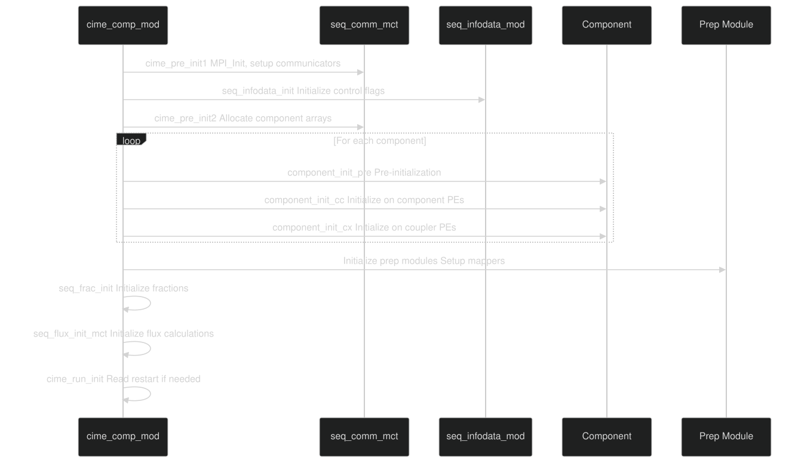

# CIME Driver and MCT

Relevant source files

- [cime_config/allactive/config_pesall.xml](https://github.com/jingtao-lbl/E3SM/blob/389f40b9/cime_config/allactive/config_pesall.xml)
- [cime_config/customize/provenance.py](https://github.com/jingtao-lbl/E3SM/blob/389f40b9/cime_config/customize/provenance.py)
- [cime_config/machines/Depends.oneapi-ifx.cmake](https://github.com/jingtao-lbl/E3SM/blob/389f40b9/cime_config/machines/Depends.oneapi-ifx.cmake)
- [cime_config/machines/Depends.oneapi-ifxgpu.cmake](https://github.com/jingtao-lbl/E3SM/blob/389f40b9/cime_config/machines/Depends.oneapi-ifxgpu.cmake)
- [cime_config/machines/cmake_macros/gnu_WSL2.cmake](https://github.com/jingtao-lbl/E3SM/blob/389f40b9/cime_config/machines/cmake_macros/gnu_WSL2.cmake)
- [cime_config/machines/cmake_macros/gnu_gcp10.cmake](https://github.com/jingtao-lbl/E3SM/blob/389f40b9/cime_config/machines/cmake_macros/gnu_gcp10.cmake)
- [cime_config/machines/cmake_macros/gnu_gcp12.cmake](https://github.com/jingtao-lbl/E3SM/blob/389f40b9/cime_config/machines/cmake_macros/gnu_gcp12.cmake)
- [cime_config/machines/cmake_macros/gnugpu_polaris.cmake](https://github.com/jingtao-lbl/E3SM/blob/389f40b9/cime_config/machines/cmake_macros/gnugpu_polaris.cmake)
- [cime_config/machines/cmake_macros/gnugpu_weaver.cmake](https://github.com/jingtao-lbl/E3SM/blob/389f40b9/cime_config/machines/cmake_macros/gnugpu_weaver.cmake)
- [cime_config/machines/cmake_macros/intel_quartz.cmake](https://github.com/jingtao-lbl/E3SM/blob/389f40b9/cime_config/machines/cmake_macros/intel_quartz.cmake)
- [cime_config/machines/cmake_macros/intel_ruby.cmake](https://github.com/jingtao-lbl/E3SM/blob/389f40b9/cime_config/machines/cmake_macros/intel_ruby.cmake)
- [cime_config/machines/cmake_macros/nvidia_polaris.cmake](https://github.com/jingtao-lbl/E3SM/blob/389f40b9/cime_config/machines/cmake_macros/nvidia_polaris.cmake)
- [cime_config/machines/cmake_macros/nvidiagpu_polaris.cmake](https://github.com/jingtao-lbl/E3SM/blob/389f40b9/cime_config/machines/cmake_macros/nvidiagpu_polaris.cmake)
- [cime_config/machines/cmake_macros/oneapi-ifx_aurora.cmake](https://github.com/jingtao-lbl/E3SM/blob/389f40b9/cime_config/machines/cmake_macros/oneapi-ifx_aurora.cmake)
- [cime_config/machines/cmake_macros/oneapi-ifxgpu_aurora.cmake](https://github.com/jingtao-lbl/E3SM/blob/389f40b9/cime_config/machines/cmake_macros/oneapi-ifxgpu_aurora.cmake)
- [cime_config/machines/config_batch.xml](https://github.com/jingtao-lbl/E3SM/blob/389f40b9/cime_config/machines/config_batch.xml)
- [cime_config/machines/config_machines.xml](https://github.com/jingtao-lbl/E3SM/blob/389f40b9/cime_config/machines/config_machines.xml)
- [cime_config/machines/config_pio.xml](https://github.com/jingtao-lbl/E3SM/blob/389f40b9/cime_config/machines/config_pio.xml)
- [cime_config/machines/syslog.alvarez](https://github.com/jingtao-lbl/E3SM/blob/389f40b9/cime_config/machines/syslog.alvarez)
- [cime_config/machines/syslog.pm-cpu](https://github.com/jingtao-lbl/E3SM/blob/389f40b9/cime_config/machines/syslog.pm-cpu)
- [cime_config/machines/syslog.pm-gpu](https://github.com/jingtao-lbl/E3SM/blob/389f40b9/cime_config/machines/syslog.pm-gpu)
- [components/eam/cime_config/config_pes.xml](https://github.com/jingtao-lbl/E3SM/blob/389f40b9/components/eam/cime_config/config_pes.xml)
- [components/eamxx/cmake/machine-files/lassen.cmake](https://github.com/jingtao-lbl/E3SM/blob/389f40b9/components/eamxx/cmake/machine-files/lassen.cmake)
- [components/eamxx/cmake/machine-files/muller-cpu.cmake](https://github.com/jingtao-lbl/E3SM/blob/389f40b9/components/eamxx/cmake/machine-files/muller-cpu.cmake)
- [components/eamxx/cmake/machine-files/muller-gpu.cmake](https://github.com/jingtao-lbl/E3SM/blob/389f40b9/components/eamxx/cmake/machine-files/muller-gpu.cmake)
- [components/eamxx/cmake/machine-files/quartz-intel.cmake](https://github.com/jingtao-lbl/E3SM/blob/389f40b9/components/eamxx/cmake/machine-files/quartz-intel.cmake)
- [components/eamxx/cmake/machine-files/quartz.cmake](https://github.com/jingtao-lbl/E3SM/blob/389f40b9/components/eamxx/cmake/machine-files/quartz.cmake)
- [components/eamxx/cmake/machine-files/ruby-intel.cmake](https://github.com/jingtao-lbl/E3SM/blob/389f40b9/components/eamxx/cmake/machine-files/ruby-intel.cmake)
- [components/eamxx/cmake/machine-files/ruby.cmake](https://github.com/jingtao-lbl/E3SM/blob/389f40b9/components/eamxx/cmake/machine-files/ruby.cmake)
- [components/eamxx/cmake/machine-files/weaver.cmake](https://github.com/jingtao-lbl/E3SM/blob/389f40b9/components/eamxx/cmake/machine-files/weaver.cmake)
- [components/eamxx/scripts/machines_specs.py](https://github.com/jingtao-lbl/E3SM/blob/389f40b9/components/eamxx/scripts/machines_specs.py)
- [components/eamxx/scripts/update-all-pip](https://github.com/jingtao-lbl/E3SM/blob/389f40b9/components/eamxx/scripts/update-all-pip)
- [components/elm/cime_config/config_pes.xml](https://github.com/jingtao-lbl/E3SM/blob/389f40b9/components/elm/cime_config/config_pes.xml)
- [components/elm/cime_config/testdefs/testmods_dirs/elm/erosion/shell_commands](https://github.com/jingtao-lbl/E3SM/blob/389f40b9/components/elm/cime_config/testdefs/testmods_dirs/elm/erosion/shell_commands)
- [components/elm/cime_config/testdefs/testmods_dirs/elm/erosion/user_nl_elm](https://github.com/jingtao-lbl/E3SM/blob/389f40b9/components/elm/cime_config/testdefs/testmods_dirs/elm/erosion/user_nl_elm)
- [components/mpas-albany-landice/cime_config/config_pes.xml](https://github.com/jingtao-lbl/E3SM/blob/389f40b9/components/mpas-albany-landice/cime_config/config_pes.xml)
- [components/mpas-ocean/cime_config/config_pes.xml](https://github.com/jingtao-lbl/E3SM/blob/389f40b9/components/mpas-ocean/cime_config/config_pes.xml)
- [components/mpas-seaice/cime_config/config_pes.xml](https://github.com/jingtao-lbl/E3SM/blob/389f40b9/components/mpas-seaice/cime_config/config_pes.xml)
- [driver-mct/cime_config/buildexe](https://github.com/jingtao-lbl/E3SM/blob/389f40b9/driver-mct/cime_config/buildexe)
- [driver-mct/cime_config/buildnml](https://github.com/jingtao-lbl/E3SM/blob/389f40b9/driver-mct/cime_config/buildnml)
- [driver-mct/cime_config/config_component.xml](https://github.com/jingtao-lbl/E3SM/blob/389f40b9/driver-mct/cime_config/config_component.xml)
- [driver-mct/cime_config/config_component_cesm.xml](https://github.com/jingtao-lbl/E3SM/blob/389f40b9/driver-mct/cime_config/config_component_cesm.xml)
- [driver-mct/cime_config/config_compsets.xml](https://github.com/jingtao-lbl/E3SM/blob/389f40b9/driver-mct/cime_config/config_compsets.xml)
- [driver-mct/cime_config/config_pes.xml](https://github.com/jingtao-lbl/E3SM/blob/389f40b9/driver-mct/cime_config/config_pes.xml)
- [driver-mct/cime_config/namelist_definition_drv.xml](https://github.com/jingtao-lbl/E3SM/blob/389f40b9/driver-mct/cime_config/namelist_definition_drv.xml)
- [driver-mct/cime_config/testdefs/testlist_drv.xml](https://github.com/jingtao-lbl/E3SM/blob/389f40b9/driver-mct/cime_config/testdefs/testlist_drv.xml)
- [driver-mct/cime_config/user_nl_cpl](https://github.com/jingtao-lbl/E3SM/blob/389f40b9/driver-mct/cime_config/user_nl_cpl)
- [driver-mct/main/CMakeLists.txt](https://github.com/jingtao-lbl/E3SM/blob/389f40b9/driver-mct/main/CMakeLists.txt)
- [driver-mct/main/cime_comp_mod.F90](https://github.com/jingtao-lbl/E3SM/blob/389f40b9/driver-mct/main/cime_comp_mod.F90)
- [driver-mct/main/component_mod.F90](https://github.com/jingtao-lbl/E3SM/blob/389f40b9/driver-mct/main/component_mod.F90)
- [driver-mct/main/component_type_mod.F90](https://github.com/jingtao-lbl/E3SM/blob/389f40b9/driver-mct/main/component_type_mod.F90)
- [driver-mct/main/cplcomp_exchange_mod.F90](https://github.com/jingtao-lbl/E3SM/blob/389f40b9/driver-mct/main/cplcomp_exchange_mod.F90)
- [driver-mct/main/map_glc2lnd_mod.F90](https://github.com/jingtao-lbl/E3SM/blob/389f40b9/driver-mct/main/map_glc2lnd_mod.F90)
- [driver-mct/main/map_lnd2glc_mod.F90](https://github.com/jingtao-lbl/E3SM/blob/389f40b9/driver-mct/main/map_lnd2glc_mod.F90)
- [driver-mct/main/mrg_mod.F90](https://github.com/jingtao-lbl/E3SM/blob/389f40b9/driver-mct/main/mrg_mod.F90)
- [driver-mct/main/prep_aoflux_mod.F90](https://github.com/jingtao-lbl/E3SM/blob/389f40b9/driver-mct/main/prep_aoflux_mod.F90)
- [driver-mct/main/prep_atm_mod.F90](https://github.com/jingtao-lbl/E3SM/blob/389f40b9/driver-mct/main/prep_atm_mod.F90)
- [driver-mct/main/prep_glc_mod.F90](https://github.com/jingtao-lbl/E3SM/blob/389f40b9/driver-mct/main/prep_glc_mod.F90)
- [driver-mct/main/prep_ice_mod.F90](https://github.com/jingtao-lbl/E3SM/blob/389f40b9/driver-mct/main/prep_ice_mod.F90)
- [driver-mct/main/prep_lnd_mod.F90](https://github.com/jingtao-lbl/E3SM/blob/389f40b9/driver-mct/main/prep_lnd_mod.F90)
- [driver-mct/main/prep_ocn_mod.F90](https://github.com/jingtao-lbl/E3SM/blob/389f40b9/driver-mct/main/prep_ocn_mod.F90)
- [driver-mct/main/prep_rof_mod.F90](https://github.com/jingtao-lbl/E3SM/blob/389f40b9/driver-mct/main/prep_rof_mod.F90)
- [driver-mct/main/seq_diag_mct.F90](https://github.com/jingtao-lbl/E3SM/blob/389f40b9/driver-mct/main/seq_diag_mct.F90)
- [driver-mct/main/seq_domain_mct.F90](https://github.com/jingtao-lbl/E3SM/blob/389f40b9/driver-mct/main/seq_domain_mct.F90)
- [driver-mct/main/seq_flux_mct.F90](https://github.com/jingtao-lbl/E3SM/blob/389f40b9/driver-mct/main/seq_flux_mct.F90)
- [driver-mct/main/seq_frac_mct.F90](https://github.com/jingtao-lbl/E3SM/blob/389f40b9/driver-mct/main/seq_frac_mct.F90)
- [driver-mct/main/seq_hist_mod.F90](https://github.com/jingtao-lbl/E3SM/blob/389f40b9/driver-mct/main/seq_hist_mod.F90)
- [driver-mct/main/seq_io_mod.F90](https://github.com/jingtao-lbl/E3SM/blob/389f40b9/driver-mct/main/seq_io_mod.F90)
- [driver-mct/main/seq_map_mod.F90](https://github.com/jingtao-lbl/E3SM/blob/389f40b9/driver-mct/main/seq_map_mod.F90)
- [driver-mct/main/seq_map_type_mod.F90](https://github.com/jingtao-lbl/E3SM/blob/389f40b9/driver-mct/main/seq_map_type_mod.F90)
- [driver-mct/main/seq_rest_mod.F90](https://github.com/jingtao-lbl/E3SM/blob/389f40b9/driver-mct/main/seq_rest_mod.F90)
- [driver-mct/shr/CMakeLists.txt](https://github.com/jingtao-lbl/E3SM/blob/389f40b9/driver-mct/shr/CMakeLists.txt)
- [driver-mct/shr/glc_elevclass_mod.F90](https://github.com/jingtao-lbl/E3SM/blob/389f40b9/driver-mct/shr/glc_elevclass_mod.F90)
- [driver-mct/shr/seq_cdata_mod.F90](https://github.com/jingtao-lbl/E3SM/blob/389f40b9/driver-mct/shr/seq_cdata_mod.F90)
- [driver-mct/shr/seq_comm_mct.F90](https://github.com/jingtao-lbl/E3SM/blob/389f40b9/driver-mct/shr/seq_comm_mct.F90)
- [driver-mct/shr/seq_drydep_mod.F90](https://github.com/jingtao-lbl/E3SM/blob/389f40b9/driver-mct/shr/seq_drydep_mod.F90)
- [driver-mct/shr/seq_flds_mod.F90](https://github.com/jingtao-lbl/E3SM/blob/389f40b9/driver-mct/shr/seq_flds_mod.F90)
- [driver-mct/shr/seq_infodata_mod.F90](https://github.com/jingtao-lbl/E3SM/blob/389f40b9/driver-mct/shr/seq_infodata_mod.F90)
- [driver-mct/shr/seq_io_read_mod.F90](https://github.com/jingtao-lbl/E3SM/blob/389f40b9/driver-mct/shr/seq_io_read_mod.F90)
- [driver-mct/shr/seq_timemgr_mod.F90](https://github.com/jingtao-lbl/E3SM/blob/389f40b9/driver-mct/shr/seq_timemgr_mod.F90)
- [driver-mct/shr/shr_expr_parser_mod.F90](https://github.com/jingtao-lbl/E3SM/blob/389f40b9/driver-mct/shr/shr_expr_parser_mod.F90)
- [driver-mct/shr/shr_fire_emis_mod.F90](https://github.com/jingtao-lbl/E3SM/blob/389f40b9/driver-mct/shr/shr_fire_emis_mod.F90)
- [driver-mct/shr/shr_megan_mod.F90](https://github.com/jingtao-lbl/E3SM/blob/389f40b9/driver-mct/shr/shr_megan_mod.F90)
- [driver-mct/unit_test/CMakeLists.txt](https://github.com/jingtao-lbl/E3SM/blob/389f40b9/driver-mct/unit_test/CMakeLists.txt)
- [driver-mct/unit_test/avect_wrapper_test/CMakeLists.txt](https://github.com/jingtao-lbl/E3SM/blob/389f40b9/driver-mct/unit_test/avect_wrapper_test/CMakeLists.txt)
- [driver-mct/unit_test/avect_wrapper_test/test_avect_wrapper.pf](https://github.com/jingtao-lbl/E3SM/blob/389f40b9/driver-mct/unit_test/avect_wrapper_test/test_avect_wrapper.pf)
- [driver-mct/unit_test/glc_elevclass_test/test_glc_elevclass.pf](https://github.com/jingtao-lbl/E3SM/blob/389f40b9/driver-mct/unit_test/glc_elevclass_test/test_glc_elevclass.pf)
- [driver-mct/unit_test/map_glc2lnd_test/test_map_glc2lnd.pf](https://github.com/jingtao-lbl/E3SM/blob/389f40b9/driver-mct/unit_test/map_glc2lnd_test/test_map_glc2lnd.pf)
- [driver-mct/unit_test/seq_map_test/CMakeLists.txt](https://github.com/jingtao-lbl/E3SM/blob/389f40b9/driver-mct/unit_test/seq_map_test/CMakeLists.txt)
- [driver-mct/unit_test/seq_map_test/test_seq_map.pf](https://github.com/jingtao-lbl/E3SM/blob/389f40b9/driver-mct/unit_test/seq_map_test/test_seq_map.pf)
- [driver-mct/unit_test/stubs/CMakeLists.txt](https://github.com/jingtao-lbl/E3SM/blob/389f40b9/driver-mct/unit_test/stubs/CMakeLists.txt)
- [driver-mct/unit_test/utils/CMakeLists.txt](https://github.com/jingtao-lbl/E3SM/blob/389f40b9/driver-mct/unit_test/utils/CMakeLists.txt)
- [driver-mct/unit_test/utils/avect_wrapper_mod.F90](https://github.com/jingtao-lbl/E3SM/blob/389f40b9/driver-mct/unit_test/utils/avect_wrapper_mod.F90)
- [driver-mct/unit_test/utils/mct_wrapper_mod.F90](https://github.com/jingtao-lbl/E3SM/blob/389f40b9/driver-mct/unit_test/utils/mct_wrapper_mod.F90)
- [driver-mct/unit_test/utils/simple_map_mod.F90](https://github.com/jingtao-lbl/E3SM/blob/389f40b9/driver-mct/unit_test/utils/simple_map_mod.F90)
- [share/util/shr_infnan_mod.F90.in](https://github.com/jingtao-lbl/E3SM/blob/389f40b9/share/util/shr_infnan_mod.F90.in)

## Purpose and Scope

This document describes the MCT-based driver implementation in E3SM ( `driver-mct/` ), which orchestrates the execution of coupled model components and manages data exchange using the Model Coupling Toolkit (MCT). The driver coordinates atmosphere (EAM), ocean (MPAS-Ocean), sea ice (MPAS-Seaice), land (ELM), river routing (MOSART), land ice (MALI), and wave components through a hub-and-spoke coupling architecture.

For information about the alternative MOAB-based driver with advanced unstructured mesh capabilities, see [MOAB Integration](#4.2) . For details on grid mapping strategies and conservative remapping, see [Mapping and Regridding](#4.3) . For atmosphere-ocean flux calculations and fractional grid cell handling, see [Flux Calculations and Fractional Coverage](#4.4) .

## Architecture Overview

The MCT-based driver implements a hub-and-spoke coupling pattern where all component-to-component communication flows through the coupler. Components exchange data via attribute vectors on their native grids, and the driver performs mapping, merging, and flux calculations on coupler processes.

### Driver Architecture

Sources:  [driver-mct/main/cime_comp_mod.F90 1-620](https://github.com/jingtao-lbl/E3SM/blob/389f40b9/driver-mct/main/cime_comp_mod.F90#L1-L620)  [driver-mct/shr/seq_comm_mct.F90 1-150](https://github.com/jingtao-lbl/E3SM/blob/389f40b9/driver-mct/shr/seq_comm_mct.F90#L1-L150)

### Component Classes and Instances

The driver supports multiple instances of each component type through the `seq_comm_mct` module. Component classes are defined with unique IDs and communicators:

| Component Class | ID Constant | Max Instances | Configuration Variable | 
| --- | --- | --- | --- |
| Coupler (CPL) | CPLID | 1 | - | 
| Atmosphere (ATM) | ATMID | NUM_COMP_INST_ATM | NINST_ATM | 
| Land (LND) | LNDID | NUM_COMP_INST_LND | NINST_LND | 
| Ocean (OCN) | OCNID | NUM_COMP_INST_OCN | NINST_OCN | 
| Sea Ice (ICE) | ICEID | NUM_COMP_INST_ICE | NINST_ICE | 
| Land Ice (GLC) | GLCID | NUM_COMP_INST_GLC | NINST_GLC | 
| River (ROF) | ROFID | NUM_COMP_INST_ROF | NINST_ROF | 
| Wave (WAV) | WAVID | NUM_COMP_INST_WAV | NINST_WAV | 
| External System (ESP) | ESPID | NUM_COMP_INST_ESP | NINST_ESP | 
| IAC | IACID | NUM_COMP_INST_IAC | NINST_IAC | 

Sources:  [driver-mct/shr/seq_comm_mct.F90 66-82](https://github.com/jingtao-lbl/E3SM/blob/389f40b9/driver-mct/shr/seq_comm_mct.F90#L66-L82)  [driver-mct/cime_config/config_component.xml 12-18](https://github.com/jingtao-lbl/E3SM/blob/389f40b9/driver-mct/cime_config/config_component.xml#L12-L18)

## Component Initialization

The driver initializes components through a multi-phase process managed by `cime_comp_mod.F90` :

### Initialization Sequence

Sources:  [driver-mct/main/cime_comp_mod.F90 209-214](https://github.com/jingtao-lbl/E3SM/blob/389f40b9/driver-mct/main/cime_comp_mod.F90#L209-L214)  [driver-mct/main/component_mod.F90 1-50](https://github.com/jingtao-lbl/E3SM/blob/389f40b9/driver-mct/main/component_mod.F90#L1-L50)

### Component Initialization Functions

Each component implements three MCT-based interface functions:

- **`<comp>_init_mct`**: Initialize the component, define grid, and create data attribute vectors
- **`<comp>_run_mct`**: Execute one coupling timestep
- **`<comp>_final_mct`**: Finalize the component and clean up

Sources:  [driver-mct/main/cime_comp_mod.F90 50-58](https://github.com/jingtao-lbl/E3SM/blob/389f40b9/driver-mct/main/cime_comp_mod.F90#L50-L58)  [driver-mct/shr/seq_flds_mod.F90 1-200](https://github.com/jingtao-lbl/E3SM/blob/389f40b9/driver-mct/shr/seq_flds_mod.F90#L1-L200)

## Data Exchange Patterns

The driver uses MCT attribute vectors ( `mct_aVect` ) to exchange data between components. Field naming follows a standardized convention defined in `seq_flds_mod.F90` .

### Field Naming Convention

Fields use prefixes to indicate their origin and destination:

| Prefix | Meaning | Example | 
| --- | --- | --- |
| Sa_ | Atmosphere state | Sa_z (height), Sa_tbot (temperature) | 
| Sl_ | Land state | Sl_t (temperature) | 
| Si_ | Ice state | Si_t (temperature), Si_ifrac (ice fraction) | 
| So_ | Ocean state | So_t (temperature), So_s (salinity) | 
| Sx_ | Merged state | Sx_t (merged temperature on coupler) | 
| Faxa_ | Atm→x flux computed by atm | Faxa_lwdn (longwave down) | 
| Flrr_ | Lnd→rof flux | Flrr_flood (flood water) | 
| Fioi_ | Ice→ocn flux computed by ice | Fioi_melth (melt heat flux) | 

Sources:  [driver-mct/shr/seq_flds_mod.F90 1-120](https://github.com/jingtao-lbl/E3SM/blob/389f40b9/driver-mct/shr/seq_flds_mod.F90#L1-L120)

### Attribute Vector Exchange

Sources:  [driver-mct/main/cime_comp_mod.F90 254-280](https://github.com/jingtao-lbl/E3SM/blob/389f40b9/driver-mct/main/cime_comp_mod.F90#L254-L280)

## Communicator Management

The `seq_comm_mct` module manages MPI communicators for component instances and coupler-component interactions.

### Communicator Hierarchy

Sources:  [driver-mct/shr/seq_comm_mct.F90 60-110](https://github.com/jingtao-lbl/E3SM/blob/389f40b9/driver-mct/shr/seq_comm_mct.F90#L60-L110)

### Communicator Initialization

The `seq_comm_init` subroutine in `seq_comm_mct.F90` creates all necessary communicators based on PE layout specifications from `config_pesall.xml` :

Key data structures:

- `mpicom_GLOID`: Global communicator ID
- `mpicom_CPLID`: Coupler communicator ID
- `mpicom_ATM(i)`: Communicator for ATM instance i
- `mpicom_CPLATM(i)`: Joint coupler-ATM instance i communicator

Sources:  [driver-mct/shr/seq_comm_mct.F90 200-500](https://github.com/jingtao-lbl/E3SM/blob/389f40b9/driver-mct/shr/seq_comm_mct.F90#L200-L500)  [cime_config/allactive/config_pesall.xml 1-100](https://github.com/jingtao-lbl/E3SM/blob/389f40b9/cime_config/allactive/config_pesall.xml#L1-L100)

## Prep Modules: Mapping and Merging

Prep modules handle the transformation of data between component grids and merging of multiple sources. Each component has an associated prep module (e.g., `prep_atm_mod` , `prep_ocn_mod` ).

### Prep Module Workflow

Sources:  [driver-mct/main/prep_atm_mod.F90 1-100](https://github.com/jingtao-lbl/E3SM/blob/389f40b9/driver-mct/main/prep_atm_mod.F90#L1-L100) (Note: actual prep_atm_mod not in provided files, but pattern follows prep_glc_mod)

### Mapping Operations

The `seq_map_mod` provides mapping functions using MCT sparse matrix operations:

- **`seq_map_map(mapper, aVin, aVout, fldlist)`**: Map attribute vector from source to destination grid
- **`seq_map_avNorm(aVout, sFrac)`**: Normalize by source fraction
- **`seq_map_avMult(aVout, dFrac)`**: Multiply by destination fraction

Mapping weights are read from mapping files specified in `seq_maps.rc` (generated by `buildnml` ):

Sources:  [driver-mct/cime_config/buildnml 195-258](https://github.com/jingtao-lbl/E3SM/blob/389f40b9/driver-mct/cime_config/buildnml#L195-L258)

### Merging with Fractions

The driver uses `seq_frac_mct` to maintain fractional coverage of surface types:

Merging rule: States from component `c` are weighted by their fraction before summing:

Sources:  [driver-mct/main/cime_comp_mod.F90 272-280](https://github.com/jingtao-lbl/E3SM/blob/389f40b9/driver-mct/main/cime_comp_mod.F90#L272-L280) (cime_run_update_fractions), [driver-mct/shr/seq_flds_mod.F90 40-93](https://github.com/jingtao-lbl/E3SM/blob/389f40b9/driver-mct/shr/seq_flds_mod.F90#L40-L93)

## Time Management

The `seq_timemgr_mod` manages model clocks and alarms for synchronization.

### Clock Structure

Sources:  [driver-mct/main/cime_comp_mod.F90 302-340](https://github.com/jingtao-lbl/E3SM/blob/389f40b9/driver-mct/main/cime_comp_mod.F90#L302-L340)  [driver-mct/shr/seq_timemgr_mod.F90 1-100](https://github.com/jingtao-lbl/E3SM/blob/389f40b9/driver-mct/shr/seq_timemgr_mod.F90#L1-L100)

### Time Stepping Loop

The main time stepping loop in `cime_run` checks alarms and runs components:

Sources:  [driver-mct/main/cime_comp_mod.F90 500-800](https://github.com/jingtao-lbl/E3SM/blob/389f40b9/driver-mct/main/cime_comp_mod.F90#L500-L800)

## Flux Calculations

Atmosphere-ocean flux calculations are performed by `seq_flux_mct` on coupler processes.

### Flux Calculation Methods

The driver supports two flux calculation modes controlled by `atm_flux_method` :

Sources:  [driver-mct/main/seq_flux_mct.F90 1-200](https://github.com/jingtao-lbl/E3SM/blob/389f40b9/driver-mct/main/seq_flux_mct.F90#L1-L200)  [driver-mct/main/cime_comp_mod.F90 220](https://github.com/jingtao-lbl/E3SM/blob/389f40b9/driver-mct/main/cime_comp_mod.F90#L220-L220) (cime_run_atmocn_fluxes)

### Flux Fields

Common flux fields computed by the coupler:

| Field | Description | Units | 
| --- | --- | --- |
| Faox_taux | Zonal wind stress | N/m² | 
| Faox_tauy | Meridional wind stress | N/m² | 
| Faox_sen | Sensible heat flux | W/m² | 
| Faox_lat | Latent heat flux | W/m² | 
| Faox_lwup | Longwave upward | W/m² | 
| Faox_evap | Evaporation | kg/m²/s | 

Sources:  [driver-mct/shr/seq_flds_mod.F90 154-160](https://github.com/jingtao-lbl/E3SM/blob/389f40b9/driver-mct/shr/seq_flds_mod.F90#L154-L160)

## History and Restart Files

### History File Writing

The `seq_hist_mod` module writes coupler history files containing instantaneous and time-averaged fields:

History file naming: `{CASE}.cpl.h{i}.{YYYY-MM-DD-SSSSS}.nc`

Sources:  [driver-mct/main/seq_hist_mod.F90 1-100](https://github.com/jingtao-lbl/E3SM/blob/389f40b9/driver-mct/main/seq_hist_mod.F90#L1-L100)

### Restart File Management

The `seq_rest_mod` module handles reading and writing of restart files:

Restart pointer file ( `rpointer.drv` ) contains:

Sources:  [driver-mct/main/seq_rest_mod.F90 1-100](https://github.com/jingtao-lbl/E3SM/blob/389f40b9/driver-mct/main/seq_rest_mod.F90#L1-L100)  [driver-mct/main/cime_comp_mod.F90 246](https://github.com/jingtao-lbl/E3SM/blob/389f40b9/driver-mct/main/cime_comp_mod.F90#L246-L246) (cime_run_write_restart)

## Configuration and Namelist

### Driver Configuration XML

The driver's configuration is specified in `config_component.xml` :

Key configuration entries:

- `COMP_CLASSES`: List of component classes (CPL,ATM,LND,ICE,OCN,ROF,GLC,WAV,IAC,ESP)
- `COMP_CPL`: Coupler component name (always "cpl")
- `RUN_TYPE`: startup, branch, or hybrid
- `RUN_REFCASE``RUN_REFDATE`, : Reference for branch/hybrid runs
- `STOP_OPTION``STOP_N`, : Run length specification
- `REST_OPTION``REST_N`, : Restart frequency

Sources:  [driver-mct/cime_config/config_component.xml 1-100](https://github.com/jingtao-lbl/E3SM/blob/389f40b9/driver-mct/cime_config/config_component.xml#L1-L100)

### Driver Namelist Generation

The `buildnml` script generates driver namelists:

Sources:  [driver-mct/cime_config/buildnml 1-280](https://github.com/jingtao-lbl/E3SM/blob/389f40b9/driver-mct/cime_config/buildnml#L1-L280)

### Namelist Groups

Main namelist groups in `drv_in` :

| Group | Purpose | Key Variables | 
| --- | --- | --- |
| seq_infodata_inparm | Run metadata | case_name, start_type, model_version | 
| seq_timemgr_inparm | Time management | atm_cpl_dt, ocn_cpl_dt, calendar | 
| seq_cplflds_inparm | Field control | flds_co2a, flds_wiso, glc_nec | 
| cpl_rofacc_inparm | River accumulation | rof_heat, rof2ocn_nutrients | 
| prof_inparm | Performance profiling | timer_level, timing_detail_limit | 

Sources:  [driver-mct/cime_config/namelist_definition_drv.xml 1-300](https://github.com/jingtao-lbl/E3SM/blob/389f40b9/driver-mct/cime_config/namelist_definition_drv.xml#L1-L300)

## Build System Integration

The driver executable is built by `buildexe` :

The driver links against:

- `libatm.a``libocn.a``libice.a`Component libraries: , , , etc.
- `libmct.a``libmpeu.a`MCT library: ,
- `libcsm_share.a`Shared utilities:

Sources:  [driver-mct/cime_config/buildexe 1-56](https://github.com/jingtao-lbl/E3SM/blob/389f40b9/driver-mct/cime_config/buildexe#L1-L56)