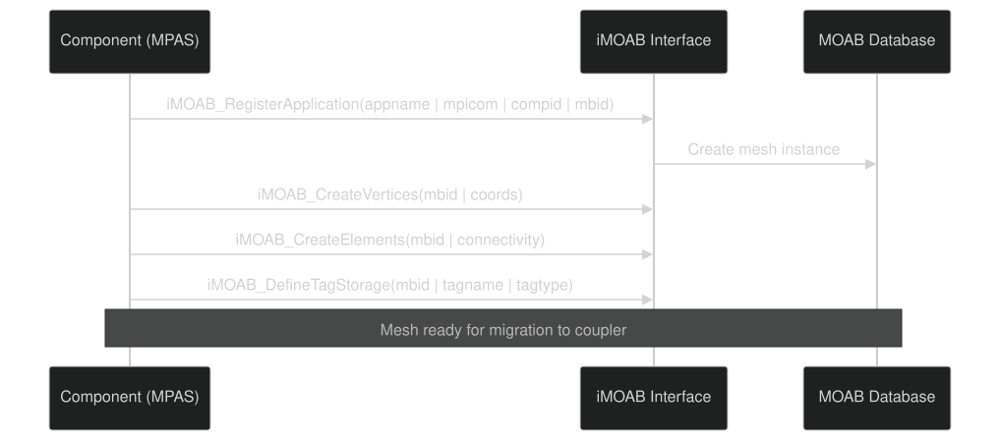
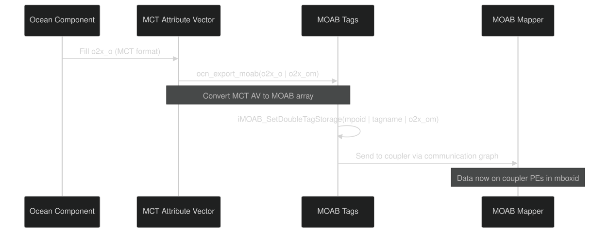
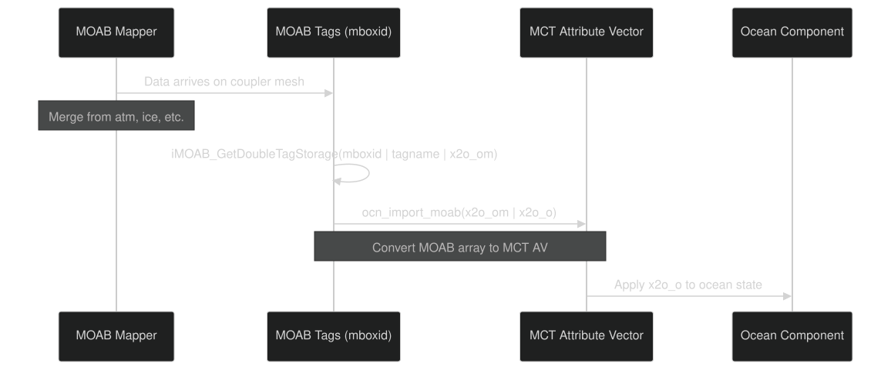

# MOAB Integration

Relevant source files

- [cime_config/config_grids.xml](https://github.com/jingtao-lbl/E3SM/blob/389f40b9/cime_config/config_grids.xml)
- [components/eam/src/chemistry/mozart/mo_drydep.F90](https://github.com/jingtao-lbl/E3SM/blob/389f40b9/components/eam/src/chemistry/mozart/mo_drydep.F90)
- [components/eam/src/chemistry/utils/horizontal_interpolate.F90](https://github.com/jingtao-lbl/E3SM/blob/389f40b9/components/eam/src/chemistry/utils/horizontal_interpolate.F90)
- [components/eam/src/chemistry/utils/prescribed_aero.F90](https://github.com/jingtao-lbl/E3SM/blob/389f40b9/components/eam/src/chemistry/utils/prescribed_aero.F90)
- [components/eam/src/control/apply_iop_forcing.F90](https://github.com/jingtao-lbl/E3SM/blob/389f40b9/components/eam/src/control/apply_iop_forcing.F90)
- [components/eam/src/control/history_iop.F90](https://github.com/jingtao-lbl/E3SM/blob/389f40b9/components/eam/src/control/history_iop.F90)
- [components/eam/src/control/iop_data_mod.F90](https://github.com/jingtao-lbl/E3SM/blob/389f40b9/components/eam/src/control/iop_data_mod.F90)
- [components/eam/src/control/ncdio_atm.F90](https://github.com/jingtao-lbl/E3SM/blob/389f40b9/components/eam/src/control/ncdio_atm.F90)
- [components/eam/src/control/readinitial.F90](https://github.com/jingtao-lbl/E3SM/blob/389f40b9/components/eam/src/control/readinitial.F90)
- [components/eam/src/control/runtime_opts.F90](https://github.com/jingtao-lbl/E3SM/blob/389f40b9/components/eam/src/control/runtime_opts.F90)
- [components/eam/src/cpl/atm_comp_esmf.F90](https://github.com/jingtao-lbl/E3SM/blob/389f40b9/components/eam/src/cpl/atm_comp_esmf.F90)
- [components/eam/src/cpl/atm_comp_mct.F90](https://github.com/jingtao-lbl/E3SM/blob/389f40b9/components/eam/src/cpl/atm_comp_mct.F90)
- [components/eam/src/dynamics/se/dyn_comp.F90](https://github.com/jingtao-lbl/E3SM/blob/389f40b9/components/eam/src/dynamics/se/dyn_comp.F90)
- [components/eam/src/dynamics/se/inidat.F90](https://github.com/jingtao-lbl/E3SM/blob/389f40b9/components/eam/src/dynamics/se/inidat.F90)
- [components/eam/src/dynamics/se/se_iop_intr_mod.F90](https://github.com/jingtao-lbl/E3SM/blob/389f40b9/components/eam/src/dynamics/se/se_iop_intr_mod.F90)
- [components/eam/src/dynamics/se/semoab_mod.F90](https://github.com/jingtao-lbl/E3SM/blob/389f40b9/components/eam/src/dynamics/se/semoab_mod.F90)
- [components/eam/src/dynamics/se/stepon.F90](https://github.com/jingtao-lbl/E3SM/blob/389f40b9/components/eam/src/dynamics/se/stepon.F90)
- [components/eam/src/physics/cam/iop_surf.F90](https://github.com/jingtao-lbl/E3SM/blob/389f40b9/components/eam/src/physics/cam/iop_surf.F90)
- [components/elm/src/cpl/lnd_comp_esmf.F90](https://github.com/jingtao-lbl/E3SM/blob/389f40b9/components/elm/src/cpl/lnd_comp_esmf.F90)
- [components/elm/src/cpl/lnd_comp_mct.F90](https://github.com/jingtao-lbl/E3SM/blob/389f40b9/components/elm/src/cpl/lnd_comp_mct.F90)
- [components/elm/src/utils/elm_varorb.F90](https://github.com/jingtao-lbl/E3SM/blob/389f40b9/components/elm/src/utils/elm_varorb.F90)
- [components/mosart/src/cpl/rof_comp_mct.F90](https://github.com/jingtao-lbl/E3SM/blob/389f40b9/components/mosart/src/cpl/rof_comp_mct.F90)
- [components/mpas-albany-landice/cime_config/config_compsets.xml](https://github.com/jingtao-lbl/E3SM/blob/389f40b9/components/mpas-albany-landice/cime_config/config_compsets.xml)
- [components/mpas-albany-landice/driver/glc_comp_mct.F](https://github.com/jingtao-lbl/E3SM/blob/389f40b9/components/mpas-albany-landice/driver/glc_comp_mct.F)
- [components/mpas-albany-landice/driver/glc_cpl_indices.F](https://github.com/jingtao-lbl/E3SM/blob/389f40b9/components/mpas-albany-landice/driver/glc_cpl_indices.F)
- [components/mpas-framework/src/framework/mpas_moabmesh.F](https://github.com/jingtao-lbl/E3SM/blob/389f40b9/components/mpas-framework/src/framework/mpas_moabmesh.F)
- [components/mpas-ocean/cime_config/buildnml](https://github.com/jingtao-lbl/E3SM/blob/389f40b9/components/mpas-ocean/cime_config/buildnml)
- [components/mpas-ocean/cime_config/config_component.xml](https://github.com/jingtao-lbl/E3SM/blob/389f40b9/components/mpas-ocean/cime_config/config_component.xml)
- [components/mpas-ocean/cime_config/config_compsets.xml](https://github.com/jingtao-lbl/E3SM/blob/389f40b9/components/mpas-ocean/cime_config/config_compsets.xml)
- [components/mpas-ocean/driver/ocn_comp_mct.F](https://github.com/jingtao-lbl/E3SM/blob/389f40b9/components/mpas-ocean/driver/ocn_comp_mct.F)
- [components/mpas-seaice/bld/build-namelist](https://github.com/jingtao-lbl/E3SM/blob/389f40b9/components/mpas-seaice/bld/build-namelist)
- [components/mpas-seaice/bld/build-namelist-group-list](https://github.com/jingtao-lbl/E3SM/blob/389f40b9/components/mpas-seaice/bld/build-namelist-group-list)
- [components/mpas-seaice/bld/build-namelist-section](https://github.com/jingtao-lbl/E3SM/blob/389f40b9/components/mpas-seaice/bld/build-namelist-section)
- [components/mpas-seaice/bld/namelist_files/namelist_defaults_mpassi.xml](https://github.com/jingtao-lbl/E3SM/blob/389f40b9/components/mpas-seaice/bld/namelist_files/namelist_defaults_mpassi.xml)
- [components/mpas-seaice/bld/namelist_files/namelist_definition_mpassi.xml](https://github.com/jingtao-lbl/E3SM/blob/389f40b9/components/mpas-seaice/bld/namelist_files/namelist_definition_mpassi.xml)
- [components/mpas-seaice/cime_config/buildnml](https://github.com/jingtao-lbl/E3SM/blob/389f40b9/components/mpas-seaice/cime_config/buildnml)
- [components/mpas-seaice/cime_config/config_component.xml](https://github.com/jingtao-lbl/E3SM/blob/389f40b9/components/mpas-seaice/cime_config/config_component.xml)
- [components/mpas-seaice/cime_config/config_compsets.xml](https://github.com/jingtao-lbl/E3SM/blob/389f40b9/components/mpas-seaice/cime_config/config_compsets.xml)
- [components/mpas-seaice/driver/ice_comp_mct.F](https://github.com/jingtao-lbl/E3SM/blob/389f40b9/components/mpas-seaice/driver/ice_comp_mct.F)
- [components/mpas-seaice/driver/mpassi_cpl_indices.F](https://github.com/jingtao-lbl/E3SM/blob/389f40b9/components/mpas-seaice/driver/mpassi_cpl_indices.F)
- [components/mpas-seaice/src/Makefile](https://github.com/jingtao-lbl/E3SM/blob/389f40b9/components/mpas-seaice/src/Makefile)
- [components/mpas-seaice/src/Makefile.icepack](https://github.com/jingtao-lbl/E3SM/blob/389f40b9/components/mpas-seaice/src/Makefile.icepack)
- [components/mpas-seaice/src/Registry.xml](https://github.com/jingtao-lbl/E3SM/blob/389f40b9/components/mpas-seaice/src/Registry.xml)
- [components/mpas-seaice/src/analysis_members/mpas_seaice_temperatures.F](https://github.com/jingtao-lbl/E3SM/blob/389f40b9/components/mpas-seaice/src/analysis_members/mpas_seaice_temperatures.F)
- [components/mpas-seaice/src/model_forward/mpas_seaice_core.F](https://github.com/jingtao-lbl/E3SM/blob/389f40b9/components/mpas-seaice/src/model_forward/mpas_seaice_core.F)
- [components/mpas-seaice/src/seaice.cmake](https://github.com/jingtao-lbl/E3SM/blob/389f40b9/components/mpas-seaice/src/seaice.cmake)
- [components/mpas-seaice/src/shared/Makefile](https://github.com/jingtao-lbl/E3SM/blob/389f40b9/components/mpas-seaice/src/shared/Makefile)
- [components/mpas-seaice/src/shared/mpas_seaice_column.F](https://github.com/jingtao-lbl/E3SM/blob/389f40b9/components/mpas-seaice/src/shared/mpas_seaice_column.F)
- [components/mpas-seaice/src/shared/mpas_seaice_constants.F](https://github.com/jingtao-lbl/E3SM/blob/389f40b9/components/mpas-seaice/src/shared/mpas_seaice_constants.F)
- [components/mpas-seaice/src/shared/mpas_seaice_forcing.F](https://github.com/jingtao-lbl/E3SM/blob/389f40b9/components/mpas-seaice/src/shared/mpas_seaice_forcing.F)
- [components/mpas-seaice/src/shared/mpas_seaice_icepack.F](https://github.com/jingtao-lbl/E3SM/blob/389f40b9/components/mpas-seaice/src/shared/mpas_seaice_icepack.F)
- [components/mpas-seaice/src/shared/mpas_seaice_initialize.F](https://github.com/jingtao-lbl/E3SM/blob/389f40b9/components/mpas-seaice/src/shared/mpas_seaice_initialize.F)
- [components/mpas-seaice/src/shared/mpas_seaice_mesh.F](https://github.com/jingtao-lbl/E3SM/blob/389f40b9/components/mpas-seaice/src/shared/mpas_seaice_mesh.F)
- [components/mpas-seaice/src/shared/mpas_seaice_prescribed.F](https://github.com/jingtao-lbl/E3SM/blob/389f40b9/components/mpas-seaice/src/shared/mpas_seaice_prescribed.F)
- [components/mpas-seaice/src/shared/mpas_seaice_time_integration.F](https://github.com/jingtao-lbl/E3SM/blob/389f40b9/components/mpas-seaice/src/shared/mpas_seaice_time_integration.F)
- [components/mpas-seaice/src/shared/mpas_seaice_triangle_quadrature.F](https://github.com/jingtao-lbl/E3SM/blob/389f40b9/components/mpas-seaice/src/shared/mpas_seaice_triangle_quadrature.F)
- [components/mpas-seaice/src/shared/mpas_seaice_velocity_solver.F](https://github.com/jingtao-lbl/E3SM/blob/389f40b9/components/mpas-seaice/src/shared/mpas_seaice_velocity_solver.F)
- [components/mpas-seaice/src/shared/mpas_seaice_velocity_solver_constitutive_relation.F](https://github.com/jingtao-lbl/E3SM/blob/389f40b9/components/mpas-seaice/src/shared/mpas_seaice_velocity_solver_constitutive_relation.F)
- [components/mpas-seaice/src/shared/mpas_seaice_velocity_solver_pwl.F](https://github.com/jingtao-lbl/E3SM/blob/389f40b9/components/mpas-seaice/src/shared/mpas_seaice_velocity_solver_pwl.F)
- [components/mpas-seaice/src/shared/mpas_seaice_velocity_solver_variational.F](https://github.com/jingtao-lbl/E3SM/blob/389f40b9/components/mpas-seaice/src/shared/mpas_seaice_velocity_solver_variational.F)
- [components/mpas-seaice/src/shared/mpas_seaice_velocity_solver_variational_shared.F](https://github.com/jingtao-lbl/E3SM/blob/389f40b9/components/mpas-seaice/src/shared/mpas_seaice_velocity_solver_variational_shared.F)
- [components/mpas-seaice/src/shared/mpas_seaice_velocity_solver_wachspress.F](https://github.com/jingtao-lbl/E3SM/blob/389f40b9/components/mpas-seaice/src/shared/mpas_seaice_velocity_solver_wachspress.F)
- [components/mpas-seaice/src/shared/mpas_seaice_velocity_solver_weak.F](https://github.com/jingtao-lbl/E3SM/blob/389f40b9/components/mpas-seaice/src/shared/mpas_seaice_velocity_solver_weak.F)
- [driver-moab/main/cime_comp_mod.F90](https://github.com/jingtao-lbl/E3SM/blob/389f40b9/driver-moab/main/cime_comp_mod.F90)
- [driver-moab/main/component_mod.F90](https://github.com/jingtao-lbl/E3SM/blob/389f40b9/driver-moab/main/component_mod.F90)
- [driver-moab/main/component_type_mod.F90](https://github.com/jingtao-lbl/E3SM/blob/389f40b9/driver-moab/main/component_type_mod.F90)
- [driver-moab/main/cplcomp_exchange_mod.F90](https://github.com/jingtao-lbl/E3SM/blob/389f40b9/driver-moab/main/cplcomp_exchange_mod.F90)
- [driver-moab/main/prep_aoflux_mod.F90](https://github.com/jingtao-lbl/E3SM/blob/389f40b9/driver-moab/main/prep_aoflux_mod.F90)
- [driver-moab/main/prep_atm_mod.F90](https://github.com/jingtao-lbl/E3SM/blob/389f40b9/driver-moab/main/prep_atm_mod.F90)
- [driver-moab/main/prep_ice_mod.F90](https://github.com/jingtao-lbl/E3SM/blob/389f40b9/driver-moab/main/prep_ice_mod.F90)
- [driver-moab/main/prep_lnd_mod.F90](https://github.com/jingtao-lbl/E3SM/blob/389f40b9/driver-moab/main/prep_lnd_mod.F90)
- [driver-moab/main/prep_ocn_mod.F90](https://github.com/jingtao-lbl/E3SM/blob/389f40b9/driver-moab/main/prep_ocn_mod.F90)
- [driver-moab/main/prep_rof_mod.F90](https://github.com/jingtao-lbl/E3SM/blob/389f40b9/driver-moab/main/prep_rof_mod.F90)
- [driver-moab/main/seq_flux_mct.F90](https://github.com/jingtao-lbl/E3SM/blob/389f40b9/driver-moab/main/seq_flux_mct.F90)
- [driver-moab/main/seq_frac_mct.F90](https://github.com/jingtao-lbl/E3SM/blob/389f40b9/driver-moab/main/seq_frac_mct.F90)
- [driver-moab/main/seq_io_mod.F90](https://github.com/jingtao-lbl/E3SM/blob/389f40b9/driver-moab/main/seq_io_mod.F90)
- [driver-moab/main/seq_map_mod.F90](https://github.com/jingtao-lbl/E3SM/blob/389f40b9/driver-moab/main/seq_map_mod.F90)
- [driver-moab/main/seq_map_type_mod.F90](https://github.com/jingtao-lbl/E3SM/blob/389f40b9/driver-moab/main/seq_map_type_mod.F90)
- [driver-moab/main/seq_rest_mod.F90](https://github.com/jingtao-lbl/E3SM/blob/389f40b9/driver-moab/main/seq_rest_mod.F90)
- [driver-moab/shr/seq_comm_mct.F90](https://github.com/jingtao-lbl/E3SM/blob/389f40b9/driver-moab/shr/seq_comm_mct.F90)

## Purpose and Scope

This document describes E3SM's MOAB (Mesh-Oriented datABase) integration for advanced unstructured mesh coupling. MOAB provides an alternative to the MCT-based driver by enabling exact conservative remapping on unstructured grids, particularly beneficial for MPAS (Model for Prediction Across Scales) ocean and sea ice components.

For information about the traditional MCT-based coupling approach, see [CIME Driver and MCT](#4.1) . For general mapping and regridding concepts applicable to both drivers, see [Mapping and Regridding](#4.3) .

## MOAB Overview

MOAB is a mesh database library that provides tools for storing and manipulating unstructured mesh data. In E3SM, MOAB enables:

- **Exact mesh intersection**: Computes overlaps between component grids on the sphere with geometric precision
- **Dynamic weight generation**: Calculates remapping weights at runtime rather than using pre-computed weight files
- **Unstructured mesh support**: Naturally handles MPAS Voronoi meshes and spectral element grids
- **Conservative remapping**: Guarantees conservation properties through area-weighted intersection

The MOAB integration is implemented through the iMOAB (Interface to MOAB) API, which provides Fortran bindings to MOAB's C++ functionality.

Key MOAB Identifiers:

- `mhid`: iMOAB application ID for atmosphere instance on component PEs
- `mpoid`: iMOAB application ID for ocean mesh on component PEs
- `MPSIID`: iMOAB application ID for sea ice on component PEs
- `mbaxid`: iMOAB ID for atmosphere mesh migrated to coupler PEs
- `mboxid`: iMOAB ID for ocean mesh migrated to coupler PEs
- `mbixid`: iMOAB ID for sea ice mesh migrated to coupler PEs
- `mbintxao`: iMOAB ID for intersection mesh between atmosphere and ocean
- `mbintxoa`: iMOAB ID for intersection mesh between ocean and atmosphere

Sources: [driver-moab/main/prep_ocn_mod.F90 1-175](https://github.com/jingtao-lbl/E3SM/blob/389f40b9/driver-moab/main/prep_ocn_mod.F90#L1-L175)  [driver-moab/shr/seq_comm_mct.F90 1-100](https://github.com/jingtao-lbl/E3SM/blob/389f40b9/driver-moab/shr/seq_comm_mct.F90#L1-L100)

## MOAB-based Driver Architecture

The MOAB-based driver follows a three-phase workflow:

Sources: [driver-moab/main/prep_ocn_mod.F90 200-510](https://github.com/jingtao-lbl/E3SM/blob/389f40b9/driver-moab/main/prep_ocn_mod.F90#L200-L510)  [driver-moab/main/prep_atm_mod.F90 125-300](https://github.com/jingtao-lbl/E3SM/blob/389f40b9/driver-moab/main/prep_atm_mod.F90#L125-L300)

## Mesh Registration and Migration

### Component-Side Registration

Each component registers its mesh with iMOAB during initialization. For MPAS components (ocean and sea ice), this involves creating a MOAB mesh representation:

MPAS ocean registration occurs in [components/mpas-ocean/driver/ocn_comp_mct.F 600-850](https://github.com/jingtao-lbl/E3SM/blob/389f40b9/components/mpas-ocean/driver/ocn_comp_mct.F#L600-L850) :

- Creates vertices from cell center coordinates
- Defines connectivity for Voronoi cells
- `o2x``x2o`Registers field tags for (ocean-to-coupler) and (coupler-to-ocean) exchange

Sea ice follows a similar pattern in [components/mpas-seaice/driver/ice_comp_mct.F 500-700](https://github.com/jingtao-lbl/E3SM/blob/389f40b9/components/mpas-seaice/driver/ice_comp_mct.F#L500-L700)

### Mesh Migration to Coupler PEs

After component registration, meshes are migrated to coupler PEs using coverage-based communication graphs:

The migration process for ocean is implemented in [driver-moab/main/cplcomp_exchange_mod.F90 200-400](https://github.com/jingtao-lbl/E3SM/blob/389f40b9/driver-moab/main/cplcomp_exchange_mod.F90#L200-L400) :

Key function: `iMOAB_MigrateMapMesh(appid_src, comm_graph, appid_dest)` transfers mesh from source to destination application context.

Sources: [driver-moab/main/cplcomp_exchange_mod.F90 180-450](https://github.com/jingtao-lbl/E3SM/blob/389f40b9/driver-moab/main/cplcomp_exchange_mod.F90#L180-L450)  [driver-moab/main/prep_ocn_mod.F90 200-280](https://github.com/jingtao-lbl/E3SM/blob/389f40b9/driver-moab/main/prep_ocn_mod.F90#L200-L280)

## Mesh Intersection and Weight Computation

### Sphere Intersection Algorithm

MOAB computes exact intersections between component meshes on the sphere using [driver-moab/main/prep_ocn_mod.F90 404-418](https://github.com/jingtao-lbl/E3SM/blob/389f40b9/driver-moab/main/prep_ocn_mod.F90#L404-L418) :

This creates a new mesh ( `mbintxao` ) representing the geometric overlay of atmosphere ( `mbaxid` ) and ocean ( `mboxid` ) grids. The intersection mesh stores:

- **Intersection polygons**: Regions where source and target cells overlap
- **Area fractions**: Relative areas for conservative weighting
- **Parent cell references**: Links back to source and target cells

### Weight Generation

After intersection, remapping weights are computed based on discretization methods:

| Source Grid | Target Grid | Method | MOAB Function | 
| --- | --- | --- | --- |
| FV (Finite Volume) | FV | Bilinear or Conservative | iMOAB_ComputeScalarProjectionWeights | 
| SE (Spectral Element) | FV | High-order projection | iMOAB_ComputeScalarProjectionWeights | 
| CGLL (Gauss-Lobatto) | FV | Integration-based | iMOAB_ComputeScalarProjectionWeights | 

Example weight computation from [driver-moab/main/prep_ocn_mod.F90 488-510](https://github.com/jingtao-lbl/E3SM/blob/389f40b9/driver-moab/main/prep_ocn_mod.F90#L488-L510) :

Weight computation parameters:

- **srcMethod/tgtMethod**`"fv"``"cgll"``"dgll"`: Discretization type ( , , )
- **srcOrder/tgtOrder**`np=4`: Polynomial order (e.g., for spectral elements)
- **monotonicity**: Constraint to prevent overshoots (0=none, 1=local, 2=global)
- **volumetric**: Volume-weighted vs. area-weighted integration
- **noConserve**: Whether to enforce conservation (typically 0)

Sources: [driver-moab/main/prep_ocn_mod.F90 468-510](https://github.com/jingtao-lbl/E3SM/blob/389f40b9/driver-moab/main/prep_ocn_mod.F90#L468-L510)  [driver-moab/main/prep_atm_mod.F90 485-550](https://github.com/jingtao-lbl/E3SM/blob/389f40b9/driver-moab/main/prep_atm_mod.F90#L485-L550)

### Mapper Object Configuration

The `seq_map` type stores MOAB remapping information [driver-moab/main/prep_ocn_mod.F90 443-456](https://github.com/jingtao-lbl/E3SM/blob/389f40b9/driver-moab/main/prep_ocn_mod.F90#L443-L456) :

Sources: [driver-moab/main/prep_ocn_mod.F90 440-460](https://github.com/jingtao-lbl/E3SM/blob/389f40b9/driver-moab/main/prep_ocn_mod.F90#L440-L460)

## Data Exchange via MOAB Tags

### Tag Definition and Storage

MOAB stores field data in "tags" - named data arrays associated with mesh entities. Tags are defined before data exchange [driver-moab/main/prep_ocn_mod.F90 460-467](https://github.com/jingtao-lbl/E3SM/blob/389f40b9/driver-moab/main/prep_ocn_mod.F90#L460-L467) :

Field lists from `seq_flds_mod` :

- `seq_flds_a2x_fields`: Atmosphere export fields (state, fluxes)
- `seq_flds_x2o_fields`: Coupler-to-ocean fields (forcings, fluxes)
- `seq_flds_o2x_fields`: Ocean-to-coupler fields (SST, currents, fractions)

### Export Process (Component to Coupler)

Ocean export implementation [components/mpas-ocean/driver/ocn_comp_mct.F 1200-1350](https://github.com/jingtao-lbl/E3SM/blob/389f40b9/components/mpas-ocean/driver/ocn_comp_mct.F#L1200-L1350) :

Sources: [components/mpas-ocean/driver/ocn_comp_mct.F 1200-1380](https://github.com/jingtao-lbl/E3SM/blob/389f40b9/components/mpas-ocean/driver/ocn_comp_mct.F#L1200-L1380)

### Import Process (Coupler to Component)

Ocean import implementation [components/mpas-ocean/driver/ocn_comp_mct.F 900-1050](https://github.com/jingtao-lbl/E3SM/blob/389f40b9/components/mpas-ocean/driver/ocn_comp_mct.F#L900-L1050) :

Sources: [components/mpas-ocean/driver/ocn_comp_mct.F 900-1080](https://github.com/jingtao-lbl/E3SM/blob/389f40b9/components/mpas-ocean/driver/ocn_comp_mct.F#L900-L1080)

### Tag Storage Format

MOAB arrays are organized as `(lsize, nfields)` :

- **lsize**: Number of local mesh entities (cells) on current PE
- **nfields**: Number of fields in exchange list

Example from [driver-moab/main/prep_ocn_mod.F90 140-165](https://github.com/jingtao-lbl/E3SM/blob/389f40b9/driver-moab/main/prep_ocn_mod.F90#L140-L165) :

Sources: [driver-moab/main/prep_ocn_mod.F90 140-175](https://github.com/jingtao-lbl/E3SM/blob/389f40b9/driver-moab/main/prep_ocn_mod.F90#L140-L175)  [components/mpas-ocean/driver/ocn_comp_mct.F 95-115](https://github.com/jingtao-lbl/E3SM/blob/389f40b9/components/mpas-ocean/driver/ocn_comp_mct.F#L95-L115)

## Merging and Remapping on Coupler PEs

### Preparation Modules

The `prep_*_mod` modules handle merging and remapping for each component [driver-moab/main/prep_ocn_mod.F90 56-88](https://github.com/jingtao-lbl/E3SM/blob/389f40b9/driver-moab/main/prep_ocn_mod.F90#L56-L88) :

| Module | Purpose | Key Functions | 
| --- | --- | --- |
| prep_ocn_mod | Merge inputs to ocean | prep_ocn_mrg_moab, prep_ocn_calc_a2x_ox | 
| prep_atm_mod | Merge inputs to atmosphere | prep_atm_mrg_moab, prep_atm_calc_o2x_ax | 
| prep_ice_mod | Merge inputs to sea ice | prep_ice_mrg_moab | 
| prep_lnd_mod | Merge inputs to land | prep_lnd_mrg_moab | 

### Ocean Input Merging Example

The ocean receives inputs from atmosphere, ice, river, glacier, and wave components [driver-moab/main/prep_ocn_mod.F90 1800-2100](https://github.com/jingtao-lbl/E3SM/blob/389f40b9/driver-moab/main/prep_ocn_mod.F90#L1800-L2100) :

Merging logic:

Sources: [driver-moab/main/prep_ocn_mod.F90 1800-2150](https://github.com/jingtao-lbl/E3SM/blob/389f40b9/driver-moab/main/prep_ocn_mod.F90#L1800-L2150)

### Remapping Operations

Remapping uses the MOAB mapper objects created during initialization. For atmosphere-to-ocean flux mapping [driver-moab/main/prep_ocn_mod.F90 1400-1550](https://github.com/jingtao-lbl/E3SM/blob/389f40b9/driver-moab/main/prep_ocn_mod.F90#L1400-L1550) :

This operation:

Sources: [driver-moab/main/prep_ocn_mod.F90 1400-1600](https://github.com/jingtao-lbl/E3SM/blob/389f40b9/driver-moab/main/prep_ocn_mod.F90#L1400-L1600)

## Component Integration

### Ocean Component (MPAS-Ocean)

MPAS-Ocean integrates MOAB through conditional compilation [components/mpas-ocean/driver/ocn_comp_mct.F 40-47](https://github.com/jingtao-lbl/E3SM/blob/389f40b9/components/mpas-ocean/driver/ocn_comp_mct.F#L40-L47) :

Initialization sequence [components/mpas-ocean/driver/ocn_comp_mct.F 600-900](https://github.com/jingtao-lbl/E3SM/blob/389f40b9/components/mpas-ocean/driver/ocn_comp_mct.F#L600-L900) :

Sources: [components/mpas-ocean/driver/ocn_comp_mct.F 40-50](https://github.com/jingtao-lbl/E3SM/blob/389f40b9/components/mpas-ocean/driver/ocn_comp_mct.F#L40-L50)  [components/mpas-ocean/driver/ocn_comp_mct.F 600-920](https://github.com/jingtao-lbl/E3SM/blob/389f40b9/components/mpas-ocean/driver/ocn_comp_mct.F#L600-L920)

### Sea Ice Component (MPAS-Seaice)

MPAS-Seaice follows a similar pattern [components/mpas-seaice/driver/ice_comp_mct.F 43-50](https://github.com/jingtao-lbl/E3SM/blob/389f40b9/components/mpas-seaice/driver/ice_comp_mct.F#L43-L50) :

Sea ice MOAB mesh creation uses the same cell centers as ocean, ensuring consistent coupling geometry [components/mpas-seaice/driver/ice_comp_mct.F 550-750](https://github.com/jingtao-lbl/E3SM/blob/389f40b9/components/mpas-seaice/driver/ice_comp_mct.F#L550-L750)

Sources: [components/mpas-seaice/driver/ice_comp_mct.F 43-50](https://github.com/jingtao-lbl/E3SM/blob/389f40b9/components/mpas-seaice/driver/ice_comp_mct.F#L43-L50)  [components/mpas-seaice/driver/ice_comp_mct.F 550-770](https://github.com/jingtao-lbl/E3SM/blob/389f40b9/components/mpas-seaice/driver/ice_comp_mct.F#L550-L770)

### Atmosphere Component (EAM)

EAM supports both spectral element and physics grid MOAB meshes [components/eam/src/cpl/atm_comp_mct.F90 1-50](https://github.com/jingtao-lbl/E3SM/blob/389f40b9/components/eam/src/cpl/atm_comp_mct.F90#L1-L50) :

- **Spectral element grid**`mhid`( ): GLL nodes for dynamics
- **Physics grid**`mhpgid`( ): FV-like grid for physics parameterizations

The `atm_pg_active` flag determines which mesh is used for coupling [driver-moab/shr/seq_comm_mct.F90 100-150](https://github.com/jingtao-lbl/E3SM/blob/389f40b9/driver-moab/shr/seq_comm_mct.F90#L100-L150)

### Land Component (ELM)

ELM can use either point-based or mesh-based representation [components/elm/src/cpl/lnd_comp_mct.F90 19-26](https://github.com/jingtao-lbl/E3SM/blob/389f40b9/components/elm/src/cpl/lnd_comp_mct.F90#L19-L26) :

The `mb_land_mesh` flag controls whether land is represented as:

- **Point cloud**: Individual land gridcells as MOAB vertices
- **Full mesh**: Mesh covering both land and ocean (used with river routing)

Sources: [components/elm/src/cpl/lnd_comp_mct.F90 19-30](https://github.com/jingtao-lbl/E3SM/blob/389f40b9/components/elm/src/cpl/lnd_comp_mct.F90#L19-L30)

## Accumulation and Time-Averaging

Ocean and ice components may run at different frequencies than the coupler. MOAB-based accumulation handles this [driver-moab/main/prep_ocn_mod.F90 360-385](https://github.com/jingtao-lbl/E3SM/blob/389f40b9/driver-moab/main/prep_ocn_mod.F90#L360-L385) :

Accumulation workflow:

This ensures time-averaged fluxes even when coupling and component frequencies differ.

Sources: [driver-moab/main/prep_ocn_mod.F90 360-385](https://github.com/jingtao-lbl/E3SM/blob/389f40b9/driver-moab/main/prep_ocn_mod.F90#L360-L385)  [driver-moab/main/prep_ocn_mod.F90 2200-2400](https://github.com/jingtao-lbl/E3SM/blob/389f40b9/driver-moab/main/prep_ocn_mod.F90#L2200-L2400)

## Comparison with MCT Driver

| Aspect | MCT Driver | MOAB Driver | 
| --- | --- | --- |
| Grid Support | Structured, logically rectangular | Unstructured, arbitrary connectivity | 
| Weight Files | Pre-computed, read from file | Dynamically generated at runtime | 
| Conservation | Approximate (depends on weight file) | Exact geometric intersection | 
| Mesh Types | FV, limited SE support | FV, SE/CGLL, MPAS Voronoi | 
| Data Format | MCT Attribute Vectors | MOAB tags (with MCT conversion) | 
| Memory | Lower (no mesh storage) | Higher (full mesh in memory) | 
| Setup Cost | Fast (read weights) | Slow (compute intersections) | 
| Runtime Cost | Similar for sparse matrices | Similar for sparse matrices | 

### Hybrid Approach

E3SM currently uses a hybrid approach  [driver-moab/main/prep_ocn_mod.F90 113-126](https://github.com/jingtao-lbl/E3SM/blob/389f40b9/driver-moab/main/prep_ocn_mod.F90#L113-L126) :

- MCT attribute vectors for high-level data management
- MOAB tags for actual remapping operations
- `ocn_export_moab``ocn_import_moab`Conversion routines bridge the two: ,

This allows leveraging MOAB's geometric capabilities while maintaining compatibility with existing infrastructure.

Sources: [driver-moab/main/prep_ocn_mod.F90 113-175](https://github.com/jingtao-lbl/E3SM/blob/389f40b9/driver-moab/main/prep_ocn_mod.F90#L113-L175)  [driver-moab/main/cime_comp_mod.F90 1-50](https://github.com/jingtao-lbl/E3SM/blob/389f40b9/driver-moab/main/cime_comp_mod.F90#L1-L50)

## Key Configuration Options

MOAB integration is controlled by build-time and runtime options:

Build-time  [components/mpas-ocean/driver/ocn_comp_mct.F 40-50](https://github.com/jingtao-lbl/E3SM/blob/389f40b9/components/mpas-ocean/driver/ocn_comp_mct.F#L40-L50) :

- `HAVE_MOAB`: Enable MOAB support (CMake flag)
- `MOABCOMP`: Enable comparison between MOAB and MCT results for validation
- `MOABDEBUG`: Enable detailed MOAB debugging output

Runtime  [driver-moab/shr/seq_comm_mct.F90 1-100](https://github.com/jingtao-lbl/E3SM/blob/389f40b9/driver-moab/shr/seq_comm_mct.F90#L1-L100) :

- `mpoid``MPSIID`Component mesh IDs ( , , etc.) assigned during initialization
- `mbintxao`Intersection mesh IDs ( , etc.) created during mapper setup
- Communication graphs established based on PE layouts

Sources: [components/mpas-ocean/driver/ocn_comp_mct.F 40-50](https://github.com/jingtao-lbl/E3SM/blob/389f40b9/components/mpas-ocean/driver/ocn_comp_mct.F#L40-L50)  [driver-moab/shr/seq_comm_mct.F90 1-150](https://github.com/jingtao-lbl/E3SM/blob/389f40b9/driver-moab/shr/seq_comm_mct.F90#L1-L150)

## Debugging and Validation

### Mesh Output

MOAB meshes can be written for visualization [driver-moab/main/prep_ocn_mod.F90 420-430](https://github.com/jingtao-lbl/E3SM/blob/389f40b9/driver-moab/main/prep_ocn_mod.F90#L420-L430) :

Produces files viewable with tools like VisIt or ParaView.

### Comparison Mode

When `MOABCOMP` is defined, the driver compares MOAB and MCT results [components/mpas-ocean/driver/ocn_comp_mct.F 1360-1400](https://github.com/jingtao-lbl/E3SM/blob/389f40b9/components/mpas-ocean/driver/ocn_comp_mct.F#L1360-L1400) :

Reports maximum differences for validation.

Sources: [components/mpas-ocean/driver/ocn_comp_mct.F 1360-1410](https://github.com/jingtao-lbl/E3SM/blob/389f40b9/components/mpas-ocean/driver/ocn_comp_mct.F#L1360-L1410)

Primary Sources:

- [driver-moab/main/prep_ocn_mod.F901-2500](https://github.com/jingtao-lbl/E3SM/blob/389f40b9/driver-moab/main/prep_ocn_mod.F90#L1-L2500)
- [driver-moab/main/prep_atm_mod.F901-1500](https://github.com/jingtao-lbl/E3SM/blob/389f40b9/driver-moab/main/prep_atm_mod.F90#L1-L1500)
- [driver-moab/main/cime_comp_mod.F901-500](https://github.com/jingtao-lbl/E3SM/blob/389f40b9/driver-moab/main/cime_comp_mod.F90#L1-L500)
- [driver-moab/main/cplcomp_exchange_mod.F901-600](https://github.com/jingtao-lbl/E3SM/blob/389f40b9/driver-moab/main/cplcomp_exchange_mod.F90#L1-L600)
- [components/mpas-ocean/driver/ocn_comp_mct.F1-1500](https://github.com/jingtao-lbl/E3SM/blob/389f40b9/components/mpas-ocean/driver/ocn_comp_mct.F#L1-L1500)
- [components/mpas-seaice/driver/ice_comp_mct.F1-1200](https://github.com/jingtao-lbl/E3SM/blob/389f40b9/components/mpas-seaice/driver/ice_comp_mct.F#L1-L1200)
- [components/elm/src/cpl/lnd_comp_mct.F901-200](https://github.com/jingtao-lbl/E3SM/blob/389f40b9/components/elm/src/cpl/lnd_comp_mct.F90#L1-L200)
- [driver-moab/shr/seq_comm_mct.F901-200](https://github.com/jingtao-lbl/E3SM/blob/389f40b9/driver-moab/shr/seq_comm_mct.F90#L1-L200)