# Mapping and Regridding

Relevant source files

- [components/eam/src/chemistry/mozart/mo_drydep.F90](https://github.com/jingtao-lbl/E3SM/blob/389f40b9/components/eam/src/chemistry/mozart/mo_drydep.F90)
- [components/eam/src/chemistry/utils/horizontal_interpolate.F90](https://github.com/jingtao-lbl/E3SM/blob/389f40b9/components/eam/src/chemistry/utils/horizontal_interpolate.F90)
- [components/eam/src/chemistry/utils/prescribed_aero.F90](https://github.com/jingtao-lbl/E3SM/blob/389f40b9/components/eam/src/chemistry/utils/prescribed_aero.F90)
- [components/eam/src/control/apply_iop_forcing.F90](https://github.com/jingtao-lbl/E3SM/blob/389f40b9/components/eam/src/control/apply_iop_forcing.F90)
- [components/eam/src/control/history_iop.F90](https://github.com/jingtao-lbl/E3SM/blob/389f40b9/components/eam/src/control/history_iop.F90)
- [components/eam/src/control/iop_data_mod.F90](https://github.com/jingtao-lbl/E3SM/blob/389f40b9/components/eam/src/control/iop_data_mod.F90)
- [components/eam/src/control/ncdio_atm.F90](https://github.com/jingtao-lbl/E3SM/blob/389f40b9/components/eam/src/control/ncdio_atm.F90)
- [components/eam/src/control/readinitial.F90](https://github.com/jingtao-lbl/E3SM/blob/389f40b9/components/eam/src/control/readinitial.F90)
- [components/eam/src/control/runtime_opts.F90](https://github.com/jingtao-lbl/E3SM/blob/389f40b9/components/eam/src/control/runtime_opts.F90)
- [components/eam/src/cpl/atm_comp_esmf.F90](https://github.com/jingtao-lbl/E3SM/blob/389f40b9/components/eam/src/cpl/atm_comp_esmf.F90)
- [components/eam/src/cpl/atm_comp_mct.F90](https://github.com/jingtao-lbl/E3SM/blob/389f40b9/components/eam/src/cpl/atm_comp_mct.F90)
- [components/eam/src/dynamics/se/dyn_comp.F90](https://github.com/jingtao-lbl/E3SM/blob/389f40b9/components/eam/src/dynamics/se/dyn_comp.F90)
- [components/eam/src/dynamics/se/inidat.F90](https://github.com/jingtao-lbl/E3SM/blob/389f40b9/components/eam/src/dynamics/se/inidat.F90)
- [components/eam/src/dynamics/se/se_iop_intr_mod.F90](https://github.com/jingtao-lbl/E3SM/blob/389f40b9/components/eam/src/dynamics/se/se_iop_intr_mod.F90)
- [components/eam/src/dynamics/se/semoab_mod.F90](https://github.com/jingtao-lbl/E3SM/blob/389f40b9/components/eam/src/dynamics/se/semoab_mod.F90)
- [components/eam/src/dynamics/se/stepon.F90](https://github.com/jingtao-lbl/E3SM/blob/389f40b9/components/eam/src/dynamics/se/stepon.F90)
- [components/eam/src/physics/cam/iop_surf.F90](https://github.com/jingtao-lbl/E3SM/blob/389f40b9/components/eam/src/physics/cam/iop_surf.F90)
- [components/elm/src/cpl/lnd_comp_esmf.F90](https://github.com/jingtao-lbl/E3SM/blob/389f40b9/components/elm/src/cpl/lnd_comp_esmf.F90)
- [components/elm/src/cpl/lnd_comp_mct.F90](https://github.com/jingtao-lbl/E3SM/blob/389f40b9/components/elm/src/cpl/lnd_comp_mct.F90)
- [components/elm/src/utils/elm_varorb.F90](https://github.com/jingtao-lbl/E3SM/blob/389f40b9/components/elm/src/utils/elm_varorb.F90)
- [components/mosart/src/cpl/rof_comp_mct.F90](https://github.com/jingtao-lbl/E3SM/blob/389f40b9/components/mosart/src/cpl/rof_comp_mct.F90)
- [components/mpas-albany-landice/driver/glc_comp_mct.F](https://github.com/jingtao-lbl/E3SM/blob/389f40b9/components/mpas-albany-landice/driver/glc_comp_mct.F)
- [components/mpas-albany-landice/driver/glc_cpl_indices.F](https://github.com/jingtao-lbl/E3SM/blob/389f40b9/components/mpas-albany-landice/driver/glc_cpl_indices.F)
- [components/mpas-framework/src/framework/mpas_moabmesh.F](https://github.com/jingtao-lbl/E3SM/blob/389f40b9/components/mpas-framework/src/framework/mpas_moabmesh.F)
- [components/mpas-ocean/driver/ocn_comp_mct.F](https://github.com/jingtao-lbl/E3SM/blob/389f40b9/components/mpas-ocean/driver/ocn_comp_mct.F)
- [components/mpas-seaice/driver/ice_comp_mct.F](https://github.com/jingtao-lbl/E3SM/blob/389f40b9/components/mpas-seaice/driver/ice_comp_mct.F)
- [components/mpas-seaice/driver/mpassi_cpl_indices.F](https://github.com/jingtao-lbl/E3SM/blob/389f40b9/components/mpas-seaice/driver/mpassi_cpl_indices.F)
- [driver-mct/cime_config/buildexe](https://github.com/jingtao-lbl/E3SM/blob/389f40b9/driver-mct/cime_config/buildexe)
- [driver-mct/cime_config/buildnml](https://github.com/jingtao-lbl/E3SM/blob/389f40b9/driver-mct/cime_config/buildnml)
- [driver-mct/cime_config/config_component.xml](https://github.com/jingtao-lbl/E3SM/blob/389f40b9/driver-mct/cime_config/config_component.xml)
- [driver-mct/cime_config/config_component_cesm.xml](https://github.com/jingtao-lbl/E3SM/blob/389f40b9/driver-mct/cime_config/config_component_cesm.xml)
- [driver-mct/cime_config/config_compsets.xml](https://github.com/jingtao-lbl/E3SM/blob/389f40b9/driver-mct/cime_config/config_compsets.xml)
- [driver-mct/cime_config/config_pes.xml](https://github.com/jingtao-lbl/E3SM/blob/389f40b9/driver-mct/cime_config/config_pes.xml)
- [driver-mct/cime_config/namelist_definition_drv.xml](https://github.com/jingtao-lbl/E3SM/blob/389f40b9/driver-mct/cime_config/namelist_definition_drv.xml)
- [driver-mct/cime_config/testdefs/testlist_drv.xml](https://github.com/jingtao-lbl/E3SM/blob/389f40b9/driver-mct/cime_config/testdefs/testlist_drv.xml)
- [driver-mct/cime_config/user_nl_cpl](https://github.com/jingtao-lbl/E3SM/blob/389f40b9/driver-mct/cime_config/user_nl_cpl)
- [driver-mct/main/CMakeLists.txt](https://github.com/jingtao-lbl/E3SM/blob/389f40b9/driver-mct/main/CMakeLists.txt)
- [driver-mct/main/cime_comp_mod.F90](https://github.com/jingtao-lbl/E3SM/blob/389f40b9/driver-mct/main/cime_comp_mod.F90)
- [driver-mct/main/component_mod.F90](https://github.com/jingtao-lbl/E3SM/blob/389f40b9/driver-mct/main/component_mod.F90)
- [driver-mct/main/component_type_mod.F90](https://github.com/jingtao-lbl/E3SM/blob/389f40b9/driver-mct/main/component_type_mod.F90)
- [driver-mct/main/cplcomp_exchange_mod.F90](https://github.com/jingtao-lbl/E3SM/blob/389f40b9/driver-mct/main/cplcomp_exchange_mod.F90)
- [driver-mct/main/map_glc2lnd_mod.F90](https://github.com/jingtao-lbl/E3SM/blob/389f40b9/driver-mct/main/map_glc2lnd_mod.F90)
- [driver-mct/main/map_lnd2glc_mod.F90](https://github.com/jingtao-lbl/E3SM/blob/389f40b9/driver-mct/main/map_lnd2glc_mod.F90)
- [driver-mct/main/mrg_mod.F90](https://github.com/jingtao-lbl/E3SM/blob/389f40b9/driver-mct/main/mrg_mod.F90)
- [driver-mct/main/prep_aoflux_mod.F90](https://github.com/jingtao-lbl/E3SM/blob/389f40b9/driver-mct/main/prep_aoflux_mod.F90)
- [driver-mct/main/prep_atm_mod.F90](https://github.com/jingtao-lbl/E3SM/blob/389f40b9/driver-mct/main/prep_atm_mod.F90)
- [driver-mct/main/prep_glc_mod.F90](https://github.com/jingtao-lbl/E3SM/blob/389f40b9/driver-mct/main/prep_glc_mod.F90)
- [driver-mct/main/prep_ice_mod.F90](https://github.com/jingtao-lbl/E3SM/blob/389f40b9/driver-mct/main/prep_ice_mod.F90)
- [driver-mct/main/prep_lnd_mod.F90](https://github.com/jingtao-lbl/E3SM/blob/389f40b9/driver-mct/main/prep_lnd_mod.F90)
- [driver-mct/main/prep_ocn_mod.F90](https://github.com/jingtao-lbl/E3SM/blob/389f40b9/driver-mct/main/prep_ocn_mod.F90)
- [driver-mct/main/prep_rof_mod.F90](https://github.com/jingtao-lbl/E3SM/blob/389f40b9/driver-mct/main/prep_rof_mod.F90)
- [driver-mct/main/seq_diag_mct.F90](https://github.com/jingtao-lbl/E3SM/blob/389f40b9/driver-mct/main/seq_diag_mct.F90)
- [driver-mct/main/seq_domain_mct.F90](https://github.com/jingtao-lbl/E3SM/blob/389f40b9/driver-mct/main/seq_domain_mct.F90)
- [driver-mct/main/seq_flux_mct.F90](https://github.com/jingtao-lbl/E3SM/blob/389f40b9/driver-mct/main/seq_flux_mct.F90)
- [driver-mct/main/seq_frac_mct.F90](https://github.com/jingtao-lbl/E3SM/blob/389f40b9/driver-mct/main/seq_frac_mct.F90)
- [driver-mct/main/seq_hist_mod.F90](https://github.com/jingtao-lbl/E3SM/blob/389f40b9/driver-mct/main/seq_hist_mod.F90)
- [driver-mct/main/seq_io_mod.F90](https://github.com/jingtao-lbl/E3SM/blob/389f40b9/driver-mct/main/seq_io_mod.F90)
- [driver-mct/main/seq_map_mod.F90](https://github.com/jingtao-lbl/E3SM/blob/389f40b9/driver-mct/main/seq_map_mod.F90)
- [driver-mct/main/seq_map_type_mod.F90](https://github.com/jingtao-lbl/E3SM/blob/389f40b9/driver-mct/main/seq_map_type_mod.F90)
- [driver-mct/main/seq_rest_mod.F90](https://github.com/jingtao-lbl/E3SM/blob/389f40b9/driver-mct/main/seq_rest_mod.F90)
- [driver-mct/shr/CMakeLists.txt](https://github.com/jingtao-lbl/E3SM/blob/389f40b9/driver-mct/shr/CMakeLists.txt)
- [driver-mct/shr/glc_elevclass_mod.F90](https://github.com/jingtao-lbl/E3SM/blob/389f40b9/driver-mct/shr/glc_elevclass_mod.F90)
- [driver-mct/shr/seq_cdata_mod.F90](https://github.com/jingtao-lbl/E3SM/blob/389f40b9/driver-mct/shr/seq_cdata_mod.F90)
- [driver-mct/shr/seq_comm_mct.F90](https://github.com/jingtao-lbl/E3SM/blob/389f40b9/driver-mct/shr/seq_comm_mct.F90)
- [driver-mct/shr/seq_drydep_mod.F90](https://github.com/jingtao-lbl/E3SM/blob/389f40b9/driver-mct/shr/seq_drydep_mod.F90)
- [driver-mct/shr/seq_flds_mod.F90](https://github.com/jingtao-lbl/E3SM/blob/389f40b9/driver-mct/shr/seq_flds_mod.F90)
- [driver-mct/shr/seq_infodata_mod.F90](https://github.com/jingtao-lbl/E3SM/blob/389f40b9/driver-mct/shr/seq_infodata_mod.F90)
- [driver-mct/shr/seq_io_read_mod.F90](https://github.com/jingtao-lbl/E3SM/blob/389f40b9/driver-mct/shr/seq_io_read_mod.F90)
- [driver-mct/shr/seq_timemgr_mod.F90](https://github.com/jingtao-lbl/E3SM/blob/389f40b9/driver-mct/shr/seq_timemgr_mod.F90)
- [driver-mct/shr/shr_expr_parser_mod.F90](https://github.com/jingtao-lbl/E3SM/blob/389f40b9/driver-mct/shr/shr_expr_parser_mod.F90)
- [driver-mct/shr/shr_fire_emis_mod.F90](https://github.com/jingtao-lbl/E3SM/blob/389f40b9/driver-mct/shr/shr_fire_emis_mod.F90)
- [driver-mct/shr/shr_megan_mod.F90](https://github.com/jingtao-lbl/E3SM/blob/389f40b9/driver-mct/shr/shr_megan_mod.F90)
- [driver-mct/unit_test/CMakeLists.txt](https://github.com/jingtao-lbl/E3SM/blob/389f40b9/driver-mct/unit_test/CMakeLists.txt)
- [driver-mct/unit_test/avect_wrapper_test/CMakeLists.txt](https://github.com/jingtao-lbl/E3SM/blob/389f40b9/driver-mct/unit_test/avect_wrapper_test/CMakeLists.txt)
- [driver-mct/unit_test/avect_wrapper_test/test_avect_wrapper.pf](https://github.com/jingtao-lbl/E3SM/blob/389f40b9/driver-mct/unit_test/avect_wrapper_test/test_avect_wrapper.pf)
- [driver-mct/unit_test/glc_elevclass_test/test_glc_elevclass.pf](https://github.com/jingtao-lbl/E3SM/blob/389f40b9/driver-mct/unit_test/glc_elevclass_test/test_glc_elevclass.pf)
- [driver-mct/unit_test/map_glc2lnd_test/test_map_glc2lnd.pf](https://github.com/jingtao-lbl/E3SM/blob/389f40b9/driver-mct/unit_test/map_glc2lnd_test/test_map_glc2lnd.pf)
- [driver-mct/unit_test/seq_map_test/CMakeLists.txt](https://github.com/jingtao-lbl/E3SM/blob/389f40b9/driver-mct/unit_test/seq_map_test/CMakeLists.txt)
- [driver-mct/unit_test/seq_map_test/test_seq_map.pf](https://github.com/jingtao-lbl/E3SM/blob/389f40b9/driver-mct/unit_test/seq_map_test/test_seq_map.pf)
- [driver-mct/unit_test/stubs/CMakeLists.txt](https://github.com/jingtao-lbl/E3SM/blob/389f40b9/driver-mct/unit_test/stubs/CMakeLists.txt)
- [driver-mct/unit_test/utils/CMakeLists.txt](https://github.com/jingtao-lbl/E3SM/blob/389f40b9/driver-mct/unit_test/utils/CMakeLists.txt)
- [driver-mct/unit_test/utils/avect_wrapper_mod.F90](https://github.com/jingtao-lbl/E3SM/blob/389f40b9/driver-mct/unit_test/utils/avect_wrapper_mod.F90)
- [driver-mct/unit_test/utils/mct_wrapper_mod.F90](https://github.com/jingtao-lbl/E3SM/blob/389f40b9/driver-mct/unit_test/utils/mct_wrapper_mod.F90)
- [driver-mct/unit_test/utils/simple_map_mod.F90](https://github.com/jingtao-lbl/E3SM/blob/389f40b9/driver-mct/unit_test/utils/simple_map_mod.F90)
- [driver-moab/main/cime_comp_mod.F90](https://github.com/jingtao-lbl/E3SM/blob/389f40b9/driver-moab/main/cime_comp_mod.F90)
- [driver-moab/main/component_mod.F90](https://github.com/jingtao-lbl/E3SM/blob/389f40b9/driver-moab/main/component_mod.F90)
- [driver-moab/main/component_type_mod.F90](https://github.com/jingtao-lbl/E3SM/blob/389f40b9/driver-moab/main/component_type_mod.F90)
- [driver-moab/main/cplcomp_exchange_mod.F90](https://github.com/jingtao-lbl/E3SM/blob/389f40b9/driver-moab/main/cplcomp_exchange_mod.F90)
- [driver-moab/main/prep_aoflux_mod.F90](https://github.com/jingtao-lbl/E3SM/blob/389f40b9/driver-moab/main/prep_aoflux_mod.F90)
- [driver-moab/main/prep_atm_mod.F90](https://github.com/jingtao-lbl/E3SM/blob/389f40b9/driver-moab/main/prep_atm_mod.F90)
- [driver-moab/main/prep_ice_mod.F90](https://github.com/jingtao-lbl/E3SM/blob/389f40b9/driver-moab/main/prep_ice_mod.F90)
- [driver-moab/main/prep_lnd_mod.F90](https://github.com/jingtao-lbl/E3SM/blob/389f40b9/driver-moab/main/prep_lnd_mod.F90)
- [driver-moab/main/prep_ocn_mod.F90](https://github.com/jingtao-lbl/E3SM/blob/389f40b9/driver-moab/main/prep_ocn_mod.F90)
- [driver-moab/main/prep_rof_mod.F90](https://github.com/jingtao-lbl/E3SM/blob/389f40b9/driver-moab/main/prep_rof_mod.F90)
- [driver-moab/main/seq_flux_mct.F90](https://github.com/jingtao-lbl/E3SM/blob/389f40b9/driver-moab/main/seq_flux_mct.F90)
- [driver-moab/main/seq_frac_mct.F90](https://github.com/jingtao-lbl/E3SM/blob/389f40b9/driver-moab/main/seq_frac_mct.F90)
- [driver-moab/main/seq_io_mod.F90](https://github.com/jingtao-lbl/E3SM/blob/389f40b9/driver-moab/main/seq_io_mod.F90)
- [driver-moab/main/seq_map_mod.F90](https://github.com/jingtao-lbl/E3SM/blob/389f40b9/driver-moab/main/seq_map_mod.F90)
- [driver-moab/main/seq_map_type_mod.F90](https://github.com/jingtao-lbl/E3SM/blob/389f40b9/driver-moab/main/seq_map_type_mod.F90)
- [driver-moab/main/seq_rest_mod.F90](https://github.com/jingtao-lbl/E3SM/blob/389f40b9/driver-moab/main/seq_rest_mod.F90)
- [driver-moab/shr/seq_comm_mct.F90](https://github.com/jingtao-lbl/E3SM/blob/389f40b9/driver-moab/shr/seq_comm_mct.F90)

## Purpose and Scope

This document describes the grid mapping and regridding systems in E3SM that enable data transfer between components operating on different computational grids. These systems transform field data from a source grid (e.g., atmosphere) to a destination grid (e.g., ocean) while preserving physical properties such as mass, energy, or area-weighted averages.

For information about the overall coupling architecture and driver organization, see [CIME Driver and MCT](#4.1) and [MOAB Integration](#4.2) . For post-mapping operations like flux calculations and fractional area weighting, see [Flux Calculations and Fractional Coverage](#4.4) .

## Overview

E3SM supports two distinct mapping infrastructures:

Both systems transform attribute vectors between component grids during the coupling workflow, but differ fundamentally in their approach to weight generation and application.

Sources:  [driver-mct/main/cime_comp_mod.F90 1-50](https://github.com/jingtao-lbl/E3SM/blob/389f40b9/driver-mct/main/cime_comp_mod.F90#L1-L50)  [driver-moab/main/cime_comp_mod.F90 1-50](https://github.com/jingtao-lbl/E3SM/blob/389f40b9/driver-moab/main/cime_comp_mod.F90#L1-L50)

## Mapping Architecture


Mapping Infrastructure Components

The system uses a `seq_map` derived type that encapsulates mapping operations. Each component-to-component transfer has dedicated mapper instances.

Sources:  [driver-moab/main/seq_map_mod.F90 1-100](https://github.com/jingtao-lbl/E3SM/blob/389f40b9/driver-moab/main/seq_map_mod.F90#L1-L100)  [driver-mct/main/cime_comp_mod.F90 189-191](https://github.com/jingtao-lbl/E3SM/blob/389f40b9/driver-mct/main/cime_comp_mod.F90#L189-L191)

## Mapper Type Definition

The `seq_map` type provides a unified interface for both MCT and MOAB-based mapping:


The mapper is initialized with source and destination domains, grid names, and the mapping strategy. Key fields include:

- **sMatAvP**: MCT sparse matrix for weight application
- **rearr**: MCT rearranger for same-grid redistribution
- **copyAvF**: Flag indicating fields can be copied directly (samegrid case)

Sources:  [driver-moab/main/seq_map_mod.F90 50-150](https://github.com/jingtao-lbl/E3SM/blob/389f40b9/driver-moab/main/seq_map_mod.F90#L50-L150)

## MCT-Based Mapping System

### Configuration via seq_maps.rc

The MCT driver reads mapping configuration from `seq_maps.rc` , generated during case setup. This file specifies mapping files for each component pair:

| Mapper Name | Description | Example Value | 
| --- | --- | --- |
| atm2ocn_fmapname | Atmosphere to ocean flux fields | /path/to/map_ne30_to_oEC60to30_aave.nc | 
| atm2ocn_smapname | Atmosphere to ocean state fields | /path/to/map_ne30_to_oEC60to30_bilin.nc | 
| ocn2atm_fmapname | Ocean to atmosphere flux fields | /path/to/map_oEC60to30_to_ne30_aave.nc | 
| lnd2atm_fmapname | Land to atmosphere flux fields | /path/to/map_0.5x0.5_to_ne30_aave.nc | 
| rof2ocn_fmapname | Runoff to ocean liquid flux | /path/to/map_r05_to_oEC60to30_nnsm_e1000r300.nc | 

Special value `idmap` indicates source and destination grids are identical (no mapping needed).

Sources:  [driver-mct/cime_config/buildnml 213-258](https://github.com/jingtao-lbl/E3SM/blob/389f40b9/driver-mct/cime_config/buildnml#L213-L258)

### Mapper Initialization

Mappers are initialized in the `prep_*_init` routines for each component:


The `seq_map_init_exchange` function reads pre-computed weight files in SCRIP format. These files contain:

- Source/destination grid dimensions
- Sparse weight matrix (row, column, weight triplets)
- Normalization fractions
- Mapping method metadata

Sources:  [driver-mct/main/seq_map_mod.F90 200-400](https://github.com/jingtao-lbl/E3SM/blob/389f40b9/driver-mct/main/seq_map_mod.F90#L200-L400)  [driver-mct/main/prep_ocn_mod.F90 200-500](https://github.com/jingtao-lbl/E3SM/blob/389f40b9/driver-mct/main/prep_ocn_mod.F90#L200-L500)

### Runtime Mapping Execution

During coupling intervals, `seq_map_map` applies the mapping:

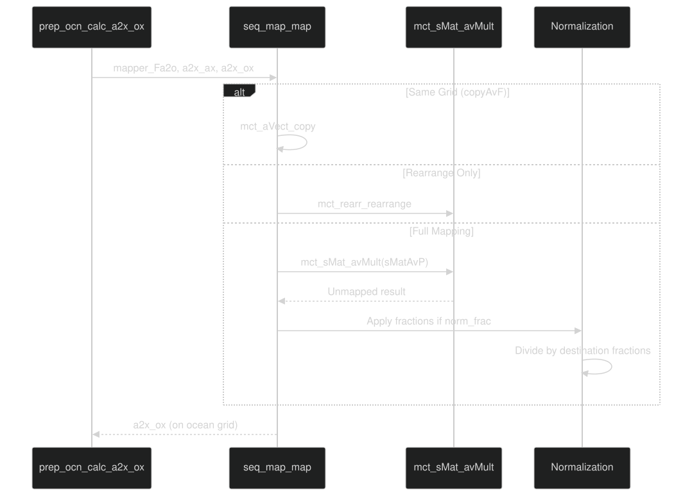

The multiplication `mct_sMat_avMult` performs:

where `W(i,j)` is the sparse weight matrix.

Sources:  [driver-mct/main/seq_map_mod.F90 600-800](https://github.com/jingtao-lbl/E3SM/blob/389f40b9/driver-mct/main/seq_map_mod.F90#L600-L800)

## MOAB-Based Mapping System

### Mesh Migration and Intersection

MOAB-based mapping operates on mesh objects rather than weight files. The workflow involves:


MOAB Application IDs

The system uses integer IDs to reference mesh applications:

| ID Variable | Description | Component | 
| --- | --- | --- |
| mhid | Atmosphere mesh on atm PEs | EAM | 
| mhpgid | Atmosphere physics grid (if FV) | EAM | 
| mbaxid | Atmosphere mesh on coupler PEs | Coupler | 
| mpoid | Ocean mesh on ocean PEs | MPAS-O | 
| mboxid | Ocean mesh on coupler PEs | Coupler | 
| mbintxao | Atm-to-ocean intersection mesh | Coupler | 
| mbintxoa | Ocean-to-atm intersection mesh | Coupler | 
| mbixid | Ice mesh on coupler PEs | Coupler | 
| mblxid | Land mesh on coupler PEs | Coupler | 

Sources:  [driver-moab/main/prep_ocn_mod.F90 1-100](https://github.com/jingtao-lbl/E3SM/blob/389f40b9/driver-moab/main/prep_ocn_mod.F90#L1-L100)  [driver-moab/main/cplcomp_exchange_mod.F90 1-100](https://github.com/jingtao-lbl/E3SM/blob/389f40b9/driver-moab/main/cplcomp_exchange_mod.F90#L1-L100)

### Dynamic Weight Computation

MOAB computes mapping weights using geometric intersection:


The `iMOAB_ComputeMeshIntersectionOnSphere` function:

- Computes exact spherical polygon intersections
- Handles non-convex cells (MPAS Voronoi cells)
- Preserves geometric properties for conservation

Key parameters controlling weight generation include:

| Parameter | Description | Typical Value | 
| --- | --- | --- |
| srcMethod | Source discretization | "fv", "integrateScalarTag" | 
| tgtMethod | Target discretization | "fv", "integrateScalarTag" | 
| monotonicity | Monotonicity constraint | 0 (none), 3 (strict) | 
| volumetric | 3D intersection | 0 (false) | 
| noConserve | Disable conservation | 0 (false) | 

Sources:  [driver-moab/main/prep_ocn_mod.F90 180-200](https://github.com/jingtao-lbl/E3SM/blob/389f40b9/driver-moab/main/prep_ocn_mod.F90#L180-L200)  [driver-moab/main/prep_ocn_mod.F90 400-700](https://github.com/jingtao-lbl/E3SM/blob/389f40b9/driver-moab/main/prep_ocn_mod.F90#L400-L700)

### MOAB Mapping Execution

The `prep_ocn_mrg_moab` function demonstrates MOAB-based mapping:

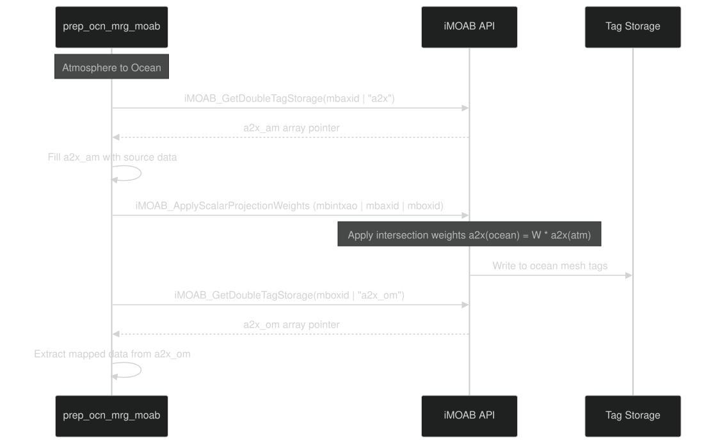

The key difference from MCT: weights are applied by MOAB internally using mesh intersection geometry rather than pre-computed sparse matrices.

Sources:  [driver-moab/main/prep_ocn_mod.F90 1200-1600](https://github.com/jingtao-lbl/E3SM/blob/389f40b9/driver-moab/main/prep_ocn_mod.F90#L1200-L1600)

## Component-Specific Mappers

### Atmosphere-Ocean Interface

The atmosphere-ocean interface requires multiple mappers for different field types:


Vector Field Mapping : Wind stress and similar vector quantities require special handling to preserve vector properties during remapping. The `vect_map` configuration option controls whether vectors are:

- Mapped component-wise (default)
- Rotated to local coordinate frames
- Treated with special pole handling

Sources:  [driver-moab/main/prep_ocn_mod.F90 200-350](https://github.com/jingtao-lbl/E3SM/blob/389f40b9/driver-moab/main/prep_ocn_mod.F90#L200-L350)  [driver-moab/main/prep_atm_mod.F90 125-200](https://github.com/jingtao-lbl/E3SM/blob/389f40b9/driver-moab/main/prep_atm_mod.F90#L125-L200)

### Runoff-Ocean Interface

Runoff data often requires specialized mapping due to:

- Fine-resolution river networks
- Need to preserve total water flux
- Coastal proximity requirements


The mapping file suffix `nnsm_e1000r300` indicates:

- **nn**: Nearest neighbor
- **sm**: Smoothing enabled
- **e1000**: Smoothing envelope (1000 km)
- **r300**: Smoothing radius (300 km)

This prevents runoff from being mapped to open ocean cells far from river mouths.

Sources:  [driver-moab/main/prep_ocn_mod.F90 100-150](https://github.com/jingtao-lbl/E3SM/blob/389f40b9/driver-moab/main/prep_ocn_mod.F90#L100-L150)  [driver-mct/cime_config/buildnml 234-254](https://github.com/jingtao-lbl/E3SM/blob/389f40b9/driver-mct/cime_config/buildnml#L234-L254)

### Ice-Ocean Interface

Sea ice and ocean typically share the same grid, but mapping infrastructure still handles redistribution across PE layouts:


For MPAS configurations where sea ice and ocean use identical unstructured meshes, the "mapping" is actually just an MPI rearrangement to match PE decompositions.

Sources:  [driver-moab/main/prep_ocn_mod.F90 800-900](https://github.com/jingtao-lbl/E3SM/blob/389f40b9/driver-moab/main/prep_ocn_mod.F90#L800-L900)

## Mapping Workflow Integration

The complete mapping workflow during a coupling timestep:

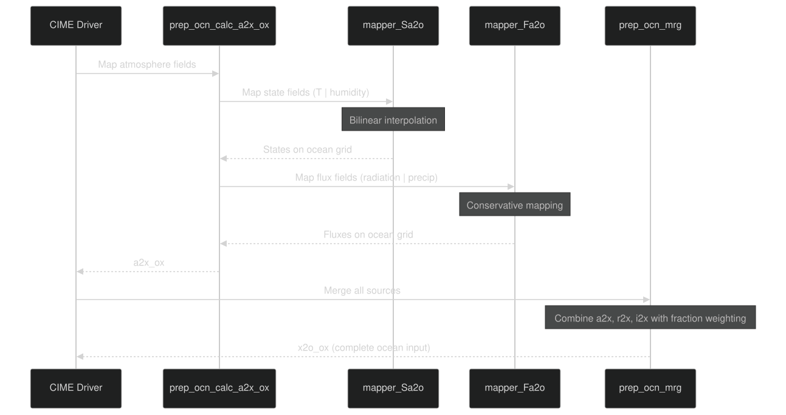

The `prep_ocn_mrg` function combines mapped fields from all sources (atmosphere, ice, land runoff, glacier) with appropriate fraction weighting before passing to the ocean model.

Sources:  [driver-mct/main/cime_comp_mod.F90 2220-2280](https://github.com/jingtao-lbl/E3SM/blob/389f40b9/driver-mct/main/cime_comp_mod.F90#L2220-L2280)  [driver-moab/main/prep_ocn_mod.F90 1200-1800](https://github.com/jingtao-lbl/E3SM/blob/389f40b9/driver-moab/main/prep_ocn_mod.F90#L1200-L1800)

## Mapping File Generation

Mapping weight files are generated offline using tools in the ESMF or MOAB ecosystems:

For MCT Driver:

For MOAB Driver:

Configuration example from `config_grids.xml` :

Sources:  [driver-mct/cime_config/buildnml 213-258](https://github.com/jingtao-lbl/E3SM/blob/389f40b9/driver-mct/cime_config/buildnml#L213-L258)  [driver-moab/main/prep_ocn_mod.F90 500-600](https://github.com/jingtao-lbl/E3SM/blob/389f40b9/driver-moab/main/prep_ocn_mod.F90#L500-L600)

## Conservation and Accuracy

### Conservative Mapping

Conservative mapping ensures global integrals are preserved:

For discrete cells:

MCT conservative mapping satisfies this through normalized weights:

MOAB ensures this through exact geometric intersection areas.

### Normalization Options

The `norm_type` field controls post-mapping normalization:

| Type | Behavior | Use Case | 
| --- | --- | --- |
| norm_dst | Normalize by destination area | Standard conservative mapping | 
| norm_frac | Normalize by fractional coverage | Coupling with partial grid coverage | 
| norm_none | No normalization | When weights pre-normalized | 

Sources:  [driver-mct/main/seq_map_mod.F90 800-1000](https://github.com/jingtao-lbl/E3SM/blob/389f40b9/driver-mct/main/seq_map_mod.F90#L800-L1000)

## Debugging and Validation

### Diagnostic Output

Enable mapping diagnostics by setting:

- `INFO_DBUG > 1``env_run.xml`in
- Component-specific debug output in namelists

Typical diagnostic output includes:

- Source/destination grid dimensions
- Number of mapping weights
- Conservation check results
- Timing information

### Common Issues

Issue: "Need to provide valid mapping file"

- `idmap`Cause: Source and destination grids differ but mapping file set to
- Solution: Generate appropriate mapping file or verify grid compatibility
- [driver-mct/cime_config/buildnml241-254](https://github.com/jingtao-lbl/E3SM/blob/389f40b9/driver-mct/cime_config/buildnml#L241-L254)Code check:

Issue: Conservation errors in coupled runs

- Cause: Incorrect normalization or incompatible mapping strategy
- `norm_type`Solution: Verify and ensure conservative mapping for fluxes
- Validation: Check global integrals in coupler history files

Issue: MOAB intersection fails

- Cause: Mesh inconsistencies (non-manifold, gaps, overlaps)
- `mbconvert`Solution: Validate mesh files with tool
- `prep_*_init`Debug: Enable MOAB verbose output in

Sources:  [driver-mct/cime_config/buildnml 213-258](https://github.com/jingtao-lbl/E3SM/blob/389f40b9/driver-mct/cime_config/buildnml#L213-L258)  [driver-moab/main/prep_ocn_mod.F90 400-500](https://github.com/jingtao-lbl/E3SM/blob/389f40b9/driver-moab/main/prep_ocn_mod.F90#L400-L500)

## Performance Considerations

### MCT Sparse Matrix Operations

MCT mapping performance depends on:

- **Sparse matrix size**: Number of non-zero weights
- **Communication patterns**: PE layout of source vs destination
- **Memory bandwidth**: Sparse matrix-vector multiply efficiency

Typical costs for ne30 atmosphere to oEC60to30 ocean:

- Initialization (read weights): ~0.1-1 seconds
- Per-timestep mapping: ~0.01-0.1 seconds per field

### MOAB Dynamic Intersection

MOAB intersection computation is expensive but amortized:

- **First call**: Compute intersection (~10-60 seconds for large grids)
- **Subsequent calls**: Reuse weights (~0.01-0.1 seconds per field)

Optimization: Enable weight file writing to cache intersections across runs:

### Rearrange vs Full Mapping

When source and destination share the same grid but different PE layouts:

- **Rearrange**(fast): MPI all-to-all communication
- **Full mapping**(slower): Sparse matrix multiply + communication

The driver automatically selects rearrange when `samegrid_*` flags are true.

Sources:  [driver-mct/main/seq_map_mod.F90 600-800](https://github.com/jingtao-lbl/E3SM/blob/389f40b9/driver-mct/main/seq_map_mod.F90#L600-L800)  [driver-moab/main/prep_ocn_mod.F90 1500-1800](https://github.com/jingtao-lbl/E3SM/blob/389f40b9/driver-moab/main/prep_ocn_mod.F90#L1500-L1800)

Sources:  [driver-mct/main/cime_comp_mod.F90 1-300](https://github.com/jingtao-lbl/E3SM/blob/389f40b9/driver-mct/main/cime_comp_mod.F90#L1-L300)  [driver-moab/main/cime_comp_mod.F90 1-300](https://github.com/jingtao-lbl/E3SM/blob/389f40b9/driver-moab/main/cime_comp_mod.F90#L1-L300)  [driver-mct/main/seq_map_mod.F90 1-1000](https://github.com/jingtao-lbl/E3SM/blob/389f40b9/driver-mct/main/seq_map_mod.F90#L1-L1000)  [driver-moab/main/seq_map_mod.F90 1-1000](https://github.com/jingtao-lbl/E3SM/blob/389f40b9/driver-moab/main/seq_map_mod.F90#L1-L1000)  [driver-mct/cime_config/buildnml 1-440](https://github.com/jingtao-lbl/E3SM/blob/389f40b9/driver-mct/cime_config/buildnml#L1-L440)  [driver-moab/main/prep_ocn_mod.F90 1-2000](https://github.com/jingtao-lbl/E3SM/blob/389f40b9/driver-moab/main/prep_ocn_mod.F90#L1-L2000)  [driver-moab/main/prep_atm_mod.F90 1-1000](https://github.com/jingtao-lbl/E3SM/blob/389f40b9/driver-moab/main/prep_atm_mod.F90#L1-L1000)  [driver-moab/main/cplcomp_exchange_mod.F90 1-1000](https://github.com/jingtao-lbl/E3SM/blob/389f40b9/driver-moab/main/cplcomp_exchange_mod.F90#L1-L1000)  [driver-mct/main/prep_glc_mod.F90 1-500](https://github.com/jingtao-lbl/E3SM/blob/389f40b9/driver-mct/main/prep_glc_mod.F90#L1-L500)