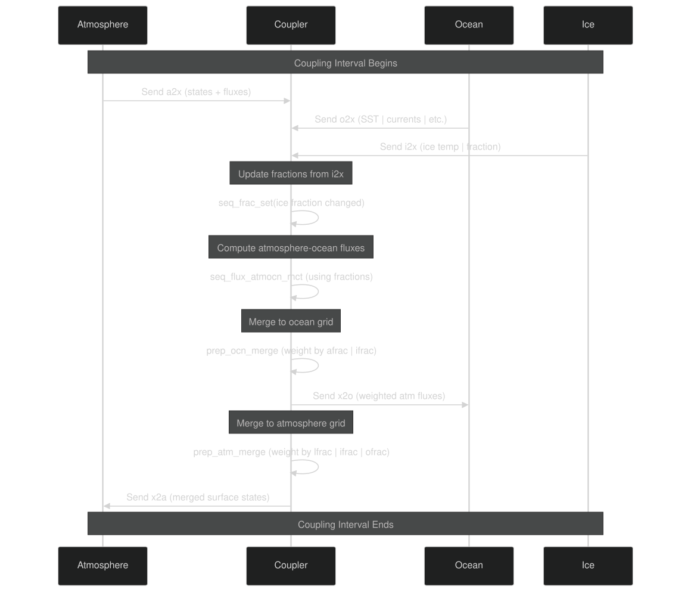

# Flux Calculations and Fractional Coverage

Relevant source files

- [components/eam/src/chemistry/mozart/mo_drydep.F90](https://github.com/jingtao-lbl/E3SM/blob/389f40b9/components/eam/src/chemistry/mozart/mo_drydep.F90)
- [components/eam/src/chemistry/utils/horizontal_interpolate.F90](https://github.com/jingtao-lbl/E3SM/blob/389f40b9/components/eam/src/chemistry/utils/horizontal_interpolate.F90)
- [components/eam/src/chemistry/utils/prescribed_aero.F90](https://github.com/jingtao-lbl/E3SM/blob/389f40b9/components/eam/src/chemistry/utils/prescribed_aero.F90)
- [components/eam/src/control/apply_iop_forcing.F90](https://github.com/jingtao-lbl/E3SM/blob/389f40b9/components/eam/src/control/apply_iop_forcing.F90)
- [components/eam/src/control/history_iop.F90](https://github.com/jingtao-lbl/E3SM/blob/389f40b9/components/eam/src/control/history_iop.F90)
- [components/eam/src/control/iop_data_mod.F90](https://github.com/jingtao-lbl/E3SM/blob/389f40b9/components/eam/src/control/iop_data_mod.F90)
- [components/eam/src/control/ncdio_atm.F90](https://github.com/jingtao-lbl/E3SM/blob/389f40b9/components/eam/src/control/ncdio_atm.F90)
- [components/eam/src/control/readinitial.F90](https://github.com/jingtao-lbl/E3SM/blob/389f40b9/components/eam/src/control/readinitial.F90)
- [components/eam/src/control/runtime_opts.F90](https://github.com/jingtao-lbl/E3SM/blob/389f40b9/components/eam/src/control/runtime_opts.F90)
- [components/eam/src/cpl/atm_comp_esmf.F90](https://github.com/jingtao-lbl/E3SM/blob/389f40b9/components/eam/src/cpl/atm_comp_esmf.F90)
- [components/eam/src/cpl/atm_comp_mct.F90](https://github.com/jingtao-lbl/E3SM/blob/389f40b9/components/eam/src/cpl/atm_comp_mct.F90)
- [components/eam/src/dynamics/se/dyn_comp.F90](https://github.com/jingtao-lbl/E3SM/blob/389f40b9/components/eam/src/dynamics/se/dyn_comp.F90)
- [components/eam/src/dynamics/se/inidat.F90](https://github.com/jingtao-lbl/E3SM/blob/389f40b9/components/eam/src/dynamics/se/inidat.F90)
- [components/eam/src/dynamics/se/se_iop_intr_mod.F90](https://github.com/jingtao-lbl/E3SM/blob/389f40b9/components/eam/src/dynamics/se/se_iop_intr_mod.F90)
- [components/eam/src/dynamics/se/semoab_mod.F90](https://github.com/jingtao-lbl/E3SM/blob/389f40b9/components/eam/src/dynamics/se/semoab_mod.F90)
- [components/eam/src/dynamics/se/stepon.F90](https://github.com/jingtao-lbl/E3SM/blob/389f40b9/components/eam/src/dynamics/se/stepon.F90)
- [components/eam/src/physics/cam/iop_surf.F90](https://github.com/jingtao-lbl/E3SM/blob/389f40b9/components/eam/src/physics/cam/iop_surf.F90)
- [components/elm/src/cpl/lnd_comp_esmf.F90](https://github.com/jingtao-lbl/E3SM/blob/389f40b9/components/elm/src/cpl/lnd_comp_esmf.F90)
- [components/elm/src/cpl/lnd_comp_mct.F90](https://github.com/jingtao-lbl/E3SM/blob/389f40b9/components/elm/src/cpl/lnd_comp_mct.F90)
- [components/elm/src/utils/elm_varorb.F90](https://github.com/jingtao-lbl/E3SM/blob/389f40b9/components/elm/src/utils/elm_varorb.F90)
- [components/mosart/src/cpl/rof_comp_mct.F90](https://github.com/jingtao-lbl/E3SM/blob/389f40b9/components/mosart/src/cpl/rof_comp_mct.F90)
- [components/mpas-albany-landice/driver/glc_comp_mct.F](https://github.com/jingtao-lbl/E3SM/blob/389f40b9/components/mpas-albany-landice/driver/glc_comp_mct.F)
- [components/mpas-albany-landice/driver/glc_cpl_indices.F](https://github.com/jingtao-lbl/E3SM/blob/389f40b9/components/mpas-albany-landice/driver/glc_cpl_indices.F)
- [components/mpas-framework/src/framework/mpas_moabmesh.F](https://github.com/jingtao-lbl/E3SM/blob/389f40b9/components/mpas-framework/src/framework/mpas_moabmesh.F)
- [components/mpas-ocean/driver/ocn_comp_mct.F](https://github.com/jingtao-lbl/E3SM/blob/389f40b9/components/mpas-ocean/driver/ocn_comp_mct.F)
- [components/mpas-seaice/driver/ice_comp_mct.F](https://github.com/jingtao-lbl/E3SM/blob/389f40b9/components/mpas-seaice/driver/ice_comp_mct.F)
- [components/mpas-seaice/driver/mpassi_cpl_indices.F](https://github.com/jingtao-lbl/E3SM/blob/389f40b9/components/mpas-seaice/driver/mpassi_cpl_indices.F)
- [driver-mct/cime_config/buildexe](https://github.com/jingtao-lbl/E3SM/blob/389f40b9/driver-mct/cime_config/buildexe)
- [driver-mct/cime_config/buildnml](https://github.com/jingtao-lbl/E3SM/blob/389f40b9/driver-mct/cime_config/buildnml)
- [driver-mct/cime_config/config_component.xml](https://github.com/jingtao-lbl/E3SM/blob/389f40b9/driver-mct/cime_config/config_component.xml)
- [driver-mct/cime_config/config_component_cesm.xml](https://github.com/jingtao-lbl/E3SM/blob/389f40b9/driver-mct/cime_config/config_component_cesm.xml)
- [driver-mct/cime_config/config_compsets.xml](https://github.com/jingtao-lbl/E3SM/blob/389f40b9/driver-mct/cime_config/config_compsets.xml)
- [driver-mct/cime_config/config_pes.xml](https://github.com/jingtao-lbl/E3SM/blob/389f40b9/driver-mct/cime_config/config_pes.xml)
- [driver-mct/cime_config/namelist_definition_drv.xml](https://github.com/jingtao-lbl/E3SM/blob/389f40b9/driver-mct/cime_config/namelist_definition_drv.xml)
- [driver-mct/cime_config/testdefs/testlist_drv.xml](https://github.com/jingtao-lbl/E3SM/blob/389f40b9/driver-mct/cime_config/testdefs/testlist_drv.xml)
- [driver-mct/cime_config/user_nl_cpl](https://github.com/jingtao-lbl/E3SM/blob/389f40b9/driver-mct/cime_config/user_nl_cpl)
- [driver-mct/main/CMakeLists.txt](https://github.com/jingtao-lbl/E3SM/blob/389f40b9/driver-mct/main/CMakeLists.txt)
- [driver-mct/main/cime_comp_mod.F90](https://github.com/jingtao-lbl/E3SM/blob/389f40b9/driver-mct/main/cime_comp_mod.F90)
- [driver-mct/main/component_mod.F90](https://github.com/jingtao-lbl/E3SM/blob/389f40b9/driver-mct/main/component_mod.F90)
- [driver-mct/main/component_type_mod.F90](https://github.com/jingtao-lbl/E3SM/blob/389f40b9/driver-mct/main/component_type_mod.F90)
- [driver-mct/main/cplcomp_exchange_mod.F90](https://github.com/jingtao-lbl/E3SM/blob/389f40b9/driver-mct/main/cplcomp_exchange_mod.F90)
- [driver-mct/main/map_glc2lnd_mod.F90](https://github.com/jingtao-lbl/E3SM/blob/389f40b9/driver-mct/main/map_glc2lnd_mod.F90)
- [driver-mct/main/map_lnd2glc_mod.F90](https://github.com/jingtao-lbl/E3SM/blob/389f40b9/driver-mct/main/map_lnd2glc_mod.F90)
- [driver-mct/main/mrg_mod.F90](https://github.com/jingtao-lbl/E3SM/blob/389f40b9/driver-mct/main/mrg_mod.F90)
- [driver-mct/main/prep_aoflux_mod.F90](https://github.com/jingtao-lbl/E3SM/blob/389f40b9/driver-mct/main/prep_aoflux_mod.F90)
- [driver-mct/main/prep_atm_mod.F90](https://github.com/jingtao-lbl/E3SM/blob/389f40b9/driver-mct/main/prep_atm_mod.F90)
- [driver-mct/main/prep_glc_mod.F90](https://github.com/jingtao-lbl/E3SM/blob/389f40b9/driver-mct/main/prep_glc_mod.F90)
- [driver-mct/main/prep_ice_mod.F90](https://github.com/jingtao-lbl/E3SM/blob/389f40b9/driver-mct/main/prep_ice_mod.F90)
- [driver-mct/main/prep_lnd_mod.F90](https://github.com/jingtao-lbl/E3SM/blob/389f40b9/driver-mct/main/prep_lnd_mod.F90)
- [driver-mct/main/prep_ocn_mod.F90](https://github.com/jingtao-lbl/E3SM/blob/389f40b9/driver-mct/main/prep_ocn_mod.F90)
- [driver-mct/main/prep_rof_mod.F90](https://github.com/jingtao-lbl/E3SM/blob/389f40b9/driver-mct/main/prep_rof_mod.F90)
- [driver-mct/main/seq_diag_mct.F90](https://github.com/jingtao-lbl/E3SM/blob/389f40b9/driver-mct/main/seq_diag_mct.F90)
- [driver-mct/main/seq_domain_mct.F90](https://github.com/jingtao-lbl/E3SM/blob/389f40b9/driver-mct/main/seq_domain_mct.F90)
- [driver-mct/main/seq_flux_mct.F90](https://github.com/jingtao-lbl/E3SM/blob/389f40b9/driver-mct/main/seq_flux_mct.F90)
- [driver-mct/main/seq_frac_mct.F90](https://github.com/jingtao-lbl/E3SM/blob/389f40b9/driver-mct/main/seq_frac_mct.F90)
- [driver-mct/main/seq_hist_mod.F90](https://github.com/jingtao-lbl/E3SM/blob/389f40b9/driver-mct/main/seq_hist_mod.F90)
- [driver-mct/main/seq_io_mod.F90](https://github.com/jingtao-lbl/E3SM/blob/389f40b9/driver-mct/main/seq_io_mod.F90)
- [driver-mct/main/seq_map_mod.F90](https://github.com/jingtao-lbl/E3SM/blob/389f40b9/driver-mct/main/seq_map_mod.F90)
- [driver-mct/main/seq_map_type_mod.F90](https://github.com/jingtao-lbl/E3SM/blob/389f40b9/driver-mct/main/seq_map_type_mod.F90)
- [driver-mct/main/seq_rest_mod.F90](https://github.com/jingtao-lbl/E3SM/blob/389f40b9/driver-mct/main/seq_rest_mod.F90)
- [driver-mct/shr/CMakeLists.txt](https://github.com/jingtao-lbl/E3SM/blob/389f40b9/driver-mct/shr/CMakeLists.txt)
- [driver-mct/shr/glc_elevclass_mod.F90](https://github.com/jingtao-lbl/E3SM/blob/389f40b9/driver-mct/shr/glc_elevclass_mod.F90)
- [driver-mct/shr/seq_cdata_mod.F90](https://github.com/jingtao-lbl/E3SM/blob/389f40b9/driver-mct/shr/seq_cdata_mod.F90)
- [driver-mct/shr/seq_comm_mct.F90](https://github.com/jingtao-lbl/E3SM/blob/389f40b9/driver-mct/shr/seq_comm_mct.F90)
- [driver-mct/shr/seq_drydep_mod.F90](https://github.com/jingtao-lbl/E3SM/blob/389f40b9/driver-mct/shr/seq_drydep_mod.F90)
- [driver-mct/shr/seq_flds_mod.F90](https://github.com/jingtao-lbl/E3SM/blob/389f40b9/driver-mct/shr/seq_flds_mod.F90)
- [driver-mct/shr/seq_infodata_mod.F90](https://github.com/jingtao-lbl/E3SM/blob/389f40b9/driver-mct/shr/seq_infodata_mod.F90)
- [driver-mct/shr/seq_io_read_mod.F90](https://github.com/jingtao-lbl/E3SM/blob/389f40b9/driver-mct/shr/seq_io_read_mod.F90)
- [driver-mct/shr/seq_timemgr_mod.F90](https://github.com/jingtao-lbl/E3SM/blob/389f40b9/driver-mct/shr/seq_timemgr_mod.F90)
- [driver-mct/shr/shr_expr_parser_mod.F90](https://github.com/jingtao-lbl/E3SM/blob/389f40b9/driver-mct/shr/shr_expr_parser_mod.F90)
- [driver-mct/shr/shr_fire_emis_mod.F90](https://github.com/jingtao-lbl/E3SM/blob/389f40b9/driver-mct/shr/shr_fire_emis_mod.F90)
- [driver-mct/shr/shr_megan_mod.F90](https://github.com/jingtao-lbl/E3SM/blob/389f40b9/driver-mct/shr/shr_megan_mod.F90)
- [driver-mct/unit_test/CMakeLists.txt](https://github.com/jingtao-lbl/E3SM/blob/389f40b9/driver-mct/unit_test/CMakeLists.txt)
- [driver-mct/unit_test/avect_wrapper_test/CMakeLists.txt](https://github.com/jingtao-lbl/E3SM/blob/389f40b9/driver-mct/unit_test/avect_wrapper_test/CMakeLists.txt)
- [driver-mct/unit_test/avect_wrapper_test/test_avect_wrapper.pf](https://github.com/jingtao-lbl/E3SM/blob/389f40b9/driver-mct/unit_test/avect_wrapper_test/test_avect_wrapper.pf)
- [driver-mct/unit_test/glc_elevclass_test/test_glc_elevclass.pf](https://github.com/jingtao-lbl/E3SM/blob/389f40b9/driver-mct/unit_test/glc_elevclass_test/test_glc_elevclass.pf)
- [driver-mct/unit_test/map_glc2lnd_test/test_map_glc2lnd.pf](https://github.com/jingtao-lbl/E3SM/blob/389f40b9/driver-mct/unit_test/map_glc2lnd_test/test_map_glc2lnd.pf)
- [driver-mct/unit_test/seq_map_test/CMakeLists.txt](https://github.com/jingtao-lbl/E3SM/blob/389f40b9/driver-mct/unit_test/seq_map_test/CMakeLists.txt)
- [driver-mct/unit_test/seq_map_test/test_seq_map.pf](https://github.com/jingtao-lbl/E3SM/blob/389f40b9/driver-mct/unit_test/seq_map_test/test_seq_map.pf)
- [driver-mct/unit_test/stubs/CMakeLists.txt](https://github.com/jingtao-lbl/E3SM/blob/389f40b9/driver-mct/unit_test/stubs/CMakeLists.txt)
- [driver-mct/unit_test/utils/CMakeLists.txt](https://github.com/jingtao-lbl/E3SM/blob/389f40b9/driver-mct/unit_test/utils/CMakeLists.txt)
- [driver-mct/unit_test/utils/avect_wrapper_mod.F90](https://github.com/jingtao-lbl/E3SM/blob/389f40b9/driver-mct/unit_test/utils/avect_wrapper_mod.F90)
- [driver-mct/unit_test/utils/mct_wrapper_mod.F90](https://github.com/jingtao-lbl/E3SM/blob/389f40b9/driver-mct/unit_test/utils/mct_wrapper_mod.F90)
- [driver-mct/unit_test/utils/simple_map_mod.F90](https://github.com/jingtao-lbl/E3SM/blob/389f40b9/driver-mct/unit_test/utils/simple_map_mod.F90)
- [driver-moab/main/cime_comp_mod.F90](https://github.com/jingtao-lbl/E3SM/blob/389f40b9/driver-moab/main/cime_comp_mod.F90)
- [driver-moab/main/component_mod.F90](https://github.com/jingtao-lbl/E3SM/blob/389f40b9/driver-moab/main/component_mod.F90)
- [driver-moab/main/component_type_mod.F90](https://github.com/jingtao-lbl/E3SM/blob/389f40b9/driver-moab/main/component_type_mod.F90)
- [driver-moab/main/cplcomp_exchange_mod.F90](https://github.com/jingtao-lbl/E3SM/blob/389f40b9/driver-moab/main/cplcomp_exchange_mod.F90)
- [driver-moab/main/prep_aoflux_mod.F90](https://github.com/jingtao-lbl/E3SM/blob/389f40b9/driver-moab/main/prep_aoflux_mod.F90)
- [driver-moab/main/prep_atm_mod.F90](https://github.com/jingtao-lbl/E3SM/blob/389f40b9/driver-moab/main/prep_atm_mod.F90)
- [driver-moab/main/prep_ice_mod.F90](https://github.com/jingtao-lbl/E3SM/blob/389f40b9/driver-moab/main/prep_ice_mod.F90)
- [driver-moab/main/prep_lnd_mod.F90](https://github.com/jingtao-lbl/E3SM/blob/389f40b9/driver-moab/main/prep_lnd_mod.F90)
- [driver-moab/main/prep_ocn_mod.F90](https://github.com/jingtao-lbl/E3SM/blob/389f40b9/driver-moab/main/prep_ocn_mod.F90)
- [driver-moab/main/prep_rof_mod.F90](https://github.com/jingtao-lbl/E3SM/blob/389f40b9/driver-moab/main/prep_rof_mod.F90)
- [driver-moab/main/seq_flux_mct.F90](https://github.com/jingtao-lbl/E3SM/blob/389f40b9/driver-moab/main/seq_flux_mct.F90)
- [driver-moab/main/seq_frac_mct.F90](https://github.com/jingtao-lbl/E3SM/blob/389f40b9/driver-moab/main/seq_frac_mct.F90)
- [driver-moab/main/seq_io_mod.F90](https://github.com/jingtao-lbl/E3SM/blob/389f40b9/driver-moab/main/seq_io_mod.F90)
- [driver-moab/main/seq_map_mod.F90](https://github.com/jingtao-lbl/E3SM/blob/389f40b9/driver-moab/main/seq_map_mod.F90)
- [driver-moab/main/seq_map_type_mod.F90](https://github.com/jingtao-lbl/E3SM/blob/389f40b9/driver-moab/main/seq_map_type_mod.F90)
- [driver-moab/main/seq_rest_mod.F90](https://github.com/jingtao-lbl/E3SM/blob/389f40b9/driver-moab/main/seq_rest_mod.F90)
- [driver-moab/shr/seq_comm_mct.F90](https://github.com/jingtao-lbl/E3SM/blob/389f40b9/driver-moab/shr/seq_comm_mct.F90)

## Purpose and Scope

This document describes the flux calculation and fractional coverage systems in E3SM's coupler infrastructure. These systems are responsible for:

For information about grid mapping and remapping between component grids, see [4.3](#4.3) . For atmosphere-ocean flux parameterizations specifically, see the atmosphere physics documentation [3.1.2](#3.1.2) .

Sources : [driver-mct/main/cime_comp_mod.F90 1-200](https://github.com/jingtao-lbl/E3SM/blob/389f40b9/driver-mct/main/cime_comp_mod.F90#L1-L200)  [driver-mct/shr/seq_flds_mod.F90 1-120](https://github.com/jingtao-lbl/E3SM/blob/389f40b9/driver-mct/shr/seq_flds_mod.F90#L1-L120)

## Fractional Coverage Fundamentals

### Grid Cell Composition

In E3SM, each grid cell can contain multiple surface types. The coupler tracks fractional coverage for each component grid:

Diagram : Fractional Coverage Model in Grid Cells

### Fraction Storage

The driver maintains fraction attribute vectors for each component grid on coupler processes:

| Fraction Vector | Description | Grid | Location | 
| --- | --- | --- | --- |
| fractions_ax | Atmosphere grid fractions | Atmosphere | Coupler PEs | 
| fractions_lx | Land grid fractions | Land | Coupler PEs | 
| fractions_ix | Ice grid fractions | Ice | Coupler PEs | 
| fractions_ox | Ocean grid fractions | Ocean | Coupler PEs | 
| fractions_gx | Glacier grid fractions | Glacier | Coupler PEs | 
| fractions_rx | Runoff grid fractions | Runoff | Coupler PEs | 
| fractions_wx | Wave grid fractions | Wave | Coupler PEs | 

Sources : [driver-mct/main/cime_comp_mod.F90 272-280](https://github.com/jingtao-lbl/E3SM/blob/389f40b9/driver-mct/main/cime_comp_mod.F90#L272-L280)

## Flux Calculation System

### Atmosphere-Ocean Flux Computation

The coupler computes atmosphere-ocean fluxes using surface states from both components. The primary modules are:

Diagram : Atmosphere-Ocean Flux Calculation Workflow

Sources : [driver-mct/main/cime_comp_mod.F90 133-134](https://github.com/jingtao-lbl/E3SM/blob/389f40b9/driver-mct/main/cime_comp_mod.F90#L133-L134)

### Flux Integration Methods

The driver supports different time integration methods for atmospheric fluxes, controlled by the `atm_flux_method` namelist parameter:

| Method | Description | Use Case | 
| --- | --- | --- |
| explicit | Direct flux computation at coupling frequency | Default for most configurations | 
| implicit_stress | Atmosphere provides wind stress response and tau estimate | Improved stability for high-resolution ocean | 

Sources : [driver-mct/cime_config/namelist_definition_drv.xml 152-160](https://github.com/jingtao-lbl/E3SM/blob/389f40b9/driver-mct/cime_config/namelist_definition_drv.xml#L152-L160)

## Fraction-Weighted Merging

### Merging Rules

When merging component exports onto a target grid, the coupler applies fraction-weighted averaging. The rules from `seq_flds_mod` specify:

Diagram : Fraction-Weighted Merging to Atmosphere Grid

### State Merging Algorithm

For state variables with prefix `Sx_` (merged surface states):

For flux variables, ice-ocean interface fluxes (prefix `Fioi_` ) are excluded from atmosphere merging since they don't interact with the atmosphere directly.

Sources : [driver-mct/shr/seq_flds_mod.F90 40-92](https://github.com/jingtao-lbl/E3SM/blob/389f40b9/driver-mct/shr/seq_flds_mod.F90#L40-L92)

## Implementation Architecture

### Driver-MCT Implementation

Diagram : Driver-MCT Flux and Fraction Module Architecture

Sources : [driver-mct/main/cime_comp_mod.F90 1-250](https://github.com/jingtao-lbl/E3SM/blob/389f40b9/driver-mct/main/cime_comp_mod.F90#L1-L250)

### Driver-MOAB Implementation

For MOAB-based coupling, fractions are stored as MOAB tag data on mesh vertices:

Diagram : MOAB Fraction Storage Architecture

Sources : [driver-moab/main/prep_ocn_mod.F90 158-159](https://github.com/jingtao-lbl/E3SM/blob/389f40b9/driver-moab/main/prep_ocn_mod.F90#L158-L159)  [driver-moab/main/prep_atm_mod.F90 109-111](https://github.com/jingtao-lbl/E3SM/blob/389f40b9/driver-moab/main/prep_atm_mod.F90#L109-L111)

### Prep Module Responsibilities

Each `prep_*_mod` module handles merging for one target component:

| Module | Function | Input Sources | Fraction Weighting | 
| --- | --- | --- | --- |
| prep_atm_mod | prep_atm_merge | Land, ice, ocean exports | Weight by component fractions | 
| prep_ocn_mod | prep_ocn_merge | Atmosphere, runoff, ice, glacier exports | Weight by atm/ice fractions | 
| prep_ice_mod | prep_ice_merge | Atmosphere, ocean exports | Weight by open water fraction | 
| prep_lnd_mod | prep_lnd_merge | Atmosphere, glacier exports | Weight by glacier fraction | 

Sources : [driver-mct/main/cime_comp_mod.F90 179-187](https://github.com/jingtao-lbl/E3SM/blob/389f40b9/driver-mct/main/cime_comp_mod.F90#L179-L187)  [driver-moab/main/prep_ocn_mod.F90 1-100](https://github.com/jingtao-lbl/E3SM/blob/389f40b9/driver-moab/main/prep_ocn_mod.F90#L1-L100)

## Configuration Options

### Namelist Parameters

The driver namelist ( `drv_in` ) controls flux calculation behavior through `seq_infodata_inparm` :

| Parameter | Type | Values | Description | 
| --- | --- | --- | --- |
| flux_epbal | char | 'off', 'ocn' | Enable EP balance factor for precipitation from ocean | 
| flux_albav | logical | .true., .false. | Compute albedos for daily average SW down | 
| atm_flux_method | char | 'explicit', 'implicit_stress' | Flux time integration method | 
| atm_gustiness | logical | .true., .false. | Whether atmosphere provides gustiness velocity | 

Sources : [driver-mct/cime_config/namelist_definition_drv.xml 683-706](https://github.com/jingtao-lbl/E3SM/blob/389f40b9/driver-mct/cime_config/namelist_definition_drv.xml#L683-L706)

### XML Configuration Variables

Build-time and runtime options set via XML:

| XML Variable | Default | Description | 
| --- | --- | --- |
| CPL_EPBAL | 'off' | EP balance mode | 
| CPL_ALBAV | .false. | Albedo averaging mode | 
| ATM_FLUX_INTEGRATION_METHOD | 'explicit' | Flux integration approach | 
| ATM_SUPPLIES_GUSTINESS | .false. | Gustiness from atmosphere | 

These XML variables are translated to namelist parameters by the buildnml script.

Sources : [driver-mct/cime_config/buildnml 40-42](https://github.com/jingtao-lbl/E3SM/blob/389f40b9/driver-mct/cime_config/buildnml#L40-L42)  [driver-mct/cime_config/namelist_definition_drv.xml 152-170](https://github.com/jingtao-lbl/E3SM/blob/389f40b9/driver-mct/cime_config/namelist_definition_drv.xml#L152-L170)

## Fraction Initialization and Updates

### Initial Fraction Setup

The `seq_frac_init` routine establishes initial fractions during model initialization:

Diagram : Fraction Initialization Workflow

### Runtime Fraction Updates

The `seq_frac_set` routine updates fractions during the run:

The coupler ensures:

- `afrac + ifrac + ofrac + lfrac = 1.0`(on overlapping grids)
- Fractions remain non-negative
- Fraction updates are communicated to all components

Sources : [driver-mct/main/cime_comp_mod.F90 136-137](https://github.com/jingtao-lbl/E3SM/blob/389f40b9/driver-mct/main/cime_comp_mod.F90#L136-L137)

## Special Cases and Considerations

### Aqua-Planet Mode

When `aqua_planet = .true.` , the coupler sets:

- `lfrac = 0.0`(no land)
- `ifrac = 0.0`(no ice)
- `ofrac = 1.0`(100% ocean)
- Uses analytic SST instead of prognostic ocean

Sources : [driver-mct/cime_config/namelist_definition_drv.xml 327-349](https://github.com/jingtao-lbl/E3SM/blob/389f40b9/driver-mct/cime_config/namelist_definition_drv.xml#L327-L349)

### Single Column Mode

For single column simulations ( `single_column = .true.` ):

- Fractions are set at the single point location
- Flux calculations use local surface states only
- No horizontal averaging or mapping required

Sources : [driver-mct/shr/seq_infodata_mod.F90 89-93](https://github.com/jingtao-lbl/E3SM/blob/389f40b9/driver-mct/shr/seq_infodata_mod.F90#L89-L93)

### Ice Thickness Categories

MPAS-Seaice supports multiple ice thickness categories. Fraction-weighted fluxes must account for the per-category ice area:

- `seq_flds_i2o_per_cat`controls whether per-category fluxes are passed to ocean
- Each ice category has its own fraction within the ice-covered portion
- Total ice fraction is sum of all category fractions

Sources : [driver-mct/cime_config/namelist_definition_drv.xml 196-207](https://github.com/jingtao-lbl/E3SM/blob/389f40b9/driver-mct/cime_config/namelist_definition_drv.xml#L196-L207)

## Data Flow Example

### Typical Coupling Cycle

Diagram : Coupling Cycle Data Flow with Fractions

Sources : [driver-mct/main/cime_comp_mod.F90 220-246](https://github.com/jingtao-lbl/E3SM/blob/389f40b9/driver-mct/main/cime_comp_mod.F90#L220-L246)