# Coupling Infrastructure

Relevant source files

- [components/eam/src/chemistry/mozart/mo_drydep.F90](https://github.com/jingtao-lbl/E3SM/blob/389f40b9/components/eam/src/chemistry/mozart/mo_drydep.F90)
- [components/eam/src/chemistry/utils/horizontal_interpolate.F90](https://github.com/jingtao-lbl/E3SM/blob/389f40b9/components/eam/src/chemistry/utils/horizontal_interpolate.F90)
- [components/eam/src/chemistry/utils/prescribed_aero.F90](https://github.com/jingtao-lbl/E3SM/blob/389f40b9/components/eam/src/chemistry/utils/prescribed_aero.F90)
- [components/eam/src/control/apply_iop_forcing.F90](https://github.com/jingtao-lbl/E3SM/blob/389f40b9/components/eam/src/control/apply_iop_forcing.F90)
- [components/eam/src/control/history_iop.F90](https://github.com/jingtao-lbl/E3SM/blob/389f40b9/components/eam/src/control/history_iop.F90)
- [components/eam/src/control/iop_data_mod.F90](https://github.com/jingtao-lbl/E3SM/blob/389f40b9/components/eam/src/control/iop_data_mod.F90)
- [components/eam/src/control/ncdio_atm.F90](https://github.com/jingtao-lbl/E3SM/blob/389f40b9/components/eam/src/control/ncdio_atm.F90)
- [components/eam/src/control/readinitial.F90](https://github.com/jingtao-lbl/E3SM/blob/389f40b9/components/eam/src/control/readinitial.F90)
- [components/eam/src/control/runtime_opts.F90](https://github.com/jingtao-lbl/E3SM/blob/389f40b9/components/eam/src/control/runtime_opts.F90)
- [components/eam/src/cpl/atm_comp_esmf.F90](https://github.com/jingtao-lbl/E3SM/blob/389f40b9/components/eam/src/cpl/atm_comp_esmf.F90)
- [components/eam/src/cpl/atm_comp_mct.F90](https://github.com/jingtao-lbl/E3SM/blob/389f40b9/components/eam/src/cpl/atm_comp_mct.F90)
- [components/eam/src/dynamics/se/dyn_comp.F90](https://github.com/jingtao-lbl/E3SM/blob/389f40b9/components/eam/src/dynamics/se/dyn_comp.F90)
- [components/eam/src/dynamics/se/inidat.F90](https://github.com/jingtao-lbl/E3SM/blob/389f40b9/components/eam/src/dynamics/se/inidat.F90)
- [components/eam/src/dynamics/se/se_iop_intr_mod.F90](https://github.com/jingtao-lbl/E3SM/blob/389f40b9/components/eam/src/dynamics/se/se_iop_intr_mod.F90)
- [components/eam/src/dynamics/se/semoab_mod.F90](https://github.com/jingtao-lbl/E3SM/blob/389f40b9/components/eam/src/dynamics/se/semoab_mod.F90)
- [components/eam/src/dynamics/se/stepon.F90](https://github.com/jingtao-lbl/E3SM/blob/389f40b9/components/eam/src/dynamics/se/stepon.F90)
- [components/eam/src/physics/cam/iop_surf.F90](https://github.com/jingtao-lbl/E3SM/blob/389f40b9/components/eam/src/physics/cam/iop_surf.F90)
- [components/elm/src/cpl/lnd_comp_esmf.F90](https://github.com/jingtao-lbl/E3SM/blob/389f40b9/components/elm/src/cpl/lnd_comp_esmf.F90)
- [components/elm/src/cpl/lnd_comp_mct.F90](https://github.com/jingtao-lbl/E3SM/blob/389f40b9/components/elm/src/cpl/lnd_comp_mct.F90)
- [components/elm/src/utils/elm_varorb.F90](https://github.com/jingtao-lbl/E3SM/blob/389f40b9/components/elm/src/utils/elm_varorb.F90)
- [components/mosart/src/cpl/rof_comp_mct.F90](https://github.com/jingtao-lbl/E3SM/blob/389f40b9/components/mosart/src/cpl/rof_comp_mct.F90)
- [components/mpas-albany-landice/driver/glc_comp_mct.F](https://github.com/jingtao-lbl/E3SM/blob/389f40b9/components/mpas-albany-landice/driver/glc_comp_mct.F)
- [components/mpas-albany-landice/driver/glc_cpl_indices.F](https://github.com/jingtao-lbl/E3SM/blob/389f40b9/components/mpas-albany-landice/driver/glc_cpl_indices.F)
- [components/mpas-framework/src/framework/mpas_moabmesh.F](https://github.com/jingtao-lbl/E3SM/blob/389f40b9/components/mpas-framework/src/framework/mpas_moabmesh.F)
- [components/mpas-ocean/driver/ocn_comp_mct.F](https://github.com/jingtao-lbl/E3SM/blob/389f40b9/components/mpas-ocean/driver/ocn_comp_mct.F)
- [components/mpas-seaice/driver/ice_comp_mct.F](https://github.com/jingtao-lbl/E3SM/blob/389f40b9/components/mpas-seaice/driver/ice_comp_mct.F)
- [components/mpas-seaice/driver/mpassi_cpl_indices.F](https://github.com/jingtao-lbl/E3SM/blob/389f40b9/components/mpas-seaice/driver/mpassi_cpl_indices.F)
- [driver-mct/cime_config/buildexe](https://github.com/jingtao-lbl/E3SM/blob/389f40b9/driver-mct/cime_config/buildexe)
- [driver-mct/cime_config/buildnml](https://github.com/jingtao-lbl/E3SM/blob/389f40b9/driver-mct/cime_config/buildnml)
- [driver-mct/cime_config/config_component.xml](https://github.com/jingtao-lbl/E3SM/blob/389f40b9/driver-mct/cime_config/config_component.xml)
- [driver-mct/cime_config/config_component_cesm.xml](https://github.com/jingtao-lbl/E3SM/blob/389f40b9/driver-mct/cime_config/config_component_cesm.xml)
- [driver-mct/cime_config/config_compsets.xml](https://github.com/jingtao-lbl/E3SM/blob/389f40b9/driver-mct/cime_config/config_compsets.xml)
- [driver-mct/cime_config/config_pes.xml](https://github.com/jingtao-lbl/E3SM/blob/389f40b9/driver-mct/cime_config/config_pes.xml)
- [driver-mct/cime_config/namelist_definition_drv.xml](https://github.com/jingtao-lbl/E3SM/blob/389f40b9/driver-mct/cime_config/namelist_definition_drv.xml)
- [driver-mct/cime_config/testdefs/testlist_drv.xml](https://github.com/jingtao-lbl/E3SM/blob/389f40b9/driver-mct/cime_config/testdefs/testlist_drv.xml)
- [driver-mct/cime_config/user_nl_cpl](https://github.com/jingtao-lbl/E3SM/blob/389f40b9/driver-mct/cime_config/user_nl_cpl)
- [driver-mct/main/CMakeLists.txt](https://github.com/jingtao-lbl/E3SM/blob/389f40b9/driver-mct/main/CMakeLists.txt)
- [driver-mct/main/cime_comp_mod.F90](https://github.com/jingtao-lbl/E3SM/blob/389f40b9/driver-mct/main/cime_comp_mod.F90)
- [driver-mct/main/component_mod.F90](https://github.com/jingtao-lbl/E3SM/blob/389f40b9/driver-mct/main/component_mod.F90)
- [driver-mct/main/component_type_mod.F90](https://github.com/jingtao-lbl/E3SM/blob/389f40b9/driver-mct/main/component_type_mod.F90)
- [driver-mct/main/cplcomp_exchange_mod.F90](https://github.com/jingtao-lbl/E3SM/blob/389f40b9/driver-mct/main/cplcomp_exchange_mod.F90)
- [driver-mct/main/map_glc2lnd_mod.F90](https://github.com/jingtao-lbl/E3SM/blob/389f40b9/driver-mct/main/map_glc2lnd_mod.F90)
- [driver-mct/main/map_lnd2glc_mod.F90](https://github.com/jingtao-lbl/E3SM/blob/389f40b9/driver-mct/main/map_lnd2glc_mod.F90)
- [driver-mct/main/mrg_mod.F90](https://github.com/jingtao-lbl/E3SM/blob/389f40b9/driver-mct/main/mrg_mod.F90)
- [driver-mct/main/prep_aoflux_mod.F90](https://github.com/jingtao-lbl/E3SM/blob/389f40b9/driver-mct/main/prep_aoflux_mod.F90)
- [driver-mct/main/prep_atm_mod.F90](https://github.com/jingtao-lbl/E3SM/blob/389f40b9/driver-mct/main/prep_atm_mod.F90)
- [driver-mct/main/prep_glc_mod.F90](https://github.com/jingtao-lbl/E3SM/blob/389f40b9/driver-mct/main/prep_glc_mod.F90)
- [driver-mct/main/prep_ice_mod.F90](https://github.com/jingtao-lbl/E3SM/blob/389f40b9/driver-mct/main/prep_ice_mod.F90)
- [driver-mct/main/prep_lnd_mod.F90](https://github.com/jingtao-lbl/E3SM/blob/389f40b9/driver-mct/main/prep_lnd_mod.F90)
- [driver-mct/main/prep_ocn_mod.F90](https://github.com/jingtao-lbl/E3SM/blob/389f40b9/driver-mct/main/prep_ocn_mod.F90)
- [driver-mct/main/prep_rof_mod.F90](https://github.com/jingtao-lbl/E3SM/blob/389f40b9/driver-mct/main/prep_rof_mod.F90)
- [driver-mct/main/seq_diag_mct.F90](https://github.com/jingtao-lbl/E3SM/blob/389f40b9/driver-mct/main/seq_diag_mct.F90)
- [driver-mct/main/seq_domain_mct.F90](https://github.com/jingtao-lbl/E3SM/blob/389f40b9/driver-mct/main/seq_domain_mct.F90)
- [driver-mct/main/seq_flux_mct.F90](https://github.com/jingtao-lbl/E3SM/blob/389f40b9/driver-mct/main/seq_flux_mct.F90)
- [driver-mct/main/seq_frac_mct.F90](https://github.com/jingtao-lbl/E3SM/blob/389f40b9/driver-mct/main/seq_frac_mct.F90)
- [driver-mct/main/seq_hist_mod.F90](https://github.com/jingtao-lbl/E3SM/blob/389f40b9/driver-mct/main/seq_hist_mod.F90)
- [driver-mct/main/seq_io_mod.F90](https://github.com/jingtao-lbl/E3SM/blob/389f40b9/driver-mct/main/seq_io_mod.F90)
- [driver-mct/main/seq_map_mod.F90](https://github.com/jingtao-lbl/E3SM/blob/389f40b9/driver-mct/main/seq_map_mod.F90)
- [driver-mct/main/seq_map_type_mod.F90](https://github.com/jingtao-lbl/E3SM/blob/389f40b9/driver-mct/main/seq_map_type_mod.F90)
- [driver-mct/main/seq_rest_mod.F90](https://github.com/jingtao-lbl/E3SM/blob/389f40b9/driver-mct/main/seq_rest_mod.F90)
- [driver-mct/shr/CMakeLists.txt](https://github.com/jingtao-lbl/E3SM/blob/389f40b9/driver-mct/shr/CMakeLists.txt)
- [driver-mct/shr/glc_elevclass_mod.F90](https://github.com/jingtao-lbl/E3SM/blob/389f40b9/driver-mct/shr/glc_elevclass_mod.F90)
- [driver-mct/shr/seq_cdata_mod.F90](https://github.com/jingtao-lbl/E3SM/blob/389f40b9/driver-mct/shr/seq_cdata_mod.F90)
- [driver-mct/shr/seq_comm_mct.F90](https://github.com/jingtao-lbl/E3SM/blob/389f40b9/driver-mct/shr/seq_comm_mct.F90)
- [driver-mct/shr/seq_drydep_mod.F90](https://github.com/jingtao-lbl/E3SM/blob/389f40b9/driver-mct/shr/seq_drydep_mod.F90)
- [driver-mct/shr/seq_flds_mod.F90](https://github.com/jingtao-lbl/E3SM/blob/389f40b9/driver-mct/shr/seq_flds_mod.F90)
- [driver-mct/shr/seq_infodata_mod.F90](https://github.com/jingtao-lbl/E3SM/blob/389f40b9/driver-mct/shr/seq_infodata_mod.F90)
- [driver-mct/shr/seq_io_read_mod.F90](https://github.com/jingtao-lbl/E3SM/blob/389f40b9/driver-mct/shr/seq_io_read_mod.F90)
- [driver-mct/shr/seq_timemgr_mod.F90](https://github.com/jingtao-lbl/E3SM/blob/389f40b9/driver-mct/shr/seq_timemgr_mod.F90)
- [driver-mct/shr/shr_expr_parser_mod.F90](https://github.com/jingtao-lbl/E3SM/blob/389f40b9/driver-mct/shr/shr_expr_parser_mod.F90)
- [driver-mct/shr/shr_fire_emis_mod.F90](https://github.com/jingtao-lbl/E3SM/blob/389f40b9/driver-mct/shr/shr_fire_emis_mod.F90)
- [driver-mct/shr/shr_megan_mod.F90](https://github.com/jingtao-lbl/E3SM/blob/389f40b9/driver-mct/shr/shr_megan_mod.F90)
- [driver-mct/unit_test/CMakeLists.txt](https://github.com/jingtao-lbl/E3SM/blob/389f40b9/driver-mct/unit_test/CMakeLists.txt)
- [driver-mct/unit_test/avect_wrapper_test/CMakeLists.txt](https://github.com/jingtao-lbl/E3SM/blob/389f40b9/driver-mct/unit_test/avect_wrapper_test/CMakeLists.txt)
- [driver-mct/unit_test/avect_wrapper_test/test_avect_wrapper.pf](https://github.com/jingtao-lbl/E3SM/blob/389f40b9/driver-mct/unit_test/avect_wrapper_test/test_avect_wrapper.pf)
- [driver-mct/unit_test/glc_elevclass_test/test_glc_elevclass.pf](https://github.com/jingtao-lbl/E3SM/blob/389f40b9/driver-mct/unit_test/glc_elevclass_test/test_glc_elevclass.pf)
- [driver-mct/unit_test/map_glc2lnd_test/test_map_glc2lnd.pf](https://github.com/jingtao-lbl/E3SM/blob/389f40b9/driver-mct/unit_test/map_glc2lnd_test/test_map_glc2lnd.pf)
- [driver-mct/unit_test/seq_map_test/CMakeLists.txt](https://github.com/jingtao-lbl/E3SM/blob/389f40b9/driver-mct/unit_test/seq_map_test/CMakeLists.txt)
- [driver-mct/unit_test/seq_map_test/test_seq_map.pf](https://github.com/jingtao-lbl/E3SM/blob/389f40b9/driver-mct/unit_test/seq_map_test/test_seq_map.pf)
- [driver-mct/unit_test/stubs/CMakeLists.txt](https://github.com/jingtao-lbl/E3SM/blob/389f40b9/driver-mct/unit_test/stubs/CMakeLists.txt)
- [driver-mct/unit_test/utils/CMakeLists.txt](https://github.com/jingtao-lbl/E3SM/blob/389f40b9/driver-mct/unit_test/utils/CMakeLists.txt)
- [driver-mct/unit_test/utils/avect_wrapper_mod.F90](https://github.com/jingtao-lbl/E3SM/blob/389f40b9/driver-mct/unit_test/utils/avect_wrapper_mod.F90)
- [driver-mct/unit_test/utils/mct_wrapper_mod.F90](https://github.com/jingtao-lbl/E3SM/blob/389f40b9/driver-mct/unit_test/utils/mct_wrapper_mod.F90)
- [driver-mct/unit_test/utils/simple_map_mod.F90](https://github.com/jingtao-lbl/E3SM/blob/389f40b9/driver-mct/unit_test/utils/simple_map_mod.F90)
- [driver-moab/main/cime_comp_mod.F90](https://github.com/jingtao-lbl/E3SM/blob/389f40b9/driver-moab/main/cime_comp_mod.F90)
- [driver-moab/main/component_mod.F90](https://github.com/jingtao-lbl/E3SM/blob/389f40b9/driver-moab/main/component_mod.F90)
- [driver-moab/main/component_type_mod.F90](https://github.com/jingtao-lbl/E3SM/blob/389f40b9/driver-moab/main/component_type_mod.F90)
- [driver-moab/main/cplcomp_exchange_mod.F90](https://github.com/jingtao-lbl/E3SM/blob/389f40b9/driver-moab/main/cplcomp_exchange_mod.F90)
- [driver-moab/main/prep_aoflux_mod.F90](https://github.com/jingtao-lbl/E3SM/blob/389f40b9/driver-moab/main/prep_aoflux_mod.F90)
- [driver-moab/main/prep_atm_mod.F90](https://github.com/jingtao-lbl/E3SM/blob/389f40b9/driver-moab/main/prep_atm_mod.F90)
- [driver-moab/main/prep_ice_mod.F90](https://github.com/jingtao-lbl/E3SM/blob/389f40b9/driver-moab/main/prep_ice_mod.F90)
- [driver-moab/main/prep_lnd_mod.F90](https://github.com/jingtao-lbl/E3SM/blob/389f40b9/driver-moab/main/prep_lnd_mod.F90)
- [driver-moab/main/prep_ocn_mod.F90](https://github.com/jingtao-lbl/E3SM/blob/389f40b9/driver-moab/main/prep_ocn_mod.F90)
- [driver-moab/main/prep_rof_mod.F90](https://github.com/jingtao-lbl/E3SM/blob/389f40b9/driver-moab/main/prep_rof_mod.F90)
- [driver-moab/main/seq_flux_mct.F90](https://github.com/jingtao-lbl/E3SM/blob/389f40b9/driver-moab/main/seq_flux_mct.F90)
- [driver-moab/main/seq_frac_mct.F90](https://github.com/jingtao-lbl/E3SM/blob/389f40b9/driver-moab/main/seq_frac_mct.F90)
- [driver-moab/main/seq_io_mod.F90](https://github.com/jingtao-lbl/E3SM/blob/389f40b9/driver-moab/main/seq_io_mod.F90)
- [driver-moab/main/seq_map_mod.F90](https://github.com/jingtao-lbl/E3SM/blob/389f40b9/driver-moab/main/seq_map_mod.F90)
- [driver-moab/main/seq_map_type_mod.F90](https://github.com/jingtao-lbl/E3SM/blob/389f40b9/driver-moab/main/seq_map_type_mod.F90)
- [driver-moab/main/seq_rest_mod.F90](https://github.com/jingtao-lbl/E3SM/blob/389f40b9/driver-moab/main/seq_rest_mod.F90)
- [driver-moab/shr/seq_comm_mct.F90](https://github.com/jingtao-lbl/E3SM/blob/389f40b9/driver-moab/shr/seq_comm_mct.F90)

## Purpose and Scope

This document describes E3SM's coupling infrastructure, which orchestrates data exchange and synchronization between model components (atmosphere, ocean, sea ice, land, runoff, land ice, and wave). The coupling infrastructure manages grid mapping, flux calculations, fractional coverage, and the temporal coordination of component models.

For information about individual model components themselves, see [Model Components](#3) . For details on PE layouts and processor distribution, see [Component Sets and PE Layouts](#2.3) . For parallel I/O operations, see [I/O System and PIO](#6.3) .

## Architecture Overview

E3SM provides two driver implementations that handle coupling between components:

Driver-MCT ( [driver-mct/main/cime_comp_mod.F90](https://github.com/jingtao-lbl/E3SM/blob/389f40b9/driver-mct/main/cime_comp_mod.F90) ): The legacy driver using the Model Coupling Toolkit (MCT) for structured grid coupling with pre-computed mapping weights.

Driver-MOAB ( [driver-moab/main/cime_comp_mod.F90](https://github.com/jingtao-lbl/E3SM/blob/389f40b9/driver-moab/main/cime_comp_mod.F90) ): The advanced driver using MOAB (Mesh-Oriented datABase) for unstructured mesh operations with dynamic weight generation and exact mesh intersection calculations.

Both drivers share common services for communication management, time coordination, and component orchestration, but differ in their grid mapping strategies.

Diagram: Driver Architecture Selection

Sources: [driver-mct/cime_config/config_component.xml 676-683](https://github.com/jingtao-lbl/E3SM/blob/389f40b9/driver-mct/cime_config/config_component.xml#L676-L683)  [driver-mct/main/cime_comp_mod.F90 1-20](https://github.com/jingtao-lbl/E3SM/blob/389f40b9/driver-mct/main/cime_comp_mod.F90#L1-L20)  [driver-moab/main/cime_comp_mod.F90 1-20](https://github.com/jingtao-lbl/E3SM/blob/389f40b9/driver-moab/main/cime_comp_mod.F90#L1-L20)

## Component Communication Setup

The coupling infrastructure establishes MPI communicators for each component and the coupler using `seq_comm_mct` module. Communication groups are organized hierarchically with component-specific communicators and combined communicators for coupled interactions.

Diagram: MPI Communicator Hierarchy

The `seq_comm_init` routine ( [driver-mct/shr/seq_comm_mct.F90 200-500](https://github.com/jingtao-lbl/E3SM/blob/389f40b9/driver-mct/shr/seq_comm_mct.F90#L200-L500) ) initializes all communicators based on PE layout specifications from `config_pes.xml` . Each component can have multiple instances for ensemble runs, controlled by `num_inst_*` parameters ( [driver-mct/shr/seq_comm_mct.F90 73-81](https://github.com/jingtao-lbl/E3SM/blob/389f40b9/driver-mct/shr/seq_comm_mct.F90#L73-L81) ).

Sources: [driver-mct/shr/seq_comm_mct.F90 1-100](https://github.com/jingtao-lbl/E3SM/blob/389f40b9/driver-mct/shr/seq_comm_mct.F90#L1-L100)  [driver-mct/shr/seq_comm_mct.F90 200-500](https://github.com/jingtao-lbl/E3SM/blob/389f40b9/driver-mct/shr/seq_comm_mct.F90#L200-L500)  [driver-mct/main/cime_comp_mod.F90 65-82](https://github.com/jingtao-lbl/E3SM/blob/389f40b9/driver-mct/main/cime_comp_mod.F90#L65-L82)

## Field Definitions and Exchange Vectors

The coupling infrastructure uses attribute vectors (aVect in MCT terminology) to pass fields between components. Field definitions are centralized in `seq_flds_mod.F90` , which defines what variables are exchanged between each component pair.

### Field Naming Convention

Field names follow a standardized prefix convention ( [driver-mct/shr/seq_flds_mod.F90 4-93](https://github.com/jingtao-lbl/E3SM/blob/389f40b9/driver-mct/shr/seq_flds_mod.F90#L4-L93) ):

State Prefixes (first 2-3 characters):

- `Sa_`: Atmosphere state
- `So_`: Ocean state
- `Si_`: Sea ice state
- `Sl_`: Land state
- `Sr_`: Runoff state

Flux Prefixes (first 4-5 characters):

- `Faxa_`: Atmosphere→X flux computed by atmosphere
- `Fioi_`: Ice→Ocean flux computed by ice
- `Flrl_`: Land→Runoff flux computed by land
- `Fall_`: Atmosphere→Land flux computed by land

Diagram: Field Exchange Vectors

Key exchange vectors defined in each component interface:

- `a2x`[driver-mct/shr/seq_flds_mod.F90178-179](https://github.com/jingtao-lbl/E3SM/blob/389f40b9/driver-mct/shr/seq_flds_mod.F90#L178-L179): Atmosphere to coupler ( )
- `o2x`[driver-mct/shr/seq_flds_mod.F90200-201](https://github.com/jingtao-lbl/E3SM/blob/389f40b9/driver-mct/shr/seq_flds_mod.F90#L200-L201): Ocean to coupler ( )
- `i2x`[driver-mct/shr/seq_flds_mod.F90185-186](https://github.com/jingtao-lbl/E3SM/blob/389f40b9/driver-mct/shr/seq_flds_mod.F90#L185-L186): Ice to coupler ( )
- `l2x`[driver-mct/shr/seq_flds_mod.F90190-194](https://github.com/jingtao-lbl/E3SM/blob/389f40b9/driver-mct/shr/seq_flds_mod.F90#L190-L194): Land to coupler ( )
- `r2x`[driver-mct/shr/seq_flds_mod.F90229-230](https://github.com/jingtao-lbl/E3SM/blob/389f40b9/driver-mct/shr/seq_flds_mod.F90#L229-L230): Runoff to coupler ( )
- `x2a`[driver-mct/shr/seq_flds_mod.F90182-183](https://github.com/jingtao-lbl/E3SM/blob/389f40b9/driver-mct/shr/seq_flds_mod.F90#L182-L183): Coupler to atmosphere ( )
- `x2o`[driver-mct/shr/seq_flds_mod.F90202-203](https://github.com/jingtao-lbl/E3SM/blob/389f40b9/driver-mct/shr/seq_flds_mod.F90#L202-L203): Coupler to ocean ( )
- `x2i`[driver-mct/shr/seq_flds_mod.F90187-188](https://github.com/jingtao-lbl/E3SM/blob/389f40b9/driver-mct/shr/seq_flds_mod.F90#L187-L188): Coupler to ice ( )
- `x2l`[driver-mct/shr/seq_flds_mod.F90195-197](https://github.com/jingtao-lbl/E3SM/blob/389f40b9/driver-mct/shr/seq_flds_mod.F90#L195-L197): Coupler to land ( )

Sources: [driver-mct/shr/seq_flds_mod.F90 1-200](https://github.com/jingtao-lbl/E3SM/blob/389f40b9/driver-mct/shr/seq_flds_mod.F90#L1-L200)  [driver-mct/shr/seq_flds_mod.F90 176-280](https://github.com/jingtao-lbl/E3SM/blob/389f40b9/driver-mct/shr/seq_flds_mod.F90#L176-L280)

## Mapping and Regridding Infrastructure

### MCT-Based Mapping

The MCT driver uses pre-computed mapping weights stored in NetCDF files. The `seq_map_mod` module ( [driver-mct/main/seq_map_mod.F90](https://github.com/jingtao-lbl/E3SM/blob/389f40b9/driver-mct/main/seq_map_mod.F90) ) manages mapping operations between component grids.

Mapping types:

- **Bilinear**: For smooth fields (temperature, pressure)
- **Conservative**: For fluxes requiring conservation (precipitation, energy)
- **Patch**: For discontinuous fields
- **Nearest neighbor**: For categorical data

Mapping weight files are specified in `seq_maps.rc` ( [driver-mct/cime_config/buildnml 213-258](https://github.com/jingtao-lbl/E3SM/blob/389f40b9/driver-mct/cime_config/buildnml#L213-L258) ) and loaded during initialization. The mapper objects store:

- Source and destination grid decompositions
- Sparse matrix of interpolation weights
- Normalization factors
- Area correction terms

Diagram: MCT Mapping Infrastructure

Sources: [driver-mct/main/seq_map_mod.F90 1-100](https://github.com/jingtao-lbl/E3SM/blob/389f40b9/driver-mct/main/seq_map_mod.F90#L1-L100)  [driver-mct/cime_config/buildnml 213-258](https://github.com/jingtao-lbl/E3SM/blob/389f40b9/driver-mct/cime_config/buildnml#L213-L258)

### MOAB-Based Mapping

The MOAB driver computes intersection meshes and mapping weights dynamically using exact geometric intersection algorithms. This is critical for unstructured meshes like MPAS grids.

MOAB operations ( [driver-moab/main/prep_ocn_mod.F90 201-700](https://github.com/jingtao-lbl/E3SM/blob/389f40b9/driver-moab/main/prep_ocn_mod.F90#L201-L700) ):

Diagram: MOAB Intersection and Weight Generation

The MOAB approach ensures exact conservation on arbitrary unstructured meshes. Mapping weights can optionally be written to files for reuse ( [driver-moab/main/prep_ocn_mod.F90 550-600](https://github.com/jingtao-lbl/E3SM/blob/389f40b9/driver-moab/main/prep_ocn_mod.F90#L550-L600) ).

Sources: [driver-moab/main/prep_ocn_mod.F90 201-700](https://github.com/jingtao-lbl/E3SM/blob/389f40b9/driver-moab/main/prep_ocn_mod.F90#L201-L700)  [driver-moab/main/prep_atm_mod.F90 125-400](https://github.com/jingtao-lbl/E3SM/blob/389f40b9/driver-moab/main/prep_atm_mod.F90#L125-L400)  [driver-moab/main/cplcomp_exchange_mod.F90 1-100](https://github.com/jingtao-lbl/E3SM/blob/389f40b9/driver-moab/main/cplcomp_exchange_mod.F90#L1-L100)

## Preparation Modules (prep_*_mod)

Each component has a preparation module that handles mapping, merging, and accumulation of fields destined for that component. These modules are the workhorses of the coupling infrastructure.

### prep_ocn_mod Structure

The ocean preparation module ( [driver-mct/main/prep_ocn_mod.F90](https://github.com/jingtao-lbl/E3SM/blob/389f40b9/driver-mct/main/prep_ocn_mod.F90) for MCT, [driver-moab/main/prep_ocn_mod.F90](https://github.com/jingtao-lbl/E3SM/blob/389f40b9/driver-moab/main/prep_ocn_mod.F90) for MOAB) performs:

| Function | Purpose | 
| --- | --- |
| prep_ocn_init | Initialize mappers and allocate exchange vectors | 
| prep_ocn_calc_a2x_ox | Map atmosphere fields to ocean grid | 
| prep_ocn_calc_i2x_ox | Map ice fields to ocean grid | 
| prep_ocn_calc_r2x_ox | Map runoff fields to ocean grid | 
| prep_ocn_mrg / prep_ocn_mrg_moab | Merge all inputs into single x2o vector | 
| prep_ocn_accum / prep_ocn_accum_moab | Accumulate fluxes over coupling interval | 
| prep_ocn_accum_avg / prep_ocn_accum_avg_moab | Time-average accumulated fluxes | 

The merge operation combines mapped fields from multiple sources ( [driver-moab/main/prep_ocn_mod.F90 2700-3200](https://github.com/jingtao-lbl/E3SM/blob/389f40b9/driver-moab/main/prep_ocn_mod.F90#L2700-L3200) ):

Similar preparation modules exist for atmosphere ( [driver-moab/main/prep_atm_mod.F90](https://github.com/jingtao-lbl/E3SM/blob/389f40b9/driver-moab/main/prep_atm_mod.F90) ), land ( [driver-moab/main/prep_lnd_mod.F90](https://github.com/jingtao-lbl/E3SM/blob/389f40b9/driver-moab/main/prep_lnd_mod.F90) ), ice, runoff, and glacier components.

Sources: [driver-moab/main/prep_ocn_mod.F90 1-200](https://github.com/jingtao-lbl/E3SM/blob/389f40b9/driver-moab/main/prep_ocn_mod.F90#L1-L200)  [driver-moab/main/prep_ocn_mod.F90 2700-3200](https://github.com/jingtao-lbl/E3SM/blob/389f40b9/driver-moab/main/prep_ocn_mod.F90#L2700-L3200)  [driver-moab/main/prep_atm_mod.F90 1-200](https://github.com/jingtao-lbl/E3SM/blob/389f40b9/driver-moab/main/prep_atm_mod.F90#L1-L200)

## Flux Calculations

### Atmosphere-Ocean Flux Calculation

Surface fluxes between atmosphere and ocean are computed in the coupler using bulk formulae. The `seq_flux_mct` module ( [driver-mct/main/seq_flux_mct.F90](https://github.com/jingtao-lbl/E3SM/blob/389f40b9/driver-mct/main/seq_flux_mct.F90) ) implements:

Flux Types Computed :

- `F_sen = ρ * Cp * Ch * |U| * (T_sfc - T_air)`Sensible heat flux:
- `F_lat = ρ * Lv * Ce * |U| * (q_sfc - q_air)`Latent heat flux:
- `τ = ρ * Cd * U²`Momentum flux:
- Shortwave radiation (from atmosphere, partitioned by albedo)
- Longwave radiation (upward from surface, downward from atmosphere)

The flux calculation can occur on either the atmosphere or ocean grid, controlled by `aoflux_grid` setting ( [driver-mct/cime_config/namelist_definition_drv.xml 1176-1187](https://github.com/jingtao-lbl/E3SM/blob/389f40b9/driver-mct/cime_config/namelist_definition_drv.xml#L1176-L1187) ).

Diagram: Atmosphere-Ocean Flux Calculation

The coupler handles two flux integration methods ( [driver-mct/cime_config/namelist_definition_drv.xml 152-160](https://github.com/jingtao-lbl/E3SM/blob/389f40b9/driver-mct/cime_config/namelist_definition_drv.xml#L152-L160) ):

- **Explicit**: Fluxes computed from current states
- **Implicit stress**: Atmosphere provides wind stress response coefficients for stability

Sources: [driver-mct/main/seq_flux_mct.F90 1-200](https://github.com/jingtao-lbl/E3SM/blob/389f40b9/driver-mct/main/seq_flux_mct.F90#L1-L200)  [driver-mct/cime_config/namelist_definition_drv.xml 152-160](https://github.com/jingtao-lbl/E3SM/blob/389f40b9/driver-mct/cime_config/namelist_definition_drv.xml#L152-L160)

## Fractional Grid Coverage

Components operate on different grids with different land/ocean/ice masks. The coupler manages fractional coverage to properly weight contributions from each source.

The `seq_frac_mod` module ( [driver-mct/main/seq_frac_mod.F90](https://github.com/jingtao-lbl/E3SM/blob/389f40b9/driver-mct/main/seq_frac_mod.F90) ) maintains fraction fields:

| Fraction Field | Description | 
| --- | --- |
| afrac | Atmosphere domain coverage | 
| ifrac | Sea ice coverage | 
| ofrac | Open ocean coverage | 
| lfrac | Land coverage | 
| ifrad | Ice fraction used for radiation | 
| ofrad | Ocean fraction used for radiation | 

Fraction evolution during runtime ( [driver-mct/main/seq_frac_mct.F90 200-400](https://github.com/jingtao-lbl/E3SM/blob/389f40b9/driver-mct/main/seq_frac_mct.F90#L200-L400) ):

When merging fields to a target component, each source contribution is scaled by the appropriate fraction. For example, atmosphere sees:

Sources: [driver-mct/main/seq_frac_mod.F90 1-200](https://github.com/jingtao-lbl/E3SM/blob/389f40b9/driver-mct/main/seq_frac_mod.F90#L1-L200)  [driver-mct/main/seq_frac_mct.F90 200-400](https://github.com/jingtao-lbl/E3SM/blob/389f40b9/driver-mct/main/seq_frac_mct.F90#L200-L400)

## Coupling Sequences

The driver orchestrates component execution and data exchange following a coupling sequence defined by `cpl_seq_option` ( [driver-mct/cime_config/namelist_definition_drv.xml 1162-1175](https://github.com/jingtao-lbl/E3SM/blob/389f40b9/driver-mct/cime_config/namelist_definition_drv.xml#L1162-L1175) ).

### Common Coupling Patterns

CESM3 Sequence (typical for E3SM):

Implementation Flow ( [driver-mct/main/cime_comp_mod.F90 1500-2500](https://github.com/jingtao-lbl/E3SM/blob/389f40b9/driver-mct/main/cime_comp_mod.F90#L1500-L2500) ):

Diagram: Typical Coupling Sequence

Components may run at different frequencies (specified by `*_NCPL` in [driver-mct/cime_config/config_component_cesm.xml 245-327](https://github.com/jingtao-lbl/E3SM/blob/389f40b9/driver-mct/cime_config/config_component_cesm.xml#L245-L327) ). The driver uses alarms to determine when each component should execute.

Sources: [driver-mct/main/cime_comp_mod.F90 1500-2500](https://github.com/jingtao-lbl/E3SM/blob/389f40b9/driver-mct/main/cime_comp_mod.F90#L1500-L2500)  [driver-mct/cime_config/namelist_definition_drv.xml 1162-1175](https://github.com/jingtao-lbl/E3SM/blob/389f40b9/driver-mct/cime_config/namelist_definition_drv.xml#L1162-L1175)  [driver-mct/cime_config/config_component_cesm.xml 245-327](https://github.com/jingtao-lbl/E3SM/blob/389f40b9/driver-mct/cime_config/config_component_cesm.xml#L245-L327)

## Component Interfaces

Each component implements a standardized MCT interface for coupling. The interface consists of three primary subroutines:

### Standard Component Interface

Initialization - `<comp>_init_mct` :

Run - `<comp>_run_mct` :

Finalization - `<comp>_final_mct` :

### Example: Ocean Component Interface

The MPAS-Ocean interface ( [components/mpas-ocean/driver/ocn_comp_mct.F 1-300](https://github.com/jingtao-lbl/E3SM/blob/389f40b9/components/mpas-ocean/driver/ocn_comp_mct.F#L1-L300) ):

Diagram: Ocean Component Interface Functions

The import/export routines translate between coupler field names and component internal names:

| Coupler Field | MPAS-Ocean Field | Location | 
| --- | --- | --- |
| Foxx_taux | surfaceWindStressMeridional | components/mpas-ocean/driver/ocn_comp_mct.F1200-1400 | 
| Foxx_tauy | surfaceWindStressZonal | components/mpas-ocean/driver/ocn_comp_mct.F1200-1400 | 
| Foxx_swnet | penetrativeTemperatureFlux | components/mpas-ocean/driver/ocn_comp_mct.F1200-1400 | 
| So_t | surfaceTemperature | components/mpas-ocean/driver/ocn_comp_mct.F2000-2200 | 
| So_s | surfaceSalinity | components/mpas-ocean/driver/ocn_comp_mct.F2000-2200 | 

Sources: [components/mpas-ocean/driver/ocn_comp_mct.F 1-300](https://github.com/jingtao-lbl/E3SM/blob/389f40b9/components/mpas-ocean/driver/ocn_comp_mct.F#L1-L300)  [components/mpas-ocean/driver/ocn_comp_mct.F 1200-1400](https://github.com/jingtao-lbl/E3SM/blob/389f40b9/components/mpas-ocean/driver/ocn_comp_mct.F#L1200-L1400)  [components/mpas-ocean/driver/ocn_comp_mct.F 2000-2200](https://github.com/jingtao-lbl/E3SM/blob/389f40b9/components/mpas-ocean/driver/ocn_comp_mct.F#L2000-L2200)

### Example: Atmosphere Component Interface

The EAM interface ( [components/eam/src/cpl/atm_comp_mct.F90 1-300](https://github.com/jingtao-lbl/E3SM/blob/389f40b9/components/eam/src/cpl/atm_comp_mct.F90#L1-L300) ):

Diagram: Atmosphere Component Interface Functions

EAM uses a multi-stage run procedure ( `cam_run1` through `cam_run4` ) for its physics and dynamics, but the coupling interface remains standardized ( [components/eam/src/cpl/atm_comp_mct.F90 1000-1500](https://github.com/jingtao-lbl/E3SM/blob/389f40b9/components/eam/src/cpl/atm_comp_mct.F90#L1000-L1500) ).

Sources: [components/eam/src/cpl/atm_comp_mct.F90 1-300](https://github.com/jingtao-lbl/E3SM/blob/389f40b9/components/eam/src/cpl/atm_comp_mct.F90#L1-L300)  [components/eam/src/cpl/atm_comp_mct.F90 1000-1500](https://github.com/jingtao-lbl/E3SM/blob/389f40b9/components/eam/src/cpl/atm_comp_mct.F90#L1000-L1500)

## MOAB-Specific Data Structures

When using the MOAB driver, coupling data is stored in MOAB tag storage on mesh entities rather than MCT attribute vectors. This enables direct integration with MOAB's parallel mesh database.

### MOAB Application IDs

The MOAB driver maintains application IDs for each mesh ( [driver-moab/main/cime_comp_mod.F90 100-200](https://github.com/jingtao-lbl/E3SM/blob/389f40b9/driver-moab/main/cime_comp_mod.F90#L100-L200) ):

| Variable | Component | Location | 
| --- | --- | --- |
| mhid | Atmosphere on component PEs | seq_comm_mct23 | 
| mhpgid | Atmosphere physics grid | seq_comm_mct25 | 
| mpoid | Ocean on component PEs | seq_comm_mct15 | 
| MPSIID | Sea ice on component PEs | seq_comm_mct29 | 
| mlnid | Land on component PEs | seq_comm_mct26 | 
| mrofid | Runoff on component PEs | seq_comm_mct30 | 
| mbaxid | Atmosphere on coupler PEs | seq_comm_mct21 | 
| mboxid | Ocean on coupler PEs | seq_comm_mct16 | 
| mbixid | Ice on coupler PEs | seq_comm_mct27 | 
| mblxid | Land on coupler PEs | seq_comm_mct33 | 
| mbrxid | Runoff on coupler PEs | seq_comm_mct19 | 
| mbintxao | Atm-Ocean intersection | seq_comm_mct22 | 
| mbintxoa | Ocean-Atm intersection | seq_comm_mct23 | 

### MOAB Tag Management

Fields are stored as tags on mesh entities. Tag initialization ( [driver-moab/main/prep_ocn_mod.F90 800-1000](https://github.com/jingtao-lbl/E3SM/blob/389f40b9/driver-moab/main/prep_ocn_mod.F90#L800-L1000) ):

This approach provides:

- Direct parallel mesh access without gathering
- Efficient intersection-based remapping
- Integration with MOAB's parallel I/O
- Support for arbitrary unstructured meshes

Sources: [driver-moab/main/prep_ocn_mod.F90 800-1000](https://github.com/jingtao-lbl/E3SM/blob/389f40b9/driver-moab/main/prep_ocn_mod.F90#L800-L1000)  [driver-moab/main/cplcomp_exchange_mod.F90 200-500](https://github.com/jingtao-lbl/E3SM/blob/389f40b9/driver-moab/main/cplcomp_exchange_mod.F90#L200-L500)  [seq_comm_mct 15-35](https://github.com/jingtao-lbl/E3SM/blob/389f40b9/seq_comm_mct#L15-L35)

## Initialization Sequence

The coupling infrastructure initialization follows a structured sequence ( [driver-mct/main/cime_comp_mod.F90 500-1500](https://github.com/jingtao-lbl/E3SM/blob/389f40b9/driver-mct/main/cime_comp_mod.F90#L500-L1500) ):

Diagram: Coupling Infrastructure Initialization Sequence

Key initialization steps:

Sources: [driver-mct/main/cime_comp_mod.F90 500-1500](https://github.com/jingtao-lbl/E3SM/blob/389f40b9/driver-mct/main/cime_comp_mod.F90#L500-L1500)  [driver-mct/shr/seq_comm_mct.F90 200-500](https://github.com/jingtao-lbl/E3SM/blob/389f40b9/driver-mct/shr/seq_comm_mct.F90#L200-L500)  [driver-mct/shr/seq_infodata_mod.F90 200-400](https://github.com/jingtao-lbl/E3SM/blob/389f40b9/driver-mct/shr/seq_infodata_mod.F90#L200-L400)

## Budget Diagnostics and Monitoring

The coupler computes conservation diagnostics to monitor energy and water budgets. The `seq_diag_mct` module ( [driver-mct/main/seq_diag_mct.F90 1-100](https://github.com/jingtao-lbl/E3SM/blob/389f40b9/driver-mct/main/seq_diag_mct.F90#L1-L100) ) accumulates fluxes across all component interfaces and reports global integrals.

Monitored quantities include:

- Net top-of-atmosphere energy flux
- Net surface energy flux
- Net freshwater flux (precipitation - evaporation)
- Ocean heat content changes
- Land water content changes
- Global ice mass

Budget calculations use area-weighted integration over each component grid and account for fractional coverage. Significant imbalances indicate coupling errors or component bugs.

Output to coupler log at intervals specified by `budget_inst` , `budget_daily` , `budget_month` , `budget_ann` flags ( [driver-mct/cime_config/namelist_definition_drv.xml 1200-1250](https://github.com/jingtao-lbl/E3SM/blob/389f40b9/driver-mct/cime_config/namelist_definition_drv.xml#L1200-L1250) ).

Sources: [driver-mct/main/seq_diag_mct.F90 1-200](https://github.com/jingtao-lbl/E3SM/blob/389f40b9/driver-mct/main/seq_diag_mct.F90#L1-L200)  [driver-mct/cime_config/namelist_definition_drv.xml 1200-1250](https://github.com/jingtao-lbl/E3SM/blob/389f40b9/driver-mct/cime_config/namelist_definition_drv.xml#L1200-L1250)

## Restart and Continuation

The coupling infrastructure manages restart files for reproducible continuation runs.

Restart data written by `seq_rest_write` ( [driver-mct/main/seq_rest_mod.F90 200-400](https://github.com/jingtao-lbl/E3SM/blob/389f40b9/driver-mct/main/seq_rest_mod.F90#L200-L400) ):

- Coupler state variables (time, alarms)
- Accumulated flux accumulators
- Fraction fields
- Random number generator state
- Budget diagnostic sums

Restart filename: `rpointer.drv` points to actual restart file ( [driver-mct/cime_config/config_component.xml 252-260](https://github.com/jingtao-lbl/E3SM/blob/389f40b9/driver-mct/cime_config/config_component.xml#L252-L260) )

On restart, `seq_rest_read` ( [driver-mct/main/seq_rest_mod.F90 400-600](https://github.com/jingtao-lbl/E3SM/blob/389f40b9/driver-mct/main/seq_rest_mod.F90#L400-L600) ) reconstructs the exact coupler state, ensuring bit-for-bit reproducibility when continuing a run.

Sources: [driver-mct/main/seq_rest_mod.F90 200-600](https://github.com/jingtao-lbl/E3SM/blob/389f40b9/driver-mct/main/seq_rest_mod.F90#L200-L600)  [driver-mct/cime_config/config_component.xml 252-260](https://github.com/jingtao-lbl/E3SM/blob/389f40b9/driver-mct/cime_config/config_component.xml#L252-L260)