# Test Infrastructure

Relevant source files

- [.gitignore](https://github.com/jingtao-lbl/E3SM/blob/389f40b9/.gitignore)
- [cime_config/allactive/config_compsets.xml](https://github.com/jingtao-lbl/E3SM/blob/389f40b9/cime_config/allactive/config_compsets.xml)
- [cime_config/allactive/testlist_allactive.xml](https://github.com/jingtao-lbl/E3SM/blob/389f40b9/cime_config/allactive/testlist_allactive.xml)
- [cime_config/config_archive.xml](https://github.com/jingtao-lbl/E3SM/blob/389f40b9/cime_config/config_archive.xml)
- [cime_config/config_inputdata.xml](https://github.com/jingtao-lbl/E3SM/blob/389f40b9/cime_config/config_inputdata.xml)
- [cime_config/testmods_dirs/allactive/force_netcdf_pio/shell_commands](https://github.com/jingtao-lbl/E3SM/blob/389f40b9/cime_config/testmods_dirs/allactive/force_netcdf_pio/shell_commands)
- [cime_config/testmods_dirs/allactive/mach/pet/shell_commands](https://github.com/jingtao-lbl/E3SM/blob/389f40b9/cime_config/testmods_dirs/allactive/mach/pet/shell_commands)
- [cime_config/testmods_dirs/allactive/mach_mods/shell_commands](https://github.com/jingtao-lbl/E3SM/blob/389f40b9/cime_config/testmods_dirs/allactive/mach_mods/shell_commands)
- [cime_config/testmods_dirs/allactive/v1bgc/shell_commands](https://github.com/jingtao-lbl/E3SM/blob/389f40b9/cime_config/testmods_dirs/allactive/v1bgc/shell_commands)
- [cime_config/testmods_dirs/atmlndactive/rtm_off/README](https://github.com/jingtao-lbl/E3SM/blob/389f40b9/cime_config/testmods_dirs/atmlndactive/rtm_off/README)
- [cime_config/testmods_dirs/atmlndactive/rtm_off/user_nl_mosart](https://github.com/jingtao-lbl/E3SM/blob/389f40b9/cime_config/testmods_dirs/atmlndactive/rtm_off/user_nl_mosart)
- [cime_config/tests.py](https://github.com/jingtao-lbl/E3SM/blob/389f40b9/cime_config/tests.py)
- [components/eam/bld/build-namelist](https://github.com/jingtao-lbl/E3SM/blob/389f40b9/components/eam/bld/build-namelist)
- [components/eam/bld/config_files/definition.xml](https://github.com/jingtao-lbl/E3SM/blob/389f40b9/components/eam/bld/config_files/definition.xml)
- [components/eam/bld/config_files/horiz_grid.xml](https://github.com/jingtao-lbl/E3SM/blob/389f40b9/components/eam/bld/config_files/horiz_grid.xml)
- [components/eam/bld/configure](https://github.com/jingtao-lbl/E3SM/blob/389f40b9/components/eam/bld/configure)
- [components/eam/bld/namelist_files/namelist_defaults_eam.xml](https://github.com/jingtao-lbl/E3SM/blob/389f40b9/components/eam/bld/namelist_files/namelist_defaults_eam.xml)
- [components/eam/bld/namelist_files/namelist_definition.xml](https://github.com/jingtao-lbl/E3SM/blob/389f40b9/components/eam/bld/namelist_files/namelist_definition.xml)
- [components/eam/bld/namelist_files/use_cases/1950_MMF-1mom_CMIP6.xml](https://github.com/jingtao-lbl/E3SM/blob/389f40b9/components/eam/bld/namelist_files/use_cases/1950_MMF-1mom_CMIP6.xml)
- [components/eam/bld/namelist_files/use_cases/20TR_MMF-1mom_CMIP6.xml](https://github.com/jingtao-lbl/E3SM/blob/389f40b9/components/eam/bld/namelist_files/use_cases/20TR_MMF-1mom_CMIP6.xml)
- [components/eam/cime_config/config_component.xml](https://github.com/jingtao-lbl/E3SM/blob/389f40b9/components/eam/cime_config/config_component.xml)
- [components/eam/cime_config/config_compsets.xml](https://github.com/jingtao-lbl/E3SM/blob/389f40b9/components/eam/cime_config/config_compsets.xml)
- [components/eam/cime_config/testdefs/testmods_dirs/eam/hommexx/shell_commands](https://github.com/jingtao-lbl/E3SM/blob/389f40b9/components/eam/cime_config/testdefs/testmods_dirs/eam/hommexx/shell_commands)
- [components/eam/cime_config/testdefs/testmods_dirs/eam/thetahy_ftype2_energy/shell_commands](https://github.com/jingtao-lbl/E3SM/blob/389f40b9/components/eam/cime_config/testdefs/testmods_dirs/eam/thetahy_ftype2_energy/shell_commands)
- [components/eam/cime_config/testdefs/testmods_dirs/eam/thetahy_ftype2_energy/user_nl_eam](https://github.com/jingtao-lbl/E3SM/blob/389f40b9/components/eam/cime_config/testdefs/testmods_dirs/eam/thetahy_ftype2_energy/user_nl_eam)
- [components/eam/src/chemistry/mozart/chemistry.F90](https://github.com/jingtao-lbl/E3SM/blob/389f40b9/components/eam/src/chemistry/mozart/chemistry.F90)
- [components/eam/src/chemistry/mozart/lin_strat_chem.F90](https://github.com/jingtao-lbl/E3SM/blob/389f40b9/components/eam/src/chemistry/mozart/lin_strat_chem.F90)
- [components/eam/src/chemistry/mozart/linoz_data.F90](https://github.com/jingtao-lbl/E3SM/blob/389f40b9/components/eam/src/chemistry/mozart/linoz_data.F90)
- [components/eam/src/chemistry/mozart/mo_chm_diags.F90](https://github.com/jingtao-lbl/E3SM/blob/389f40b9/components/eam/src/chemistry/mozart/mo_chm_diags.F90)
- [components/eam/src/chemistry/mozart/mo_extfrc.F90](https://github.com/jingtao-lbl/E3SM/blob/389f40b9/components/eam/src/chemistry/mozart/mo_extfrc.F90)
- [components/eam/src/chemistry/mozart/mo_gas_phase_chemdr.F90](https://github.com/jingtao-lbl/E3SM/blob/389f40b9/components/eam/src/chemistry/mozart/mo_gas_phase_chemdr.F90)
- [components/eam/src/chemistry/mozart/mo_neu_wetdep.F90](https://github.com/jingtao-lbl/E3SM/blob/389f40b9/components/eam/src/chemistry/mozart/mo_neu_wetdep.F90)
- [components/eam/src/chemistry/mozart/mo_photo.F90](https://github.com/jingtao-lbl/E3SM/blob/389f40b9/components/eam/src/chemistry/mozart/mo_photo.F90)
- [components/eam/src/chemistry/mozart/mo_setext.F90](https://github.com/jingtao-lbl/E3SM/blob/389f40b9/components/eam/src/chemistry/mozart/mo_setext.F90)
- [components/eam/src/chemistry/utils/aircraft_emit.F90](https://github.com/jingtao-lbl/E3SM/blob/389f40b9/components/eam/src/chemistry/utils/aircraft_emit.F90)
- [components/eam/src/chemistry/utils/tracer_data.F90](https://github.com/jingtao-lbl/E3SM/blob/389f40b9/components/eam/src/chemistry/utils/tracer_data.F90)
- [components/eam/src/dynamics/fv/dyn_grid.F90](https://github.com/jingtao-lbl/E3SM/blob/389f40b9/components/eam/src/dynamics/fv/dyn_grid.F90)
- [components/eam/src/physics/cam/check_energy.F90](https://github.com/jingtao-lbl/E3SM/blob/389f40b9/components/eam/src/physics/cam/check_energy.F90)
- [components/eam/src/physics/cam/co2_cycle.F90](https://github.com/jingtao-lbl/E3SM/blob/389f40b9/components/eam/src/physics/cam/co2_cycle.F90)
- [components/eam/src/physics/cam/co2_data_flux.F90](https://github.com/jingtao-lbl/E3SM/blob/389f40b9/components/eam/src/physics/cam/co2_data_flux.F90)
- [components/eam/src/physics/cam/co2_diagnostics.F90](https://github.com/jingtao-lbl/E3SM/blob/389f40b9/components/eam/src/physics/cam/co2_diagnostics.F90)
- [components/eam/src/physics/cam/nudging.F90](https://github.com/jingtao-lbl/E3SM/blob/389f40b9/components/eam/src/physics/cam/nudging.F90)
- [components/eam/src/physics/cam/phys_control.F90](https://github.com/jingtao-lbl/E3SM/blob/389f40b9/components/eam/src/physics/cam/phys_control.F90)
- [components/eam/src/physics/cam/physics_types.F90](https://github.com/jingtao-lbl/E3SM/blob/389f40b9/components/eam/src/physics/cam/physics_types.F90)
- [components/eam/src/physics/cam/physpkg.F90](https://github.com/jingtao-lbl/E3SM/blob/389f40b9/components/eam/src/physics/cam/physpkg.F90)
- [components/eam/src/physics/cam/qneg4.F90](https://github.com/jingtao-lbl/E3SM/blob/389f40b9/components/eam/src/physics/cam/qneg4.F90)
- [components/eam/src/physics/cam/tropopause.F90](https://github.com/jingtao-lbl/E3SM/blob/389f40b9/components/eam/src/physics/cam/tropopause.F90)
- [components/homme/cmake/machineFiles/anlworkstation.cmake](https://github.com/jingtao-lbl/E3SM/blob/389f40b9/components/homme/cmake/machineFiles/anlworkstation.cmake)
- [driver-mct/cime_config/config_component_e3sm.xml](https://github.com/jingtao-lbl/E3SM/blob/389f40b9/driver-mct/cime_config/config_component_e3sm.xml)

## Purpose and Scope

The E3SM test infrastructure provides a comprehensive framework for validating model correctness, reproducibility, and performance across multiple configurations. This infrastructure orchestrates the creation, execution, and validation of thousands of automated tests that verify model behavior ranging from basic functionality (smoke tests) to bit-for-bit reproducibility and performance benchmarking.

This page covers test suite organization, test naming conventions, test types, and the execution workflow. For information about specific component testing (atmosphere, ocean, land), see their respective component pages (e.g., [3.1](#3.1) for EAM, [3.2](#3.2) for MPAS-Ocean). For baseline management and provenance tracking, see [8.3](#8.3) .

Sources:  [cime_config/tests.py 1-962](https://github.com/jingtao-lbl/E3SM/blob/389f40b9/cime_config/tests.py#L1-L962)

## Test Naming Convention

E3SM tests follow a structured naming convention that encodes all configuration information:

### Components Breakdown

| Component | Description | Examples | 
| --- | --- | --- |
| TEST_TYPE | Type of test to run | SMS, ERS, ERP, PET, PEM | 
| GRID | Grid resolution specification | ne4pg2_oQU480, ne30pg2_r05_IcoswISC30E3r5 | 
| COMPSET | Component set configuration | F2010, WCYCL1850, GMPAS-IAF | 
| TESTMOD | Optional test modifications | eam-outfrq9s, allactive-mach-pet | 

### Example Parsing


Sources:  [cime_config/tests.py 1-9](https://github.com/jingtao-lbl/E3SM/blob/389f40b9/cime_config/tests.py#L1-L9)

## Test Types

E3SM implements multiple test categories, each validating different aspects of model behavior:

### Core Test Types


### Test Type Details

| Type | Full Name | Purpose | Typical Duration | 
| --- | --- | --- | --- |
| SMS | Smoke | Verify basic run completion | Short (days) | 
| ERS | Exact Restart | Verify restart bit-for-bit | Short-Medium | 
| ERP | Exact Restart PE | Verify PE layout reproducibility | Medium | 
| PET | Performance Timing | Collect timing statistics | Variable | 
| PEM | Performance Memory | Collect memory statistics | Variable | 
| REP | Restart PE | Combined restart+PE test | Medium | 
| NCK | Namelist Check | Validate namelist generation | Very short | 

### Test Length Modifiers

Tests can specify run length using modifiers in the test name:

- `_Ln<N>`- Run for N timesteps
- `_Ld<N>`- Run for N days
- `_Lm<N>`- Run for N months
- `_Ly<N>`- Run for N years
- `_Lh<N>`- Run for N hours

Example: `ERS_Ld5` runs an exact restart test for 5 days.

Sources:  [cime_config/tests.py 17-23](https://github.com/jingtao-lbl/E3SM/blob/389f40b9/cime_config/tests.py#L17-L23)  [cime_config/tests.py 100-311](https://github.com/jingtao-lbl/E3SM/blob/389f40b9/cime_config/tests.py#L100-L311)

## Test Suite Hierarchy

E3SM organizes tests into hierarchical suites that support inheritance and test sharing:


### Suite Configuration Structure

Test suites in `tests.py` are defined as Python dictionaries with the following structure:

Key Properties:

- **Inheritance:**`"inherit"`Suites can inherit tests from parent suites using the key
- **Shared Builds:**`"share": True`When , all tests in the suite use a single compilation, significantly reducing build time
- **Time Limits:**`"time"`The field provides recommended wallclock limits for queue submission

Sources:  [cime_config/tests.py 1-23](https://github.com/jingtao-lbl/E3SM/blob/389f40b9/cime_config/tests.py#L1-L23)  [cime_config/tests.py 258-309](https://github.com/jingtao-lbl/E3SM/blob/389f40b9/cime_config/tests.py#L258-L309)

## Test Suite Examples

### Developer Suite with Inheritance


### Shared Build Example

When `"share": True` , the test system:

Sources:  [cime_config/tests.py 39-52](https://github.com/jingtao-lbl/E3SM/blob/389f40b9/cime_config/tests.py#L39-L52)  [cime_config/tests.py 258-276](https://github.com/jingtao-lbl/E3SM/blob/389f40b9/cime_config/tests.py#L258-L276)

## Component-Specific Test Suites

### Atmosphere (EAM) Suites


Key Atmosphere Suites:

- `e3sm_atm_developer`[cime_config/tests.py100-112](https://github.com/jingtao-lbl/E3SM/blob/389f40b9/cime_config/tests.py#L100-L112)- Fast checks for atmosphere developers
- `e3sm_atm_integration`[cime_config/tests.py167-186](https://github.com/jingtao-lbl/E3SM/blob/389f40b9/cime_config/tests.py#L167-L186)- Comprehensive atmosphere validation
- `eam_preqx`[cime_config/tests.py454-462](https://github.com/jingtao-lbl/E3SM/blob/389f40b9/cime_config/tests.py#L454-L462)- Spectral element dycore variants
- `eam_theta`[cime_config/tests.py463-480](https://github.com/jingtao-lbl/E3SM/blob/389f40b9/cime_config/tests.py#L463-L480)- Theta dycore configurations
- `e3sm_mmf_integration`[cime_config/tests.py336-343](https://github.com/jingtao-lbl/E3SM/blob/389f40b9/cime_config/tests.py#L336-L343)- Multiscale modeling framework tests

Sources:  [cime_config/tests.py 100-186](https://github.com/jingtao-lbl/E3SM/blob/389f40b9/cime_config/tests.py#L100-L186)  [cime_config/tests.py 454-491](https://github.com/jingtao-lbl/E3SM/blob/389f40b9/cime_config/tests.py#L454-L491)

### Ocean/Ice (MPAS) Suites


Sources:  [cime_config/tests.py 114-121](https://github.com/jingtao-lbl/E3SM/blob/389f40b9/cime_config/tests.py#L114-L121)  [cime_config/tests.py 228-243](https://github.com/jingtao-lbl/E3SM/blob/389f40b9/cime_config/tests.py#L228-L243)

### Land (ELM) Suites


Key Land Suites:

- `e3sm_land_developer`[cime_config/tests.py77-98](https://github.com/jingtao-lbl/E3SM/blob/389f40b9/cime_config/tests.py#L77-L98)- Primary land model test suite
- `e3sm_land_exeshare`[cime_config/tests.py39-52](https://github.com/jingtao-lbl/E3SM/blob/389f40b9/cime_config/tests.py#L39-L52)- Tests sharing a single build for efficiency
- `fates_elm_developer`[cime_config/tests.py390-399](https://github.com/jingtao-lbl/E3SM/blob/389f40b9/cime_config/tests.py#L390-L399)- FATES ecosystem model integration
- `e3sm_mosart_developer`[cime_config/tests.py13-23](https://github.com/jingtao-lbl/E3SM/blob/389f40b9/cime_config/tests.py#L13-L23)- River routing component

Sources:  [cime_config/tests.py 13-98](https://github.com/jingtao-lbl/E3SM/blob/389f40b9/cime_config/tests.py#L13-L98)

## Test Modification System (testmods)

Test modifications allow customization of test configurations without creating entirely new compsets. Testmods are specified as the fourth component in test names and can modify namelists, XML variables, or provide custom scripts.

### Testmod Examples

| Testmod | Purpose | Example | 
| --- | --- | --- |
| eam-outfrq9s | High-frequency EAM output (9 timesteps) | SMS_Ln9.ne4pg2_oQU480.F2010.eam-outfrq9s | 
| eam-rrtmgp | Use RRTMGP radiation scheme | ERS_Ld5.ne4pg2_oQU480.F2010.eam-rrtmgp | 
| eam-hommexx | HOMME C++ dycore | ERS_D.ne4pg2_oQU480.F2010.eam-hommexx | 
| allactive-mach-pet | Performance test configuration | PET.f19_g16.X.allactive-mach-pet | 
| elm-bgcexp | BGC experiment configuration | SMS_Ld2.ne30pg2_r05_IcoswISC30E3r5.BGCEXP_CNTL.elm-bgcexp | 

### Testmod Directory Structure

Testmods are located in component-specific directories:

- `components/eam/cime_config/testdefs/testmods_dirs/`EAM:
- `components/elm/cime_config/testdefs/testmods_dirs/`ELM:
- `components/mpas-*/cime_config/testdefs/testmods_dirs/`MPAS components:

Sources:  [cime_config/tests.py 104-111](https://github.com/jingtao-lbl/E3SM/blob/389f40b9/cime_config/tests.py#L104-L111)  [cime_config/tests.py 175-185](https://github.com/jingtao-lbl/E3SM/blob/389f40b9/cime_config/tests.py#L175-L185)

## Test Execution Workflow


### Key Execution Components

Test Creation (`create_test`script):

- Parses test name to extract configuration
- Creates case directory with appropriate settings
- Applies test modifications
- Determines build requirements

Build Management:

- `share: True`Checks for shared builds when in suite definition
- Configures with CMake based on compset and machine
- Compiles source code or reuses existing executable
- `bld/`Located in case build directory (typically )

Test Execution:

- Submits to batch queue or runs immediately
- Executes model for specified duration
- Handles restart file generation for reproducibility tests
- Captures timing and memory statistics for performance tests

Validation:

- Compares against baseline for bit-for-bit reproducibility
- Verifies restart consistency (ERS tests)
- Checks PE layout reproducibility (ERP tests)
- `TestStatus.log`Generates with PASS/FAIL results

Sources:  [cime_config/tests.py 1-23](https://github.com/jingtao-lbl/E3SM/blob/389f40b9/cime_config/tests.py#L1-L23)

## Baseline Management

Baselines are reference results used to validate that code changes haven't altered model behavior. E3SM uses bit-for-bit comparison for most reproducibility tests.

### Baseline Operations


### Baseline Directory Structure

### Common Baseline Scenarios

Sources:  [cime_config/tests.py 1-23](https://github.com/jingtao-lbl/E3SM/blob/389f40b9/cime_config/tests.py#L1-L23)

## Performance Testing

E3SM includes specialized performance test types to track computational cost and memory usage:

### Performance Test Types


### Benchmark Suites

Low-Resolution Benchmarks:

High-Resolution Benchmarks:

The `_PS` , `_PM` , `_PL` suffixes indicate small, medium, and large processor counts for scaling studies.

Sources:  [cime_config/tests.py 492-586](https://github.com/jingtao-lbl/E3SM/blob/389f40b9/cime_config/tests.py#L492-L586)

## Special Test Categories

### Super-BFB Tests

Super bit-for-bit (BFB) tests verify reproducibility across different optimization levels, threading models, and compiler flags:


Example super-BFB test configurations:

- `e3sm_superbfb_ocn_opt`[cime_config/tests.py750-757](https://github.com/jingtao-lbl/E3SM/blob/389f40b9/cime_config/tests.py#L750-L757)- Optimized, pure MPI
- `e3sm_superbfb_ocn_dbg`[cime_config/tests.py759-766](https://github.com/jingtao-lbl/E3SM/blob/389f40b9/cime_config/tests.py#L759-L766)- Debug, pure MPI
- `e3sm_superbfb_ocn_opt_thrd`[cime_config/tests.py768-775](https://github.com/jingtao-lbl/E3SM/blob/389f40b9/cime_config/tests.py#L768-L775)- Optimized with threads

Sources:  [cime_config/tests.py 749-962](https://github.com/jingtao-lbl/E3SM/blob/389f40b9/cime_config/tests.py#L749-L962)

### GPU Test Suites

E3SM includes GPU-specific test suites for components with GPU acceleration:

Sources:  [cime_config/tests.py 686-707](https://github.com/jingtao-lbl/E3SM/blob/389f40b9/cime_config/tests.py#L686-L707)

## Test Suite Python API

The test suite definitions in `tests.py` are accessed programmatically by CIME's test infrastructure:

### Suite Dictionary Structure

### Key Attributes

| Attribute | Type | Purpose | 
| --- | --- | --- |
| inherit | tuple/list/str | Parent suite(s) to inherit tests from | 
| time | str | Recommended wallclock time limit | 
| share | bool | Whether tests share a single build | 
| tests | tuple/list/str | Test definitions in standard format | 

### Inheritance Resolution

When a suite inherits from parents:

Example inheritance chain:

Sources:  [cime_config/tests.py 1-23](https://github.com/jingtao-lbl/E3SM/blob/389f40b9/cime_config/tests.py#L1-L23)  [cime_config/tests.py 258-309](https://github.com/jingtao-lbl/E3SM/blob/389f40b9/cime_config/tests.py#L258-L309)

## Test Configuration Files

Beyond `tests.py` , several configuration files control test behavior:

### Component Configuration

EAM (Atmosphere):

- [components/eam/cime_config/config_component.xml1-245](https://github.com/jingtao-lbl/E3SM/blob/389f40b9/components/eam/cime_config/config_component.xml#L1-L245)- Defines atmosphere component options
- [components/eam/cime_config/config_compsets.xml1-287](https://github.com/jingtao-lbl/E3SM/blob/389f40b9/components/eam/cime_config/config_compsets.xml#L1-L287)- Atmosphere-specific compsets
- [components/eam/bld/namelist_files/namelist_defaults_eam.xml1-1000](https://github.com/jingtao-lbl/E3SM/blob/389f40b9/components/eam/bld/namelist_files/namelist_defaults_eam.xml#L1-L1000)Namelist defaults:

MPAS Components:

- Component XML files define MPAS-Ocean, MPAS-Seaice configurations
- Registry files specify model variables and parameters

Driver Configuration:

- [driver-mct/cime_config/config_component_e3sm.xml1-700](https://github.com/jingtao-lbl/E3SM/blob/389f40b9/driver-mct/cime_config/config_component_e3sm.xml#L1-L700)- Coupling options, PE layouts
- `ATM_NCPL``OCN_NCPL``CPL_SEQ_OPTION`Defines variables like , ,

### Test-Specific Settings

Test modifications are stored in `testmods_dirs/` subdirectories within each component. These can contain:

- `user_nl_<component>`- Namelist modifications
- `shell_commands`- Custom shell commands to run
- `xmlchange`- XML variable changes
- Custom scripts for advanced modifications

Sources:  [components/eam/cime_config/config_component.xml 1-245](https://github.com/jingtao-lbl/E3SM/blob/389f40b9/components/eam/cime_config/config_component.xml#L1-L245)  [driver-mct/cime_config/config_component_e3sm.xml 1-400](https://github.com/jingtao-lbl/E3SM/blob/389f40b9/driver-mct/cime_config/config_component_e3sm.xml#L1-L400)

## Running Tests

### Command-Line Interface

Basic test execution:

### Test Status Tracking

Each test produces a `TestStatus.log` file with detailed status:

Status codes:

- `PASS`- Test completed successfully
- `FAIL`- Test failed
- `PEND`- Test pending/running
- `ERROR`- Unexpected error occurred

### Parallel Test Execution

The test system supports parallel test execution:

This launches multiple tests simultaneously, significantly reducing total testing time, especially for suites with shared builds.

Sources:  [cime_config/tests.py 1-962](https://github.com/jingtao-lbl/E3SM/blob/389f40b9/cime_config/tests.py#L1-L962)

## Key Test Scenarios

### Nightly Testing

Typical nightly test workflow:

### Pre-Merge Validation

Pull request testing typically runs:

### Production Validation

Before major releases:

Sources:  [cime_config/tests.py 258-309](https://github.com/jingtao-lbl/E3SM/blob/389f40b9/cime_config/tests.py#L258-L309)  [cime_config/tests.py 346-358](https://github.com/jingtao-lbl/E3SM/blob/389f40b9/cime_config/tests.py#L346-L358)

## Summary

E3SM's test infrastructure provides comprehensive validation through:

The system balances thoroughness with efficiency, allowing developers to quickly validate changes while maintaining rigorous testing standards for production configurations.

Sources:  [cime_config/tests.py 1-962](https://github.com/jingtao-lbl/E3SM/blob/389f40b9/cime_config/tests.py#L1-L962)  [components/eam/cime_config/config_component.xml 1-245](https://github.com/jingtao-lbl/E3SM/blob/389f40b9/components/eam/cime_config/config_component.xml#L1-L245)  [driver-mct/cime_config/config_component_e3sm.xml 1-400](https://github.com/jingtao-lbl/E3SM/blob/389f40b9/driver-mct/cime_config/config_component_e3sm.xml#L1-L400)