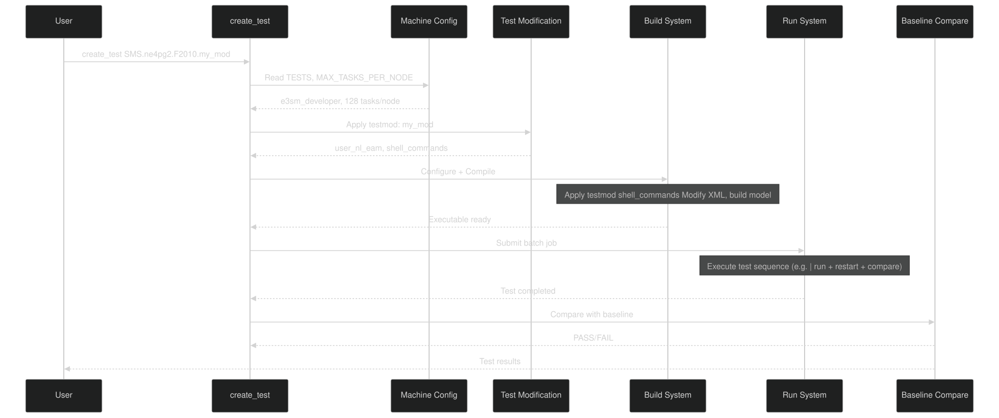

# Test Types and Use Cases

Relevant source files

- [cime_config/allactive/config_compsets.xml](https://github.com/jingtao-lbl/E3SM/blob/389f40b9/cime_config/allactive/config_compsets.xml)
- [cime_config/allactive/config_pesall.xml](https://github.com/jingtao-lbl/E3SM/blob/389f40b9/cime_config/allactive/config_pesall.xml)
- [cime_config/allactive/testlist_allactive.xml](https://github.com/jingtao-lbl/E3SM/blob/389f40b9/cime_config/allactive/testlist_allactive.xml)
- [cime_config/config_archive.xml](https://github.com/jingtao-lbl/E3SM/blob/389f40b9/cime_config/config_archive.xml)
- [cime_config/config_inputdata.xml](https://github.com/jingtao-lbl/E3SM/blob/389f40b9/cime_config/config_inputdata.xml)
- [cime_config/customize/provenance.py](https://github.com/jingtao-lbl/E3SM/blob/389f40b9/cime_config/customize/provenance.py)
- [cime_config/machines/Depends.oneapi-ifx.cmake](https://github.com/jingtao-lbl/E3SM/blob/389f40b9/cime_config/machines/Depends.oneapi-ifx.cmake)
- [cime_config/machines/Depends.oneapi-ifxgpu.cmake](https://github.com/jingtao-lbl/E3SM/blob/389f40b9/cime_config/machines/Depends.oneapi-ifxgpu.cmake)
- [cime_config/machines/cmake_macros/gnu_WSL2.cmake](https://github.com/jingtao-lbl/E3SM/blob/389f40b9/cime_config/machines/cmake_macros/gnu_WSL2.cmake)
- [cime_config/machines/cmake_macros/gnu_gcp10.cmake](https://github.com/jingtao-lbl/E3SM/blob/389f40b9/cime_config/machines/cmake_macros/gnu_gcp10.cmake)
- [cime_config/machines/cmake_macros/gnu_gcp12.cmake](https://github.com/jingtao-lbl/E3SM/blob/389f40b9/cime_config/machines/cmake_macros/gnu_gcp12.cmake)
- [cime_config/machines/cmake_macros/gnugpu_polaris.cmake](https://github.com/jingtao-lbl/E3SM/blob/389f40b9/cime_config/machines/cmake_macros/gnugpu_polaris.cmake)
- [cime_config/machines/cmake_macros/gnugpu_weaver.cmake](https://github.com/jingtao-lbl/E3SM/blob/389f40b9/cime_config/machines/cmake_macros/gnugpu_weaver.cmake)
- [cime_config/machines/cmake_macros/intel_quartz.cmake](https://github.com/jingtao-lbl/E3SM/blob/389f40b9/cime_config/machines/cmake_macros/intel_quartz.cmake)
- [cime_config/machines/cmake_macros/intel_ruby.cmake](https://github.com/jingtao-lbl/E3SM/blob/389f40b9/cime_config/machines/cmake_macros/intel_ruby.cmake)
- [cime_config/machines/cmake_macros/nvidia_polaris.cmake](https://github.com/jingtao-lbl/E3SM/blob/389f40b9/cime_config/machines/cmake_macros/nvidia_polaris.cmake)
- [cime_config/machines/cmake_macros/nvidiagpu_polaris.cmake](https://github.com/jingtao-lbl/E3SM/blob/389f40b9/cime_config/machines/cmake_macros/nvidiagpu_polaris.cmake)
- [cime_config/machines/cmake_macros/oneapi-ifx_aurora.cmake](https://github.com/jingtao-lbl/E3SM/blob/389f40b9/cime_config/machines/cmake_macros/oneapi-ifx_aurora.cmake)
- [cime_config/machines/cmake_macros/oneapi-ifxgpu_aurora.cmake](https://github.com/jingtao-lbl/E3SM/blob/389f40b9/cime_config/machines/cmake_macros/oneapi-ifxgpu_aurora.cmake)
- [cime_config/machines/config_batch.xml](https://github.com/jingtao-lbl/E3SM/blob/389f40b9/cime_config/machines/config_batch.xml)
- [cime_config/machines/config_machines.xml](https://github.com/jingtao-lbl/E3SM/blob/389f40b9/cime_config/machines/config_machines.xml)
- [cime_config/machines/config_pio.xml](https://github.com/jingtao-lbl/E3SM/blob/389f40b9/cime_config/machines/config_pio.xml)
- [cime_config/machines/syslog.alvarez](https://github.com/jingtao-lbl/E3SM/blob/389f40b9/cime_config/machines/syslog.alvarez)
- [cime_config/machines/syslog.pm-cpu](https://github.com/jingtao-lbl/E3SM/blob/389f40b9/cime_config/machines/syslog.pm-cpu)
- [cime_config/machines/syslog.pm-gpu](https://github.com/jingtao-lbl/E3SM/blob/389f40b9/cime_config/machines/syslog.pm-gpu)
- [cime_config/testmods_dirs/allactive/force_netcdf_pio/shell_commands](https://github.com/jingtao-lbl/E3SM/blob/389f40b9/cime_config/testmods_dirs/allactive/force_netcdf_pio/shell_commands)
- [cime_config/testmods_dirs/allactive/mach/pet/shell_commands](https://github.com/jingtao-lbl/E3SM/blob/389f40b9/cime_config/testmods_dirs/allactive/mach/pet/shell_commands)
- [cime_config/testmods_dirs/allactive/mach_mods/shell_commands](https://github.com/jingtao-lbl/E3SM/blob/389f40b9/cime_config/testmods_dirs/allactive/mach_mods/shell_commands)
- [cime_config/testmods_dirs/allactive/v1bgc/shell_commands](https://github.com/jingtao-lbl/E3SM/blob/389f40b9/cime_config/testmods_dirs/allactive/v1bgc/shell_commands)
- [cime_config/testmods_dirs/atmlndactive/rtm_off/README](https://github.com/jingtao-lbl/E3SM/blob/389f40b9/cime_config/testmods_dirs/atmlndactive/rtm_off/README)
- [cime_config/testmods_dirs/atmlndactive/rtm_off/user_nl_mosart](https://github.com/jingtao-lbl/E3SM/blob/389f40b9/cime_config/testmods_dirs/atmlndactive/rtm_off/user_nl_mosart)
- [cime_config/tests.py](https://github.com/jingtao-lbl/E3SM/blob/389f40b9/cime_config/tests.py)
- [components/eam/bld/build-namelist](https://github.com/jingtao-lbl/E3SM/blob/389f40b9/components/eam/bld/build-namelist)
- [components/eam/bld/config_files/definition.xml](https://github.com/jingtao-lbl/E3SM/blob/389f40b9/components/eam/bld/config_files/definition.xml)
- [components/eam/bld/config_files/horiz_grid.xml](https://github.com/jingtao-lbl/E3SM/blob/389f40b9/components/eam/bld/config_files/horiz_grid.xml)
- [components/eam/bld/configure](https://github.com/jingtao-lbl/E3SM/blob/389f40b9/components/eam/bld/configure)
- [components/eam/bld/namelist_files/namelist_defaults_eam.xml](https://github.com/jingtao-lbl/E3SM/blob/389f40b9/components/eam/bld/namelist_files/namelist_defaults_eam.xml)
- [components/eam/bld/namelist_files/namelist_definition.xml](https://github.com/jingtao-lbl/E3SM/blob/389f40b9/components/eam/bld/namelist_files/namelist_definition.xml)
- [components/eam/bld/namelist_files/use_cases/1950_MMF-1mom_CMIP6.xml](https://github.com/jingtao-lbl/E3SM/blob/389f40b9/components/eam/bld/namelist_files/use_cases/1950_MMF-1mom_CMIP6.xml)
- [components/eam/bld/namelist_files/use_cases/20TR_MMF-1mom_CMIP6.xml](https://github.com/jingtao-lbl/E3SM/blob/389f40b9/components/eam/bld/namelist_files/use_cases/20TR_MMF-1mom_CMIP6.xml)
- [components/eam/cime_config/config_component.xml](https://github.com/jingtao-lbl/E3SM/blob/389f40b9/components/eam/cime_config/config_component.xml)
- [components/eam/cime_config/config_compsets.xml](https://github.com/jingtao-lbl/E3SM/blob/389f40b9/components/eam/cime_config/config_compsets.xml)
- [components/eam/cime_config/config_pes.xml](https://github.com/jingtao-lbl/E3SM/blob/389f40b9/components/eam/cime_config/config_pes.xml)
- [components/eam/cime_config/testdefs/testmods_dirs/eam/hommexx/shell_commands](https://github.com/jingtao-lbl/E3SM/blob/389f40b9/components/eam/cime_config/testdefs/testmods_dirs/eam/hommexx/shell_commands)
- [components/eam/cime_config/testdefs/testmods_dirs/eam/thetahy_ftype2_energy/shell_commands](https://github.com/jingtao-lbl/E3SM/blob/389f40b9/components/eam/cime_config/testdefs/testmods_dirs/eam/thetahy_ftype2_energy/shell_commands)
- [components/eam/cime_config/testdefs/testmods_dirs/eam/thetahy_ftype2_energy/user_nl_eam](https://github.com/jingtao-lbl/E3SM/blob/389f40b9/components/eam/cime_config/testdefs/testmods_dirs/eam/thetahy_ftype2_energy/user_nl_eam)
- [components/eam/src/chemistry/mozart/chemistry.F90](https://github.com/jingtao-lbl/E3SM/blob/389f40b9/components/eam/src/chemistry/mozart/chemistry.F90)
- [components/eam/src/chemistry/mozart/lin_strat_chem.F90](https://github.com/jingtao-lbl/E3SM/blob/389f40b9/components/eam/src/chemistry/mozart/lin_strat_chem.F90)
- [components/eam/src/chemistry/mozart/linoz_data.F90](https://github.com/jingtao-lbl/E3SM/blob/389f40b9/components/eam/src/chemistry/mozart/linoz_data.F90)
- [components/eam/src/chemistry/mozart/mo_chm_diags.F90](https://github.com/jingtao-lbl/E3SM/blob/389f40b9/components/eam/src/chemistry/mozart/mo_chm_diags.F90)
- [components/eam/src/chemistry/mozart/mo_extfrc.F90](https://github.com/jingtao-lbl/E3SM/blob/389f40b9/components/eam/src/chemistry/mozart/mo_extfrc.F90)
- [components/eam/src/chemistry/mozart/mo_gas_phase_chemdr.F90](https://github.com/jingtao-lbl/E3SM/blob/389f40b9/components/eam/src/chemistry/mozart/mo_gas_phase_chemdr.F90)
- [components/eam/src/chemistry/mozart/mo_neu_wetdep.F90](https://github.com/jingtao-lbl/E3SM/blob/389f40b9/components/eam/src/chemistry/mozart/mo_neu_wetdep.F90)
- [components/eam/src/chemistry/mozart/mo_photo.F90](https://github.com/jingtao-lbl/E3SM/blob/389f40b9/components/eam/src/chemistry/mozart/mo_photo.F90)
- [components/eam/src/chemistry/mozart/mo_setext.F90](https://github.com/jingtao-lbl/E3SM/blob/389f40b9/components/eam/src/chemistry/mozart/mo_setext.F90)
- [components/eam/src/chemistry/utils/aircraft_emit.F90](https://github.com/jingtao-lbl/E3SM/blob/389f40b9/components/eam/src/chemistry/utils/aircraft_emit.F90)
- [components/eam/src/chemistry/utils/tracer_data.F90](https://github.com/jingtao-lbl/E3SM/blob/389f40b9/components/eam/src/chemistry/utils/tracer_data.F90)
- [components/eam/src/dynamics/fv/dyn_grid.F90](https://github.com/jingtao-lbl/E3SM/blob/389f40b9/components/eam/src/dynamics/fv/dyn_grid.F90)
- [components/eam/src/physics/cam/check_energy.F90](https://github.com/jingtao-lbl/E3SM/blob/389f40b9/components/eam/src/physics/cam/check_energy.F90)
- [components/eam/src/physics/cam/co2_cycle.F90](https://github.com/jingtao-lbl/E3SM/blob/389f40b9/components/eam/src/physics/cam/co2_cycle.F90)
- [components/eam/src/physics/cam/co2_data_flux.F90](https://github.com/jingtao-lbl/E3SM/blob/389f40b9/components/eam/src/physics/cam/co2_data_flux.F90)
- [components/eam/src/physics/cam/co2_diagnostics.F90](https://github.com/jingtao-lbl/E3SM/blob/389f40b9/components/eam/src/physics/cam/co2_diagnostics.F90)
- [components/eam/src/physics/cam/nudging.F90](https://github.com/jingtao-lbl/E3SM/blob/389f40b9/components/eam/src/physics/cam/nudging.F90)
- [components/eam/src/physics/cam/phys_control.F90](https://github.com/jingtao-lbl/E3SM/blob/389f40b9/components/eam/src/physics/cam/phys_control.F90)
- [components/eam/src/physics/cam/physics_types.F90](https://github.com/jingtao-lbl/E3SM/blob/389f40b9/components/eam/src/physics/cam/physics_types.F90)
- [components/eam/src/physics/cam/physpkg.F90](https://github.com/jingtao-lbl/E3SM/blob/389f40b9/components/eam/src/physics/cam/physpkg.F90)
- [components/eam/src/physics/cam/qneg4.F90](https://github.com/jingtao-lbl/E3SM/blob/389f40b9/components/eam/src/physics/cam/qneg4.F90)
- [components/eam/src/physics/cam/tropopause.F90](https://github.com/jingtao-lbl/E3SM/blob/389f40b9/components/eam/src/physics/cam/tropopause.F90)
- [components/eamxx/cmake/machine-files/lassen.cmake](https://github.com/jingtao-lbl/E3SM/blob/389f40b9/components/eamxx/cmake/machine-files/lassen.cmake)
- [components/eamxx/cmake/machine-files/muller-cpu.cmake](https://github.com/jingtao-lbl/E3SM/blob/389f40b9/components/eamxx/cmake/machine-files/muller-cpu.cmake)
- [components/eamxx/cmake/machine-files/muller-gpu.cmake](https://github.com/jingtao-lbl/E3SM/blob/389f40b9/components/eamxx/cmake/machine-files/muller-gpu.cmake)
- [components/eamxx/cmake/machine-files/quartz-intel.cmake](https://github.com/jingtao-lbl/E3SM/blob/389f40b9/components/eamxx/cmake/machine-files/quartz-intel.cmake)
- [components/eamxx/cmake/machine-files/quartz.cmake](https://github.com/jingtao-lbl/E3SM/blob/389f40b9/components/eamxx/cmake/machine-files/quartz.cmake)
- [components/eamxx/cmake/machine-files/ruby-intel.cmake](https://github.com/jingtao-lbl/E3SM/blob/389f40b9/components/eamxx/cmake/machine-files/ruby-intel.cmake)
- [components/eamxx/cmake/machine-files/ruby.cmake](https://github.com/jingtao-lbl/E3SM/blob/389f40b9/components/eamxx/cmake/machine-files/ruby.cmake)
- [components/eamxx/cmake/machine-files/weaver.cmake](https://github.com/jingtao-lbl/E3SM/blob/389f40b9/components/eamxx/cmake/machine-files/weaver.cmake)
- [components/eamxx/scripts/machines_specs.py](https://github.com/jingtao-lbl/E3SM/blob/389f40b9/components/eamxx/scripts/machines_specs.py)
- [components/eamxx/scripts/update-all-pip](https://github.com/jingtao-lbl/E3SM/blob/389f40b9/components/eamxx/scripts/update-all-pip)
- [components/elm/cime_config/config_pes.xml](https://github.com/jingtao-lbl/E3SM/blob/389f40b9/components/elm/cime_config/config_pes.xml)
- [components/elm/cime_config/testdefs/testmods_dirs/elm/erosion/shell_commands](https://github.com/jingtao-lbl/E3SM/blob/389f40b9/components/elm/cime_config/testdefs/testmods_dirs/elm/erosion/shell_commands)
- [components/elm/cime_config/testdefs/testmods_dirs/elm/erosion/user_nl_elm](https://github.com/jingtao-lbl/E3SM/blob/389f40b9/components/elm/cime_config/testdefs/testmods_dirs/elm/erosion/user_nl_elm)
- [components/mpas-albany-landice/cime_config/config_pes.xml](https://github.com/jingtao-lbl/E3SM/blob/389f40b9/components/mpas-albany-landice/cime_config/config_pes.xml)
- [components/mpas-ocean/cime_config/config_pes.xml](https://github.com/jingtao-lbl/E3SM/blob/389f40b9/components/mpas-ocean/cime_config/config_pes.xml)
- [components/mpas-seaice/cime_config/config_pes.xml](https://github.com/jingtao-lbl/E3SM/blob/389f40b9/components/mpas-seaice/cime_config/config_pes.xml)
- [driver-mct/cime_config/config_component_e3sm.xml](https://github.com/jingtao-lbl/E3SM/blob/389f40b9/driver-mct/cime_config/config_component_e3sm.xml)
- [share/util/shr_infnan_mod.F90.in](https://github.com/jingtao-lbl/E3SM/blob/389f40b9/share/util/shr_infnan_mod.F90.in)

## Purpose and Scope

This page documents the different test types available in E3SM's testing infrastructure, their naming conventions, how test suites are organized, and how to create custom test modifications. For information about the overall test infrastructure and test execution, see [Test Infrastructure](#5.1) . For information about baseline management and comparison, see [Provenance and Reproducibility](#8.3) .

## Test Naming Convention

All E3SM tests follow a standardized naming pattern defined in [cime_config/tests.py 1-9](https://github.com/jingtao-lbl/E3SM/blob/389f40b9/cime_config/tests.py#L1-L9) :

Where:

- **TEST_TYPE**: A 3-4 character code indicating the test type (SMS, ERS, ERP, etc.)
- **GRID**`ne4pg2_oQU480``ne30pg2_r05_IcoswISC30E3r5`: The grid resolution identifier (e.g., , )
- **COMPSET**`F2010``WCYCL1850`: The component set defining which components are active (e.g., , )
- **TESTMOD**: Optional test modification directory name to override default configurations

Examples from test suite definitions:

- `SMS_Ln5.ne4pg2_oQU480.F2010`- Smoke test, 5-day run length
- `ERS_Ld3.ne4pg2_oQU480.F2010`- Exact restart test, 3-day run
- `ERP_Ln9.ne4pg2_ne4pg2.FAQP.eam-clubb_only`- Reproducibility test with testmod

Sources:  [cime_config/tests.py 1-9](https://github.com/jingtao-lbl/E3SM/blob/389f40b9/cime_config/tests.py#L1-L9)

## Test Type Categories

Sources:  [cime_config/tests.py 100-730](https://github.com/jingtao-lbl/E3SM/blob/389f40b9/cime_config/tests.py#L100-L730)

## Core Test Types

### SMS - Smoke Test

The most basic test type that verifies the model runs without crashing for a short period.

Naming Pattern:  `SMS[_D][_Modifier].GRID.COMPSET[.TESTMOD]`

Modifiers:

- `_D`- Debug mode (compile with debugging flags)
- `_Ln``_Ln5`- Run length in days (e.g., = 5 days)
- `_Ly`- Run length in years
- `_Lm`- Run length in months

Examples from test suites:

Sources:  [cime_config/tests.py 100-110](https://github.com/jingtao-lbl/E3SM/blob/389f40b9/cime_config/tests.py#L100-L110)  [cime_config/tests.py 258-276](https://github.com/jingtao-lbl/E3SM/blob/389f40b9/cime_config/tests.py#L258-L276)

### ERS - Exact Restart Test

Validates that restarting the model produces bit-for-bit identical results.

Test Sequence:

Naming Pattern:  `ERS[_D][_Modifier].GRID.COMPSET[.TESTMOD]`

Examples:

Sources:  [cime_config/tests.py 43-51](https://github.com/jingtao-lbl/E3SM/blob/389f40b9/cime_config/tests.py#L43-L51)  [cime_config/tests.py 82-87](https://github.com/jingtao-lbl/E3SM/blob/389f40b9/cime_config/tests.py#L82-L87)

### ERP - Reproducibility Test (PE Layout)

Verifies bit-for-bit reproducibility when changing processor layout (task/thread counts).

Test Sequence:

Examples:

Sources:  [cime_config/tests.py 103](https://github.com/jingtao-lbl/E3SM/blob/389f40b9/cime_config/tests.py#L103-L103)  [cime_config/tests.py 167-186](https://github.com/jingtao-lbl/E3SM/blob/389f40b9/cime_config/tests.py#L167-L186)

### REP - Reproducibility Restart Test

Combines restart testing with PE layout changes.

Examples:

Sources:  [cime_config/tests.py 135-143](https://github.com/jingtao-lbl/E3SM/blob/389f40b9/cime_config/tests.py#L135-L143)  [cime_config/tests.py 154-165](https://github.com/jingtao-lbl/E3SM/blob/389f40b9/cime_config/tests.py#L154-L165)

### PET - Performance Timing Test

Measures model throughput and generates timing statistics.

Purpose:

- Measure simulated years per day (SYPD)
- Identify performance regressions
- Compare performance across configurations

Examples:

Sources:  [cime_config/tests.py 118-120](https://github.com/jingtao-lbl/E3SM/blob/389f40b9/cime_config/tests.py#L118-L120)  [cime_config/tests.py 173-174](https://github.com/jingtao-lbl/E3SM/blob/389f40b9/cime_config/tests.py#L173-L174)

### PEM - Memory Usage Test

Profiles memory consumption to detect memory leaks and characterize memory usage patterns.

Examples:

Sources:  [cime_config/tests.py 118](https://github.com/jingtao-lbl/E3SM/blob/389f40b9/cime_config/tests.py#L118-L118)  [cime_config/tests.py 137-138](https://github.com/jingtao-lbl/E3SM/blob/389f40b9/cime_config/tests.py#L137-L138)

## Test Length Modifiers

Common patterns in test definitions:

- `_Ln5`- 5 days (typical for development tests)
- `_Ln9`- 9 days (extended validation)
- `_Ld3`- 3 days (restart tests)
- `_Lm6`- 6 months (long FATES tests)
- `_Ly2`- 2 years (multi-year ELM tests)

Sources:  [cime_config/tests.py 84-97](https://github.com/jingtao-lbl/E3SM/blob/389f40b9/cime_config/tests.py#L84-L97)  [cime_config/tests.py 402-409](https://github.com/jingtao-lbl/E3SM/blob/389f40b9/cime_config/tests.py#L402-L409)

## Test Suite Organization

Test suites are hierarchically organized with inheritance support as defined in [cime_config/tests.py 11-10](https://github.com/jingtao-lbl/E3SM/blob/389f40b9/cime_config/tests.py#L11-L10) :

### Suite Attributes

Test suites in [cime_config/tests.py](https://github.com/jingtao-lbl/E3SM/blob/389f40b9/cime_config/tests.py) support three key attributes:

1. inherit - Suite inheritance (line 16)

2. share - Build sharing (line 17)

3. time - Maximum walltime (line 16)

Example suite definition:

Sources:  [cime_config/tests.py 77-98](https://github.com/jingtao-lbl/E3SM/blob/389f40b9/cime_config/tests.py#L77-L98)  [cime_config/tests.py 11-18](https://github.com/jingtao-lbl/E3SM/blob/389f40b9/cime_config/tests.py#L11-L18)

## Machine-Specific Test Configuration

Machines define default test suites and execution parameters in [cime_config/machines/config_machines.xml](https://github.com/jingtao-lbl/E3SM/blob/389f40b9/cime_config/machines/config_machines.xml) :

Key machine test parameters:

- `TESTS`- Default test suite to run
- `NTEST_PARALLEL_JOBS`- Number of tests to run concurrently
- `TEST_TPUT_TOLERANCE`- Acceptable throughput variation (10% = 0.1)
- `TEST_MEMLEAK_TOLERANCE`- Acceptable memory leak threshold (20% = 0.20)
- `MAX_GB_OLD_TEST_DATA`- Disk space limit for old test data

Sources:  [cime_config/machines/config_machines.xml 74-76](https://github.com/jingtao-lbl/E3SM/blob/389f40b9/cime_config/machines/config_machines.xml#L74-L76)  [cime_config/machines/config_machines.xml 165-167](https://github.com/jingtao-lbl/E3SM/blob/389f40b9/cime_config/machines/config_machines.xml#L165-L167)  [cime_config/machines/config_machines.xml 252-253](https://github.com/jingtao-lbl/E3SM/blob/389f40b9/cime_config/machines/config_machines.xml#L252-L253)

## Test Modifications (testmods)

Test modifications allow customization of test configurations without creating new test types. Testmods are stored in component-specific directories and override default namelist settings, XML configurations, or provide additional input files.

### Testmod Directory Structure

Component testmods are organized under:

Example EAM testmod structure:

Example ELM testmod structure:

Sources:  [cime_config/tests.py 103-112](https://github.com/jingtao-lbl/E3SM/blob/389f40b9/cime_config/tests.py#L103-L112)  [cime_config/tests.py 86-96](https://github.com/jingtao-lbl/E3SM/blob/389f40b9/cime_config/tests.py#L86-L96)

### Common Testmod Files

user_nl_files * - Namelist variable overrides

shell_commands - Environment setup or pre-test configuration

XML modifications - Typically applied via shell_commands

Sources: Based on patterns in [cime_config/tests.py 100-200](https://github.com/jingtao-lbl/E3SM/blob/389f40b9/cime_config/tests.py#L100-L200)

## Test Suite Examples

### Developer Suite (Quick Validation)

Sources:  [cime_config/tests.py 258-276](https://github.com/jingtao-lbl/E3SM/blob/389f40b9/cime_config/tests.py#L258-L276)

### Atmosphere Integration Suite

Sources:  [cime_config/tests.py 167-186](https://github.com/jingtao-lbl/E3SM/blob/389f40b9/cime_config/tests.py#L167-L186)

### Shared Build Suite

Sources:  [cime_config/tests.py 481-491](https://github.com/jingtao-lbl/E3SM/blob/389f40b9/cime_config/tests.py#L481-L491)

## Component-Specific Test Patterns

### EAM Atmosphere Tests

Example test definitions:

Sources:  [cime_config/tests.py 100-165](https://github.com/jingtao-lbl/E3SM/blob/389f40b9/cime_config/tests.py#L100-L165)  [cime_config/tests.py 154-165](https://github.com/jingtao-lbl/E3SM/blob/389f40b9/cime_config/tests.py#L154-L165)  [cime_config/tests.py 588-675](https://github.com/jingtao-lbl/E3SM/blob/389f40b9/cime_config/tests.py#L588-L675)

### ELM Land Tests

Sources:  [cime_config/tests.py 77-98](https://github.com/jingtao-lbl/E3SM/blob/389f40b9/cime_config/tests.py#L77-L98)  [cime_config/tests.py 382-428](https://github.com/jingtao-lbl/E3SM/blob/389f40b9/cime_config/tests.py#L382-L428)

### MPAS Ocean/Seaice Tests

Sources:  [cime_config/tests.py 114-121](https://github.com/jingtao-lbl/E3SM/blob/389f40b9/cime_config/tests.py#L114-L121)  [cime_config/tests.py 228-243](https://github.com/jingtao-lbl/E3SM/blob/389f40b9/cime_config/tests.py#L228-L243)

## Performance and Scaling Tests

Performance tests follow specific naming patterns and execute at different node counts:

### Performance Test Types

PFS - Performance Scaling Tests strong/weak scaling with fixed problem size or processors:

PFS with Explicit Node Counts Benchmark tests specify exact processor counts:

### Benchmark Suite Organization

Sources:  [cime_config/tests.py 553-586](https://github.com/jingtao-lbl/E3SM/blob/389f40b9/cime_config/tests.py#L553-L586)

## Debug Test Variants

Debug mode tests use the `_D` suffix and compile with debugging flags:

Sources:  [cime_config/tests.py 63-74](https://github.com/jingtao-lbl/E3SM/blob/389f40b9/cime_config/tests.py#L63-L74)  [cime_config/tests.py 382-387](https://github.com/jingtao-lbl/E3SM/blob/389f40b9/cime_config/tests.py#L382-L387)

## Production-Like Test Configurations

Tests that mimic production run settings use the `wcprod` testmod:

Sources:  [cime_config/tests.py 212-217](https://github.com/jingtao-lbl/E3SM/blob/389f40b9/cime_config/tests.py#L212-L217)  [cime_config/tests.py 346-368](https://github.com/jingtao-lbl/E3SM/blob/389f40b9/cime_config/tests.py#L346-L368)

## Creating Custom Test Modifications

### Step 1: Create Testmod Directory

### Step 2: Add Namelist Overrides

Create `user_nl_<component>` files:

### Step 3: Add Shell Commands (optional)

Create `shell_commands` for build-time configuration:

### Step 4: Reference in Test Definition

Add to [cime_config/tests.py](https://github.com/jingtao-lbl/E3SM/blob/389f40b9/cime_config/tests.py) :

Sources: Based on patterns in [cime_config/tests.py](https://github.com/jingtao-lbl/E3SM/blob/389f40b9/cime_config/tests.py) and general testmod structure

## Test Execution Workflow

Sources: Based on general CIME test workflow and [cime_config/tests.py](https://github.com/jingtao-lbl/E3SM/blob/389f40b9/cime_config/tests.py) structure

## Summary of Test Types by Purpose

| Test Type | Primary Purpose | Key Validation | Typical Length | 
| --- | --- | --- | --- |
| SMS | Basic functionality | Model runs without crash | 1-9 days | 
| ERS | Restart correctness | Bit-for-bit restart | 3-5 days | 
| ERP | PE layout reproducibility | Bit-for-bit across layouts | 3-9 days | 
| REP | Combined restart+PE | Both restart and PE changes | 5-9 days | 
| PET | Performance timing | Throughput (SYPD) | 5-9 days | 
| PEM | Memory profiling | Memory usage/leaks | 5-90 days | 
| PFS | Scaling performance | Strong/weak scaling | Varies | 
| SEQ | Single processor | Sequential execution | Short | 
| NCK | Namelist validation | Namelist correctness | N/A (setup only) | 
| PGN | Non-BFB comparison | Perturbation growth | Varies | 

Sources:  [cime_config/tests.py 1-730](https://github.com/jingtao-lbl/E3SM/blob/389f40b9/cime_config/tests.py#L1-L730)