# Testing and Validation

Relevant source files

- [cime_config/allactive/config_compsets.xml](https://github.com/jingtao-lbl/E3SM/blob/389f40b9/cime_config/allactive/config_compsets.xml)
- [cime_config/allactive/config_pesall.xml](https://github.com/jingtao-lbl/E3SM/blob/389f40b9/cime_config/allactive/config_pesall.xml)
- [cime_config/allactive/testlist_allactive.xml](https://github.com/jingtao-lbl/E3SM/blob/389f40b9/cime_config/allactive/testlist_allactive.xml)
- [cime_config/config_archive.xml](https://github.com/jingtao-lbl/E3SM/blob/389f40b9/cime_config/config_archive.xml)
- [cime_config/config_inputdata.xml](https://github.com/jingtao-lbl/E3SM/blob/389f40b9/cime_config/config_inputdata.xml)
- [cime_config/customize/provenance.py](https://github.com/jingtao-lbl/E3SM/blob/389f40b9/cime_config/customize/provenance.py)
- [cime_config/machines/Depends.oneapi-ifx.cmake](https://github.com/jingtao-lbl/E3SM/blob/389f40b9/cime_config/machines/Depends.oneapi-ifx.cmake)
- [cime_config/machines/Depends.oneapi-ifxgpu.cmake](https://github.com/jingtao-lbl/E3SM/blob/389f40b9/cime_config/machines/Depends.oneapi-ifxgpu.cmake)
- [cime_config/machines/cmake_macros/gnu_WSL2.cmake](https://github.com/jingtao-lbl/E3SM/blob/389f40b9/cime_config/machines/cmake_macros/gnu_WSL2.cmake)
- [cime_config/machines/cmake_macros/gnu_gcp10.cmake](https://github.com/jingtao-lbl/E3SM/blob/389f40b9/cime_config/machines/cmake_macros/gnu_gcp10.cmake)
- [cime_config/machines/cmake_macros/gnu_gcp12.cmake](https://github.com/jingtao-lbl/E3SM/blob/389f40b9/cime_config/machines/cmake_macros/gnu_gcp12.cmake)
- [cime_config/machines/cmake_macros/gnugpu_polaris.cmake](https://github.com/jingtao-lbl/E3SM/blob/389f40b9/cime_config/machines/cmake_macros/gnugpu_polaris.cmake)
- [cime_config/machines/cmake_macros/gnugpu_weaver.cmake](https://github.com/jingtao-lbl/E3SM/blob/389f40b9/cime_config/machines/cmake_macros/gnugpu_weaver.cmake)
- [cime_config/machines/cmake_macros/intel_quartz.cmake](https://github.com/jingtao-lbl/E3SM/blob/389f40b9/cime_config/machines/cmake_macros/intel_quartz.cmake)
- [cime_config/machines/cmake_macros/intel_ruby.cmake](https://github.com/jingtao-lbl/E3SM/blob/389f40b9/cime_config/machines/cmake_macros/intel_ruby.cmake)
- [cime_config/machines/cmake_macros/nvidia_polaris.cmake](https://github.com/jingtao-lbl/E3SM/blob/389f40b9/cime_config/machines/cmake_macros/nvidia_polaris.cmake)
- [cime_config/machines/cmake_macros/nvidiagpu_polaris.cmake](https://github.com/jingtao-lbl/E3SM/blob/389f40b9/cime_config/machines/cmake_macros/nvidiagpu_polaris.cmake)
- [cime_config/machines/cmake_macros/oneapi-ifx_aurora.cmake](https://github.com/jingtao-lbl/E3SM/blob/389f40b9/cime_config/machines/cmake_macros/oneapi-ifx_aurora.cmake)
- [cime_config/machines/cmake_macros/oneapi-ifxgpu_aurora.cmake](https://github.com/jingtao-lbl/E3SM/blob/389f40b9/cime_config/machines/cmake_macros/oneapi-ifxgpu_aurora.cmake)
- [cime_config/machines/config_batch.xml](https://github.com/jingtao-lbl/E3SM/blob/389f40b9/cime_config/machines/config_batch.xml)
- [cime_config/machines/config_machines.xml](https://github.com/jingtao-lbl/E3SM/blob/389f40b9/cime_config/machines/config_machines.xml)
- [cime_config/machines/config_pio.xml](https://github.com/jingtao-lbl/E3SM/blob/389f40b9/cime_config/machines/config_pio.xml)
- [cime_config/machines/syslog.alvarez](https://github.com/jingtao-lbl/E3SM/blob/389f40b9/cime_config/machines/syslog.alvarez)
- [cime_config/machines/syslog.pm-cpu](https://github.com/jingtao-lbl/E3SM/blob/389f40b9/cime_config/machines/syslog.pm-cpu)
- [cime_config/machines/syslog.pm-gpu](https://github.com/jingtao-lbl/E3SM/blob/389f40b9/cime_config/machines/syslog.pm-gpu)
- [cime_config/testmods_dirs/allactive/force_netcdf_pio/shell_commands](https://github.com/jingtao-lbl/E3SM/blob/389f40b9/cime_config/testmods_dirs/allactive/force_netcdf_pio/shell_commands)
- [cime_config/testmods_dirs/allactive/mach/pet/shell_commands](https://github.com/jingtao-lbl/E3SM/blob/389f40b9/cime_config/testmods_dirs/allactive/mach/pet/shell_commands)
- [cime_config/testmods_dirs/allactive/mach_mods/shell_commands](https://github.com/jingtao-lbl/E3SM/blob/389f40b9/cime_config/testmods_dirs/allactive/mach_mods/shell_commands)
- [cime_config/testmods_dirs/allactive/v1bgc/shell_commands](https://github.com/jingtao-lbl/E3SM/blob/389f40b9/cime_config/testmods_dirs/allactive/v1bgc/shell_commands)
- [cime_config/testmods_dirs/atmlndactive/rtm_off/README](https://github.com/jingtao-lbl/E3SM/blob/389f40b9/cime_config/testmods_dirs/atmlndactive/rtm_off/README)
- [cime_config/testmods_dirs/atmlndactive/rtm_off/user_nl_mosart](https://github.com/jingtao-lbl/E3SM/blob/389f40b9/cime_config/testmods_dirs/atmlndactive/rtm_off/user_nl_mosart)
- [cime_config/tests.py](https://github.com/jingtao-lbl/E3SM/blob/389f40b9/cime_config/tests.py)
- [components/eam/bld/build-namelist](https://github.com/jingtao-lbl/E3SM/blob/389f40b9/components/eam/bld/build-namelist)
- [components/eam/bld/config_files/definition.xml](https://github.com/jingtao-lbl/E3SM/blob/389f40b9/components/eam/bld/config_files/definition.xml)
- [components/eam/bld/config_files/horiz_grid.xml](https://github.com/jingtao-lbl/E3SM/blob/389f40b9/components/eam/bld/config_files/horiz_grid.xml)
- [components/eam/bld/configure](https://github.com/jingtao-lbl/E3SM/blob/389f40b9/components/eam/bld/configure)
- [components/eam/bld/namelist_files/namelist_defaults_eam.xml](https://github.com/jingtao-lbl/E3SM/blob/389f40b9/components/eam/bld/namelist_files/namelist_defaults_eam.xml)
- [components/eam/bld/namelist_files/namelist_definition.xml](https://github.com/jingtao-lbl/E3SM/blob/389f40b9/components/eam/bld/namelist_files/namelist_definition.xml)
- [components/eam/bld/namelist_files/use_cases/1950_MMF-1mom_CMIP6.xml](https://github.com/jingtao-lbl/E3SM/blob/389f40b9/components/eam/bld/namelist_files/use_cases/1950_MMF-1mom_CMIP6.xml)
- [components/eam/bld/namelist_files/use_cases/20TR_MMF-1mom_CMIP6.xml](https://github.com/jingtao-lbl/E3SM/blob/389f40b9/components/eam/bld/namelist_files/use_cases/20TR_MMF-1mom_CMIP6.xml)
- [components/eam/cime_config/config_component.xml](https://github.com/jingtao-lbl/E3SM/blob/389f40b9/components/eam/cime_config/config_component.xml)
- [components/eam/cime_config/config_compsets.xml](https://github.com/jingtao-lbl/E3SM/blob/389f40b9/components/eam/cime_config/config_compsets.xml)
- [components/eam/cime_config/config_pes.xml](https://github.com/jingtao-lbl/E3SM/blob/389f40b9/components/eam/cime_config/config_pes.xml)
- [components/eam/cime_config/testdefs/testmods_dirs/eam/hommexx/shell_commands](https://github.com/jingtao-lbl/E3SM/blob/389f40b9/components/eam/cime_config/testdefs/testmods_dirs/eam/hommexx/shell_commands)
- [components/eam/cime_config/testdefs/testmods_dirs/eam/thetahy_ftype2_energy/shell_commands](https://github.com/jingtao-lbl/E3SM/blob/389f40b9/components/eam/cime_config/testdefs/testmods_dirs/eam/thetahy_ftype2_energy/shell_commands)
- [components/eam/cime_config/testdefs/testmods_dirs/eam/thetahy_ftype2_energy/user_nl_eam](https://github.com/jingtao-lbl/E3SM/blob/389f40b9/components/eam/cime_config/testdefs/testmods_dirs/eam/thetahy_ftype2_energy/user_nl_eam)
- [components/eam/src/chemistry/mozart/chemistry.F90](https://github.com/jingtao-lbl/E3SM/blob/389f40b9/components/eam/src/chemistry/mozart/chemistry.F90)
- [components/eam/src/chemistry/mozart/lin_strat_chem.F90](https://github.com/jingtao-lbl/E3SM/blob/389f40b9/components/eam/src/chemistry/mozart/lin_strat_chem.F90)
- [components/eam/src/chemistry/mozart/linoz_data.F90](https://github.com/jingtao-lbl/E3SM/blob/389f40b9/components/eam/src/chemistry/mozart/linoz_data.F90)
- [components/eam/src/chemistry/mozart/mo_chm_diags.F90](https://github.com/jingtao-lbl/E3SM/blob/389f40b9/components/eam/src/chemistry/mozart/mo_chm_diags.F90)
- [components/eam/src/chemistry/mozart/mo_extfrc.F90](https://github.com/jingtao-lbl/E3SM/blob/389f40b9/components/eam/src/chemistry/mozart/mo_extfrc.F90)
- [components/eam/src/chemistry/mozart/mo_gas_phase_chemdr.F90](https://github.com/jingtao-lbl/E3SM/blob/389f40b9/components/eam/src/chemistry/mozart/mo_gas_phase_chemdr.F90)
- [components/eam/src/chemistry/mozart/mo_neu_wetdep.F90](https://github.com/jingtao-lbl/E3SM/blob/389f40b9/components/eam/src/chemistry/mozart/mo_neu_wetdep.F90)
- [components/eam/src/chemistry/mozart/mo_photo.F90](https://github.com/jingtao-lbl/E3SM/blob/389f40b9/components/eam/src/chemistry/mozart/mo_photo.F90)
- [components/eam/src/chemistry/mozart/mo_setext.F90](https://github.com/jingtao-lbl/E3SM/blob/389f40b9/components/eam/src/chemistry/mozart/mo_setext.F90)
- [components/eam/src/chemistry/utils/aircraft_emit.F90](https://github.com/jingtao-lbl/E3SM/blob/389f40b9/components/eam/src/chemistry/utils/aircraft_emit.F90)
- [components/eam/src/chemistry/utils/tracer_data.F90](https://github.com/jingtao-lbl/E3SM/blob/389f40b9/components/eam/src/chemistry/utils/tracer_data.F90)
- [components/eam/src/dynamics/fv/dyn_grid.F90](https://github.com/jingtao-lbl/E3SM/blob/389f40b9/components/eam/src/dynamics/fv/dyn_grid.F90)
- [components/eam/src/physics/cam/check_energy.F90](https://github.com/jingtao-lbl/E3SM/blob/389f40b9/components/eam/src/physics/cam/check_energy.F90)
- [components/eam/src/physics/cam/co2_cycle.F90](https://github.com/jingtao-lbl/E3SM/blob/389f40b9/components/eam/src/physics/cam/co2_cycle.F90)
- [components/eam/src/physics/cam/co2_data_flux.F90](https://github.com/jingtao-lbl/E3SM/blob/389f40b9/components/eam/src/physics/cam/co2_data_flux.F90)
- [components/eam/src/physics/cam/co2_diagnostics.F90](https://github.com/jingtao-lbl/E3SM/blob/389f40b9/components/eam/src/physics/cam/co2_diagnostics.F90)
- [components/eam/src/physics/cam/nudging.F90](https://github.com/jingtao-lbl/E3SM/blob/389f40b9/components/eam/src/physics/cam/nudging.F90)
- [components/eam/src/physics/cam/phys_control.F90](https://github.com/jingtao-lbl/E3SM/blob/389f40b9/components/eam/src/physics/cam/phys_control.F90)
- [components/eam/src/physics/cam/physics_types.F90](https://github.com/jingtao-lbl/E3SM/blob/389f40b9/components/eam/src/physics/cam/physics_types.F90)
- [components/eam/src/physics/cam/physpkg.F90](https://github.com/jingtao-lbl/E3SM/blob/389f40b9/components/eam/src/physics/cam/physpkg.F90)
- [components/eam/src/physics/cam/qneg4.F90](https://github.com/jingtao-lbl/E3SM/blob/389f40b9/components/eam/src/physics/cam/qneg4.F90)
- [components/eam/src/physics/cam/tropopause.F90](https://github.com/jingtao-lbl/E3SM/blob/389f40b9/components/eam/src/physics/cam/tropopause.F90)
- [components/eamxx/cmake/machine-files/lassen.cmake](https://github.com/jingtao-lbl/E3SM/blob/389f40b9/components/eamxx/cmake/machine-files/lassen.cmake)
- [components/eamxx/cmake/machine-files/muller-cpu.cmake](https://github.com/jingtao-lbl/E3SM/blob/389f40b9/components/eamxx/cmake/machine-files/muller-cpu.cmake)
- [components/eamxx/cmake/machine-files/muller-gpu.cmake](https://github.com/jingtao-lbl/E3SM/blob/389f40b9/components/eamxx/cmake/machine-files/muller-gpu.cmake)
- [components/eamxx/cmake/machine-files/quartz-intel.cmake](https://github.com/jingtao-lbl/E3SM/blob/389f40b9/components/eamxx/cmake/machine-files/quartz-intel.cmake)
- [components/eamxx/cmake/machine-files/quartz.cmake](https://github.com/jingtao-lbl/E3SM/blob/389f40b9/components/eamxx/cmake/machine-files/quartz.cmake)
- [components/eamxx/cmake/machine-files/ruby-intel.cmake](https://github.com/jingtao-lbl/E3SM/blob/389f40b9/components/eamxx/cmake/machine-files/ruby-intel.cmake)
- [components/eamxx/cmake/machine-files/ruby.cmake](https://github.com/jingtao-lbl/E3SM/blob/389f40b9/components/eamxx/cmake/machine-files/ruby.cmake)
- [components/eamxx/cmake/machine-files/weaver.cmake](https://github.com/jingtao-lbl/E3SM/blob/389f40b9/components/eamxx/cmake/machine-files/weaver.cmake)
- [components/eamxx/scripts/machines_specs.py](https://github.com/jingtao-lbl/E3SM/blob/389f40b9/components/eamxx/scripts/machines_specs.py)
- [components/eamxx/scripts/update-all-pip](https://github.com/jingtao-lbl/E3SM/blob/389f40b9/components/eamxx/scripts/update-all-pip)
- [components/elm/cime_config/config_pes.xml](https://github.com/jingtao-lbl/E3SM/blob/389f40b9/components/elm/cime_config/config_pes.xml)
- [components/elm/cime_config/testdefs/testmods_dirs/elm/erosion/shell_commands](https://github.com/jingtao-lbl/E3SM/blob/389f40b9/components/elm/cime_config/testdefs/testmods_dirs/elm/erosion/shell_commands)
- [components/elm/cime_config/testdefs/testmods_dirs/elm/erosion/user_nl_elm](https://github.com/jingtao-lbl/E3SM/blob/389f40b9/components/elm/cime_config/testdefs/testmods_dirs/elm/erosion/user_nl_elm)
- [components/mpas-albany-landice/cime_config/config_pes.xml](https://github.com/jingtao-lbl/E3SM/blob/389f40b9/components/mpas-albany-landice/cime_config/config_pes.xml)
- [components/mpas-ocean/cime_config/config_pes.xml](https://github.com/jingtao-lbl/E3SM/blob/389f40b9/components/mpas-ocean/cime_config/config_pes.xml)
- [components/mpas-seaice/cime_config/config_pes.xml](https://github.com/jingtao-lbl/E3SM/blob/389f40b9/components/mpas-seaice/cime_config/config_pes.xml)
- [driver-mct/cime_config/config_component_e3sm.xml](https://github.com/jingtao-lbl/E3SM/blob/389f40b9/driver-mct/cime_config/config_component_e3sm.xml)
- [share/util/shr_infnan_mod.F90.in](https://github.com/jingtao-lbl/E3SM/blob/389f40b9/share/util/shr_infnan_mod.F90.in)

This document describes E3SM's comprehensive testing infrastructure, including test suite organization, test types, baseline management, and validation workflows. Testing ensures correctness, reproducibility, and performance across different compsets, grids, PE layouts, and HPC platforms.

For information about machine-specific execution settings, see [Supported Machines](#6.1) . For details on PE layout configuration, see [Parallel Execution Model](#6.2) .

## Overview

E3SM's testing system validates model correctness through automated test suites that check:

- **Bit-for-bit reproducibility**across restarts and PE layout changes
- **Physical consistency**through smoke tests and baseline comparisons
- **Performance metrics**including throughput and memory usage
- **Component integration**in coupled and standalone configurations

All test definitions reside in [cime_config/tests.py 1-751](https://github.com/jingtao-lbl/E3SM/blob/389f40b9/cime_config/tests.py#L1-L751) with machine-specific test settings in [cime_config/machines/config_machines.xml 1-2998](https://github.com/jingtao-lbl/E3SM/blob/389f40b9/cime_config/machines/config_machines.xml#L1-L2998) The testing infrastructure is built on CIME's test framework and leverages the `create_test` utility.

Sources:  [cime_config/tests.py 1-20](https://github.com/jingtao-lbl/E3SM/blob/389f40b9/cime_config/tests.py#L1-L20)  [cime_config/machines/config_machines.xml 59-145](https://github.com/jingtao-lbl/E3SM/blob/389f40b9/cime_config/machines/config_machines.xml#L59-L145)

## Test Suite Organization

Test suites are organized hierarchically with inheritance. The `e3sm_integration` suite inherits from developer suites, which in turn contain component-specific tests. Each suite defines:

- **`share`**: Whether tests share a single build to reduce compilation time
- **`time`**: Recommended upper limit for test completion
- **`inherit`**: Parent suites from which to inherit tests
- **`tests`**: List of individual test specifications

Sources:  [cime_config/tests.py 11-285](https://github.com/jingtao-lbl/E3SM/blob/389f40b9/cime_config/tests.py#L11-L285)  [cime_config/tests.py 258-276](https://github.com/jingtao-lbl/E3SM/blob/389f40b9/cime_config/tests.py#L258-L276)

## Test Naming Convention

Tests follow the format: `TEST_TYPE.GRID.COMPSET[.TESTMOD]`

### Test Type Modifiers

Test types may include modifiers specifying length, threading, or other properties:

| Modifier | Meaning | Example | 
| --- | --- | --- |
| _D | Debug mode | SMS_D_Ln5 | 
| _Ln# | Run length (# timesteps) | SMS_Ln9 | 
| _Ld# | Run length (# days) | ERS_Ld5 | 
| _Lm# | Run length (# months) | ERP_Lm3 | 
| _P#x# | PE layout override | SMS_P12x2 | 
| _PS | Performance small | PET_Ln5_PS | 

Sources:  [cime_config/tests.py 1-9](https://github.com/jingtao-lbl/E3SM/blob/389f40b9/cime_config/tests.py#L1-L9)  [cime_config/tests.py 100-112](https://github.com/jingtao-lbl/E3SM/blob/389f40b9/cime_config/tests.py#L100-L112)

## Test Types

### Primary Test Types

Sources:  [cime_config/tests.py 100-120](https://github.com/jingtao-lbl/E3SM/blob/389f40b9/cime_config/tests.py#L100-L120)  [cime_config/tests.py 260-276](https://github.com/jingtao-lbl/E3SM/blob/389f40b9/cime_config/tests.py#L260-L276)

### Test Type Descriptions

| Test Type | Purpose | Validation Method | 
| --- | --- | --- |
| SMS | Basic functionality check | Runs for specified period, checks for crashes | 
| ERS | Restart bit-for-bit accuracy | Runs to day N, restarts, compares with continue run | 
| ERP | PE layout independence | Runs with different PE counts, compares results | 
| REP | Combined restart + PE | Combines ERS and ERP validation | 
| PET | Performance timing | Measures throughput (simulated years per day) | 
| PEM | Memory usage | Profiles peak memory consumption | 
| NCK | NetCDF I/O correctness | Validates history file contents | 
| ERIO | PIO library verification | Tests parallel I/O with different PIO settings | 

Sources:  [cime_config/tests.py 114-120](https://github.com/jingtao-lbl/E3SM/blob/389f40b9/cime_config/tests.py#L114-L120)  [cime_config/tests.py 167-186](https://github.com/jingtao-lbl/E3SM/blob/389f40b9/cime_config/tests.py#L167-L186)

## Machine-Specific Test Configuration

Each machine defines test-related settings in `config_machines.xml` :

Key Machine Settings:

- **`TESTS`**`e3sm_developer`: Default test suite to run (e.g., )
- **`BASELINE_ROOT`**: Directory storing reference solutions, organized by compiler
- **`CCSM_CPRNC`**`cprnc`: Path to utility for comparing NetCDF files
- **`NTEST_PARALLEL_JOBS`**: Number of tests to run concurrently
- **`GMAKE_J`**: Parallel make jobs for compilation
- **`TEST_TPUT_TOLERANCE`**: Acceptable throughput variation (typically 0.1 = 10%)
- **`TEST_MEMLEAK_TOLERANCE`**: Maximum memory leak threshold
- **`MAX_GB_OLD_TEST_DATA`**: Disk space limit for old test data

Sources:  [cime_config/machines/config_machines.xml 147-294](https://github.com/jingtao-lbl/E3SM/blob/389f40b9/cime_config/machines/config_machines.xml#L147-L294)  [cime_config/machines/config_machines.xml 74-75](https://github.com/jingtao-lbl/E3SM/blob/389f40b9/cime_config/machines/config_machines.xml#L74-L75)  [cime_config/machines/config_machines.xml 162-163](https://github.com/jingtao-lbl/E3SM/blob/389f40b9/cime_config/machines/config_machines.xml#L162-L163)

## Test Execution Workflow

Sources:  [cime_config/tests.py 1-9](https://github.com/jingtao-lbl/E3SM/blob/389f40b9/cime_config/tests.py#L1-L9)  [cime_config/machines/config_machines.xml 162-166](https://github.com/jingtao-lbl/E3SM/blob/389f40b9/cime_config/machines/config_machines.xml#L162-L166)

### Baseline Management

Baselines are reference solutions stored for bit-for-bit comparison:

| Component | Storage Location | 
| --- | --- |
| Path | $BASELINE_ROOT/$COMPILER/<test_name> | 
| Files | *.nc (history), *.r*.nc (restart) | 
| Organization | By compiler to ensure consistency | 
| Comparison Tool | cprnc - NetCDF comparison utility | 

Baseline comparison uses the `cprnc` tool specified in `CCSM_CPRNC` to perform bit-level verification of all NetCDF variables. Any differences cause test failure.

Sources:  [cime_config/machines/config_machines.xml 71-72](https://github.com/jingtao-lbl/E3SM/blob/389f40b9/cime_config/machines/config_machines.xml#L71-L72)  [cime_config/machines/config_machines.xml 162-163](https://github.com/jingtao-lbl/E3SM/blob/389f40b9/cime_config/machines/config_machines.xml#L162-L163)

## Component-Specific Test Suites

### Atmosphere Tests (e3sm_atm_developer)

Tests various EAM configurations including dynamics cores (theta, preqx), physics packages (SHOC, CLUBB), and special modes (SCM, SCREAM).

Sources:  [cime_config/tests.py 100-112](https://github.com/jingtao-lbl/E3SM/blob/389f40b9/cime_config/tests.py#L100-L112)

### Land Tests (e3sm_land_developer)

Includes ELM biogeochemistry (BGC), MOSART river routing, and FATES vegetation dynamics tests.

Sources:  [cime_config/tests.py 77-98](https://github.com/jingtao-lbl/E3SM/blob/389f40b9/cime_config/tests.py#L77-L98)

### Ocean/Ice Tests (e3sm_ice_developer, ocean test suites)

Validates MPAS-Seaice, MPAS-Ocean, and coupled ocean-ice configurations with various forcings.

Sources:  [cime_config/tests.py 114-121](https://github.com/jingtao-lbl/E3SM/blob/389f40b9/cime_config/tests.py#L114-L121)  [cime_config/tests.py 228-243](https://github.com/jingtao-lbl/E3SM/blob/389f40b9/cime_config/tests.py#L228-L243)

## Test Modifications (testmods)

Test modifications override default configurations for specialized scenarios. They are specified as the optional fourth component in test names:

Example:  `SMS.ne4pg2_oQU480.F2010.eam-cosplite`

Testmods are stored in component-specific directories and can modify:

- **Namelists**`user_nl_*`: files
- **XML settings**: Shell scripts modifying case variables
- **Stream files**: MPAS I/O configuration

Common testmod categories:

- **Physics variations**`eam-p3``eam-clubb_only`: ,
- **Chemistry options**`eam-chem_pp`:
- **Debugging modes**`_D`: Various suffix tests
- **Performance benchmarks**`bench-noio``bench-wcycl-hires`: ,

Sources:  [cime_config/tests.py 104-111](https://github.com/jingtao-lbl/E3SM/blob/389f40b9/cime_config/tests.py#L104-L111)  [cime_config/tests.py 167-186](https://github.com/jingtao-lbl/E3SM/blob/389f40b9/cime_config/tests.py#L167-L186)

## PE Layout Testing

Tests can specify custom PE layouts to verify reproducibility across different processor configurations:

ERP (Exact Restart Performance) tests verify that changing the PE layout produces identical results, ensuring parallel consistency.

Sources:  [cime_config/tests.py 132-143](https://github.com/jingtao-lbl/E3SM/blob/389f40b9/cime_config/tests.py#L132-L143)  [cime_config/allactive/config_pesall.xml 1-20](https://github.com/jingtao-lbl/E3SM/blob/389f40b9/cime_config/allactive/config_pesall.xml#L1-L20)

## Production Test Suites

### Water Cycle Production Tests (e3sm_prod)

Production test suites validate configurations used for science runs, including historical, pre-industrial, and future scenario experiments.

Sources:  [cime_config/tests.py 346-358](https://github.com/jingtao-lbl/E3SM/blob/389f40b9/cime_config/tests.py#L346-L358)

### High-Resolution Tests (e3sm_hi_res)

High-resolution tests use finer grids (ne120, 0.125° ocean) and typically have longer time limits.

Sources:  [cime_config/tests.py 320-326](https://github.com/jingtao-lbl/E3SM/blob/389f40b9/cime_config/tests.py#L320-L326)

## Performance Benchmarking

### Benchmark Test Structure

Benchmark suites ( `e3sm_bench_lores` , `e3sm_bench_hires` ) measure performance across PE count ranges:

Performance tests validate against tolerances set in `config_machines.xml` :

- **`TEST_TPUT_TOLERANCE`**: Throughput must be within ±10% (0.1) of baseline
- **`TEST_MEMLEAK_TOLERANCE`**: Memory usage must not exceed 20% (0.20) growth

Sources:  [cime_config/tests.py 573-586](https://github.com/jingtao-lbl/E3SM/blob/389f40b9/cime_config/tests.py#L573-L586)  [cime_config/machines/config_machines.xml 252-253](https://github.com/jingtao-lbl/E3SM/blob/389f40b9/cime_config/machines/config_machines.xml#L252-L253)

## Test Suite Inheritance and Sharing

### Build Sharing Mechanism

Tests within a suite marked `"share": True` reuse a single executable:

This dramatically reduces compilation time for large test suites by building once and running multiple configurations.

Sources:  [cime_config/tests.py 463-480](https://github.com/jingtao-lbl/E3SM/blob/389f40b9/cime_config/tests.py#L463-L480)

### Suite Inheritance

Child suites automatically include all tests from parent suites, allowing hierarchical organization.

Sources:  [cime_config/tests.py 286-309](https://github.com/jingtao-lbl/E3SM/blob/389f40b9/cime_config/tests.py#L286-L309)

## Summary Table: Common Test Patterns

| Pattern | Example | Purpose | 
| --- | --- | --- |
| Quick smoke | SMS.ne4pg2_oQU480.F2010 | Fast validation on small grid | 
| Debug mode | SMS_D_Ln5.ne4pg2_oQU480.F2010 | Enable debug checks | 
| Restart check | ERS_Ld5.ne30pg2_r05_IcoswISC30E3r5.WCYCL1850 | Verify restart accuracy | 
| PE layout test | ERP_Ld3.ne4pg2_oQU480.F2010 | Check parallel reproducibility | 
| Performance | PET_Ln5.ne4pg2_oQU480.F2010 | Measure throughput | 
| Memory profile | PEM_Ln90.ne30pg2_ne30pg2.F2010-SCREAMv1 | Track memory usage | 
| Production mimic | SMS_Ld1.ne30pg2_r05_IcoswISC30E3r5.WCYCL1850.allactive-wcprod | Validate science config | 

Sources:  [cime_config/tests.py 258-309](https://github.com/jingtao-lbl/E3SM/blob/389f40b9/cime_config/tests.py#L258-L309)  [cime_config/tests.py 346-358](https://github.com/jingtao-lbl/E3SM/blob/389f40b9/cime_config/tests.py#L346-L358)