# Supported Machines

Relevant source files

- [.gitignore](https://github.com/jingtao-lbl/E3SM/blob/389f40b9/.gitignore)
- [cime_config/allactive/config_pesall.xml](https://github.com/jingtao-lbl/E3SM/blob/389f40b9/cime_config/allactive/config_pesall.xml)
- [cime_config/customize/provenance.py](https://github.com/jingtao-lbl/E3SM/blob/389f40b9/cime_config/customize/provenance.py)
- [cime_config/machines/Depends.oneapi-ifx.cmake](https://github.com/jingtao-lbl/E3SM/blob/389f40b9/cime_config/machines/Depends.oneapi-ifx.cmake)
- [cime_config/machines/Depends.oneapi-ifxgpu.cmake](https://github.com/jingtao-lbl/E3SM/blob/389f40b9/cime_config/machines/Depends.oneapi-ifxgpu.cmake)
- [cime_config/machines/cmake_macros/gnu_WSL2.cmake](https://github.com/jingtao-lbl/E3SM/blob/389f40b9/cime_config/machines/cmake_macros/gnu_WSL2.cmake)
- [cime_config/machines/cmake_macros/gnu_gcp10.cmake](https://github.com/jingtao-lbl/E3SM/blob/389f40b9/cime_config/machines/cmake_macros/gnu_gcp10.cmake)
- [cime_config/machines/cmake_macros/gnu_gcp12.cmake](https://github.com/jingtao-lbl/E3SM/blob/389f40b9/cime_config/machines/cmake_macros/gnu_gcp12.cmake)
- [cime_config/machines/cmake_macros/gnugpu_polaris.cmake](https://github.com/jingtao-lbl/E3SM/blob/389f40b9/cime_config/machines/cmake_macros/gnugpu_polaris.cmake)
- [cime_config/machines/cmake_macros/gnugpu_weaver.cmake](https://github.com/jingtao-lbl/E3SM/blob/389f40b9/cime_config/machines/cmake_macros/gnugpu_weaver.cmake)
- [cime_config/machines/cmake_macros/intel_quartz.cmake](https://github.com/jingtao-lbl/E3SM/blob/389f40b9/cime_config/machines/cmake_macros/intel_quartz.cmake)
- [cime_config/machines/cmake_macros/intel_ruby.cmake](https://github.com/jingtao-lbl/E3SM/blob/389f40b9/cime_config/machines/cmake_macros/intel_ruby.cmake)
- [cime_config/machines/cmake_macros/nvidia_polaris.cmake](https://github.com/jingtao-lbl/E3SM/blob/389f40b9/cime_config/machines/cmake_macros/nvidia_polaris.cmake)
- [cime_config/machines/cmake_macros/nvidiagpu_polaris.cmake](https://github.com/jingtao-lbl/E3SM/blob/389f40b9/cime_config/machines/cmake_macros/nvidiagpu_polaris.cmake)
- [cime_config/machines/cmake_macros/oneapi-ifx_aurora.cmake](https://github.com/jingtao-lbl/E3SM/blob/389f40b9/cime_config/machines/cmake_macros/oneapi-ifx_aurora.cmake)
- [cime_config/machines/cmake_macros/oneapi-ifxgpu_aurora.cmake](https://github.com/jingtao-lbl/E3SM/blob/389f40b9/cime_config/machines/cmake_macros/oneapi-ifxgpu_aurora.cmake)
- [cime_config/machines/config_batch.xml](https://github.com/jingtao-lbl/E3SM/blob/389f40b9/cime_config/machines/config_batch.xml)
- [cime_config/machines/config_machines.xml](https://github.com/jingtao-lbl/E3SM/blob/389f40b9/cime_config/machines/config_machines.xml)
- [cime_config/machines/config_pio.xml](https://github.com/jingtao-lbl/E3SM/blob/389f40b9/cime_config/machines/config_pio.xml)
- [cime_config/machines/syslog.alvarez](https://github.com/jingtao-lbl/E3SM/blob/389f40b9/cime_config/machines/syslog.alvarez)
- [cime_config/machines/syslog.pm-cpu](https://github.com/jingtao-lbl/E3SM/blob/389f40b9/cime_config/machines/syslog.pm-cpu)
- [cime_config/machines/syslog.pm-gpu](https://github.com/jingtao-lbl/E3SM/blob/389f40b9/cime_config/machines/syslog.pm-gpu)
- [components/eam/cime_config/config_pes.xml](https://github.com/jingtao-lbl/E3SM/blob/389f40b9/components/eam/cime_config/config_pes.xml)
- [components/eamxx/cmake/machine-files/lassen.cmake](https://github.com/jingtao-lbl/E3SM/blob/389f40b9/components/eamxx/cmake/machine-files/lassen.cmake)
- [components/eamxx/cmake/machine-files/muller-cpu.cmake](https://github.com/jingtao-lbl/E3SM/blob/389f40b9/components/eamxx/cmake/machine-files/muller-cpu.cmake)
- [components/eamxx/cmake/machine-files/muller-gpu.cmake](https://github.com/jingtao-lbl/E3SM/blob/389f40b9/components/eamxx/cmake/machine-files/muller-gpu.cmake)
- [components/eamxx/cmake/machine-files/quartz-intel.cmake](https://github.com/jingtao-lbl/E3SM/blob/389f40b9/components/eamxx/cmake/machine-files/quartz-intel.cmake)
- [components/eamxx/cmake/machine-files/quartz.cmake](https://github.com/jingtao-lbl/E3SM/blob/389f40b9/components/eamxx/cmake/machine-files/quartz.cmake)
- [components/eamxx/cmake/machine-files/ruby-intel.cmake](https://github.com/jingtao-lbl/E3SM/blob/389f40b9/components/eamxx/cmake/machine-files/ruby-intel.cmake)
- [components/eamxx/cmake/machine-files/ruby.cmake](https://github.com/jingtao-lbl/E3SM/blob/389f40b9/components/eamxx/cmake/machine-files/ruby.cmake)
- [components/eamxx/cmake/machine-files/weaver.cmake](https://github.com/jingtao-lbl/E3SM/blob/389f40b9/components/eamxx/cmake/machine-files/weaver.cmake)
- [components/eamxx/scripts/machines_specs.py](https://github.com/jingtao-lbl/E3SM/blob/389f40b9/components/eamxx/scripts/machines_specs.py)
- [components/eamxx/scripts/update-all-pip](https://github.com/jingtao-lbl/E3SM/blob/389f40b9/components/eamxx/scripts/update-all-pip)
- [components/elm/cime_config/config_pes.xml](https://github.com/jingtao-lbl/E3SM/blob/389f40b9/components/elm/cime_config/config_pes.xml)
- [components/elm/cime_config/testdefs/testmods_dirs/elm/erosion/shell_commands](https://github.com/jingtao-lbl/E3SM/blob/389f40b9/components/elm/cime_config/testdefs/testmods_dirs/elm/erosion/shell_commands)
- [components/elm/cime_config/testdefs/testmods_dirs/elm/erosion/user_nl_elm](https://github.com/jingtao-lbl/E3SM/blob/389f40b9/components/elm/cime_config/testdefs/testmods_dirs/elm/erosion/user_nl_elm)
- [components/homme/cmake/machineFiles/anlworkstation.cmake](https://github.com/jingtao-lbl/E3SM/blob/389f40b9/components/homme/cmake/machineFiles/anlworkstation.cmake)
- [components/mpas-albany-landice/cime_config/config_pes.xml](https://github.com/jingtao-lbl/E3SM/blob/389f40b9/components/mpas-albany-landice/cime_config/config_pes.xml)
- [components/mpas-ocean/cime_config/config_pes.xml](https://github.com/jingtao-lbl/E3SM/blob/389f40b9/components/mpas-ocean/cime_config/config_pes.xml)
- [components/mpas-seaice/cime_config/config_pes.xml](https://github.com/jingtao-lbl/E3SM/blob/389f40b9/components/mpas-seaice/cime_config/config_pes.xml)
- [share/util/shr_infnan_mod.F90.in](https://github.com/jingtao-lbl/E3SM/blob/389f40b9/share/util/shr_infnan_mod.F90.in)

## Purpose and Scope

This page documents the HPC machines supported by E3SM, their configurations, and how machine-specific settings are defined and used. E3SM supports a wide range of leadership computing facilities including NERSC, OLCF, ALCF, LLNL, and Sandia systems. Each machine has unique hardware characteristics, compilers, batch schedulers, and file system layouts that must be properly configured for E3SM to run efficiently.

For information about PE layouts and how work is distributed across processors, see [Parallel Execution Model](#6.2) . For batch system configuration and job submission, see [Machine Configuration](#2.1) .

## Machine Configuration Overview

E3SM machine configurations are centralized in [cime_config/machines/config_machines.xml](https://github.com/jingtao-lbl/E3SM/blob/389f40b9/cime_config/machines/config_machines.xml) Each machine definition specifies hardware capabilities, supported compilers, batch systems, file system paths, module environments, and MPI execution commands. These configurations enable E3SM to run portably across diverse HPC platforms.

Sources:  [cime_config/machines/config_machines.xml 1-145](https://github.com/jingtao-lbl/E3SM/blob/389f40b9/cime_config/machines/config_machines.xml#L1-L145)  [cime_config/machines/config_batch.xml 1-58](https://github.com/jingtao-lbl/E3SM/blob/389f40b9/cime_config/machines/config_batch.xml#L1-L58)

## Major Supported Machines

### NERSC Systems
Perlmutter
Perlmutter at NERSC has separate configurations for CPU-only and GPU nodes:

| Machine | Description | Nodes | Compilers | MPI | Batch System | 
| --- | --- | --- | --- | --- | --- |
| pm-cpu | Phase 2 AMD EPYC 7713 64-Core (Milan), 512GB | CPU nodes | intel, gnu, nvidia, amdclang | mpich | nersc_slurm | 
| pm-gpu | Phase 1 AMD EPYC 7713 64-Core + 4x NVIDIA A100 | GPU nodes | gnugpu, gnu, nvidiagpu, nvidia | mpich | nersc_slurm | 

- **pm-cpu**`MAX_MPITASKS_PER_NODE=128``MAX_TASKS_PER_NODE=256`has and
- **pm-gpu**`MAX_MPITASKS_PER_NODE`has ranging from 4 (GPU compilers) to 64 (CPU compilers)
- `PROJECT_REQUIRED=TRUE`Project accounts required ( )
- `$ENV{PSCRATCH}/e3sm_scratch/pm-cpu``pm-gpu`Scratch space at or
- `/dvs_ro/cfs/cdirs/e3sm/inputdata``/global/cfs/cdirs/e3sm/inputdata`Shared input data at (pm-cpu) or (pm-gpu)

Sources:  [cime_config/machines/config_machines.xml 147-295](https://github.com/jingtao-lbl/E3SM/blob/389f40b9/cime_config/machines/config_machines.xml#L147-L295)  [cime_config/machines/config_machines.xml 297-441](https://github.com/jingtao-lbl/E3SM/blob/389f40b9/cime_config/machines/config_machines.xml#L297-L441)
Muller (Internal Test System)
NERSC's internal testing machines that mirror Perlmutter configurations:

- `muller-cpu`: Similar to pm-cpu, for testing at smaller scale
- `muller-gpu`: Similar to pm-gpu, for GPU testing

Sources:  [cime_config/machines/config_machines.xml 443-599](https://github.com/jingtao-lbl/E3SM/blob/389f40b9/cime_config/machines/config_machines.xml#L443-L599)  [cime_config/machines/config_machines.xml 601-722](https://github.com/jingtao-lbl/E3SM/blob/389f40b9/cime_config/machines/config_machines.xml#L601-L722)

### OLCF Systems
Crusher and Frontier
AMD GPU-based systems at Oak Ridge National Laboratory:

- **Crusher**: Development system with Slurm scheduler, AMD MI250X GPUs
- **Frontier**: Production exascale system, same architecture as Crusher

Both use custom throttled `sbatch` submission and have specific `--core-spec` directives to reserve cores.

Sources:  [cime_config/machines/config_batch.xml 67-77](https://github.com/jingtao-lbl/E3SM/blob/389f40b9/cime_config/machines/config_batch.xml#L67-L77)  [cime_config/machines/config_batch.xml 79-91](https://github.com/jingtao-lbl/E3SM/blob/389f40b9/cime_config/machines/config_batch.xml#L79-L91)
Summit and Ascent
IBM Power9 systems with NVIDIA V100 GPUs:

- LSF batch system (version 10.1)
- `bsub`Uses for job submission
- `nnodes`Node-based allocation with directive

Sources:  [cime_config/machines/config_batch.xml 141-166](https://github.com/jingtao-lbl/E3SM/blob/389f40b9/cime_config/machines/config_batch.xml#L141-L166)

### ALCF Systems
Theta
Intel KNL-based system:

- `dsub`Cobalt batch scheduler with custom wrapper
- `cobalt_theta`batch system type
- Supports MPI and OpenMP hybrid parallelism

Sources:  [cime_config/machines/config_batch.xml 117-138](https://github.com/jingtao-lbl/E3SM/blob/389f40b9/cime_config/machines/config_batch.xml#L117-L138)
Polaris
GPU development system:

- AMD MI250X GPUs
- Supports both GNU and NVIDIA GPU compilers

Sources:  [cime_config/machines/cmake_macros/gnugpu_polaris.cmake 1-19](https://github.com/jingtao-lbl/E3SM/blob/389f40b9/cime_config/machines/cmake_macros/gnugpu_polaris.cmake#L1-L19)  [cime_config/machines/cmake_macros/nvidiagpu_polaris.cmake 1-14](https://github.com/jingtao-lbl/E3SM/blob/389f40b9/cime_config/machines/cmake_macros/nvidiagpu_polaris.cmake#L1-L14)

### Sandia and ANL Systems

- **Anvil**: ALCF cluster for E3SM development
- **Chrysalis**: ALCF cluster with specific queue configurations
- **Bebop**: Sandia cluster

Sources:  [cime_config/machines/config_batch.xml 400-406](https://github.com/jingtao-lbl/E3SM/blob/389f40b9/cime_config/machines/config_batch.xml#L400-L406)  [cime_config/machines/config_batch.xml 408-416](https://github.com/jingtao-lbl/E3SM/blob/389f40b9/cime_config/machines/config_batch.xml#L408-L416)  [cime_config/machines/config_batch.xml 418-424](https://github.com/jingtao-lbl/E3SM/blob/389f40b9/cime_config/machines/config_batch.xml#L418-L424)

### LLNL Systems
Quartz and Ruby
Intel-based systems:

- `lc_slurm`Slurm scheduler ( type)
- Support Intel compilers with MKL

Sources:  [cime_config/machines/cmake_macros/intel_quartz.cmake 1-5](https://github.com/jingtao-lbl/E3SM/blob/389f40b9/cime_config/machines/cmake_macros/intel_quartz.cmake#L1-L5)  [cime_config/machines/cmake_macros/intel_ruby.cmake 1-5](https://github.com/jingtao-lbl/E3SM/blob/389f40b9/cime_config/machines/cmake_macros/intel_ruby.cmake#L1-L5)
Lassen
IBM Power9 system with NVIDIA V100 GPUs:

- LSF scheduler
- Spectrum MPI

Sources:  [components/eamxx/scripts/machines_specs.py 33-39](https://github.com/jingtao-lbl/E3SM/blob/389f40b9/components/eamxx/scripts/machines_specs.py#L33-L39)

## Machine Configuration Architecture

Sources:  [cime_config/machines/config_machines.xml 147-295](https://github.com/jingtao-lbl/E3SM/blob/389f40b9/cime_config/machines/config_machines.xml#L147-L295)  [cime_config/machines/config_batch.xml 504-515](https://github.com/jingtao-lbl/E3SM/blob/389f40b9/cime_config/machines/config_batch.xml#L504-L515)

## Key Configuration Elements

### Compiler Support

Each machine defines supported compilers in the `COMPILERS` tag. Common compilers include:

- **intel**: Intel oneAPI or Classic compilers
- **gnu**: GCC/gfortran
- **nvidia**: NVIDIA HPC SDK (formerly PGI)
- **nvidiagpu**: NVIDIA compilers with GPU support
- **gnugpu**: GNU compilers with GPU support (CUDA)
- **cray**: Cray compilers
- **amdclang**: AMD AOCC compilers

Compiler-specific module loads are specified within `<modules compiler="xxx">` blocks:

[cime_config/machines/config_machines.xml 216-237](https://github.com/jingtao-lbl/E3SM/blob/389f40b9/cime_config/machines/config_machines.xml#L216-L237)

Sources:  [cime_config/machines/config_machines.xml 151-237](https://github.com/jingtao-lbl/E3SM/blob/389f40b9/cime_config/machines/config_machines.xml#L151-L237)

### Module System Configuration

The module system configuration specifies how to initialize and use environment modules:

| Element | Purpose | 
| --- | --- |
| init_path | Path to module initialization scripts (per language: perl, python, sh, csh) | 
| cmd_path | Module command path for each language | 
| modules | Module load/unload commands | 
| modules compiler="xxx" | Compiler-specific module commands | 

Example for Perlmutter:

Sources:  [cime_config/machines/config_machines.xml 182-248](https://github.com/jingtao-lbl/E3SM/blob/389f40b9/cime_config/machines/config_machines.xml#L182-L248)

### MPI Execution Commands

The `mpirun` section defines how to launch MPI jobs. It uses template arguments that are substituted at runtime:

Variables available:

- `{{ total_tasks }}`: Total number of MPI tasks
- `{{ num_nodes }}`: Number of compute nodes
- `{{ tasks_per_node }}`: Tasks per node
- `$SHELL{...}`: Execute shell commands to compute values dynamically

Sources:  [cime_config/machines/config_machines.xml 172-181](https://github.com/jingtao-lbl/E3SM/blob/389f40b9/cime_config/machines/config_machines.xml#L172-L181)

### File System Paths

Critical file system paths are defined for each machine:

| Variable | Purpose | 
| --- | --- |
| CIME_OUTPUT_ROOT | Build and run directories (scratch space) | 
| DIN_LOC_ROOT | Input dataset location (read-only) | 
| DIN_LOC_ROOT_CLMFORC | CLM forcing data location | 
| DOUT_S_ROOT | Short-term archive location | 
| BASELINE_ROOT | Test baseline storage | 
| CCSM_CPRNC | Location of cprnc comparison tool | 
| SAVE_TIMING_DIR | Timing data storage | 

Example for pm-cpu:

[cime_config/machines/config_machines.xml 156-163](https://github.com/jingtao-lbl/E3SM/blob/389f40b9/cime_config/machines/config_machines.xml#L156-L163)

Sources:  [cime_config/machines/config_machines.xml 156-163](https://github.com/jingtao-lbl/E3SM/blob/389f40b9/cime_config/machines/config_machines.xml#L156-L163)

### Environment Variables

Machine-specific environment variables are set in the `environment_variables` section:

Environment variables can be:

- `<environment_variables compiler="intel">`Compiler-specific:
- `<environment_variables BUILD_THREADED="TRUE">`Build-mode-specific:
- `<environment_variables compiler="intel" mpilib="mpich">`MPI-library-specific:

Sources:  [cime_config/machines/config_machines.xml 255-294](https://github.com/jingtao-lbl/E3SM/blob/389f40b9/cime_config/machines/config_machines.xml#L255-L294)

## Batch System Configuration

Sources:  [cime_config/machines/config_batch.xml 272-296](https://github.com/jingtao-lbl/E3SM/blob/389f40b9/cime_config/machines/config_batch.xml#L272-L296)  [cime_config/machines/config_batch.xml 141-166](https://github.com/jingtao-lbl/E3SM/blob/389f40b9/cime_config/machines/config_batch.xml#L141-L166)

### Machine-Specific Batch Configuration

Each machine can override batch system defaults with machine-specific settings:

Perlmutter CPU (pm-cpu):

Perlmutter GPU (pm-gpu):

Sources:  [cime_config/machines/config_batch.xml 504-515](https://github.com/jingtao-lbl/E3SM/blob/389f40b9/cime_config/machines/config_batch.xml#L504-L515)  [cime_config/machines/config_batch.xml 432-460](https://github.com/jingtao-lbl/E3SM/blob/389f40b9/cime_config/machines/config_batch.xml#L432-L460)

## PE Layout Defaults

Different machines have different default PE (Processing Element) layouts defined in component-specific `config_pes.xml` files. These defaults specify how many MPI tasks and OpenMP threads to use for each component.

### Generic Machine Defaults

[cime_config/allactive/config_pesall.xml 68-124](https://github.com/jingtao-lbl/E3SM/blob/389f40b9/cime_config/allactive/config_pesall.xml#L68-L124)

Common patterns:

- **anvil|compy**`-4``MAX_MPITASKS_PER_NODE`: 4 nodes by default ( indicates 4 × )
- **chrysalis**: 4 nodes with 32 MPI tasks and 2 OpenMP threads per node
- **theta|pm-cpu|muller-cpu|alvarez|pm-gpu|muller-gpu|jlse**: 1 node by default

### Machine-Specific Layouts

Example for a specific grid and machine combination:

[cime_config/allactive/config_pesall.xml 266-280](https://github.com/jingtao-lbl/E3SM/blob/389f40b9/cime_config/allactive/config_pesall.xml#L266-L280)

This shows that for the GPMPAS-JRA compset on ne30np4 grid, pm-cpu uses 4 nodes (512 MPI tasks total).

Sources:  [cime_config/allactive/config_pesall.xml 68-124](https://github.com/jingtao-lbl/E3SM/blob/389f40b9/cime_config/allactive/config_pesall.xml#L68-L124)  [cime_config/allactive/config_pesall.xml 266-280](https://github.com/jingtao-lbl/E3SM/blob/389f40b9/cime_config/allactive/config_pesall.xml#L266-L280)

## Compiler-Specific Settings

Compiler flags and options are set in `cmake_macros/` directory with files named `{COMPILER}_{MACH}.cmake` :

### Intel on Quartz/Ruby

[cime_config/machines/cmake_macros/intel_quartz.cmake 1-5](https://github.com/jingtao-lbl/E3SM/blob/389f40b9/cime_config/machines/cmake_macros/intel_quartz.cmake#L1-L5)

Sets Fortran debug flags, linker flags for GCC compatibility, and Kokkos options.

### GNU GPU on Polaris

[cime_config/machines/cmake_macros/gnugpu_polaris.cmake 1-19](https://github.com/jingtao-lbl/E3SM/blob/389f40b9/cime_config/machines/cmake_macros/gnugpu_polaris.cmake#L1-L19)

Configures CUDA compilation with specific architecture (sm_80 for A100 GPUs) and Kokkos GPU backend.

### OneAPI on Aurora

[cime_config/machines/cmake_macros/oneapi-ifxgpu_aurora.cmake 1-8](https://github.com/jingtao-lbl/E3SM/blob/389f40b9/cime_config/machines/cmake_macros/oneapi-ifxgpu_aurora.cmake#L1-L8)

Sets up Intel Data Parallel C++ (DPC++) with SYCL for Intel GPUs.

Sources:  [cime_config/machines/cmake_macros/intel_quartz.cmake 1-5](https://github.com/jingtao-lbl/E3SM/blob/389f40b9/cime_config/machines/cmake_macros/intel_quartz.cmake#L1-L5)  [cime_config/machines/cmake_macros/gnugpu_polaris.cmake 1-19](https://github.com/jingtao-lbl/E3SM/blob/389f40b9/cime_config/machines/cmake_macros/gnugpu_polaris.cmake#L1-L19)  [cime_config/machines/cmake_macros/oneapi-ifxgpu_aurora.cmake 1-8](https://github.com/jingtao-lbl/E3SM/blob/389f40b9/cime_config/machines/cmake_macros/oneapi-ifxgpu_aurora.cmake#L1-L8)

## EAMxx Machine Files

EAMxx (SCREAM) has additional machine-specific configuration in `components/eamxx/cmake/machine-files/` :

### Quartz Configuration

[components/eamxx/cmake/machine-files/quartz.cmake 1-20](https://github.com/jingtao-lbl/E3SM/blob/389f40b9/components/eamxx/cmake/machine-files/quartz.cmake#L1-L20)

Includes Broadwell architecture settings and MKL linking for Intel compilers.

### Weaver Configuration

[components/eamxx/cmake/machine-files/weaver.cmake 1-10](https://github.com/jingtao-lbl/E3SM/blob/389f40b9/components/eamxx/cmake/machine-files/weaver.cmake#L1-L10)

GPU development system with CUDA support and specific BLAS/LAPACK settings.

Sources:  [components/eamxx/cmake/machine-files/quartz.cmake 1-20](https://github.com/jingtao-lbl/E3SM/blob/389f40b9/components/eamxx/cmake/machine-files/quartz.cmake#L1-L20)  [components/eamxx/cmake/machine-files/weaver.cmake 1-10](https://github.com/jingtao-lbl/E3SM/blob/389f40b9/components/eamxx/cmake/machine-files/weaver.cmake#L1-L10)

## Machine Specifications in Python

EAMxx testing scripts maintain machine metadata in Python:

[components/eamxx/scripts/machines_specs.py 11-76](https://github.com/jingtao-lbl/E3SM/blob/389f40b9/components/eamxx/scripts/machines_specs.py#L11-L76)

This defines:

Machines include: blake, weaver, mappy, lassen, ruby-intel, quartz-intel, quartz-gcc, syrah, summit, pm-gpu, compy, chrysalis.

Sources:  [components/eamxx/scripts/machines_specs.py 11-76](https://github.com/jingtao-lbl/E3SM/blob/389f40b9/components/eamxx/scripts/machines_specs.py#L11-L76)

## Parallel I/O Configuration

PIO (Parallel I/O) settings are machine-specific in [cime_config/machines/config_pio.xml](https://github.com/jingtao-lbl/E3SM/blob/389f40b9/cime_config/machines/config_pio.xml) :

PIO settings include:

- `PIO_VERSION`: PIO library version (typically 2)
- `PIO_TYPENAME`: I/O library type (pnetcdf, netcdf, adios)
- `PIO_STRIDE`: Task stride for I/O tasks
- `PIO_REARRANGER`: Data rearrangement strategy (BOX=1, SUBSET=2)

Sources:  [cime_config/machines/config_pio.xml 5-79](https://github.com/jingtao-lbl/E3SM/blob/389f40b9/cime_config/machines/config_pio.xml#L5-L79)

## Using Machine Configurations

When creating a new case, the machine is detected or specified:

The machine name determines:

The machine can be auto-detected using `NODENAME_REGEX` which matches environment variables:

[cime_config/machines/config_machines.xml 149-150](https://github.com/jingtao-lbl/E3SM/blob/389f40b9/cime_config/machines/config_machines.xml#L149-L150)

This checks if `$NERSC_HOST` equals "perlmutter" to identify pm-cpu or pm-gpu.

Sources:  [cime_config/machines/config_machines.xml 149-150](https://github.com/jingtao-lbl/E3SM/blob/389f40b9/cime_config/machines/config_machines.xml#L149-L150)

## Summary

E3SM supports numerous HPC systems through a flexible machine configuration system. Key takeaways:

The machine configuration system enables E3SM to run portably across diverse architectures while optimizing for each platform's unique characteristics.

Sources:  [cime_config/machines/config_machines.xml 1-3000](https://github.com/jingtao-lbl/E3SM/blob/389f40b9/cime_config/machines/config_machines.xml#L1-L3000)  [cime_config/machines/config_batch.xml 1-600](https://github.com/jingtao-lbl/E3SM/blob/389f40b9/cime_config/machines/config_batch.xml#L1-L600)  [cime_config/allactive/config_pesall.xml 1-200](https://github.com/jingtao-lbl/E3SM/blob/389f40b9/cime_config/allactive/config_pesall.xml#L1-L200)