# Parallel Execution Model

Relevant source files

- [LICENSE](https://github.com/jingtao-lbl/E3SM/blob/389f40b9/LICENSE)
- [README.md](https://github.com/jingtao-lbl/E3SM/blob/389f40b9/README.md)
- [cime_config/allactive/config_pesall.xml](https://github.com/jingtao-lbl/E3SM/blob/389f40b9/cime_config/allactive/config_pesall.xml)
- [cime_config/customize/provenance.py](https://github.com/jingtao-lbl/E3SM/blob/389f40b9/cime_config/customize/provenance.py)
- [cime_config/machines/Depends.oneapi-ifx.cmake](https://github.com/jingtao-lbl/E3SM/blob/389f40b9/cime_config/machines/Depends.oneapi-ifx.cmake)
- [cime_config/machines/Depends.oneapi-ifxgpu.cmake](https://github.com/jingtao-lbl/E3SM/blob/389f40b9/cime_config/machines/Depends.oneapi-ifxgpu.cmake)
- [cime_config/machines/cmake_macros/gnu_WSL2.cmake](https://github.com/jingtao-lbl/E3SM/blob/389f40b9/cime_config/machines/cmake_macros/gnu_WSL2.cmake)
- [cime_config/machines/cmake_macros/gnu_gcp10.cmake](https://github.com/jingtao-lbl/E3SM/blob/389f40b9/cime_config/machines/cmake_macros/gnu_gcp10.cmake)
- [cime_config/machines/cmake_macros/gnu_gcp12.cmake](https://github.com/jingtao-lbl/E3SM/blob/389f40b9/cime_config/machines/cmake_macros/gnu_gcp12.cmake)
- [cime_config/machines/cmake_macros/gnugpu_polaris.cmake](https://github.com/jingtao-lbl/E3SM/blob/389f40b9/cime_config/machines/cmake_macros/gnugpu_polaris.cmake)
- [cime_config/machines/cmake_macros/gnugpu_weaver.cmake](https://github.com/jingtao-lbl/E3SM/blob/389f40b9/cime_config/machines/cmake_macros/gnugpu_weaver.cmake)
- [cime_config/machines/cmake_macros/intel_quartz.cmake](https://github.com/jingtao-lbl/E3SM/blob/389f40b9/cime_config/machines/cmake_macros/intel_quartz.cmake)
- [cime_config/machines/cmake_macros/intel_ruby.cmake](https://github.com/jingtao-lbl/E3SM/blob/389f40b9/cime_config/machines/cmake_macros/intel_ruby.cmake)
- [cime_config/machines/cmake_macros/nvidia_polaris.cmake](https://github.com/jingtao-lbl/E3SM/blob/389f40b9/cime_config/machines/cmake_macros/nvidia_polaris.cmake)
- [cime_config/machines/cmake_macros/nvidiagpu_polaris.cmake](https://github.com/jingtao-lbl/E3SM/blob/389f40b9/cime_config/machines/cmake_macros/nvidiagpu_polaris.cmake)
- [cime_config/machines/cmake_macros/oneapi-ifx_aurora.cmake](https://github.com/jingtao-lbl/E3SM/blob/389f40b9/cime_config/machines/cmake_macros/oneapi-ifx_aurora.cmake)
- [cime_config/machines/cmake_macros/oneapi-ifxgpu_aurora.cmake](https://github.com/jingtao-lbl/E3SM/blob/389f40b9/cime_config/machines/cmake_macros/oneapi-ifxgpu_aurora.cmake)
- [cime_config/machines/config_batch.xml](https://github.com/jingtao-lbl/E3SM/blob/389f40b9/cime_config/machines/config_batch.xml)
- [cime_config/machines/config_machines.xml](https://github.com/jingtao-lbl/E3SM/blob/389f40b9/cime_config/machines/config_machines.xml)
- [cime_config/machines/config_pio.xml](https://github.com/jingtao-lbl/E3SM/blob/389f40b9/cime_config/machines/config_pio.xml)
- [cime_config/machines/syslog.alvarez](https://github.com/jingtao-lbl/E3SM/blob/389f40b9/cime_config/machines/syslog.alvarez)
- [cime_config/machines/syslog.pm-cpu](https://github.com/jingtao-lbl/E3SM/blob/389f40b9/cime_config/machines/syslog.pm-cpu)
- [cime_config/machines/syslog.pm-gpu](https://github.com/jingtao-lbl/E3SM/blob/389f40b9/cime_config/machines/syslog.pm-gpu)
- [components/eam/cime_config/config_pes.xml](https://github.com/jingtao-lbl/E3SM/blob/389f40b9/components/eam/cime_config/config_pes.xml)
- [components/eamxx/cmake/machine-files/lassen.cmake](https://github.com/jingtao-lbl/E3SM/blob/389f40b9/components/eamxx/cmake/machine-files/lassen.cmake)
- [components/eamxx/cmake/machine-files/muller-cpu.cmake](https://github.com/jingtao-lbl/E3SM/blob/389f40b9/components/eamxx/cmake/machine-files/muller-cpu.cmake)
- [components/eamxx/cmake/machine-files/muller-gpu.cmake](https://github.com/jingtao-lbl/E3SM/blob/389f40b9/components/eamxx/cmake/machine-files/muller-gpu.cmake)
- [components/eamxx/cmake/machine-files/quartz-intel.cmake](https://github.com/jingtao-lbl/E3SM/blob/389f40b9/components/eamxx/cmake/machine-files/quartz-intel.cmake)
- [components/eamxx/cmake/machine-files/quartz.cmake](https://github.com/jingtao-lbl/E3SM/blob/389f40b9/components/eamxx/cmake/machine-files/quartz.cmake)
- [components/eamxx/cmake/machine-files/ruby-intel.cmake](https://github.com/jingtao-lbl/E3SM/blob/389f40b9/components/eamxx/cmake/machine-files/ruby-intel.cmake)
- [components/eamxx/cmake/machine-files/ruby.cmake](https://github.com/jingtao-lbl/E3SM/blob/389f40b9/components/eamxx/cmake/machine-files/ruby.cmake)
- [components/eamxx/cmake/machine-files/weaver.cmake](https://github.com/jingtao-lbl/E3SM/blob/389f40b9/components/eamxx/cmake/machine-files/weaver.cmake)
- [components/eamxx/scripts/machines_specs.py](https://github.com/jingtao-lbl/E3SM/blob/389f40b9/components/eamxx/scripts/machines_specs.py)
- [components/eamxx/scripts/update-all-pip](https://github.com/jingtao-lbl/E3SM/blob/389f40b9/components/eamxx/scripts/update-all-pip)
- [components/elm/cime_config/config_pes.xml](https://github.com/jingtao-lbl/E3SM/blob/389f40b9/components/elm/cime_config/config_pes.xml)
- [components/elm/cime_config/testdefs/testmods_dirs/elm/erosion/shell_commands](https://github.com/jingtao-lbl/E3SM/blob/389f40b9/components/elm/cime_config/testdefs/testmods_dirs/elm/erosion/shell_commands)
- [components/elm/cime_config/testdefs/testmods_dirs/elm/erosion/user_nl_elm](https://github.com/jingtao-lbl/E3SM/blob/389f40b9/components/elm/cime_config/testdefs/testmods_dirs/elm/erosion/user_nl_elm)
- [components/mpas-albany-landice/cime_config/config_pes.xml](https://github.com/jingtao-lbl/E3SM/blob/389f40b9/components/mpas-albany-landice/cime_config/config_pes.xml)
- [components/mpas-ocean/cime_config/config_pes.xml](https://github.com/jingtao-lbl/E3SM/blob/389f40b9/components/mpas-ocean/cime_config/config_pes.xml)
- [components/mpas-seaice/cime_config/config_pes.xml](https://github.com/jingtao-lbl/E3SM/blob/389f40b9/components/mpas-seaice/cime_config/config_pes.xml)
- [share/util/shr_infnan_mod.F90.in](https://github.com/jingtao-lbl/E3SM/blob/389f40b9/share/util/shr_infnan_mod.F90.in)

## Purpose and Scope

This page describes E3SM's parallel execution model, including MPI parallelization, OpenMP threading, hybrid parallelism strategies, and processing element (PE) layout configuration. For information about machine-specific configurations, see [Supported Machines](#6.1) . For details about the I/O system, see [I/O System and PIO](#6.3) .

## Overview

E3SM employs a hybrid parallelization strategy combining MPI (Message Passing Interface) for distributed-memory parallelism with OpenMP for shared-memory parallelism. Each model component (atmosphere, ocean, land, sea ice, etc.) can be configured with independent PE layouts, allowing components to run either concurrently on separate processor sets or sequentially sharing the same processors.

Sources:  [cime_config/machines/config_machines.xml 78-80](https://github.com/jingtao-lbl/E3SM/blob/389f40b9/cime_config/machines/config_machines.xml#L78-L80)  [cime_config/allactive/config_pesall.xml 9-18](https://github.com/jingtao-lbl/E3SM/blob/389f40b9/cime_config/allactive/config_pesall.xml#L9-L18)

## MPI Parallelization

### Task Distribution

MPI tasks are the primary unit of distributed parallelism. Each component is assigned a number of MPI tasks ( `ntasks_xxx` ) that can span multiple nodes. The configuration system supports both absolute task counts and node-based specifications.

| Specification | Meaning | Example | 
| --- | --- | --- |
| Positive integer | Exact number of tasks | ntasks_atm=900 | 
| Negative integer | Number of nodes × MAX_MPITASKS_PER_NODE | ntasks_atm=-4 (4 nodes) | 
| -1 | One full node | ntasks_atm=-1 | 

Sources:  [cime_config/allactive/config_pesall.xml 70-80](https://github.com/jingtao-lbl/E3SM/blob/389f40b9/cime_config/allactive/config_pesall.xml#L70-L80)  [cime_config/machines/config_machines.xml 170](https://github.com/jingtao-lbl/E3SM/blob/389f40b9/cime_config/machines/config_machines.xml#L170-L170)

### Node Capacity Constraints

Each machine defines two critical parameters:

- **MAX_MPITASKS_PER_NODE**: Maximum MPI tasks per node (typically physical cores)
- **MAX_TASKS_PER_NODE**: Maximum total tasks including hyperthreads (physical cores × hyperthread ratio)

Sources:  [cime_config/machines/config_machines.xml 170](https://github.com/jingtao-lbl/E3SM/blob/389f40b9/cime_config/machines/config_machines.xml#L170-L170)  [cime_config/machines/config_machines.xml 322-324](https://github.com/jingtao-lbl/E3SM/blob/389f40b9/cime_config/machines/config_machines.xml#L322-L324)  [cime_config/allactive/config_pesall.xml 86-87](https://github.com/jingtao-lbl/E3SM/blob/389f40b9/cime_config/allactive/config_pesall.xml#L86-L87)

### MPI Launch Command

The `mpirun` section in `config_machines.xml` defines how MPI jobs are launched. E3SM supports various MPI launchers including `srun` (Slurm) and `bsub` (LSF).

Example for pm-cpu (Slurm):

Sources:  [cime_config/machines/config_machines.xml 172-181](https://github.com/jingtao-lbl/E3SM/blob/389f40b9/cime_config/machines/config_machines.xml#L172-L181)

## OpenMP Threading

### Thread Configuration

Each component can specify the number of OpenMP threads per MPI task via `nthrds_xxx` . The total computational resources per task equals `nthrds_xxx` logical cores.

Sources:  [cime_config/allactive/config_pesall.xml 98-107](https://github.com/jingtao-lbl/E3SM/blob/389f40b9/cime_config/allactive/config_pesall.xml#L98-L107)  [cime_config/machines/config_machines.xml 258-260](https://github.com/jingtao-lbl/E3SM/blob/389f40b9/cime_config/machines/config_machines.xml#L258-L260)

### Build-Time vs Runtime Threading

Threading is configured at both build and runtime:

Build-time: The `BUILD_THREADED` flag determines if OpenMP support is compiled in. When true, environment variables like `OMP_STACKSIZE` are set.

Runtime: The actual thread count is determined by `nthrds_xxx` in the PE layout and enforced via `OMP_NUM_THREADS` .

Sources:  [cime_config/machines/config_machines.xml 139-144](https://github.com/jingtao-lbl/E3SM/blob/389f40b9/cime_config/machines/config_machines.xml#L139-L144)

## Hybrid MPI+OpenMP Execution

### Pure MPI vs Hybrid Layouts

E3SM supports multiple parallelization strategies:

| Strategy | Configuration | Use Case | 
| --- | --- | --- |
| Pure MPI | nthrds_xxx=1 | Maximum parallelism, simple communication | 
| Hybrid | nthrds_xxx>1 | Reduced MPI overhead, memory efficiency | 
| Threaded | ntasks_xxx=4, nthrds_xxx=4 | Testing, small problems | 

Sources:  [cime_config/allactive/config_pesall.xml 370-383](https://github.com/jingtao-lbl/E3SM/blob/389f40b9/cime_config/allactive/config_pesall.xml#L370-L383)  [cime_config/allactive/config_pesall.xml 20-42](https://github.com/jingtao-lbl/E3SM/blob/389f40b9/cime_config/allactive/config_pesall.xml#L20-L42)

### CPU Binding

The `mpirun` configuration includes CPU binding directives to optimize thread placement:

- **--cpu_bind=cores**`MAX_MPITASKS_PER_NODE ≤ physical cores`: Bind to physical cores (when )
- **--cpu_bind=threads**: Bind to logical cores/hyperthreads (when using more tasks)

Example binding logic:

Sources:  [cime_config/machines/config_machines.xml 86](https://github.com/jingtao-lbl/E3SM/blob/389f40b9/cime_config/machines/config_machines.xml#L86-L86)  [cime_config/machines/config_machines.xml 178](https://github.com/jingtao-lbl/E3SM/blob/389f40b9/cime_config/machines/config_machines.xml#L178-L178)

## PE Layout Configuration

### Component PE Assignment

Each component is assigned three key parameters:

- **ntasks_xxx**: Number of MPI tasks
- **nthrds_xxx**: OpenMP threads per task
- **rootpe_xxx**: Starting PE number (default 0)

Sources:  [cime_config/allactive/config_pesall.xml 9-18](https://github.com/jingtao-lbl/E3SM/blob/389f40b9/cime_config/allactive/config_pesall.xml#L9-L18)  [cime_config/allactive/config_pesall.xml 55-73](https://github.com/jingtao-lbl/E3SM/blob/389f40b9/cime_config/allactive/config_pesall.xml#L55-L73)

### Sequential vs Concurrent Component Execution

Components can execute either sequentially (sharing PEs) or concurrently (on separate PE sets):

Sequential Execution: All components use `rootpe=0` , sharing the same MPI tasks. Components run one after another during each coupling timestep.

Concurrent Execution (FC pesize): Components have different `rootpe` values, allowing simultaneous execution.

Sources:  [cime_config/allactive/config_pesall.xml 43-65](https://github.com/jingtao-lbl/E3SM/blob/389f40b9/cime_config/allactive/config_pesall.xml#L43-L65)

### PE Layout Matching

PE layouts are selected based on matching criteria in `config_pes.xml` :

The most specific match wins. Machine-specific entries override generic defaults.

Sources:  [cime_config/allactive/config_pesall.xml 367-416](https://github.com/jingtao-lbl/E3SM/blob/389f40b9/cime_config/allactive/config_pesall.xml#L367-L416)  [cime_config/allactive/config_pesall.xml 110-124](https://github.com/jingtao-lbl/E3SM/blob/389f40b9/cime_config/allactive/config_pesall.xml#L110-L124)

## Production PE Layouts

### Standard Resolution Example (ne30_oECv3)

For the standard coupled configuration on Anvil:

Sources:  [cime_config/allactive/config_pesall.xml 385-400](https://github.com/jingtao-lbl/E3SM/blob/389f40b9/cime_config/allactive/config_pesall.xml#L385-L400)

### High Resolution Example (ne120_oECv3)

For high-resolution coupled configuration on theta (Cray XC40):

Sources:  [cime_config/allactive/config_pesall.xml 586-611](https://github.com/jingtao-lbl/E3SM/blob/389f40b9/cime_config/allactive/config_pesall.xml#L586-L611)

### Threaded Layout Example

For threaded execution with OpenMP (theta, pesize=MT):

Sources:  [cime_config/allactive/config_pesall.xml 612-646](https://github.com/jingtao-lbl/E3SM/blob/389f40b9/cime_config/allactive/config_pesall.xml#L612-L646)

## GPU Execution Model

### GPU Machine Configuration

GPU machines like pm-gpu have distinct characteristics:

- **Lower MAX_MPITASKS_PER_NODE**: 4 (for GPU compilers) to match GPU count
- **GPU-aware MPI**`MPICH_GPU_SUPPORT_ENABLED=1`:
- **GPU binding**`--gpus-per-task=1`: with various binding modes

Sources:  [cime_config/machines/config_machines.xml 322-324](https://github.com/jingtao-lbl/E3SM/blob/389f40b9/cime_config/machines/config_machines.xml#L322-L324)  [cime_config/machines/config_batch.xml 432-448](https://github.com/jingtao-lbl/E3SM/blob/389f40b9/cime_config/machines/config_batch.xml#L432-L448)

### GPU Execution Directives

GPU execution is controlled through batch directives and environment variables:

pm-gpu batch directives:

Environment variables:

Sources:  [cime_config/machines/config_batch.xml 436-448](https://github.com/jingtao-lbl/E3SM/blob/389f40b9/cime_config/machines/config_batch.xml#L436-L448)  [cime_config/machines/config_machines.xml 426-431](https://github.com/jingtao-lbl/E3SM/blob/389f40b9/cime_config/machines/config_machines.xml#L426-L431)

### GPU PE Layout Strategy

GPU machines typically use fewer MPI ranks per node matched to GPU count:

Sources:  [cime_config/machines/config_machines.xml 322-324](https://github.com/jingtao-lbl/E3SM/blob/389f40b9/cime_config/machines/config_machines.xml#L322-L324)

## Execution Flow

### Component Execution Sequence

During each model timestep, the driver orchestrates component execution:

Sources: Based on coupling architecture described in high-level diagrams

### Process Binding and Affinity

Process affinity is controlled through multiple mechanisms:

MPI launcher arguments:

- `--cpu_bind=cores``--cpu_bind=threads`or
- `-m plane=<tasks_per_node>`(task placement)

OpenMP environment variables:

- `OMP_PROC_BIND=spread`: Spread threads across cores
- `OMP_PLACES=threads`: Bind to hardware threads

Example environment setup (pm-cpu):

Sources:  [cime_config/machines/config_machines.xml 258-260](https://github.com/jingtao-lbl/E3SM/blob/389f40b9/cime_config/machines/config_machines.xml#L258-L260)  [cime_config/machines/config_machines.xml 178](https://github.com/jingtao-lbl/E3SM/blob/389f40b9/cime_config/machines/config_machines.xml#L178-L178)

### Load Balancing Considerations

PE layouts aim to balance:

Example from ne30_oECv3 on Anvil (pesize=S):

- Atmosphere (expensive): 900 tasks
- Ice (expensive): 720 tasks
- Ocean (moderate): 144 tasks
- Land/River (cheap): 180 tasks (shared)

Sources:  [cime_config/allactive/config_pesall.xml 369-384](https://github.com/jingtao-lbl/E3SM/blob/389f40b9/cime_config/allactive/config_pesall.xml#L369-L384)