# HPC Execution and Performance

Relevant source files

- [.gitignore](https://github.com/jingtao-lbl/E3SM/blob/389f40b9/.gitignore)
- [cime_config/allactive/config_pesall.xml](https://github.com/jingtao-lbl/E3SM/blob/389f40b9/cime_config/allactive/config_pesall.xml)
- [cime_config/customize/provenance.py](https://github.com/jingtao-lbl/E3SM/blob/389f40b9/cime_config/customize/provenance.py)
- [cime_config/machines/Depends.oneapi-ifx.cmake](https://github.com/jingtao-lbl/E3SM/blob/389f40b9/cime_config/machines/Depends.oneapi-ifx.cmake)
- [cime_config/machines/Depends.oneapi-ifxgpu.cmake](https://github.com/jingtao-lbl/E3SM/blob/389f40b9/cime_config/machines/Depends.oneapi-ifxgpu.cmake)
- [cime_config/machines/cmake_macros/gnu_WSL2.cmake](https://github.com/jingtao-lbl/E3SM/blob/389f40b9/cime_config/machines/cmake_macros/gnu_WSL2.cmake)
- [cime_config/machines/cmake_macros/gnu_gcp10.cmake](https://github.com/jingtao-lbl/E3SM/blob/389f40b9/cime_config/machines/cmake_macros/gnu_gcp10.cmake)
- [cime_config/machines/cmake_macros/gnu_gcp12.cmake](https://github.com/jingtao-lbl/E3SM/blob/389f40b9/cime_config/machines/cmake_macros/gnu_gcp12.cmake)
- [cime_config/machines/cmake_macros/gnugpu_polaris.cmake](https://github.com/jingtao-lbl/E3SM/blob/389f40b9/cime_config/machines/cmake_macros/gnugpu_polaris.cmake)
- [cime_config/machines/cmake_macros/gnugpu_weaver.cmake](https://github.com/jingtao-lbl/E3SM/blob/389f40b9/cime_config/machines/cmake_macros/gnugpu_weaver.cmake)
- [cime_config/machines/cmake_macros/intel_quartz.cmake](https://github.com/jingtao-lbl/E3SM/blob/389f40b9/cime_config/machines/cmake_macros/intel_quartz.cmake)
- [cime_config/machines/cmake_macros/intel_ruby.cmake](https://github.com/jingtao-lbl/E3SM/blob/389f40b9/cime_config/machines/cmake_macros/intel_ruby.cmake)
- [cime_config/machines/cmake_macros/nvidia_polaris.cmake](https://github.com/jingtao-lbl/E3SM/blob/389f40b9/cime_config/machines/cmake_macros/nvidia_polaris.cmake)
- [cime_config/machines/cmake_macros/nvidiagpu_polaris.cmake](https://github.com/jingtao-lbl/E3SM/blob/389f40b9/cime_config/machines/cmake_macros/nvidiagpu_polaris.cmake)
- [cime_config/machines/cmake_macros/oneapi-ifx_aurora.cmake](https://github.com/jingtao-lbl/E3SM/blob/389f40b9/cime_config/machines/cmake_macros/oneapi-ifx_aurora.cmake)
- [cime_config/machines/cmake_macros/oneapi-ifxgpu_aurora.cmake](https://github.com/jingtao-lbl/E3SM/blob/389f40b9/cime_config/machines/cmake_macros/oneapi-ifxgpu_aurora.cmake)
- [cime_config/machines/config_batch.xml](https://github.com/jingtao-lbl/E3SM/blob/389f40b9/cime_config/machines/config_batch.xml)
- [cime_config/machines/config_machines.xml](https://github.com/jingtao-lbl/E3SM/blob/389f40b9/cime_config/machines/config_machines.xml)
- [cime_config/machines/config_pio.xml](https://github.com/jingtao-lbl/E3SM/blob/389f40b9/cime_config/machines/config_pio.xml)
- [cime_config/machines/syslog.alvarez](https://github.com/jingtao-lbl/E3SM/blob/389f40b9/cime_config/machines/syslog.alvarez)
- [cime_config/machines/syslog.pm-cpu](https://github.com/jingtao-lbl/E3SM/blob/389f40b9/cime_config/machines/syslog.pm-cpu)
- [cime_config/machines/syslog.pm-gpu](https://github.com/jingtao-lbl/E3SM/blob/389f40b9/cime_config/machines/syslog.pm-gpu)
- [components/eam/cime_config/config_pes.xml](https://github.com/jingtao-lbl/E3SM/blob/389f40b9/components/eam/cime_config/config_pes.xml)
- [components/eamxx/cmake/machine-files/lassen.cmake](https://github.com/jingtao-lbl/E3SM/blob/389f40b9/components/eamxx/cmake/machine-files/lassen.cmake)
- [components/eamxx/cmake/machine-files/muller-cpu.cmake](https://github.com/jingtao-lbl/E3SM/blob/389f40b9/components/eamxx/cmake/machine-files/muller-cpu.cmake)
- [components/eamxx/cmake/machine-files/muller-gpu.cmake](https://github.com/jingtao-lbl/E3SM/blob/389f40b9/components/eamxx/cmake/machine-files/muller-gpu.cmake)
- [components/eamxx/cmake/machine-files/quartz-intel.cmake](https://github.com/jingtao-lbl/E3SM/blob/389f40b9/components/eamxx/cmake/machine-files/quartz-intel.cmake)
- [components/eamxx/cmake/machine-files/quartz.cmake](https://github.com/jingtao-lbl/E3SM/blob/389f40b9/components/eamxx/cmake/machine-files/quartz.cmake)
- [components/eamxx/cmake/machine-files/ruby-intel.cmake](https://github.com/jingtao-lbl/E3SM/blob/389f40b9/components/eamxx/cmake/machine-files/ruby-intel.cmake)
- [components/eamxx/cmake/machine-files/ruby.cmake](https://github.com/jingtao-lbl/E3SM/blob/389f40b9/components/eamxx/cmake/machine-files/ruby.cmake)
- [components/eamxx/cmake/machine-files/weaver.cmake](https://github.com/jingtao-lbl/E3SM/blob/389f40b9/components/eamxx/cmake/machine-files/weaver.cmake)
- [components/eamxx/scripts/machines_specs.py](https://github.com/jingtao-lbl/E3SM/blob/389f40b9/components/eamxx/scripts/machines_specs.py)
- [components/eamxx/scripts/update-all-pip](https://github.com/jingtao-lbl/E3SM/blob/389f40b9/components/eamxx/scripts/update-all-pip)
- [components/elm/cime_config/config_pes.xml](https://github.com/jingtao-lbl/E3SM/blob/389f40b9/components/elm/cime_config/config_pes.xml)
- [components/elm/cime_config/testdefs/testmods_dirs/elm/erosion/shell_commands](https://github.com/jingtao-lbl/E3SM/blob/389f40b9/components/elm/cime_config/testdefs/testmods_dirs/elm/erosion/shell_commands)
- [components/elm/cime_config/testdefs/testmods_dirs/elm/erosion/user_nl_elm](https://github.com/jingtao-lbl/E3SM/blob/389f40b9/components/elm/cime_config/testdefs/testmods_dirs/elm/erosion/user_nl_elm)
- [components/homme/cmake/machineFiles/anlworkstation.cmake](https://github.com/jingtao-lbl/E3SM/blob/389f40b9/components/homme/cmake/machineFiles/anlworkstation.cmake)
- [components/mpas-albany-landice/cime_config/config_pes.xml](https://github.com/jingtao-lbl/E3SM/blob/389f40b9/components/mpas-albany-landice/cime_config/config_pes.xml)
- [components/mpas-ocean/cime_config/config_pes.xml](https://github.com/jingtao-lbl/E3SM/blob/389f40b9/components/mpas-ocean/cime_config/config_pes.xml)
- [components/mpas-seaice/cime_config/config_pes.xml](https://github.com/jingtao-lbl/E3SM/blob/389f40b9/components/mpas-seaice/cime_config/config_pes.xml)
- [share/util/shr_infnan_mod.F90.in](https://github.com/jingtao-lbl/E3SM/blob/389f40b9/share/util/shr_infnan_mod.F90.in)

## Purpose and Scope

This document describes how E3SM executes on high-performance computing (HPC) systems, including machine configurations, parallel execution strategies, batch job submission, and I/O performance considerations. For information about configuring specific machines, see [Machine Configuration](#2.1) . For details on the build system and compiler settings, see [Build System](#2.4) . For parallel I/O specifics, see [I/O System and PIO](#6.3) .

## HPC Execution Architecture

E3SM runs on leadership-class HPC systems using a distributed memory parallel model. The execution architecture consists of machine definitions, resource allocation specifications, batch system integration, and parallel I/O coordination.

### Execution Flow Overview

Sources:  [cime_config/machines/config_machines.xml 1-145](https://github.com/jingtao-lbl/E3SM/blob/389f40b9/cime_config/machines/config_machines.xml#L1-L145)  [cime_config/allactive/config_pesall.xml 1-66](https://github.com/jingtao-lbl/E3SM/blob/389f40b9/cime_config/allactive/config_pesall.xml#L1-L66)  [cime_config/machines/config_batch.xml 1-57](https://github.com/jingtao-lbl/E3SM/blob/389f40b9/cime_config/machines/config_batch.xml#L1-L57)

## Supported HPC Systems

E3SM supports a diverse set of HPC architectures across multiple computing facilities. Machine configurations are centralized in `config_machines.xml` .

### Machine Configuration Structure

Sources:  [cime_config/machines/config_machines.xml 59-145](https://github.com/jingtao-lbl/E3SM/blob/389f40b9/cime_config/machines/config_machines.xml#L59-L145)

### Key Machine Examples

| Machine | Facility | Architecture | Compilers | MPI Tasks/Node | Total Tasks/Node | 
| --- | --- | --- | --- | --- | --- |
| pm-cpu | NERSC | AMD EPYC Milan | gnu,intel,nvidia,amdclang | 128 | 256 | 
| pm-gpu | NERSC | AMD EPYC + NVIDIA A100 | gnugpu,nvidiagpu | 4 (GPU) / 64 (CPU) | 128 | 
| miller | ORNL | AMD EPYC | gnu,cray,intel | 128 | 128 | 
| theta | ALCF | Intel KNL | intel | 64 | 256 | 
| chrysalis | LCRC | Intel Xeon | intel,gnu | 32 (default) | 64 | 
| anvil | LCRC | Intel Xeon | intel,gnu | 36 | 36 | 

Sources:  [cime_config/machines/config_machines.xml 147-295](https://github.com/jingtao-lbl/E3SM/blob/389f40b9/cime_config/machines/config_machines.xml#L147-L295)  [cime_config/machines/config_machines.xml 297-441](https://github.com/jingtao-lbl/E3SM/blob/389f40b9/cime_config/machines/config_machines.xml#L297-L441)

### Machine-Specific Settings

Each machine defines critical execution parameters:

Node Configuration:

- `MAX_TASKS_PER_NODE`: Total hardware threads (physical cores × hyperthreading factor)
- `MAX_MPITASKS_PER_NODE`: Recommended maximum MPI ranks per node for performance
- `-4``MAX_MPITASKS_PER_NODE`Negative values in PE layouts (e.g., ) multiply by

Example from pm-cpu:

This indicates 256 total hardware threads (128 cores × 2 hyperthreads), but optimal MPI performance uses 128 tasks.

Sources:  [cime_config/machines/config_machines.xml 169-171](https://github.com/jingtao-lbl/E3SM/blob/389f40b9/cime_config/machines/config_machines.xml#L169-L171)

### MPI Launch Commands

Each machine defines how to launch MPI jobs via the `mpirun` element:

pm-cpu example:

This generates: `srun --label -n <total_tasks> -N <num_nodes> -c 2 --cpu_bind=cores`

Sources:  [cime_config/machines/config_machines.xml 172-180](https://github.com/jingtao-lbl/E3SM/blob/389f40b9/cime_config/machines/config_machines.xml#L172-L180)

### Environment Setup

Machines use module systems to configure compiler toolchains:

Sources:  [cime_config/machines/config_machines.xml 216-247](https://github.com/jingtao-lbl/E3SM/blob/389f40b9/cime_config/machines/config_machines.xml#L216-L247)

## Parallel Execution Model

E3SM uses a hybrid MPI+OpenMP parallel execution model with support for GPU acceleration on select systems.

### PE Layout Fundamentals

Processing Element (PE) layouts define how computational work is distributed across parallel resources. Each component has:

- **ntasks**: Number of MPI ranks
- **nthrds**: Number of OpenMP threads per rank
- **rootpe**: Starting MPI rank number (for component concurrency)

### PE Layout Specification Example

Sources:  [cime_config/allactive/config_pesall.xml 386-399](https://github.com/jingtao-lbl/E3SM/blob/389f40b9/cime_config/allactive/config_pesall.xml#L386-L399)

### PE Layout Types

Sequential (Default): All components share the same MPI ranks starting at 0:

Components execute sequentially using the same ranks.

Concurrent: Components use different rootpe values to execute simultaneously:

Enables component concurrency but requires more total ranks.

Sources:  [cime_config/allactive/config_pesall.xml 70-81](https://github.com/jingtao-lbl/E3SM/blob/389f40b9/cime_config/allactive/config_pesall.xml#L70-L81)  [cime_config/allactive/config_pesall.xml 386-399](https://github.com/jingtao-lbl/E3SM/blob/389f40b9/cime_config/allactive/config_pesall.xml#L386-L399)

### Hybrid MPI+OpenMP Configuration

Threading is controlled via `nthrds` settings:

Threading considerations:

- Reduces MPI communication overhead
- Better memory locality
- `BUILD_THREADED=TRUE`Requires at build time
- `OMP_STACKSIZE``OMP_NUM_THREADS`Set , at runtime

Sources:  [cime_config/allactive/config_pesall.xml 626-635](https://github.com/jingtao-lbl/E3SM/blob/389f40b9/cime_config/allactive/config_pesall.xml#L626-L635)  [cime_config/machines/config_machines.xml 139-144](https://github.com/jingtao-lbl/E3SM/blob/389f40b9/cime_config/machines/config_machines.xml#L139-L144)

### GPU Execution

GPU machines use specialized configurations:

pm-gpu (NVIDIA A100):

GPU-enabled compilers ( `gnugpu` , `nvidiagpu` ) activate GPU offloading:

- Kokkos backend configured for CUDA
- `MPICH_GPU_SUPPORT_ENABLED=1`for GPU-aware MPI
- Reduced MPI tasks (1-4 per node) with GPU acceleration

Sources:  [cime_config/machines/config_machines.xml 297-324](https://github.com/jingtao-lbl/E3SM/blob/389f40b9/cime_config/machines/config_machines.xml#L297-L324)  [cime_config/machines/config_machines.xml 426-431](https://github.com/jingtao-lbl/E3SM/blob/389f40b9/cime_config/machines/config_machines.xml#L426-L431)

### Load Balancing Example

For the ne30_oECv3 grid on 44 nodes (anvil):

Total ranks: 1584 = 44 nodes × 36 tasks/node. Atmosphere and ice dominate cost, land/ocean run concurrently.

Sources:  [cime_config/allactive/config_pesall.xml 386-399](https://github.com/jingtao-lbl/E3SM/blob/389f40b9/cime_config/allactive/config_pesall.xml#L386-L399)

## Batch Job Submission

E3SM integrates with multiple batch schedulers to submit jobs on HPC systems.

### Batch System Architecture

Sources:  [cime_config/machines/config_batch.xml 37-57](https://github.com/jingtao-lbl/E3SM/blob/389f40b9/cime_config/machines/config_batch.xml#L37-L57)

### Supported Batch Systems

| Type | Systems | Submit Command | Query Command | Cancel Command | 
| --- | --- | --- | --- | --- |
| slurm | Most modern HPC | sbatch | squeue | scancel | 
| nersc_slurm | NERSC (pm-cpu, pm-gpu) | sbatch | squeue | scancel | 
| lsf | Summit, Ascent | bsub | bjobs | bkill | 
| cobalt_theta | Theta (ALCF) | qsub | qstat | qdel | 
| pbs/pbspro | Legacy systems | qsub | qstat | qdel | 

Sources:  [cime_config/machines/config_batch.xml 93-115](https://github.com/jingtao-lbl/E3SM/blob/389f40b9/cime_config/machines/config_batch.xml#L93-L115)  [cime_config/machines/config_batch.xml 327-351](https://github.com/jingtao-lbl/E3SM/blob/389f40b9/cime_config/machines/config_batch.xml#L327-L351)

### Queue Configuration

Queues define resource constraints using `strict="true"` rules:

Queue selection logic:

Sources:  [cime_config/machines/config_batch.xml 504-515](https://github.com/jingtao-lbl/E3SM/blob/389f40b9/cime_config/machines/config_batch.xml#L504-L515)

### Batch Directives

System-specific scheduler directives:

Slurm (pm-cpu):

LSF (Summit):

Sources:  [cime_config/machines/config_batch.xml 290-295](https://github.com/jingtao-lbl/E3SM/blob/389f40b9/cime_config/machines/config_batch.xml#L290-L295)  [cime_config/machines/config_batch.xml 160-165](https://github.com/jingtao-lbl/E3SM/blob/389f40b9/cime_config/machines/config_batch.xml#L160-L165)

### Throttling and Special Configurations

Some machines require custom submission wrappers:

Crusher (OLCF):

This throttles submission to avoid overwhelming the scheduler.

Core reservation directives:

Reserves cores for OS/system tasks.

Sources:  [cime_config/machines/config_batch.xml 68-77](https://github.com/jingtao-lbl/E3SM/blob/389f40b9/cime_config/machines/config_batch.xml#L68-L77)

## Parallel I/O System

E3SM uses the Parallel I/O (PIO) library to coordinate distributed I/O operations efficiently.

### PIO Configuration Overview

Sources:  [cime_config/machines/config_pio.xml 1-45](https://github.com/jingtao-lbl/E3SM/blob/389f40b9/cime_config/machines/config_pio.xml#L1-L45)

### PIO Type Selection

Default: pnetcdf

- Parallel-NetCDF library
- Best performance on most systems
- Requires parallel-enabled NetCDF build

Override to netcdf:

Single-process systems or those without pnetcdf use serial NetCDF.

Sources:  [cime_config/machines/config_pio.xml 47-72](https://github.com/jingtao-lbl/E3SM/blob/389f40b9/cime_config/machines/config_pio.xml#L47-L72)

### I/O Task Distribution

Default configuration:

Interpretation:

- `PIO_STRIDE`: Spacing between I/O tasks (typically one I/O task per node)
- `PIO_ROOT`: First MPI rank used for I/O (usually 0)
- If stride = 128 (MAX_MPITASKS_PER_NODE), I/O tasks = 0, 128, 256, 384, ...

Sources:  [cime_config/machines/config_pio.xml 27-37](https://github.com/jingtao-lbl/E3SM/blob/389f40b9/cime_config/machines/config_pio.xml#L27-L37)

### PIO Rearranger Strategies

BOX (Type 1, Default):

- Good general performance
- Each I/O task handles a "box" of data
- Lower memory overhead

SUBSET (Type 2):

- Better for imbalanced decompositions
- Higher memory usage
- May improve performance for specific cases

Sources:  [cime_config/machines/config_pio.xml 74-79](https://github.com/jingtao-lbl/E3SM/blob/389f40b9/cime_config/machines/config_pio.xml#L74-L79)

### Component-Specific PIO Settings

Some configurations require specialized I/O:

Atmosphere (DATM):

Data atmosphere uses serial NetCDF (simpler, lower I/O volume).

Land with MALI:

Sources:  [cime_config/machines/config_pio.xml 252-256](https://github.com/jingtao-lbl/E3SM/blob/389f40b9/cime_config/machines/config_pio.xml#L252-L256)  [cime_config/machines/config_pio.xml 163-168](https://github.com/jingtao-lbl/E3SM/blob/389f40b9/cime_config/machines/config_pio.xml#L163-L168)

## Performance Considerations

### Node Utilization Strategies

Pure MPI (Most Common):

- Maximizes MPI parallelism
- Better for small memory per task
- More communication overhead

Hybrid MPI+OpenMP:

- Reduces MPI ranks, increases threads
- Better memory locality
- Less communication overhead
- Requires thread-safe code

Choosing strategy:

- Memory-bound: Use threading to reduce memory footprint
- Communication-bound: Use pure MPI for overlap
- Node architecture: Match hyperthreading (e.g., 64 tasks × 2 threads = 128 hardware threads)

Sources:  [cime_config/allactive/config_pesall.xml 444-467](https://github.com/jingtao-lbl/E3SM/blob/389f40b9/cime_config/allactive/config_pesall.xml#L444-L467)  [cime_config/allactive/config_pesall.xml 612-645](https://github.com/jingtao-lbl/E3SM/blob/389f40b9/cime_config/allactive/config_pesall.xml#L612-L645)

### Scaling Characteristics

Small runs (XS):

Large runs (XL):

Scaling efficiency depends on:

- Atmospheric resolution (ne4, ne30, ne120, ne240)
- Ocean mesh resolution (EC30to60, oECv3)
- Load balance between components
- I/O configuration

Sources:  [cime_config/allactive/config_pesall.xml 419-442](https://github.com/jingtao-lbl/E3SM/blob/389f40b9/cime_config/allactive/config_pesall.xml#L419-L442)  [cime_config/allactive/config_pesall.xml 528-546](https://github.com/jingtao-lbl/E3SM/blob/389f40b9/cime_config/allactive/config_pesall.xml#L528-L546)

### Common Performance Bottlenecks

1. Load Imbalance: When one component dominates walltime:

2. I/O Contention: Too many or too few I/O tasks:

- `PIO_STRIDE = MAX_MPITASKS_PER_NODE`Default: (one I/O task per node)
- High-frequency output: May need more I/O tasks
- `PIO_NUMTASKS`Large variables: May need specialized

3. Communication Overhead: Excessive MPI communication with small messages:

- `nthrds``ntasks`Solution: Increase , reduce
- Trade: More memory per task

4. Memory Pressure: Insufficient memory per task:

- Solution: Reduce tasks per node, increase nodes
- `MAX_MPITASKS_PER_NODE=32`Example: Use instead of 64 on Chrysalis

Sources:  [cime_config/allactive/config_pesall.xml 83-108](https://github.com/jingtao-lbl/E3SM/blob/389f40b9/cime_config/allactive/config_pesall.xml#L83-L108)  [cime_config/machines/config_pio.xml 27-31](https://github.com/jingtao-lbl/E3SM/blob/389f40b9/cime_config/machines/config_pio.xml#L27-L31)

### Machine-Specific Optimizations

Chrysalis (Intel Xeon):

Uses 32 MPI × 2 OpenMP = 64 hardware threads for balance.

Theta (Intel KNL):

KNL has many cores (64) with 4-way hyperthreading; uses 64 MPI pure or hybrid configurations.

pm-gpu (NVIDIA A100):

GPU mode: 4 MPI ranks per node, one per GPU, with GPU offloading via Kokkos.

Sources:  [cime_config/allactive/config_pesall.xml 83-108](https://github.com/jingtao-lbl/E3SM/blob/389f40b9/cime_config/allactive/config_pesall.xml#L83-L108)  [cime_config/machines/config_machines.xml 319-324](https://github.com/jingtao-lbl/E3SM/blob/389f40b9/cime_config/machines/config_machines.xml#L319-L324)

### Performance Monitoring

Key timing information is collected during runtime:

- **Component timers**: Atmosphere, ocean, land, ice individual costs
- **Coupling overhead**: Time spent in coupler
- **I/O timing**: Time spent writing output files
- **Load balance metrics**: Maximum time per component across ranks

Timing files stored in: `$CIME_OUTPUT_ROOT/$CASE/run/timing/`

Performance baselines maintained per machine in `BASELINE_ROOT` for regression testing.

Sources:  [cime_config/machines/config_machines.xml 65-72](https://github.com/jingtao-lbl/E3SM/blob/389f40b9/cime_config/machines/config_machines.xml#L65-L72)  [cime_config/customize/provenance.py 1-33](https://github.com/jingtao-lbl/E3SM/blob/389f40b9/cime_config/customize/provenance.py#L1-L33)