# Unstructured Meshes

Relevant source files

- [cime_config/config_grids.xml](https://github.com/jingtao-lbl/E3SM/blob/389f40b9/cime_config/config_grids.xml)
- [components/eam/src/chemistry/mozart/mo_drydep.F90](https://github.com/jingtao-lbl/E3SM/blob/389f40b9/components/eam/src/chemistry/mozart/mo_drydep.F90)
- [components/eam/src/chemistry/utils/horizontal_interpolate.F90](https://github.com/jingtao-lbl/E3SM/blob/389f40b9/components/eam/src/chemistry/utils/horizontal_interpolate.F90)
- [components/eam/src/chemistry/utils/prescribed_aero.F90](https://github.com/jingtao-lbl/E3SM/blob/389f40b9/components/eam/src/chemistry/utils/prescribed_aero.F90)
- [components/eam/src/control/apply_iop_forcing.F90](https://github.com/jingtao-lbl/E3SM/blob/389f40b9/components/eam/src/control/apply_iop_forcing.F90)
- [components/eam/src/control/history_iop.F90](https://github.com/jingtao-lbl/E3SM/blob/389f40b9/components/eam/src/control/history_iop.F90)
- [components/eam/src/control/iop_data_mod.F90](https://github.com/jingtao-lbl/E3SM/blob/389f40b9/components/eam/src/control/iop_data_mod.F90)
- [components/eam/src/control/ncdio_atm.F90](https://github.com/jingtao-lbl/E3SM/blob/389f40b9/components/eam/src/control/ncdio_atm.F90)
- [components/eam/src/control/readinitial.F90](https://github.com/jingtao-lbl/E3SM/blob/389f40b9/components/eam/src/control/readinitial.F90)
- [components/eam/src/control/runtime_opts.F90](https://github.com/jingtao-lbl/E3SM/blob/389f40b9/components/eam/src/control/runtime_opts.F90)
- [components/eam/src/cpl/atm_comp_esmf.F90](https://github.com/jingtao-lbl/E3SM/blob/389f40b9/components/eam/src/cpl/atm_comp_esmf.F90)
- [components/eam/src/cpl/atm_comp_mct.F90](https://github.com/jingtao-lbl/E3SM/blob/389f40b9/components/eam/src/cpl/atm_comp_mct.F90)
- [components/eam/src/dynamics/se/dyn_comp.F90](https://github.com/jingtao-lbl/E3SM/blob/389f40b9/components/eam/src/dynamics/se/dyn_comp.F90)
- [components/eam/src/dynamics/se/inidat.F90](https://github.com/jingtao-lbl/E3SM/blob/389f40b9/components/eam/src/dynamics/se/inidat.F90)
- [components/eam/src/dynamics/se/se_iop_intr_mod.F90](https://github.com/jingtao-lbl/E3SM/blob/389f40b9/components/eam/src/dynamics/se/se_iop_intr_mod.F90)
- [components/eam/src/dynamics/se/semoab_mod.F90](https://github.com/jingtao-lbl/E3SM/blob/389f40b9/components/eam/src/dynamics/se/semoab_mod.F90)
- [components/eam/src/dynamics/se/stepon.F90](https://github.com/jingtao-lbl/E3SM/blob/389f40b9/components/eam/src/dynamics/se/stepon.F90)
- [components/eam/src/physics/cam/iop_surf.F90](https://github.com/jingtao-lbl/E3SM/blob/389f40b9/components/eam/src/physics/cam/iop_surf.F90)
- [components/elm/src/cpl/lnd_comp_esmf.F90](https://github.com/jingtao-lbl/E3SM/blob/389f40b9/components/elm/src/cpl/lnd_comp_esmf.F90)
- [components/elm/src/cpl/lnd_comp_mct.F90](https://github.com/jingtao-lbl/E3SM/blob/389f40b9/components/elm/src/cpl/lnd_comp_mct.F90)
- [components/elm/src/utils/elm_varorb.F90](https://github.com/jingtao-lbl/E3SM/blob/389f40b9/components/elm/src/utils/elm_varorb.F90)
- [components/mosart/src/cpl/rof_comp_mct.F90](https://github.com/jingtao-lbl/E3SM/blob/389f40b9/components/mosart/src/cpl/rof_comp_mct.F90)
- [components/mpas-albany-landice/cime_config/config_compsets.xml](https://github.com/jingtao-lbl/E3SM/blob/389f40b9/components/mpas-albany-landice/cime_config/config_compsets.xml)
- [components/mpas-albany-landice/driver/glc_comp_mct.F](https://github.com/jingtao-lbl/E3SM/blob/389f40b9/components/mpas-albany-landice/driver/glc_comp_mct.F)
- [components/mpas-albany-landice/driver/glc_cpl_indices.F](https://github.com/jingtao-lbl/E3SM/blob/389f40b9/components/mpas-albany-landice/driver/glc_cpl_indices.F)
- [components/mpas-framework/src/framework/mpas_moabmesh.F](https://github.com/jingtao-lbl/E3SM/blob/389f40b9/components/mpas-framework/src/framework/mpas_moabmesh.F)
- [components/mpas-ocean/cime_config/buildnml](https://github.com/jingtao-lbl/E3SM/blob/389f40b9/components/mpas-ocean/cime_config/buildnml)
- [components/mpas-ocean/cime_config/config_component.xml](https://github.com/jingtao-lbl/E3SM/blob/389f40b9/components/mpas-ocean/cime_config/config_component.xml)
- [components/mpas-ocean/cime_config/config_compsets.xml](https://github.com/jingtao-lbl/E3SM/blob/389f40b9/components/mpas-ocean/cime_config/config_compsets.xml)
- [components/mpas-ocean/driver/ocn_comp_mct.F](https://github.com/jingtao-lbl/E3SM/blob/389f40b9/components/mpas-ocean/driver/ocn_comp_mct.F)
- [components/mpas-seaice/bld/build-namelist](https://github.com/jingtao-lbl/E3SM/blob/389f40b9/components/mpas-seaice/bld/build-namelist)
- [components/mpas-seaice/bld/build-namelist-group-list](https://github.com/jingtao-lbl/E3SM/blob/389f40b9/components/mpas-seaice/bld/build-namelist-group-list)
- [components/mpas-seaice/bld/build-namelist-section](https://github.com/jingtao-lbl/E3SM/blob/389f40b9/components/mpas-seaice/bld/build-namelist-section)
- [components/mpas-seaice/bld/namelist_files/namelist_defaults_mpassi.xml](https://github.com/jingtao-lbl/E3SM/blob/389f40b9/components/mpas-seaice/bld/namelist_files/namelist_defaults_mpassi.xml)
- [components/mpas-seaice/bld/namelist_files/namelist_definition_mpassi.xml](https://github.com/jingtao-lbl/E3SM/blob/389f40b9/components/mpas-seaice/bld/namelist_files/namelist_definition_mpassi.xml)
- [components/mpas-seaice/cime_config/buildnml](https://github.com/jingtao-lbl/E3SM/blob/389f40b9/components/mpas-seaice/cime_config/buildnml)
- [components/mpas-seaice/cime_config/config_component.xml](https://github.com/jingtao-lbl/E3SM/blob/389f40b9/components/mpas-seaice/cime_config/config_component.xml)
- [components/mpas-seaice/cime_config/config_compsets.xml](https://github.com/jingtao-lbl/E3SM/blob/389f40b9/components/mpas-seaice/cime_config/config_compsets.xml)
- [components/mpas-seaice/driver/ice_comp_mct.F](https://github.com/jingtao-lbl/E3SM/blob/389f40b9/components/mpas-seaice/driver/ice_comp_mct.F)
- [components/mpas-seaice/driver/mpassi_cpl_indices.F](https://github.com/jingtao-lbl/E3SM/blob/389f40b9/components/mpas-seaice/driver/mpassi_cpl_indices.F)
- [components/mpas-seaice/src/Makefile](https://github.com/jingtao-lbl/E3SM/blob/389f40b9/components/mpas-seaice/src/Makefile)
- [components/mpas-seaice/src/Makefile.icepack](https://github.com/jingtao-lbl/E3SM/blob/389f40b9/components/mpas-seaice/src/Makefile.icepack)
- [components/mpas-seaice/src/Registry.xml](https://github.com/jingtao-lbl/E3SM/blob/389f40b9/components/mpas-seaice/src/Registry.xml)
- [components/mpas-seaice/src/analysis_members/mpas_seaice_temperatures.F](https://github.com/jingtao-lbl/E3SM/blob/389f40b9/components/mpas-seaice/src/analysis_members/mpas_seaice_temperatures.F)
- [components/mpas-seaice/src/model_forward/mpas_seaice_core.F](https://github.com/jingtao-lbl/E3SM/blob/389f40b9/components/mpas-seaice/src/model_forward/mpas_seaice_core.F)
- [components/mpas-seaice/src/seaice.cmake](https://github.com/jingtao-lbl/E3SM/blob/389f40b9/components/mpas-seaice/src/seaice.cmake)
- [components/mpas-seaice/src/shared/Makefile](https://github.com/jingtao-lbl/E3SM/blob/389f40b9/components/mpas-seaice/src/shared/Makefile)
- [components/mpas-seaice/src/shared/mpas_seaice_column.F](https://github.com/jingtao-lbl/E3SM/blob/389f40b9/components/mpas-seaice/src/shared/mpas_seaice_column.F)
- [components/mpas-seaice/src/shared/mpas_seaice_constants.F](https://github.com/jingtao-lbl/E3SM/blob/389f40b9/components/mpas-seaice/src/shared/mpas_seaice_constants.F)
- [components/mpas-seaice/src/shared/mpas_seaice_forcing.F](https://github.com/jingtao-lbl/E3SM/blob/389f40b9/components/mpas-seaice/src/shared/mpas_seaice_forcing.F)
- [components/mpas-seaice/src/shared/mpas_seaice_icepack.F](https://github.com/jingtao-lbl/E3SM/blob/389f40b9/components/mpas-seaice/src/shared/mpas_seaice_icepack.F)
- [components/mpas-seaice/src/shared/mpas_seaice_initialize.F](https://github.com/jingtao-lbl/E3SM/blob/389f40b9/components/mpas-seaice/src/shared/mpas_seaice_initialize.F)
- [components/mpas-seaice/src/shared/mpas_seaice_mesh.F](https://github.com/jingtao-lbl/E3SM/blob/389f40b9/components/mpas-seaice/src/shared/mpas_seaice_mesh.F)
- [components/mpas-seaice/src/shared/mpas_seaice_prescribed.F](https://github.com/jingtao-lbl/E3SM/blob/389f40b9/components/mpas-seaice/src/shared/mpas_seaice_prescribed.F)
- [components/mpas-seaice/src/shared/mpas_seaice_time_integration.F](https://github.com/jingtao-lbl/E3SM/blob/389f40b9/components/mpas-seaice/src/shared/mpas_seaice_time_integration.F)
- [components/mpas-seaice/src/shared/mpas_seaice_triangle_quadrature.F](https://github.com/jingtao-lbl/E3SM/blob/389f40b9/components/mpas-seaice/src/shared/mpas_seaice_triangle_quadrature.F)
- [components/mpas-seaice/src/shared/mpas_seaice_velocity_solver.F](https://github.com/jingtao-lbl/E3SM/blob/389f40b9/components/mpas-seaice/src/shared/mpas_seaice_velocity_solver.F)
- [components/mpas-seaice/src/shared/mpas_seaice_velocity_solver_constitutive_relation.F](https://github.com/jingtao-lbl/E3SM/blob/389f40b9/components/mpas-seaice/src/shared/mpas_seaice_velocity_solver_constitutive_relation.F)
- [components/mpas-seaice/src/shared/mpas_seaice_velocity_solver_pwl.F](https://github.com/jingtao-lbl/E3SM/blob/389f40b9/components/mpas-seaice/src/shared/mpas_seaice_velocity_solver_pwl.F)
- [components/mpas-seaice/src/shared/mpas_seaice_velocity_solver_variational.F](https://github.com/jingtao-lbl/E3SM/blob/389f40b9/components/mpas-seaice/src/shared/mpas_seaice_velocity_solver_variational.F)
- [components/mpas-seaice/src/shared/mpas_seaice_velocity_solver_variational_shared.F](https://github.com/jingtao-lbl/E3SM/blob/389f40b9/components/mpas-seaice/src/shared/mpas_seaice_velocity_solver_variational_shared.F)
- [components/mpas-seaice/src/shared/mpas_seaice_velocity_solver_wachspress.F](https://github.com/jingtao-lbl/E3SM/blob/389f40b9/components/mpas-seaice/src/shared/mpas_seaice_velocity_solver_wachspress.F)
- [components/mpas-seaice/src/shared/mpas_seaice_velocity_solver_weak.F](https://github.com/jingtao-lbl/E3SM/blob/389f40b9/components/mpas-seaice/src/shared/mpas_seaice_velocity_solver_weak.F)
- [driver-moab/main/cime_comp_mod.F90](https://github.com/jingtao-lbl/E3SM/blob/389f40b9/driver-moab/main/cime_comp_mod.F90)
- [driver-moab/main/component_mod.F90](https://github.com/jingtao-lbl/E3SM/blob/389f40b9/driver-moab/main/component_mod.F90)
- [driver-moab/main/component_type_mod.F90](https://github.com/jingtao-lbl/E3SM/blob/389f40b9/driver-moab/main/component_type_mod.F90)
- [driver-moab/main/cplcomp_exchange_mod.F90](https://github.com/jingtao-lbl/E3SM/blob/389f40b9/driver-moab/main/cplcomp_exchange_mod.F90)
- [driver-moab/main/prep_aoflux_mod.F90](https://github.com/jingtao-lbl/E3SM/blob/389f40b9/driver-moab/main/prep_aoflux_mod.F90)
- [driver-moab/main/prep_atm_mod.F90](https://github.com/jingtao-lbl/E3SM/blob/389f40b9/driver-moab/main/prep_atm_mod.F90)
- [driver-moab/main/prep_ice_mod.F90](https://github.com/jingtao-lbl/E3SM/blob/389f40b9/driver-moab/main/prep_ice_mod.F90)
- [driver-moab/main/prep_lnd_mod.F90](https://github.com/jingtao-lbl/E3SM/blob/389f40b9/driver-moab/main/prep_lnd_mod.F90)
- [driver-moab/main/prep_ocn_mod.F90](https://github.com/jingtao-lbl/E3SM/blob/389f40b9/driver-moab/main/prep_ocn_mod.F90)
- [driver-moab/main/prep_rof_mod.F90](https://github.com/jingtao-lbl/E3SM/blob/389f40b9/driver-moab/main/prep_rof_mod.F90)
- [driver-moab/main/seq_flux_mct.F90](https://github.com/jingtao-lbl/E3SM/blob/389f40b9/driver-moab/main/seq_flux_mct.F90)
- [driver-moab/main/seq_frac_mct.F90](https://github.com/jingtao-lbl/E3SM/blob/389f40b9/driver-moab/main/seq_frac_mct.F90)
- [driver-moab/main/seq_io_mod.F90](https://github.com/jingtao-lbl/E3SM/blob/389f40b9/driver-moab/main/seq_io_mod.F90)
- [driver-moab/main/seq_map_mod.F90](https://github.com/jingtao-lbl/E3SM/blob/389f40b9/driver-moab/main/seq_map_mod.F90)
- [driver-moab/main/seq_map_type_mod.F90](https://github.com/jingtao-lbl/E3SM/blob/389f40b9/driver-moab/main/seq_map_type_mod.F90)
- [driver-moab/main/seq_rest_mod.F90](https://github.com/jingtao-lbl/E3SM/blob/389f40b9/driver-moab/main/seq_rest_mod.F90)
- [driver-moab/shr/seq_comm_mct.F90](https://github.com/jingtao-lbl/E3SM/blob/389f40b9/driver-moab/shr/seq_comm_mct.F90)

## Purpose and Scope

This page describes the unstructured mesh framework used by MPAS (Model for Prediction Across Scales) components in E3SM, including MPAS-Ocean and MPAS-Seaice. It covers the Voronoi mesh topology, variable resolution capabilities, mesh file structure, and how unstructured meshes are initialized and used during simulation. For information on how these meshes are decomposed across parallel processors, see [Domain Decomposition](#7.3) . For details on the Registry system that defines variables on these meshes, see [Registry and Streams](#7.2) .

## Overview of Unstructured Meshes in MPAS

MPAS components use unstructured Voronoi meshes instead of traditional latitude-longitude grids. This design enables:

The three primary MPAS components using unstructured meshes are:

- **MPAS-Ocean**`mpaso`( ) - Ocean circulation model
- **MPAS-Seaice**`mpassi`( ) - Sea ice dynamics and thermodynamics
- **MPAS-Atmosphere**`mpas-a`( ) - Atmospheric dynamics (less commonly used in E3SM)

Sources: [driver-moab/main/prep_ocn_mod.F90 1-50](https://github.com/jingtao-lbl/E3SM/blob/389f40b9/driver-moab/main/prep_ocn_mod.F90#L1-L50)  [components/mpas-ocean/driver/ocn_comp_mct.F 1-100](https://github.com/jingtao-lbl/E3SM/blob/389f40b9/components/mpas-ocean/driver/ocn_comp_mct.F#L1-L100)

## Voronoi Mesh Topology

MPAS Voronoi Mesh Topology

The mesh consists of three fundamental element types:

| Element Type | Description | Variable Storage | 
| --- | --- | --- |
| Cells | Polygonal Voronoi cells (primary mesh) | Temperature, salinity, layer thickness, tracers | 
| Edges | Connections between cell centers | Normal velocity, fluxes between cells | 
| Vertices | Points where cells meet (dual mesh nodes) | Vorticity, circulation | 

Key connectivity arrays defined in Registry:

- `cellsOnEdge(2, nEdges)`- The two cells adjacent to each edge
- `edgesOnCell(maxEdges, nCells)`- Edges bounding each cell
- `verticesOnCell(maxEdges, nCells)`- Vertices at corners of each cell
- `cellsOnCell(maxEdges, nCells)`- Neighboring cells for each cell
- `nEdgesOnCell(nCells)`- Actual number of edges for each cell (varies)

Sources: [components/mpas-seaice/src/Registry.xml 1-50](https://github.com/jingtao-lbl/E3SM/blob/389f40b9/components/mpas-seaice/src/Registry.xml#L1-L50)  [components/mpas-ocean/driver/ocn_comp_mct.F 500-550](https://github.com/jingtao-lbl/E3SM/blob/389f40b9/components/mpas-ocean/driver/ocn_comp_mct.F#L500-L550)

## Variable Resolution Meshes

MPAS meshes support variable resolution where cell sizes can vary smoothly across the domain. This is specified in mesh naming conventions:

Variable Resolution Mesh Types

### Common Mesh Patterns

| Mesh Prefix | Description | Resolution Range | Typical Use | 
| --- | --- | --- | --- |
| oEC* | Eddy Closure | 30-60 km | Mesoscale eddies in mid-latitudes | 
| oRRS* | Rossby Radius Scaled | 6-30 km | High-resolution regional studies | 
| oARRM* | Arctic Refined | 10-60 km | Arctic Ocean processes | 
| oQU* | Quasi-Uniform | 120-480 km | Testing, idealized studies | 
| *wLI | with Land Ice | Variable | Includes ice shelf cavities | 
| *wISC | with Ice Shelf Cavities | Variable | Antarctic land-ice coupling | 

### Mesh Grid Aliases

The grid configuration file defines mesh aliases for different component sets:

Sources: [cime_config/config_grids.xml 1-1500](https://github.com/jingtao-lbl/E3SM/blob/389f40b9/cime_config/config_grids.xml#L1-L1500)  [components/mpas-ocean/cime_config/buildnml 68-300](https://github.com/jingtao-lbl/E3SM/blob/389f40b9/components/mpas-ocean/cime_config/buildnml#L68-L300)

## Mesh File Format and Naming

### Mesh File Structure

MPAS mesh files are NetCDF files containing:

MPAS Mesh File Structure

### Mesh File Naming Convention

Ocean mesh files follow the pattern:

Example ocean mesh specifications from buildnml:

| Grid | IC Prefix | IC Date | Notes | 
| --- | --- | --- | --- |
| oEC60to30v3 | oEC60to30v3_60layer | 170905 | Default initial state | 
| oEC60to30v3 (spunup) | oEC60to30v3.restartFrom_anvilG | 200927 | Spun-up from G-case | 
| oRRS18to6v3 | oRRS18to6v3 | 171116 | High-resolution regional | 
| oARRM60to10 | ocean.ARRM60to10 | 180715 | Arctic refined mesh | 

Sea ice mesh files follow similar patterns:

Sources: [components/mpas-ocean/cime_config/buildnml 68-320](https://github.com/jingtao-lbl/E3SM/blob/389f40b9/components/mpas-ocean/cime_config/buildnml#L68-L320)  [components/mpas-seaice/cime_config/buildnml 68-280](https://github.com/jingtao-lbl/E3SM/blob/389f40b9/components/mpas-seaice/cime_config/buildnml#L68-L280)

## Mesh Initialization in Components

### MPAS-Ocean Mesh Loading

The ocean component loads and initializes meshes during `ocn_init_mct` :

MPAS-Ocean Mesh Initialization Sequence

The mesh stream is specified in the streams configuration file, typically named `streams.ocean` :

Key initialization steps:

Sources: [components/mpas-ocean/driver/ocn_comp_mct.F 130-850](https://github.com/jingtao-lbl/E3SM/blob/389f40b9/components/mpas-ocean/driver/ocn_comp_mct.F#L130-L850)

### MPAS-Seaice Mesh Loading

Sea ice follows a similar pattern with some differences:

| Aspect | MPAS-Ocean | MPAS-Seaice | 
| --- | --- | --- |
| Stream file | streams.ocean | streams.seaice | 
| Mesh location | /ocn/mpas-o/ | /ice/mpas-seaice/ | 
| Vertical layers | 60-80 layers | Ice: 7, Snow: 5 categories | 
| Time step | 1800s typical | 900-7200s depending on resolution | 

Sources: [components/mpas-seaice/driver/ice_comp_mct.F 130-650](https://github.com/jingtao-lbl/E3SM/blob/389f40b9/components/mpas-seaice/driver/ice_comp_mct.F#L130-L650)  [components/mpas-seaice/cime_config/buildnml 1-600](https://github.com/jingtao-lbl/E3SM/blob/389f40b9/components/mpas-seaice/cime_config/buildnml#L1-L600)

## MOAB Mesh Coupling Infrastructure

E3SM's driver-moab uses the MOAB (Mesh-Oriented datABase) library to handle unstructured mesh coupling between components. This is essential for conservative remapping between MPAS meshes and other component grids.

MOAB Mesh Migration and Intersection Workflow

### MOAB Application IDs

The coupler tracks meshes using integer application IDs:

| Variable | Description | Component | 
| --- | --- | --- |
| mpoid | Ocean mesh on ocean PEs | MPAS-Ocean | 
| mboxid | Ocean mesh on coupler PEs | Migrated from ocean | 
| mbofxid | Ocean flux mesh on coupler PEs | For flux calculations | 
| MPSIID | Ice mesh on ice PEs | MPAS-Seaice | 
| mbixid | Ice mesh on coupler PEs | Migrated from ice | 
| mbaxid | Atmosphere mesh on coupler PEs | Migrated from atm | 
| mbintxao | Atmosphere-Ocean intersection | Computed on coupler | 
| mbintxoa | Ocean-Atmosphere intersection | Computed on coupler | 
| mbintxia | Ice-Atmosphere intersection | Computed on coupler | 

Sources: [driver-moab/main/prep_ocn_mod.F90 14-30](https://github.com/jingtao-lbl/E3SM/blob/389f40b9/driver-moab/main/prep_ocn_mod.F90#L14-L30)  [driver-moab/shr/seq_comm_mct.F90 1-500](https://github.com/jingtao-lbl/E3SM/blob/389f40b9/driver-moab/shr/seq_comm_mct.F90#L1-L500)

### Mesh Migration Process

When MPAS components initialize, their meshes must be migrated from component PEs to coupler PEs:

Example from ocean initialization:

Sources: [driver-moab/main/prep_ocn_mod.F90 200-420](https://github.com/jingtao-lbl/E3SM/blob/389f40b9/driver-moab/main/prep_ocn_mod.F90#L200-L420)  [components/mpas-ocean/driver/ocn_comp_mct.F 920-1100](https://github.com/jingtao-lbl/E3SM/blob/389f40b9/components/mpas-ocean/driver/ocn_comp_mct.F#L920-L1100)

### Mesh Intersection Computation

For conservative remapping between unstructured meshes, MOAB computes exact mesh intersections:

The intersection mesh ( `mbintxao` ) contains:

- Polygons representing overlaps between source and target cells
- Areas for conservative weighting
- Connectivity to both source and target meshes

Mapping weights are then computed using various methods:

- **Scalar projection**- For temperature, salinity, etc.
- **Vector projection**- For velocity components (requires rotation)
- **Conservative**- Preserves integral quantities (mass, energy)

Sources: [driver-moab/main/prep_ocn_mod.F90 404-520](https://github.com/jingtao-lbl/E3SM/blob/389f40b9/driver-moab/main/prep_ocn_mod.F90#L404-L520)  [driver-moab/main/prep_atm_mod.F90 240-400](https://github.com/jingtao-lbl/E3SM/blob/389f40b9/driver-moab/main/prep_atm_mod.F90#L240-L400)

## Mesh Characteristics and Grid Aliases

### Resolution Specifications

Different science applications require different mesh resolutions. E3SM provides several pre-configured meshes:

| Mesh Class | Cell Count Range | Primary Use Case | Example Grids | 
| --- | --- | --- | --- |
| Low resolution | 10K-50K cells | Long climate runs, testing | oQU480, oQU240 | 
| Standard resolution | 50K-200K cells | Production climate simulations | oEC60to30v3 | 
| High resolution | 200K-1M cells | Process studies, regional | oRRS18to6v3, oRRS15to5 | 
| Very high resolution | 1M+ cells | Eddy-resolving, limited area | oRRS15to5 | 

### Grid Configuration Examples

From `config_grids.xml` , common atmosphere-ocean grid combinations:

The `mask` attribute specifies which mesh's land-ocean mask is used for fractional coverage calculations.

Sources: [cime_config/config_grids.xml 1-1500](https://github.com/jingtao-lbl/E3SM/blob/389f40b9/cime_config/config_grids.xml#L1-L1500)

## Vertical Coordinate System

While horizontal meshes are unstructured, MPAS uses a structured vertical coordinate:

Vertical Coordinate Systems in MPAS Components

### Ocean Vertical Levels

- **Reference levels**`refBottomDepth(nVertLevels)`- defines nominal layer interfaces
- **Layer thickness**`layerThickness(nVertLevels, nCells)`- is prognostic, varies spatially and temporally
- **Partial bottom cells**`minLevelCell(nCells)``maxLevelCell(nCells)`- , handle bathymetry

### Ice Thickness Distribution

MPAS-Seaice uses:

- **Categories**`config_nCategories = 5`- thickness bins
- **Ice layers**`config_nIceLayers = 7`- vertical levels within each category
- **Snow layers**`config_nSnowLayers = 5`- above ice

This allows representation of ice thickness distribution for proper thermodynamics and dynamics.

Sources: [components/mpas-ocean/src/Registry.xml 1-100](https://github.com/jingtao-lbl/E3SM/blob/389f40b9/components/mpas-ocean/src/Registry.xml#L1-L100)  [components/mpas-seaice/src/Registry.xml 1-100](https://github.com/jingtao-lbl/E3SM/blob/389f40b9/components/mpas-seaice/src/Registry.xml#L1-L100)  [components/mpas-seaice/bld/namelist_files/namelist_defaults_mpassi.xml 62-66](https://github.com/jingtao-lbl/E3SM/blob/389f40b9/components/mpas-seaice/bld/namelist_files/namelist_defaults_mpassi.xml#L62-L66)