# Registry and Streams

Relevant source files

- [cime_config/config_grids.xml](https://github.com/jingtao-lbl/E3SM/blob/389f40b9/cime_config/config_grids.xml)
- [components/mpas-albany-landice/cime_config/config_compsets.xml](https://github.com/jingtao-lbl/E3SM/blob/389f40b9/components/mpas-albany-landice/cime_config/config_compsets.xml)
- [components/mpas-ocean/bld/build-namelist](https://github.com/jingtao-lbl/E3SM/blob/389f40b9/components/mpas-ocean/bld/build-namelist)
- [components/mpas-ocean/bld/build-namelist-group-list](https://github.com/jingtao-lbl/E3SM/blob/389f40b9/components/mpas-ocean/bld/build-namelist-group-list)
- [components/mpas-ocean/bld/build-namelist-section](https://github.com/jingtao-lbl/E3SM/blob/389f40b9/components/mpas-ocean/bld/build-namelist-section)
- [components/mpas-ocean/bld/namelist_files/namelist_defaults_mpaso.xml](https://github.com/jingtao-lbl/E3SM/blob/389f40b9/components/mpas-ocean/bld/namelist_files/namelist_defaults_mpaso.xml)
- [components/mpas-ocean/bld/namelist_files/namelist_definition_mpaso.xml](https://github.com/jingtao-lbl/E3SM/blob/389f40b9/components/mpas-ocean/bld/namelist_files/namelist_definition_mpaso.xml)
- [components/mpas-ocean/cime_config/buildnml](https://github.com/jingtao-lbl/E3SM/blob/389f40b9/components/mpas-ocean/cime_config/buildnml)
- [components/mpas-ocean/cime_config/config_component.xml](https://github.com/jingtao-lbl/E3SM/blob/389f40b9/components/mpas-ocean/cime_config/config_component.xml)
- [components/mpas-ocean/cime_config/config_compsets.xml](https://github.com/jingtao-lbl/E3SM/blob/389f40b9/components/mpas-ocean/cime_config/config_compsets.xml)
- [components/mpas-ocean/src/Registry.xml](https://github.com/jingtao-lbl/E3SM/blob/389f40b9/components/mpas-ocean/src/Registry.xml)
- [components/mpas-ocean/src/analysis_members/mpas_ocn_high_frequency_output.F](https://github.com/jingtao-lbl/E3SM/blob/389f40b9/components/mpas-ocean/src/analysis_members/mpas_ocn_high_frequency_output.F)
- [components/mpas-ocean/src/driver/mpas_ocn_core_interface.F](https://github.com/jingtao-lbl/E3SM/blob/389f40b9/components/mpas-ocean/src/driver/mpas_ocn_core_interface.F)
- [components/mpas-ocean/src/mode_analysis/mpas_ocn_analysis_mode.F](https://github.com/jingtao-lbl/E3SM/blob/389f40b9/components/mpas-ocean/src/mode_analysis/mpas_ocn_analysis_mode.F)
- [components/mpas-ocean/src/mode_forward/Makefile](https://github.com/jingtao-lbl/E3SM/blob/389f40b9/components/mpas-ocean/src/mode_forward/Makefile)
- [components/mpas-ocean/src/mode_forward/mpas_ocn_forward_mode.F](https://github.com/jingtao-lbl/E3SM/blob/389f40b9/components/mpas-ocean/src/mode_forward/mpas_ocn_forward_mode.F)
- [components/mpas-ocean/src/mode_forward/mpas_ocn_time_integration.F](https://github.com/jingtao-lbl/E3SM/blob/389f40b9/components/mpas-ocean/src/mode_forward/mpas_ocn_time_integration.F)
- [components/mpas-ocean/src/mode_forward/mpas_ocn_time_integration_lts.F](https://github.com/jingtao-lbl/E3SM/blob/389f40b9/components/mpas-ocean/src/mode_forward/mpas_ocn_time_integration_lts.F)
- [components/mpas-ocean/src/mode_forward/mpas_ocn_time_integration_rk4.F](https://github.com/jingtao-lbl/E3SM/blob/389f40b9/components/mpas-ocean/src/mode_forward/mpas_ocn_time_integration_rk4.F)
- [components/mpas-ocean/src/mode_forward/mpas_ocn_time_integration_si.F](https://github.com/jingtao-lbl/E3SM/blob/389f40b9/components/mpas-ocean/src/mode_forward/mpas_ocn_time_integration_si.F)
- [components/mpas-ocean/src/mode_forward/mpas_ocn_time_integration_split.F](https://github.com/jingtao-lbl/E3SM/blob/389f40b9/components/mpas-ocean/src/mode_forward/mpas_ocn_time_integration_split.F)
- [components/mpas-ocean/src/mode_forward/mpas_ocn_time_integration_split_ab2.F](https://github.com/jingtao-lbl/E3SM/blob/389f40b9/components/mpas-ocean/src/mode_forward/mpas_ocn_time_integration_split_ab2.F)
- [components/mpas-ocean/src/ocean.cmake](https://github.com/jingtao-lbl/E3SM/blob/389f40b9/components/mpas-ocean/src/ocean.cmake)
- [components/mpas-ocean/src/shared/Makefile](https://github.com/jingtao-lbl/E3SM/blob/389f40b9/components/mpas-ocean/src/shared/Makefile)
- [components/mpas-ocean/src/shared/mpas_ocn_diagnostics.F](https://github.com/jingtao-lbl/E3SM/blob/389f40b9/components/mpas-ocean/src/shared/mpas_ocn_diagnostics.F)
- [components/mpas-ocean/src/shared/mpas_ocn_diagnostics_variables.F](https://github.com/jingtao-lbl/E3SM/blob/389f40b9/components/mpas-ocean/src/shared/mpas_ocn_diagnostics_variables.F)
- [components/mpas-ocean/src/shared/mpas_ocn_eddy_parameterization_helpers.F](https://github.com/jingtao-lbl/E3SM/blob/389f40b9/components/mpas-ocean/src/shared/mpas_ocn_eddy_parameterization_helpers.F)
- [components/mpas-ocean/src/shared/mpas_ocn_effective_density_in_land_ice.F](https://github.com/jingtao-lbl/E3SM/blob/389f40b9/components/mpas-ocean/src/shared/mpas_ocn_effective_density_in_land_ice.F)
- [components/mpas-ocean/src/shared/mpas_ocn_frazil_forcing.F](https://github.com/jingtao-lbl/E3SM/blob/389f40b9/components/mpas-ocean/src/shared/mpas_ocn_frazil_forcing.F)
- [components/mpas-ocean/src/shared/mpas_ocn_gm.F](https://github.com/jingtao-lbl/E3SM/blob/389f40b9/components/mpas-ocean/src/shared/mpas_ocn_gm.F)
- [components/mpas-ocean/src/shared/mpas_ocn_init_routines.F](https://github.com/jingtao-lbl/E3SM/blob/389f40b9/components/mpas-ocean/src/shared/mpas_ocn_init_routines.F)
- [components/mpas-ocean/src/shared/mpas_ocn_submesoscale_eddies.F](https://github.com/jingtao-lbl/E3SM/blob/389f40b9/components/mpas-ocean/src/shared/mpas_ocn_submesoscale_eddies.F)
- [components/mpas-ocean/src/shared/mpas_ocn_surface_bulk_forcing.F](https://github.com/jingtao-lbl/E3SM/blob/389f40b9/components/mpas-ocean/src/shared/mpas_ocn_surface_bulk_forcing.F)
- [components/mpas-ocean/src/shared/mpas_ocn_surface_land_ice_fluxes.F](https://github.com/jingtao-lbl/E3SM/blob/389f40b9/components/mpas-ocean/src/shared/mpas_ocn_surface_land_ice_fluxes.F)
- [components/mpas-ocean/src/shared/mpas_ocn_tendency.F](https://github.com/jingtao-lbl/E3SM/blob/389f40b9/components/mpas-ocean/src/shared/mpas_ocn_tendency.F)
- [components/mpas-ocean/src/shared/mpas_ocn_thick_hadv.F](https://github.com/jingtao-lbl/E3SM/blob/389f40b9/components/mpas-ocean/src/shared/mpas_ocn_thick_hadv.F)
- [components/mpas-ocean/src/shared/mpas_ocn_thick_surface_flux.F](https://github.com/jingtao-lbl/E3SM/blob/389f40b9/components/mpas-ocean/src/shared/mpas_ocn_thick_surface_flux.F)
- [components/mpas-ocean/src/shared/mpas_ocn_thick_vadv.F](https://github.com/jingtao-lbl/E3SM/blob/389f40b9/components/mpas-ocean/src/shared/mpas_ocn_thick_vadv.F)
- [components/mpas-ocean/src/shared/mpas_ocn_tidal_forcing.F](https://github.com/jingtao-lbl/E3SM/blob/389f40b9/components/mpas-ocean/src/shared/mpas_ocn_tidal_forcing.F)
- [components/mpas-ocean/src/shared/mpas_ocn_tracer_hmix.F](https://github.com/jingtao-lbl/E3SM/blob/389f40b9/components/mpas-ocean/src/shared/mpas_ocn_tracer_hmix.F)
- [components/mpas-ocean/src/shared/mpas_ocn_tracer_hmix_del2.F](https://github.com/jingtao-lbl/E3SM/blob/389f40b9/components/mpas-ocean/src/shared/mpas_ocn_tracer_hmix_del2.F)
- [components/mpas-ocean/src/shared/mpas_ocn_tracer_hmix_del4.F](https://github.com/jingtao-lbl/E3SM/blob/389f40b9/components/mpas-ocean/src/shared/mpas_ocn_tracer_hmix_del4.F)
- [components/mpas-ocean/src/shared/mpas_ocn_tracer_hmix_redi.F](https://github.com/jingtao-lbl/E3SM/blob/389f40b9/components/mpas-ocean/src/shared/mpas_ocn_tracer_hmix_redi.F)
- [components/mpas-ocean/src/shared/mpas_ocn_tracer_ideal_age.F](https://github.com/jingtao-lbl/E3SM/blob/389f40b9/components/mpas-ocean/src/shared/mpas_ocn_tracer_ideal_age.F)
- [components/mpas-ocean/src/shared/mpas_ocn_vel_forcing.F](https://github.com/jingtao-lbl/E3SM/blob/389f40b9/components/mpas-ocean/src/shared/mpas_ocn_vel_forcing.F)
- [components/mpas-ocean/src/shared/mpas_ocn_vel_forcing_explicit_bottom_drag.F](https://github.com/jingtao-lbl/E3SM/blob/389f40b9/components/mpas-ocean/src/shared/mpas_ocn_vel_forcing_explicit_bottom_drag.F)
- [components/mpas-ocean/src/shared/mpas_ocn_vel_forcing_surface_stress.F](https://github.com/jingtao-lbl/E3SM/blob/389f40b9/components/mpas-ocean/src/shared/mpas_ocn_vel_forcing_surface_stress.F)
- [components/mpas-ocean/src/shared/mpas_ocn_vel_forcing_topographic_wave_drag.F](https://github.com/jingtao-lbl/E3SM/blob/389f40b9/components/mpas-ocean/src/shared/mpas_ocn_vel_forcing_topographic_wave_drag.F)
- [components/mpas-ocean/src/shared/mpas_ocn_vel_hadv_coriolis.F](https://github.com/jingtao-lbl/E3SM/blob/389f40b9/components/mpas-ocean/src/shared/mpas_ocn_vel_hadv_coriolis.F)
- [components/mpas-ocean/src/shared/mpas_ocn_vel_pressure_grad.F](https://github.com/jingtao-lbl/E3SM/blob/389f40b9/components/mpas-ocean/src/shared/mpas_ocn_vel_pressure_grad.F)
- [components/mpas-ocean/src/shared/mpas_ocn_vel_tidal_potential.F](https://github.com/jingtao-lbl/E3SM/blob/389f40b9/components/mpas-ocean/src/shared/mpas_ocn_vel_tidal_potential.F)
- [components/mpas-ocean/src/shared/mpas_ocn_vertical_regrid.F](https://github.com/jingtao-lbl/E3SM/blob/389f40b9/components/mpas-ocean/src/shared/mpas_ocn_vertical_regrid.F)
- [components/mpas-ocean/src/shared/mpas_ocn_vertical_remap.F](https://github.com/jingtao-lbl/E3SM/blob/389f40b9/components/mpas-ocean/src/shared/mpas_ocn_vertical_remap.F)
- [components/mpas-ocean/src/shared/mpas_ocn_vmix.F](https://github.com/jingtao-lbl/E3SM/blob/389f40b9/components/mpas-ocean/src/shared/mpas_ocn_vmix.F)
- [components/mpas-ocean/src/shared/mpas_ocn_wetting_drying.F](https://github.com/jingtao-lbl/E3SM/blob/389f40b9/components/mpas-ocean/src/shared/mpas_ocn_wetting_drying.F)
- [components/mpas-seaice/bld/build-namelist](https://github.com/jingtao-lbl/E3SM/blob/389f40b9/components/mpas-seaice/bld/build-namelist)
- [components/mpas-seaice/bld/build-namelist-group-list](https://github.com/jingtao-lbl/E3SM/blob/389f40b9/components/mpas-seaice/bld/build-namelist-group-list)
- [components/mpas-seaice/bld/build-namelist-section](https://github.com/jingtao-lbl/E3SM/blob/389f40b9/components/mpas-seaice/bld/build-namelist-section)
- [components/mpas-seaice/bld/namelist_files/namelist_defaults_mpassi.xml](https://github.com/jingtao-lbl/E3SM/blob/389f40b9/components/mpas-seaice/bld/namelist_files/namelist_defaults_mpassi.xml)
- [components/mpas-seaice/bld/namelist_files/namelist_definition_mpassi.xml](https://github.com/jingtao-lbl/E3SM/blob/389f40b9/components/mpas-seaice/bld/namelist_files/namelist_definition_mpassi.xml)
- [components/mpas-seaice/cime_config/buildnml](https://github.com/jingtao-lbl/E3SM/blob/389f40b9/components/mpas-seaice/cime_config/buildnml)
- [components/mpas-seaice/cime_config/config_component.xml](https://github.com/jingtao-lbl/E3SM/blob/389f40b9/components/mpas-seaice/cime_config/config_component.xml)
- [components/mpas-seaice/cime_config/config_compsets.xml](https://github.com/jingtao-lbl/E3SM/blob/389f40b9/components/mpas-seaice/cime_config/config_compsets.xml)
- [components/mpas-seaice/src/Makefile](https://github.com/jingtao-lbl/E3SM/blob/389f40b9/components/mpas-seaice/src/Makefile)
- [components/mpas-seaice/src/Makefile.icepack](https://github.com/jingtao-lbl/E3SM/blob/389f40b9/components/mpas-seaice/src/Makefile.icepack)
- [components/mpas-seaice/src/Registry.xml](https://github.com/jingtao-lbl/E3SM/blob/389f40b9/components/mpas-seaice/src/Registry.xml)
- [components/mpas-seaice/src/analysis_members/mpas_seaice_temperatures.F](https://github.com/jingtao-lbl/E3SM/blob/389f40b9/components/mpas-seaice/src/analysis_members/mpas_seaice_temperatures.F)
- [components/mpas-seaice/src/model_forward/mpas_seaice_core.F](https://github.com/jingtao-lbl/E3SM/blob/389f40b9/components/mpas-seaice/src/model_forward/mpas_seaice_core.F)
- [components/mpas-seaice/src/seaice.cmake](https://github.com/jingtao-lbl/E3SM/blob/389f40b9/components/mpas-seaice/src/seaice.cmake)
- [components/mpas-seaice/src/shared/Makefile](https://github.com/jingtao-lbl/E3SM/blob/389f40b9/components/mpas-seaice/src/shared/Makefile)
- [components/mpas-seaice/src/shared/mpas_seaice_column.F](https://github.com/jingtao-lbl/E3SM/blob/389f40b9/components/mpas-seaice/src/shared/mpas_seaice_column.F)
- [components/mpas-seaice/src/shared/mpas_seaice_constants.F](https://github.com/jingtao-lbl/E3SM/blob/389f40b9/components/mpas-seaice/src/shared/mpas_seaice_constants.F)
- [components/mpas-seaice/src/shared/mpas_seaice_forcing.F](https://github.com/jingtao-lbl/E3SM/blob/389f40b9/components/mpas-seaice/src/shared/mpas_seaice_forcing.F)
- [components/mpas-seaice/src/shared/mpas_seaice_icepack.F](https://github.com/jingtao-lbl/E3SM/blob/389f40b9/components/mpas-seaice/src/shared/mpas_seaice_icepack.F)
- [components/mpas-seaice/src/shared/mpas_seaice_initialize.F](https://github.com/jingtao-lbl/E3SM/blob/389f40b9/components/mpas-seaice/src/shared/mpas_seaice_initialize.F)
- [components/mpas-seaice/src/shared/mpas_seaice_mesh.F](https://github.com/jingtao-lbl/E3SM/blob/389f40b9/components/mpas-seaice/src/shared/mpas_seaice_mesh.F)
- [components/mpas-seaice/src/shared/mpas_seaice_prescribed.F](https://github.com/jingtao-lbl/E3SM/blob/389f40b9/components/mpas-seaice/src/shared/mpas_seaice_prescribed.F)
- [components/mpas-seaice/src/shared/mpas_seaice_time_integration.F](https://github.com/jingtao-lbl/E3SM/blob/389f40b9/components/mpas-seaice/src/shared/mpas_seaice_time_integration.F)
- [components/mpas-seaice/src/shared/mpas_seaice_triangle_quadrature.F](https://github.com/jingtao-lbl/E3SM/blob/389f40b9/components/mpas-seaice/src/shared/mpas_seaice_triangle_quadrature.F)
- [components/mpas-seaice/src/shared/mpas_seaice_velocity_solver.F](https://github.com/jingtao-lbl/E3SM/blob/389f40b9/components/mpas-seaice/src/shared/mpas_seaice_velocity_solver.F)
- [components/mpas-seaice/src/shared/mpas_seaice_velocity_solver_constitutive_relation.F](https://github.com/jingtao-lbl/E3SM/blob/389f40b9/components/mpas-seaice/src/shared/mpas_seaice_velocity_solver_constitutive_relation.F)
- [components/mpas-seaice/src/shared/mpas_seaice_velocity_solver_pwl.F](https://github.com/jingtao-lbl/E3SM/blob/389f40b9/components/mpas-seaice/src/shared/mpas_seaice_velocity_solver_pwl.F)
- [components/mpas-seaice/src/shared/mpas_seaice_velocity_solver_variational.F](https://github.com/jingtao-lbl/E3SM/blob/389f40b9/components/mpas-seaice/src/shared/mpas_seaice_velocity_solver_variational.F)
- [components/mpas-seaice/src/shared/mpas_seaice_velocity_solver_variational_shared.F](https://github.com/jingtao-lbl/E3SM/blob/389f40b9/components/mpas-seaice/src/shared/mpas_seaice_velocity_solver_variational_shared.F)
- [components/mpas-seaice/src/shared/mpas_seaice_velocity_solver_wachspress.F](https://github.com/jingtao-lbl/E3SM/blob/389f40b9/components/mpas-seaice/src/shared/mpas_seaice_velocity_solver_wachspress.F)
- [components/mpas-seaice/src/shared/mpas_seaice_velocity_solver_weak.F](https://github.com/jingtao-lbl/E3SM/blob/389f40b9/components/mpas-seaice/src/shared/mpas_seaice_velocity_solver_weak.F)

## Purpose and Scope

This page documents the MPAS Registry and Streams systems, which together define the model structure, variables, namelists, and I/O configuration for MPAS-based components (ocean, seaice, atmosphere). The Registry.xml file serves as the central metadata database that generates code structures and manages model configuration, while the streams system controls all input and output operations. For information about the unstructured meshes that these systems operate on, see [Unstructured Meshes](#7.1) . For domain decomposition strategies used with these structures, see [Domain Decomposition](#7.3) .

Sources:  [components/mpas-ocean/src/Registry.xml 1-2](https://github.com/jingtao-lbl/E3SM/blob/389f40b9/components/mpas-ocean/src/Registry.xml#L1-L2)  [components/mpas-seaice/src/Registry.xml 1-2](https://github.com/jingtao-lbl/E3SM/blob/389f40b9/components/mpas-seaice/src/Registry.xml#L1-L2)

## Registry.xml: The Model Metadata Database

The Registry.xml file is a comprehensive XML-based metadata specification that defines every aspect of an MPAS component's structure. It serves multiple purposes: defining dimensions, declaring variables and their attributes, specifying namelist options with defaults and validation rules, and organizing data into logical pools for runtime access.

Diagram: Registry.xml Processing Architecture

The registry is processed at build time to generate Fortran code, and at case setup time to generate namelists and stream configuration files.

Sources:  [components/mpas-ocean/src/Registry.xml 1-113](https://github.com/jingtao-lbl/E3SM/blob/389f40b9/components/mpas-ocean/src/Registry.xml#L1-L113)  [components/mpas-ocean/bld/build-namelist 1-80](https://github.com/jingtao-lbl/E3SM/blob/389f40b9/components/mpas-ocean/bld/build-namelist#L1-L80)

## Dimension Definitions

Dimensions define the sizes of arrays and mesh structures. MPAS uses both mesh-based dimensions (like `nCells` , `nEdges` , `nVertices` ) and model-specific dimensions (like `nVertLevels` for vertical layers).

### Mesh Dimensions

Diagram: MPAS Dimension Structure

Example from Ocean Registry:

Dimensions can be:

- **Fixed constants**`<dim name="TWO" definition="2" />`:
- **Mesh-dependent**`nCells``nEdges`: Read from input files ( , )
- **Namelist-driven**`definition="namelist:config_vert_levels"`:
- **Derived**`definition="nVertLevels+1"`:

Sources:  [components/mpas-ocean/src/Registry.xml 4-113](https://github.com/jingtao-lbl/E3SM/blob/389f40b9/components/mpas-ocean/src/Registry.xml#L4-L113)  [components/mpas-seaice/src/Registry.xml 4-105](https://github.com/jingtao-lbl/E3SM/blob/389f40b9/components/mpas-seaice/src/Registry.xml#L4-L105)

## Variable Declarations and Data Pools

Variables are organized into named structures called "pools" that group related fields together. Each variable has extensive metadata including dimensions, type, persistence, I/O properties, and physical descriptions.

### Variable Attributes

| Attribute | Purpose | Example Values | 
| --- | --- | --- |
| name | Variable identifier | layerThickness, temperature | 
| type | Data type | real, integer, logical, character | 
| dimensions | Shape specification | nCells nVertLevels Time, nEdges Time | 
| units | Physical units | m, m s^-1, degrees Celsius | 
| persistence | Lifecycle management | persistent, scratch | 
| packages | Conditional inclusion | thicknessBulkPKG, activeTracersPKG | 
| streams | I/O associations | input;restart;output | 
| name_in_code | Fortran variable name | Override for code generation | 

### Pool Organization

Diagram: MPAS Variable Pool Organization

Example Variable Declaration:

This declares a 3D field ( `nCells` × `nVertLevels` × `Time` ) that is saved across time steps and participates in I/O operations.

Sources:  [components/mpas-ocean/src/Registry.xml 1800-1900](https://github.com/jingtao-lbl/E3SM/blob/389f40b9/components/mpas-ocean/src/Registry.xml#L1800-L1900)  [components/mpas-seaice/src/Registry.xml 500-700](https://github.com/jingtao-lbl/E3SM/blob/389f40b9/components/mpas-seaice/src/Registry.xml#L500-L700)

## Namelist Configuration System

The Registry defines namelist options with comprehensive metadata including descriptions, default values, valid ranges, and dependencies on grid or forcing configurations.

### Namelist Structure

Diagram: Namelist Processing Flow

### Example: Time Integration Namelist

### Grid and Forcing Dependencies

Defaults can be specialized based on grid resolution or forcing configuration:

This allows the same registry to support multiple resolutions and configurations with appropriate default values.

Sources:  [components/mpas-ocean/src/Registry.xml 115-211](https://github.com/jingtao-lbl/E3SM/blob/389f40b9/components/mpas-ocean/src/Registry.xml#L115-L211)  [components/mpas-ocean/bld/namelist_files/namelist_defaults_mpaso.xml 1-100](https://github.com/jingtao-lbl/E3SM/blob/389f40b9/components/mpas-ocean/bld/namelist_files/namelist_defaults_mpaso.xml#L1-L100)  [components/mpas-ocean/bld/build-namelist 200-300](https://github.com/jingtao-lbl/E3SM/blob/389f40b9/components/mpas-ocean/bld/build-namelist#L200-L300)

## Streams System: I/O Configuration

Streams define all input and output operations, including which variables to read/write, at what intervals, and with what precision and format. The streams system is highly flexible and can be configured through XML files or runtime namelist options.

### Stream Types and Purposes

| Stream Type | Direction | Purpose | Example | 
| --- | --- | --- | --- |
| input | Read | Initial conditions, mesh | Read once at startup | 
| restart | Read/Write | Model state for continuation | Written periodically, read on restart | 
| output | Write | Model history/analysis | Written at specified intervals | 
| stream | Either | Generic I/O stream | Custom user-defined streams | 

### Stream Configuration

Diagram: Stream Configuration and Processing

### Example Stream Configuration

From Registry.xml:

From buildnml-generated streams file:

### Stream Variable Selection

Variables can be selected for I/O through multiple mechanisms:

Sources:  [components/mpas-ocean/cime_config/buildnml 316-430](https://github.com/jingtao-lbl/E3SM/blob/389f40b9/components/mpas-ocean/cime_config/buildnml#L316-L430)  [components/mpas-seaice/cime_config/buildnml 288-360](https://github.com/jingtao-lbl/E3SM/blob/389f40b9/components/mpas-seaice/cime_config/buildnml#L288-L360)

## Build-Time Processing

The Registry is processed at multiple stages during model configuration and build:

Diagram: Build-Time Registry Processing Pipeline

### Key Build Scripts

| Script | Language | Purpose | 
| --- | --- | --- |
| parse_registry.py | Python | Parse Registry.xml, generate Fortran code | 
| buildnml | Perl | Generate namelist files from defaults and user input | 
| build-namelist | Perl | Process namelist options and validate | 
| build-namelist-section | Perl | Add namelist groups systematically | 

Example from buildnml:

Sources:  [components/mpas-ocean/cime_config/buildnml 1-100](https://github.com/jingtao-lbl/E3SM/blob/389f40b9/components/mpas-ocean/cime_config/buildnml#L1-L100)  [components/mpas-ocean/bld/build-namelist 1-250](https://github.com/jingtao-lbl/E3SM/blob/389f40b9/components/mpas-ocean/bld/build-namelist#L1-L250)  [components/mpas-ocean/bld/build-namelist-section 1-50](https://github.com/jingtao-lbl/E3SM/blob/389f40b9/components/mpas-ocean/bld/build-namelist-section#L1-L50)

## Runtime Usage

At runtime, the MPAS framework uses pool routines to access variables through the Registry-generated structures:

Diagram: Runtime Pool Access Pattern

Example Code Pattern:

The pool system provides:

- **Type safety**: Compile-time checking of variable access
- **Time level management**: Access to multiple time levels for time-stepping schemes
- **Dimension safety**: Automatically handles correct array dimensions
- **Memory efficiency**: Single allocation per pool, organized access

Sources:  [components/mpas-ocean/src/shared/mpas_ocn_diagnostics.F 110-180](https://github.com/jingtao-lbl/E3SM/blob/389f40b9/components/mpas-ocean/src/shared/mpas_ocn_diagnostics.F#L110-L180)  [components/mpas-ocean/src/mode_forward/mpas_ocn_time_integration_split.F 200-300](https://github.com/jingtao-lbl/E3SM/blob/389f40b9/components/mpas-ocean/src/mode_forward/mpas_ocn_time_integration_split.F#L200-L300)

## Practical Workflow Example

Here's how the Registry and Streams systems work together in a typical ocean simulation:

Diagram: Complete Registry and Streams Workflow

Example Workflow Steps:

Sources:  [components/mpas-ocean/cime_config/buildnml 20-430](https://github.com/jingtao-lbl/E3SM/blob/389f40b9/components/mpas-ocean/cime_config/buildnml#L20-L430)  [components/mpas-seaice/cime_config/buildnml 20-450](https://github.com/jingtao-lbl/E3SM/blob/389f40b9/components/mpas-seaice/cime_config/buildnml#L20-L450)

## Summary

The MPAS Registry and Streams systems provide a unified, metadata-driven approach to model configuration:

| System | Primary File | Generated Outputs | Runtime Use | 
| --- | --- | --- | --- |
| Registry | Registry.xml | Fortran types, pool structures, namelist definitions | Variable access, type safety | 
| Namelists | namelist_defaults_*.xml | mpaso_in, mpassi_in | Physics/numerics configuration | 
| Streams | Registry + templates | streams.ocean, streams.seaice | I/O operations, file management | 

This architecture enables:

- **Single source of truth**: All model metadata in Registry.xml
- **Automatic code generation**: Type-safe Fortran interfaces
- **Flexible configuration**: Grid and forcing-dependent defaults
- **Comprehensive I/O**: Declarative stream specifications
- **Maintainability**: Changes to variables propagate automatically

Sources:  [components/mpas-ocean/src/Registry.xml 1-50](https://github.com/jingtao-lbl/E3SM/blob/389f40b9/components/mpas-ocean/src/Registry.xml#L1-L50)  [components/mpas-seaice/src/Registry.xml 1-50](https://github.com/jingtao-lbl/E3SM/blob/389f40b9/components/mpas-seaice/src/Registry.xml#L1-L50)  [components/mpas-ocean/bld/build-namelist 1-100](https://github.com/jingtao-lbl/E3SM/blob/389f40b9/components/mpas-ocean/bld/build-namelist#L1-L100)