# Domain Decomposition

Relevant source files

- [LICENSE](https://github.com/jingtao-lbl/E3SM/blob/389f40b9/LICENSE)
- [README.md](https://github.com/jingtao-lbl/E3SM/blob/389f40b9/README.md)
- [cime_config/config_grids.xml](https://github.com/jingtao-lbl/E3SM/blob/389f40b9/cime_config/config_grids.xml)
- [components/mpas-albany-landice/cime_config/config_compsets.xml](https://github.com/jingtao-lbl/E3SM/blob/389f40b9/components/mpas-albany-landice/cime_config/config_compsets.xml)
- [components/mpas-ocean/cime_config/buildnml](https://github.com/jingtao-lbl/E3SM/blob/389f40b9/components/mpas-ocean/cime_config/buildnml)
- [components/mpas-ocean/cime_config/config_component.xml](https://github.com/jingtao-lbl/E3SM/blob/389f40b9/components/mpas-ocean/cime_config/config_component.xml)
- [components/mpas-ocean/cime_config/config_compsets.xml](https://github.com/jingtao-lbl/E3SM/blob/389f40b9/components/mpas-ocean/cime_config/config_compsets.xml)
- [components/mpas-seaice/bld/build-namelist](https://github.com/jingtao-lbl/E3SM/blob/389f40b9/components/mpas-seaice/bld/build-namelist)
- [components/mpas-seaice/bld/build-namelist-group-list](https://github.com/jingtao-lbl/E3SM/blob/389f40b9/components/mpas-seaice/bld/build-namelist-group-list)
- [components/mpas-seaice/bld/build-namelist-section](https://github.com/jingtao-lbl/E3SM/blob/389f40b9/components/mpas-seaice/bld/build-namelist-section)
- [components/mpas-seaice/bld/namelist_files/namelist_defaults_mpassi.xml](https://github.com/jingtao-lbl/E3SM/blob/389f40b9/components/mpas-seaice/bld/namelist_files/namelist_defaults_mpassi.xml)
- [components/mpas-seaice/bld/namelist_files/namelist_definition_mpassi.xml](https://github.com/jingtao-lbl/E3SM/blob/389f40b9/components/mpas-seaice/bld/namelist_files/namelist_definition_mpassi.xml)
- [components/mpas-seaice/cime_config/buildnml](https://github.com/jingtao-lbl/E3SM/blob/389f40b9/components/mpas-seaice/cime_config/buildnml)
- [components/mpas-seaice/cime_config/config_component.xml](https://github.com/jingtao-lbl/E3SM/blob/389f40b9/components/mpas-seaice/cime_config/config_component.xml)
- [components/mpas-seaice/cime_config/config_compsets.xml](https://github.com/jingtao-lbl/E3SM/blob/389f40b9/components/mpas-seaice/cime_config/config_compsets.xml)
- [components/mpas-seaice/src/Makefile](https://github.com/jingtao-lbl/E3SM/blob/389f40b9/components/mpas-seaice/src/Makefile)
- [components/mpas-seaice/src/Makefile.icepack](https://github.com/jingtao-lbl/E3SM/blob/389f40b9/components/mpas-seaice/src/Makefile.icepack)
- [components/mpas-seaice/src/Registry.xml](https://github.com/jingtao-lbl/E3SM/blob/389f40b9/components/mpas-seaice/src/Registry.xml)
- [components/mpas-seaice/src/analysis_members/mpas_seaice_temperatures.F](https://github.com/jingtao-lbl/E3SM/blob/389f40b9/components/mpas-seaice/src/analysis_members/mpas_seaice_temperatures.F)
- [components/mpas-seaice/src/model_forward/mpas_seaice_core.F](https://github.com/jingtao-lbl/E3SM/blob/389f40b9/components/mpas-seaice/src/model_forward/mpas_seaice_core.F)
- [components/mpas-seaice/src/seaice.cmake](https://github.com/jingtao-lbl/E3SM/blob/389f40b9/components/mpas-seaice/src/seaice.cmake)
- [components/mpas-seaice/src/shared/Makefile](https://github.com/jingtao-lbl/E3SM/blob/389f40b9/components/mpas-seaice/src/shared/Makefile)
- [components/mpas-seaice/src/shared/mpas_seaice_column.F](https://github.com/jingtao-lbl/E3SM/blob/389f40b9/components/mpas-seaice/src/shared/mpas_seaice_column.F)
- [components/mpas-seaice/src/shared/mpas_seaice_constants.F](https://github.com/jingtao-lbl/E3SM/blob/389f40b9/components/mpas-seaice/src/shared/mpas_seaice_constants.F)
- [components/mpas-seaice/src/shared/mpas_seaice_forcing.F](https://github.com/jingtao-lbl/E3SM/blob/389f40b9/components/mpas-seaice/src/shared/mpas_seaice_forcing.F)
- [components/mpas-seaice/src/shared/mpas_seaice_icepack.F](https://github.com/jingtao-lbl/E3SM/blob/389f40b9/components/mpas-seaice/src/shared/mpas_seaice_icepack.F)
- [components/mpas-seaice/src/shared/mpas_seaice_initialize.F](https://github.com/jingtao-lbl/E3SM/blob/389f40b9/components/mpas-seaice/src/shared/mpas_seaice_initialize.F)
- [components/mpas-seaice/src/shared/mpas_seaice_mesh.F](https://github.com/jingtao-lbl/E3SM/blob/389f40b9/components/mpas-seaice/src/shared/mpas_seaice_mesh.F)
- [components/mpas-seaice/src/shared/mpas_seaice_prescribed.F](https://github.com/jingtao-lbl/E3SM/blob/389f40b9/components/mpas-seaice/src/shared/mpas_seaice_prescribed.F)
- [components/mpas-seaice/src/shared/mpas_seaice_time_integration.F](https://github.com/jingtao-lbl/E3SM/blob/389f40b9/components/mpas-seaice/src/shared/mpas_seaice_time_integration.F)
- [components/mpas-seaice/src/shared/mpas_seaice_triangle_quadrature.F](https://github.com/jingtao-lbl/E3SM/blob/389f40b9/components/mpas-seaice/src/shared/mpas_seaice_triangle_quadrature.F)
- [components/mpas-seaice/src/shared/mpas_seaice_velocity_solver.F](https://github.com/jingtao-lbl/E3SM/blob/389f40b9/components/mpas-seaice/src/shared/mpas_seaice_velocity_solver.F)
- [components/mpas-seaice/src/shared/mpas_seaice_velocity_solver_constitutive_relation.F](https://github.com/jingtao-lbl/E3SM/blob/389f40b9/components/mpas-seaice/src/shared/mpas_seaice_velocity_solver_constitutive_relation.F)
- [components/mpas-seaice/src/shared/mpas_seaice_velocity_solver_pwl.F](https://github.com/jingtao-lbl/E3SM/blob/389f40b9/components/mpas-seaice/src/shared/mpas_seaice_velocity_solver_pwl.F)
- [components/mpas-seaice/src/shared/mpas_seaice_velocity_solver_variational.F](https://github.com/jingtao-lbl/E3SM/blob/389f40b9/components/mpas-seaice/src/shared/mpas_seaice_velocity_solver_variational.F)
- [components/mpas-seaice/src/shared/mpas_seaice_velocity_solver_variational_shared.F](https://github.com/jingtao-lbl/E3SM/blob/389f40b9/components/mpas-seaice/src/shared/mpas_seaice_velocity_solver_variational_shared.F)
- [components/mpas-seaice/src/shared/mpas_seaice_velocity_solver_wachspress.F](https://github.com/jingtao-lbl/E3SM/blob/389f40b9/components/mpas-seaice/src/shared/mpas_seaice_velocity_solver_wachspress.F)
- [components/mpas-seaice/src/shared/mpas_seaice_velocity_solver_weak.F](https://github.com/jingtao-lbl/E3SM/blob/389f40b9/components/mpas-seaice/src/shared/mpas_seaice_velocity_solver_weak.F)

## Purpose and Scope

This page describes how MPAS (Model for Prediction Across Scales) components in E3SM distribute computational work across parallel processors through domain decomposition. Domain decomposition partitions the unstructured MPAS mesh into subdomains that can be computed independently on different MPI tasks, enabling efficient parallel execution on HPC systems.

This page covers MPAS-Ocean, MPAS-Seaice, and MPAS-Atmosphere decomposition strategies. For information about MPAS mesh structure itself, see [Unstructured Meshes](#7.1) . For PE layouts and task distribution across components, see [Component Sets and PE Layouts](#2.3) .

## MPAS Domain Decomposition Overview

MPAS components use unstructured Voronoi meshes where each computational cell can have a variable number of neighbors, unlike structured grids with regular connectivity. This mesh structure requires specialized domain decomposition strategies to:

The decomposition is determined at build/runtime through graph partition files that specify which cells belong to which MPI task or block.

Sources:  [components/mpas-seaice/bld/namelist_files/namelist_definition_mpassi.xml 155-220](https://github.com/jingtao-lbl/E3SM/blob/389f40b9/components/mpas-seaice/bld/namelist_files/namelist_definition_mpassi.xml#L155-L220)  [components/mpas-ocean/cime_config/buildnml 69-298](https://github.com/jingtao-lbl/E3SM/blob/389f40b9/components/mpas-ocean/cime_config/buildnml#L69-L298)  [components/mpas-seaice/cime_config/buildnml 69-279](https://github.com/jingtao-lbl/E3SM/blob/389f40b9/components/mpas-seaice/cime_config/buildnml#L69-L279)

## Decomposition Strategies

### METIS Graph Partitioning

METIS is the primary graph partitioning tool used for MPAS decomposition. It treats the mesh as a graph where:

- **Nodes**= Mesh cells
- **Edges**= Connections between neighboring cells

METIS minimizes edge cuts (communication between tasks) while balancing the number of nodes per partition.

Advantages:

- Excellent load balance
- Minimizes communication overhead
- Works well for irregular meshes with variable resolution

File naming: Graph partition files generated by METIS follow the pattern specified in decomposition configuration.

### Space-Filling Curves

Space-filling curves (such as Hilbert or Z-order curves) provide a geometric ordering of cells based on their spatial coordinates. Cells are ordered along the curve and distributed to tasks in contiguous chunks.

Advantages:

- Preserves spatial locality
- Simpler to generate than graph partitioning
- Can be computed on-the-fly

Disadvantages:

- May not balance load as well as METIS for highly variable resolution meshes
- Can create irregular partition shapes

### Zoltan Dynamic Load Balancing

Zoltan provides advanced partitioning capabilities including dynamic load balancing during runtime.

Capabilities:

- Multiple partitioning algorithms
- Dynamic repartitioning
- Geometric and graph-based methods

Sources:  [components/mpas-seaice/bld/namelist_files/namelist_definition_mpassi.xml 155-220](https://github.com/jingtao-lbl/E3SM/blob/389f40b9/components/mpas-seaice/bld/namelist_files/namelist_definition_mpassi.xml#L155-L220)

## Decomposition Configuration

### Namelist Parameters

MPAS domain decomposition is controlled through several namelist parameters in the `decomposition` group:

| Parameter | Type | Description | 
| --- | --- | --- |
| config_block_decomp_file_prefix | char | Path and prefix for block decomposition file. Number of blocks appended at runtime. | 
| config_number_of_blocks | integer | Number of blocks for simulation. If 0, equals number of MPI tasks. | 
| config_explicit_proc_decomp | logical | Use explicit processor decomposition file (for multi-block per processor). | 
| config_proc_decomp_file_prefix | char | Path and prefix for processor decomposition file. | 
| config_use_halo_exch | logical | Enable halo exchanges between tasks. | 
| config_aggregate_halo_exch | logical | Use aggregated halo exchanges. | 
| config_reuse_halo_exch | logical | Reuse halo exchange lists. | 
| config_load_balance_timers | logical | Time MPI barriers before halo exchanges for load balance analysis. | 

Sources:  [components/mpas-seaice/bld/namelist_files/namelist_definition_mpassi.xml 155-220](https://github.com/jingtao-lbl/E3SM/blob/389f40b9/components/mpas-seaice/bld/namelist_files/namelist_definition_mpassi.xml#L155-L220)  [components/mpas-seaice/bld/namelist_files/namelist_defaults_mpassi.xml 42-50](https://github.com/jingtao-lbl/E3SM/blob/389f40b9/components/mpas-seaice/bld/namelist_files/namelist_defaults_mpassi.xml#L42-L50)

### Configuration Flow

Sources:  [components/mpas-ocean/cime_config/buildnml 69-404](https://github.com/jingtao-lbl/E3SM/blob/389f40b9/components/mpas-ocean/cime_config/buildnml#L69-L404)  [components/mpas-seaice/cime_config/buildnml 69-382](https://github.com/jingtao-lbl/E3SM/blob/389f40b9/components/mpas-seaice/cime_config/buildnml#L69-L382)

## Graph Partition Files

### File Location and Naming

Graph partition files are stored in the input data directory and follow specific naming conventions based on the grid and date:

MPAS-Ocean examples:

MPAS-Seaice examples:

Where `N` is the number of blocks (replaced at runtime with the actual value).

### File Format

The graph partition file contains one integer per line, indicating which partition (block or task) each cell belongs to. The file has as many lines as there are cells in the mesh.

Example structure:

This indicates cell 0 → partition 0, cell 1 → partition 0, cell 2 → partition 1, etc.

### Date Stamps by Grid

The `decomp_date` varies by grid resolution and represents when the partition file was generated:

| Grid | Ocean Date | Seaice Date | 
| --- | --- | --- |
| oEC60to30v3 | 230424 | 230424 | 
| oQU480 | 230422 | 230422 | 
| oQU240 | 230422 | 230422 | 
| oRRS18to6v3 | 230424 | 230424 | 
| EC30to60E2r2 | 230313 | 230313 | 
| WC14to60E2r3 | 230313 | 230313 | 
| SOwISC12to60E2r4 | 230314 | 230314 | 

Sources:  [components/mpas-ocean/cime_config/buildnml 78-298](https://github.com/jingtao-lbl/E3SM/blob/389f40b9/components/mpas-ocean/cime_config/buildnml#L78-L298)  [components/mpas-seaice/cime_config/buildnml 76-279](https://github.com/jingtao-lbl/E3SM/blob/389f40b9/components/mpas-seaice/cime_config/buildnml#L76-L279)

## Block vs Processor Decomposition

MPAS supports two levels of decomposition:

### Single Block per MPI Task (Standard)

This is the most common configuration where:

- `config_number_of_blocks = 0`(automatically equals number of MPI tasks)
- Each MPI task owns exactly one block
- Block decomposition file determines cell-to-task mapping directly

### Multiple Blocks per MPI Task (Advanced)

For more advanced load balancing or threading strategies:

- `config_number_of_blocks > ntasks`(more blocks than MPI tasks)
- `config_explicit_proc_decomp = .true.`
- Requires both block and processor decomposition files
- Block file: which cells belong to which block
- Processor file: which blocks belong to which MPI task

Advantages of multi-block:

- Better OpenMP threading within tasks
- Improved load balancing granularity
- Flexibility for heterogeneous architectures

Disadvantages:

- More complex configuration
- Additional memory overhead for halo regions
- More complex debugging

Sources:  [components/mpas-seaice/bld/namelist_files/namelist_definition_mpassi.xml 165-187](https://github.com/jingtao-lbl/E3SM/blob/389f40b9/components/mpas-seaice/bld/namelist_files/namelist_definition_mpassi.xml#L165-L187)

## Halo Exchange Configuration

MPAS uses halo exchanges to communicate ghost cell data between MPI tasks. The configuration options control how these exchanges are performed:

### Halo Exchange Types

| Parameter | Purpose | Performance Impact | 
| --- | --- | --- |
| config_use_halo_exch | Enable/disable halo exchanges | Must be .true. for parallel runs | 
| config_aggregate_halo_exch | Combine multiple exchanges into one | Reduces MPI message count, improves performance | 
| config_reuse_halo_exch | Cache halo exchange lists | Reduces setup overhead, saves memory allocation | 

### Halo Width

The number of halo layers is controlled by `config_num_halos` :

- **Default: 2**- Minimum for basic operations
- **3**- Required for monotonic advection schemes
- Higher values increase memory but may reduce frequency of exchanges

Sources:  [components/mpas-seaice/bld/namelist_files/namelist_definition_mpassi.xml 189-219](https://github.com/jingtao-lbl/E3SM/blob/389f40b9/components/mpas-seaice/bld/namelist_files/namelist_definition_mpassi.xml#L189-L219)  [components/mpas-seaice/bld/namelist_files/namelist_defaults_mpassi.xml 47-50](https://github.com/jingtao-lbl/E3SM/blob/389f40b9/components/mpas-seaice/bld/namelist_files/namelist_defaults_mpassi.xml#L47-L50)

## Grid-Specific Decomposition Examples

### High-Resolution Grids

oRRS18to6v3 (18-6 km Rossby Radius Scaled):

- Decomp date: 230424
- `partitions/mpas-o.graph.info.`Prefix:
- Typical task count: 1000-4000 tasks
- Considerations: High cell count requires good load balance

oRRS15to5 (15-5 km):

- Decomp date: 151209
- Older partition files (not in partitions/ subdirectory)
- Very high resolution - may need 5000+ tasks

### Variable Resolution Grids

EC30to60E2r2 (Eddy Closure 30-60 km):

- Decomp date: 230313
- `partitions/mpas-o.graph.info.`Prefix:
- Variable resolution from 30 km to 60 km
- METIS partitioning critical for load balance

WC14to60E2r3 (West Coast 14-60 km):

- Decomp date: 230313
- High resolution (14 km) in coastal region
- Coarser (60 km) in open ocean
- Challenging for geometric partitioning methods

### Uniform Resolution Grids

oQU480 (Quasi-Uniform 480 km):

- Decomp date: 230422
- `partitions/mpas-o.graph.info.`Prefix:
- Nearly uniform resolution
- Load balance easier than variable resolution

oQU240 (Quasi-Uniform 240 km):

- Decomp date: 230422
- 4x cells of oQU480
- Standard development/testing grid

Sources:  [components/mpas-ocean/cime_config/buildnml 78-298](https://github.com/jingtao-lbl/E3SM/blob/389f40b9/components/mpas-ocean/cime_config/buildnml#L78-L298)  [components/mpas-seaice/cime_config/buildnml 76-279](https://github.com/jingtao-lbl/E3SM/blob/389f40b9/components/mpas-seaice/cime_config/buildnml#L76-L279)

## Performance Considerations

### Load Balance Quality

Graph partitioning quality directly affects parallel efficiency:

Metrics to evaluate:

Tools for analysis:

- `config_load_balance_timers = .true.`- Enable barrier timing before halos
- MPAS timing output - Check for load imbalance in halo exchange

### Communication Patterns

The decomposition affects MPI communication:

Best practices:

- METIS typically produces ~6-8 neighbors per task (good)
- Poor decompositions can have 20+ neighbors (bad)
- Halo exchange time should be < 10% of total timestep time

### Scalability Guidelines

| Grid Resolution | Recommended Tasks | Cells per Task | 
| --- | --- | --- |
| oQU480 (480 km) | 8-64 | 1000-8000 | 
| oQU240 (240 km) | 32-256 | 1000-8000 | 
| oEC60to30v3 | 128-1024 | 1000-5000 | 
| oRRS18to6v3 | 512-4096 | 1000-3000 | 
| oRRS15to5 | 2048-8192 | 1000-2000 | 

General rule: Target 1000-5000 cells per task for optimal performance. Too few cells increases communication overhead; too many reduces parallelism.

Sources:  [components/mpas-seaice/bld/namelist_files/namelist_definition_mpassi.xml 213-219](https://github.com/jingtao-lbl/E3SM/blob/389f40b9/components/mpas-seaice/bld/namelist_files/namelist_definition_mpassi.xml#L213-L219)  [components/mpas-seaice/bld/namelist_files/namelist_defaults_mpassi.xml 47-50](https://github.com/jingtao-lbl/E3SM/blob/389f40b9/components/mpas-seaice/bld/namelist_files/namelist_defaults_mpassi.xml#L47-L50)

## Creating Custom Decompositions

### Using METIS

To generate a new graph partition file for N tasks:

### Using MPAS Tools

The MPAS-Tools repository provides utilities:

- `create_partition.py`- Generate partition files
- `gpmetis`wrapper scripts
- Partition quality analysis tools

### Validation

After creating a partition file:

Sources:  [components/mpas-seaice/bld/namelist_files/namelist_definition_mpassi.xml 157-163](https://github.com/jingtao-lbl/E3SM/blob/389f40b9/components/mpas-seaice/bld/namelist_files/namelist_definition_mpassi.xml#L157-L163)