# MPAS Framework Deep Dive

Relevant source files

- [LICENSE](https://github.com/jingtao-lbl/E3SM/blob/389f40b9/LICENSE)
- [README.md](https://github.com/jingtao-lbl/E3SM/blob/389f40b9/README.md)
- [cime_config/config_grids.xml](https://github.com/jingtao-lbl/E3SM/blob/389f40b9/cime_config/config_grids.xml)
- [components/mpas-albany-landice/cime_config/config_compsets.xml](https://github.com/jingtao-lbl/E3SM/blob/389f40b9/components/mpas-albany-landice/cime_config/config_compsets.xml)
- [components/mpas-ocean/bld/build-namelist](https://github.com/jingtao-lbl/E3SM/blob/389f40b9/components/mpas-ocean/bld/build-namelist)
- [components/mpas-ocean/bld/build-namelist-group-list](https://github.com/jingtao-lbl/E3SM/blob/389f40b9/components/mpas-ocean/bld/build-namelist-group-list)
- [components/mpas-ocean/bld/build-namelist-section](https://github.com/jingtao-lbl/E3SM/blob/389f40b9/components/mpas-ocean/bld/build-namelist-section)
- [components/mpas-ocean/bld/namelist_files/namelist_defaults_mpaso.xml](https://github.com/jingtao-lbl/E3SM/blob/389f40b9/components/mpas-ocean/bld/namelist_files/namelist_defaults_mpaso.xml)
- [components/mpas-ocean/bld/namelist_files/namelist_definition_mpaso.xml](https://github.com/jingtao-lbl/E3SM/blob/389f40b9/components/mpas-ocean/bld/namelist_files/namelist_definition_mpaso.xml)
- [components/mpas-ocean/cime_config/buildnml](https://github.com/jingtao-lbl/E3SM/blob/389f40b9/components/mpas-ocean/cime_config/buildnml)
- [components/mpas-ocean/cime_config/config_component.xml](https://github.com/jingtao-lbl/E3SM/blob/389f40b9/components/mpas-ocean/cime_config/config_component.xml)
- [components/mpas-ocean/cime_config/config_compsets.xml](https://github.com/jingtao-lbl/E3SM/blob/389f40b9/components/mpas-ocean/cime_config/config_compsets.xml)
- [components/mpas-ocean/src/Registry.xml](https://github.com/jingtao-lbl/E3SM/blob/389f40b9/components/mpas-ocean/src/Registry.xml)
- [components/mpas-ocean/src/analysis_members/mpas_ocn_high_frequency_output.F](https://github.com/jingtao-lbl/E3SM/blob/389f40b9/components/mpas-ocean/src/analysis_members/mpas_ocn_high_frequency_output.F)
- [components/mpas-ocean/src/driver/mpas_ocn_core_interface.F](https://github.com/jingtao-lbl/E3SM/blob/389f40b9/components/mpas-ocean/src/driver/mpas_ocn_core_interface.F)
- [components/mpas-ocean/src/mode_analysis/mpas_ocn_analysis_mode.F](https://github.com/jingtao-lbl/E3SM/blob/389f40b9/components/mpas-ocean/src/mode_analysis/mpas_ocn_analysis_mode.F)
- [components/mpas-ocean/src/mode_forward/Makefile](https://github.com/jingtao-lbl/E3SM/blob/389f40b9/components/mpas-ocean/src/mode_forward/Makefile)
- [components/mpas-ocean/src/mode_forward/mpas_ocn_forward_mode.F](https://github.com/jingtao-lbl/E3SM/blob/389f40b9/components/mpas-ocean/src/mode_forward/mpas_ocn_forward_mode.F)
- [components/mpas-ocean/src/mode_forward/mpas_ocn_time_integration.F](https://github.com/jingtao-lbl/E3SM/blob/389f40b9/components/mpas-ocean/src/mode_forward/mpas_ocn_time_integration.F)
- [components/mpas-ocean/src/mode_forward/mpas_ocn_time_integration_lts.F](https://github.com/jingtao-lbl/E3SM/blob/389f40b9/components/mpas-ocean/src/mode_forward/mpas_ocn_time_integration_lts.F)
- [components/mpas-ocean/src/mode_forward/mpas_ocn_time_integration_rk4.F](https://github.com/jingtao-lbl/E3SM/blob/389f40b9/components/mpas-ocean/src/mode_forward/mpas_ocn_time_integration_rk4.F)
- [components/mpas-ocean/src/mode_forward/mpas_ocn_time_integration_si.F](https://github.com/jingtao-lbl/E3SM/blob/389f40b9/components/mpas-ocean/src/mode_forward/mpas_ocn_time_integration_si.F)
- [components/mpas-ocean/src/mode_forward/mpas_ocn_time_integration_split.F](https://github.com/jingtao-lbl/E3SM/blob/389f40b9/components/mpas-ocean/src/mode_forward/mpas_ocn_time_integration_split.F)
- [components/mpas-ocean/src/mode_forward/mpas_ocn_time_integration_split_ab2.F](https://github.com/jingtao-lbl/E3SM/blob/389f40b9/components/mpas-ocean/src/mode_forward/mpas_ocn_time_integration_split_ab2.F)
- [components/mpas-ocean/src/ocean.cmake](https://github.com/jingtao-lbl/E3SM/blob/389f40b9/components/mpas-ocean/src/ocean.cmake)
- [components/mpas-ocean/src/shared/Makefile](https://github.com/jingtao-lbl/E3SM/blob/389f40b9/components/mpas-ocean/src/shared/Makefile)
- [components/mpas-ocean/src/shared/mpas_ocn_diagnostics.F](https://github.com/jingtao-lbl/E3SM/blob/389f40b9/components/mpas-ocean/src/shared/mpas_ocn_diagnostics.F)
- [components/mpas-ocean/src/shared/mpas_ocn_diagnostics_variables.F](https://github.com/jingtao-lbl/E3SM/blob/389f40b9/components/mpas-ocean/src/shared/mpas_ocn_diagnostics_variables.F)
- [components/mpas-ocean/src/shared/mpas_ocn_eddy_parameterization_helpers.F](https://github.com/jingtao-lbl/E3SM/blob/389f40b9/components/mpas-ocean/src/shared/mpas_ocn_eddy_parameterization_helpers.F)
- [components/mpas-ocean/src/shared/mpas_ocn_effective_density_in_land_ice.F](https://github.com/jingtao-lbl/E3SM/blob/389f40b9/components/mpas-ocean/src/shared/mpas_ocn_effective_density_in_land_ice.F)
- [components/mpas-ocean/src/shared/mpas_ocn_frazil_forcing.F](https://github.com/jingtao-lbl/E3SM/blob/389f40b9/components/mpas-ocean/src/shared/mpas_ocn_frazil_forcing.F)
- [components/mpas-ocean/src/shared/mpas_ocn_gm.F](https://github.com/jingtao-lbl/E3SM/blob/389f40b9/components/mpas-ocean/src/shared/mpas_ocn_gm.F)
- [components/mpas-ocean/src/shared/mpas_ocn_init_routines.F](https://github.com/jingtao-lbl/E3SM/blob/389f40b9/components/mpas-ocean/src/shared/mpas_ocn_init_routines.F)
- [components/mpas-ocean/src/shared/mpas_ocn_submesoscale_eddies.F](https://github.com/jingtao-lbl/E3SM/blob/389f40b9/components/mpas-ocean/src/shared/mpas_ocn_submesoscale_eddies.F)
- [components/mpas-ocean/src/shared/mpas_ocn_surface_bulk_forcing.F](https://github.com/jingtao-lbl/E3SM/blob/389f40b9/components/mpas-ocean/src/shared/mpas_ocn_surface_bulk_forcing.F)
- [components/mpas-ocean/src/shared/mpas_ocn_surface_land_ice_fluxes.F](https://github.com/jingtao-lbl/E3SM/blob/389f40b9/components/mpas-ocean/src/shared/mpas_ocn_surface_land_ice_fluxes.F)
- [components/mpas-ocean/src/shared/mpas_ocn_tendency.F](https://github.com/jingtao-lbl/E3SM/blob/389f40b9/components/mpas-ocean/src/shared/mpas_ocn_tendency.F)
- [components/mpas-ocean/src/shared/mpas_ocn_thick_hadv.F](https://github.com/jingtao-lbl/E3SM/blob/389f40b9/components/mpas-ocean/src/shared/mpas_ocn_thick_hadv.F)
- [components/mpas-ocean/src/shared/mpas_ocn_thick_surface_flux.F](https://github.com/jingtao-lbl/E3SM/blob/389f40b9/components/mpas-ocean/src/shared/mpas_ocn_thick_surface_flux.F)
- [components/mpas-ocean/src/shared/mpas_ocn_thick_vadv.F](https://github.com/jingtao-lbl/E3SM/blob/389f40b9/components/mpas-ocean/src/shared/mpas_ocn_thick_vadv.F)
- [components/mpas-ocean/src/shared/mpas_ocn_tidal_forcing.F](https://github.com/jingtao-lbl/E3SM/blob/389f40b9/components/mpas-ocean/src/shared/mpas_ocn_tidal_forcing.F)
- [components/mpas-ocean/src/shared/mpas_ocn_tracer_hmix.F](https://github.com/jingtao-lbl/E3SM/blob/389f40b9/components/mpas-ocean/src/shared/mpas_ocn_tracer_hmix.F)
- [components/mpas-ocean/src/shared/mpas_ocn_tracer_hmix_del2.F](https://github.com/jingtao-lbl/E3SM/blob/389f40b9/components/mpas-ocean/src/shared/mpas_ocn_tracer_hmix_del2.F)
- [components/mpas-ocean/src/shared/mpas_ocn_tracer_hmix_del4.F](https://github.com/jingtao-lbl/E3SM/blob/389f40b9/components/mpas-ocean/src/shared/mpas_ocn_tracer_hmix_del4.F)
- [components/mpas-ocean/src/shared/mpas_ocn_tracer_hmix_redi.F](https://github.com/jingtao-lbl/E3SM/blob/389f40b9/components/mpas-ocean/src/shared/mpas_ocn_tracer_hmix_redi.F)
- [components/mpas-ocean/src/shared/mpas_ocn_tracer_ideal_age.F](https://github.com/jingtao-lbl/E3SM/blob/389f40b9/components/mpas-ocean/src/shared/mpas_ocn_tracer_ideal_age.F)
- [components/mpas-ocean/src/shared/mpas_ocn_vel_forcing.F](https://github.com/jingtao-lbl/E3SM/blob/389f40b9/components/mpas-ocean/src/shared/mpas_ocn_vel_forcing.F)
- [components/mpas-ocean/src/shared/mpas_ocn_vel_forcing_explicit_bottom_drag.F](https://github.com/jingtao-lbl/E3SM/blob/389f40b9/components/mpas-ocean/src/shared/mpas_ocn_vel_forcing_explicit_bottom_drag.F)
- [components/mpas-ocean/src/shared/mpas_ocn_vel_forcing_surface_stress.F](https://github.com/jingtao-lbl/E3SM/blob/389f40b9/components/mpas-ocean/src/shared/mpas_ocn_vel_forcing_surface_stress.F)
- [components/mpas-ocean/src/shared/mpas_ocn_vel_forcing_topographic_wave_drag.F](https://github.com/jingtao-lbl/E3SM/blob/389f40b9/components/mpas-ocean/src/shared/mpas_ocn_vel_forcing_topographic_wave_drag.F)
- [components/mpas-ocean/src/shared/mpas_ocn_vel_hadv_coriolis.F](https://github.com/jingtao-lbl/E3SM/blob/389f40b9/components/mpas-ocean/src/shared/mpas_ocn_vel_hadv_coriolis.F)
- [components/mpas-ocean/src/shared/mpas_ocn_vel_pressure_grad.F](https://github.com/jingtao-lbl/E3SM/blob/389f40b9/components/mpas-ocean/src/shared/mpas_ocn_vel_pressure_grad.F)
- [components/mpas-ocean/src/shared/mpas_ocn_vel_tidal_potential.F](https://github.com/jingtao-lbl/E3SM/blob/389f40b9/components/mpas-ocean/src/shared/mpas_ocn_vel_tidal_potential.F)
- [components/mpas-ocean/src/shared/mpas_ocn_vertical_regrid.F](https://github.com/jingtao-lbl/E3SM/blob/389f40b9/components/mpas-ocean/src/shared/mpas_ocn_vertical_regrid.F)
- [components/mpas-ocean/src/shared/mpas_ocn_vertical_remap.F](https://github.com/jingtao-lbl/E3SM/blob/389f40b9/components/mpas-ocean/src/shared/mpas_ocn_vertical_remap.F)
- [components/mpas-ocean/src/shared/mpas_ocn_vmix.F](https://github.com/jingtao-lbl/E3SM/blob/389f40b9/components/mpas-ocean/src/shared/mpas_ocn_vmix.F)
- [components/mpas-ocean/src/shared/mpas_ocn_wetting_drying.F](https://github.com/jingtao-lbl/E3SM/blob/389f40b9/components/mpas-ocean/src/shared/mpas_ocn_wetting_drying.F)
- [components/mpas-seaice/bld/build-namelist](https://github.com/jingtao-lbl/E3SM/blob/389f40b9/components/mpas-seaice/bld/build-namelist)
- [components/mpas-seaice/bld/build-namelist-group-list](https://github.com/jingtao-lbl/E3SM/blob/389f40b9/components/mpas-seaice/bld/build-namelist-group-list)
- [components/mpas-seaice/bld/build-namelist-section](https://github.com/jingtao-lbl/E3SM/blob/389f40b9/components/mpas-seaice/bld/build-namelist-section)
- [components/mpas-seaice/bld/namelist_files/namelist_defaults_mpassi.xml](https://github.com/jingtao-lbl/E3SM/blob/389f40b9/components/mpas-seaice/bld/namelist_files/namelist_defaults_mpassi.xml)
- [components/mpas-seaice/bld/namelist_files/namelist_definition_mpassi.xml](https://github.com/jingtao-lbl/E3SM/blob/389f40b9/components/mpas-seaice/bld/namelist_files/namelist_definition_mpassi.xml)
- [components/mpas-seaice/cime_config/buildnml](https://github.com/jingtao-lbl/E3SM/blob/389f40b9/components/mpas-seaice/cime_config/buildnml)
- [components/mpas-seaice/cime_config/config_component.xml](https://github.com/jingtao-lbl/E3SM/blob/389f40b9/components/mpas-seaice/cime_config/config_component.xml)
- [components/mpas-seaice/cime_config/config_compsets.xml](https://github.com/jingtao-lbl/E3SM/blob/389f40b9/components/mpas-seaice/cime_config/config_compsets.xml)
- [components/mpas-seaice/src/Makefile](https://github.com/jingtao-lbl/E3SM/blob/389f40b9/components/mpas-seaice/src/Makefile)
- [components/mpas-seaice/src/Makefile.icepack](https://github.com/jingtao-lbl/E3SM/blob/389f40b9/components/mpas-seaice/src/Makefile.icepack)
- [components/mpas-seaice/src/Registry.xml](https://github.com/jingtao-lbl/E3SM/blob/389f40b9/components/mpas-seaice/src/Registry.xml)
- [components/mpas-seaice/src/analysis_members/mpas_seaice_temperatures.F](https://github.com/jingtao-lbl/E3SM/blob/389f40b9/components/mpas-seaice/src/analysis_members/mpas_seaice_temperatures.F)
- [components/mpas-seaice/src/model_forward/mpas_seaice_core.F](https://github.com/jingtao-lbl/E3SM/blob/389f40b9/components/mpas-seaice/src/model_forward/mpas_seaice_core.F)
- [components/mpas-seaice/src/seaice.cmake](https://github.com/jingtao-lbl/E3SM/blob/389f40b9/components/mpas-seaice/src/seaice.cmake)
- [components/mpas-seaice/src/shared/Makefile](https://github.com/jingtao-lbl/E3SM/blob/389f40b9/components/mpas-seaice/src/shared/Makefile)
- [components/mpas-seaice/src/shared/mpas_seaice_column.F](https://github.com/jingtao-lbl/E3SM/blob/389f40b9/components/mpas-seaice/src/shared/mpas_seaice_column.F)
- [components/mpas-seaice/src/shared/mpas_seaice_constants.F](https://github.com/jingtao-lbl/E3SM/blob/389f40b9/components/mpas-seaice/src/shared/mpas_seaice_constants.F)
- [components/mpas-seaice/src/shared/mpas_seaice_forcing.F](https://github.com/jingtao-lbl/E3SM/blob/389f40b9/components/mpas-seaice/src/shared/mpas_seaice_forcing.F)
- [components/mpas-seaice/src/shared/mpas_seaice_icepack.F](https://github.com/jingtao-lbl/E3SM/blob/389f40b9/components/mpas-seaice/src/shared/mpas_seaice_icepack.F)
- [components/mpas-seaice/src/shared/mpas_seaice_initialize.F](https://github.com/jingtao-lbl/E3SM/blob/389f40b9/components/mpas-seaice/src/shared/mpas_seaice_initialize.F)
- [components/mpas-seaice/src/shared/mpas_seaice_mesh.F](https://github.com/jingtao-lbl/E3SM/blob/389f40b9/components/mpas-seaice/src/shared/mpas_seaice_mesh.F)
- [components/mpas-seaice/src/shared/mpas_seaice_prescribed.F](https://github.com/jingtao-lbl/E3SM/blob/389f40b9/components/mpas-seaice/src/shared/mpas_seaice_prescribed.F)
- [components/mpas-seaice/src/shared/mpas_seaice_time_integration.F](https://github.com/jingtao-lbl/E3SM/blob/389f40b9/components/mpas-seaice/src/shared/mpas_seaice_time_integration.F)
- [components/mpas-seaice/src/shared/mpas_seaice_triangle_quadrature.F](https://github.com/jingtao-lbl/E3SM/blob/389f40b9/components/mpas-seaice/src/shared/mpas_seaice_triangle_quadrature.F)
- [components/mpas-seaice/src/shared/mpas_seaice_velocity_solver.F](https://github.com/jingtao-lbl/E3SM/blob/389f40b9/components/mpas-seaice/src/shared/mpas_seaice_velocity_solver.F)
- [components/mpas-seaice/src/shared/mpas_seaice_velocity_solver_constitutive_relation.F](https://github.com/jingtao-lbl/E3SM/blob/389f40b9/components/mpas-seaice/src/shared/mpas_seaice_velocity_solver_constitutive_relation.F)
- [components/mpas-seaice/src/shared/mpas_seaice_velocity_solver_pwl.F](https://github.com/jingtao-lbl/E3SM/blob/389f40b9/components/mpas-seaice/src/shared/mpas_seaice_velocity_solver_pwl.F)
- [components/mpas-seaice/src/shared/mpas_seaice_velocity_solver_variational.F](https://github.com/jingtao-lbl/E3SM/blob/389f40b9/components/mpas-seaice/src/shared/mpas_seaice_velocity_solver_variational.F)
- [components/mpas-seaice/src/shared/mpas_seaice_velocity_solver_variational_shared.F](https://github.com/jingtao-lbl/E3SM/blob/389f40b9/components/mpas-seaice/src/shared/mpas_seaice_velocity_solver_variational_shared.F)
- [components/mpas-seaice/src/shared/mpas_seaice_velocity_solver_wachspress.F](https://github.com/jingtao-lbl/E3SM/blob/389f40b9/components/mpas-seaice/src/shared/mpas_seaice_velocity_solver_wachspress.F)
- [components/mpas-seaice/src/shared/mpas_seaice_velocity_solver_weak.F](https://github.com/jingtao-lbl/E3SM/blob/389f40b9/components/mpas-seaice/src/shared/mpas_seaice_velocity_solver_weak.F)

## Purpose and Scope

This document provides an in-depth technical examination of the MPAS (Model for Prediction Across Scales) framework shared by E3SM's ocean, sea ice, and atmosphere components. It covers the core infrastructure that enables unstructured mesh modeling, including the Registry system, Streams I/O configuration, mesh structure, domain decomposition, and the namelist generation process.

For information about specific MPAS components, see [Ocean Model (MPAS-Ocean)](#3.2) and [Sea Ice Model (MPAS-Seaice)](#3.3) . For unstructured mesh details, see [Unstructured Meshes](#7.1) . For Registry and Streams specifics, see [Registry and Streams](#7.2) . For decomposition strategies, see [Domain Decomposition](#7.3) .

## Framework Overview

The MPAS framework is a software infrastructure that provides common services for climate model components operating on unstructured Voronoi meshes. The framework abstracts mesh topology, parallel decomposition, I/O operations, and configuration management, allowing component developers to focus on physics implementations.

### Framework Architecture


Sources:  [components/mpas-ocean/src/Registry.xml 1-113](https://github.com/jingtao-lbl/E3SM/blob/389f40b9/components/mpas-ocean/src/Registry.xml#L1-L113)  [components/mpas-seaice/src/Registry.xml 1-50](https://github.com/jingtao-lbl/E3SM/blob/389f40b9/components/mpas-seaice/src/Registry.xml#L1-L50)

## Registry System

The Registry system is the metadata backbone of MPAS. It defines all dimensions, variables, variable attributes, and namelist options in a single XML file per component. The Registry is parsed at build time to auto-generate Fortran code for data structures, I/O routines, and namelist processing.

### Registry Structure


Sources:  [components/mpas-ocean/src/Registry.xml 1-113](https://github.com/jingtao-lbl/E3SM/blob/389f40b9/components/mpas-ocean/src/Registry.xml#L1-L113)  [components/mpas-seaice/src/Registry.xml 1-50](https://github.com/jingtao-lbl/E3SM/blob/389f40b9/components/mpas-seaice/src/Registry.xml#L1-L50)

### Dimension Definitions

Dimensions define the size of array indices. MPAS uses both static (defined at compile time) and dynamic (read from mesh file) dimensions.

Ocean Registry Dimensions:

| Dimension | Definition | Description | 
| --- | --- | --- |
| nCells | dynamic | Number of polygons in primary grid | 
| nEdges | dynamic | Number of edge midpoints | 
| nVertices | dynamic | Number of dual grid cells (corners) | 
| maxEdges | dynamic | Largest number of edges per polygon | 
| nVertLevels | namelist:config_vert_levels | Number of vertical levels | 
| TWO | 2 | Static dimension for pairs | 
| R3 | 3 | Static dimension for 3D vectors | 

Seaice Registry Dimensions:

| Dimension | Definition | Description | 
| --- | --- | --- |
| nCategories | namelist:config_nCategories | Ice thickness categories | 
| nIceLayers | namelist:config_nIceLayers | Vertical ice layers | 
| nSnowLayers | namelist:config_nSnowLayers | Vertical snow layers | 
| maxEdges | dynamic | Largest edges per polygon | 

Sources:  [components/mpas-ocean/src/Registry.xml 4-113](https://github.com/jingtao-lbl/E3SM/blob/389f40b9/components/mpas-ocean/src/Registry.xml#L4-L113)  [components/mpas-seaice/src/Registry.xml 4-120](https://github.com/jingtao-lbl/E3SM/blob/389f40b9/components/mpas-seaice/src/Registry.xml#L4-L120)

### Variable Pools and Arrays

The Registry organizes variables into pools (containers) that group related fields. Each pool can contain scalars, arrays, and nested sub-pools.

Example: Ocean State Pool Structure


Sources:  [components/mpas-ocean/src/Registry.xml 115-500](https://github.com/jingtao-lbl/E3SM/blob/389f40b9/components/mpas-ocean/src/Registry.xml#L115-L500)

### Namelist Integration

The Registry defines namelist variables with their types, defaults, and documentation. Build scripts use this to generate `namelist_defaults.xml` and `namelist_definition.xml` files.

Namelist Record Example (Ocean):

Sources:  [components/mpas-ocean/src/Registry.xml 198-211](https://github.com/jingtao-lbl/E3SM/blob/389f40b9/components/mpas-ocean/src/Registry.xml#L198-L211)  [components/mpas-ocean/bld/namelist_files/namelist_defaults_mpaso.xml 31-53](https://github.com/jingtao-lbl/E3SM/blob/389f40b9/components/mpas-ocean/bld/namelist_files/namelist_defaults_mpaso.xml#L31-L53)

## Streams System

Streams define when and how model data is read or written. Each stream specifies input/output files, variables to include, and timing information. Streams are configured in XML files and can be modified at runtime.

### Stream Configuration Architecture


Sources:  [components/mpas-ocean/bld/buildnml 52](https://github.com/jingtao-lbl/E3SM/blob/389f40b9/components/mpas-ocean/bld/buildnml#L52-L52)  [components/mpas-seaice/cime_config/buildnml 50](https://github.com/jingtao-lbl/E3SM/blob/389f40b9/components/mpas-seaice/cime_config/buildnml#L50-L50)

### Stream Example: Ocean Initial Condition

The `buildnml` script generates streams files that reference mesh and initial condition files:

Key buildnml Operations:

- `${DIN_LOC_ROOT}/ocn/mpas-o/${OCN_GRID}/${ic_prefix}.${ic_date}.nc`Determines mesh file path based on grid:
- `${decomp_prefix}${ntasks_ocn}`Sets decomposition file:
- Configures stream timing and variable lists

Sources:  [components/mpas-ocean/cime_config/buildnml 78-322](https://github.com/jingtao-lbl/E3SM/blob/389f40b9/components/mpas-ocean/cime_config/buildnml#L78-L322)  [components/mpas-seaice/cime_config/buildnml 69-298](https://github.com/jingtao-lbl/E3SM/blob/389f40b9/components/mpas-seaice/cime_config/buildnml#L69-L298)

### Stream Variables and Filtering

Streams can selectively include or exclude variables using patterns:

| Stream Directive | Meaning | 
| --- | --- |
| var="layerThickness" | Include single variable | 
| var_struct="mesh" | Include all variables in structure | 
| var_array="tracers" | Include all variables in array | 
| Exclude with input_interval="none" | Skip variable on input | 

Sources:  [components/mpas-ocean/src/Registry.xml 1-100](https://github.com/jingtao-lbl/E3SM/blob/389f40b9/components/mpas-ocean/src/Registry.xml#L1-L100)

## Mesh Structure and Topology

MPAS uses unstructured spherical centroidal Voronoi tessellations (SCVT). The mesh consists of:

- **Primary grid cells**: Voronoi polygons (typically pentagons/hexagons)
- **Dual grid cells**: Triangles formed by connecting cell centers
- **Edges**: Boundaries between primary cells

### Mesh Topology Data Structure


Sources:  [components/mpas-ocean/src/Registry.xml 4-113](https://github.com/jingtao-lbl/E3SM/blob/389f40b9/components/mpas-ocean/src/Registry.xml#L4-L113)  [components/mpas-seaice/src/Registry.xml 4-50](https://github.com/jingtao-lbl/E3SM/blob/389f40b9/components/mpas-seaice/src/Registry.xml#L4-L50)

### Vertical Coordinate

MPAS-Ocean uses a z-level or z-star coordinate system with optional Arbitrary Lagrangian-Eulerian (ALE) capabilities:

- **Layers**`nVertLevels`: vertical layers (e.g., 60, 80 layers)
- **Interfaces**`nVertLevelsP1 = nVertLevels + 1`: layer boundaries
- **Thickness**`layerThickness(nVertLevels, nCells)`: - thickness of each layer at each cell
- **Depth**`layerThickness``restingThickness`: Accumulated from or defined by

Sources:  [components/mpas-ocean/src/Registry.xml 56-61](https://github.com/jingtao-lbl/E3SM/blob/389f40b9/components/mpas-ocean/src/Registry.xml#L56-L61)

### Variable Resolution Meshes

MPAS excels at variable resolution where mesh density varies spatially:

Common Ocean Grids:

- `oEC60to30v3`: 60 km equatorial to 30 km polar (Eddy Closure)
- `oRRS18to6v3`: 18 km to 6 km regionally refined (Ross Sea)
- `WC14to60E2r3`: 14 km to 60 km (West Coast refined)
- `IcoswISC30E3r5`: 30 km with ice shelf cavities

Grid Naming Convention:  `[o|i][Type][Resolution][Version][Options]`

- `o``i`Prefix: (ocean), (seaice)
- `EC``RRS``WC`Type: (Eddy Closure), (Ross Sea), (West Coast), etc.
- `60to30``18to6`Resolution: Range in km (e.g., , )
- `v3``E2r1`Version: , , etc.
- `wLI`Options: (with Land Ice)

Sources:  [components/mpas-ocean/cime_config/buildnml 78-298](https://github.com/jingtao-lbl/E3SM/blob/389f40b9/components/mpas-ocean/cime_config/buildnml#L78-L298)  [cime_config/config_grids.xml 252-410](https://github.com/jingtao-lbl/E3SM/blob/389f40b9/cime_config/config_grids.xml#L252-L410)

## Domain Decomposition

MPAS uses graph partitioning to distribute the unstructured mesh across MPI processes. The decomposition is computed offline and read at runtime.

### Decomposition Workflow

Sources:  [components/mpas-ocean/bld/namelist_files/namelist_defaults_mpaso.xml 24-29](https://github.com/jingtao-lbl/E3SM/blob/389f40b9/components/mpas-ocean/bld/namelist_files/namelist_defaults_mpaso.xml#L24-L29)  [components/mpas-ocean/bld/namelist_files/namelist_definition_mpaso.xml 150-190](https://github.com/jingtao-lbl/E3SM/blob/389f40b9/components/mpas-ocean/bld/namelist_files/namelist_definition_mpaso.xml#L150-L190)

### Decomposition Configuration

Namelist Options:

| Option | Description | Default | 
| --- | --- | --- |
| config_block_decomp_file_prefix | Path prefix to partition file | 'mpas-o.graph.info.part.' | 
| config_number_of_blocks | Number of blocks (0 = ntasks) | 0 | 
| config_num_halos | Halo width for ghost cells | 3 (ocean), 2 (seaice) | 
| config_explicit_proc_decomp | Use explicit processor mapping | .false. | 

Grid-Specific Partition Files:

Ocean grids use different partition file prefixes and dates:

- `oEC60to30v3``'partitions/mpas-o.graph.info.'``230424`: dated
- `oRRS18to6v3``'partitions/mpas-seaice.graph.info.'``230424`: dated
- `ECwISC30to60E1r2``'partitions/mpas-o.graph.info.'``230314`: dated

Sources:  [components/mpas-ocean/cime_config/buildnml 69-141](https://github.com/jingtao-lbl/E3SM/blob/389f40b9/components/mpas-ocean/cime_config/buildnml#L69-L141)  [components/mpas-seaice/cime_config/buildnml 68-279](https://github.com/jingtao-lbl/E3SM/blob/389f40b9/components/mpas-seaice/cime_config/buildnml#L68-L279)

### Halo Exchange

Halo cells are ghost cells on neighboring processes needed for stencil operations:


Sources:  [components/mpas-ocean/bld/namelist_files/namelist_definition_mpaso.xml 152-158](https://github.com/jingtao-lbl/E3SM/blob/389f40b9/components/mpas-ocean/bld/namelist_files/namelist_definition_mpaso.xml#L152-L158)  [components/mpas-seaice/bld/namelist_files/namelist_defaults_mpassi.xml 32](https://github.com/jingtao-lbl/E3SM/blob/389f40b9/components/mpas-seaice/bld/namelist_files/namelist_defaults_mpassi.xml#L32-L32)

## Component Cores

Each MPAS component implements a "core" that interfaces with the MPAS framework and implements component-specific physics.

### MPAS-Ocean Core


Sources:  [components/mpas-ocean/src/mode_forward/mpas_ocn_time_integration_split.F 1-20](https://github.com/jingtao-lbl/E3SM/blob/389f40b9/components/mpas-ocean/src/mode_forward/mpas_ocn_time_integration_split.F#L1-L20)  [components/mpas-ocean/src/mode_forward/mpas_ocn_time_integration_rk4.F 1-18](https://github.com/jingtao-lbl/E3SM/blob/389f40b9/components/mpas-ocean/src/mode_forward/mpas_ocn_time_integration_rk4.F#L1-L18)  [components/mpas-ocean/src/mode_forward/mpas_ocn_time_integration_si.F 1-24](https://github.com/jingtao-lbl/E3SM/blob/389f40b9/components/mpas-ocean/src/mode_forward/mpas_ocn_time_integration_si.F#L1-L24)

### MPAS-Seaice Core


Sources:  [components/mpas-seaice/src/shared/mpas_seaice_icepack.F 1-53](https://github.com/jingtao-lbl/E3SM/blob/389f40b9/components/mpas-seaice/src/shared/mpas_seaice_icepack.F#L1-L53)  [components/mpas-seaice/src/shared/mpas_seaice_column.F 1-15](https://github.com/jingtao-lbl/E3SM/blob/389f40b9/components/mpas-seaice/src/shared/mpas_seaice_column.F#L1-L15)

### Time Integrator Selection

Ocean Time Integrators:

| Integrator | Config Option | Use Case | 
| --- | --- | --- |
| Split-explicit AB2 | 'split_explicit_ab2' | Standard production runs (default) | 
| Split-explicit | 'split_explicit' | Legacy split-explicit | 
| RK4 | 'RK4' | Testing, idealized cases | 
| Split-implicit | 'split_implicit' | Implicit barotropic mode | 
| LTS | 'LTS' | Local time-stepping (experimental) | 

Sources:  [components/mpas-ocean/src/Registry.xml 203-207](https://github.com/jingtao-lbl/E3SM/blob/389f40b9/components/mpas-ocean/src/Registry.xml#L203-L207)  [components/mpas-ocean/bld/namelist_files/namelist_defaults_mpaso.xml 52](https://github.com/jingtao-lbl/E3SM/blob/389f40b9/components/mpas-ocean/bld/namelist_files/namelist_defaults_mpaso.xml#L52-L52)

## Namelist Generation Process

MPAS components use a multi-stage process to generate runtime namelists from Registry definitions and user inputs.

### Namelist Build Workflow


Sources:  [components/mpas-ocean/bld/build-namelist 1-23](https://github.com/jingtao-lbl/E3SM/blob/389f40b9/components/mpas-ocean/bld/build-namelist#L1-L23)  [components/mpas-seaice/bld/build-namelist 1-23](https://github.com/jingtao-lbl/E3SM/blob/389f40b9/components/mpas-seaice/bld/build-namelist#L1-L23)

### Build-Namelist Script Structure

The `build-namelist` Perl script performs these operations:

Key Functions:

Sources:  [components/mpas-ocean/bld/build-namelist 98-189](https://github.com/jingtao-lbl/E3SM/blob/389f40b9/components/mpas-ocean/bld/build-namelist#L98-L189)  [components/mpas-ocean/bld/build-namelist-section 1-100](https://github.com/jingtao-lbl/E3SM/blob/389f40b9/components/mpas-ocean/bld/build-namelist-section#L1-L100)

### Grid-Specific Defaults

Namelist defaults can vary by grid, forcing, and other case properties:

Example: Ocean Timestep Defaults

Example: Conditional Defaults

Sources:  [components/mpas-ocean/bld/namelist_files/namelist_defaults_mpaso.xml 32-53](https://github.com/jingtao-lbl/E3SM/blob/389f40b9/components/mpas-ocean/bld/namelist_files/namelist_defaults_mpaso.xml#L32-L53)  [components/mpas-ocean/bld/namelist_files/namelist_defaults_mpaso.xml 138-162](https://github.com/jingtao-lbl/E3SM/blob/389f40b9/components/mpas-ocean/bld/namelist_files/namelist_defaults_mpaso.xml#L138-L162)

### Add_Default Template Logic

The `build-namelist-section` file contains template logic for setting defaults:

Each `add_default()` call:

Sources:  [components/mpas-ocean/bld/build-namelist-section 1-100](https://github.com/jingtao-lbl/E3SM/blob/389f40b9/components/mpas-ocean/bld/build-namelist-section#L1-L100)  [components/mpas-seaice/bld/build-namelist-section 1-100](https://github.com/jingtao-lbl/E3SM/blob/389f40b9/components/mpas-seaice/bld/build-namelist-section#L1-L100)

## Input Data Management

MPAS components require various input files that are managed through the CIME input data system.

### Input Data File Structure


Sources:  [components/mpas-ocean/cime_config/buildnml 313-334](https://github.com/jingtao-lbl/E3SM/blob/389f40b9/components/mpas-ocean/cime_config/buildnml#L313-L334)  [components/mpas-seaice/cime_config/buildnml 285-299](https://github.com/jingtao-lbl/E3SM/blob/389f40b9/components/mpas-seaice/cime_config/buildnml#L285-L299)

### Input Data List Generation

The `buildnml` scripts generate `mpaso.input_data_list` and `mpassi.input_data_list` files that CIME uses to download required data:

Ocean Example:

Seaice Example:

Sources:  [components/mpas-ocean/cime_config/buildnml 319-334](https://github.com/jingtao-lbl/E3SM/blob/389f40b9/components/mpas-ocean/cime_config/buildnml#L319-L334)  [components/mpas-seaice/cime_config/buildnml 291-299](https://github.com/jingtao-lbl/E3SM/blob/389f40b9/components/mpas-seaice/cime_config/buildnml#L291-L299)

## Build System Integration

MPAS components integrate with the E3SM build system through CMake and component-specific makefiles.

### Build Configuration


Sources:  [components/mpas-ocean/src/ocean.cmake 1-10](https://github.com/jingtao-lbl/E3SM/blob/389f40b9/components/mpas-ocean/src/ocean.cmake#L1-L10)  [components/mpas-ocean/src/shared/Makefile 1-10](https://github.com/jingtao-lbl/E3SM/blob/389f40b9/components/mpas-ocean/src/shared/Makefile#L1-L10)

### Compilation Flags and Options

Key configuration options affect MPAS builds:

| Option | Purpose | Impact | 
| --- | --- | --- |
| MPAS_SHELL | Registry processing shell | Determines parser executable | 
| USE_PIO2 | PIO library version | I/O implementation | 
| PRECISION | Floating point precision | single or double (default) | 
| Optimization flags | Performance tuning | From cmake_macros | 

Sources:  [components/mpas-ocean/src/ocean.cmake 1-20](https://github.com/jingtao-lbl/E3SM/blob/389f40b9/components/mpas-ocean/src/ocean.cmake#L1-L20)

## Summary

The MPAS framework provides a unified infrastructure for unstructured mesh climate modeling through:

This infrastructure enables E3SM to run ocean and seaice models at variable resolution with efficient parallel scaling while maintaining a consistent configuration and I/O interface across components.

Sources: All sections above