# GPU Support and Performance Portability

Relevant source files

- [cime_config/allactive/config_pesall.xml](https://github.com/jingtao-lbl/E3SM/blob/389f40b9/cime_config/allactive/config_pesall.xml)
- [cime_config/customize/provenance.py](https://github.com/jingtao-lbl/E3SM/blob/389f40b9/cime_config/customize/provenance.py)
- [cime_config/machines/Depends.oneapi-ifx.cmake](https://github.com/jingtao-lbl/E3SM/blob/389f40b9/cime_config/machines/Depends.oneapi-ifx.cmake)
- [cime_config/machines/Depends.oneapi-ifxgpu.cmake](https://github.com/jingtao-lbl/E3SM/blob/389f40b9/cime_config/machines/Depends.oneapi-ifxgpu.cmake)
- [cime_config/machines/cmake_macros/gnu_WSL2.cmake](https://github.com/jingtao-lbl/E3SM/blob/389f40b9/cime_config/machines/cmake_macros/gnu_WSL2.cmake)
- [cime_config/machines/cmake_macros/gnu_gcp10.cmake](https://github.com/jingtao-lbl/E3SM/blob/389f40b9/cime_config/machines/cmake_macros/gnu_gcp10.cmake)
- [cime_config/machines/cmake_macros/gnu_gcp12.cmake](https://github.com/jingtao-lbl/E3SM/blob/389f40b9/cime_config/machines/cmake_macros/gnu_gcp12.cmake)
- [cime_config/machines/cmake_macros/gnugpu_polaris.cmake](https://github.com/jingtao-lbl/E3SM/blob/389f40b9/cime_config/machines/cmake_macros/gnugpu_polaris.cmake)
- [cime_config/machines/cmake_macros/gnugpu_weaver.cmake](https://github.com/jingtao-lbl/E3SM/blob/389f40b9/cime_config/machines/cmake_macros/gnugpu_weaver.cmake)
- [cime_config/machines/cmake_macros/intel_quartz.cmake](https://github.com/jingtao-lbl/E3SM/blob/389f40b9/cime_config/machines/cmake_macros/intel_quartz.cmake)
- [cime_config/machines/cmake_macros/intel_ruby.cmake](https://github.com/jingtao-lbl/E3SM/blob/389f40b9/cime_config/machines/cmake_macros/intel_ruby.cmake)
- [cime_config/machines/cmake_macros/nvidia_polaris.cmake](https://github.com/jingtao-lbl/E3SM/blob/389f40b9/cime_config/machines/cmake_macros/nvidia_polaris.cmake)
- [cime_config/machines/cmake_macros/nvidiagpu_polaris.cmake](https://github.com/jingtao-lbl/E3SM/blob/389f40b9/cime_config/machines/cmake_macros/nvidiagpu_polaris.cmake)
- [cime_config/machines/cmake_macros/oneapi-ifx_aurora.cmake](https://github.com/jingtao-lbl/E3SM/blob/389f40b9/cime_config/machines/cmake_macros/oneapi-ifx_aurora.cmake)
- [cime_config/machines/cmake_macros/oneapi-ifxgpu_aurora.cmake](https://github.com/jingtao-lbl/E3SM/blob/389f40b9/cime_config/machines/cmake_macros/oneapi-ifxgpu_aurora.cmake)
- [cime_config/machines/config_batch.xml](https://github.com/jingtao-lbl/E3SM/blob/389f40b9/cime_config/machines/config_batch.xml)
- [cime_config/machines/config_machines.xml](https://github.com/jingtao-lbl/E3SM/blob/389f40b9/cime_config/machines/config_machines.xml)
- [cime_config/machines/config_pio.xml](https://github.com/jingtao-lbl/E3SM/blob/389f40b9/cime_config/machines/config_pio.xml)
- [cime_config/machines/syslog.alvarez](https://github.com/jingtao-lbl/E3SM/blob/389f40b9/cime_config/machines/syslog.alvarez)
- [cime_config/machines/syslog.pm-cpu](https://github.com/jingtao-lbl/E3SM/blob/389f40b9/cime_config/machines/syslog.pm-cpu)
- [cime_config/machines/syslog.pm-gpu](https://github.com/jingtao-lbl/E3SM/blob/389f40b9/cime_config/machines/syslog.pm-gpu)
- [components/eam/cime_config/config_pes.xml](https://github.com/jingtao-lbl/E3SM/blob/389f40b9/components/eam/cime_config/config_pes.xml)
- [components/eam/src/physics/cam/shoc.F90](https://github.com/jingtao-lbl/E3SM/blob/389f40b9/components/eam/src/physics/cam/shoc.F90)
- [components/eamxx/cmake/machine-files/lassen.cmake](https://github.com/jingtao-lbl/E3SM/blob/389f40b9/components/eamxx/cmake/machine-files/lassen.cmake)
- [components/eamxx/cmake/machine-files/muller-cpu.cmake](https://github.com/jingtao-lbl/E3SM/blob/389f40b9/components/eamxx/cmake/machine-files/muller-cpu.cmake)
- [components/eamxx/cmake/machine-files/muller-gpu.cmake](https://github.com/jingtao-lbl/E3SM/blob/389f40b9/components/eamxx/cmake/machine-files/muller-gpu.cmake)
- [components/eamxx/cmake/machine-files/quartz-intel.cmake](https://github.com/jingtao-lbl/E3SM/blob/389f40b9/components/eamxx/cmake/machine-files/quartz-intel.cmake)
- [components/eamxx/cmake/machine-files/quartz.cmake](https://github.com/jingtao-lbl/E3SM/blob/389f40b9/components/eamxx/cmake/machine-files/quartz.cmake)
- [components/eamxx/cmake/machine-files/ruby-intel.cmake](https://github.com/jingtao-lbl/E3SM/blob/389f40b9/components/eamxx/cmake/machine-files/ruby-intel.cmake)
- [components/eamxx/cmake/machine-files/ruby.cmake](https://github.com/jingtao-lbl/E3SM/blob/389f40b9/components/eamxx/cmake/machine-files/ruby.cmake)
- [components/eamxx/cmake/machine-files/weaver.cmake](https://github.com/jingtao-lbl/E3SM/blob/389f40b9/components/eamxx/cmake/machine-files/weaver.cmake)
- [components/eamxx/scripts/machines_specs.py](https://github.com/jingtao-lbl/E3SM/blob/389f40b9/components/eamxx/scripts/machines_specs.py)
- [components/eamxx/scripts/update-all-pip](https://github.com/jingtao-lbl/E3SM/blob/389f40b9/components/eamxx/scripts/update-all-pip)
- [components/elm/cime_config/config_pes.xml](https://github.com/jingtao-lbl/E3SM/blob/389f40b9/components/elm/cime_config/config_pes.xml)
- [components/elm/cime_config/testdefs/testmods_dirs/elm/erosion/shell_commands](https://github.com/jingtao-lbl/E3SM/blob/389f40b9/components/elm/cime_config/testdefs/testmods_dirs/elm/erosion/shell_commands)
- [components/elm/cime_config/testdefs/testmods_dirs/elm/erosion/user_nl_elm](https://github.com/jingtao-lbl/E3SM/blob/389f40b9/components/elm/cime_config/testdefs/testmods_dirs/elm/erosion/user_nl_elm)
- [components/mpas-albany-landice/cime_config/config_pes.xml](https://github.com/jingtao-lbl/E3SM/blob/389f40b9/components/mpas-albany-landice/cime_config/config_pes.xml)
- [components/mpas-ocean/cime_config/config_pes.xml](https://github.com/jingtao-lbl/E3SM/blob/389f40b9/components/mpas-ocean/cime_config/config_pes.xml)
- [components/mpas-seaice/cime_config/config_pes.xml](https://github.com/jingtao-lbl/E3SM/blob/389f40b9/components/mpas-seaice/cime_config/config_pes.xml)
- [share/util/shr_infnan_mod.F90.in](https://github.com/jingtao-lbl/E3SM/blob/389f40b9/share/util/shr_infnan_mod.F90.in)

## Purpose and Scope

This document describes E3SM's GPU acceleration capabilities and performance portability strategy. It covers the technical infrastructure that enables E3SM components to run efficiently on diverse hardware architectures, from traditional CPUs to modern GPU-accelerated systems. The focus is on the build-time and runtime mechanisms that allow the same codebase to execute on different compute platforms without architecture-specific code modifications.

For information about specific machine configurations and batch system setup, see [Supported Machines](#6.1) . For details on PE layouts and resource allocation strategies, see [Parallel Execution Model](#6.2) .

## Architecture Overview

E3SM achieves performance portability through a layered abstraction strategy centered on the Kokkos library. The architecture separates performance-critical kernels from platform-specific implementation details.

Sources:  [components/eam/src/physics/cam/shoc.F90 1-425](https://github.com/jingtao-lbl/E3SM/blob/389f40b9/components/eam/src/physics/cam/shoc.F90#L1-L425)  [cime_config/machines/cmake_macros/gnugpu_polaris.cmake 1-19](https://github.com/jingtao-lbl/E3SM/blob/389f40b9/cime_config/machines/cmake_macros/gnugpu_polaris.cmake#L1-L19)

## Supported GPU Platforms

E3SM currently supports GPU execution on several leadership computing facilities. Each platform is configured with specific compiler toolchains and runtime environments.

| Machine | Location | GPU Type | Compiler Options | Configuration File | 
| --- | --- | --- | --- | --- |
| pm-gpu | NERSC Perlmutter | NVIDIA A100 | gnugpu, nvidiagpu | cime_config/machines/config_machines.xml297-441 | 
| muller-gpu | NERSC (internal) | NVIDIA A100 | gnugpu, nvidiagpu | cime_config/machines/config_machines.xml601-722 | 
| weaver | LLNL | NVIDIA A100 | gnugpu | components/eamxx/scripts/machines_specs.py24-28 | 
| polaris | ALCF | NVIDIA A100 | gnugpu, nvidiagpu | cime_config/machines/cmake_macros/gnugpu_polaris.cmake1-19 | 
| aurora | ALCF | Intel PVC | oneapi-ifxgpu | cime_config/machines/cmake_macros/oneapi-ifxgpu_aurora.cmake1-8 | 
| crusher/frontier | OLCF | AMD MI250X | (planned) | - | 

Sources:  [cime_config/machines/config_machines.xml 297-722](https://github.com/jingtao-lbl/E3SM/blob/389f40b9/cime_config/machines/config_machines.xml#L297-L722)  [components/eamxx/scripts/machines_specs.py 1-248](https://github.com/jingtao-lbl/E3SM/blob/389f40b9/components/eamxx/scripts/machines_specs.py#L1-L248)

### Machine-Specific GPU Configuration

Each GPU platform requires specific module loads and environment settings. For example, on pm-gpu:

Compiler: gnugpu

- `cudatoolkit/11.7``craype-accel-nvidia80`Modules: ,
- `MPICH_GPU_SUPPORT_ENABLED=1`Environment:
- `--constraint=gpu``--gpus-per-task=1`Batch directives: ,

Compiler: nvidiagpu

- Same module requirements as gnugpu
- `gcc-mixed/11.2.0`Additional: for host compilation
- GPU binding options vary by component (MMF vs standard)

Sources:  [cime_config/machines/config_machines.xml 380-398](https://github.com/jingtao-lbl/E3SM/blob/389f40b9/cime_config/machines/config_machines.xml#L380-L398)  [cime_config/machines/config_batch.xml 432-460](https://github.com/jingtao-lbl/E3SM/blob/389f40b9/cime_config/machines/config_batch.xml#L432-L460)

## Kokkos Integration

Kokkos is the primary performance portability abstraction layer in E3SM. It provides a programming model that abstracts memory spaces and execution spaces across different architectures.

Sources:  [cime_config/machines/cmake_macros/gnugpu_polaris.cmake 10](https://github.com/jingtao-lbl/E3SM/blob/389f40b9/cime_config/machines/cmake_macros/gnugpu_polaris.cmake#L10-L10)  [cime_config/machines/cmake_macros/oneapi-ifxgpu_aurora.cmake 6](https://github.com/jingtao-lbl/E3SM/blob/389f40b9/cime_config/machines/cmake_macros/oneapi-ifxgpu_aurora.cmake#L6-L6)

### Kokkos Build Options

The build system configures Kokkos through CMake macros specific to each machine and compiler combination:

CUDA Backend (gnugpu compilers):

SYCL Backend (Intel GPUs):

Sources:  [cime_config/machines/cmake_macros/gnugpu_polaris.cmake 10](https://github.com/jingtao-lbl/E3SM/blob/389f40b9/cime_config/machines/cmake_macros/gnugpu_polaris.cmake#L10-L10)  [cime_config/machines/cmake_macros/oneapi-ifxgpu_aurora.cmake 6](https://github.com/jingtao-lbl/E3SM/blob/389f40b9/cime_config/machines/cmake_macros/oneapi-ifxgpu_aurora.cmake#L6-L6)

## Compiler Support

E3SM supports multiple compiler backends for GPU acceleration, each with distinct characteristics and use cases.

Sources:  [cime_config/machines/config_machines.xml 301-441](https://github.com/jingtao-lbl/E3SM/blob/389f40b9/cime_config/machines/config_machines.xml#L301-L441)  [cime_config/machines/cmake_macros/gnugpu_polaris.cmake 1-19](https://github.com/jingtao-lbl/E3SM/blob/389f40b9/cime_config/machines/cmake_macros/gnugpu_polaris.cmake#L1-L19)

### Compiler-Specific Flags

gnugpu (GNU + CUDA):

- `-O2`C/C++ flags: for release builds
- `-ccbin CC -O2 -arch sm_80 --use_fast_math`CUDA flags:
- Fortran: Standard GNU Fortran compiler
- Use case: Kokkos-based GPU acceleration with GNU toolchain

nvidiagpu (NVIDIA HPC SDK):

- `-O2`C/C++ flags:
- `-acc=gpu -gpu=cc80,cuda11.0 -Minfo=accel`Fortran flags:
- `-DGPU -DMPAS_OPENACC`Additional defines:
- Use case: OpenACC directive-based GPU offload (MPAS components)

oneapi-ifxgpu (Intel oneAPI):

- `-fsycl -fsycl-targets=spir64_gen -Xsycl-target-backend "-device 12.60.7"`C++ flags:
- `-fiopenmp -fopenmp-targets=spir64`Fortran flags:
- `-DMPAS_OPENMP_OFFLOAD`Additional defines:
- Use case: Intel GPU support via SYCL and OpenMP offload

Sources:  [cime_config/machines/cmake_macros/gnugpu_polaris.cmake 6-10](https://github.com/jingtao-lbl/E3SM/blob/389f40b9/cime_config/machines/cmake_macros/gnugpu_polaris.cmake#L6-L10)  [cime_config/machines/cmake_macros/nvidiagpu_polaris.cmake 6-13](https://github.com/jingtao-lbl/E3SM/blob/389f40b9/cime_config/machines/cmake_macros/nvidiagpu_polaris.cmake#L6-L13)  [cime_config/machines/cmake_macros/oneapi-ifxgpu_aurora.cmake 2-7](https://github.com/jingtao-lbl/E3SM/blob/389f40b9/cime_config/machines/cmake_macros/oneapi-ifxgpu_aurora.cmake#L2-L7)

## Machine Configuration

GPU machines are configured in `config_machines.xml` with platform-specific settings for compilers, MPI, modules, and resource limits.

### Module System Configuration

GPU-enabled machines require specific module environments. The module system is defined per-compiler within each machine entry.

pm-gpu with gnugpu:

Environment Variables:

- `MPICH_GPU_SUPPORT_ENABLED=1`- Enable GPU-aware MPI
- `MPICH_ENV_DISPLAY=1`- Display MPI environment info
- `HDF5_USE_FILE_LOCKING=FALSE`- Disable HDF5 file locking

Sources:  [cime_config/machines/config_machines.xml 380-431](https://github.com/jingtao-lbl/E3SM/blob/389f40b9/cime_config/machines/config_machines.xml#L380-L431)  [cime_config/machines/config_machines.xml 414-425](https://github.com/jingtao-lbl/E3SM/blob/389f40b9/cime_config/machines/config_machines.xml#L414-L425)

### Task Distribution on GPU Nodes

GPU nodes have different `MAX_MPITASKS_PER_NODE` settings compared to CPU nodes to account for GPU-to-CPU ratios:

| Machine | Compiler | MAX_TASKS_PER_NODE | MAX_MPITASKS_PER_NODE | GPUs per Node | 
| --- | --- | --- | --- | --- |
| pm-gpu | gnugpu | 128 | 4 | 4 | 
| pm-gpu | gnu (CPU-only) | 256 | 64 | 0 | 
| pm-gpu | nvidiagpu | 256 | 64 | 4 | 
| muller-gpu | gnugpu | 256 | 64 | 4 | 

The reduced `MAX_MPITASKS_PER_NODE` for `gnugpu` (4 tasks) reflects one MPI rank per GPU, while CPU-only modes can use all available cores.

Sources:  [cime_config/machines/config_machines.xml 319-324](https://github.com/jingtao-lbl/E3SM/blob/389f40b9/cime_config/machines/config_machines.xml#L319-L324)  [cime_config/machines/config_machines.xml 623-628](https://github.com/jingtao-lbl/E3SM/blob/389f40b9/cime_config/machines/config_machines.xml#L623-L628)

## Build System Integration

The CMake build system integrates GPU support through machine-specific and component-specific macro files.

Sources:  [cime_config/machines/cmake_macros/gnugpu_polaris.cmake 1-19](https://github.com/jingtao-lbl/E3SM/blob/389f40b9/cime_config/machines/cmake_macros/gnugpu_polaris.cmake#L1-L19)  [cime_config/machines/Depends.oneapi-ifxgpu.cmake 1-14](https://github.com/jingtao-lbl/E3SM/blob/389f40b9/cime_config/machines/Depends.oneapi-ifxgpu.cmake#L1-L14)

### Component-Specific Build Rules

Some components require file-specific compilation flags for GPU support. These are defined in `Depends.*.cmake` files.

MPAS-Seaice OpenMP Offload (Intel GPUs):

The following files need OpenMP offload flags for Intel GPU support:

- `mpas_seaice_mesh_pool.f90`
- `mpas_seaice_velocity_solver_variational.f90`
- `mpas_seaice_velocity_solver.f90`

These are configured with: `-fiopenmp -fopenmp-targets=spir64`

Special Compilation Requirements:

Some files require specific compiler versions. For example, `mpas_seaice_core_interface.f90` must be compiled with `ifort` instead of `ifx` on Intel oneAPI platforms due to compiler compatibility issues.

Sources:  [cime_config/machines/Depends.oneapi-ifxgpu.cmake 1-14](https://github.com/jingtao-lbl/E3SM/blob/389f40b9/cime_config/machines/Depends.oneapi-ifxgpu.cmake#L1-L14)  [cime_config/machines/Depends.oneapi-ifx.cmake 1-4](https://github.com/jingtao-lbl/E3SM/blob/389f40b9/cime_config/machines/Depends.oneapi-ifx.cmake#L1-L4)

### Linker Configuration

GPU builds require specific linker flags to include GPU runtime libraries:

CUDA (NVIDIA GPUs):

MKL (Intel GPUs):

Sources:  [cime_config/machines/cmake_macros/gnugpu_polaris.cmake 18](https://github.com/jingtao-lbl/E3SM/blob/389f40b9/cime_config/machines/cmake_macros/gnugpu_polaris.cmake#L18-L18)  [cime_config/machines/cmake_macros/oneapi-ifxgpu_aurora.cmake 2](https://github.com/jingtao-lbl/E3SM/blob/389f40b9/cime_config/machines/cmake_macros/oneapi-ifxgpu_aurora.cmake#L2-L2)

## Runtime Configuration

GPU execution requires specific batch system directives and runtime environment configuration.

### Batch System Directives

The batch system configuration in `config_batch.xml` defines GPU-specific submission parameters:

pm-gpu GPU Allocation:

GPU Binding Strategies:

Different components require different GPU binding configurations:

- **Standard components:**`--gpu-bind=none`(allow dynamic GPU selection)
- **MMF components:**`--gpu-bind=map_gpu:0,1,2,3`(explicit GPU mapping)
- **CPU-only modes:**`-G 0`(disable GPU allocation)

Sources:  [cime_config/machines/config_batch.xml 432-460](https://github.com/jingtao-lbl/E3SM/blob/389f40b9/cime_config/machines/config_batch.xml#L432-L460)  [cime_config/machines/config_batch.xml 474-502](https://github.com/jingtao-lbl/E3SM/blob/389f40b9/cime_config/machines/config_batch.xml#L474-L502)

### PE Layout Considerations

GPU-enabled configurations typically use different PE layouts than CPU configurations. Example from `config_pesall.xml` :

theta CPU configuration:

pm-gpu/muller-gpu configurations:

The `-1` notation indicates one node's worth of tasks using `MAX_MPITASKS_PER_NODE` , which varies by machine and compiler (4 for gnugpu, 64 for CPU-only).

Sources:  [cime_config/allactive/config_pesall.xml 110-124](https://github.com/jingtao-lbl/E3SM/blob/389f40b9/cime_config/allactive/config_pesall.xml#L110-L124)  [components/eam/cime_config/config_pes.xml 143-156](https://github.com/jingtao-lbl/E3SM/blob/389f40b9/components/eam/cime_config/config_pes.xml#L143-L156)

## Component-Specific GPU Support

Different E3SM components have varying levels of GPU support and implementation strategies.

Sources:  [components/eam/src/physics/cam/shoc.F90 246-247](https://github.com/jingtao-lbl/E3SM/blob/389f40b9/components/eam/src/physics/cam/shoc.F90#L246-L247)  [cime_config/machines/cmake_macros/nvidiagpu_polaris.cmake 6](https://github.com/jingtao-lbl/E3SM/blob/389f40b9/cime_config/machines/cmake_macros/nvidiagpu_polaris.cmake#L6-L6)  [cime_config/machines/Depends.oneapi-ifxgpu.cmake 2-11](https://github.com/jingtao-lbl/E3SM/blob/389f40b9/cime_config/machines/Depends.oneapi-ifxgpu.cmake#L2-L11)

### EAM/SHOC GPU Implementation

The SHOC physics parameterization demonstrates E3SM's dual-implementation strategy:

Fortran Interface with C++ Implementation:

The Fortran interface ( `shoc_main` ) can delegate to a C++ implementation when `use_cxx = .true.` and `SCREAM_CONFIG_IS_CMAKE` is defined:

This allows the same physics code to run through either:

Sources:  [components/eam/src/physics/cam/shoc.F90 405-424](https://github.com/jingtao-lbl/E3SM/blob/389f40b9/components/eam/src/physics/cam/shoc.F90#L405-L424)

### MPAS-Seaice GPU Offload

MPAS-Seaice uses multiple GPU offload strategies depending on the compiler:

OpenACC (NVIDIA Compilers):

- `-DMPAS_OPENACC`Define:
- Applied to: EVP velocity solver, column physics
- `-acc=gpu -gpu=cc80,cuda11.0 -Minfo=accel`Compiler flags:

OpenMP Offload (Intel Compilers):

- `-DMPAS_OPENMP_OFFLOAD`Define:
- Applied to: mesh pool, velocity solvers
- `-fiopenmp -fopenmp-targets=spir64`Compiler flags:

Specific GPU-offloaded Files:

- `mpas_seaice_mesh_pool.f90`
- `mpas_seaice_velocity_solver_variational.f90`
- `mpas_seaice_velocity_solver.f90`

Sources:  [cime_config/machines/cmake_macros/nvidiagpu_polaris.cmake 6](https://github.com/jingtao-lbl/E3SM/blob/389f40b9/cime_config/machines/cmake_macros/nvidiagpu_polaris.cmake#L6-L6)  [cime_config/machines/Depends.oneapi-ifxgpu.cmake 2-11](https://github.com/jingtao-lbl/E3SM/blob/389f40b9/cime_config/machines/Depends.oneapi-ifxgpu.cmake#L2-L11)

## Performance Portability Testing

E3SM's testing infrastructure includes support for verifying GPU builds and performance across different architectures.

### Machine-Specific Test Configuration

The testing infrastructure in `machines_specs.py` identifies GPU machines using module and environment detection:

Testing Resource Allocation:

GPU testing resources differ from CPU resources:

This ensures tests run one test per GPU rather than per CPU core, optimizing GPU utilization.

Sources:  [components/eamxx/scripts/machines_specs.py 200-209](https://github.com/jingtao-lbl/E3SM/blob/389f40b9/components/eamxx/scripts/machines_specs.py#L200-L209)  [components/eamxx/scripts/machines_specs.py 184-198](https://github.com/jingtao-lbl/E3SM/blob/389f40b9/components/eamxx/scripts/machines_specs.py#L184-L198)

### Build Provenance for GPU Builds

GPU builds include additional provenance tracking to record the complete build environment. The provenance system captures:

- Git repository status and submodule versions
- Module environment (including CUDA/GPU modules)
- Compiler flags and Kokkos configuration
- Build timestamps and user information

This information is archived in the executable directory with a unique LID (Log IDentifier) for reproducibility.

Sources:  [cime_config/customize/provenance.py 16-33](https://github.com/jingtao-lbl/E3SM/blob/389f40b9/cime_config/customize/provenance.py#L16-L33)

## Limitations and Known Issues

### Compiler-Specific Restrictions

Intel oneAPI (ifx/ifxgpu):

- `mpas_seaice_core_interface.f90``ifort``ifx`The file must be compiled with legacy instead of the newer compiler due to interface compatibility issues
- `e3sm_add_flags("...mpas_seaice_core_interface.f90" "-fc=ifort")`Configured via:

NVIDIA HPC SDK:

- `netcdf``pnetcdf`Some MPAS configurations with MPI+OpenACC require instead of for I/O
- `-DTHRUST_IGNORE_CUB_VERSION_CHECK`Thrust library version checks may need to be disabled:

Sources:  [cime_config/machines/Depends.oneapi-ifx.cmake 1-4](https://github.com/jingtao-lbl/E3SM/blob/389f40b9/cime_config/machines/Depends.oneapi-ifx.cmake#L1-L4)  [cime_config/machines/cmake_macros/nvidiagpu_polaris.cmake 7](https://github.com/jingtao-lbl/E3SM/blob/389f40b9/cime_config/machines/cmake_macros/nvidiagpu_polaris.cmake#L7-L7)

### PE Layout Constraints

GPU configurations have stricter PE layout requirements:

- MPI task count typically matches GPU count (1 rank per GPU for gnugpu)
- OpenMP threading within GPU-enabled ranks may be limited
- Component PE layouts must respect GPU-to-node ratios

Sources:  [cime_config/machines/config_machines.xml 319-324](https://github.com/jingtao-lbl/E3SM/blob/389f40b9/cime_config/machines/config_machines.xml#L319-L324)

### I/O Configuration

Some GPU builds require specific Parallel I/O (PIO) configurations:

- GPU-aware MPI may conflict with certain PIO rearrangers
- `netcdf``pnetcdf`Some tests require instead of backend

Sources:  [cime_config/machines/config_pio.xml 69](https://github.com/jingtao-lbl/E3SM/blob/389f40b9/cime_config/machines/config_pio.xml#L69-L69)