# Energy and Water Conservation

Relevant source files

- [cime_config/allactive/config_compsets.xml](https://github.com/jingtao-lbl/E3SM/blob/389f40b9/cime_config/allactive/config_compsets.xml)
- [cime_config/allactive/testlist_allactive.xml](https://github.com/jingtao-lbl/E3SM/blob/389f40b9/cime_config/allactive/testlist_allactive.xml)
- [cime_config/config_archive.xml](https://github.com/jingtao-lbl/E3SM/blob/389f40b9/cime_config/config_archive.xml)
- [cime_config/config_inputdata.xml](https://github.com/jingtao-lbl/E3SM/blob/389f40b9/cime_config/config_inputdata.xml)
- [cime_config/testmods_dirs/allactive/force_netcdf_pio/shell_commands](https://github.com/jingtao-lbl/E3SM/blob/389f40b9/cime_config/testmods_dirs/allactive/force_netcdf_pio/shell_commands)
- [cime_config/testmods_dirs/allactive/mach/pet/shell_commands](https://github.com/jingtao-lbl/E3SM/blob/389f40b9/cime_config/testmods_dirs/allactive/mach/pet/shell_commands)
- [cime_config/testmods_dirs/allactive/mach_mods/shell_commands](https://github.com/jingtao-lbl/E3SM/blob/389f40b9/cime_config/testmods_dirs/allactive/mach_mods/shell_commands)
- [cime_config/testmods_dirs/allactive/v1bgc/shell_commands](https://github.com/jingtao-lbl/E3SM/blob/389f40b9/cime_config/testmods_dirs/allactive/v1bgc/shell_commands)
- [cime_config/testmods_dirs/atmlndactive/rtm_off/README](https://github.com/jingtao-lbl/E3SM/blob/389f40b9/cime_config/testmods_dirs/atmlndactive/rtm_off/README)
- [cime_config/testmods_dirs/atmlndactive/rtm_off/user_nl_mosart](https://github.com/jingtao-lbl/E3SM/blob/389f40b9/cime_config/testmods_dirs/atmlndactive/rtm_off/user_nl_mosart)
- [cime_config/tests.py](https://github.com/jingtao-lbl/E3SM/blob/389f40b9/cime_config/tests.py)
- [components/eam/bld/build-namelist](https://github.com/jingtao-lbl/E3SM/blob/389f40b9/components/eam/bld/build-namelist)
- [components/eam/bld/config_files/definition.xml](https://github.com/jingtao-lbl/E3SM/blob/389f40b9/components/eam/bld/config_files/definition.xml)
- [components/eam/bld/config_files/horiz_grid.xml](https://github.com/jingtao-lbl/E3SM/blob/389f40b9/components/eam/bld/config_files/horiz_grid.xml)
- [components/eam/bld/configure](https://github.com/jingtao-lbl/E3SM/blob/389f40b9/components/eam/bld/configure)
- [components/eam/bld/namelist_files/namelist_defaults_eam.xml](https://github.com/jingtao-lbl/E3SM/blob/389f40b9/components/eam/bld/namelist_files/namelist_defaults_eam.xml)
- [components/eam/bld/namelist_files/namelist_definition.xml](https://github.com/jingtao-lbl/E3SM/blob/389f40b9/components/eam/bld/namelist_files/namelist_definition.xml)
- [components/eam/bld/namelist_files/use_cases/1950_MMF-1mom_CMIP6.xml](https://github.com/jingtao-lbl/E3SM/blob/389f40b9/components/eam/bld/namelist_files/use_cases/1950_MMF-1mom_CMIP6.xml)
- [components/eam/bld/namelist_files/use_cases/20TR_MMF-1mom_CMIP6.xml](https://github.com/jingtao-lbl/E3SM/blob/389f40b9/components/eam/bld/namelist_files/use_cases/20TR_MMF-1mom_CMIP6.xml)
- [components/eam/cime_config/config_component.xml](https://github.com/jingtao-lbl/E3SM/blob/389f40b9/components/eam/cime_config/config_component.xml)
- [components/eam/cime_config/config_compsets.xml](https://github.com/jingtao-lbl/E3SM/blob/389f40b9/components/eam/cime_config/config_compsets.xml)
- [components/eam/cime_config/testdefs/testmods_dirs/eam/hommexx/shell_commands](https://github.com/jingtao-lbl/E3SM/blob/389f40b9/components/eam/cime_config/testdefs/testmods_dirs/eam/hommexx/shell_commands)
- [components/eam/cime_config/testdefs/testmods_dirs/eam/thetahy_ftype2_energy/shell_commands](https://github.com/jingtao-lbl/E3SM/blob/389f40b9/components/eam/cime_config/testdefs/testmods_dirs/eam/thetahy_ftype2_energy/shell_commands)
- [components/eam/cime_config/testdefs/testmods_dirs/eam/thetahy_ftype2_energy/user_nl_eam](https://github.com/jingtao-lbl/E3SM/blob/389f40b9/components/eam/cime_config/testdefs/testmods_dirs/eam/thetahy_ftype2_energy/user_nl_eam)
- [components/eam/src/chemistry/mozart/chemistry.F90](https://github.com/jingtao-lbl/E3SM/blob/389f40b9/components/eam/src/chemistry/mozart/chemistry.F90)
- [components/eam/src/chemistry/mozart/lin_strat_chem.F90](https://github.com/jingtao-lbl/E3SM/blob/389f40b9/components/eam/src/chemistry/mozart/lin_strat_chem.F90)
- [components/eam/src/chemistry/mozart/linoz_data.F90](https://github.com/jingtao-lbl/E3SM/blob/389f40b9/components/eam/src/chemistry/mozart/linoz_data.F90)
- [components/eam/src/chemistry/mozart/mo_chm_diags.F90](https://github.com/jingtao-lbl/E3SM/blob/389f40b9/components/eam/src/chemistry/mozart/mo_chm_diags.F90)
- [components/eam/src/chemistry/mozart/mo_extfrc.F90](https://github.com/jingtao-lbl/E3SM/blob/389f40b9/components/eam/src/chemistry/mozart/mo_extfrc.F90)
- [components/eam/src/chemistry/mozart/mo_gas_phase_chemdr.F90](https://github.com/jingtao-lbl/E3SM/blob/389f40b9/components/eam/src/chemistry/mozart/mo_gas_phase_chemdr.F90)
- [components/eam/src/chemistry/mozart/mo_neu_wetdep.F90](https://github.com/jingtao-lbl/E3SM/blob/389f40b9/components/eam/src/chemistry/mozart/mo_neu_wetdep.F90)
- [components/eam/src/chemistry/mozart/mo_photo.F90](https://github.com/jingtao-lbl/E3SM/blob/389f40b9/components/eam/src/chemistry/mozart/mo_photo.F90)
- [components/eam/src/chemistry/mozart/mo_setext.F90](https://github.com/jingtao-lbl/E3SM/blob/389f40b9/components/eam/src/chemistry/mozart/mo_setext.F90)
- [components/eam/src/chemistry/utils/aircraft_emit.F90](https://github.com/jingtao-lbl/E3SM/blob/389f40b9/components/eam/src/chemistry/utils/aircraft_emit.F90)
- [components/eam/src/chemistry/utils/tracer_data.F90](https://github.com/jingtao-lbl/E3SM/blob/389f40b9/components/eam/src/chemistry/utils/tracer_data.F90)
- [components/eam/src/dynamics/fv/dyn_grid.F90](https://github.com/jingtao-lbl/E3SM/blob/389f40b9/components/eam/src/dynamics/fv/dyn_grid.F90)
- [components/eam/src/physics/cam/check_energy.F90](https://github.com/jingtao-lbl/E3SM/blob/389f40b9/components/eam/src/physics/cam/check_energy.F90)
- [components/eam/src/physics/cam/co2_cycle.F90](https://github.com/jingtao-lbl/E3SM/blob/389f40b9/components/eam/src/physics/cam/co2_cycle.F90)
- [components/eam/src/physics/cam/co2_data_flux.F90](https://github.com/jingtao-lbl/E3SM/blob/389f40b9/components/eam/src/physics/cam/co2_data_flux.F90)
- [components/eam/src/physics/cam/co2_diagnostics.F90](https://github.com/jingtao-lbl/E3SM/blob/389f40b9/components/eam/src/physics/cam/co2_diagnostics.F90)
- [components/eam/src/physics/cam/nudging.F90](https://github.com/jingtao-lbl/E3SM/blob/389f40b9/components/eam/src/physics/cam/nudging.F90)
- [components/eam/src/physics/cam/phys_control.F90](https://github.com/jingtao-lbl/E3SM/blob/389f40b9/components/eam/src/physics/cam/phys_control.F90)
- [components/eam/src/physics/cam/physics_types.F90](https://github.com/jingtao-lbl/E3SM/blob/389f40b9/components/eam/src/physics/cam/physics_types.F90)
- [components/eam/src/physics/cam/physpkg.F90](https://github.com/jingtao-lbl/E3SM/blob/389f40b9/components/eam/src/physics/cam/physpkg.F90)
- [components/eam/src/physics/cam/qneg4.F90](https://github.com/jingtao-lbl/E3SM/blob/389f40b9/components/eam/src/physics/cam/qneg4.F90)
- [components/eam/src/physics/cam/tropopause.F90](https://github.com/jingtao-lbl/E3SM/blob/389f40b9/components/eam/src/physics/cam/tropopause.F90)
- [driver-mct/cime_config/buildexe](https://github.com/jingtao-lbl/E3SM/blob/389f40b9/driver-mct/cime_config/buildexe)
- [driver-mct/cime_config/buildnml](https://github.com/jingtao-lbl/E3SM/blob/389f40b9/driver-mct/cime_config/buildnml)
- [driver-mct/cime_config/config_component.xml](https://github.com/jingtao-lbl/E3SM/blob/389f40b9/driver-mct/cime_config/config_component.xml)
- [driver-mct/cime_config/config_component_cesm.xml](https://github.com/jingtao-lbl/E3SM/blob/389f40b9/driver-mct/cime_config/config_component_cesm.xml)
- [driver-mct/cime_config/config_component_e3sm.xml](https://github.com/jingtao-lbl/E3SM/blob/389f40b9/driver-mct/cime_config/config_component_e3sm.xml)
- [driver-mct/cime_config/config_compsets.xml](https://github.com/jingtao-lbl/E3SM/blob/389f40b9/driver-mct/cime_config/config_compsets.xml)
- [driver-mct/cime_config/config_pes.xml](https://github.com/jingtao-lbl/E3SM/blob/389f40b9/driver-mct/cime_config/config_pes.xml)
- [driver-mct/cime_config/namelist_definition_drv.xml](https://github.com/jingtao-lbl/E3SM/blob/389f40b9/driver-mct/cime_config/namelist_definition_drv.xml)
- [driver-mct/cime_config/testdefs/testlist_drv.xml](https://github.com/jingtao-lbl/E3SM/blob/389f40b9/driver-mct/cime_config/testdefs/testlist_drv.xml)
- [driver-mct/cime_config/user_nl_cpl](https://github.com/jingtao-lbl/E3SM/blob/389f40b9/driver-mct/cime_config/user_nl_cpl)
- [driver-mct/main/CMakeLists.txt](https://github.com/jingtao-lbl/E3SM/blob/389f40b9/driver-mct/main/CMakeLists.txt)
- [driver-mct/main/cime_comp_mod.F90](https://github.com/jingtao-lbl/E3SM/blob/389f40b9/driver-mct/main/cime_comp_mod.F90)
- [driver-mct/main/component_mod.F90](https://github.com/jingtao-lbl/E3SM/blob/389f40b9/driver-mct/main/component_mod.F90)
- [driver-mct/main/component_type_mod.F90](https://github.com/jingtao-lbl/E3SM/blob/389f40b9/driver-mct/main/component_type_mod.F90)
- [driver-mct/main/cplcomp_exchange_mod.F90](https://github.com/jingtao-lbl/E3SM/blob/389f40b9/driver-mct/main/cplcomp_exchange_mod.F90)
- [driver-mct/main/map_glc2lnd_mod.F90](https://github.com/jingtao-lbl/E3SM/blob/389f40b9/driver-mct/main/map_glc2lnd_mod.F90)
- [driver-mct/main/map_lnd2glc_mod.F90](https://github.com/jingtao-lbl/E3SM/blob/389f40b9/driver-mct/main/map_lnd2glc_mod.F90)
- [driver-mct/main/mrg_mod.F90](https://github.com/jingtao-lbl/E3SM/blob/389f40b9/driver-mct/main/mrg_mod.F90)
- [driver-mct/main/prep_aoflux_mod.F90](https://github.com/jingtao-lbl/E3SM/blob/389f40b9/driver-mct/main/prep_aoflux_mod.F90)
- [driver-mct/main/prep_atm_mod.F90](https://github.com/jingtao-lbl/E3SM/blob/389f40b9/driver-mct/main/prep_atm_mod.F90)
- [driver-mct/main/prep_glc_mod.F90](https://github.com/jingtao-lbl/E3SM/blob/389f40b9/driver-mct/main/prep_glc_mod.F90)
- [driver-mct/main/prep_ice_mod.F90](https://github.com/jingtao-lbl/E3SM/blob/389f40b9/driver-mct/main/prep_ice_mod.F90)
- [driver-mct/main/prep_lnd_mod.F90](https://github.com/jingtao-lbl/E3SM/blob/389f40b9/driver-mct/main/prep_lnd_mod.F90)
- [driver-mct/main/prep_ocn_mod.F90](https://github.com/jingtao-lbl/E3SM/blob/389f40b9/driver-mct/main/prep_ocn_mod.F90)
- [driver-mct/main/prep_rof_mod.F90](https://github.com/jingtao-lbl/E3SM/blob/389f40b9/driver-mct/main/prep_rof_mod.F90)
- [driver-mct/main/seq_diag_mct.F90](https://github.com/jingtao-lbl/E3SM/blob/389f40b9/driver-mct/main/seq_diag_mct.F90)
- [driver-mct/main/seq_domain_mct.F90](https://github.com/jingtao-lbl/E3SM/blob/389f40b9/driver-mct/main/seq_domain_mct.F90)
- [driver-mct/main/seq_flux_mct.F90](https://github.com/jingtao-lbl/E3SM/blob/389f40b9/driver-mct/main/seq_flux_mct.F90)
- [driver-mct/main/seq_frac_mct.F90](https://github.com/jingtao-lbl/E3SM/blob/389f40b9/driver-mct/main/seq_frac_mct.F90)
- [driver-mct/main/seq_hist_mod.F90](https://github.com/jingtao-lbl/E3SM/blob/389f40b9/driver-mct/main/seq_hist_mod.F90)
- [driver-mct/main/seq_io_mod.F90](https://github.com/jingtao-lbl/E3SM/blob/389f40b9/driver-mct/main/seq_io_mod.F90)
- [driver-mct/main/seq_map_mod.F90](https://github.com/jingtao-lbl/E3SM/blob/389f40b9/driver-mct/main/seq_map_mod.F90)
- [driver-mct/main/seq_map_type_mod.F90](https://github.com/jingtao-lbl/E3SM/blob/389f40b9/driver-mct/main/seq_map_type_mod.F90)
- [driver-mct/main/seq_rest_mod.F90](https://github.com/jingtao-lbl/E3SM/blob/389f40b9/driver-mct/main/seq_rest_mod.F90)
- [driver-mct/shr/CMakeLists.txt](https://github.com/jingtao-lbl/E3SM/blob/389f40b9/driver-mct/shr/CMakeLists.txt)
- [driver-mct/shr/glc_elevclass_mod.F90](https://github.com/jingtao-lbl/E3SM/blob/389f40b9/driver-mct/shr/glc_elevclass_mod.F90)
- [driver-mct/shr/seq_cdata_mod.F90](https://github.com/jingtao-lbl/E3SM/blob/389f40b9/driver-mct/shr/seq_cdata_mod.F90)
- [driver-mct/shr/seq_comm_mct.F90](https://github.com/jingtao-lbl/E3SM/blob/389f40b9/driver-mct/shr/seq_comm_mct.F90)
- [driver-mct/shr/seq_drydep_mod.F90](https://github.com/jingtao-lbl/E3SM/blob/389f40b9/driver-mct/shr/seq_drydep_mod.F90)
- [driver-mct/shr/seq_flds_mod.F90](https://github.com/jingtao-lbl/E3SM/blob/389f40b9/driver-mct/shr/seq_flds_mod.F90)
- [driver-mct/shr/seq_infodata_mod.F90](https://github.com/jingtao-lbl/E3SM/blob/389f40b9/driver-mct/shr/seq_infodata_mod.F90)
- [driver-mct/shr/seq_io_read_mod.F90](https://github.com/jingtao-lbl/E3SM/blob/389f40b9/driver-mct/shr/seq_io_read_mod.F90)
- [driver-mct/shr/seq_timemgr_mod.F90](https://github.com/jingtao-lbl/E3SM/blob/389f40b9/driver-mct/shr/seq_timemgr_mod.F90)
- [driver-mct/shr/shr_expr_parser_mod.F90](https://github.com/jingtao-lbl/E3SM/blob/389f40b9/driver-mct/shr/shr_expr_parser_mod.F90)
- [driver-mct/shr/shr_fire_emis_mod.F90](https://github.com/jingtao-lbl/E3SM/blob/389f40b9/driver-mct/shr/shr_fire_emis_mod.F90)
- [driver-mct/shr/shr_megan_mod.F90](https://github.com/jingtao-lbl/E3SM/blob/389f40b9/driver-mct/shr/shr_megan_mod.F90)
- [driver-mct/unit_test/CMakeLists.txt](https://github.com/jingtao-lbl/E3SM/blob/389f40b9/driver-mct/unit_test/CMakeLists.txt)
- [driver-mct/unit_test/avect_wrapper_test/CMakeLists.txt](https://github.com/jingtao-lbl/E3SM/blob/389f40b9/driver-mct/unit_test/avect_wrapper_test/CMakeLists.txt)
- [driver-mct/unit_test/avect_wrapper_test/test_avect_wrapper.pf](https://github.com/jingtao-lbl/E3SM/blob/389f40b9/driver-mct/unit_test/avect_wrapper_test/test_avect_wrapper.pf)
- [driver-mct/unit_test/glc_elevclass_test/test_glc_elevclass.pf](https://github.com/jingtao-lbl/E3SM/blob/389f40b9/driver-mct/unit_test/glc_elevclass_test/test_glc_elevclass.pf)
- [driver-mct/unit_test/map_glc2lnd_test/test_map_glc2lnd.pf](https://github.com/jingtao-lbl/E3SM/blob/389f40b9/driver-mct/unit_test/map_glc2lnd_test/test_map_glc2lnd.pf)
- [driver-mct/unit_test/seq_map_test/CMakeLists.txt](https://github.com/jingtao-lbl/E3SM/blob/389f40b9/driver-mct/unit_test/seq_map_test/CMakeLists.txt)
- [driver-mct/unit_test/seq_map_test/test_seq_map.pf](https://github.com/jingtao-lbl/E3SM/blob/389f40b9/driver-mct/unit_test/seq_map_test/test_seq_map.pf)
- [driver-mct/unit_test/stubs/CMakeLists.txt](https://github.com/jingtao-lbl/E3SM/blob/389f40b9/driver-mct/unit_test/stubs/CMakeLists.txt)
- [driver-mct/unit_test/utils/CMakeLists.txt](https://github.com/jingtao-lbl/E3SM/blob/389f40b9/driver-mct/unit_test/utils/CMakeLists.txt)
- [driver-mct/unit_test/utils/avect_wrapper_mod.F90](https://github.com/jingtao-lbl/E3SM/blob/389f40b9/driver-mct/unit_test/utils/avect_wrapper_mod.F90)
- [driver-mct/unit_test/utils/mct_wrapper_mod.F90](https://github.com/jingtao-lbl/E3SM/blob/389f40b9/driver-mct/unit_test/utils/mct_wrapper_mod.F90)
- [driver-mct/unit_test/utils/simple_map_mod.F90](https://github.com/jingtao-lbl/E3SM/blob/389f40b9/driver-mct/unit_test/utils/simple_map_mod.F90)

This page describes how E3SM ensures conservation of energy and water across the coupled Earth system model. It covers the mechanisms, diagnostics, and configuration options that maintain conservation properties during component integration and coupling exchanges.

For information about coupling infrastructure and field exchange patterns, see [Coupling Infrastructure](#4) . For details on flux calculations, see [Flux Calculations and Fractional Coverage](#4.4) .

## Purpose and Scope

E3SM's conservation framework ensures that fundamental quantities—energy and water—are conserved to machine precision (or within acceptable tolerances) throughout the coupled system. This involves:

- Tracking budgets across all model components (atmosphere, land, ocean, ice, rivers, etc.)
- Applying appropriate scaling when exchanging fields between components with different grids
- Implementing conservation "fixers" when necessary to correct small imbalances
- Providing diagnostic output for monitoring conservation properties

The conservation mechanisms operate at multiple levels: within individual components, during coupling exchanges, and across the entire coupled system.

## Conservation Architecture

Sources : [driver-mct/main/seq_diag_mct.F90 1-14](https://github.com/jingtao-lbl/E3SM/blob/389f40b9/driver-mct/main/seq_diag_mct.F90#L1-L14)  [driver-mct/shr/seq_flds_mod.F90 1-136](https://github.com/jingtao-lbl/E3SM/blob/389f40b9/driver-mct/shr/seq_flds_mod.F90#L1-L136)

## Conservation Principles

### Sign Convention and Component Hierarchy

E3SM uses a consistent sign convention for all fluxes:

- **Positive fluxes**: Downward (component is gaining the quantity)
- **Negative fluxes**: Upward (component is losing the quantity)

The component hierarchy for sign convention is:

This means a positive heat flux from atmosphere to land indicates the land is warming.

Sources : [driver-mct/main/seq_diag_mct.F90 10-13](https://github.com/jingtao-lbl/E3SM/blob/389f40b9/driver-mct/main/seq_diag_mct.F90#L10-L13)

### Fraction Weighting Rules

When merging fields from multiple sources to a single target component, conservation is maintained through fraction weighting:

State Field Merging Rules (from [seq_flds_mod.F90 40-62](https://github.com/jingtao-lbl/E3SM/blob/389f40b9/seq_flds_mod.F90#L40-L62) ):

- `l2x_a``landfrac`Fields from land ( ) are scaled by
- `i2x_a``icefrac`Fields from ice ( ) are scaled by
- `o2x_a``ocnfrac`Fields from ocean ( ) are scaled by
- `xao_a``ocnfrac`Fields from coupler atm-ocn exchange ( ) are scaled by

Flux Field Merging Rules (from [seq_flds_mod.F90 76-92](https://github.com/jingtao-lbl/E3SM/blob/389f40b9/seq_flds_mod.F90#L76-L92) ):

- `landfrac`Land fluxes scaled by
- `icefrac`Ice fluxes scaled by (ice-ocean fluxes are handled separately)
- `ocnfrac + icefrac`Ocean fluxes scaled by
- `ocnfrac`Coupler-computed fluxes scaled by

Fields with prefix `PF` (pass-through fluxes) are not scaled by fractions.

Sources : [driver-mct/shr/seq_flds_mod.F90 40-92](https://github.com/jingtao-lbl/E3SM/blob/389f40b9/driver-mct/shr/seq_flds_mod.F90#L40-L92)

## Energy Conservation

### Atmospheric Energy Conservation

The atmosphere component (EAM) implements internal energy conservation checks through the `check_energy` module:

The `check_energy` module ( [check_energy.F90 1](https://github.com/jingtao-lbl/E3SM/blob/389f40b9/check_energy.F90#L1-LNaN) ) monitors:

- **Dry static energy**(DSE = CpT + gz)
- **Latent energy**(associated with water phase changes)
- **Kinetic energy**(winds)
- **Total column energy budget**

Energy imbalances are reported and can trigger warnings or model aborts if they exceed configured thresholds.

Sources : [components/eam/src/physics/cam/check_energy.F90 1](https://github.com/jingtao-lbl/E3SM/blob/389f40b9/components/eam/src/physics/cam/check_energy.F90#L1-LNaN)  [components/eam/src/physics/cam/physpkg.F90 1-50](https://github.com/jingtao-lbl/E3SM/blob/389f40b9/components/eam/src/physics/cam/physpkg.F90#L1-L50)

### Coupling Energy Conservation

The driver maintains energy conservation during coupling through:

Sources : [driver-mct/main/cime_comp_mod.F90 220-244](https://github.com/jingtao-lbl/E3SM/blob/389f40b9/driver-mct/main/cime_comp_mod.F90#L220-L244)

### Energy Conservation Configuration

Key namelist options (from [driver-mct/cime_config/namelist_definition_drv.xml](https://github.com/jingtao-lbl/E3SM/blob/389f40b9/driver-mct/cime_config/namelist_definition_drv.xml) ):

| Variable | Type | Default | Description | 
| --- | --- | --- | --- |
| CPL_EPBAL | char | 'off' | Energy balance correction method | 
| BUDGETS | logical | .false. | Enable detailed budget diagnostics | 
| do_budgets | logical | .false. | Runtime budget calculation flag | 

The `CPL_EPBAL` option can be set to apply energy balance corrections when small imbalances are detected.

Sources : [driver-mct/cime_config/namelist_definition_drv.xml 1](https://github.com/jingtao-lbl/E3SM/blob/389f40b9/driver-mct/cime_config/namelist_definition_drv.xml#L1-LNaN)

## Water Conservation

### Water Budget Tracking

Water conservation is tracked through the diagnostic system with separate accounting for:

- **Liquid water**(precipitation, runoff, ocean exchange)
- **Water vapor**(evaporation, atmospheric moisture)
- **Ice**(snow, sea ice, land ice)

Sources : [driver-mct/main/seq_diag_mct.F90 1](https://github.com/jingtao-lbl/E3SM/blob/389f40b9/driver-mct/main/seq_diag_mct.F90#L1-LNaN)

### Field Exchange and Conservation

Water-related fields are exchanged according to naming conventions defined in `seq_flds_mod.F90` :

State Fields (prefix `S` ):

- `Sa_`: Atmospheric state (moisture)
- `Sl_`: Land state (soil moisture)
- `Si_`: Ice state (ice/snow water)
- `So_`: Ocean state (salinity)

Flux Fields (prefix `F` ):

- `Faxa_rain``Faxa_snow`, : Precipitation from atmosphere
- `Faxc_rain``Faxc_snow`, : Convective precipitation
- `Flrr_flood`: River flooding
- `Fioi_meltw`: Ice melt water

The coupling infrastructure automatically scales these fields by appropriate fractions (land, ice, ocean) to ensure conservation when aggregating from multiple sources.

Sources : [driver-mct/shr/seq_flds_mod.F90 177-212](https://github.com/jingtao-lbl/E3SM/blob/389f40b9/driver-mct/shr/seq_flds_mod.F90#L177-L212)

### Water Isotope Support

E3SM optionally supports water isotope tracking when `FLDS_WISO=.true.` :

- Isotope tracers (HDO, H218O) are transported consistently with bulk water
- Conservation of both bulk water and isotope ratios is maintained
- `flds_wiso`Configured via the namelist variable

Sources : [driver-mct/cime_config/namelist_definition_drv.xml 140-150](https://github.com/jingtao-lbl/E3SM/blob/389f40b9/driver-mct/cime_config/namelist_definition_drv.xml#L140-L150)

## Budget Diagnostics

### Budget Calculation Workflow

Budget Diagnostic Functions :

| Function | Purpose | Location | 
| --- | --- | --- |
| seq_diag_zero_mct | Initialize budget arrays to zero | seq_diag_mct.F90 | 
| seq_diag_atm_mct | Accumulate atmosphere budget terms | seq_diag_mct.F90 | 
| seq_diag_lnd_mct | Accumulate land budget terms | seq_diag_mct.F90 | 
| seq_diag_ocn_mct | Accumulate ocean budget terms | seq_diag_mct.F90 | 
| seq_diag_ice_mct | Accumulate ice budget terms | seq_diag_mct.F90 | 
| seq_diag_rof_mct | Accumulate river budget terms | seq_diag_mct.F90 | 
| seq_diag_accum_mct | Accumulate total system budget | seq_diag_mct.F90 | 
| seq_diag_print_mct | Print budget diagnostics | seq_diag_mct.F90 | 

Sources : [driver-mct/main/seq_diag_mct.F90 1](https://github.com/jingtao-lbl/E3SM/blob/389f40b9/driver-mct/main/seq_diag_mct.F90#L1-LNaN)  [driver-mct/main/cime_comp_mod.F90 241-244](https://github.com/jingtao-lbl/E3SM/blob/389f40b9/driver-mct/main/cime_comp_mod.F90#L241-L244)

### BGC Budget Diagnostics

For biogeochemistry (BGC) configurations, E3SM provides additional budget tracking through `seq_diagBGC_mct` routines with parallel structure:

These track carbon, nitrogen, and other biogeochemical quantities with the same conservation framework.

Sources : [driver-mct/main/seq_diag_mct.F90 149-151](https://github.com/jingtao-lbl/E3SM/blob/389f40b9/driver-mct/main/seq_diag_mct.F90#L149-L151)

## Configuration Options

### Runtime Namelist Options

Budget-related options in `drv_in` namelist (group `seq_infodata_inparm` ):

| Option | Type | Default | Description | 
| --- | --- | --- | --- |
| do_budgets | logical | .false. | Enable detailed budget output | 
| bfbflag | logical | .false. | Bit-for-bit reproducibility mode | 
| budget_inst | integer | 1 | Component instance for budgets | 
| budget_daily | integer | 0 | Daily budget frequency | 
| budget_month | integer | 1 | Monthly budget frequency | 
| budget_ann | integer | 1 | Annual budget frequency | 
| budget_ltann | integer | 1 | Long-term annual budget frequency | 
| budget_ltend | integer | 0 | Long-term end budget frequency | 

Sources : [driver-mct/cime_config/namelist_definition_drv.xml 1](https://github.com/jingtao-lbl/E3SM/blob/389f40b9/driver-mct/cime_config/namelist_definition_drv.xml#L1-LNaN)

### Build-Time Configuration

Energy and water conservation behavior can be influenced by build-time options:

Driver Configuration ( [driver-mct/cime_config/config_component.xml 1](https://github.com/jingtao-lbl/E3SM/blob/389f40b9/driver-mct/cime_config/config_component.xml#L1-LNaN) ):

- Component interface selection (MCT vs MOAB affects mapping conservation)
- Grid configuration (affects fraction calculations)

Component Configuration :

- EAM: Energy checks enabled/disabled via configure options
- MPAS-Ocean: Conservation-form equations
- ELM: Water balance checks

Sources : [driver-mct/cime_config/config_component.xml 1](https://github.com/jingtao-lbl/E3SM/blob/389f40b9/driver-mct/cime_config/config_component.xml#L1-LNaN)  [components/eam/cime_config/config_component.xml 1](https://github.com/jingtao-lbl/E3SM/blob/389f40b9/components/eam/cime_config/config_component.xml#L1-LNaN)

## Key Code Locations

### Driver Conservation Code

| Component | Location | Description | 
| --- | --- | --- |
| Budget Diagnostics | driver-mct/main/seq_diag_mct.F90 | Main budget calculation routines | 
| Field Definitions | driver-mct/shr/seq_flds_mod.F90 | Field naming conventions and scaling rules | 
| Flux Calculations | driver-mct/main/seq_flux_mct.F90 | Atmosphere-ocean flux calculations (not in provided files, referenced) | 
| Fraction Handling | driver-mct/main/seq_frac_mct.F90 | Fractional coverage calculations (not in provided files, referenced) | 
| Main Driver | driver-mct/main/cime_comp_mod.F90241-244 | Budget calculation calls in main loop | 

### Component-Level Conservation

| Component | Location | Description | 
| --- | --- | --- |
| EAM Energy Check | components/eam/src/physics/cam/check_energy.F90 | Atmospheric energy conservation | 
| EAM Physics | components/eam/src/physics/cam/physpkg.F90 | Physics package with conservation checks | 
| EAM Chemistry | components/eam/src/chemistry/mozart/mo_gas_phase_chemdr.F90 | Chemistry with constituent conservation | 

### Configuration Files

| Configuration | Location | Description | 
| --- | --- | --- |
| Driver Namelist | driver-mct/cime_config/namelist_definition_drv.xml | Driver namelist options including budgets | 
| Driver Build | driver-mct/cime_config/buildnml | Namelist generation script | 
| Component XML | driver-mct/cime_config/config_component.xml | Driver component configuration | 

Sources : All files listed in table

## Conservation Violations and Fixes

When conservation violations are detected (budget imbalances exceed thresholds), E3SM can respond in several ways:

The specific behavior depends on:

- `do_budgets`The setting
- `check_energy`Component-specific tolerances (e.g., in for atmosphere)
- `bfbflag`Whether (bit-for-bit) mode is enabled

Best Practice : Enable `do_budgets=.true.` for production runs to monitor conservation, especially when:

- Testing new configurations
- Running at non-standard resolutions
- Modifying component physics or coupling

Sources : [driver-mct/cime_config/namelist_definition_drv.xml 1](https://github.com/jingtao-lbl/E3SM/blob/389f40b9/driver-mct/cime_config/namelist_definition_drv.xml#L1-LNaN)  [components/eam/src/physics/cam/check_energy.F90 1](https://github.com/jingtao-lbl/E3SM/blob/389f40b9/components/eam/src/physics/cam/check_energy.F90#L1-LNaN)