# Provenance and Reproducibility

Relevant source files

- [cime_config/allactive/config_compsets.xml](https://github.com/jingtao-lbl/E3SM/blob/389f40b9/cime_config/allactive/config_compsets.xml)
- [cime_config/allactive/config_pesall.xml](https://github.com/jingtao-lbl/E3SM/blob/389f40b9/cime_config/allactive/config_pesall.xml)
- [cime_config/allactive/testlist_allactive.xml](https://github.com/jingtao-lbl/E3SM/blob/389f40b9/cime_config/allactive/testlist_allactive.xml)
- [cime_config/config_archive.xml](https://github.com/jingtao-lbl/E3SM/blob/389f40b9/cime_config/config_archive.xml)
- [cime_config/config_inputdata.xml](https://github.com/jingtao-lbl/E3SM/blob/389f40b9/cime_config/config_inputdata.xml)
- [cime_config/customize/provenance.py](https://github.com/jingtao-lbl/E3SM/blob/389f40b9/cime_config/customize/provenance.py)
- [cime_config/machines/Depends.oneapi-ifx.cmake](https://github.com/jingtao-lbl/E3SM/blob/389f40b9/cime_config/machines/Depends.oneapi-ifx.cmake)
- [cime_config/machines/Depends.oneapi-ifxgpu.cmake](https://github.com/jingtao-lbl/E3SM/blob/389f40b9/cime_config/machines/Depends.oneapi-ifxgpu.cmake)
- [cime_config/machines/cmake_macros/gnu_WSL2.cmake](https://github.com/jingtao-lbl/E3SM/blob/389f40b9/cime_config/machines/cmake_macros/gnu_WSL2.cmake)
- [cime_config/machines/cmake_macros/gnu_gcp10.cmake](https://github.com/jingtao-lbl/E3SM/blob/389f40b9/cime_config/machines/cmake_macros/gnu_gcp10.cmake)
- [cime_config/machines/cmake_macros/gnu_gcp12.cmake](https://github.com/jingtao-lbl/E3SM/blob/389f40b9/cime_config/machines/cmake_macros/gnu_gcp12.cmake)
- [cime_config/machines/cmake_macros/gnugpu_polaris.cmake](https://github.com/jingtao-lbl/E3SM/blob/389f40b9/cime_config/machines/cmake_macros/gnugpu_polaris.cmake)
- [cime_config/machines/cmake_macros/gnugpu_weaver.cmake](https://github.com/jingtao-lbl/E3SM/blob/389f40b9/cime_config/machines/cmake_macros/gnugpu_weaver.cmake)
- [cime_config/machines/cmake_macros/intel_quartz.cmake](https://github.com/jingtao-lbl/E3SM/blob/389f40b9/cime_config/machines/cmake_macros/intel_quartz.cmake)
- [cime_config/machines/cmake_macros/intel_ruby.cmake](https://github.com/jingtao-lbl/E3SM/blob/389f40b9/cime_config/machines/cmake_macros/intel_ruby.cmake)
- [cime_config/machines/cmake_macros/nvidia_polaris.cmake](https://github.com/jingtao-lbl/E3SM/blob/389f40b9/cime_config/machines/cmake_macros/nvidia_polaris.cmake)
- [cime_config/machines/cmake_macros/nvidiagpu_polaris.cmake](https://github.com/jingtao-lbl/E3SM/blob/389f40b9/cime_config/machines/cmake_macros/nvidiagpu_polaris.cmake)
- [cime_config/machines/cmake_macros/oneapi-ifx_aurora.cmake](https://github.com/jingtao-lbl/E3SM/blob/389f40b9/cime_config/machines/cmake_macros/oneapi-ifx_aurora.cmake)
- [cime_config/machines/cmake_macros/oneapi-ifxgpu_aurora.cmake](https://github.com/jingtao-lbl/E3SM/blob/389f40b9/cime_config/machines/cmake_macros/oneapi-ifxgpu_aurora.cmake)
- [cime_config/machines/config_batch.xml](https://github.com/jingtao-lbl/E3SM/blob/389f40b9/cime_config/machines/config_batch.xml)
- [cime_config/machines/config_machines.xml](https://github.com/jingtao-lbl/E3SM/blob/389f40b9/cime_config/machines/config_machines.xml)
- [cime_config/machines/config_pio.xml](https://github.com/jingtao-lbl/E3SM/blob/389f40b9/cime_config/machines/config_pio.xml)
- [cime_config/machines/syslog.alvarez](https://github.com/jingtao-lbl/E3SM/blob/389f40b9/cime_config/machines/syslog.alvarez)
- [cime_config/machines/syslog.pm-cpu](https://github.com/jingtao-lbl/E3SM/blob/389f40b9/cime_config/machines/syslog.pm-cpu)
- [cime_config/machines/syslog.pm-gpu](https://github.com/jingtao-lbl/E3SM/blob/389f40b9/cime_config/machines/syslog.pm-gpu)
- [cime_config/testmods_dirs/allactive/force_netcdf_pio/shell_commands](https://github.com/jingtao-lbl/E3SM/blob/389f40b9/cime_config/testmods_dirs/allactive/force_netcdf_pio/shell_commands)
- [cime_config/testmods_dirs/allactive/mach/pet/shell_commands](https://github.com/jingtao-lbl/E3SM/blob/389f40b9/cime_config/testmods_dirs/allactive/mach/pet/shell_commands)
- [cime_config/testmods_dirs/allactive/mach_mods/shell_commands](https://github.com/jingtao-lbl/E3SM/blob/389f40b9/cime_config/testmods_dirs/allactive/mach_mods/shell_commands)
- [cime_config/testmods_dirs/allactive/v1bgc/shell_commands](https://github.com/jingtao-lbl/E3SM/blob/389f40b9/cime_config/testmods_dirs/allactive/v1bgc/shell_commands)
- [cime_config/testmods_dirs/atmlndactive/rtm_off/README](https://github.com/jingtao-lbl/E3SM/blob/389f40b9/cime_config/testmods_dirs/atmlndactive/rtm_off/README)
- [cime_config/testmods_dirs/atmlndactive/rtm_off/user_nl_mosart](https://github.com/jingtao-lbl/E3SM/blob/389f40b9/cime_config/testmods_dirs/atmlndactive/rtm_off/user_nl_mosart)
- [cime_config/tests.py](https://github.com/jingtao-lbl/E3SM/blob/389f40b9/cime_config/tests.py)
- [components/eam/bld/build-namelist](https://github.com/jingtao-lbl/E3SM/blob/389f40b9/components/eam/bld/build-namelist)
- [components/eam/bld/config_files/definition.xml](https://github.com/jingtao-lbl/E3SM/blob/389f40b9/components/eam/bld/config_files/definition.xml)
- [components/eam/bld/config_files/horiz_grid.xml](https://github.com/jingtao-lbl/E3SM/blob/389f40b9/components/eam/bld/config_files/horiz_grid.xml)
- [components/eam/bld/configure](https://github.com/jingtao-lbl/E3SM/blob/389f40b9/components/eam/bld/configure)
- [components/eam/bld/namelist_files/namelist_defaults_eam.xml](https://github.com/jingtao-lbl/E3SM/blob/389f40b9/components/eam/bld/namelist_files/namelist_defaults_eam.xml)
- [components/eam/bld/namelist_files/namelist_definition.xml](https://github.com/jingtao-lbl/E3SM/blob/389f40b9/components/eam/bld/namelist_files/namelist_definition.xml)
- [components/eam/bld/namelist_files/use_cases/1950_MMF-1mom_CMIP6.xml](https://github.com/jingtao-lbl/E3SM/blob/389f40b9/components/eam/bld/namelist_files/use_cases/1950_MMF-1mom_CMIP6.xml)
- [components/eam/bld/namelist_files/use_cases/20TR_MMF-1mom_CMIP6.xml](https://github.com/jingtao-lbl/E3SM/blob/389f40b9/components/eam/bld/namelist_files/use_cases/20TR_MMF-1mom_CMIP6.xml)
- [components/eam/cime_config/config_component.xml](https://github.com/jingtao-lbl/E3SM/blob/389f40b9/components/eam/cime_config/config_component.xml)
- [components/eam/cime_config/config_compsets.xml](https://github.com/jingtao-lbl/E3SM/blob/389f40b9/components/eam/cime_config/config_compsets.xml)
- [components/eam/cime_config/config_pes.xml](https://github.com/jingtao-lbl/E3SM/blob/389f40b9/components/eam/cime_config/config_pes.xml)
- [components/eam/cime_config/testdefs/testmods_dirs/eam/hommexx/shell_commands](https://github.com/jingtao-lbl/E3SM/blob/389f40b9/components/eam/cime_config/testdefs/testmods_dirs/eam/hommexx/shell_commands)
- [components/eam/cime_config/testdefs/testmods_dirs/eam/thetahy_ftype2_energy/shell_commands](https://github.com/jingtao-lbl/E3SM/blob/389f40b9/components/eam/cime_config/testdefs/testmods_dirs/eam/thetahy_ftype2_energy/shell_commands)
- [components/eam/cime_config/testdefs/testmods_dirs/eam/thetahy_ftype2_energy/user_nl_eam](https://github.com/jingtao-lbl/E3SM/blob/389f40b9/components/eam/cime_config/testdefs/testmods_dirs/eam/thetahy_ftype2_energy/user_nl_eam)
- [components/eam/src/chemistry/mozart/chemistry.F90](https://github.com/jingtao-lbl/E3SM/blob/389f40b9/components/eam/src/chemistry/mozart/chemistry.F90)
- [components/eam/src/chemistry/mozart/lin_strat_chem.F90](https://github.com/jingtao-lbl/E3SM/blob/389f40b9/components/eam/src/chemistry/mozart/lin_strat_chem.F90)
- [components/eam/src/chemistry/mozart/linoz_data.F90](https://github.com/jingtao-lbl/E3SM/blob/389f40b9/components/eam/src/chemistry/mozart/linoz_data.F90)
- [components/eam/src/chemistry/mozart/mo_chm_diags.F90](https://github.com/jingtao-lbl/E3SM/blob/389f40b9/components/eam/src/chemistry/mozart/mo_chm_diags.F90)
- [components/eam/src/chemistry/mozart/mo_extfrc.F90](https://github.com/jingtao-lbl/E3SM/blob/389f40b9/components/eam/src/chemistry/mozart/mo_extfrc.F90)
- [components/eam/src/chemistry/mozart/mo_gas_phase_chemdr.F90](https://github.com/jingtao-lbl/E3SM/blob/389f40b9/components/eam/src/chemistry/mozart/mo_gas_phase_chemdr.F90)
- [components/eam/src/chemistry/mozart/mo_neu_wetdep.F90](https://github.com/jingtao-lbl/E3SM/blob/389f40b9/components/eam/src/chemistry/mozart/mo_neu_wetdep.F90)
- [components/eam/src/chemistry/mozart/mo_photo.F90](https://github.com/jingtao-lbl/E3SM/blob/389f40b9/components/eam/src/chemistry/mozart/mo_photo.F90)
- [components/eam/src/chemistry/mozart/mo_setext.F90](https://github.com/jingtao-lbl/E3SM/blob/389f40b9/components/eam/src/chemistry/mozart/mo_setext.F90)
- [components/eam/src/chemistry/utils/aircraft_emit.F90](https://github.com/jingtao-lbl/E3SM/blob/389f40b9/components/eam/src/chemistry/utils/aircraft_emit.F90)
- [components/eam/src/chemistry/utils/tracer_data.F90](https://github.com/jingtao-lbl/E3SM/blob/389f40b9/components/eam/src/chemistry/utils/tracer_data.F90)
- [components/eam/src/dynamics/fv/dyn_grid.F90](https://github.com/jingtao-lbl/E3SM/blob/389f40b9/components/eam/src/dynamics/fv/dyn_grid.F90)
- [components/eam/src/physics/cam/check_energy.F90](https://github.com/jingtao-lbl/E3SM/blob/389f40b9/components/eam/src/physics/cam/check_energy.F90)
- [components/eam/src/physics/cam/co2_cycle.F90](https://github.com/jingtao-lbl/E3SM/blob/389f40b9/components/eam/src/physics/cam/co2_cycle.F90)
- [components/eam/src/physics/cam/co2_data_flux.F90](https://github.com/jingtao-lbl/E3SM/blob/389f40b9/components/eam/src/physics/cam/co2_data_flux.F90)
- [components/eam/src/physics/cam/co2_diagnostics.F90](https://github.com/jingtao-lbl/E3SM/blob/389f40b9/components/eam/src/physics/cam/co2_diagnostics.F90)
- [components/eam/src/physics/cam/nudging.F90](https://github.com/jingtao-lbl/E3SM/blob/389f40b9/components/eam/src/physics/cam/nudging.F90)
- [components/eam/src/physics/cam/phys_control.F90](https://github.com/jingtao-lbl/E3SM/blob/389f40b9/components/eam/src/physics/cam/phys_control.F90)
- [components/eam/src/physics/cam/physics_types.F90](https://github.com/jingtao-lbl/E3SM/blob/389f40b9/components/eam/src/physics/cam/physics_types.F90)
- [components/eam/src/physics/cam/physpkg.F90](https://github.com/jingtao-lbl/E3SM/blob/389f40b9/components/eam/src/physics/cam/physpkg.F90)
- [components/eam/src/physics/cam/qneg4.F90](https://github.com/jingtao-lbl/E3SM/blob/389f40b9/components/eam/src/physics/cam/qneg4.F90)
- [components/eam/src/physics/cam/tropopause.F90](https://github.com/jingtao-lbl/E3SM/blob/389f40b9/components/eam/src/physics/cam/tropopause.F90)
- [components/eamxx/cmake/machine-files/lassen.cmake](https://github.com/jingtao-lbl/E3SM/blob/389f40b9/components/eamxx/cmake/machine-files/lassen.cmake)
- [components/eamxx/cmake/machine-files/muller-cpu.cmake](https://github.com/jingtao-lbl/E3SM/blob/389f40b9/components/eamxx/cmake/machine-files/muller-cpu.cmake)
- [components/eamxx/cmake/machine-files/muller-gpu.cmake](https://github.com/jingtao-lbl/E3SM/blob/389f40b9/components/eamxx/cmake/machine-files/muller-gpu.cmake)
- [components/eamxx/cmake/machine-files/quartz-intel.cmake](https://github.com/jingtao-lbl/E3SM/blob/389f40b9/components/eamxx/cmake/machine-files/quartz-intel.cmake)
- [components/eamxx/cmake/machine-files/quartz.cmake](https://github.com/jingtao-lbl/E3SM/blob/389f40b9/components/eamxx/cmake/machine-files/quartz.cmake)
- [components/eamxx/cmake/machine-files/ruby-intel.cmake](https://github.com/jingtao-lbl/E3SM/blob/389f40b9/components/eamxx/cmake/machine-files/ruby-intel.cmake)
- [components/eamxx/cmake/machine-files/ruby.cmake](https://github.com/jingtao-lbl/E3SM/blob/389f40b9/components/eamxx/cmake/machine-files/ruby.cmake)
- [components/eamxx/cmake/machine-files/weaver.cmake](https://github.com/jingtao-lbl/E3SM/blob/389f40b9/components/eamxx/cmake/machine-files/weaver.cmake)
- [components/eamxx/scripts/machines_specs.py](https://github.com/jingtao-lbl/E3SM/blob/389f40b9/components/eamxx/scripts/machines_specs.py)
- [components/eamxx/scripts/update-all-pip](https://github.com/jingtao-lbl/E3SM/blob/389f40b9/components/eamxx/scripts/update-all-pip)
- [components/elm/cime_config/config_pes.xml](https://github.com/jingtao-lbl/E3SM/blob/389f40b9/components/elm/cime_config/config_pes.xml)
- [components/elm/cime_config/testdefs/testmods_dirs/elm/erosion/shell_commands](https://github.com/jingtao-lbl/E3SM/blob/389f40b9/components/elm/cime_config/testdefs/testmods_dirs/elm/erosion/shell_commands)
- [components/elm/cime_config/testdefs/testmods_dirs/elm/erosion/user_nl_elm](https://github.com/jingtao-lbl/E3SM/blob/389f40b9/components/elm/cime_config/testdefs/testmods_dirs/elm/erosion/user_nl_elm)
- [components/mpas-albany-landice/cime_config/config_pes.xml](https://github.com/jingtao-lbl/E3SM/blob/389f40b9/components/mpas-albany-landice/cime_config/config_pes.xml)
- [components/mpas-ocean/cime_config/config_pes.xml](https://github.com/jingtao-lbl/E3SM/blob/389f40b9/components/mpas-ocean/cime_config/config_pes.xml)
- [components/mpas-seaice/cime_config/config_pes.xml](https://github.com/jingtao-lbl/E3SM/blob/389f40b9/components/mpas-seaice/cime_config/config_pes.xml)
- [driver-mct/cime_config/config_component_e3sm.xml](https://github.com/jingtao-lbl/E3SM/blob/389f40b9/driver-mct/cime_config/config_component_e3sm.xml)
- [share/util/shr_infnan_mod.F90.in](https://github.com/jingtao-lbl/E3SM/blob/389f40b9/share/util/shr_infnan_mod.F90.in)

## Purpose and Scope

This page describes E3SM's mechanisms for ensuring scientific reproducibility and tracking model provenance. It covers build-time configuration tracking, bit-for-bit reproducibility settings, baseline management for regression testing, and archival of timing/performance data. For information about the testing infrastructure used to verify reproducibility, see [Testing and Validation](#5) .

## Build Provenance Tracking

E3SM records comprehensive metadata about each model build and run to enable reproducibility and traceability of scientific results.

### Model DOI and Version Identification

Each E3SM version is assigned a permanent Digital Object Identifier (DOI) recorded in the case configuration:

This identifier links the simulation to the exact model version and is written to output metadata. The DOI is defined in [driver-mct/cime_config/config_component_e3sm.xml 5-11](https://github.com/jingtao-lbl/E3SM/blob/389f40b9/driver-mct/cime_config/config_component_e3sm.xml#L5-L11) and automatically embedded in case metadata files.

### Configuration Cache Files

The `configure` script generates a `config_cache.xml` file that captures all build-time decisions:

Cached Build Parameters:

- Compiler selection and version
- `CAM_DYCORE``CAM_TARGET`Dynamical core choice ( , )
- `CAM_CONFIG_OPTS`Physics packages ( )
- Chemistry scheme selection
- Grid resolution
- Vertical levels
- Component activation flags

The cache file enables exact reproduction of the build environment. The `build-namelist` script reads this cache to ensure runtime namelists are consistent with the executable's build-time configuration.

Sources: [components/eam/bld/configure 1-50](https://github.com/jingtao-lbl/E3SM/blob/389f40b9/components/eam/bld/configure#L1-L50)  [components/eam/bld/build-namelist 1-38](https://github.com/jingtao-lbl/E3SM/blob/389f40b9/components/eam/bld/build-namelist#L1-L38)

## Bit-for-Bit Reproducibility

E3SM provides mechanisms to ensure exact numerical reproduction of results across different execution contexts.

### BFBFLAG Control

The `BFBFLAG` variable controls coupler-level bit-for-bit reproducibility:

When `BFBFLAG=TRUE` , the coupler ensures that:

- Component exchanges are deterministic
- Flux calculations produce identical results regardless of task decomposition
- Summation order is preserved across different PE layouts

This is critical for regression testing when comparing runs with different processor configurations.

### Reproducibility Test Types

E3SM's test suite includes specific tests for reproducibility:

| Test Type | Purpose | Verification | 
| --- | --- | --- |
| ERS | Exact Restart | Verifies multi-segment run matches single run | 
| ERP | PE-layout Reproducibility | Ensures BFB results with different task counts | 
| REP | Restart + PE-layout | Combines restart and layout changes | 
| ERT | Threading Reproducibility | Verifies thread-count independence | 

Example test definitions from [cime_config/tests.py 114-121](https://github.com/jingtao-lbl/E3SM/blob/389f40b9/cime_config/tests.py#L114-L121) :

### Deterministic Summation

For global mean calculations, E3SM uses deterministic summation algorithms to ensure reproducibility across domain decompositions. Key implementation in physics:

- Global mass calculations use fixed-order reduction operations
- Physics tendency summations preserve operation order
- Flux averaging respects task-layout independence

Sources: [driver-mct/cime_config/config_component_e3sm.xml 139-146](https://github.com/jingtao-lbl/E3SM/blob/389f40b9/driver-mct/cime_config/config_component_e3sm.xml#L139-L146)  [cime_config/tests.py 114-121](https://github.com/jingtao-lbl/E3SM/blob/389f40b9/cime_config/tests.py#L114-L121)

## Baseline Management

E3SM maintains reference baselines for regression testing, stored in machine-specific directories.

### Baseline Directory Structure

Each supported machine defines a `BASELINE_ROOT` directory:

Directory Organization:

Baselines are compiler-specific because different compilers may produce numerically different results (within acceptable tolerances for physics, but not bit-for-bit identical).

### CPRNC Comparison Tool

The `cprnc` (Compare Parallel NetCDF) utility performs baseline comparisons:

cprnc Capabilities:

- Field-by-field comparison of NetCDF files
- Statistical analysis (max diff, RMS diff)
- Bit-for-bit vs. tolerance-based comparisons
- Time-varying dimension handling

Example comparison workflow:

### Baseline Generation and Updates

Creating Baselines:

Baseline Update Policy:

- Main development baseline updated when scientifically justified changes occur
- Feature branches maintain separate baselines during development
- Baseline changes require documented scientific rationale
- Compiler upgrades trigger baseline regeneration

Sources: [cime_config/machines/config_machines.xml 71-313](https://github.com/jingtao-lbl/E3SM/blob/389f40b9/cime_config/machines/config_machines.xml#L71-L313)

## Namelist Provenance

Runtime configuration is fully documented through namelist files and use cases.

### Namelist Defaults System

E3SM uses a hierarchical namelist system defined in XML:

Key Files:

- `namelist_defaults_eam.xml`- Component-specific defaults
- `namelist_definition.xml`- Variable definitions and valid values
- `use_cases/*.xml`- Pre-configured scenario settings

The `build-namelist` script ( [components/eam/bld/build-namelist](https://github.com/jingtao-lbl/E3SM/blob/389f40b9/components/eam/bld/build-namelist) ) processes these to generate runtime namelists:

### Configuration Attributes

Namelists are matched to build configuration through attributes:

This ensures the initial condition file matches the model's:

- `dyn="se"`Dynamical core ( )
- `hgrid="ne30np4"`Horizontal grid ( )
- `nlev="80"`Vertical levels ( )
- `ic_ymd="101"`Start date ( )

### Use Case Tracking

Each simulation records its use case in `CAM_NML_USE_CASE` :

Use cases bundle related namelist settings for standard configurations (e.g., CMIP6 protocols, pre-industrial conditions). This provides a single identifier capturing complex multi-namelist state.

Namelist Provenance Chain:

Sources: [components/eam/bld/namelist_files/namelist_defaults_eam.xml 1-100](https://github.com/jingtao-lbl/E3SM/blob/389f40b9/components/eam/bld/namelist_files/namelist_defaults_eam.xml#L1-L100)  [components/eam/bld/namelist_files/namelist_definition.xml 1-53](https://github.com/jingtao-lbl/E3SM/blob/389f40b9/components/eam/bld/namelist_files/namelist_definition.xml#L1-L53)  [components/eam/cime_config/config_component.xml 108-174](https://github.com/jingtao-lbl/E3SM/blob/389f40b9/components/eam/cime_config/config_component.xml#L108-L174)

## Timing and Performance Archiving

E3SM automatically archives timing data to track performance evolution across development.

### SAVE_TIMING Infrastructure

The timing system is configured through multiple variables:

Timing File Types Generated:

- `timing/e3sm_timing_stats`- Summary statistics per component
- `timing/e3sm_timing.CASE.YYMMDD-HHMMSS`- Detailed timer tree
- `timing/model_timing.MODEL`- Component-specific breakdowns

### Machine-Specific Timing Archives

Each machine defines its timing archive location:

Only runs from authorized projects are archived to the shared location, preventing unauthorized data accumulation.

### Timing Detail Levels

These control the hierarchical depth of timing output:

- Higher values include more fine-grained regions
- Component physics includes nested timing calls (e.g., microphysics → P3 scheme → individual processes)
- Trade-off between detail and overhead

### Timing Checkpoint Frequency

This determines how often timing snapshots are written during the run, enabling analysis of temporal performance variation (e.g., seasonal changes in computational cost).

Timing Data Flow:

Sources: [driver-mct/cime_config/config_component_e3sm.xml 68-121](https://github.com/jingtao-lbl/E3SM/blob/389f40b9/driver-mct/cime_config/config_component_e3sm.xml#L68-L121)  [cime_config/machines/config_machines.xml 154-305](https://github.com/jingtao-lbl/E3SM/blob/389f40b9/cime_config/machines/config_machines.xml#L154-L305)

## Restart File Provenance

Restart files contain complete model state for continuation runs, with archival policies ensuring long-term reproducibility.

### Restart Archival Options

Archival Behavior:

- `TRUE``$DOUT_S_ROOT/$CASE/$COMPONENT/rest/`: All restart files archived to
- `FALSE``$DOUT_S_ROOT/$CASE/rest/`: Only end-of-run restarts archived to

Interim restarts enable branching from mid-run states for ensemble generation or perturbation experiments.

### Restart Frequency Control

Restart generation uses `REST_OPTION` and `REST_N` variables:

This creates restart files every 5 days. Restart intervals affect:

- Disk space requirements (more frequent = more files)
- Granularity for branching runs
- Recovery options after system failures

Restart Provenance Elements:

- `e3sm.eam.r.2010-01-06-00000.nc`Timestamp in filename (e.g., )
- Internal metadata recording parent case and branch point
- Hash values for data integrity verification
- Pointer files listing required restart file set

## Summary: Provenance and Reproducibility Components

| Component | Primary Files | Purpose | 
| --- | --- | --- |
| Build Cache | config_cache.xml | Records all compile-time decisions | 
| Model DOI | env_case.xml::MODEL_DOI_URL | Permanent version identifier | 
| BFB Control | env_run.xml::BFBFLAG | Ensures deterministic flux calculations | 
| Baselines | $BASELINE_ROOT/<compiler>/<branch>/ | Reference data for regression tests | 
| Comparison Tool | cprnc executable | Field-by-field NetCDF comparison | 
| Namelist Defaults | namelist_defaults_eam.xml | Resolution/config-specific defaults | 
| Use Cases | use_cases/*.xml | Bundled scenario configurations | 
| Timing Archive | $SAVE_TIMING_DIR | Performance tracking across versions | 
| Restart Policy | DOUT_S_SAVE_INTERIM_RESTART_FILES | State preservation for reproducibility | 

Sources: [driver-mct/cime_config/config_component_e3sm.xml](https://github.com/jingtao-lbl/E3SM/blob/389f40b9/driver-mct/cime_config/config_component_e3sm.xml)  [cime_config/machines/config_machines.xml](https://github.com/jingtao-lbl/E3SM/blob/389f40b9/cime_config/machines/config_machines.xml)  [components/eam/bld/build-namelist](https://github.com/jingtao-lbl/E3SM/blob/389f40b9/components/eam/bld/build-namelist)  [components/eam/bld/configure](https://github.com/jingtao-lbl/E3SM/blob/389f40b9/components/eam/bld/configure)  [cime_config/tests.py](https://github.com/jingtao-lbl/E3SM/blob/389f40b9/cime_config/tests.py)