# Advanced Topics

Relevant source files

- [LICENSE](https://github.com/jingtao-lbl/E3SM/blob/389f40b9/LICENSE)
- [README.md](https://github.com/jingtao-lbl/E3SM/blob/389f40b9/README.md)
- [components/eam/src/physics/cam/shoc.F90](https://github.com/jingtao-lbl/E3SM/blob/389f40b9/components/eam/src/physics/cam/shoc.F90)

## Purpose and Scope

This document covers advanced features and specialized use cases in E3SM that are critical for scientific rigor, performance optimization, and production-quality simulations. These topics include GPU acceleration and performance portability frameworks, mechanisms for ensuring energy and water conservation in coupled climate simulations, and systems for tracking provenance and ensuring bit-for-bit reproducibility.

For general performance considerations and parallel execution strategies, see [Parallel Execution Model](#6.2) . For standard testing procedures, see [Testing and Validation](#5) . For GPU-specific machine configurations, see [Supported Machines](#6.1) .

## Overview of Advanced Features

E3SM incorporates several sophisticated systems to address the demanding requirements of leadership-class climate modeling:

| Feature | Purpose | Primary Components | 
| --- | --- | --- |
| Performance Portability | Enable efficient execution on CPUs and GPUs | Kokkos, YAKL, C++/Fortran dual implementations | 
| Bit-for-bit Reproducibility | Ensure identical results across platforms | BFB math macros, reproducible reductions | 
| Energy Conservation | Prevent spurious drift in climate integrals | Energy fixers, mass fixers, conservation checks | 
| Provenance Tracking | Document build and runtime configuration | Git metadata, compiler flags, namelist archives | 

These features are not optional add-ons but integral to E3SM's design philosophy of producing scientifically defensible, performance-portable, and reproducible climate simulations.

Sources:  [components/eam/src/physics/cam/shoc.F90 1-30](https://github.com/jingtao-lbl/E3SM/blob/389f40b9/components/eam/src/physics/cam/shoc.F90#L1-L30)  [README.md 1-82](https://github.com/jingtao-lbl/E3SM/blob/389f40b9/README.md#L1-L82)  [LICENSE 44-90](https://github.com/jingtao-lbl/E3SM/blob/389f40b9/LICENSE#L44-L90)

## Bit-for-bit Reproducibility System

E3SM implements strict bit-for-bit (BFB) reproducibility to ensure that simulations produce identical results across different compiler versions, optimization levels, processor counts, and even different machine architectures. This is critical for debugging, validation, and scientific reproducibility.

### BFB Math Operations

The SHOC physics parameterization demonstrates the BFB approach extensively. Special math functions replace standard operations to guarantee consistent floating-point behavior:

The BFB macros are defined in `bfb_math.inc` and provide wrappers for operations like:

- `bfb_sqrt`- square root
- `bfb_square`- squaring operation
- `bfb_cube`- cubing operation
- `bfb_pow`- general power function
- `bfb_log``bfb_exp`, - logarithm and exponential

These functions are designed to produce identical results regardless of compiler optimizations by enforcing specific evaluation orders and preventing unsafe transformations.

Diagram: BFB Math Function Usage in SHOC

Sources:  [components/eam/src/physics/cam/shoc.F90 10-22](https://github.com/jingtao-lbl/E3SM/blob/389f40b9/components/eam/src/physics/cam/shoc.F90#L10-L22)  [components/eam/src/physics/cam/shoc.F90 1059-1062](https://github.com/jingtao-lbl/E3SM/blob/389f40b9/components/eam/src/physics/cam/shoc.F90#L1059-L1062)  [components/eam/src/physics/cam/shoc.F90 1090-1091](https://github.com/jingtao-lbl/E3SM/blob/389f40b9/components/eam/src/physics/cam/shoc.F90#L1090-L1091)  [components/eam/src/physics/cam/shoc.F90 1347-1353](https://github.com/jingtao-lbl/E3SM/blob/389f40b9/components/eam/src/physics/cam/shoc.F90#L1347-L1353)  [components/eam/src/physics/cam/shoc.F90 1444-1459](https://github.com/jingtao-lbl/E3SM/blob/389f40b9/components/eam/src/physics/cam/shoc.F90#L1444-L1459)

### Implementation Patterns

BFB reproducibility is implemented through several mechanisms:

Sources:  [components/eam/src/physics/cam/shoc.F90 11](https://github.com/jingtao-lbl/E3SM/blob/389f40b9/components/eam/src/physics/cam/shoc.F90#L11-L11)  [components/eam/src/physics/cam/shoc.F90 19-22](https://github.com/jingtao-lbl/E3SM/blob/389f40b9/components/eam/src/physics/cam/shoc.F90#L19-L22)  [components/eam/src/physics/cam/shoc.F90 1019-1065](https://github.com/jingtao-lbl/E3SM/blob/389f40b9/components/eam/src/physics/cam/shoc.F90#L1019-L1065)

## Performance Portability and GPU Support

E3SM employs multiple strategies for performance portability, enabling efficient execution on both traditional CPU clusters and emerging GPU-accelerated systems. The approach involves dual implementations, abstraction layers, and performance-portable programming models.

### Dual Implementation Strategy

Many components, including SHOC, maintain both Fortran and C++ implementations. The C++ versions are designed for GPU execution via Kokkos or other performance portability frameworks:

This pattern appears throughout SHOC and allows runtime or compile-time selection between implementations. The Fortran code serves as the reference implementation for correctness validation.

Diagram: Performance Portability Architecture

Sources:  [components/eam/src/physics/cam/shoc.F90 29](https://github.com/jingtao-lbl/E3SM/blob/389f40b9/components/eam/src/physics/cam/shoc.F90#L29-L29)  [components/eam/src/physics/cam/shoc.F90 240-247](https://github.com/jingtao-lbl/E3SM/blob/389f40b9/components/eam/src/physics/cam/shoc.F90#L240-L247)  [components/eam/src/physics/cam/shoc.F90 405-425](https://github.com/jingtao-lbl/E3SM/blob/389f40b9/components/eam/src/physics/cam/shoc.F90#L405-L425)

### Kokkos Integration

Kokkos is the primary performance portability framework in E3SM, particularly in HOMME (the spectral element dynamical core) and increasingly in physics packages. Key aspects include:

### SCREAM Integration Points

The SCREAM (Simple Cloud Resolving E3SM Atmosphere Model) configuration enables C++ implementations throughout the atmosphere component. Key integration points include:

- **ISO C bindings**`iso_c_binding`: Fortran code calls C++ via module interfaces
- **Conditional compilation**`#ifdef SCREAM_CONFIG_IS_CMAKE`: blocks enable alternative code paths
- **Function dispatch**`use_cxx`: Runtime flags like allow fallback to Fortran implementations

Example from SHOC showing function dispatch pattern:

This pattern appears in virtually every SHOC subroutine, demonstrating comprehensive dual-implementation coverage.

Sources:  [components/eam/src/physics/cam/shoc.F90 620-658](https://github.com/jingtao-lbl/E3SM/blob/389f40b9/components/eam/src/physics/cam/shoc.F90#L620-L658)  [components/eam/src/physics/cam/shoc.F90 696-724](https://github.com/jingtao-lbl/E3SM/blob/389f40b9/components/eam/src/physics/cam/shoc.F90#L696-L724)  [components/eam/src/physics/cam/shoc.F90 874-886](https://github.com/jingtao-lbl/E3SM/blob/389f40b9/components/eam/src/physics/cam/shoc.F90#L874-L886)  [LICENSE 58](https://github.com/jingtao-lbl/E3SM/blob/389f40b9/LICENSE#L58-L58)

## Energy and Water Conservation

Climate models must conserve fundamental physical quantities (energy, mass, momentum) to prevent spurious drift in long simulations. E3SM implements sophisticated conservation mechanisms and diagnostic systems.

### Conservation Checking in SHOC

SHOC explicitly tracks energy before and after its parameterization to ensure conservation. The system computes integrals of static energy (SE), kinetic energy (KE), water vapor (WV), and liquid water (WL):

Diagram: Energy Conservation System in SHOC

Sources:  [components/eam/src/physics/cam/shoc.F90 395-399](https://github.com/jingtao-lbl/E3SM/blob/389f40b9/components/eam/src/physics/cam/shoc.F90#L395-L399)  [components/eam/src/physics/cam/shoc.F90 431-438](https://github.com/jingtao-lbl/E3SM/blob/389f40b9/components/eam/src/physics/cam/shoc.F90#L431-L438)  [components/eam/src/physics/cam/shoc.F90 556-569](https://github.com/jingtao-lbl/E3SM/blob/389f40b9/components/eam/src/physics/cam/shoc.F90#L556-L569)

### Energy Integral Calculation

The `shoc_energy_integrals` subroutine computes column integrals of energy components:

These integrals are computed before SHOC executes (variables suffixed `_b` ) and after (variables suffixed `_a` ).

### Energy Fixer Application

After SHOC completes, the `shoc_energy_fixer` routine compares before and after states and adjusts the host model's dry static energy ( `host_dse` ) to enforce exact conservation:

This approach acknowledges that liquid water potential temperature (θ_l, which SHOC conserves) and static energy (which the host model conserves) are not exactly equivalent when phase changes occur. The fixer reconciles these differences.

Key conservation principles:

- **Before-after comparison**: Compute integrals before and after parameterization
- **Residual calculation**: Determine conservation violation magnitude
- **Corrective adjustment**: Modify prognostic variables to close budget
- **Surface flux accounting**: Include surface fluxes in conservation calculation

Sources:  [components/eam/src/physics/cam/shoc.F90 431-438](https://github.com/jingtao-lbl/E3SM/blob/389f40b9/components/eam/src/physics/cam/shoc.F90#L431-L438)  [components/eam/src/physics/cam/shoc.F90 551-569](https://github.com/jingtao-lbl/E3SM/blob/389f40b9/components/eam/src/physics/cam/shoc.F90#L551-L569)

### Conservation in Coupling

Beyond individual parameterizations, E3SM enforces conservation in the coupler when exchanging data between components (atmosphere, ocean, land, sea ice). The `seq_flux_mct.F90` module in the driver handles:

- **Flux calculation**: Computes atmosphere-ocean fluxes with consistent thermodynamics
- **Area-weighted mapping**: Conservative remapping between different component grids
- **Fractional coverage**: Accounts for partial grid cell coverage (land/ocean masks)
- **Global diagnostics**: Monitors global energy and water budgets

These mechanisms prevent conservation violations that could arise from grid mismatches or inconsistent flux calculations.

Sources:  [components/eam/src/physics/cam/shoc.F90 395-399](https://github.com/jingtao-lbl/E3SM/blob/389f40b9/components/eam/src/physics/cam/shoc.F90#L395-L399)

## Provenance and Build Tracking

E3SM maintains comprehensive provenance information to ensure scientific reproducibility and facilitate debugging. This includes tracking the exact code version, build configuration, and runtime settings for every simulation.

### Git-based Provenance

E3SM leverages Git metadata to record the exact source code version:

This information is captured during the build process and embedded in executables or written to provenance files in the case directory.

### Build Configuration Recording

The build system records all configuration decisions:

| Configuration Aspect | Captured Information | Storage Location | 
| --- | --- | --- |
| Machine | Machine name, OS, compiler versions | CaseDocs/ directory | 
| Compilers | Compiler commands, flags, optimization levels | cmake_macros/ processed settings | 
| Component selection | Active/inactive components (CAM_CONFIG_OPTS) | Namelist files | 
| Grid resolution | Grid aliases, actual grid files used | Grid configuration | 
| PE layout | Task counts, threading, decomposition | pes_layout.xml | 

### Runtime Namelist Archival

E3SM archives complete namelist files used for each run in the `CaseDocs/` directory within the case. This includes:

- **Component namelists**: Exact parameter values for each component
- **Driver configuration**: Coupling frequencies, calendar settings
- **Build namelists**: Settings used during namelist generation phase

The `namelist_defaults_eam.xml` structure defines all possible namelist variables with metadata, defaults, and documentation. The `buildnml` scripts process these definitions to generate runtime namelists, which are then archived.

### Reproducibility Verification

E3SM's test infrastructure includes specific tests for reproducibility:

- **ERS (Exact Restart Start)**: Verifies that restarting a run produces identical results
- **ERP (Exact Restart Different PE count)**: Tests reproducibility across different processor layouts
- **Baseline comparison**: Automated comparison against reference solutions

These tests use bit-for-bit comparison to detect any deviation, ensuring that code changes don't inadvertently break reproducibility.

Diagram: Provenance and Reproducibility System

Sources:  [LICENSE 1-104](https://github.com/jingtao-lbl/E3SM/blob/389f40b9/LICENSE#L1-L104)  [README.md 1-82](https://github.com/jingtao-lbl/E3SM/blob/389f40b9/README.md#L1-L82)

### Practical Implications

The provenance system enables several critical workflows:

The combination of Git versioning, comprehensive configuration archival, and strict bit-for-bit reproducibility testing makes E3SM one of the most reproducible climate modeling systems available.

Sources:  [README.md 56-75](https://github.com/jingtao-lbl/E3SM/blob/389f40b9/README.md#L56-L75)

## Tunable Parameters and Scientific Calibration

Many E3SM components expose tunable parameters for scientific calibration. SHOC provides a comprehensive example of this pattern.

### Parameter System in SHOC

SHOC defines tunable parameters as module-level variables with default values, which can be overridden during initialization:

### Parameter Override Mechanism

The `shoc_init` subroutine accepts optional arguments for all tunable parameters:

This pattern allows:

- **Default behavior**: Using scientifically validated default values
- **Sensitivity studies**: Systematically varying individual parameters
- **Optimization**: Tuning parameters against observations
- **Namelist control**: Exposing parameters through the namelist system

### Usage in Calculations

The tuning parameters directly influence physical calculations throughout SHOC:

This design philosophy—exposing key closure coefficients as tunable parameters rather than hard-coding them—is widespread in E3SM physics packages and enables systematic model improvement through parameter optimization.

Sources:  [components/eam/src/physics/cam/shoc.F90 55-71](https://github.com/jingtao-lbl/E3SM/blob/389f40b9/components/eam/src/physics/cam/shoc.F90#L55-L71)  [components/eam/src/physics/cam/shoc.F90 127-217](https://github.com/jingtao-lbl/E3SM/blob/389f40b9/components/eam/src/physics/cam/shoc.F90#L127-L217)  [components/eam/src/physics/cam/shoc.F90 1564-1582](https://github.com/jingtao-lbl/E3SM/blob/389f40b9/components/eam/src/physics/cam/shoc.F90#L1564-L1582)

## Implementation Guidelines for Advanced Features

When implementing new physics or extending existing components, follow these patterns:

### For Bit-for-bit Reproducibility

### For Performance Portability

### For Conservation

### For Provenance

Sources:  [components/eam/src/physics/cam/shoc.F90 1-30](https://github.com/jingtao-lbl/E3SM/blob/389f40b9/components/eam/src/physics/cam/shoc.F90#L1-L30)  [components/eam/src/physics/cam/shoc.F90 240-247](https://github.com/jingtao-lbl/E3SM/blob/389f40b9/components/eam/src/physics/cam/shoc.F90#L240-L247)  [components/eam/src/physics/cam/shoc.F90 431-569](https://github.com/jingtao-lbl/E3SM/blob/389f40b9/components/eam/src/physics/cam/shoc.F90#L431-L569)