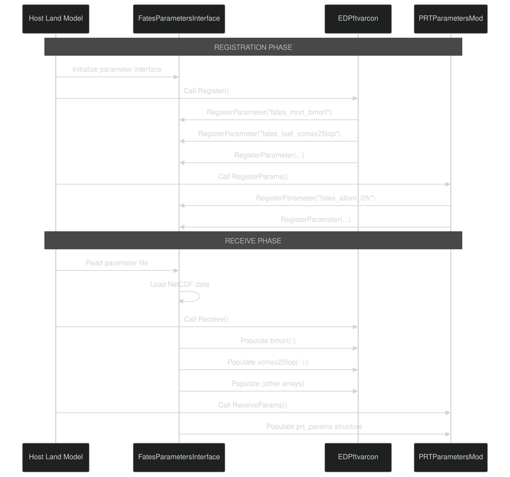
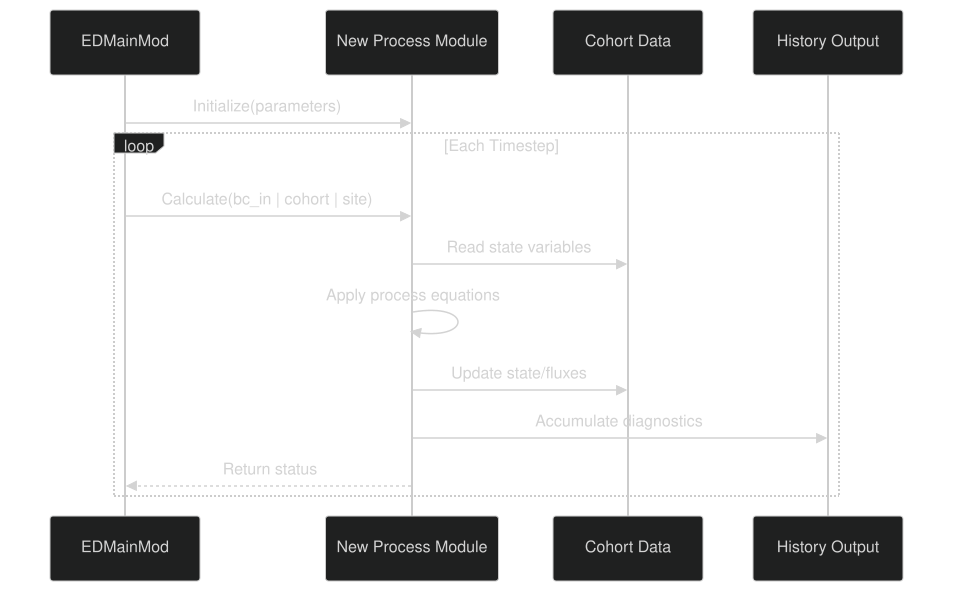

# Model Extensibility

Relevant source files

- [biogeochem/FatesSoilBGCFluxMod.F90](https://github.com/jingtao-lbl/fates/blob/e85d9977/biogeochem/FatesSoilBGCFluxMod.F90)
- [biogeophys/FatesPlantRespPhotosynthMod.F90](https://github.com/jingtao-lbl/fates/blob/e85d9977/biogeophys/FatesPlantRespPhotosynthMod.F90)
- [main/EDParamsMod.F90](https://github.com/jingtao-lbl/fates/blob/e85d9977/main/EDParamsMod.F90)
- [main/EDPftvarcon.F90](https://github.com/jingtao-lbl/fates/blob/e85d9977/main/EDPftvarcon.F90)
- [parameter_files/fates_params_default.cdl](https://github.com/jingtao-lbl/fates/blob/e85d9977/parameter_files/fates_params_default.cdl)
- [parteh/PRTAllometricCNPMod.F90](https://github.com/jingtao-lbl/fates/blob/e85d9977/parteh/PRTAllometricCNPMod.F90)
- [parteh/PRTAllometricCarbonMod.F90](https://github.com/jingtao-lbl/fates/blob/e85d9977/parteh/PRTAllometricCarbonMod.F90)
- [parteh/PRTGenericMod.F90](https://github.com/jingtao-lbl/fates/blob/e85d9977/parteh/PRTGenericMod.F90)
- [parteh/PRTLossFluxesMod.F90](https://github.com/jingtao-lbl/fates/blob/e85d9977/parteh/PRTLossFluxesMod.F90)

## Purpose and Scope

This page explains how developers can extend FATES with new scientific hypotheses and parameterizations. It covers the primary extensibility points: adding new Plant Functional Types (PFTs), implementing new allocation hypotheses through PARTEH, and adding new process models such as mortality mechanisms. For information about configuring existing model options, see [Simulation Modes](advanced/simulation_modes.md) and [Nutrient Competition Modes](advanced/nutrient_competition.md) . For details on the PARTEH allocation framework design, see [PARTEH: Plant Allocation System](plant-physiology/parteh/index.md) .

## Extensibility Architecture Overview

FATES is designed with three primary extensibility points:

| Extensibility Point | Mechanism | Primary Files | 
| --- | --- | --- |
| PFT Parameters | NetCDF parameter files with registration/receive pattern | fates_params_default.cdl, EDPftvarcon.F90 | 
| Allocation Hypotheses | Object-oriented PARTEH framework with base classes | PRTGenericMod.F90, PRTAllometric*.F90 | 
| Process Models | Modular subroutines with standardized interfaces | Various *Mod.F90 files | 

Sources:  [main/EDPftvarcon.F90 1-300](https://github.com/jingtao-lbl/fates/blob/e85d9977/main/EDPftvarcon.F90#L1-L300)  [parteh/PRTGenericMod.F90 1-100](https://github.com/jingtao-lbl/fates/blob/e85d9977/parteh/PRTGenericMod.F90#L1-L100)  [main/EDParamsMod.F90 1-100](https://github.com/jingtao-lbl/fates/blob/e85d9977/main/EDParamsMod.F90#L1-L100)

## Adding New Plant Functional Types

### Parameter File Structure

PFTs are defined in NetCDF parameter files following the CDL (Common Data Language) specification. The file defines dimensions, variables, and parameter values.

Key dimensions:

- `fates_pft`: Number of PFTs (typically 12-16)
- `fates_plant_organs`: Number of organ types (4: leaf, fine root, sapwood, structural)
- `fates_hydr_organs`: Number of hydraulic compartments (4)
- `fates_leafage_class`: Number of leaf age classes (typically 1)

Parameter categories:

| Category | Example Parameters | File Location | 
| --- | --- | --- |
| Allometry | fates_allom_d2h1, fates_allom_d2bl1, fates_allom_l2fr | Lines 86-166 | 
| Physiology | fates_leaf_vcmax25top, fates_leaf_slatop | Lines 353-379 | 
| Mortality | fates_mort_bmort, fates_mort_scalar_cstarvation | Lines 395-436 | 
| Phenology | fates_phen_evergreen, fates_phen_stress_decid | Lines 443-472 | 
| Hydraulics | fates_hydro_p50_node, fates_hydro_kmax_node | Lines 287-331 | 
| Nutrients | fates_stoich_nitr, fates_stoich_phos | Lines 545-550 | 

Sources:  [parameter_files/fates_params_default.cdl 1-100](https://github.com/jingtao-lbl/fates/blob/e85d9977/parameter_files/fates_params_default.cdl#L1-L100)  [parameter_files/fates_params_default.cdl 353-550](https://github.com/jingtao-lbl/fates/blob/e85d9977/parameter_files/fates_params_default.cdl#L353-L550)

### Parameter Registration and Receiving Pattern

FATES uses a two-phase pattern to load parameters: Register declares which parameters are needed, and Receive populates the values.

Implementation in EDPftvarcon.F90:

The `Register_PFT` subroutine declares parameters:

The `Receive_PFT` subroutine populates arrays:

Sources:  [main/EDPftvarcon.F90 349-700](https://github.com/jingtao-lbl/fates/blob/e85d9977/main/EDPftvarcon.F90#L349-L700)  [main/EDPftvarcon.F90 315-346](https://github.com/jingtao-lbl/fates/blob/e85d9977/main/EDPftvarcon.F90#L315-L346)

### Adding a New PFT Parameter

To add a new PFT-specific parameter:

Sources:  [main/EDPftvarcon.F90 1-50](https://github.com/jingtao-lbl/fates/blob/e85d9977/main/EDPftvarcon.F90#L1-L50)  [main/EDPftvarcon.F90 315-850](https://github.com/jingtao-lbl/fates/blob/e85d9977/main/EDPftvarcon.F90#L315-L850)

## Adding New Allocation Hypotheses (PARTEH)

### PARTEH Base Class Structure

PARTEH (Plant Allocation and Reactive Transport Extensible Hypotheses) uses object-oriented inheritance to enable multiple allocation schemes. Each hypothesis extends base classes defined in `PRTGenericMod.F90` .

Key constants for organs and elements:

Sources:  [parteh/PRTGenericMod.F90 1-100](https://github.com/jingtao-lbl/fates/blob/e85d9977/parteh/PRTGenericMod.F90#L1-L100)  [parteh/PRTGenericMod.F90 233-277](https://github.com/jingtao-lbl/fates/blob/e85d9977/parteh/PRTGenericMod.F90#L233-L277)  [parteh/PRTGenericMod.F90 355-392](https://github.com/jingtao-lbl/fates/blob/e85d9977/parteh/PRTGenericMod.F90#L355-L392)

### State Variables and Mapping

Each hypothesis defines state variables and maps them to organ-element combinations:

Carbon-only hypothesis state variables:

CNP hypothesis state variables:

Registration of variables:

Sources:  [parteh/PRTAllometricCarbonMod.F90 76-90](https://github.com/jingtao-lbl/fates/blob/e85d9977/parteh/PRTAllometricCarbonMod.F90#L76-L90)  [parteh/PRTAllometricCNPMod.F90 86-108](https://github.com/jingtao-lbl/fates/blob/e85d9977/parteh/PRTAllometricCNPMod.F90#L86-L108)  [parteh/PRTAllometricCarbonMod.F90 169-255](https://github.com/jingtao-lbl/fates/blob/e85d9977/parteh/PRTAllometricCarbonMod.F90#L169-L255)

### Required Methods for New Hypotheses

To implement a new allocation hypothesis, create a module that:

Sources:  [parteh/PRTAllometricCarbonMod.F90 136-143](https://github.com/jingtao-lbl/fates/blob/e85d9977/parteh/PRTAllometricCarbonMod.F90#L136-L143)  [parteh/PRTAllometricCarbonMod.F90 169-255](https://github.com/jingtao-lbl/fates/blob/e85d9977/parteh/PRTAllometricCarbonMod.F90#L169-L255)  [parteh/PRTAllometricCarbonMod.F90 260-700](https://github.com/jingtao-lbl/fates/blob/e85d9977/parteh/PRTAllometricCarbonMod.F90#L260-L700)

### Comparison: Carbon vs CNP Allocation

Key differences:

| Feature | Carbon-Only | CNP | 
| --- | --- | --- |
| State variables | 6 (C only) | 18 (C, N, P) | 
| Growth limitation | C available | min(C, N/C_ratio, P/C_ratio) | 
| Root allocation | Fixed L2FR parameter | Dynamic L2FR with PID controller | 
| Excess handling | All C used | Excess nutrients exuded | 
| Complexity | Simple allometry | Stoichiometric constraints | 

Sources:  [parteh/PRTAllometricCarbonMod.F90 260-700](https://github.com/jingtao-lbl/fates/blob/e85d9977/parteh/PRTAllometricCarbonMod.F90#L260-L700)  [parteh/PRTAllometricCNPMod.F90 370-2500](https://github.com/jingtao-lbl/fates/blob/e85d9977/parteh/PRTAllometricCNPMod.F90#L370-L2500)

## Adding New Process Models

### Mortality Mechanisms

FATES mortality is modular, with each mechanism calculated separately and combined. Current mechanisms include:

| Mechanism | Function | Key Parameters | 
| --- | --- | --- |
| Background | mortality_rates | fates_mort_bmort | 
| Carbon starvation | mortality_rates | fates_mort_scalar_cstarvation | 
| Hydraulic failure | mortality_rates | fates_mort_scalar_hydrfailure | 
| Size senescence | mortality_rates | fates_mort_ip_size_senescence | 
| Age senescence | mortality_rates | fates_mort_ip_age_senescence | 
| Cold stress | mortality_rates | fates_mort_scalar_coldstress | 
| Fire | fire_model | Various fire parameters | 
| Logging | LoggingMortality_frac | Logging parameters | 

Adding a new mortality mechanism:

Sources:  [main/EDPftvarcon.F90 93-103](https://github.com/jingtao-lbl/fates/blob/e85d9977/main/EDPftvarcon.F90#L93-L103)  [main/EDPftvarcon.F90 544-600](https://github.com/jingtao-lbl/fates/blob/e85d9977/main/EDPftvarcon.F90#L544-L600)

### Process Model Integration Pattern

New process models should follow the standard integration pattern:

Key conventions:

Sources:  [biogeophys/FatesPlantRespPhotosynthMod.F90 1-120](https://github.com/jingtao-lbl/fates/blob/e85d9977/biogeophys/FatesPlantRespPhotosynthMod.F90#L1-L120)  [biogeochem/FatesSoilBGCFluxMod.F90 1-100](https://github.com/jingtao-lbl/fates/blob/e85d9977/biogeochem/FatesSoilBGCFluxMod.F90#L1-L100)

## Best Practices and Guidelines

### Code Organization

| Aspect | Convention | Rationale | 
| --- | --- | --- |
| Module naming | Fates<Process><Type>Mod | Clear identification of functionality | 
| File naming | Match module name exactly | Easy file location | 
| Subroutine names | Descriptive, action-oriented | Self-documenting code | 
| Variable naming | Lower case with underscores | Fortran standard | 
| Constants | Upper case with underscores | Distinguish from variables | 

### Parameter Management

### Testing and Validation

When adding new functionality:

### Documentation Requirements

Sources:  [main/EDPftvarcon.F90 1-50](https://github.com/jingtao-lbl/fates/blob/e85d9977/main/EDPftvarcon.F90#L1-L50)  [parteh/PRTGenericMod.F90 1-50](https://github.com/jingtao-lbl/fates/blob/e85d9977/parteh/PRTGenericMod.F90#L1-L50)  [main/EDParamsMod.F90 1-100](https://github.com/jingtao-lbl/fates/blob/e85d9977/main/EDParamsMod.F90#L1-L100)

## Summary Table: Extensibility Points

| Extension Type | Primary Files | Key Steps | Difficulty | 
| --- | --- | --- | --- |
| New PFT | fates_params_*.cdl | Add parameter values to existing file | Low | 
| New PFT Parameter | fates_params_*.cdl, EDPftvarcon.F90 | Define, register, receive, use | Medium | 
| New Allocation Hypothesis | New PRTAllometric*.F90 | Extend base class, implement methods | High | 
| New Mortality Mechanism | EDMortalityFunctionsMod.F90 | Add calculation, parameters, diagnostics | Medium | 
| New Physiology Process | New Fates*Mod.F90 | Create module, integrate in main loop | High | 

Sources:  [parameter_files/fates_params_default.cdl 1-100](https://github.com/jingtao-lbl/fates/blob/e85d9977/parameter_files/fates_params_default.cdl#L1-L100)  [main/EDPftvarcon.F90 1-100](https://github.com/jingtao-lbl/fates/blob/e85d9977/main/EDPftvarcon.F90#L1-L100)  [parteh/PRTGenericMod.F90 1-100](https://github.com/jingtao-lbl/fates/blob/e85d9977/parteh/PRTGenericMod.F90#L1-L100)  [parteh/PRTAllometricCarbonMod.F90 1-100](https://github.com/jingtao-lbl/fates/blob/e85d9977/parteh/PRTAllometricCarbonMod.F90#L1-L100)  [parteh/PRTAllometricCNPMod.F90 1-100](https://github.com/jingtao-lbl/fates/blob/e85d9977/parteh/PRTAllometricCNPMod.F90#L1-L100)