# Advanced Topics

Relevant source files

- [biogeophys/FatesPlantRespPhotosynthMod.F90](https://github.com/jingtao-lbl/fates/blob/e85d9977/biogeophys/FatesPlantRespPhotosynthMod.F90)
- [main/EDParamsMod.F90](https://github.com/jingtao-lbl/fates/blob/e85d9977/main/EDParamsMod.F90)
- [main/EDPftvarcon.F90](https://github.com/jingtao-lbl/fates/blob/e85d9977/main/EDPftvarcon.F90)
- [main/FatesInterfaceMod.F90](https://github.com/jingtao-lbl/fates/blob/e85d9977/main/FatesInterfaceMod.F90)
- [main/FatesInterfaceTypesMod.F90](https://github.com/jingtao-lbl/fates/blob/e85d9977/main/FatesInterfaceTypesMod.F90)
- [parameter_files/fates_params_default.cdl](https://github.com/jingtao-lbl/fates/blob/e85d9977/parameter_files/fates_params_default.cdl)

## Purpose and Scope

This page covers advanced model configurations, specialized operational modes, and extensibility features in FATES. It documents simulation modes that modify standard model behavior, nutrient competition alternatives, and the framework for extending model capabilities with new hypotheses.

For information about the standard daily dynamics loop, see [Daily Dynamics Loop](core-dynamics/daily_loop.md) . For details on the PARTEH allocation system's standard operation, see [PARTEH: Plant Allocation System](plant-physiology/parteh/index.md) . For initialization procedures, see [Initialization Modes](getting-started/initialization.md) .

## 10.1 Simulation Modes

FATES supports several specialized simulation modes that modify the standard ecosystem dynamics to enable specific research applications or simplify model behavior for testing and analysis.

### Mode Configuration Flags

All simulation modes are controlled by flags in the host land model interface, set during initialization and remaining constant throughout the simulation.

| Mode Flag | Variable Name | Purpose | Mutual Exclusivity | 
| --- | --- | --- | --- |
| Satellite Phenology (SP) | hlm_use_sp | Prescribe LAI from external data | Yes (with standard ED) | 
| No Competition | hlm_use_nocomp | Disable PFT competition | Yes (with standard ED) | 
| Fixed Biogeography | hlm_use_fixed_biogeog | Fixed PFT spatial distribution | Compatible with nocomp | 
| Prescribed Physiology | hlm_use_ed_prescribed_phys | Prescribe NPP, disable biophysics | Yes (with ST3) | 
| Static Stand Structure (ST3) | hlm_use_ed_st3 | Disable dynamics (growth, mortality) | Yes (with prescribed phys) | 

Sources: [main/FatesInterfaceTypesMod.F90 155-195](https://github.com/jingtao-lbl/fates/blob/e85d9977/main/FatesInterfaceTypesMod.F90#L155-L195)

### Satellite Phenology Mode

Diagram: SP Mode Data Flow

In SP mode, leaf area index and canopy structure are prescribed from external datasets rather than simulated dynamically. This mode is useful for isolating biogeochemical processes from structural dynamics.

Key Characteristics:

The patch allocation logic differs from standard mode:

Sources: [main/FatesInterfaceMod.F90 762-780](https://github.com/jingtao-lbl/fates/blob/e85d9977/main/FatesInterfaceMod.F90#L762-L780)  [main/FatesInterfaceTypesMod.F90 194-195](https://github.com/jingtao-lbl/fates/blob/e85d9977/main/FatesInterfaceTypesMod.F90#L194-L195)  [main/FatesInterfaceTypesMod.F90 558-560](https://github.com/jingtao-lbl/fates/blob/e85d9977/main/FatesInterfaceTypesMod.F90#L558-L560)

### No Competition Mode

Diagram: No Competition Mode Structure

No competition mode disables light competition between PFTs by assigning each PFT to its own patch. This allows studying PFT-specific responses without competitive interactions.

Key Characteristics:

Patch count is constrained to accommodate all PFTs:

The `nocomp_pft_label` identifies which PFT each patch represents, used throughout the code to maintain PFT isolation.

Sources: [main/FatesInterfaceMod.F90 787-795](https://github.com/jingtao-lbl/fates/blob/e85d9977/main/FatesInterfaceMod.F90#L787-L795)  [main/FatesInterfaceTypesMod.F90 191-192](https://github.com/jingtao-lbl/fates/blob/e85d9977/main/FatesInterfaceTypesMod.F90#L191-L192)  [main/FatesInterfaceTypesMod.F90 723](https://github.com/jingtao-lbl/fates/blob/e85d9977/main/FatesInterfaceTypesMod.F90#L723-L723)

### Prescribed Physiology Mode

In prescribed physiology mode, photosynthesis and respiration are disabled and replaced with prescribed net primary production (NPP) rates. This mode is experimental and useful for benchmarking demographic processes independently from biophysical calculations.

Key Parameters (PFT-specific):

| Parameter | Variable | Units | Purpose | 
| --- | --- | --- | --- |
| Canopy NPP | prescribed_npp_canopy | kgC/m²/yr | NPP for canopy trees | 
| Understory NPP | prescribed_npp_understory | kgC/m²/yr | NPP for understory trees | 
| Canopy Mortality | prescribed_mortality_canopy | 1/yr | Mortality rate, canopy | 
| Understory Mortality | prescribed_mortality_understory | 1/yr | Mortality rate, understory | 
| Recruitment Rate | prescribed_recruitment | 1/yr | Recruitment rate | 

Constraints:

- Cannot be used simultaneously with ST3 mode
- Requires prescription of all demographic rates
- Compatible with disturbance and patch dynamics

Sources: [main/EDPftvarcon.F90 156-165](https://github.com/jingtao-lbl/fates/blob/e85d9977/main/EDPftvarcon.F90#L156-L165)  [parameter_files/fates_params_default.cdl 473-490](https://github.com/jingtao-lbl/fates/blob/e85d9977/parameter_files/fates_params_default.cdl#L473-L490)

### Static Stand Structure Mode (ST3)

ST3 mode freezes ecosystem structure by disabling all demographic processes. This is useful for analyzing fast biophysical processes (photosynthesis, respiration) with fixed canopy structure.

Disabled Processes:

- Growth (diameter and height increment)
- Mortality (all types)
- Recruitment (seedling establishment)
- Disturbance-driven patch creation
- Cohort fusion and termination

Active Processes:

- Photosynthesis and respiration
- Phenology (leaf flush and abscission)
- Plant hydraulics
- Radiation transfer
- Canopy layering (if structure changes via phenology)

Constraints:

- Cannot be used with prescribed physiology mode
- Initial stand structure must be specified via inventory or near-bare-ground initialization
- Patch areas remain constant

Sources: [main/FatesInterfaceTypesMod.F90 155-163](https://github.com/jingtao-lbl/fates/blob/e85d9977/main/FatesInterfaceTypesMod.F90#L155-L163)

## 10.2 Nutrient Competition Modes

FATES supports two fundamentally different approaches for simulating plant nutrient acquisition when coupled to soil biogeochemistry models: Ecosystem Competition Approach (ECA) and Relative Demand (RD).

### Nutrient Competition Framework

Diagram: Nutrient Competition Mode Selection

The nutrient competition mode is set via the `hlm_nu_com` character string in the host land model interface. Current valid options are `"ECA"` and `"RD"` .

Mode Determination:

Sources: [main/FatesInterfaceTypesMod.F90 54-60](https://github.com/jingtao-lbl/fates/blob/e85d9977/main/FatesInterfaceTypesMod.F90#L54-L60)  [main/EDParamsMod.F90 95-96](https://github.com/jingtao-lbl/fates/blob/e85d9977/main/EDParamsMod.F90#L95-L96)  [main/FatesInterfaceMod.F90 73-82](https://github.com/jingtao-lbl/fates/blob/e85d9977/main/FatesInterfaceMod.F90#L73-L82)

### ECA: Ecosystem Competition Approach

The ECA mode simulates explicit competition between plants, microbes, and mineral surfaces for nutrients using enzyme kinetics based on Michaelis-Menten formulations.

Conceptual Model:

ECA Parameters (PFT-specific):

| Parameter | Variable | Units | Description | 
| --- | --- | --- | --- |
| NH4 Half-Saturation | eca_km_nh4 | gN/m³ | Km for ammonium uptake | 
| NO3 Half-Saturation | eca_km_no3 | gN/m³ | Km for nitrate uptake | 
| P Half-Saturation | eca_km_p | gP/m³ | Km for phosphorus uptake | 
| Ptase Km | eca_km_ptase | gP/m³ | Km for phosphatase enzyme | 
| Ptase Vmax | eca_vmax_ptase | gP/m²/s | Max phosphatase production rate | 
| Ptase Alpha | eca_alpha_ptase | fraction | Direct plant P fraction from ptase | 
| Ptase Lambda | eca_lambda_ptase | fraction | P vs N stress threshold for ptase | 
| Microbial C | eca_decompmicc | gC/m³ | Microbial decomposer biomass | 
| Plant Scalar | eca_plant_escalar | unitless | Root biomass to enzyme scaling | 

Uptake Calculation:

For each nutrient species (NH4, NO3, P), the ECA approach calculates competitive uptake:

where competition terms account for uptake by other organisms.

Phosphatase Production:

FATES can simulate phosphatase enzyme production to access organic P:

A fraction `alpha_ptase` of mineralized P goes directly to the plant; the remainder enters the mineral pool.

Sources: [main/EDPftvarcon.F90 196-213](https://github.com/jingtao-lbl/fates/blob/e85d9977/main/EDPftvarcon.F90#L196-L213)  [parameter_files/fates_params_default.cdl 170-193](https://github.com/jingtao-lbl/fates/blob/e85d9977/parameter_files/fates_params_default.cdl#L170-L193)  [main/EDParamsMod.F90 304-310](https://github.com/jingtao-lbl/fates/blob/e85d9977/main/EDParamsMod.F90#L304-L310)  [main/FatesInterfaceTypesMod.F90 760-773](https://github.com/jingtao-lbl/fates/blob/e85d9977/main/FatesInterfaceTypesMod.F90#L760-L773)

### RD: Relative Demand Approach

The RD mode uses simpler demand-based nutrient acquisition where plants specify their nutrient demand and uptake is allocated proportionally.

Key Characteristics:

RD Parameters (PFT-specific):

| Parameter | Variable | Units | Description | 
| --- | --- | --- | --- |
| NH4 Vmax | vmax_nh4 | gN/gC/s | Max NH4 uptake rate per root C | 
| NO3 Vmax | vmax_no3 | gN/gC/s | Max NO3 uptake rate per root C | 
| P Vmax | vmax_p | gP/gC/s | Max P uptake rate per root C | 

Demand Calculation:

Uptake is then scaled by available nutrients and Vmax constraints.

Sources: [main/EDPftvarcon.F90 181-188](https://github.com/jingtao-lbl/fates/blob/e85d9977/main/EDPftvarcon.F90#L181-L188)  [parameter_files/fates_params_default.cdl 227-235](https://github.com/jingtao-lbl/fates/blob/e85d9977/parameter_files/fates_params_default.cdl#L227-L235)

### Competition Scaling Modes

Both ECA and RD support two scaling approaches for nutrient competition:

Diagram: Competition Scaling Impact

Coupled Scaling ( `fates_np_comp_scaling = 1` ):

- `cn_scalar``cp_scalar`Scaling factors ( , ) computed from plant C:N and C:P ratios
- Accounts for variable plant nutrient status
- More realistic representation of plant nutrient demand

Trivial Scaling ( `fates_np_comp_scaling = 0` ):

- All scaling factors set to 1.0
- Simplified calculation
- Useful for testing or when nutrient dynamics are prescribed

The scaling factors are passed to the soil BGC model via boundary condition arrays:

Sources: [main/FatesInterfaceMod.F90 80-82](https://github.com/jingtao-lbl/fates/blob/e85d9977/main/FatesInterfaceMod.F90#L80-L82)  [main/FatesInterfaceTypesMod.F90 665-670](https://github.com/jingtao-lbl/fates/blob/e85d9977/main/FatesInterfaceTypesMod.F90#L665-L670)

### Prescribed vs Coupled Nutrient Uptake

Independent of ECA vs RD mode, FATES can operate in prescribed or coupled nutrient mode:

Prescribed Mode ( `prescribed_n_uptake > 0` ):

- Nutrient uptake specified as fraction of plant demand
- No mass removed from soil BGC pools
- Useful for testing or when soil BGC is not active

Coupled Mode ( `coupled_n_uptake` ):

- Uptake dynamically calculated based on soil nutrient availability
- Mass conserving interaction with soil BGC
- Standard mode for coupled Earth system models

The mode is determined during initialization based on PFT parameters:

Sources: [main/FatesInterfaceMod.F90 875-910](https://github.com/jingtao-lbl/fates/blob/e85d9977/main/FatesInterfaceMod.F90#L875-L910)  [main/FatesConstantsMod](https://github.com/jingtao-lbl/fates/blob/e85d9977/main/FatesConstantsMod#LNaN-LNaN)  [main/EDPftvarcon.F90 223-228](https://github.com/jingtao-lbl/fates/blob/e85d9977/main/EDPftvarcon.F90#L223-L228)

## 10.3 Model Extensibility

FATES is designed to be extensible, allowing researchers to implement new hypotheses for allocation, mortality, and other processes without modifying core code structure.

### Parameter System Extension

Diagram: Adding a New PFT Parameter

Step-by-Step Process:

Sources: [main/EDPftvarcon.F90 315-346](https://github.com/jingtao-lbl/fates/blob/e85d9977/main/EDPftvarcon.F90#L315-L346)  [main/EDPftvarcon.F90 349-695](https://github.com/jingtao-lbl/fates/blob/e85d9977/main/EDPftvarcon.F90#L349-L695)  [parameter_files/fates_params_default.cdl 1-60](https://github.com/jingtao-lbl/fates/blob/e85d9977/parameter_files/fates_params_default.cdl#L1-L60)

### PARTEH: Adding New Allocation Hypotheses

The Plant Allocation and Reactive Transport Extensible Hypotheses (PARTEH) framework allows implementation of new allocation strategies through object-oriented inheritance.

Diagram: PARTEH Extensibility Pattern

Required Methods for New Hypothesis:

| Method | Purpose | Must Implement | 
| --- | --- | --- |
| InitPRTVartype | Initialize organ pools and variables | Yes | 
| DailyPRT | Main daily allocation routine | Yes | 
| CheckMassConservation | Verify mass balance | Yes | 
| DailyPRTAllometry | Apply allometric constraints | Depends on hypothesis | 
| GetState | Retrieve organ/element pool value | Inherited | 
| SetState | Set organ/element pool value | Inherited | 

Implementation Template:

Registration:

Add initialization routine in `FatesInterfaceMod.F90` :

Set mode constant in parameter file and interface.

Sources: [main/FatesInterfaceMod.F90 87-98](https://github.com/jingtao-lbl/fates/blob/e85d9977/main/FatesInterfaceMod.F90#L87-L98)  [parteh/PRTGenericMod.F90](https://github.com/jingtao-lbl/fates/blob/e85d9977/parteh/PRTGenericMod.F90#LNaN-LNaN)  [parteh/PRTAllometricCarbonMod.F90](https://github.com/jingtao-lbl/fates/blob/e85d9977/parteh/PRTAllometricCarbonMod.F90#LNaN-LNaN)  [parteh/PRTAllometricCNPMod.F90](https://github.com/jingtao-lbl/fates/blob/e85d9977/parteh/PRTAllometricCNPMod.F90#LNaN-LNaN)

### Adding New Mortality Mechanisms

New mortality mechanisms can be added by extending the mortality calculation framework while integrating with existing mortality types.

Diagram: Mortality System Integration

Implementation Steps:

Mortality Rate Constraints:

- Rates are per-year (1/year units)
- Must be non-negative
- Combined rates should not exceed ~0.99 (numerical stability)
- Consider interaction with existing mortality types

Sources: [main/EDCohortDynamicsMod.F90](https://github.com/jingtao-lbl/fates/blob/e85d9977/main/EDCohortDynamicsMod.F90#LNaN-LNaN)  [main/EDPftvarcon.F90 93-103](https://github.com/jingtao-lbl/fates/blob/e85d9977/main/EDPftvarcon.F90#L93-L103)  [parameter_files/fates_params_default.cdl 395-433](https://github.com/jingtao-lbl/fates/blob/e85d9977/parameter_files/fates_params_default.cdl#L395-L433)

### Adding New PFTs

Process for Adding PFTs to Parameter File:

PFT Index Management:

FATES uses 1-based PFT indexing internally. Parameter files may use 0-based or 1-based indexing depending on dimension `lower_bound` attribute.

Sources: [parameter_files/fates_params_default.cdl 1-20](https://github.com/jingtao-lbl/fates/blob/e85d9977/parameter_files/fates_params_default.cdl#L1-L20)  [tools/modify_fates_paramfile.py](https://github.com/jingtao-lbl/fates/blob/e85d9977/tools/modify_fates_paramfile.py)  [tools/FatesPFTIndexSwapper.py](https://github.com/jingtao-lbl/fates/blob/e85d9977/tools/FatesPFTIndexSwapper.py)

### History Output Extension

Adding New History Variables:

Sources: [main/FatesHistoryInterfaceMod.F90](https://github.com/jingtao-lbl/fates/blob/e85d9977/main/FatesHistoryInterfaceMod.F90#LNaN-LNaN)  [main/FatesHistoryInterfaceMod.F90](https://github.com/jingtao-lbl/fates/blob/e85d9977/main/FatesHistoryInterfaceMod.F90#LNaN-LNaN)

Summary

Advanced FATES features provide flexibility for specialized research applications:

- **Simulation modes**modify standard dynamics to isolate specific processes or simplify model behavior
- **Nutrient competition modes**(ECA vs RD) offer different levels of mechanistic detail in plant-soil nutrient interactions
- **Extensibility framework**enables implementation of new hypotheses through well-defined interfaces for parameters, allocation, mortality, and other processes

The modular design allows researchers to extend FATES capabilities while maintaining compatibility with existing model infrastructure and ensuring scientific reproducibility through version-controlled parameter files.