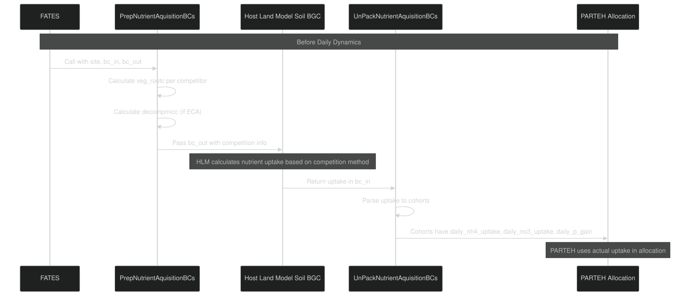

# Nutrient Competition Modes

Relevant source files

- [biogeochem/FatesSoilBGCFluxMod.F90](https://github.com/jingtao-lbl/fates/blob/e85d9977/biogeochem/FatesSoilBGCFluxMod.F90)
- [main/FatesInterfaceMod.F90](https://github.com/jingtao-lbl/fates/blob/e85d9977/main/FatesInterfaceMod.F90)
- [main/FatesInterfaceTypesMod.F90](https://github.com/jingtao-lbl/fates/blob/e85d9977/main/FatesInterfaceTypesMod.F90)
- [parteh/PRTAllometricCNPMod.F90](https://github.com/jingtao-lbl/fates/blob/e85d9977/parteh/PRTAllometricCNPMod.F90)
- [parteh/PRTAllometricCarbonMod.F90](https://github.com/jingtao-lbl/fates/blob/e85d9977/parteh/PRTAllometricCarbonMod.F90)
- [parteh/PRTGenericMod.F90](https://github.com/jingtao-lbl/fates/blob/e85d9977/parteh/PRTGenericMod.F90)
- [parteh/PRTLossFluxesMod.F90](https://github.com/jingtao-lbl/fates/blob/e85d9977/parteh/PRTLossFluxesMod.F90)

## Purpose and Scope

This document describes the nutrient competition modes in FATES, which control how plants acquire nitrogen (N) and phosphorus (P) from the soil. The competition system has three orthogonal dimensions: (1) uptake mode (prescribed vs. coupled), (2) competition method (ECA vs. RD), and (3) competitor scaling approach (coupled vs. trivial). These modes determine how FATES plants interact with the host land model's soil biogeochemistry system to acquire nutrients.

For information about how plants allocate acquired nutrients to different organs, see [PARTEH CNP Allocation](plant-physiology/parteh/cnp_allocation.md) . For details on the soil-plant nutrient interface mechanics, see [Soil-Plant Nutrient Interface](plant-physiology/parteh/soil_plant_interface.md) .

## Overview of Competition Modes

FATES supports multiple modes for nutrient competition that allow different levels of coupling with the host land model's (HLM) soil biogeochemistry:

Diagram: Nutrient Competition Configuration Dimensions

The three configuration dimensions are independent but interact to determine the final behavior. Prescribed uptake bypasses competition entirely, while coupled uptake uses both the competition method and scaling approach.

Sources: [main/FatesInterfaceTypesMod.F90 54-61](https://github.com/jingtao-lbl/fates/blob/e85d9977/main/FatesInterfaceTypesMod.F90#L54-L61)  [main/FatesInterfaceMod.F90 73-82](https://github.com/jingtao-lbl/fates/blob/e85d9977/main/FatesInterfaceMod.F90#L73-L82)  [biogeochem/FatesSoilBGCFluxMod.F90 64-66](https://github.com/jingtao-lbl/fates/blob/e85d9977/biogeochem/FatesSoilBGCFluxMod.F90#L64-L66)

## Nutrient Uptake Modes

FATES supports two fundamental modes for nutrient uptake, controlled by the `n_uptake_mode` and `p_uptake_mode` parameters.

### Prescribed Uptake Mode

In prescribed mode ( `prescribed_n_uptake` and `prescribed_p_uptake` ), plants automatically receive a fixed fraction of their nutrient demand without competing with the soil biogeochemistry model. This mode is useful for testing and spin-up scenarios.

| Constant | Value | Description | 
| --- | --- | --- |
| prescribed_n_uptake | Set in FatesConstantsMod | Plants get prescribed fraction of N demand | 
| prescribed_p_uptake | Set in FatesConstantsMod | Plants get prescribed fraction of P demand | 

Prescribed Uptake Calculation:

Diagram: Prescribed Uptake Flow

In prescribed mode, the PARTEH CNP allocation code receives the prescribed uptake value and sets gains to very large values (1000 kg) to effectively remove nutrient limitation.

Sources: [biogeochem/FatesSoilBGCFluxMod.F90 155-170](https://github.com/jingtao-lbl/fates/blob/e85d9977/biogeochem/FatesSoilBGCFluxMod.F90#L155-L170)  [biogeochem/FatesSoilBGCFluxMod.F90 194-206](https://github.com/jingtao-lbl/fates/blob/e85d9977/biogeochem/FatesSoilBGCFluxMod.F90#L194-L206)  [parteh/PRTAllometricCNPMod.F90 470-475](https://github.com/jingtao-lbl/fates/blob/e85d9977/parteh/PRTAllometricCNPMod.F90#L470-L475)

### Coupled Uptake Mode

In coupled mode ( `coupled_n_uptake` and `coupled_p_uptake` ), plants compete for nutrients with the host land model's soil biogeochemistry. The actual uptake is calculated by the HLM and returned to FATES through boundary conditions.

Diagram: Coupled Uptake Sequence

The coupled mode requires two boundary condition exchanges per timestep:

Sources: [biogeochem/FatesSoilBGCFluxMod.F90 172-191](https://github.com/jingtao-lbl/fates/blob/e85d9977/biogeochem/FatesSoilBGCFluxMod.F90#L172-L191)  [biogeochem/FatesSoilBGCFluxMod.F90 208-225](https://github.com/jingtao-lbl/fates/blob/e85d9977/biogeochem/FatesSoilBGCFluxMod.F90#L208-L225)  [biogeochem/FatesSoilBGCFluxMod.F90 401-518](https://github.com/jingtao-lbl/fates/blob/e85d9977/biogeochem/FatesSoilBGCFluxMod.F90#L401-L518)

## Competition Methods (hlm_nu_com)

The `hlm_nu_com` parameter (defined in [main/FatesInterfaceTypesMod.F90 54-58](https://github.com/jingtao-lbl/fates/blob/e85d9977/main/FatesInterfaceTypesMod.F90#L54-L58) ) determines which nutrient competition algorithm the HLM uses. This only applies when using coupled uptake mode.

### ECA (Equilibrium Chemistry Approximation)

ECA mode is a more mechanistic approach that explicitly accounts for decomposer microbial biomass when calculating nutrient competition. FATES provides:

- `veg_rootc`Root biomass distribution ( )
- `decompmicc`Estimated decomposer microbial biomass ( )
- `cn_scalar``cp_scalar`CN and CP limitation scalars ( , )

Diagram: ECA Mode Data Flow

The decomposer microbial biomass is estimated using an exponential attenuation function:

where `decompmicc_layer` is weighted by root biomass to get the final `bc_out%decompmicc` value.

Sources: [biogeochem/FatesSoilBGCFluxMod.F90 424-438](https://github.com/jingtao-lbl/fates/blob/e85d9977/biogeochem/FatesSoilBGCFluxMod.F90#L424-L438)  [biogeochem/FatesSoilBGCFluxMod.F90 482-508](https://github.com/jingtao-lbl/fates/blob/e85d9977/biogeochem/FatesSoilBGCFluxMod.F90#L482-L508)

### RD (Relative Demand)

RD mode is a simpler approach where nutrient partitioning is based on relative plant demands without explicit microbial competition. The specific implementation is in the HLM, but FATES provides root biomass distribution to inform the competition.

| Mode | Complexity | Key BC Variables | Use Case | 
| --- | --- | --- | --- |
| ECA | High | veg_rootc, decompmicc, cn_scalar, cp_scalar | Mechanistic nutrient cycling studies | 
| RD | Low | veg_rootc, n_demand, p_demand | Simplified competition, faster runtime | 

Sources: [biogeochem/FatesSoilBGCFluxMod.F90 434-445](https://github.com/jingtao-lbl/fates/blob/e85d9977/biogeochem/FatesSoilBGCFluxMod.F90#L434-L445)  [main/FatesInterfaceTypesMod.F90 54-61](https://github.com/jingtao-lbl/fates/blob/e85d9977/main/FatesInterfaceTypesMod.F90#L54-L61)

## Competitor Scaling Approaches

The `fates_np_comp_scaling` parameter controls how FATES aggregates plants into competitors for nutrient competition. This affects memory usage, computation time, and the fidelity of competition representation.

### Coupled Scaling Mode

In coupled scaling ( `coupled_np_comp_scaling` ), each cohort is treated as an independent competitor. This provides the most accurate representation of competition but requires more memory and computation.

Diagram: Coupled Scaling - Each Cohort is a Competitor

In coupled scaling mode, the competitor index ( `icomp` ) is incremented for each cohort. The maximum number of competitors per site ( `max_comp_per_site` ) is set to the maximum number of cohorts.

Sources: [biogeochem/FatesSoilBGCFluxMod.F90 453-500](https://github.com/jingtao-lbl/fates/blob/e85d9977/biogeochem/FatesSoilBGCFluxMod.F90#L453-L500)  [main/FatesInterfaceMod.F90 875-890](https://github.com/jingtao-lbl/fates/blob/e85d9977/main/FatesInterfaceMod.F90#L875-L890)

### Trivial Scaling Mode

In trivial scaling ( `trivial_np_comp_scaling` ), all plants at a site are lumped into a single competitor. Root biomass from all cohorts is accumulated, reducing memory requirements and simplifying competition.

Diagram: Trivial Scaling - All Cohorts Lumped

In trivial scaling mode:

- `icomp`is always 1 (reused for all cohorts)
- `bc_out%veg_rootc(1, :)`accumulates root biomass from all cohorts
- Total site uptake is distributed back to individual cohorts based on their root biomass

| Scaling Mode | Memory Usage | Competition Fidelity | Max Competitors | 
| --- | --- | --- | --- |
| Coupled | High | Cohort-specific | ~hundreds per site | 
| Trivial | Low | Site-aggregated | 1 per site | 

Sources: [biogeochem/FatesSoilBGCFluxMod.F90 440-446](https://github.com/jingtao-lbl/fates/blob/e85d9977/biogeochem/FatesSoilBGCFluxMod.F90#L440-L446)  [biogeochem/FatesSoilBGCFluxMod.F90 459-463](https://github.com/jingtao-lbl/fates/blob/e85d9977/biogeochem/FatesSoilBGCFluxMod.F90#L459-L463)  [biogeochem/FatesSoilBGCFluxMod.F90 511-515](https://github.com/jingtao-lbl/fates/blob/e85d9977/biogeochem/FatesSoilBGCFluxMod.F90#L511-L515)

## Code Implementation

### Key Data Structures

The nutrient competition system uses boundary condition structures to exchange data between FATES and the HLM:

Diagram: Nutrient Competition Data Structures

Sources: [main/FatesInterfaceTypesMod.F90 348-453](https://github.com/jingtao-lbl/fates/blob/e85d9977/main/FatesInterfaceTypesMod.F90#L348-L453)  [main/FatesInterfaceTypesMod.F90 456-531](https://github.com/jingtao-lbl/fates/blob/e85d9977/main/FatesInterfaceTypesMod.F90#L456-L531)  [main/FatesInterfaceMod.F90 230-267](https://github.com/jingtao-lbl/fates/blob/e85d9977/main/FatesInterfaceMod.F90#L230-L267)

### PrepNutrientAquisitionBCs Function

The `PrepNutrientAquisitionBCs` subroutine ( [biogeochem/FatesSoilBGCFluxMod.F90 401-518](https://github.com/jingtao-lbl/fates/blob/e85d9977/biogeochem/FatesSoilBGCFluxMod.F90#L401-L518) ) prepares boundary conditions that the HLM needs to calculate nutrient uptake.

Diagram: PrepNutrientAquisitionBCs Algorithm

Key calculations in this routine:

- **Root biomass by depth**`veg_rootc = fnrt_c * cohort_density * root_fraction / layer_thickness`:
- **Decomposer biomass**: Exponential profile weighted by root biomass
- **Competitor indexing**: Increment for each cohort (coupled) or reuse index 1 (trivial)

Sources: [biogeochem/FatesSoilBGCFluxMod.F90 401-518](https://github.com/jingtao-lbl/fates/blob/e85d9977/biogeochem/FatesSoilBGCFluxMod.F90#L401-L518)

### UnPackNutrientAquisitionBCs Function

The `UnPackNutrientAquisitionBCs` subroutine ( [biogeochem/FatesSoilBGCFluxMod.F90 102-235](https://github.com/jingtao-lbl/fates/blob/e85d9977/biogeochem/FatesSoilBGCFluxMod.F90#L102-L235) ) receives nutrient uptake from the HLM and distributes it to individual cohorts.

Diagram: UnPackNutrientAquisitionBCs Algorithm

The unpacking routine handles unit conversions:

- **From HLM**`[g/m2/day]``bc_in%plant_*_uptake_flux`: in
- **To cohort**`[kg/plant/day]``cohort%daily_*_uptake`: in
- **Conversion**`uptake_kg_per_plant = uptake_g_per_m2 * kg_per_g * AREA / cohort%n`:

Sources: [biogeochem/FatesSoilBGCFluxMod.F90 102-235](https://github.com/jingtao-lbl/fates/blob/e85d9977/biogeochem/FatesSoilBGCFluxMod.F90#L102-L235)

## Configuration and Control Flags

The nutrient competition modes are controlled by several parameters and compile-time choices:

| Parameter/Flag | Type | Values | Location | Description | 
| --- | --- | --- | --- | --- |
| hlm_nu_com | String | 'ECA', 'RD', 'NONE' | main/FatesInterfaceTypesMod.F9054 | Competition method used by HLM | 
| fates_np_comp_scaling | Integer | coupled_np_comp_scaling, trivial_np_comp_scaling | FatesConstantsMod | Competitor scaling approach | 
| n_uptake_mode | Integer | prescribed_n_uptake, coupled_n_uptake | main/FatesInterfaceMod.F9074 | Nitrogen uptake mode | 
| p_uptake_mode | Integer | prescribed_p_uptake, coupled_p_uptake | main/FatesInterfaceMod.F9073 | Phosphorus uptake mode | 
| hlm_parteh_mode | Integer | prt_carbon_allom_hyp, prt_cnp_flex_allom_hyp | main/FatesInterfaceTypesMod.F9094 | PARTEH hypothesis (must be CNP for nutrients) | 
| max_comp_per_site | Integer | Computed | main/FatesInterfaceTypesMod.F90228 | Maximum competitors per site | 

### Initialization Logic

The system determines uptake modes and sets array sizes during initialization:

Diagram: Initialization Logic for Nutrient Competition

The `max_comp_per_site` is set based on the scaling mode:

- **Coupled scaling**: Set to expected maximum number of cohorts
- **Trivial scaling**: Set to 1
- **RD mode only**: Allocations can be minimal since competition is simplified

Sources: [main/FatesInterfaceMod.F90 875-890](https://github.com/jingtao-lbl/fates/blob/e85d9977/main/FatesInterfaceMod.F90#L875-L890)  [main/FatesInterfaceMod.F90 466-474](https://github.com/jingtao-lbl/fates/blob/e85d9977/main/FatesInterfaceMod.F90#L466-L474)

### Compatible Mode Combinations

Not all combinations of modes are compatible:

| hlm_nu_com | fates_np_comp_scaling | n/p_uptake_mode | Valid? | Notes | 
| --- | --- | --- | --- | --- |
| 'ECA' | Coupled | Coupled | ✓ | Full mechanistic competition | 
| 'ECA' | Trivial | Coupled | ✓ | Aggregated competition with ECA | 
| 'ECA' | - | Prescribed | ✓ | ECA in HLM, but plants get prescribed uptake | 
| 'RD' | Coupled | Coupled | ✓ | Simple competition per cohort | 
| 'RD' | Trivial | Coupled | ✓ | Simple competition aggregated | 
| 'RD' | - | Prescribed | ✓ | RD in HLM, but plants get prescribed uptake | 
| 'NONE' | - | Coupled | ✗ | Invalid: No competition method | 
| 'NONE' | - | Prescribed | ✓ | No soil BGC interaction | 

The mode combinations affect computational cost and scientific fidelity:

- **Highest fidelity**: ECA + Coupled scaling + Coupled uptake
- **Lowest cost**: Any + Trivial scaling + Prescribed uptake
- **Balanced**: RD + Coupled scaling + Coupled uptake

Sources: [biogeochem/FatesSoilBGCFluxMod.F90 434-446](https://github.com/jingtao-lbl/fates/blob/e85d9977/biogeochem/FatesSoilBGCFluxMod.F90#L434-L446)  [main/FatesInterfaceTypesMod.F90 54-61](https://github.com/jingtao-lbl/fates/blob/e85d9977/main/FatesInterfaceTypesMod.F90#L54-L61)  [main/FatesInterfaceMod.F90 875-890](https://github.com/jingtao-lbl/fates/blob/e85d9977/main/FatesInterfaceMod.F90#L875-L890)