# Simulation Modes

Relevant source files

- [biogeochem/EDCohortDynamicsMod.F90](https://github.com/jingtao-lbl/fates/blob/e85d9977/biogeochem/EDCohortDynamicsMod.F90)
- [biogeochem/EDPhysiologyMod.F90](https://github.com/jingtao-lbl/fates/blob/e85d9977/biogeochem/EDPhysiologyMod.F90)
- [biogeochem/FatesAllometryMod.F90](https://github.com/jingtao-lbl/fates/blob/e85d9977/biogeochem/FatesAllometryMod.F90)
- [main/FatesInterfaceMod.F90](https://github.com/jingtao-lbl/fates/blob/e85d9977/main/FatesInterfaceMod.F90)
- [main/FatesInterfaceTypesMod.F90](https://github.com/jingtao-lbl/fates/blob/e85d9977/main/FatesInterfaceTypesMod.F90)

## Overview

FATES supports several alternative simulation modes that modify the default ecosystem dynamics and competition behavior. This page documents the three primary simulation modes:

These modes are controlled by flags set during initialization and fundamentally alter how FATES simulates vegetation dynamics. For information about prescribed physiology mode (still experimental), see the ST3 mode flag in [FatesInterfaceTypesMod.F90 156-163](https://github.com/jingtao-lbl/fates/blob/e85d9977/FatesInterfaceTypesMod.F90#L156-L163) For details on the daily dynamics loop that these modes modify, see [Daily Dynamics Loop](core-dynamics/daily_loop.md) .

## Satellite Phenology (SP) Mode

### Purpose and Behavior

Satellite Phenology mode allows FATES to be driven by prescribed leaf area index (LAI), stem area index (SAI), and canopy height data, typically derived from satellite observations or other external sources. This mode bypasses FATES' prognostic carbon allocation, growth, and phenology dynamics.

Control Flag:  `hlm_use_sp` in [FatesInterfaceTypesMod.F90 194](https://github.com/jingtao-lbl/fates/blob/e85d9977/FatesInterfaceTypesMod.F90#L194-L194)

When SP mode is enabled:

- LAI, SAI, and canopy height are read from the host land model boundary conditions
- `tree_lai`Leaf carbon is calculated as the inverse of the normal function to match prescribed LAI
- `phenology``satellite_phenology`Normal phenology routines ( ) are replaced with
- Each patch represents a single PFT
- Growth, recruitment, and mortality dynamics are bypassed
- Photosynthesis and respiration still operate based on the prescribed canopy structure

Sources: [FatesInterfaceTypesMod.F90 194-195](https://github.com/jingtao-lbl/fates/blob/e85d9977/FatesInterfaceTypesMod.F90#L194-L195)  [EDPhysiologyMod.F90 149](https://github.com/jingtao-lbl/fates/blob/e85d9977/EDPhysiologyMod.F90#L149-L149)

### Boundary Conditions for SP Mode

Three key variables are passed from the host land model to FATES for each patch/PFT:

| Variable | Type | Units | Description | 
| --- | --- | --- | --- |
| hlm_sp_tlai | real(r8) | m²/m² | Total leaf area index | 
| hlm_sp_tsai | real(r8) | m²/m² | Total stem area index | 
| hlm_sp_htop | real(r8) | m | Canopy height | 

These arrays are allocated in `bc_in_type` and indexed by PFT:

Sources: [FatesInterfaceTypesMod.F90 557-563](https://github.com/jingtao-lbl/fates/blob/e85d9977/FatesInterfaceTypesMod.F90#L557-L563)

### SP Mode Workflow

Sources: [FatesInterfaceMod.F90 762-780](https://github.com/jingtao-lbl/fates/blob/e85d9977/FatesInterfaceMod.F90#L762-L780)  [EDPhysiologyMod.F90 149-151](https://github.com/jingtao-lbl/fates/blob/e85d9977/EDPhysiologyMod.F90#L149-L151)

### Key SP Mode Functions

`satellite_phenology()` - [EDPhysiologyMod.F90 149](https://github.com/jingtao-lbl/fates/blob/e85d9977/EDPhysiologyMod.F90#L149-L149) Replaces the normal `phenology()` call in the daily dynamics loop. Assigns prescribed LAI and SAI to cohorts.

`assign_cohort_SP_properties()` - [EDPhysiologyMod.F90 150](https://github.com/jingtao-lbl/fates/blob/e85d9977/EDPhysiologyMod.F90#L150-L150) Maps the prescribed canopy properties from patch-level boundary conditions to individual cohorts.

`calculate_SP_properties()` - [EDPhysiologyMod.F90 151](https://github.com/jingtao-lbl/fates/blob/e85d9977/EDPhysiologyMod.F90#L151-L151) Computes derived properties needed for biophysical calculations from the prescribed structure.

`leafc_from_treelai()` - [FatesAllometryMod.F90 831-906](https://github.com/jingtao-lbl/fates/blob/e85d9977/FatesAllometryMod.F90#L831-L906) Inverts the normal `tree_lai` calculation to determine the leaf carbon mass required to generate the prescribed LAI. This accounts for the vertical nitrogen profile and SLA variation with canopy depth.

Sources: [FatesAllometryMod.F90 831-906](https://github.com/jingtao-lbl/fates/blob/e85d9977/FatesAllometryMod.F90#L831-L906)

### Patch Structure in SP Mode

In SP mode, FATES creates one patch per PFT to hold the prescribed vegetation:

The number of patches on the host land model side may exceed the number of FATES PFTs to accommodate multiple PFTs/CFTs in the surface dataset:

`fates_maxPatchesPerSite = max(surf_numpft + surf_numcft, maxpatch_total + 1)`

Sources: [FatesInterfaceMod.F90 762-780](https://github.com/jingtao-lbl/fates/blob/e85d9977/FatesInterfaceMod.F90#L762-L780)

## No-Competition Mode

### Purpose and Behavior

No-competition mode runs FATES with prognostic dynamics (growth, mortality, recruitment) but eliminates competition between PFTs by segregating each PFT into its own patch. This allows assessment of individual PFT performance without competitive interactions.

Control Flag:  `hlm_use_nocomp` in [FatesInterfaceTypesMod.F90 191-192](https://github.com/jingtao-lbl/fates/blob/e85d9977/FatesInterfaceTypesMod.F90#L191-L192)

When no-competition mode is enabled:

- Each PFT occupies a separate patch
- Patches do not compete for light, water, or nutrients
- Full dynamics (growth, recruitment, mortality, phenology) still operate within each patch
- Cohorts within a patch (same PFT) still compete with each other
- Often used in combination with fixed biogeography mode

Sources: [FatesInterfaceTypesMod.F90 191-192](https://github.com/jingtao-lbl/fates/blob/e85d9977/FatesInterfaceTypesMod.F90#L191-L192)  [EDPhysiologyMod.F90 20](https://github.com/jingtao-lbl/fates/blob/e85d9977/EDPhysiologyMod.F90#L20-L20)

### Patch Organization in No-Competition Mode

Each patch is labeled with its PFT identity via `nocomp_pft_label_pa` in the boundary conditions:

Sources: [FatesInterfaceTypesMod.F90 723](https://github.com/jingtao-lbl/fates/blob/e85d9977/FatesInterfaceTypesMod.F90#L723-L723)  [FatesInterfaceMod.F90 787-795](https://github.com/jingtao-lbl/fates/blob/e85d9977/FatesInterfaceMod.F90#L787-L795)

### No-Competition vs Default Competition

| Aspect | Default Competition Mode | No-Competition Mode | 
| --- | --- | --- |
| Patch structure | Multiple PFTs per patch | One PFT per patch | 
| PFT interactions | Competition for resources | Isolated by patch | 
| Within-PFT competition | Yes (by size/canopy position) | Yes (by size/canopy position) | 
| Patch dynamics | Disturbance creates/merges patches | Patches remain fixed by PFT | 
| Area allocation | Emergent from competition | Prescribed (fixed biogeography) | 
| Use case | Realistic ecosystem dynamics | PFT performance testing, benchmarking | 

Sources: [FatesConstantsMod 36](https://github.com/jingtao-lbl/fates/blob/e85d9977/FatesConstantsMod#L36-L36)  [FatesInterfaceMod.F90 787-795](https://github.com/jingtao-lbl/fates/blob/e85d9977/FatesInterfaceMod.F90#L787-L795)

## Fixed Biogeography Mode

### Purpose and Behavior

Fixed biogeography mode prescribes the fractional area occupied by each PFT from surface dataset information, rather than allowing it to emerge from competitive dynamics.

Control Flag:  `hlm_use_fixed_biogeog` in [FatesInterfaceTypesMod.F90 188-189](https://github.com/jingtao-lbl/fates/blob/e85d9977/FatesInterfaceTypesMod.F90#L188-L189)

The area fractions are provided via the boundary condition:

- `pft_areafrac(:)`- Fractional area of the FATES column occupied by each PFT

This mode is typically used in conjunction with no-competition mode to maintain stable PFT distributions for testing and benchmarking purposes.

Sources: [FatesInterfaceTypesMod.F90 188-555](https://github.com/jingtao-lbl/fates/blob/e85d9977/FatesInterfaceTypesMod.F90#L188-L555)

## Mode Interactions and Configuration

### Valid Mode Combinations

The three simulation modes can be combined in the following ways:

| SP Mode | No-Comp Mode | Fixed Biogeog | Dynamics | Competition | Area Allocation | 
| --- | --- | --- | --- | --- | --- |
| OFF | OFF | OFF | ✓ Full | ✓ PFT competition | ✓ Emergent | 
| OFF | ON | ON | ✓ Full | ✗ No PFT competition | ✗ Prescribed | 
| OFF | ON | OFF | ✓ Full | ✗ No PFT competition | ⚠ Unspecified | 
| ON | - | - | ✗ Prescribed canopy | ✗ No competition | ✗ Prescribed | 

Note: SP mode inherently implies no competition and fixed structure, so the no-comp and fixed biogeog flags are not applicable when SP is enabled.

Sources: [FatesInterfaceMod.F90 762-800](https://github.com/jingtao-lbl/fates/blob/e85d9977/FatesInterfaceMod.F90#L762-L800)

### Mode Selection Logic at Initialization

Sources: [FatesInterfaceMod.F90 737-804](https://github.com/jingtao-lbl/fates/blob/e85d9977/FatesInterfaceMod.F90#L737-L804)

### Runtime Flag Checking

The simulation mode flags are stored as module-level variables in `FatesInterfaceTypesMod` and checked throughout the codebase:

Key Mode Flags:

- `hlm_use_sp`[FatesInterfaceTypesMod.F90194](https://github.com/jingtao-lbl/fates/blob/e85d9977/FatesInterfaceTypesMod.F90#L194-L194)
- `hlm_use_nocomp`[FatesInterfaceTypesMod.F90191](https://github.com/jingtao-lbl/fates/blob/e85d9977/FatesInterfaceTypesMod.F90#L191-L191)
- `hlm_use_fixed_biogeog`[FatesInterfaceTypesMod.F90188](https://github.com/jingtao-lbl/fates/blob/e85d9977/FatesInterfaceTypesMod.F90#L188-L188)
- `hlm_use_ed_prescribed_phys`[FatesInterfaceTypesMod.F90165-173](https://github.com/jingtao-lbl/fates/blob/e85d9977/FatesInterfaceTypesMod.F90#L165-L173)(experimental)
- `hlm_use_ed_st3`[FatesInterfaceTypesMod.F90155-162](https://github.com/jingtao-lbl/fates/blob/e85d9977/FatesInterfaceTypesMod.F90#L155-L162)(experimental static structure mode)

These flags use the constants `itrue` and `ifalse` from [FatesConstantsMod](https://github.com/jingtao-lbl/fates/blob/e85d9977/FatesConstantsMod) for integer boolean values.

Sources: [FatesInterfaceTypesMod.F90 155-195](https://github.com/jingtao-lbl/fates/blob/e85d9977/FatesInterfaceTypesMod.F90#L155-L195)  [FatesConstantsMod](https://github.com/jingtao-lbl/fates/blob/e85d9977/FatesConstantsMod)

## Implementation Notes

### Bare Ground Handling

In all modes, FATES tracks a bare ground patch in addition to the vegetated patches. The `maxpatch_total` variable does not include bare ground, but `fates_maxPatchesPerSite` adds 1 to account for it:

`fates_maxPatchesPerSite = maxpatch_total + 1`

In no-comp mode, the bare ground constant `nocomp_bareground` is used to identify the bare ground condition.

Sources: [FatesInterfaceMod.F90 798](https://github.com/jingtao-lbl/fates/blob/e85d9977/FatesInterfaceMod.F90#L798-L798)  [FatesConstantsMod 36](https://github.com/jingtao-lbl/fates/blob/e85d9977/FatesConstantsMod#L36-L36)

### Surface Dataset Compatibility

For SP mode, the number of patches allocated on the host land model side must accommodate all PFTs and CFTs (crop functional types) in the surface dataset:

`fates_maxPatchesPerSite = max(surf_numpft + surf_numcft, maxpatch_total + 1)`

This ensures there are enough "slots" to hold LAI data for all surface dataset PFTs, even if FATES tracks fewer PFTs.

Sources: [FatesInterfaceMod.F90 779](https://github.com/jingtao-lbl/fates/blob/e85d9977/FatesInterfaceMod.F90#L779-L779)

### Cohort Age Tracking

Cohort age tracking ( `hlm_use_cohort_age_tracking` ) can be disabled in SP mode since cohort age is not prognostically meaningful when growth is bypassed.

Sources: [FatesInterfaceTypesMod.F90 148-149](https://github.com/jingtao-lbl/fates/blob/e85d9977/FatesInterfaceTypesMod.F90#L148-L149)  [EDCohortDynamicsMod.F90 14](https://github.com/jingtao-lbl/fates/blob/e85d9977/EDCohortDynamicsMod.F90#L14-L14)