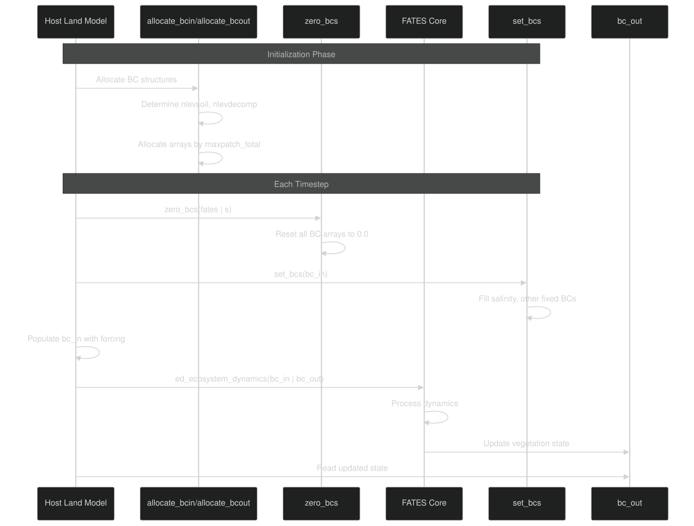
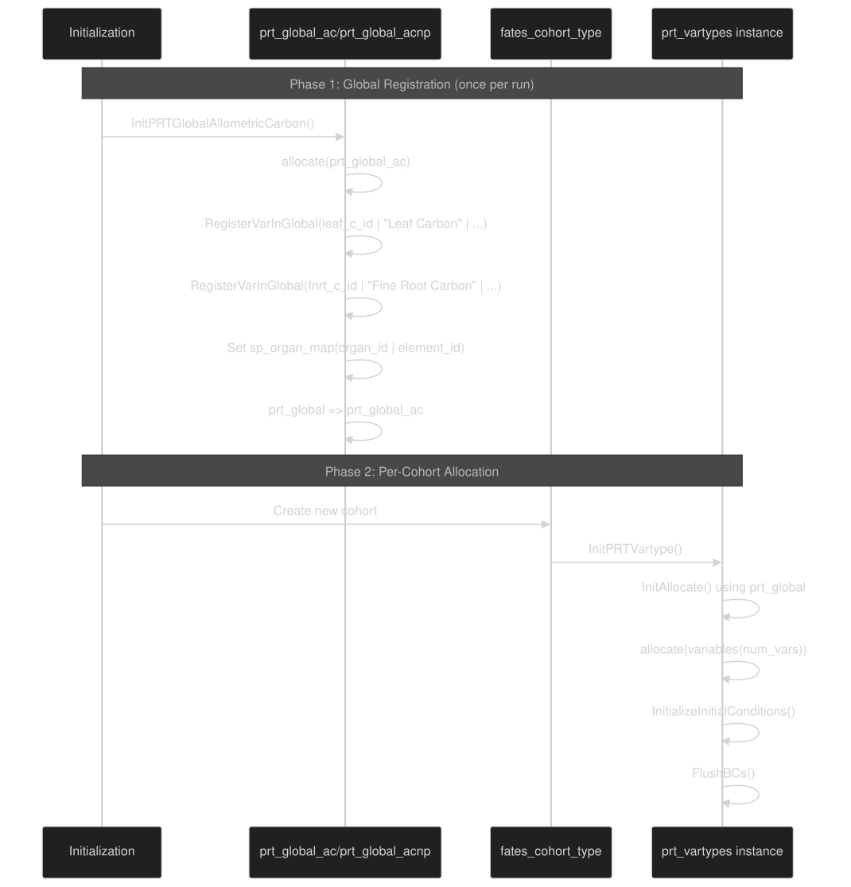
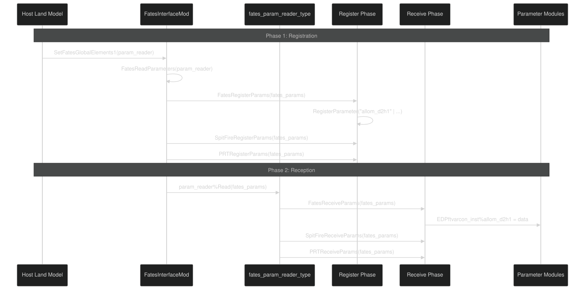

# Code Architecture and Design Patterns

Relevant source files

- [biogeochem/FatesSoilBGCFluxMod.F90](https://github.com/jingtao-lbl/fates/blob/e85d9977/biogeochem/FatesSoilBGCFluxMod.F90)
- [main/FatesInterfaceMod.F90](https://github.com/jingtao-lbl/fates/blob/e85d9977/main/FatesInterfaceMod.F90)
- [main/FatesInterfaceTypesMod.F90](https://github.com/jingtao-lbl/fates/blob/e85d9977/main/FatesInterfaceTypesMod.F90)
- [parteh/PRTAllometricCNPMod.F90](https://github.com/jingtao-lbl/fates/blob/e85d9977/parteh/PRTAllometricCNPMod.F90)
- [parteh/PRTAllometricCarbonMod.F90](https://github.com/jingtao-lbl/fates/blob/e85d9977/parteh/PRTAllometricCarbonMod.F90)
- [parteh/PRTGenericMod.F90](https://github.com/jingtao-lbl/fates/blob/e85d9977/parteh/PRTGenericMod.F90)
- [parteh/PRTLossFluxesMod.F90](https://github.com/jingtao-lbl/fates/blob/e85d9977/parteh/PRTLossFluxesMod.F90)

## Purpose and Scope

This page documents the software architecture, design patterns, and coding conventions used throughout the FATES codebase. It provides developers with a technical understanding of how the code is organized, how major subsystems interact, and what patterns are used to achieve modularity and extensibility.

For information about specific subsystems:

- [Module Organization](architecture/modules.md)Module organization and directory structure: see
- [Linked List Data Structures](architecture/linked_lists.md)Linked list implementation details: see
- [PARTEH Extensibility Framework](architecture/parteh_framework.md)PARTEH allocation framework: see

For usage-oriented documentation:

- [Host Model Interface](getting-started/host_interface.md)Host model coupling: see
- [Initialization Modes](getting-started/initialization.md)Model initialization: see
- [Parameter System](getting-started/parameter_system.md)Parameter management: see

## Architectural Principles

FATES employs several key architectural principles:

## Core Type Hierarchy

### FATES Interface Type

The top-level object that connects FATES to host land models:

Sources:  [main/FatesInterfaceMod.F90 125-159](https://github.com/jingtao-lbl/fates/blob/e85d9977/main/FatesInterfaceMod.F90#L125-L159)  [main/EDTypesMod.F90](https://github.com/jingtao-lbl/fates/blob/e85d9977/main/EDTypesMod.F90)  [main/FatesInterfaceTypesMod.F90 348-577](https://github.com/jingtao-lbl/fates/blob/e85d9977/main/FatesInterfaceTypesMod.F90#L348-L577)

### Vegetation Data Structure Pattern

FATES uses doubly-linked lists to organize patches and cohorts. This design enables:

- Dynamic creation/deletion without array reallocation
- Efficient insertion at arbitrary positions
- Preservation of ordering (by age for patches, by height for cohorts)

Sources:  [main/EDTypesMod.F90](https://github.com/jingtao-lbl/fates/blob/e85d9977/main/EDTypesMod.F90)  [main/FatesPatchMod.F90](https://github.com/jingtao-lbl/fates/blob/e85d9977/main/FatesPatchMod.F90)  [main/FatesCohortMod.F90](https://github.com/jingtao-lbl/fates/blob/e85d9977/main/FatesCohortMod.F90)

## Boundary Condition Architecture

FATES communicates with host land models through three boundary condition types:

| BC Type | Direction | Purpose | Example Variables | 
| --- | --- | --- | --- |
| bc_in_type | HLM → FATES | Environmental forcing, soil state | solad_parb, smp_sl, tempk_sl, lightning24 | 
| bc_out_type | FATES → HLM | Vegetation state, fluxes to soil | elai_pa, htop_pa, litt_flux_cel_c_si, rootr_pasl | 
| bc_pconst_type | FATES → HLM | Parameter constants (one-time) | vmax_nh4, eca_km_p | 

### Boundary Condition Workflow

Key Implementation Details:

Sources:  [main/FatesInterfaceMod.F90 225-408](https://github.com/jingtao-lbl/fates/blob/e85d9977/main/FatesInterfaceMod.F90#L225-L408)  [main/FatesInterfaceTypesMod.F90 348-577](https://github.com/jingtao-lbl/fates/blob/e85d9977/main/FatesInterfaceTypesMod.F90#L348-L577)

## PARTEH: Extensible Allocation Framework

PARTEH (Plant Allocation and Reactive Transport Extensible Hypotheses) demonstrates the Strategy Pattern for swappable allocation algorithms.

### Class Hierarchy

Key Pattern : Each cohort has a `prt` member of type `prt_vartypes` . The actual type is determined at initialization by `hlm_parteh_mode` :

- `prt_carbon_allom_hyp``callom_prt_vartypes`(1) →
- `prt_cnp_flex_allom_hyp``cnp_allom_prt_vartypes`(2) →

Sources:  [parteh/PRTGenericMod.F90 232-277](https://github.com/jingtao-lbl/fates/blob/e85d9977/parteh/PRTGenericMod.F90#L232-L277)  [parteh/PRTAllometricCarbonMod.F90 136-143](https://github.com/jingtao-lbl/fates/blob/e85d9977/parteh/PRTAllometricCarbonMod.F90#L136-L143)  [parteh/PRTAllometricCNPMod.F90 250-266](https://github.com/jingtao-lbl/fates/blob/e85d9977/parteh/PRTAllometricCNPMod.F90#L250-L266)

### Variable Registration Pattern

PARTEH uses a two-phase initialization :

Variable Mapping : The `sp_organ_map` table maps `(organ_id, element_id)` tuples to variable indices:

Sources:  [parteh/PRTGenericMod.F90 447-483](https://github.com/jingtao-lbl/fates/blob/e85d9977/parteh/PRTGenericMod.F90#L447-L483)  [parteh/PRTAllometricCarbonMod.F90 169-255](https://github.com/jingtao-lbl/fates/blob/e85d9977/parteh/PRTAllometricCarbonMod.F90#L169-L255)  [parteh/PRTAllometricCNPMod.F90 289-364](https://github.com/jingtao-lbl/fates/blob/e85d9977/parteh/PRTAllometricCNPMod.F90#L289-L364)

## Module Organization Patterns

### Functional Separation

FATES modules follow a functional layering:

Sources:  [main/FatesInterfaceMod.F90 1-20](https://github.com/jingtao-lbl/fates/blob/e85d9977/main/FatesInterfaceMod.F90#L1-L20)  [main/EDMainMod.F90](https://github.com/jingtao-lbl/fates/blob/e85d9977/main/EDMainMod.F90)  [main/EDPhysiologyMod.F90](https://github.com/jingtao-lbl/fates/blob/e85d9977/main/EDPhysiologyMod.F90)

### Naming Conventions

| Pattern | Purpose | Example | 
| --- | --- | --- |
| ED*Mod.F90 | Ecosystem Demography core logic | EDMainMod.F90, EDPhysiologyMod.F90 | 
| Fates*Mod.F90 | FATES-specific extensions | FatesAllometryMod.F90, FatesHistoryInterfaceMod.F90 | 
| PRT*Mod.F90 | PARTEH allocation system | PRTGenericMod.F90, PRTAllometricCNPMod.F90 | 
| SF*Mod.F90 | SPITFIRE fire model | SFMainMod.F90, SFParamsMod.F90 | 
| *TypesMod.F90 | Type definitions only | EDTypesMod.F90, FatesInterfaceTypesMod.F90 | 

Sources: File directory structure

## Parameter System Architecture

### Two-Phase Parameter Loading

Key Classes:

Sources:  [main/FatesInterfaceMod.F90 737-804](https://github.com/jingtao-lbl/fates/blob/e85d9977/main/FatesInterfaceMod.F90#L737-L804)  [main/EDParamsMod.F90](https://github.com/jingtao-lbl/fates/blob/e85d9977/main/EDParamsMod.F90)  [parteh/PRTInitParamsFATESMod.F90](https://github.com/jingtao-lbl/fates/blob/e85d9977/parteh/PRTInitParamsFATESMod.F90)

## Type-Bound Procedure Pattern

FATES extensively uses Fortran 2003+ type-bound procedures for encapsulation:

Usage:

Advantages:

- Encapsulation: Methods live with the data they operate on
- `cohort%FuseCohorts`Namespace management: Methods prefixed by type (e.g., )
- Polymorphism: Base class methods can be overridden (as in PARTEH)

Sources:  [main/FatesCohortMod.F90](https://github.com/jingtao-lbl/fates/blob/e85d9977/main/FatesCohortMod.F90)  [main/FatesPatchMod.F90](https://github.com/jingtao-lbl/fates/blob/e85d9977/main/FatesPatchMod.F90)  [parteh/PRTGenericMod.F90 232-277](https://github.com/jingtao-lbl/fates/blob/e85d9977/parteh/PRTGenericMod.F90#L232-L277)

## Pointer vs Allocatable Arrays

FATES uses pointers for linked lists and allocatables for fixed arrays :

Rationale:

- Pointers: Required for self-referential types (linked lists), allow null state
- Allocatables: Better performance for contiguous arrays, automatic deallocation

Sources:  [main/FatesPatchMod.F90](https://github.com/jingtao-lbl/fates/blob/e85d9977/main/FatesPatchMod.F90)  [main/FatesInterfaceTypesMod.F90 348-577](https://github.com/jingtao-lbl/fates/blob/e85d9977/main/FatesInterfaceTypesMod.F90#L348-L577)

## Mass Balance Checking Pattern

FATES implements defensive programming through ubiquitous mass balance checks:

Implementation Example:

Key Files:

- [main/EDMainMod.F90](https://github.com/jingtao-lbl/fates/blob/e85d9977/main/EDMainMod.F90#LNaN-LNaN)
- [parteh/PRTGenericMod.F90](https://github.com/jingtao-lbl/fates/blob/e85d9977/parteh/PRTGenericMod.F90#LNaN-LNaN)

Sources:  [main/EDMainMod.F90](https://github.com/jingtao-lbl/fates/blob/e85d9977/main/EDMainMod.F90)  [parteh/PRTGenericMod.F90 1270-1368](https://github.com/jingtao-lbl/fates/blob/e85d9977/parteh/PRTGenericMod.F90#L1270-L1368)

## Summary of Design Patterns

| Pattern | Implementation | Purpose | 
| --- | --- | --- |
| Strategy | PARTEH base class + extensions | Swappable allocation algorithms | 
| Singleton | prt_global, EDPftvarcon_inst, prt_params | Global read-only parameter storage | 
| Linked List | Patches (age), Cohorts (height) | Dynamic vegetation structure | 
| Two-Phase Init | Register → Receive | Flexible parameter loading | 
| Boundary Condition | bc_in, bc_out, bc_pconst | Clean host model separation | 
| Template Method | DailyPRT() virtual function | Algorithm skeleton with customizable steps | 
| Data Transfer Object | BC types with allocatable arrays | Structured data exchange | 
| Observer | Mass balance checking | Defensive programming | 

Sources: Multiple files across [main/](https://github.com/jingtao-lbl/fates/blob/e85d9977/main/)  [parteh/](https://github.com/jingtao-lbl/fates/blob/e85d9977/parteh/)  [biogeochem/](https://github.com/jingtao-lbl/fates/blob/e85d9977/biogeochem/)