# Linked List Data Structures

Relevant source files

- [biogeochem/EDPatchDynamicsMod.F90](https://github.com/jingtao-lbl/fates/blob/e85d9977/biogeochem/EDPatchDynamicsMod.F90)
- [main/EDInitMod.F90](https://github.com/jingtao-lbl/fates/blob/e85d9977/main/EDInitMod.F90)
- [main/EDTypesMod.F90](https://github.com/jingtao-lbl/fates/blob/e85d9977/main/EDTypesMod.F90)
- [main/FatesInventoryInitMod.F90](https://github.com/jingtao-lbl/fates/blob/e85d9977/main/FatesInventoryInitMod.F90)
- [main/FatesRestartInterfaceMod.F90](https://github.com/jingtao-lbl/fates/blob/e85d9977/main/FatesRestartInterfaceMod.F90)

## Purpose and Scope

This page documents the linked list data structures used to organize vegetation in FATES. The model uses doubly-linked lists to maintain hierarchical collections of patches and cohorts, enabling efficient insertion, deletion, and ordered traversal operations. For information about the data types themselves and their attributes, see [Data Structures: Sites, Patches, and Cohorts](core-dynamics/data_structures.md) . For information about how these structures are manipulated during disturbance events, see [Patch Dynamics and Disturbances](core-dynamics/patch_dynamics.md) .

## Hierarchical Organization

FATES organizes vegetation into a three-level hierarchy where each site contains patches, and each patch contains cohorts. This structure is implemented using doubly-linked lists at both the patch and cohort levels.

Sources:  [main/EDTypesMod.F90 231-235](https://github.com/jingtao-lbl/fates/blob/e85d9977/main/EDTypesMod.F90#L231-L235)  [main/FatesPatchMod.F90](https://github.com/jingtao-lbl/fates/blob/e85d9977/main/FatesPatchMod.F90)  [main/FatesCohortMod.F90](https://github.com/jingtao-lbl/fates/blob/e85d9977/main/FatesCohortMod.F90)

## Patch Linked List Structure

Patches within a site are organized in a doubly-linked list ordered by patch age, from oldest to youngest. This ordering facilitates age-based operations and ensures consistent iteration order during succession modeling.

### Patch Type Definition

The `fates_patch_type` contains pointers for list traversal:

| Pointer Field | Type | Purpose | 
| --- | --- | --- |
| older | fates_patch_type pointer | Points to the next older patch in the list | 
| younger | fates_patch_type pointer | Points to the next younger patch in the list | 
| tallest | fates_cohort_type pointer | Head of cohort list (tallest cohort) | 
| shortest | fates_cohort_type pointer | Tail of cohort list (shortest cohort) | 

The site type `ed_site_type` maintains pointers to the list endpoints:

| Site Field | Type | Purpose | 
| --- | --- | --- |
| oldest_patch | fates_patch_type pointer | Points to the oldest (head) patch | 
| youngest_patch | fates_patch_type pointer | Points to the youngest (tail) patch | 

Sources:  [main/EDTypesMod.F90 231-235](https://github.com/jingtao-lbl/fates/blob/e85d9977/main/EDTypesMod.F90#L231-L235)  [main/FatesPatchMod.F90](https://github.com/jingtao-lbl/fates/blob/e85d9977/main/FatesPatchMod.F90)

### Patch Traversal Patterns

The most common traversal patterns iterate from oldest to youngest or youngest to oldest:

Example from code:

Forward traversal (oldest to youngest): [biogeochem/EDPatchDynamicsMod.F90 277-288](https://github.com/jingtao-lbl/fates/blob/e85d9977/biogeochem/EDPatchDynamicsMod.F90#L277-L288)

Backward traversal (youngest to oldest): [biogeochem/EDPatchDynamicsMod.F90 483-538](https://github.com/jingtao-lbl/fates/blob/e85d9977/biogeochem/EDPatchDynamicsMod.F90#L483-L538)

Sources:  [biogeochem/EDPatchDynamicsMod.F90 222-265](https://github.com/jingtao-lbl/fates/blob/e85d9977/biogeochem/EDPatchDynamicsMod.F90#L222-L265)  [biogeochem/EDPatchDynamicsMod.F90 277-288](https://github.com/jingtao-lbl/fates/blob/e85d9977/biogeochem/EDPatchDynamicsMod.F90#L277-L288)

### Patch Insertion Logic

When a new patch is created (e.g., from disturbance), it must be inserted into the age-ordered list. The insertion logic handles three cases:

The insertion algorithm for middle positions requires finding the correct position by traversing the list and comparing ages.

Sources:  [main/FatesInventoryInitMod.F90 302-346](https://github.com/jingtao-lbl/fates/blob/e85d9977/main/FatesInventoryInitMod.F90#L302-L346)  [main/EDInitMod.F90 658-678](https://github.com/jingtao-lbl/fates/blob/e85d9977/main/EDInitMod.F90#L658-L678)

## Cohort Linked List Structure

Cohorts within a patch are organized in a doubly-linked list ordered by height, from tallest to shortest. This ordering enables efficient light competition calculations and canopy structure operations.

### Cohort Type Definition

The `fates_cohort_type` contains pointers for list traversal:

| Pointer Field | Type | Purpose | 
| --- | --- | --- |
| taller | fates_cohort_type pointer | Points to the next taller cohort | 
| shorter | fates_cohort_type pointer | Points to the next shorter cohort | 

Sources:  [main/FatesCohortMod.F90](https://github.com/jingtao-lbl/fates/blob/e85d9977/main/FatesCohortMod.F90)

### Cohort Traversal Patterns

Cohorts are typically traversed from tallest to shortest (for light interception) or shortest to tallest (for demographic operations):

Example from code:

Tallest to shortest traversal: [biogeochem/EDPatchDynamicsMod.F90 225-262](https://github.com/jingtao-lbl/fates/blob/e85d9977/biogeochem/EDPatchDynamicsMod.F90#L225-L262)

Shortest to tallest traversal: [biogeochem/EDPatchDynamicsMod.F90 299-330](https://github.com/jingtao-lbl/fates/blob/e85d9977/biogeochem/EDPatchDynamicsMod.F90#L299-L330)

Sources:  [biogeochem/EDPatchDynamicsMod.F90 225-262](https://github.com/jingtao-lbl/fates/blob/e85d9977/biogeochem/EDPatchDynamicsMod.F90#L225-L262)  [biogeochem/EDPatchDynamicsMod.F90 299-330](https://github.com/jingtao-lbl/fates/blob/e85d9977/biogeochem/EDPatchDynamicsMod.F90#L299-L330)

## Common Traversal Operations

### Nested Site-Patch-Cohort Iteration

The most common pattern in FATES is nested iteration through all three levels of the hierarchy:

This pattern appears throughout the codebase, particularly in:

- [biogeochem/EDPatchDynamicsMod.F90222-265](https://github.com/jingtao-lbl/fates/blob/e85d9977/biogeochem/EDPatchDynamicsMod.F90#L222-L265)Disturbance rate calculations:
- [biogeochem/EDPatchDynamicsMod.F90690-761](https://github.com/jingtao-lbl/fates/blob/e85d9977/biogeochem/EDPatchDynamicsMod.F90#L690-L761)Mortality processing:
- [biogeochem/EDPatchDynamicsMod.F90597-698](https://github.com/jingtao-lbl/fates/blob/e85d9977/biogeochem/EDPatchDynamicsMod.F90#L597-L698)Cohort spawning during disturbance:

Sources:  [biogeochem/EDPatchDynamicsMod.F90 222-265](https://github.com/jingtao-lbl/fates/blob/e85d9977/biogeochem/EDPatchDynamicsMod.F90#L222-L265)  [biogeochem/EDPatchDynamicsMod.F90 690-761](https://github.com/jingtao-lbl/fates/blob/e85d9977/biogeochem/EDPatchDynamicsMod.F90#L690-L761)

### Safe Iteration During Modification

When modifying the list during iteration (e.g., removing cohorts), the code must store a reference to the next element before processing:

This pattern prevents dereferencing a cohort pointer after the cohort has been deallocated.

Sources:  [biogeochem/EDPatchDynamicsMod.F90 690-761](https://github.com/jingtao-lbl/fates/blob/e85d9977/biogeochem/EDPatchDynamicsMod.F90#L690-L761)

## Pointer Management in Key Operations

### Patch Creation During Disturbance

When disturbances create new patches in `spawn_patches` , the following pointer operations occur:

Sources:  [biogeochem/EDPatchDynamicsMod.F90 546-590](https://github.com/jingtao-lbl/fates/blob/e85d9977/biogeochem/EDPatchDynamicsMod.F90#L546-L590)

### Cohort Transfer During Disturbance

When cohorts are transferred from a donor patch to a newly created patch:

The cohort remains in the donor patch with reduced density, while a copy is created in the new patch.

Sources:  [biogeochem/EDPatchDynamicsMod.F90 690-761](https://github.com/jingtao-lbl/fates/blob/e85d9977/biogeochem/EDPatchDynamicsMod.F90#L690-L761)

### Cohort Fusion

The `fuse_cohorts` subroutine merges similar cohorts to reduce computational cost. The pointer manipulation involves:

Sources:  [biogeochem/EDCohortDynamicsMod.F90](https://github.com/jingtao-lbl/fates/blob/e85d9977/biogeochem/EDCohortDynamicsMod.F90) (referenced from context)

## Initialization Patterns

### Near-Bare-Ground Initialization

When initializing from near-bare-ground conditions in `init_patches` :

Sources:  [main/EDInitMod.F90 656-706](https://github.com/jingtao-lbl/fates/blob/e85d9977/main/EDInitMod.F90#L656-L706)  [main/EDInitMod.F90 807-1049](https://github.com/jingtao-lbl/fates/blob/e85d9977/main/EDInitMod.F90#L807-L1049)

### Inventory Initialization

When initializing from inventory files, patches and cohorts are read from PSS/CSS files and inserted into the linked lists:

Sources:  [main/FatesInventoryInitMod.F90 113-562](https://github.com/jingtao-lbl/fates/blob/e85d9977/main/FatesInventoryInitMod.F90#L113-L562)

## Memory Management Considerations

### Pointer Nullification

After deallocating a patch or cohort, all pointers referencing it must be updated to avoid dangling references. The typical pattern:

Sources: Referenced pattern from [biogeochem/EDPatchDynamicsMod.F90](https://github.com/jingtao-lbl/fates/blob/e85d9977/biogeochem/EDPatchDynamicsMod.F90)

### Null Pointer Checks

All traversal code uses `associated()` to check pointer validity before dereferencing:

| Check | Purpose | 
| --- | --- |
| associated(currentPatch) | Verify patch pointer is valid before access | 
| associated(currentCohort) | Verify cohort pointer is valid before access | 
| associated(patch%older) | Check if there is a next patch | 
| associated(cohort%shorter) | Check if there is a next cohort | 

Sources:  [biogeochem/EDPatchDynamicsMod.F90 222-265](https://github.com/jingtao-lbl/fates/blob/e85d9977/biogeochem/EDPatchDynamicsMod.F90#L222-L265)

## Restart and I/O Implications

### Serialization

Linked lists must be serialized to flat arrays for restart files. The restart interface performs this by:

Sources:  [main/FatesRestartInterfaceMod.F90 1-100](https://github.com/jingtao-lbl/fates/blob/e85d9977/main/FatesRestartInterfaceMod.F90#L1-L100)

### Deserialization

When reading restart files, the inverse process rebuilds linked lists:

Sources:  [main/FatesRestartInterfaceMod.F90 2500-3000](https://github.com/jingtao-lbl/fates/blob/e85d9977/main/FatesRestartInterfaceMod.F90#L2500-L3000)

## Performance Considerations

### List Ordering Benefits

The age-based patch ordering and height-based cohort ordering provide several performance advantages:

| Ordering | Benefit | 
| --- | --- |
| Age-based patches | Enables early termination when searching for similar-age patches during fusion | 
| Height-based cohorts | Light interception calculations proceed top-down naturally | 
| Height-based cohorts | Crown damage and fire scorch calculations are height-dependent | 

### Fusion Operations

Both patch and cohort fusion reduce list length by merging similar elements, trading slight accuracy loss for significant performance gain. The linked list structure allows efficient removal of merged elements.

Sources:  [biogeochem/EDPatchDynamicsMod.F90](https://github.com/jingtao-lbl/fates/blob/e85d9977/biogeochem/EDPatchDynamicsMod.F90)  [biogeochem/EDCohortDynamicsMod.F90](https://github.com/jingtao-lbl/fates/blob/e85d9977/biogeochem/EDCohortDynamicsMod.F90) (referenced from context)