# Module Organization

Relevant source files

- [biogeochem/EDCohortDynamicsMod.F90](https://github.com/jingtao-lbl/fates/blob/e85d9977/biogeochem/EDCohortDynamicsMod.F90)
- [biogeochem/EDPhysiologyMod.F90](https://github.com/jingtao-lbl/fates/blob/e85d9977/biogeochem/EDPhysiologyMod.F90)
- [biogeochem/FatesAllometryMod.F90](https://github.com/jingtao-lbl/fates/blob/e85d9977/biogeochem/FatesAllometryMod.F90)
- [main/FatesInterfaceMod.F90](https://github.com/jingtao-lbl/fates/blob/e85d9977/main/FatesInterfaceMod.F90)
- [main/FatesInterfaceTypesMod.F90](https://github.com/jingtao-lbl/fates/blob/e85d9977/main/FatesInterfaceTypesMod.F90)

## Purpose and Scope

This document describes the organization of FATES source code into modules, directories, and compilation units. It explains the module naming conventions, directory structure, dependency patterns, and the role of key modules in the codebase architecture. For information about specific data structure implementations (e.g., linked lists), see [Linked List Data Structures](architecture/linked_lists.md) . For details on the extensibility framework for allocation hypotheses, see [PARTEH Extensibility Framework](architecture/parteh_framework.md) .

## Directory Structure

FATES organizes source code into functional directories that group related modules by their primary responsibilities:

Key Directory Roles:

- **main/**: Contains the primary interface to host land models (HLMs), orchestration of daily dynamics, initialization, and I/O systems
- **biogeochem/**: Houses plant physiology, biogeochemical cycling, cohort/patch dynamics, allometry, and mortality processes
- **fire/**: Implements the SPITFIRE fire model and fire-related parameters
- **parteh/**: Contains the Plant Allocation and Reactive Transport Extensible Hypotheses framework
- **radiation/**: Manages canopy radiative transfer and albedo calculations
- **functional_unit/**: Processes related to plant functional types (PFTs)
- **tools/**: Python utilities for parameter file manipulation (not Fortran modules)

Sources: Inferred from file paths in provided code samples and high-level architecture diagrams.

## Module Naming Conventions

FATES follows consistent naming conventions to indicate module purpose and scope:

| Pattern | Purpose | Examples | 
| --- | --- | --- |
| Fates*Mod | Core FATES-specific modules | FatesInterfaceMod, FatesAllometryMod, FatesCohortMod | 
| ED*Mod | Ecosystem Demography (legacy naming) | EDPhysiologyMod, EDMainMod, EDCohortDynamicsMod | 
| PRT*Mod / PRT* | Plant Reactive Transport (PARTEH) | PRTGenericMod, PRTAllometricCarbonMod | 
| SF*Mod | SPITFIRE fire model | SFMainMod, SFParamsMod | 
| *TypesMod | Type definitions and data structures | FatesInterfaceTypesMod, EDTypesMod | 
| *ParamsMod | Parameter definitions and management | EDParamsMod, PRTParametersMod | 

Sources: [biogeochem/EDPhysiologyMod.F90 1](https://github.com/jingtao-lbl/fates/blob/e85d9977/biogeochem/EDPhysiologyMod.F90#L1-L1)  [main/FatesInterfaceMod.F90 1](https://github.com/jingtao-lbl/fates/blob/e85d9977/main/FatesInterfaceMod.F90#L1-L1)  [biogeochem/EDCohortDynamicsMod.F90 1](https://github.com/jingtao-lbl/fates/blob/e85d9977/biogeochem/EDCohortDynamicsMod.F90#L1-L1)  [biogeochem/FatesAllometryMod.F90 1](https://github.com/jingtao-lbl/fates/blob/e85d9977/biogeochem/FatesAllometryMod.F90#L1-L1)

## Core Module Hierarchy

The following diagram shows the major functional layers and their representative modules:

Sources: High-level architecture Diagram 1, [main/FatesInterfaceMod.F90 1-200](https://github.com/jingtao-lbl/fates/blob/e85d9977/main/FatesInterfaceMod.F90#L1-L200)  [biogeochem/EDPhysiologyMod.F90 1-100](https://github.com/jingtao-lbl/fates/blob/e85d9977/biogeochem/EDPhysiologyMod.F90#L1-L100)

## Module Dependencies

### Interface Module (FatesInterfaceMod)

`FatesInterfaceMod` serves as the primary public API for FATES. It defines the `fates_interface_type` and orchestrates initialization and parameter loading:

Key responsibilities:

- `fates_interface_type``bc_in``bc_out`Defines containing site hierarchy, boundary conditions ( , )
- `FatesInterfaceInit()``SetFatesGlobalElements1()``SetFatesGlobalElements2()`Provides initialization routines: , ,
- `allocate_bcin()``allocate_bcout()`Allocates boundary condition arrays: ,
- `FatesReadParameters()`Coordinates parameter reading via

Sources: [main/FatesInterfaceMod.F90 1-200](https://github.com/jingtao-lbl/fates/blob/e85d9977/main/FatesInterfaceMod.F90#L1-L200)  [main/FatesInterfaceMod.F90 125-159](https://github.com/jingtao-lbl/fates/blob/e85d9977/main/FatesInterfaceMod.F90#L125-L159)

### Type Definition Modules

Type definition modules separate data structures from procedures:

`FatesInterfaceTypesMod` : Defines boundary condition types and HLM interface parameters

- `bc_in_type`: Inputs from host land model (radiation, soil properties, climate)
- `bc_out_type`: Outputs to host land model (albedo, fluxes, canopy structure)
- `bc_pconst_type`: Parameter constants needed by HLM
- `hlm_use_planthydro``hlm_parteh_mode`Global configuration flags (e.g., , )

`EDTypesMod` : Defines core ecosystem demography types

- `ed_site_type`: Site-level data structure
- `fates_patch_type``FatesPatchMod`: Patch-level data (defined in )
- `fates_cohort_type``FatesCohortMod`: Cohort-level data (defined in )
- Mass balance and flux diagnostic types

Sources: [main/FatesInterfaceTypesMod.F90 1-100](https://github.com/jingtao-lbl/fates/blob/e85d9977/main/FatesInterfaceTypesMod.F90#L1-L100)  [main/FatesInterfaceTypesMod.F90 348-562](https://github.com/jingtao-lbl/fates/blob/e85d9977/main/FatesInterfaceTypesMod.F90#L348-L562)

### Physiology and Dynamics Modules

`EDPhysiologyMod` (importance: 571.52): Central physiology orchestrator

- `phenology()``satellite_phenology()``recruitment()``trim_canopy()`Key subroutines: , , ,
- `ZeroLitterFluxes()``PreDisturbanceLitterFluxes()`Litter flux management: ,
- `ZeroAllocationRates()`Integrates with PARTEH for allocation:

`EDCohortDynamicsMod` (importance: 283.76): Cohort lifecycle management

- `create_cohort()`[EDCohortDynamicsMod.F90160-289](https://github.com/jingtao-lbl/fates/blob/e85d9977/EDCohortDynamicsMod.F90#L160-L289)Cohort creation:
- `terminate_cohorts()``terminate_cohort()`Cohort termination: ,
- `fuse_cohorts()`[EDCohortDynamicsMod.F90694-925](https://github.com/jingtao-lbl/fates/blob/e85d9977/EDCohortDynamicsMod.F90#L694-L925)Cohort fusion:
- `InitPRTObject()`[EDCohortDynamicsMod.F90293-342](https://github.com/jingtao-lbl/fates/blob/e85d9977/EDCohortDynamicsMod.F90#L293-L342)PARTEH object initialization:

Sources: [biogeochem/EDPhysiologyMod.F90 1-200](https://github.com/jingtao-lbl/fates/blob/e85d9977/biogeochem/EDPhysiologyMod.F90#L1-L200)  [biogeochem/EDCohortDynamicsMod.F90 1-157](https://github.com/jingtao-lbl/fates/blob/e85d9977/biogeochem/EDCohortDynamicsMod.F90#L1-L157)

### Allometry Module

`FatesAllometryMod` provides a library of allometric functions with consistent interfaces:

- `dhdd`Functions typically return both value and derivative (e.g., for height derivative with respect to diameter)
- `allom_hmode``allom_amode`Supports multiple allometry modes via PFT parameters (e.g., , )
- `crowndamage`Integrates with damage module via parameter

Sources: [biogeochem/FatesAllometryMod.F90 1-144](https://github.com/jingtao-lbl/fates/blob/e85d9977/biogeochem/FatesAllometryMod.F90#L1-L144)  [biogeochem/FatesAllometryMod.F90 296-366](https://github.com/jingtao-lbl/fates/blob/e85d9977/biogeochem/FatesAllometryMod.F90#L296-L366)

## PARTEH (Plant Allocation) Module Structure

The PARTEH framework uses object-oriented design with polymorphism:

Allocation hypotheses are implemented as extended classes:

- `prt_carbon_allom_hyp``callom_prt_vartypes`(mode 1): Carbon-only allocation via
- `prt_cnp_flex_allom_hyp``cnp_allom_prt_vartypes`(mode 2): Carbon-nitrogen-phosphorus allocation via

Module selection occurs at initialization via `hlm_parteh_mode` :

Sources: [biogeochem/EDCohortDynamicsMod.F90 82-122](https://github.com/jingtao-lbl/fates/blob/e85d9977/biogeochem/EDCohortDynamicsMod.F90#L82-L122)  [biogeochem/EDCohortDynamicsMod.F90 293-342](https://github.com/jingtao-lbl/fates/blob/e85d9977/biogeochem/EDCohortDynamicsMod.F90#L293-L342)

## Parameter Management Architecture

Parameter management involves multiple specialized modules:

Two-phase parameter loading:

Parameter storage:

- **PFT-specific**`EDPftvarcon_inst`: (singleton instance of PFT parameters)
- **Global scalars**`EDParamsMod``nclmax``nlevleaf``dinc_vai`: (e.g., , , )
- **PARTEH-specific**`prt_params``PRTParametersMod`: in
- **Fire-specific**`SFParamsMod`:

Sources: [main/FatesInterfaceMod.F90 67-71](https://github.com/jingtao-lbl/fates/blob/e85d9977/main/FatesInterfaceMod.F90#L67-L71) High-level architecture Diagram 4

## I/O Module Organization

### History Output System

Key data structures:

- `levscpf``levcnlfpf`Multiplexed dimensions: (size-class × PFT), (canopy × leaf × PFT)
- `fates_hdim_scmap_levscpf(:)``fates_hdim_pftmap_levscpf(:)`Dimension mapping arrays: ,
- `FatesInterfaceTypesMod`These are allocated in and populated during initialization

### Restart System

Sources: [main/FatesInterfaceTypesMod.F90 251-293](https://github.com/jingtao-lbl/fates/blob/e85d9977/main/FatesInterfaceTypesMod.F90#L251-L293) High-level architecture Diagram 1

## Module Compilation and Linking

FATES modules are compiled as a library that links to the host land model:

Compilation order considerations:

Key linkage points with host land model:

- `FatesInterfaceInit()`: Called once during model initialization
- `ed_ecosystem_dynamics()`: Called daily (or at HLM timestep frequency)
- `bc_in``bc_out`Boundary condition exchange via and types

Sources: [main/FatesInterfaceMod.F90 164-182](https://github.com/jingtao-lbl/fates/blob/e85d9977/main/FatesInterfaceMod.F90#L164-L182) Inferred from dependency analysis

## Module Documentation Conventions

FATES modules follow consistent documentation patterns:

Standard sections:

- Module-level description and use statements
- `private``public`default with explicit declarations
- `sourcefile`parameter for error reporting
- `!DESCRIPTION:``!ARGUMENTS:``!LOCAL VARIABLES:`Subroutine headers with , ,

Sources: [biogeochem/EDPhysiologyMod.F90 1-200](https://github.com/jingtao-lbl/fates/blob/e85d9977/biogeochem/EDPhysiologyMod.F90#L1-L200)  [biogeochem/EDCohortDynamicsMod.F90 1-157](https://github.com/jingtao-lbl/fates/blob/e85d9977/biogeochem/EDCohortDynamicsMod.F90#L1-L157)

## Summary of Key Modules by Importance

Based on edit frequency analysis from architecture diagrams:

| Module | Importance | Primary Role | 
| --- | --- | --- |
| EDPhysiologyMod | 859.16 | Phenology, recruitment, litter production, canopy trimming | 
| EDPatchDynamicsMod | 661.73 | Disturbance, patch creation/fusion/termination | 
| FatesHistoryInterfaceMod | 466.93 | History output variable management | 
| FatesInterfaceMod | 324.16 | Public API and host land model interface | 
| FatesPlantHydraulicsMod | 326.29 | Plant water transport and hydraulic failure | 
| EDMainMod | 295.92 | Daily dynamics orchestration | 
| EDCohortDynamicsMod | 283.76 | Cohort lifecycle (create, terminate, fuse) | 
| PARTEH modules | 204.64 | Plant allocation and reactive transport | 
| FatesAllometryMod | 133.01 | Allometric relationships and size calculations | 

Sources: High-level architecture Diagram 1, file importance scores from prompt context