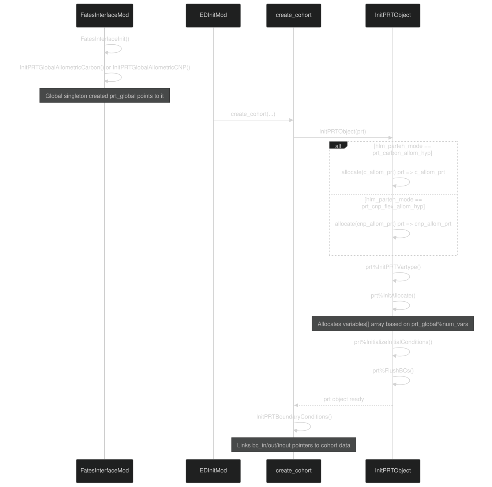
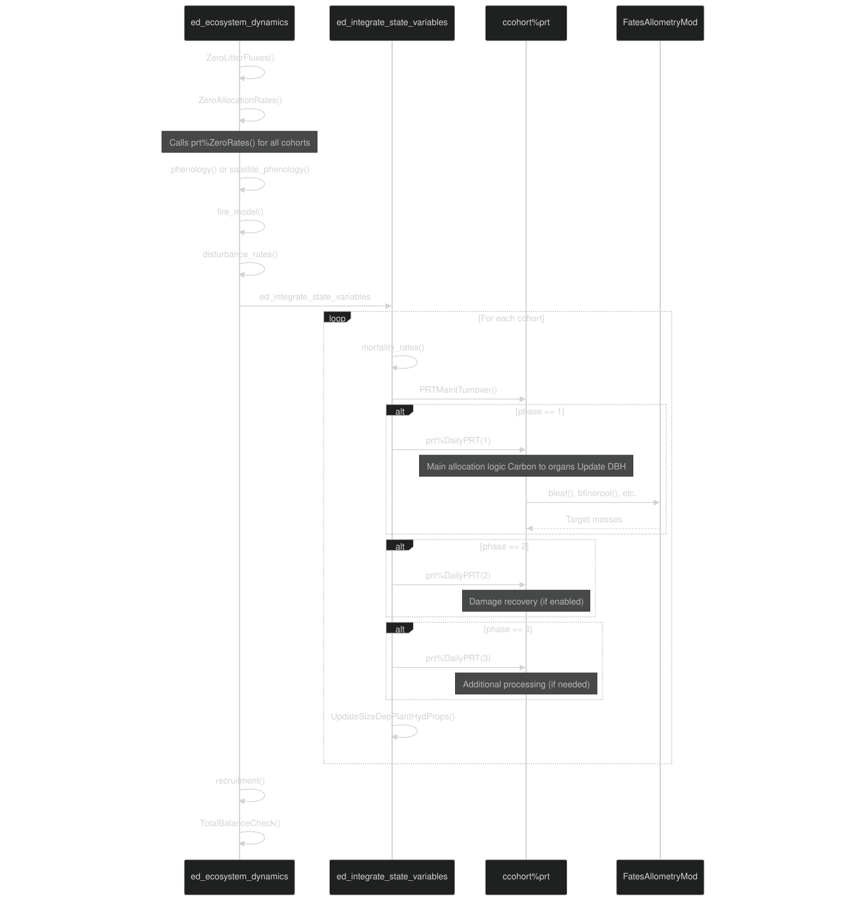

# PARTEH Extensibility Framework

Relevant source files

- [biogeochem/EDCohortDynamicsMod.F90](https://github.com/jingtao-lbl/fates/blob/e85d9977/biogeochem/EDCohortDynamicsMod.F90)
- [biogeochem/EDPhysiologyMod.F90](https://github.com/jingtao-lbl/fates/blob/e85d9977/biogeochem/EDPhysiologyMod.F90)
- [biogeochem/FatesAllometryMod.F90](https://github.com/jingtao-lbl/fates/blob/e85d9977/biogeochem/FatesAllometryMod.F90)
- [biogeochem/FatesSoilBGCFluxMod.F90](https://github.com/jingtao-lbl/fates/blob/e85d9977/biogeochem/FatesSoilBGCFluxMod.F90)
- [parteh/PRTAllometricCNPMod.F90](https://github.com/jingtao-lbl/fates/blob/e85d9977/parteh/PRTAllometricCNPMod.F90)
- [parteh/PRTAllometricCarbonMod.F90](https://github.com/jingtao-lbl/fates/blob/e85d9977/parteh/PRTAllometricCarbonMod.F90)
- [parteh/PRTGenericMod.F90](https://github.com/jingtao-lbl/fates/blob/e85d9977/parteh/PRTGenericMod.F90)
- [parteh/PRTLossFluxesMod.F90](https://github.com/jingtao-lbl/fates/blob/e85d9977/parteh/PRTLossFluxesMod.F90)

## Purpose and Scope

This document describes the Plant Allocation and Reactive Transport Extensible Hypotheses (PARTEH) framework's extensibility architecture. PARTEH is designed as a pluggable system that allows multiple allocation hypotheses to coexist within FATES, enabling scientific experimentation with different theories of plant carbon and nutrient allocation.

This page focuses on the framework design and how to implement new allocation hypotheses . For details on the existing allocation implementations (carbon-only and CNP), see [PARTEH: Plant Allocation System](plant-physiology/parteh/index.md) . For the broader integration with FATES dynamics, see [Daily Dynamics Loop](core-dynamics/daily_loop.md) .

## Core Design Principles

PARTEH implements a polymorphic object-oriented framework where:

Sources: [parteh/PRTGenericMod.F90 1-40](https://github.com/jingtao-lbl/fates/blob/e85d9977/parteh/PRTGenericMod.F90#L1-L40)

## Architecture Overview

### Class Hierarchy

Key Design Elements:

- **`prt_vartypes`**is the abstract base class that all hypotheses extend
- **`prt_vartype`**holds the actual mass values and fluxes for each pool
- **`prt_global_type`**is a singleton mapping object (one per hypothesis, not per plant)
- `prt_vartypes`Each cohort in FATES has a pointer to a object

Sources: [parteh/PRTGenericMod.F90 232-277](https://github.com/jingtao-lbl/fates/blob/e85d9977/parteh/PRTGenericMod.F90#L232-L277)  [parteh/PRTAllometricCarbonMod.F90 136-143](https://github.com/jingtao-lbl/fates/blob/e85d9977/parteh/PRTAllometricCarbonMod.F90#L136-L143)  [parteh/PRTAllometricCNPMod.F90 250-266](https://github.com/jingtao-lbl/fates/blob/e85d9977/parteh/PRTAllometricCNPMod.F90#L250-L266)

## Variable Organization System

### Organs and Elements

PARTEH uses a standardized taxonomy of organs and chemical elements:

Mapping Structure:

Each hypothesis defines variables as combinations of organs and elements. The `sp_organ_map[organ_id, element_id]` array returns the variable index.

| Organ ↓ / Element → | Carbon (1) | Nitrogen (4) | Phosphorus (5) | 
| --- | --- | --- | --- |
| Leaf (1) | var_id=1 | var_id=7 | var_id=13 | 
| Fine Root (2) | var_id=2 | var_id=8 | var_id=14 | 
| Sapwood (3) | var_id=3 | var_id=9 | var_id=15 | 
| Storage (4) | var_id=4 | var_id=10 | var_id=16 | 
| Reproduction (5) | var_id=5 | var_id=11 | var_id=17 | 
| Structure (6) | var_id=6 | var_id=12 | var_id=18 | 

Sources: [parteh/PRTGenericMod.F90 78-108](https://github.com/jingtao-lbl/fates/blob/e85d9977/parteh/PRTGenericMod.F90#L78-L108)  [parteh/PRTGenericMod.F90 336-393](https://github.com/jingtao-lbl/fates/blob/e85d9977/parteh/PRTGenericMod.F90#L336-L393)  [parteh/PRTAllometricCNPMod.F90 86-108](https://github.com/jingtao-lbl/fates/blob/e85d9977/parteh/PRTAllometricCNPMod.F90#L86-L108)

### State Variables vs Boundary Conditions

State Variables:

- `val[]`- instantaneous mass [kg]
- `val0[]`- mass at beginning of control period [kg]
- `net_alloc[]`- integrated allocation over control period [kg]
- `turnover[]`- losses to litter [kg]
- `burned[]`- losses to fire [kg]
- `damaged[]`- losses to damage [kg]

Boundary Conditions:

- `bc_in`- Read-only inputs (PFT index, canopy trim, leaf status)
- `bc_inout`- Both read and written (DBH, carbon balance)
- `bc_out`- Output only (nutrient efflux, limitation factors)

Sources: [parteh/PRTGenericMod.F90 179-200](https://github.com/jingtao-lbl/fates/blob/e85d9977/parteh/PRTGenericMod.F90#L179-L200)  [parteh/PRTGenericMod.F90 206-214](https://github.com/jingtao-lbl/fates/blob/e85d9977/parteh/PRTGenericMod.F90#L206-L214)  [parteh/PRTGenericMod.F90 232-240](https://github.com/jingtao-lbl/fates/blob/e85d9977/parteh/PRTGenericMod.F90#L232-L240)

## Implementing a New Hypothesis

### Step-by-Step Workflow

Sources: [biogeochem/EDCohortDynamicsMod.F90 293-342](https://github.com/jingtao-lbl/fates/blob/e85d9977/biogeochem/EDCohortDynamicsMod.F90#L293-L342)

### Required Code Components
1. Module Header and Variable Definitions
Sources: [parteh/PRTAllometricCarbonMod.F90 70-125](https://github.com/jingtao-lbl/fates/blob/e85d9977/parteh/PRTAllometricCarbonMod.F90#L70-L125)  [parteh/PRTAllometricCNPMod.F90 86-192](https://github.com/jingtao-lbl/fates/blob/e85d9977/parteh/PRTAllometricCNPMod.F90#L86-L192)
2. Extend Base Class
Sources: [parteh/PRTAllometricCarbonMod.F90 136-143](https://github.com/jingtao-lbl/fates/blob/e85d9977/parteh/PRTAllometricCarbonMod.F90#L136-L143)  [parteh/PRTAllometricCNPMod.F90 250-266](https://github.com/jingtao-lbl/fates/blob/e85d9977/parteh/PRTAllometricCNPMod.F90#L250-L266)
3. Create Global Singleton
Sources: [parteh/PRTAllometricCarbonMod.F90 169-255](https://github.com/jingtao-lbl/fates/blob/e85d9977/parteh/PRTAllometricCarbonMod.F90#L169-L255)  [parteh/PRTAllometricCNPMod.F90 289-364](https://github.com/jingtao-lbl/fates/blob/e85d9977/parteh/PRTAllometricCNPMod.F90#L289-L364)
4. Implement Core Allocation Logic
Sources: [parteh/PRTAllometricCarbonMod.F90 260-702](https://github.com/jingtao-lbl/fates/blob/e85d9977/parteh/PRTAllometricCarbonMod.F90#L260-L702)  [parteh/PRTAllometricCNPMod.F90 370-880](https://github.com/jingtao-lbl/fates/blob/e85d9977/parteh/PRTAllometricCNPMod.F90#L370-L880)

## Integration with FATES

### Object Instantiation

Key Functions:

Sources: [biogeochem/EDCohortDynamicsMod.F90 293-342](https://github.com/jingtao-lbl/fates/blob/e85d9977/biogeochem/EDCohortDynamicsMod.F90#L293-L342)  [parteh/PRTGenericMod.F90 487-508](https://github.com/jingtao-lbl/fates/blob/e85d9977/parteh/PRTGenericMod.F90#L487-L508)

### Call Sequence During Dynamics

Phase System:

- **Phase 1**: Main allocation logic, called for all cohorts
- **Phase 2**: Damage module integration (only if tree damage enabled)
- **Phase 3**: Reserved for future use

Sources: [biogeochem/EDPhysiologyMod.F90 1-200](https://github.com/jingtao-lbl/fates/blob/e85d9977/biogeochem/EDPhysiologyMod.F90#L1-L200) File references throughout EDMainMod

## Generic Helper Functions

### Accessing State Variables

These generic functions work across all hypotheses because they use the organ and element IDs, which the mapping system translates to hypothesis-specific variable indices.

Sources: [parteh/PRTGenericMod.F90 830-871](https://github.com/jingtao-lbl/fates/blob/e85d9977/parteh/PRTGenericMod.F90#L830-L871)  [parteh/PRTGenericMod.F90 955-1021](https://github.com/jingtao-lbl/fates/blob/e85d9977/parteh/PRTGenericMod.F90#L955-L1021)

### Mass Balance Checking

The framework automatically verifies that `Δ(state) = net_alloc + turnover + burned + damaged` for mass conservation.

Sources: [parteh/PRTGenericMod.F90 1118-1234](https://github.com/jingtao-lbl/fates/blob/e85d9977/parteh/PRTGenericMod.F90#L1118-L1234)

## Loss Flux Handling

PARTEH provides generic functions for common loss events that work across all hypotheses:

Example: Deciduous Turnover with Retranslocation

Example: Fire Losses

Sources: [parteh/PRTLossFluxesMod.F90 1-70](https://github.com/jingtao-lbl/fates/blob/e85d9977/parteh/PRTLossFluxesMod.F90#L1-L70)  [parteh/PRTLossFluxesMod.F90 461-627](https://github.com/jingtao-lbl/fates/blob/e85d9977/parteh/PRTLossFluxesMod.F90#L461-L627)

## Parameter Requirements

Each hypothesis needs to define its required parameters in `fates_params.cdl` :

Parameters are accessed via the `prt_params` object:

Sources: [parteh/PRTParametersMod.F90 (implied)](https://github.com/jingtao-lbl/fates/blob/e85d9977/parteh/PRTParametersMod.F90 (implied)) parameter usage in [parteh/PRTAllometricCNPMod.F90 229-239](https://github.com/jingtao-lbl/fates/blob/e85d9977/parteh/PRTAllometricCNPMod.F90#L229-L239)

## Testing and Validation

### Required Checks for New Hypotheses

Sources: [parteh/PRTGenericMod.F90 1118-1234](https://github.com/jingtao-lbl/fates/blob/e85d9977/parteh/PRTGenericMod.F90#L1118-L1234)  [biogeochem/FatesAllometryMod.F90 163-288](https://github.com/jingtao-lbl/fates/blob/e85d9977/biogeochem/FatesAllometryMod.F90#L163-L288)

## Summary Table: Adding a New Hypothesis

| Step | Action | Files to Modify/Create | 
| --- | --- | --- |
| 1 | Create hypothesis module | parteh/PRTMyHypothesisMod.F90 | 
| 2 | Define hypothesis ID constant | parteh/PRTGenericMod.F90 | 
| 3 | Extend prt_vartypes class | Your module | 
| 4 | Create prt_global_myh singleton | Your module | 
| 5 | Implement InitPRTGlobalMyH() | Your module | 
| 6 | Implement DailyPRT() | Your module | 
| 7 | Implement FastPRT() (if sub-daily) | Your module | 
| 8 | Implement GetNutrientTarget() (if nutrients) | Your module | 
| 9 | Add case to InitPRTObject() | biogeochem/EDCohortDynamicsMod.F90 | 
| 10 | Call initialization in startup | main/FatesInterfaceMod.F90 | 
| 11 | Add parameters | parameter_files/fates_params_default.cdl | 
| 12 | Add parameter read logic | parteh/PRTParametersMod.F90 | 
| 13 | Update namelist options | Host model configuration | 
| 14 | Test and validate | Create test cases | 

Sources: All sections above