# Hydraulic Architecture

Relevant source files

- [biogeochem/EDCohortDynamicsMod.F90](https://github.com/jingtao-lbl/fates/blob/e85d9977/biogeochem/EDCohortDynamicsMod.F90)
- [biogeochem/EDPhysiologyMod.F90](https://github.com/jingtao-lbl/fates/blob/e85d9977/biogeochem/EDPhysiologyMod.F90)
- [biogeochem/FatesAllometryMod.F90](https://github.com/jingtao-lbl/fates/blob/e85d9977/biogeochem/FatesAllometryMod.F90)
- [biogeophys/FatesHydroWTFMod.F90](https://github.com/jingtao-lbl/fates/blob/e85d9977/biogeophys/FatesHydroWTFMod.F90)
- [biogeophys/FatesPlantHydraulicsMod.F90](https://github.com/jingtao-lbl/fates/blob/e85d9977/biogeophys/FatesPlantHydraulicsMod.F90)
- [functional_unit_testing/hydro/HydroUTestDriver.py](https://github.com/jingtao-lbl/fates/blob/e85d9977/functional_unit_testing/hydro/HydroUTestDriver.py)
- [main/FatesHydraulicsMemMod.F90](https://github.com/jingtao-lbl/fates/blob/e85d9977/main/FatesHydraulicsMemMod.F90)

## Purpose and Scope

This page documents the hydraulic architecture of the FATES plant hydraulics system, including the compartment structure, data types, water transfer functions, and key state variables. The focus is on what the hydraulic system represents and how it is organized in memory, rather than the numerical methods used to solve water flow equations (see [Hydraulic Solvers](../biophysics/hydraulics/solvers.md) for solver algorithms).

The FATES plant hydraulics module simulates the soil-plant-atmosphere water transport continuum. Water moves from soil through roots, stems, and leaves to the atmosphere via stomata. The system tracks water content, water potential, and hydraulic conductance throughout the plant-soil system. This page describes the data structures ( `ed_site_hydr_type` , `ed_cohort_hydr_type` ) and the water transfer functions (WRF, WKF) that define the hydraulic properties of each porous medium type.

Sources:  [biogeophys/FatesPlantHydraulicsMod.F90 1-24](https://github.com/jingtao-lbl/fates/blob/e85d9977/biogeophys/FatesPlantHydraulicsMod.F90#L1-L24)  [main/FatesHydraulicsMemMod.F90 1-12](https://github.com/jingtao-lbl/fates/blob/e85d9977/main/FatesHydraulicsMemMod.F90#L1-L12)

## Hydraulic Compartment Structure

The plant hydraulic system divides each cohort into discrete water storage compartments connected by hydraulic conductances. Water flows from the soil through multiple plant compartments to the atmosphere.

### Compartment Topology

Compartment Topology Diagram : Shows the hierarchical organization of hydraulic compartments from stomata to soil, with conductances controlling flow between adjacent nodes.

Sources:  [main/FatesHydraulicsMemMod.F90 31-45](https://github.com/jingtao-lbl/fates/blob/e85d9977/main/FatesHydraulicsMemMod.F90#L31-L45)  [main/FatesHydraulicsMemMod.F90 201-322](https://github.com/jingtao-lbl/fates/blob/e85d9977/main/FatesHydraulicsMemMod.F90#L201-L322)

### Compartment Definitions

| Compartment | Index Constant | Description | State Variable | Count | 
| --- | --- | --- | --- | --- |
| Leaf | n_hypool_leaf = 1 | Leaf water storage | th_ag(1) | 1 per cohort | 
| Stem | n_hypool_stem = 1 | Stem/sapwood water storage | th_ag(2) | 1 per cohort | 
| Transporting Root | n_hypool_troot = 1 | Coarse root water storage | th_troot | 1 per cohort | 
| Absorbing Root | n_hypool_aroot = 1 | Fine root water storage | th_aroot(j) | nlevrhiz per cohort | 
| Rhizosphere Shell | nshell = 1 | Water in soil near roots | h2osoi_liqvol_shell(j,k) | nlevrhiz × nshell per site | 

Sources:  [main/FatesHydraulicsMemMod.F90 31-45](https://github.com/jingtao-lbl/fates/blob/e85d9977/main/FatesHydraulicsMemMod.F90#L31-L45)

### Porous Media Type Identifiers

Each compartment belongs to a porous medium type with distinct hydraulic properties (water retention and conductivity functions):

| Media Type | Index | Usage | 
| --- | --- | --- |
| stomata_p_media | 0 | Stomatal interface (boundary) | 
| leaf_p_media | 1 | Leaf tissue | 
| stem_p_media | 2 | Stem xylem and sapwood | 
| troot_p_media | 3 | Transporting root xylem | 
| aroot_p_media | 4 | Absorbing root tissue | 
| rhiz_p_media | 5 | Rhizosphere soil | 

Sources:  [main/FatesHydraulicsMemMod.F90 50-56](https://github.com/jingtao-lbl/fates/blob/e85d9977/main/FatesHydraulicsMemMod.F90#L50-L56)  [biogeophys/FatesPlantHydraulicsMod.F90 82-91](https://github.com/jingtao-lbl/fates/blob/e85d9977/biogeophys/FatesPlantHydraulicsMod.F90#L82-L91)

## Cohort-Level Hydraulic Data Structure

The `ed_cohort_hydr_type` stores all hydraulic state variables, parameters, and diagnostics for a single cohort. Each cohort has its own instance of this type, allocated when hydraulics is enabled.

### Type Definition and Key Components

Cohort Hydraulics Data Structure : The `ed_cohort_hydr_type` class contains all hydraulic properties and states for a single cohort.

Sources:  [main/FatesHydraulicsMemMod.F90 201-322](https://github.com/jingtao-lbl/fates/blob/e85d9977/main/FatesHydraulicsMemMod.F90#L201-L322)

### Node Heights and Geometry

Node heights define the vertical position of each compartment's center, used to calculate gravitational potential:

- **`z_node_ag(1:n_hypool_ag)`**: Node heights for aboveground compartments [m], referenced to soil surface (positive = above ground)
- **`z_upper_ag(1:n_hypool_ag)`**: Upper boundary heights for stem and leaf compartments [m]
- **`z_lower_ag(1:n_hypool_ag)`**: Lower boundary heights [m]
- **`z_node_troot`**: Height of transporting root node [m] (negative = below ground)

Absorbing root node heights are set equal to the midpoints of soil layers they occupy.

Sources:  [main/FatesHydraulicsMemMod.F90 204-214](https://github.com/jingtao-lbl/fates/blob/e85d9977/main/FatesHydraulicsMemMod.F90#L204-L214)  [biogeophys/FatesPlantHydraulicsMod.F90 247-250](https://github.com/jingtao-lbl/fates/blob/e85d9977/biogeophys/FatesPlantHydraulicsMod.F90#L247-L250)

### Maximum Hydraulic Conductances

Maximum conductances ( `kmax` ) control water flow between compartments [kg H₂O s⁻¹ MPa⁻¹]. Actual conductance is `kmax × ftc` where `ftc` is the fraction of total conductivity (0-1), which decreases with xylem cavitation.

Axial (Xylem) Conductances:

| Variable | Description | Units | 
| --- | --- | --- |
| kmax_petiole_to_leaf | Petiole to leaf (set very high) | kg s⁻¹ MPa⁻¹ | 
| kmax_stem_upper(1) | Upper stem boundary | kg s⁻¹ MPa⁻¹ | 
| kmax_stem_lower(1) | Lower stem boundary | kg s⁻¹ MPa⁻¹ | 
| kmax_troot_upper | Upper transporting root | kg s⁻¹ MPa⁻¹ | 
| kmax_troot_lower(j) | Lower transporting root to layer j | kg s⁻¹ MPa⁻¹ | 
| kmax_aroot_upper(j) | Absorbing root xylem (layer j) | kg s⁻¹ MPa⁻¹ | 
| kmax_aroot_lower(j) | Absorbing root to transporting root | kg s⁻¹ MPa⁻¹ | 

Radial (Membrane) Conductances:

| Variable | Description | Units | 
| --- | --- | --- |
| kmax_aroot_radial_in(j) | Root membrane, water flowing IN | kg s⁻¹ MPa⁻¹ | 
| kmax_aroot_radial_out(j) | Root membrane, water flowing OUT | kg s⁻¹ MPa⁻¹ | 

Radial conductances represent flow through the exodermis, cortex, Casparian strip, and endodermis. Separate in/out conductances allow asymmetric membrane permeability.

Sources:  [main/FatesHydraulicsMemMod.F90 216-243](https://github.com/jingtao-lbl/fates/blob/e85d9977/main/FatesHydraulicsMemMod.F90#L216-L243)  [biogeophys/FatesPlantHydraulicsMod.F90 254-257](https://github.com/jingtao-lbl/fates/blob/e85d9977/biogeophys/FatesPlantHydraulicsMod.F90#L254-L257)

### Compartment Volumes and Lengths

Volumes [m³] represent the water storage capacity of each compartment per individual plant:

- **`v_ag(1:n_hypool_ag)`**: Current volume of aboveground compartments
- **`v_ag_init(1:n_hypool_ag)`**: Previous day's volume (for tracking growth/turnover)
- **`v_troot`****`v_troot_init`**, : Transporting root volume
- **`v_aroot_layer(1:nlevrhiz)`****`v_aroot_layer_init(1:nlevrhiz)`**, : Absorbing root volume per layer
- **`l_aroot_layer(1:nlevrhiz)`**: Absorbing root length per layer [m]

Volumes are recalculated daily when plant biomass changes. The `_init` variables track the previous state to compute water balance errors during growth/turnover.

Sources:  [main/FatesHydraulicsMemMod.F90 245-254](https://github.com/jingtao-lbl/fates/blob/e85d9977/main/FatesHydraulicsMemMod.F90#L245-L254)  [biogeophys/FatesPlantHydraulicsMod.F90 252-253](https://github.com/jingtao-lbl/fates/blob/e85d9977/biogeophys/FatesPlantHydraulicsMod.F90#L252-L253)

### State Variables: Water Content

The prognostic state variable is volumetric water content  `θ` [m³ H₂O / m³ tissue]:

- **`th_ag(1:n_hypool_ag)`**: Water content in leaf and stem [m³/m³]
- **`th_troot`**: Water content in transporting root [m³/m³]
- **`th_aroot(1:nlevrhiz)`**: Water content in absorbing roots per layer [m³/m³]

These are the variables integrated forward in time by the hydraulic solvers.

Sources:  [main/FatesHydraulicsMemMod.F90 257-261](https://github.com/jingtao-lbl/fates/blob/e85d9977/main/FatesHydraulicsMemMod.F90#L257-L261)

### Diagnostic Variables

Water Potential:

- **`psi_ag(1:n_hypool_ag)`**: Water potential in aboveground compartments [MPa]
- **`psi_troot`**: Water potential in transporting root [MPa]
- **`psi_aroot(1:nlevrhiz)`**: Water potential in absorbing roots [MPa]

Water potential is computed from water content via the water retention function (WRF).

Fraction of Total Conductivity:

- **`ftc_ag(1:n_hypool_ag)`**: Fraction of conductivity in aboveground compartments [-]
- **`ftc_troot`**: Fraction of conductivity in transporting root [-]
- **`ftc_aroot(1:nlevrhiz)`**: Fraction of conductivity in absorbing roots [-]

The `ftc` ranges from 0 (fully cavitated) to 1 (fully conductive) and is computed from water potential via the water conductivity function (WKF).

Other Diagnostics:

- **`btran`**: Soil water stress factor limiting stomatal conductance [0-1]
- **`qtop`**: Mean transpiration flux from cohort [kg H₂O cohort⁻¹ s⁻¹]
- **`errh2o`**: Water balance error [kg H₂O m⁻²]

Sources:  [main/FatesHydraulicsMemMod.F90 263-290](https://github.com/jingtao-lbl/fates/blob/e85d9977/main/FatesHydraulicsMemMod.F90#L263-L290)

## Site-Level Hydraulic Data Structure

The `ed_site_hydr_type` stores site-aggregated hydraulic quantities and manages the rhizosphere shells. Unlike the cohort structure (one per cohort), there is one site structure per site.

### Type Definition

Site Hydraulics Data Structure : The `ed_site_hydr_type` manages rhizosphere shells and site-aggregated water quantities.

Sources:  [main/FatesHydraulicsMemMod.F90 68-197](https://github.com/jingtao-lbl/fates/blob/e85d9977/main/FatesHydraulicsMemMod.F90#L68-L197)

### Rhizosphere Vertical Structure

The rhizosphere is vertically discretized into `nlevrhiz` layers that may differ from the soil model's native layering:

- **`nlevrhiz`**: Number of rhizosphere layers (typically ≤ 40)
- **`zi_rhiz(1:nlevrhiz)`**: Depth of bottom edge of each rhizosphere layer [m]
- **`dz_rhiz(1:nlevrhiz)`**: Thickness of each rhizosphere layer [m]
- **`map_s2r(1:nlevsoil)`**: Maps soil layer → rhizosphere layer index
- **`map_r2s(1:nlevrhiz,1:2)`**: Maps rhizosphere layer → (top soil layer, bottom soil layer)

The mapping arrays enable aggregation of soil properties (e.g., `watsat` , `sucsat` ) from the native soil grid to the rhizosphere grid.

Sources:  [main/FatesHydraulicsMemMod.F90 71-75](https://github.com/jingtao-lbl/fates/blob/e85d9977/main/FatesHydraulicsMemMod.F90#L71-L75)  [biogeophys/FatesPlantHydraulicsMod.F90 401-447](https://github.com/jingtao-lbl/fates/blob/e85d9977/biogeophys/FatesPlantHydraulicsMod.F90#L401-L447)

### Rhizosphere Shell Structure

Each rhizosphere layer contains radial shells representing the soil volume influenced by roots:

- **`v_shell(j,k)`**: Volume of shell k in layer j [m³] (summed across all cohorts in the site)
- **`r_node_shell(j,k)`**: Radial node position [m]
- **`r_out_shell(j,k)`**: Outer radius of shell [m]
- **`h2osoi_liqvol_shell(j,k)`**: Volumetric water content in shell [m³/m³]
- **`kmax_upper_shell(j,k)`**: Conductance to inner shell [kg s⁻¹ MPa⁻¹]
- **`kmax_lower_shell(j,k)`**: Conductance to outer shell [kg s⁻¹ MPa⁻¹]

The shells form a radial transport path from bulk soil to the root surface.

Sources:  [main/FatesHydraulicsMemMod.F90 77-93](https://github.com/jingtao-lbl/fates/blob/e85d9977/main/FatesHydraulicsMemMod.F90#L77-L93)

### Site-Aggregated Root Properties

- **`l_aroot_layer(1:nlevrhiz)`**: Total absorbing root length across all cohorts in layer j [m]
- **`l_aroot_layer_init(1:nlevrhiz)`**: Previous total root length [m]
- **`rs1(1:nlevrhiz)`**: Mean fine root radius [m] (currently constant = 0.0001 m)

These aggregate quantities are used to compute rhizosphere shell dimensions and conductances.

Sources:  [main/FatesHydraulicsMemMod.F90 82-86](https://github.com/jingtao-lbl/fates/blob/e85d9977/main/FatesHydraulicsMemMod.F90#L82-L86)  [main/FatesHydraulicsMemMod.F90 62-64](https://github.com/jingtao-lbl/fates/blob/e85d9977/main/FatesHydraulicsMemMod.F90#L62-L64)

### Water Balance Tracking

The site structure tracks various water pools and errors:

| Variable | Description | Units | 
| --- | --- | --- |
| h2oveg | Total water in vegetation | kg m⁻² | 
| h2oveg_recruit | Water in new recruits | kg m⁻² | 
| h2oveg_dead | Water in dead vegetation | kg m⁻² | 
| h2oveg_growturn_err | Error pool for growth/turnover | kg m⁻² | 
| h2oveg_hydro_err | Error pool for hydrodynamics | kg m⁻² | 
| errh2o_hyd | Total hydraulics error | mm | 
| dwat_veg | Change in vegetation water | kg | 

Sources:  [main/FatesHydraulicsMemMod.F90 104-123](https://github.com/jingtao-lbl/fates/blob/e85d9977/main/FatesHydraulicsMemMod.F90#L104-L123)

### Diagnostic Outputs

The site structure contains arrays for history diagnostics:

- **`rootuptake_sl(1:nlevsoil)`**: Root uptake per soil layer [kg m⁻² s⁻¹]
- **`rootl_sl(1:nlevsoil)`**: Root length per soil layer [m]
- **`sapflow_scpf(1:numlevsclass,1:numpft)`**: Sapflow by size class × PFT [kg ha⁻¹ s⁻¹]
- **`rootuptake0_scpf`**: Root uptake 0-10 cm depth by size × PFT [kg ha⁻¹ m⁻¹ s⁻¹]
- **`rootuptake10_scpf`**: Root uptake 10-50 cm depth [kg ha⁻¹ m⁻¹ s⁻¹]
- **`rootuptake50_scpf`**: Root uptake 50-100 cm depth [kg ha⁻¹ m⁻¹ s⁻¹]
- **`rootuptake100_scpf`**: Root uptake >100 cm depth [kg ha⁻¹ m⁻¹ s⁻¹]

Sources:  [main/FatesHydraulicsMemMod.F90 125-151](https://github.com/jingtao-lbl/fates/blob/e85d9977/main/FatesHydraulicsMemMod.F90#L125-L151)

## Water Transfer Functions

The hydraulic properties of each porous medium (leaf, stem, root, soil) are described by two types of functions:

FATES implements multiple functional forms (Van Genuchten, Campbell-Clapp-Hornberger, TFS) that can be selected per media type via the parameter `hydr_htftype_node` .

### Class Hierarchy

Water Transfer Function Class Hierarchy : Base classes `wrf_type` and `wkf_type` are extended by specific functional forms (VG, CCH, TFS). Array holder types enable polymorphism.

Sources:  [biogeophys/FatesHydroWTFMod.F90 47-241](https://github.com/jingtao-lbl/fates/blob/e85d9977/biogeophys/FatesHydroWTFMod.F90#L47-L241)

### Water Retention Functions (WRF)

WRFs map between volumetric water content `θ` [m³/m³] and matric potential `ψ` [MPa]. Key methods:

- **`th_from_psi(psi)`**`ψ``θ`: Given , return
- **`psi_from_th(th)`**`θ``ψ`: Given , return
- **`dpsidth_from_th(th)`**: Return derivative dψ/dθ [MPa m³ m⁻³]

Van Genuchten (1980):

Parameters: `alpha` , `n_vg` , `m_vg` , `th_sat` , `th_res`

Equation: `θ = θ_res + (θ_sat - θ_res) / [1 + (α|ψ|)^n]^m`

Campbell-Clapp-Hornberger:

Parameters: `th_sat` , `psi_sat` (bubbling pressure), `beta` (pore size parameter)

Equation: `θ/θ_sat = (ψ/ψ_sat)^(-1/β)`

TFS (Three-region Function):

Parameters: `th_sat` , `th_res` , `pinot` (osmotic potential), `epsil` (elastic modulus), `rwc_ft` (turgor loss point), plus capillary region parameters

TFS uses three regions: (1) capillary, (2) elastic, (3) cavitation. It combines pressure-volume curve theory with hydraulic vulnerability.

Sources:  [biogeophys/FatesHydroWTFMod.F90 109-241](https://github.com/jingtao-lbl/fates/blob/e85d9977/biogeophys/FatesHydroWTFMod.F90#L109-L241)  [biogeophys/FatesHydroWTFMod.F90 423-691](https://github.com/jingtao-lbl/fates/blob/e85d9977/biogeophys/FatesHydroWTFMod.F90#L423-L691)

### Water Conductivity Functions (WKF)

WKFs map water potential `ψ` to the fraction of total conductivity `ftc` (0 to 1), representing xylem cavitation. Key methods:

- **`ftc_from_psi(psi)`**`ψ``ftc`: Given , return
- **`dftcdpsi_from_psi(psi)`**: Return derivative d(ftc)/dψ [MPa⁻¹]

Van Genuchten:

Uses the relative hydraulic conductivity function derived from the VG water retention curve plus a tortuosity parameter `tort` .

Campbell-Clapp-Hornberger:

Similar approach based on the CCH water retention curve.

TFS:

Uses a vulnerability curve: `ftc = 1 / [1 + (ψ/p50)^avuln]`

Parameters: `p50` (potential at 50% loss of conductivity [MPa]), `avuln` (vulnerability curve shape parameter)

Sources:  [biogeophys/FatesHydroWTFMod.F90 89-96](https://github.com/jingtao-lbl/fates/blob/e85d9977/biogeophys/FatesHydroWTFMod.F90#L89-L96)  [biogeophys/FatesHydroWTFMod.F90 602-691](https://github.com/jingtao-lbl/fates/blob/e85d9977/biogeophys/FatesHydroWTFMod.F90#L602-L691)

### Global WRF/WKF Objects

FATES allocates global arrays of water transfer function objects:

- **`wrf_plant(1:n_plant_media, 1:numpft)`**: WRF for each plant porous media type × PFT
- **`wkf_plant(1:n_plant_media, 1:numpft)`**: WKF for each plant porous media type × PFT
- **`wrf_soil(1:nlevrhiz)`**: WRF for each rhizosphere layer (site-level)
- **`wkf_soil(1:nlevrhiz)`**: WKF for each rhizosphere layer (site-level)

These are pointers to the extended types ( `wrf_type_vg` , `wkf_type_tfs` , etc.) determined by parameter settings.

Sources:  [biogeophys/FatesPlantHydraulicsMod.F90 218-227](https://github.com/jingtao-lbl/fates/blob/e85d9977/biogeophys/FatesPlantHydraulicsMod.F90#L218-L227)  [main/FatesHydraulicsMemMod.F90 154-156](https://github.com/jingtao-lbl/fates/blob/e85d9977/main/FatesHydraulicsMemMod.F90#L154-L156)

## Initialization and Size-Dependent Updates

### Initialization Sequence

When a cohort is created with hydraulics enabled, the following initialization occurs:

Sources:  [biogeochem/EDCohortDynamicsMod.F90 238-289](https://github.com/jingtao-lbl/fates/blob/e85d9977/biogeochem/EDCohortDynamicsMod.F90#L238-L289)

### Size-Dependent Updates

When plant size changes (growth, recruitment), hydraulic properties must be updated:

Daily Updates During Growth:

Size-Dependent Update Flow : When DBH increases, height, node positions, volumes, and conductances are recalculated.

Key Functions:

- **`UpdatePlantHydrNodes(ccohort, pft, height, si_hydr)`**[biogeophys/FatesPlantHydraulicsMod.F901394-1552](https://github.com/jingtao-lbl/fates/blob/e85d9977/biogeophys/FatesPlantHydraulicsMod.F90#L1394-L1552): Recalculates node heights based on new plant height
- **`UpdatePlantHydrLenVol(ccohort, csite_hydr)`**[biogeophys/FatesPlantHydraulicsMod.F901554-1671](https://github.com/jingtao-lbl/fates/blob/e85d9977/biogeophys/FatesPlantHydraulicsMod.F90#L1554-L1671): Recalculates compartment volumes and absorbing root length from biomass
- **`UpdatePlantKmax(ccohort_hydr, ccohort, csite_hydr)`**[biogeophys/FatesPlantHydraulicsMod.F901673-1886](https://github.com/jingtao-lbl/fates/blob/e85d9977/biogeophys/FatesPlantHydraulicsMod.F90#L1673-L1886): Recalculates all maximum conductances
- **`UpdateSizeDepRhizVolLenCon(site, bc_in)`**[biogeophys/FatesPlantHydraulicsMod.F901888-2146](https://github.com/jingtao-lbl/fates/blob/e85d9977/biogeophys/FatesPlantHydraulicsMod.F90#L1888-L2146): Updates rhizosphere shell properties at the site level

Sources:  [biogeophys/FatesPlantHydraulicsMod.F90 255-267](https://github.com/jingtao-lbl/fates/blob/e85d9977/biogeophys/FatesPlantHydraulicsMod.F90#L255-L267)

## Key Parameters

The following table summarizes important hydraulic parameters (traits) that vary by PFT:

| Parameter | Symbol | Description | Units | Module | 
| --- | --- | --- | --- | --- |
| Conductivity at 25°C | hydr_kmax_node | Reference xylem conductivity | kg m⁻¹ s⁻¹ MPa⁻¹ | EDPftvarcon | 
| P50 | hydr_p50_node | Water potential at 50% loss | MPa | EDPftvarcon | 
| Vulnerability | hydr_avuln_node | Vulnerability curve shape | - | EDPftvarcon | 
| TFS pinot | hydr_pinot_node | Osmotic potential at full turgor | MPa | EDPftvarcon | 
| TFS epsil | hydr_epsil_node | Bulk elastic modulus | MPa | EDPftvarcon | 
| Residual WC | hydr_thetas_node | Saturation water content | m³/m³ | EDPftvarcon | 
| Saturation WC | hydr_theta_res_node | Residual water content | m³/m³ | EDPftvarcon | 

Global parameters (not PFT-specific):

| Parameter | Symbol | Description | Default | Module | 
| --- | --- | --- | --- | --- |
| Root surface Kmax | hydr_kmax_rsurf1, hydr_kmax_rsurf2 | Root membrane conductance | - | EDParamsMod | 
| Psi at turgor loss | hydr_psi0 | Reference potential | 0.0 MPa | EDParamsMod | 
| Capillary Psi | hydr_psicap | Capillary region bound | -0.6 MPa | EDParamsMod | 
| Hydraulics type | hydr_htftype_node | WRF/WKF type selector | 1=TFS, 2=VG | EDParamsMod | 
| Solver type | hydr_solver | Numerical solver choice | 1=Taylor, 2=Picard, 3=Newton | EDParamsMod | 

Sources:  [biogeophys/FatesPlantHydraulicsMod.F90 47-52](https://github.com/jingtao-lbl/fates/blob/e85d9977/biogeophys/FatesPlantHydraulicsMod.F90#L47-L52)  [main/FatesHydraulicsMemMod.F90 16-19](https://github.com/jingtao-lbl/fates/blob/e85d9977/main/FatesHydraulicsMemMod.F90#L16-L19)

## Summary

The FATES hydraulic architecture represents the plant-soil water continuum as a network of discrete compartments (leaf, stem, transporting root, absorbing roots, rhizosphere shells) connected by conductances. Each cohort maintains its own hydraulic state variables (water content `θ` , water potential `ψ` , fraction of conductivity `ftc` ) in the `ed_cohort_hydr_type` structure. Site-level quantities and rhizosphere shells are managed in the `ed_site_hydr_type` structure.

Water transfer between compartments is governed by water retention functions (WRF: `θ ↔ ψ` ) and water conductivity functions (WKF: `ψ → ftc` ). Multiple functional forms (Van Genuchten, Campbell, TFS) are available and can be selected per porous medium type and PFT via parameter files.

The architecture supports dynamic updating of hydraulic properties as plants grow (via `UpdatePlantHydrNodes` , `UpdatePlantHydrLenVol` , `UpdatePlantKmax` ) and tracks water balance through multiple error pools. For details on how water flow equations are solved numerically, see [Hydraulic Solvers](../biophysics/hydraulics/solvers.md) .

Sources:  [biogeophys/FatesPlantHydraulicsMod.F90 1-22](https://github.com/jingtao-lbl/fates/blob/e85d9977/biogeophys/FatesPlantHydraulicsMod.F90#L1-L22)  [main/FatesHydraulicsMemMod.F90 1-12](https://github.com/jingtao-lbl/fates/blob/e85d9977/main/FatesHydraulicsMemMod.F90#L1-L12)  [biogeophys/FatesHydroWTFMod.F90 1-28](https://github.com/jingtao-lbl/fates/blob/e85d9977/biogeophys/FatesHydroWTFMod.F90#L1-L28)