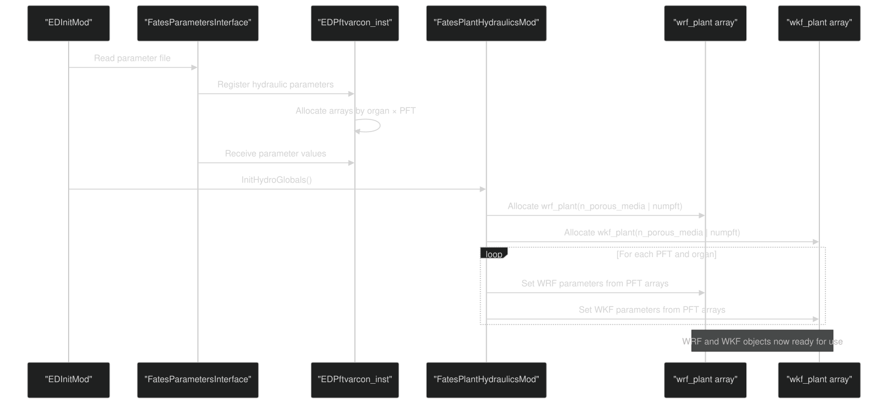
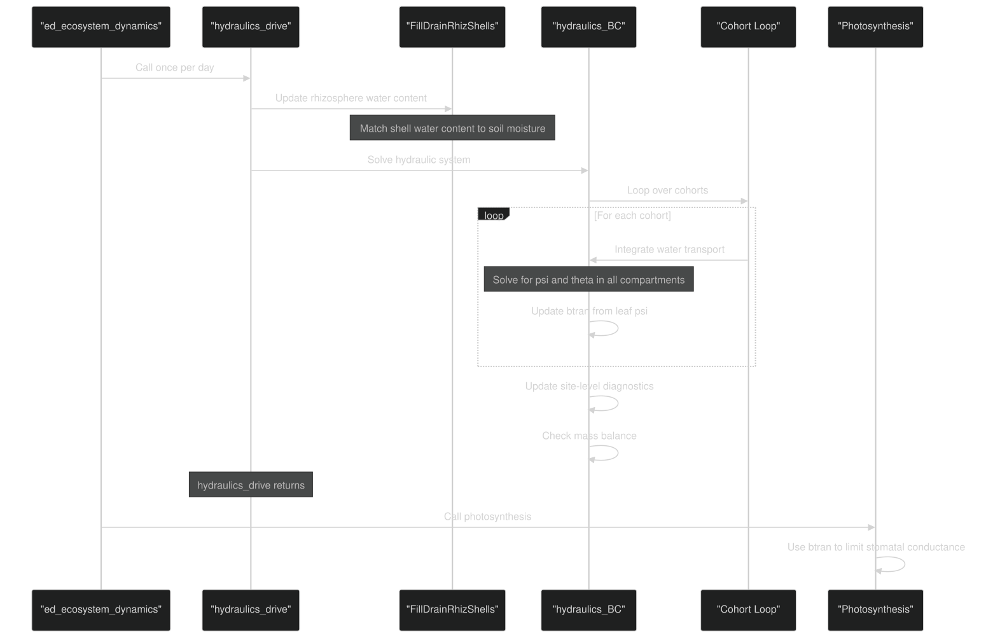

# Plant Hydraulics

Relevant source files

- [biogeophys/FatesHydroWTFMod.F90](https://github.com/jingtao-lbl/fates/blob/e85d9977/biogeophys/FatesHydroWTFMod.F90)
- [biogeophys/FatesPlantHydraulicsMod.F90](https://github.com/jingtao-lbl/fates/blob/e85d9977/biogeophys/FatesPlantHydraulicsMod.F90)
- [biogeophys/FatesPlantRespPhotosynthMod.F90](https://github.com/jingtao-lbl/fates/blob/e85d9977/biogeophys/FatesPlantRespPhotosynthMod.F90)
- [functional_unit_testing/hydro/HydroUTestDriver.py](https://github.com/jingtao-lbl/fates/blob/e85d9977/functional_unit_testing/hydro/HydroUTestDriver.py)
- [main/EDParamsMod.F90](https://github.com/jingtao-lbl/fates/blob/e85d9977/main/EDParamsMod.F90)
- [main/EDPftvarcon.F90](https://github.com/jingtao-lbl/fates/blob/e85d9977/main/EDPftvarcon.F90)
- [main/FatesHydraulicsMemMod.F90](https://github.com/jingtao-lbl/fates/blob/e85d9977/main/FatesHydraulicsMemMod.F90)
- [parameter_files/fates_params_default.cdl](https://github.com/jingtao-lbl/fates/blob/e85d9977/parameter_files/fates_params_default.cdl)

## Purpose and Scope

The plant hydraulics module in FATES simulates water transport through the soil-plant-atmosphere continuum, accounting for water potential gradients, xylem cavitation, and hydraulic limitations on stomatal conductance. This is an experimental feature that replaces the simpler BTRAN-based water stress approach with a mechanistic representation of plant water transport.

Warning : Plant hydraulics is still undergoing testing and development. Production simulations typically use the non-hydraulic water stress model (see [Transpiration and Soil Moisture Stress](../biophysics/transpiration.md) ).

For the integration of plant hydraulics with photosynthesis and stomatal conductance, see [Photosynthesis and Respiration](../biophysics/photosynthesis.md) . For root water uptake in non-hydraulic mode, see [Transpiration and Soil Moisture Stress](../biophysics/transpiration.md) .

The plant hydraulics model is enabled by setting `hlm_use_planthydro = .true.` at the host land model interface level.

Key Citation : Christoffersen et al. (2016), Geoscientific Model Development, 9(11), 4227-4255, DOI: 10.5194/gmd-9-4227-2016.

Sources: [biogeophys/FatesPlantHydraulicsMod.F90 1-22](https://github.com/jingtao-lbl/fates/blob/e85d9977/biogeophys/FatesPlantHydraulicsMod.F90#L1-L22)

## Hydraulic Architecture

The plant hydraulics system divides the water transport pathway into discrete compartments from soil to atmosphere. Each compartment has its own water potential, water content, and hydraulic conductance properties.

### Compartment Structure

Each compartment is characterized by:

- **Node height**`z_node_*`( ): Vertical position relative to soil surface [m]
- **Volume**`v_*`( ): Water storage capacity [m³]
- **Water content**`th_*`( ): Volumetric water content [m³/m³]
- **Water potential**`psi_*`( ): Matric potential [MPa]
- **Conductance**`kmax_*`( ): Maximum hydraulic conductance [kg H₂O s⁻¹ MPa⁻¹]
- **Fractional conductivity**`ftc_*`( ): Loss of conductivity due to cavitation [0-1]

Sources: [biogeophys/FatesPlantHydraulicsMod.F90 120-126](https://github.com/jingtao-lbl/fates/blob/e85d9977/biogeophys/FatesPlantHydraulicsMod.F90#L120-L126)  [main/FatesHydraulicsMemMod.F90 32-46](https://github.com/jingtao-lbl/fates/blob/e85d9977/main/FatesHydraulicsMemMod.F90#L32-L46)  [main/FatesHydraulicsMemMod.F90 200-321](https://github.com/jingtao-lbl/fates/blob/e85d9977/main/FatesHydraulicsMemMod.F90#L200-L321)

### Cohort-Level Hydraulic State

The `ed_cohort_hydr_type` class manages all hydraulic state variables for an individual cohort:

| Array/Variable | Dimension | Description | Units | 
| --- | --- | --- | --- |
| z_node_ag | n_hypool_ag | Node heights for aboveground compartments | m | 
| z_node_troot | scalar | Transporting root node height | m | 
| v_ag | n_hypool_ag | Aboveground compartment volumes | m³ | 
| v_troot | scalar | Transporting root volume | m³ | 
| v_aroot_layer | nlevrhiz | Absorbing root volumes by soil layer | m³ | 
| l_aroot_layer | nlevrhiz | Absorbing root length by soil layer | m | 
| th_ag | n_hypool_ag | Aboveground water content | m³/m³ | 
| th_troot | scalar | Transporting root water content | m³/m³ | 
| th_aroot | nlevrhiz | Absorbing root water content by layer | m³/m³ | 
| psi_ag | n_hypool_ag | Aboveground water potential | MPa | 
| psi_troot | scalar | Transporting root water potential | MPa | 
| psi_aroot | nlevrhiz | Absorbing root water potential by layer | MPa | 
| ftc_ag | n_hypool_ag | Fractional conductivity aboveground | - | 
| ftc_troot | scalar | Fractional conductivity transporting root | - | 
| ftc_aroot | nlevrhiz | Fractional conductivity absorbing roots | - | 
| btran | scalar | Leaf water stress factor for stomatal conductance | 0-1 | 
| qtop | scalar | Transpiration rate | kg/cohort/s | 

Sources: [main/FatesHydraulicsMemMod.F90 200-321](https://github.com/jingtao-lbl/fates/blob/e85d9977/main/FatesHydraulicsMemMod.F90#L200-L321)

### Site-Level Rhizosphere State

The `ed_site_hydr_type` class manages the rhizosphere compartments at the site level, which are shared across cohorts:

| Array/Variable | Dimension | Description | Units | 
| --- | --- | --- | --- |
| nlevrhiz | scalar | Number of rhizosphere layers | - | 
| zi_rhiz | nlevrhiz | Depth of bottom edge of each layer | m | 
| dz_rhiz | nlevrhiz | Width of each layer | m | 
| v_shell | nlevrhiz × nshell | Volume of rhizosphere shells | m³ | 
| r_node_shell | nlevrhiz × nshell | Nodal radius of shells | m | 
| r_out_shell | nlevrhiz × nshell | Outer radius of shells | m | 
| h2osoi_liqvol_shell | nlevrhiz × nshell | Volumetric water in shells | m³/m³ | 
| l_aroot_layer | nlevrhiz | Total absorbing root length by layer | m | 
| kmax_upper_shell | nlevrhiz × nshell | Max conductance to upper boundary | kg s⁻¹ MPa⁻¹ | 
| kmax_lower_shell | nlevrhiz × nshell | Max conductance to lower boundary | kg s⁻¹ MPa⁻¹ | 

Sources: [main/FatesHydraulicsMemMod.F90 68-196](https://github.com/jingtao-lbl/fates/blob/e85d9977/main/FatesHydraulicsMemMod.F90#L68-L196)

## Water Transfer Functions (WTFs)

Water transfer functions describe the relationships between water potential, water content, and hydraulic conductivity in porous media (xylem, soil). FATES supports multiple hypotheses through an extensible object-oriented framework.

### Water Retention Functions (WRFs)

Water retention functions relate volumetric water content (θ) to matric potential (ψ):

Available WRF Types:

The WRF type for each plant organ is specified in the parameter file via `fates_hydro_htftype_node` (dimension: `fates_hydr_organs × fates_pft` ). The global parameter `hydr_htftype_node` is read from this parameter.

Sources: [biogeophys/FatesHydroWTFMod.F90 50-242](https://github.com/jingtao-lbl/fates/blob/e85d9977/biogeophys/FatesHydroWTFMod.F90#L50-L242)  [main/EDParamsMod.F90 150-164](https://github.com/jingtao-lbl/fates/blob/e85d9977/main/EDParamsMod.F90#L150-L164)  [parameter_files/fates_params_default.cdl 35-37](https://github.com/jingtao-lbl/fates/blob/e85d9977/parameter_files/fates_params_default.cdl#L35-L37)

### Water Conductivity Functions (WKFs)

Water conductivity functions relate hydraulic conductivity to water potential, capturing the effects of cavitation (xylem embolism):

Available WKF Types:

Global arrays `wrf_plant` and `wkf_plant` (dimension: `n_porous_media × numpft` ) store pointers to the appropriate WRF and WKF objects for each porous media type and PFT.

Sources: [biogeophys/FatesHydroWTFMod.F90 88-242](https://github.com/jingtao-lbl/fates/blob/e85d9977/biogeophys/FatesHydroWTFMod.F90#L88-L242)  [biogeophys/FatesPlantHydraulicsMod.F90 218-226](https://github.com/jingtao-lbl/fates/blob/e85d9977/biogeophys/FatesPlantHydraulicsMod.F90#L218-L226)

## Hydraulic Solvers

FATES provides multiple numerical methods for solving the water transport equations. The solver is selected via the global parameter `hydr_solver` .

### Solver Options

### Taylor 1D Sequential Solver (hydr_solver = 1)

The Taylor solver handles each soil layer independently, sequencing through layers from deepest to shallowest. Within each layer:

This approach is computationally efficient but may accumulate errors across layers.

Key routine : `hydraulics_BC` in [biogeophys/FatesPlantHydraulicsMod.F90 676-1489](https://github.com/jingtao-lbl/fates/blob/e85d9977/biogeophys/FatesPlantHydraulicsMod.F90#L676-L1489)

Sources: [biogeophys/FatesPlantHydraulicsMod.F90 282-308](https://github.com/jingtao-lbl/fates/blob/e85d9977/biogeophys/FatesPlantHydraulicsMod.F90#L282-L308)  [main/FatesHydraulicsMemMod.F90 17-19](https://github.com/jingtao-lbl/fates/blob/e85d9977/main/FatesHydraulicsMemMod.F90#L17-L19)  [main/EDParamsMod.F90 218-227](https://github.com/jingtao-lbl/fates/blob/e85d9977/main/EDParamsMod.F90#L218-L227)

### Picard 2D Iterative Solver (hydr_solver = 2)

The Picard solver treats the entire soil-plant system as a single coupled problem:

This provides better conservation properties but is more computationally expensive.

Matrix structure : The Jacobian and residual arrays are allocated in `ed_site_hydr_type` :

- `ajac(num_nodes, num_nodes)`: Jacobian matrix
- `residual(num_nodes)`: Residual vector
- `conn_up(num_connections)``conn_dn(num_connections)`, : Connectivity
- `pm_node(num_nodes)`: Porous media type for each node

Sources: [main/FatesHydraulicsMemMod.F90 159-183](https://github.com/jingtao-lbl/fates/blob/e85d9977/main/FatesHydraulicsMemMod.F90#L159-L183)  [biogeophys/FatesPlantHydraulicsMod.F90 282-308](https://github.com/jingtao-lbl/fates/blob/e85d9977/biogeophys/FatesPlantHydraulicsMod.F90#L282-L308)

## Parameters and Configuration

### Global Hydraulic Parameters

These parameters are defined in `EDParamsMod` and loaded from the parameter file:

| Parameter | Symbol | Default | Units | Description | 
| --- | --- | --- | --- | --- |
| hydr_kmax_rsurf1 | - | - | kg/(m² MPa s) | Max conductivity at root surface, soil→root | 
| hydr_kmax_rsurf2 | - | - | kg/(m² MPa s) | Max conductivity at root surface, root→soil | 
| hydr_psi0 | - | 0.0 | MPa | Sapwood water potential at saturation | 
| hydr_psicap | - | -0.6 | MPa | Potential at which capillary reserves exhausted | 
| hydr_solver | - | 1 | - | Solver selection (1=Taylor, 2=Picard, 3=Newton) | 

Sources: [main/EDParamsMod.F90 201-227](https://github.com/jingtao-lbl/fates/blob/e85d9977/main/EDParamsMod.F90#L201-L227)  [parameter_files/fates_params_default.cdl 1-43](https://github.com/jingtao-lbl/fates/blob/e85d9977/parameter_files/fates_params_default.cdl#L1-L43)

### PFT-Specific Hydraulic Parameters

The following parameters are PFT-specific and some are also organ-specific (dimension: `fates_hydr_organs × fates_pft` ):

Xylem Properties (per organ):

- `fates_hydro_avuln_node`: Vulnerability curve shape parameter [-]
- `fates_hydro_p50_node`: Water potential at 50% conductivity loss [MPa]
- `fates_hydro_kmax_node`: Maximum xylem conductivity per unit area [kg/(m MPa s)]
- `fates_hydro_epsil_node`: Bulk elastic modulus [MPa]
- `fates_hydro_pitlp_node`: Turgor loss point [MPa]
- `fates_hydro_pinot_node`: Osmotic potential at full turgor [MPa]
- `fates_hydro_thetas_node`: Saturated water content [cm³/cm³]
- `fates_hydro_resid_node`: Residual water content [cm³/cm³]
- `fates_hydro_fcap_node`: Fraction of non-residual water that is capillary [-]

Van Genuchten Parameters (if using VG curves):

- `fates_hydro_vg_alpha_node`: Capillary length parameter [MPa⁻¹]
- `fates_hydro_vg_n_node`: Pore size distribution parameter [-]
- `fates_hydro_vg_m_node`: Pore size distribution parameter [-]

Whole-Plant Properties (per PFT):

- `fates_hydro_p_taper`: Xylem taper exponent [-]
- `fates_hydro_rfrac_stem`: Fraction of resistance from troot to canopy in stem [-]
- `fates_hydro_rs2`: Absorbing root radius [m]
- `fates_hydro_srl`: Specific root length [m/g]

Stomatal Control :

- `fates_hydro_avuln_gs`: Shape parameter for stomatal response [-]
- `fates_hydro_p50_gs`: Water potential at 50% stomatal closure [MPa]
- `fates_hydro_k_lwp`: Inner leaf humidity scaling coefficient [-]

Sources: [main/EDPftvarcon.F90 238-270](https://github.com/jingtao-lbl/fates/blob/e85d9977/main/EDPftvarcon.F90#L238-L270)  [parameter_files/fates_params_default.cdl 284-341](https://github.com/jingtao-lbl/fates/blob/e85d9977/parameter_files/fates_params_default.cdl#L284-L341)

### Parameter Initialization Example

Sources: [biogeophys/FatesPlantHydraulicsMod.F90 2916-3112](https://github.com/jingtao-lbl/fates/blob/e85d9977/biogeophys/FatesPlantHydraulicsMod.F90#L2916-L3112)

## Integration with Model Processes

### Coupling with Photosynthesis

Plant hydraulics affects photosynthesis through the `btran` variable, which represents the water stress limitation on stomatal conductance:

Calculation : `btran = wkf_plant(stomata_p_media,ft)%p%ftc_from_psi(psi_ag(1))`

The `btran` value:

- Multiplies the minimum stomatal conductance (Ball-Berry intercept or Medlyn intercept)
- Reduces maximum stomatal conductance under water stress
- Is updated every timestep based on current leaf water potential

Sources: [biogeophys/FatesPlantHydraulicsMod.F90 653-659](https://github.com/jingtao-lbl/fates/blob/e85d9977/biogeophys/FatesPlantHydraulicsMod.F90#L653-L659)  [biogeophys/FatesPlantRespPhotosynthMod.F90 202-203](https://github.com/jingtao-lbl/fates/blob/e85d9977/biogeophys/FatesPlantRespPhotosynthMod.F90#L202-L203)

### Daily Update Sequence

The hydraulics module is called once per day from the main FATES driver:

Sources: [biogeophys/FatesPlantHydraulicsMod.F90 282-308](https://github.com/jingtao-lbl/fates/blob/e85d9977/biogeophys/FatesPlantHydraulicsMod.F90#L282-L308)  [main/EDMainMod.F90](https://github.com/jingtao-lbl/fates/blob/e85d9977/main/EDMainMod.F90) (referenced via high-level diagrams)

### Growth and Recruitment Updates

When plants grow or recruits are added, hydraulic properties must be updated because they are size-dependent:

After growth or recruitment :

Sources: [biogeophys/FatesPlantHydraulicsMod.F90 246-267](https://github.com/jingtao-lbl/fates/blob/e85d9977/biogeophys/FatesPlantHydraulicsMod.F90#L246-L267)  [biogeophys/FatesPlantHydraulicsMod.F90 521-674](https://github.com/jingtao-lbl/fates/blob/e85d9977/biogeophys/FatesPlantHydraulicsMod.F90#L521-L674)

## Size-Dependent Hydraulic Properties

Many hydraulic properties scale with plant size through allometric relationships:

### Compartment Volumes

Compartment volumes are calculated from biomass pools:

Aboveground volumes :

- `v_ag(leaf) = bleaf_allom / (c2b × thetas_leaf × denh2o)`Leaf:
- `v_ag(stem) = bsap_allom × agb_frac / (c2b × thetas_stem × denh2o)`Stem:

Belowground volumes :

- `v_troot = bsap_allom × (1-agb_frac) / (c2b × thetas_troot × denh2o)`Transporting root:
- `v_aroot = bfineroot × layer_fraction / (c2b × thetas_aroot × denh2o)`Absorbing roots:

Where:

- `bleaf_allom`: Allometric leaf biomass [kgC]
- `bsap_allom`: Allometric sapwood biomass [kgC]
- `c2b`: Carbon to biomass conversion factor [kgC/kgBiomass]
- `thetas_*`: Saturated water content [m³/m³]
- `denh2o`: Density of water [kg/m³]
- `agb_frac`: Fraction of sapwood aboveground

Sources: [biogeophys/FatesPlantHydraulicsMod.F90 1668-1796](https://github.com/jingtao-lbl/fates/blob/e85d9977/biogeophys/FatesPlantHydraulicsMod.F90#L1668-L1796)

### Maximum Conductances

Maximum hydraulic conductances ( `kmax` ) scale with conducting area and path length:

Xylem conductance : `kmax = kmax_node × A_cond / L_path × ftc`

Where:

- `kmax_node`: PFT-specific conductivity per unit area [kg/(m MPa s)]
- `A_cond`: Conducting xylem area [m²]
- `L_path`: Path length [m]
- `ftc`: Fractional total conductivity (accounts for cavitation)

Root-soil conductance : `kmax_radial = (kmax_rsurf1 or kmax_rsurf2) × A_root`

Where:

- `kmax_rsurf1``kmax_rsurf2`, : Root surface conductivity [kg/(m² MPa s)]
- `A_root`: Root surface area [m²]

The conducting xylem area is calculated from sapwood biomass and specific leaf area relationships, ensuring consistency with the plant's allometric constraints.

Sources: [biogeophys/FatesPlantHydraulicsMod.F90 1836-2274](https://github.com/jingtao-lbl/fates/blob/e85d9977/biogeophys/FatesPlantHydraulicsMod.F90#L1836-L2274)

### Xylem Taper

Xylem taper describes how conducting area changes with height within the stem. The taper is controlled by the PFT parameter `hydr_p_taper` :

`A_cond(z) = A_cond(base) × (z/h)^p_taper`

Where:

- `z`: Height above ground [m]
- `h`: Total tree height [m]
- `p_taper`: Taper exponent (typically 0.5-2.0)

A value of 1.0 gives linear taper, values >1 concentrate conducting area near the base.

Sources: [biogeophys/FatesPlantHydraulicsMod.F90 1836-2274](https://github.com/jingtao-lbl/fates/blob/e85d9977/biogeophys/FatesPlantHydraulicsMod.F90#L1836-L2274)

## Key Subroutines and Workflow

### Main Entry Point

`hydraulics_drive`  [biogeophys/FatesPlantHydraulicsMod.F90 282-308](https://github.com/jingtao-lbl/fates/blob/e85d9977/biogeophys/FatesPlantHydraulicsMod.F90#L282-L308)

- Top-level driver called once per day
- `FillDrainRhizShells`Calls to synchronize rhizosphere with soil
- `hydraulics_BC`Dispatches to appropriate solver (currently only is active)

### Rhizosphere Management

`FillDrainRhizShells`  [biogeophys/FatesPlantHydraulicsMod.F90 3146-3309](https://github.com/jingtao-lbl/fates/blob/e85d9977/biogeophys/FatesPlantHydraulicsMod.F90#L3146-L3309)

- Matches rhizosphere shell water content to soil moisture
- Handles water flow between soil layers and rhizosphere
- `h2osoi_liqvol_shell`Updates arrays

`UpdateSizeDepRhizVolLenCon`  [biogeophys/FatesPlantHydraulicsMod.F90 2369-2641](https://github.com/jingtao-lbl/fates/blob/e85d9977/biogeophys/FatesPlantHydraulicsMod.F90#L2369-L2641)

- Recalculates rhizosphere shell volumes and radii
- Updates conductances between shells and soil
- Called after growth or recruitment events

Sources: [biogeophys/FatesPlantHydraulicsMod.F90 260-263](https://github.com/jingtao-lbl/fates/blob/e85d9977/biogeophys/FatesPlantHydraulicsMod.F90#L260-L263)

### State Initialization

`InitHydrSites`  [biogeophys/FatesPlantHydraulicsMod.F90 2689-2845](https://github.com/jingtao-lbl/fates/blob/e85d9977/biogeophys/FatesPlantHydraulicsMod.F90#L2689-L2845)

- Allocates site-level hydraulic arrays during initialization
- Sets up rhizosphere layering (maps soil layers to rhizosphere layers)
- Initializes water transfer function objects

`InitHydrCohort`  [biogeophys/FatesPlantHydraulicsMod.F90 2851-2903](https://github.com/jingtao-lbl/fates/blob/e85d9977/biogeophys/FatesPlantHydraulicsMod.F90#L2851-L2903)

- Allocates cohort-level hydraulic arrays
- Called when new cohorts are created

`InitPlantHydStates`  [biogeophys/FatesPlantHydraulicsMod.F90 521-674](https://github.com/jingtao-lbl/fates/blob/e85d9977/biogeophys/FatesPlantHydraulicsMod.F90#L521-L674)

- Initializes water potentials in plant compartments
- Sets water content based on WRF curves
- Attempts to match soil-root equilibrium

Sources: [biogeophys/FatesPlantHydraulicsMod.F90 249-264](https://github.com/jingtao-lbl/fates/blob/e85d9977/biogeophys/FatesPlantHydraulicsMod.F90#L249-L264)

### Size-Dependent Updates

`UpdateSizeDepPlantHydProps`  [biogeophys/FatesPlantHydraulicsMod.F90 1521-1575](https://github.com/jingtao-lbl/fates/blob/e85d9977/biogeophys/FatesPlantHydraulicsMod.F90#L1521-L1575)

- Master routine that calls all size-dependent updates
- Triggered after growth, recruitment, or fusion events
- `UpdatePlantHydrNodes``UpdatePlantHydrLenVol``UpdatePlantKmax`Calls: , ,

`UpdatePlantHydrNodes`  [biogeophys/FatesPlantHydraulicsMod.F90 1581-1662](https://github.com/jingtao-lbl/fates/blob/e85d9977/biogeophys/FatesPlantHydraulicsMod.F90#L1581-L1662)

- `z_node_*`Calculates node heights ( ) based on plant height and crown depth
- Determines vertical positions of compartment boundaries

`UpdatePlantHydrLenVol`  [biogeophys/FatesPlantHydraulicsMod.F90 1668-1796](https://github.com/jingtao-lbl/fates/blob/e85d9977/biogeophys/FatesPlantHydraulicsMod.F90#L1668-L1796)

- Calculates compartment volumes from biomass pools
- Calculates absorbing root lengths from fine root biomass and SRL

`UpdatePlantKmax`  [biogeophys/FatesPlantHydraulicsMod.F90 1836-2274](https://github.com/jingtao-lbl/fates/blob/e85d9977/biogeophys/FatesPlantHydraulicsMod.F90#L1836-L2274)

- Calculates all maximum conductances
- Accounts for xylem taper in stem
- Updates both plant and rhizosphere conductances

Sources: [biogeophys/FatesPlantHydraulicsMod.F90 256-260](https://github.com/jingtao-lbl/fates/blob/e85d9977/biogeophys/FatesPlantHydraulicsMod.F90#L256-L260)

### Restart and State Management

`RestartHydrStates`  [biogeophys/FatesPlantHydraulicsMod.F90 312-517](https://github.com/jingtao-lbl/fates/blob/e85d9977/biogeophys/FatesPlantHydraulicsMod.F90#L312-L517)

- Called during restart initialization
- Re-initializes WRF and WKF objects
- Updates size-dependent properties from saved biomass
- Ensures consistency between saved state variables and derived quantities

`SavePreviousCompartmentVolumes` and `SavePreviousRhizVolumes`

- Store previous timestep's volumes
- Used for mass balance checking and volume change adjustments

Sources: [biogeophys/FatesPlantHydraulicsMod.F90 261-263](https://github.com/jingtao-lbl/fates/blob/e85d9977/biogeophys/FatesPlantHydraulicsMod.F90#L261-L263)

## Diagnostic Variables

The hydraulics module provides extensive diagnostic output through the history system:

### Cohort-Level Diagnostics

Available through `ed_cohort_hydr_type` :

- `psi_ag``psi_troot``psi_aroot`Water potential in each compartment ( , , )
- `th_ag``th_troot``th_aroot`Water content in each compartment ( , , )
- `ftc_ag``ftc_troot``ftc_aroot`Fractional conductivity ( , , )
- `btran`Leaf water stress ( )
- `qtop`Transpiration rate ( )
- `errh2o`Water balance error ( )
- `iterh1``iterh2``supsub_flag`Numerical solution diagnostics ( , , )

### Site-Level Diagnostics

Available through `ed_site_hydr_type` :

- `sapflow_scpf`Sapflow by size class and PFT ( )
- `rootuptake_sl`Root uptake by soil layer ( )
- `rootuptake0_scpf``rootuptake10_scpf`Root uptake by depth bins and size-PFT ( , , etc.)
- `h2oveg`Total vegetation water storage ( )
- `h2oveg_recruit`Water in recruits ( )
- `h2oveg_dead`Water in dead vegetation ( )
- `h2oveg_hydro_err``h2oveg_growturn_err`Water balance errors ( , )

Sources: [main/FatesHydraulicsMemMod.F90 104-150](https://github.com/jingtao-lbl/fates/blob/e85d9977/main/FatesHydraulicsMemMod.F90#L104-L150)

## Mass Balance and Error Tracking

The hydraulics module maintains careful tracking of water mass balance:

### Error Pools

Three error pools track water conservation:

### Balance Checking

`max_wb_step_err` = 2×10⁻⁶ kg (per plant per timestep)

- Maximum allowable water balance error
- If exceeded, warning message generated
- Used to flag numerical issues in the solver

The mass balance is checked at multiple points:

- After each hydraulic solve
- During growth and turnover
- At recruitment and mortality

Sources: [biogeophys/FatesPlantHydraulicsMod.F90 240-242](https://github.com/jingtao-lbl/fates/blob/e85d9977/biogeophys/FatesPlantHydraulicsMod.F90#L240-L242)  [main/FatesHydraulicsMemMod.F90 104-123](https://github.com/jingtao-lbl/fates/blob/e85d9977/main/FatesHydraulicsMemMod.F90#L104-L123)

## Numerical Considerations

### Convergence and Iteration Limits

The hydraulic solvers iterate to achieve convergence. Key controls:

- **`error_thresh`**= 10⁻⁵ kg/m²: Site-level conservation error threshold
- **`max_wb_step_err`**= 2×10⁻⁶ kg: Maximum per-plant per-step error
- `iterh1``iterh2`Iteration counters: (outer), (inner), tracked per cohort

### Supersaturation and Sub-Residual Handling

The code handles cases where water content exceeds saturation or falls below residual:

- **`trap_supersat_psi`****`trap_neg_wc`**and : Developer flags to detect unphysical states
- **`supsub_flag`**: Tracks which compartment encountered super/sub-saturation
- `psi_from_th``th_from_psi`Linear extrapolation used in and beyond normal range

The parameter `thsat_buff` = 0.001 m³/m³ provides a buffer to prevent exceeding saturation when purging water back to soil (if `purge_supersaturation = .true.` , though this is typically disabled).

Sources: [biogeophys/FatesPlantHydraulicsMod.F90 177-185](https://github.com/jingtao-lbl/fates/blob/e85d9977/biogeophys/FatesPlantHydraulicsMod.F90#L177-L185)  [biogeophys/FatesHydroWTFMod.F90 31-38](https://github.com/jingtao-lbl/fates/blob/e85d9977/biogeophys/FatesHydroWTFMod.F90#L31-L38)

### Parallel Stem Mode

The flag `do_parallel_stem` (default `.true.` ) affects how the conductance path is treated:

When active:

- The stem and leaf conductances are effectively in parallel with all root layers
- Each root layer integrates over the full timestep
- Conductances are reduced by the fraction of active root conductance

This simplifies the 1D Taylor solver by avoiding tight coupling between sequential layers.

Sources: [biogeophys/FatesPlantHydraulicsMod.F90 161-167](https://github.com/jingtao-lbl/fates/blob/e85d9977/biogeophys/FatesPlantHydraulicsMod.F90#L161-L167)