# Hydraulic Solvers

Relevant source files

- [biogeochem/EDLoggingMortalityMod.F90](https://github.com/jingtao-lbl/fates/blob/e85d9977/biogeochem/EDLoggingMortalityMod.F90)
- [biogeochem/EDMortalityFunctionsMod.F90](https://github.com/jingtao-lbl/fates/blob/e85d9977/biogeochem/EDMortalityFunctionsMod.F90)
- [biogeophys/FatesHydroWTFMod.F90](https://github.com/jingtao-lbl/fates/blob/e85d9977/biogeophys/FatesHydroWTFMod.F90)
- [biogeophys/FatesPlantHydraulicsMod.F90](https://github.com/jingtao-lbl/fates/blob/e85d9977/biogeophys/FatesPlantHydraulicsMod.F90)
- [functional_unit_testing/hydro/HydroUTestDriver.py](https://github.com/jingtao-lbl/fates/blob/e85d9977/functional_unit_testing/hydro/HydroUTestDriver.py)
- [main/EDMainMod.F90](https://github.com/jingtao-lbl/fates/blob/e85d9977/main/EDMainMod.F90)
- [main/FatesHydraulicsMemMod.F90](https://github.com/jingtao-lbl/fates/blob/e85d9977/main/FatesHydraulicsMemMod.F90)

## Purpose and Scope

This page documents the numerical solution methods used to solve water flow equations in FATES plant hydraulics. These solvers compute water potentials and fluxes through plant compartments (leaf, stem, transporting roots, absorbing roots, and rhizosphere shells) given transpiration demand and soil water boundary conditions. For information about the compartment structure and water transfer functions, see [Hydraulic Architecture](../biophysics/hydraulics/architecture.md) . For the broader hydraulics system integration, see [Plant Hydraulics](../biophysics/hydraulics/index.md) .

The solvers must handle highly non-linear pressure-volume relationships, enforce mass conservation, and maintain numerical stability across a wide range of environmental conditions. Three distinct solver algorithms are available: 1D Taylor, 2D Newton, and 2D Picard.

## Solver Type Selection

FATES provides three numerical methods for solving the plant hydraulics system, selected via the `hydr_solver` parameter:

| Solver ID | Name | Method | Dimensionality | 
| --- | --- | --- | --- |
| 1 | hydr_solver_1DTaylor | First-order Taylor series approximation | 1D (layer-by-layer) | 
| 2 | hydr_solver_2DPicard | Picard iteration (fixed-point) | 2D (full system) | 
| 3 | hydr_solver_2DNewton | Newton-Raphson | 2D (full system) | 

The solver type constants are defined in [biogeophys/FatesHydraulicsMemMod.F90 17-19](https://github.com/jingtao-lbl/fates/blob/e85d9977/biogeophys/FatesHydraulicsMemMod.F90#L17-L19) and the active solver is specified by the parameter `hydr_solver` from [main/EDParamsMod.F90 52](https://github.com/jingtao-lbl/fates/blob/e85d9977/main/EDParamsMod.F90#L52-L52)

1D Taylor Solver : Solves each soil-to-stomata pathway independently, iterating layer-by-layer from roots to leaves using linearization around current water potentials. Computationally efficient but may struggle with strong gradients.

2D Picard Solver : Treats the entire plant-soil system as a coupled set of equations, iterating until convergence using the current estimate of water potentials to update conductances. More robust than Taylor but slower to converge.

2D Newton Solver : Uses the full Jacobian matrix of partial derivatives to solve the entire system simultaneously. Most robust and fastest convergence but requires computing and inverting the Jacobian at each iteration.

Sources: [biogeophys/FatesHydraulicsMemMod.F90 17-19](https://github.com/jingtao-lbl/fates/blob/e85d9977/biogeophys/FatesHydraulicsMemMod.F90#L17-L19)  [biogeophys/FatesPlantHydraulicsMod.F90 52](https://github.com/jingtao-lbl/fates/blob/e85d9977/biogeophys/FatesPlantHydraulicsMod.F90#L52-L52)  [biogeophys/FatesPlantHydraulicsMod.F90 293-308](https://github.com/jingtao-lbl/fates/blob/e85d9977/biogeophys/FatesPlantHydraulicsMod.F90#L293-L308)

## Solver Entry Point and Execution Flow

The hydraulics driver is called once per day from the main ecosystem dynamics routine. It first updates rhizosphere water availability, then invokes the selected solver to compute water flow through plant compartments given the transpiration demand and soil boundary conditions.

Sources: [main/EDMainMod.F90 282-308](https://github.com/jingtao-lbl/fates/blob/e85d9977/main/EDMainMod.F90#L282-L308)  [biogeophys/FatesPlantHydraulicsMod.F90 282-308](https://github.com/jingtao-lbl/fates/blob/e85d9977/biogeophys/FatesPlantHydraulicsMod.F90#L282-L308)  [biogeophys/FatesPlantHydraulicsMod.F90 293-306](https://github.com/jingtao-lbl/fates/blob/e85d9977/biogeophys/FatesPlantHydraulicsMod.F90#L293-L306)

## Mathematical Framework

### Governing Equations

The solvers solve the Richards equation for water flow through porous media at each compartment interface:

Flux equation : `q = -k(ψ) * [dψ/dz + ρ*g]`

where:

- `q`= water flux [kg/s]
- `k(ψ)`= hydraulic conductance as function of water potential [kg/s/MPa]
- `ψ`= water potential [MPa]
- `z`= height [m]
- `ρ*g`= gravitational term

Continuity equation (mass conservation):

where:

- `θ`= volumetric water content [m³/m³]
- `V`= compartment volume [m³]
- `S`= source/sink term (transpiration) [kg/s]

Pressure-Volume relationships provided by water transfer functions (WTFs):

- `θ(ψ)`: volumetric water content from pressure
- `ψ(θ)`: pressure from water content
- `dψ/dθ`: derivative for linearization
- `k(ψ)`: fractional conductivity as function of pressure

The non-linearity arises from `k(ψ)` which represents xylem cavitation (reduced conductance at low water potentials) and the non-linear `ψ(θ)` relationships for each porous medium type.

Sources: [biogeophys/FatesHydroWTFMod.F90 1-244](https://github.com/jingtao-lbl/fates/blob/e85d9977/biogeophys/FatesHydroWTFMod.F90#L1-L244)  [biogeophys/FatesPlantHydraulicsMod.F90 1-22](https://github.com/jingtao-lbl/fates/blob/e85d9977/biogeophys/FatesPlantHydraulicsMod.F90#L1-L22)

## Data Structures for Solvers

### Site-Level Hydraulic Data

The `ed_site_hydr_type` structure contains arrays needed for matrix-based solvers:

Key arrays :

- `ajac(num_nodes, num_nodes)`[biogeophys/FatesHydraulicsMemMod.F90170](https://github.com/jingtao-lbl/fates/blob/e85d9977/biogeophys/FatesHydraulicsMemMod.F90#L170-L170): Jacobian matrix for Newton solver
- `residual(num_nodes)`[biogeophys/FatesHydraulicsMemMod.F90169](https://github.com/jingtao-lbl/fates/blob/e85d9977/biogeophys/FatesHydraulicsMemMod.F90#L169-L169): Residual vector (imbalance at each node)
- `conn_up/conn_dn`[biogeophys/FatesHydraulicsMemMod.F90163-164](https://github.com/jingtao-lbl/fates/blob/e85d9977/biogeophys/FatesHydraulicsMemMod.F90#L163-L164): Connectivity matrix defining node-to-node connections
- `pm_node`[biogeophys/FatesHydraulicsMemMod.F90165](https://github.com/jingtao-lbl/fates/blob/e85d9977/biogeophys/FatesHydraulicsMemMod.F90#L165-L165): Porous media type index for each node
- `th_node`[biogeophys/FatesHydraulicsMemMod.F90173](https://github.com/jingtao-lbl/fates/blob/e85d9977/biogeophys/FatesHydraulicsMemMod.F90#L173-L173): Water content at each node
- `psi_node`[biogeophys/FatesHydraulicsMemMod.F90178](https://github.com/jingtao-lbl/fates/blob/e85d9977/biogeophys/FatesHydraulicsMemMod.F90#L178-L178): Water potential at each node
- `q_flux`[biogeophys/FatesHydraulicsMemMod.F90179](https://github.com/jingtao-lbl/fates/blob/e85d9977/biogeophys/FatesHydraulicsMemMod.F90#L179-L179): Flux between nodes

The `SetConnections` method [biogeophys/FatesHydraulicsMemMod.F90 193](https://github.com/jingtao-lbl/fates/blob/e85d9977/biogeophys/FatesHydraulicsMemMod.F90#L193-L193) builds the connectivity graph mapping soil layers through absorbing roots, transporting roots, stem, and leaf compartments to the stomatal boundary.

Sources: [biogeophys/FatesHydraulicsMemMod.F90 68-197](https://github.com/jingtao-lbl/fates/blob/e85d9977/biogeophys/FatesHydraulicsMemMod.F90#L68-L197)  [biogeophys/FatesHydraulicsMemMod.F90 159-184](https://github.com/jingtao-lbl/fates/blob/e85d9977/biogeophys/FatesHydraulicsMemMod.F90#L159-L184)

### Cohort-Level Hydraulic Data

Each cohort maintains hydraulic state variables:

| Variable | Description | Units | 
| --- | --- | --- |
| th_ag(n_hypool_ag) | Water content in aboveground compartments | m³/m³ | 
| th_troot | Water content in transporting root | m³/m³ | 
| th_aroot(nlevrhiz) | Water content in absorbing roots by layer | m³/m³ | 
| psi_ag(n_hypool_ag) | Water potential in aboveground compartments | MPa | 
| psi_troot | Water potential in transporting root | MPa | 
| psi_aroot(nlevrhiz) | Water potential in absorbing roots by layer | MPa | 
| ftc_ag(n_hypool_ag) | Fractional total conductivity (aboveground) | - | 
| ftc_troot | Fractional total conductivity (troot) | - | 
| ftc_aroot(nlevrhiz) | Fractional total conductivity (aroot) | - | 

Sources: [biogeophys/FatesHydraulicsMemMod.F90 201-321](https://github.com/jingtao-lbl/fates/blob/e85d9977/biogeophys/FatesHydraulicsMemMod.F90#L201-L321)  [biogeophys/FatesHydraulicsMemMod.F90 258-271](https://github.com/jingtao-lbl/fates/blob/e85d9977/biogeophys/FatesHydraulicsMemMod.F90#L258-L271)

## Solver Algorithm Details

### 1D Taylor Solver

The Taylor solver linearizes the system around the current state using a first-order approximation:

Algorithm :

Advantages : Computationally efficient, simple to implement Disadvantages : May require many iterations for strong non-linearity; can fail to converge in extreme conditions

The `do_parallel_stem` flag [biogeophys/FatesPlantHydraulicsMod.F90 161-167](https://github.com/jingtao-lbl/fates/blob/e85d9977/biogeophys/FatesPlantHydraulicsMod.F90#L161-L167) controls whether the stem and leaf paths are treated as parallel resistors or series resistors in the 1D solve.

Sources: [biogeophys/FatesPlantHydraulicsMod.F90 161-167](https://github.com/jingtao-lbl/fates/blob/e85d9977/biogeophys/FatesPlantHydraulicsMod.F90#L161-L167)  [biogeophys/FatesHydraulicsMod.F90 71](https://github.com/jingtao-lbl/fates/blob/e85d9977/biogeophys/FatesHydraulicsMod.F90#L71-L71)

### 2D Newton Solver

The Newton-Raphson solver treats the entire plant-soil continuum as a coupled system:

Algorithm :

The Jacobian matrix `ajac`  [biogeophys/FatesHydraulicsMemMod.F90 170](https://github.com/jingtao-lbl/fates/blob/e85d9977/biogeophys/FatesHydraulicsMemMod.F90#L170-L170) is populated with partial derivatives computed from the water transfer functions' derivative methods ( `dpsidth_from_th` , `dftcdpsi_from_psi` ).

Advantages : Quadratic convergence near solution; most robust Disadvantages : Requires Jacobian computation and matrix inversion; higher memory use

Sources: [biogeophys/FatesHydraulicsMemMod.F90 169-184](https://github.com/jingtao-lbl/fates/blob/e85d9977/biogeophys/FatesHydraulicsMemMod.F90#L169-L184)  [biogeophys/FatesHydroWTFMod.F90 90-96](https://github.com/jingtao-lbl/fates/blob/e85d9977/biogeophys/FatesHydroWTFMod.F90#L90-L96)

### 2D Picard Solver

The Picard (fixed-point iteration) solver uses lagged values for conductances:

Algorithm :

Advantages : Simpler than Newton (no Jacobian); better than Taylor for strong coupling Disadvantages : Linear convergence; may require many iterations

Sources: [biogeophys/FatesHydraulicsMemMod.F90 19](https://github.com/jingtao-lbl/fates/blob/e85d9977/biogeophys/FatesHydraulicsMemMod.F90#L19-L19)

## Solver Convergence and Error Handling

### Convergence Criteria

Multiple criteria are checked to ensure solution quality:

### Diagnostic Variables

The solver tracks iteration counts and errors in cohort hydraulics data:

| Variable | Description | 
| --- | --- |
| iterh1 | Maximum iterations required for outer loop | 
| iterh2 | Number of inner iterations | 
| iterlayer | Layer index with highest iteration count | 
| errh2o | Total water balance error per unit crown area [kg/m²] | 
| supsub_flag | Index of node encountering supersaturation (+) or subsaturation (-) | 

These diagnostics are stored in [biogeophys/FatesHydraulicsMemMod.F90 283-289](https://github.com/jingtao-lbl/fates/blob/e85d9977/biogeophys/FatesHydraulicsMemMod.F90#L283-L289) and can be output for debugging failed convergence.

### Handling Non-Physical States

Several mechanisms prevent or recover from non-physical states:

Sources: [biogeophys/FatesPlantHydraulicsMod.F90 180-186](https://github.com/jingtao-lbl/fates/blob/e85d9977/biogeophys/FatesPlantHydraulicsMod.F90#L180-L186)  [biogeophys/FatesPlantHydraulicsMod.F90 242](https://github.com/jingtao-lbl/fates/blob/e85d9977/biogeophys/FatesPlantHydraulicsMod.F90#L242-L242)  [biogeophys/FatesHydraulicsMemMod.F90 283-289](https://github.com/jingtao-lbl/fates/blob/e85d9977/biogeophys/FatesHydraulicsMemMod.F90#L283-L289)  [biogeophys/FatesHydroWTFMod.F90 31-38](https://github.com/jingtao-lbl/fates/blob/e85d9977/biogeophys/FatesHydroWTFMod.F90#L31-L38)

## Integration with Water Transfer Functions

The solvers depend critically on water transfer function (WTF) objects that provide:

From`wrf_type`(water retention) :

- `th_from_psi(psi)`: Convert pressure to water content
- `psi_from_th(th)`: Convert water content to pressure
- `dpsidth_from_th(th)`: Derivative dψ/dθ for linearization

From`wkf_type`(water conductivity) :

- `ftc_from_psi(psi)`: Fraction of maximum conductivity (cavitation curve)
- `dftcdpsi_from_psi(psi)`: Derivative dk/dψ for Jacobian

These functions are implemented for multiple hypotheses (Van Genuchten, Campbell, TFS) as described in [FatesHydroWTFMod.F90 1-244](https://github.com/jingtao-lbl/fates/blob/e85d9977/FatesHydroWTFMod.F90#L1-L244) Each compartment type (leaf, stem, root, soil) can use different WTF parameterizations.

The solver accesses WTFs through global pointers:

- `wrf_plant(porous_media, pft)`[biogeophys/FatesPlantHydraulicsMod.F90221](https://github.com/jingtao-lbl/fates/blob/e85d9977/biogeophys/FatesPlantHydraulicsMod.F90#L221-L221): Plant water retention functions
- `wkf_plant(porous_media, pft)`[biogeophys/FatesPlantHydraulicsMod.F90226](https://github.com/jingtao-lbl/fates/blob/e85d9977/biogeophys/FatesPlantHydraulicsMod.F90#L226-L226): Plant conductivity functions
- `wrf_soil(rhiz_layer)`[biogeophys/FatesHydraulicsMemMod.F90154](https://github.com/jingtao-lbl/fates/blob/e85d9977/biogeophys/FatesHydraulicsMemMod.F90#L154-L154): Soil water retention
- `wkf_soil(rhiz_layer)`[biogeophys/FatesHydraulicsMemMod.F90155](https://github.com/jingtao-lbl/fates/blob/e85d9977/biogeophys/FatesHydraulicsMemMod.F90#L155-L155): Soil conductivity

Sources: [biogeophys/FatesHydroWTFMod.F90 50-96](https://github.com/jingtao-lbl/fates/blob/e85d9977/biogeophys/FatesHydroWTFMod.F90#L50-L96)  [biogeophys/FatesPlantHydraulicsMod.F90 218-226](https://github.com/jingtao-lbl/fates/blob/e85d9977/biogeophys/FatesPlantHydraulicsMod.F90#L218-L226)  [biogeophys/FatesHydraulicsMemMod.F90 154-155](https://github.com/jingtao-lbl/fates/blob/e85d9977/biogeophys/FatesHydraulicsMemMod.F90#L154-L155)  [biogeophys/FatesHydroWTFMod.F90 245-419](https://github.com/jingtao-lbl/fates/blob/e85d9977/biogeophys/FatesHydroWTFMod.F90#L245-L419)

## Solver Configuration and Parameters

Key parameters controlling solver behavior are defined in [main/EDParamsMod.F90](https://github.com/jingtao-lbl/fates/blob/e85d9977/main/EDParamsMod.F90) :

| Parameter | Description | Default | 
| --- | --- | --- |
| hydr_solver | Solver type (1=Taylor, 2=Picard, 3=Newton) | User-specified | 
| hydr_kmax_rsurf1 | Root surface max conductance parameter 1 | PFT-dependent | 
| hydr_kmax_rsurf2 | Root surface max conductance parameter 2 | PFT-dependent | 
| hydr_psi0 | Reference pressure for capillary region | 0.0 MPa | 
| hydr_psicap | Pressure at capillary exhaustion | -0.6 MPa | 
| hydr_htftype_node | WTF type per node (1=TFS, 2=VG, 3=Campbell) | PFT-dependent | 

The `hydr_htftype_node` parameter [biogeophys/FatesPlantHydraulicsMod.F90 51](https://github.com/jingtao-lbl/fates/blob/e85d9977/biogeophys/FatesPlantHydraulicsMod.F90#L51-L51) determines which water transfer function hypothesis is used for each plant compartment type. This allows mixing, for example, TFS functions for plant tissues with Campbell functions for soil.

Additional solver-related flags:

- `do_upstream_k`[biogeophys/FatesPlantHydraulicsMod.F90157](https://github.com/jingtao-lbl/fates/blob/e85d9977/biogeophys/FatesPlantHydraulicsMod.F90#L157-L157): Use upstream conductance for path conductance
- `do_parallel_stem`[biogeophys/FatesPlantHydraulicsMod.F90161](https://github.com/jingtao-lbl/fates/blob/e85d9977/biogeophys/FatesPlantHydraulicsMod.F90#L161-L161): Treat stem as parallel vs series conductance

Sources: [biogeophys/FatesPlantHydraulicsMod.F90 47-52](https://github.com/jingtao-lbl/fates/blob/e85d9977/biogeophys/FatesPlantHydraulicsMod.F90#L47-L52)  [biogeophys/FatesPlantHydraulicsMod.F90 157](https://github.com/jingtao-lbl/fates/blob/e85d9977/biogeophys/FatesPlantHydraulicsMod.F90#L157-L157)  [biogeophys/FatesPlantHydraulicsMod.F90 161-167](https://github.com/jingtao-lbl/fates/blob/e85d9977/biogeophys/FatesPlantHydraulicsMod.F90#L161-L167)  [biogeophys/FatesPlantHydraulicsMod.F90 208-213](https://github.com/jingtao-lbl/fates/blob/e85d9977/biogeophys/FatesPlantHydraulicsMod.F90#L208-L213)

## Unit Testing

The hydraulics solvers are tested via a Python unit test framework in [functional_unit_testing/hydro/HydroUTestDriver.py](https://github.com/jingtao-lbl/fates/blob/e85d9977/functional_unit_testing/hydro/HydroUTestDriver.py) This driver:

Key tested functions:

- `th_from_psi`[functional_unit_testing/hydro/HydroUTestDriver.py51-52](https://github.com/jingtao-lbl/fates/blob/e85d9977/functional_unit_testing/hydro/HydroUTestDriver.py#L51-L52): Water content from pressure
- `psi_from_th`[functional_unit_testing/hydro/HydroUTestDriver.py53-54](https://github.com/jingtao-lbl/fates/blob/e85d9977/functional_unit_testing/hydro/HydroUTestDriver.py#L53-L54): Pressure from water content
- `dpsidth_from_th`[functional_unit_testing/hydro/HydroUTestDriver.py55-56](https://github.com/jingtao-lbl/fates/blob/e85d9977/functional_unit_testing/hydro/HydroUTestDriver.py#L55-L56): Derivative dψ/dθ
- `ftc_from_psi`[functional_unit_testing/hydro/HydroUTestDriver.py57-58](https://github.com/jingtao-lbl/fates/blob/e85d9977/functional_unit_testing/hydro/HydroUTestDriver.py#L57-L58): Fractional conductivity
- `dftcdpsi_from_psi`[functional_unit_testing/hydro/HydroUTestDriver.py59-60](https://github.com/jingtao-lbl/fates/blob/e85d9977/functional_unit_testing/hydro/HydroUTestDriver.py#L59-L60): Derivative dk/dψ

The tests verify that derivatives computed analytically match numerical differentiation, ensuring accurate Jacobian computation for the Newton solver.

Sources: [functional_unit_testing/hydro/HydroUTestDriver.py 1-389](https://github.com/jingtao-lbl/fates/blob/e85d9977/functional_unit_testing/hydro/HydroUTestDriver.py#L1-L389)  [functional_unit_testing/hydro/HydroUTestDriver.py 40-60](https://github.com/jingtao-lbl/fates/blob/e85d9977/functional_unit_testing/hydro/HydroUTestDriver.py#L40-L60)  [functional_unit_testing/hydro/HydroUTestDriver.py 153-364](https://github.com/jingtao-lbl/fates/blob/e85d9977/functional_unit_testing/hydro/HydroUTestDriver.py#L153-L364)