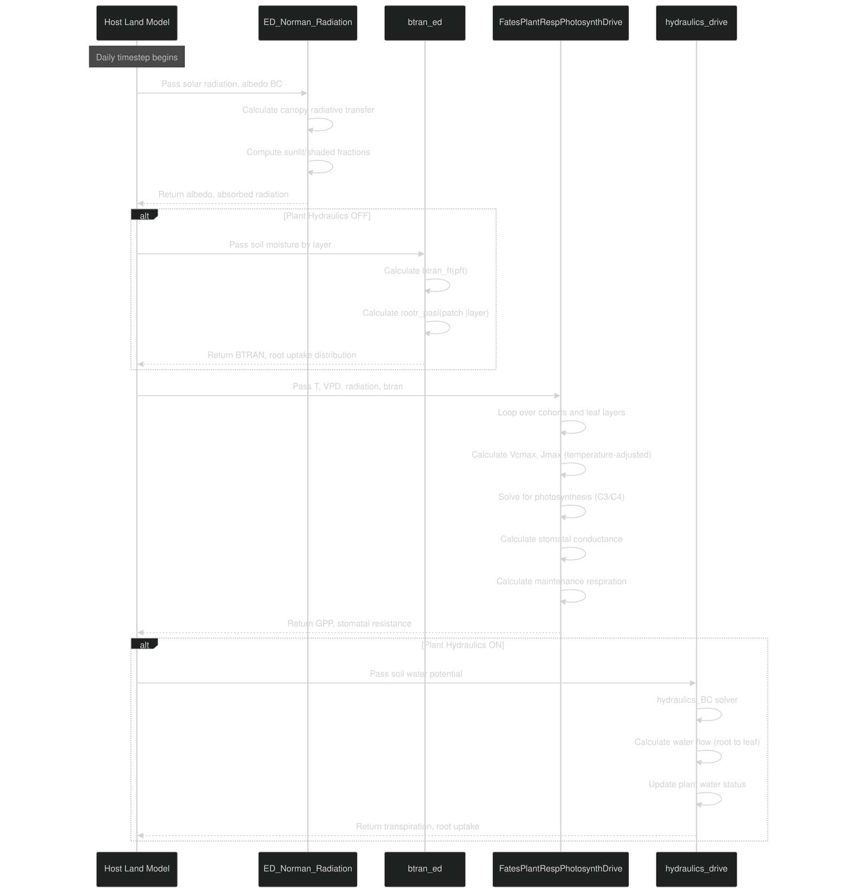
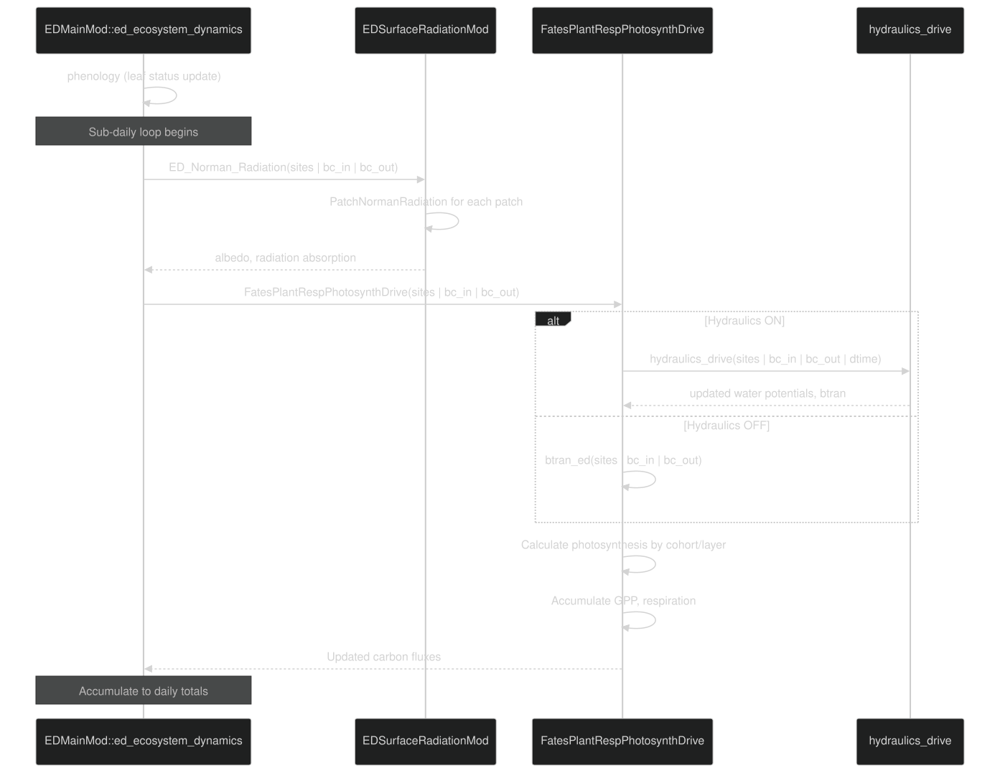

# Biophysical Processes

Relevant source files

- [biogeophys/EDBtranMod.F90](https://github.com/jingtao-lbl/fates/blob/e85d9977/biogeophys/EDBtranMod.F90)
- [biogeophys/EDSurfaceAlbedoMod.F90](https://github.com/jingtao-lbl/fates/blob/e85d9977/biogeophys/EDSurfaceAlbedoMod.F90)
- [biogeophys/FatesHydroWTFMod.F90](https://github.com/jingtao-lbl/fates/blob/e85d9977/biogeophys/FatesHydroWTFMod.F90)
- [biogeophys/FatesPlantHydraulicsMod.F90](https://github.com/jingtao-lbl/fates/blob/e85d9977/biogeophys/FatesPlantHydraulicsMod.F90)
- [biogeophys/FatesPlantRespPhotosynthMod.F90](https://github.com/jingtao-lbl/fates/blob/e85d9977/biogeophys/FatesPlantRespPhotosynthMod.F90)
- [functional_unit_testing/hydro/HydroUTestDriver.py](https://github.com/jingtao-lbl/fates/blob/e85d9977/functional_unit_testing/hydro/HydroUTestDriver.py)
- [main/EDParamsMod.F90](https://github.com/jingtao-lbl/fates/blob/e85d9977/main/EDParamsMod.F90)
- [main/EDPftvarcon.F90](https://github.com/jingtao-lbl/fates/blob/e85d9977/main/EDPftvarcon.F90)
- [main/FatesHydraulicsMemMod.F90](https://github.com/jingtao-lbl/fates/blob/e85d9977/main/FatesHydraulicsMemMod.F90)
- [parameter_files/fates_params_default.cdl](https://github.com/jingtao-lbl/fates/blob/e85d9977/parameter_files/fates_params_default.cdl)

## Purpose and Scope

This page provides an overview of the biophysical processes in FATES that govern the physical exchange of energy, water, and CO2 between vegetation and the atmosphere. These processes form the foundation for calculating plant productivity, water stress, and energy balance.

The four primary biophysical processes covered are:

These processes are tightly coupled and execute during each model timestep to calculate carbon assimilation, water uptake, and vegetation-atmosphere fluxes. For information about how these biophysical calculations integrate with growth and allocation, see [Plant Growth and Physiology](plant-physiology/index.md) .

## Conceptual Overview

The biophysical processes in FATES operate on a sub-daily timestep and are organized hierarchically:

Sources:

- [biogeophys/FatesPlantRespPhotosynthMod.F90118-155](https://github.com/jingtao-lbl/fates/blob/e85d9977/biogeophys/FatesPlantRespPhotosynthMod.F90#L118-L155)
- [biogeophys/FatesPlantHydraulicsMod.F90282-308](https://github.com/jingtao-lbl/fates/blob/e85d9977/biogeophys/FatesPlantHydraulicsMod.F90#L282-L308)
- [biogeophys/EDSurfaceAlbedoMod.F9068-173](https://github.com/jingtao-lbl/fates/blob/e85d9977/biogeophys/EDSurfaceAlbedoMod.F90#L68-L173)
- [biogeophys/EDBtranMod.F9088-262](https://github.com/jingtao-lbl/fates/blob/e85d9977/biogeophys/EDBtranMod.F90#L88-L262)

## Process Execution Sequence

During each model timestep, biophysical processes are calculated in the following sequence:

Sources:

- [biogeophys/EDSurfaceAlbedoMod.F9068-173](https://github.com/jingtao-lbl/fates/blob/e85d9977/biogeophys/EDSurfaceAlbedoMod.F90#L68-L173)
- [biogeophys/EDBtranMod.F9088-262](https://github.com/jingtao-lbl/fates/blob/e85d9977/biogeophys/EDBtranMod.F90#L88-L262)
- [biogeophys/FatesPlantRespPhotosynthMod.F90118-155](https://github.com/jingtao-lbl/fates/blob/e85d9977/biogeophys/FatesPlantRespPhotosynthMod.F90#L118-L155)
- [biogeophys/FatesPlantHydraulicsMod.F90282-308](https://github.com/jingtao-lbl/fates/blob/e85d9977/biogeophys/FatesPlantHydraulicsMod.F90#L282-L308)

## Key Module Organization

The biophysical processes are implemented across several specialized modules:

| Module | Primary Functions | Key Variables Calculated | 
| --- | --- | --- |
| EDSurfaceAlbedoMod | Norman radiation scattering, albedo | albd_parb, albi_parb, fabd, fabi, f_sun | 
| FatesPlantRespPhotosynthMod | C3/C4 photosynthesis, stomatal conductance | gpp_acc_hold, rdark_acc_hold, rs_z | 
| FatesPlantHydraulicsMod | Soil-plant-atmosphere water transport | psi_ag, th_ag, btran (cohort-level) | 
| EDBtranMod | Simple soil moisture stress factor | btran_ft, rootr_pasl | 

Sources:

- [biogeophys/EDSurfaceAlbedoMod.F901-66](https://github.com/jingtao-lbl/fates/blob/e85d9977/biogeophys/EDSurfaceAlbedoMod.F90#L1-L66)
- [biogeophys/FatesPlantRespPhotosynthMod.F901-114](https://github.com/jingtao-lbl/fates/blob/e85d9977/biogeophys/FatesPlantRespPhotosynthMod.F90#L1-L114)
- [biogeophys/FatesPlantHydraulicsMod.F901-279](https://github.com/jingtao-lbl/fates/blob/e85d9977/biogeophys/FatesPlantHydraulicsMod.F90#L1-L279)
- [biogeophys/EDBtranMod.F901-37](https://github.com/jingtao-lbl/fates/blob/e85d9977/biogeophys/EDBtranMod.F90#L1-L37)

## Environmental Boundary Conditions

Biophysical processes require environmental inputs passed through the `bc_in_type` structure:

Key boundary condition arrays from [main/FatesInterfaceTypesMod.F90](https://github.com/jingtao-lbl/fates/blob/e85d9977/main/FatesInterfaceTypesMod.F90) :

- `bc_in(s)%solad_parb(ifp,ib)`- Direct beam radiation by patch and waveband
- `bc_in(s)%solai_parb(ifp,ib)`- Diffuse radiation by patch and waveband
- `bc_in(s)%smp_sl(j)`- Soil matric potential by layer [mm]
- `bc_in(s)%h2o_liqvol_sl(j)`- Volumetric soil moisture by layer [m³/m³]
- `bc_in(s)%t_veg_pa(ifp)`- Vegetation temperature [K]
- `bc_in(s)%eair_pa(ifp)`- Vapor pressure of air [Pa]

Sources:

- [main/FatesInterfaceTypesMod.F90](https://github.com/jingtao-lbl/fates/blob/e85d9977/main/FatesInterfaceTypesMod.F90)(boundary condition type definitions)

## Radiation Transfer Components

The Norman radiation model computes the absorption and scattering of solar radiation through the canopy:

The key optical properties come from PFT parameters:

| Parameter | Description | Units | 
| --- | --- | --- |
| rhol(ft,ib) | Leaf reflectance (vis, nir) | fraction | 
| rhos(ft,ib) | Stem reflectance (vis, nir) | fraction | 
| taul(ft,ib) | Leaf transmittance (vis, nir) | fraction | 
| taus(ft,ib) | Stem transmittance (vis, nir) | fraction | 
| xl(ft) | Leaf angle distribution | unitless | 
| clumping_index(ft) | Foliage clumping factor | 0-1 | 

Sources:

- [biogeophys/EDSurfaceAlbedoMod.F90178-205](https://github.com/jingtao-lbl/fates/blob/e85d9977/biogeophys/EDSurfaceAlbedoMod.F90#L178-L205)
- [biogeophys/EDSurfaceAlbedoMod.F90267-274](https://github.com/jingtao-lbl/fates/blob/e85d9977/biogeophys/EDSurfaceAlbedoMod.F90#L267-L274)
- [main/EDPftvarcon.F90138-141](https://github.com/jingtao-lbl/fates/blob/e85d9977/main/EDPftvarcon.F90#L138-L141)
- [parameter_files/fates_params_default.cdl479-508](https://github.com/jingtao-lbl/fates/blob/e85d9977/parameter_files/fates_params_default.cdl#L479-L508)

## Photosynthesis and Conductance Coupling

The photosynthesis module solves for carbon assimilation and stomatal conductance simultaneously:

Sources:

- [biogeophys/FatesPlantRespPhotosynthMod.F90400-706](https://github.com/jingtao-lbl/fates/blob/e85d9977/biogeophys/FatesPlantRespPhotosynthMod.F90#L400-L706)
- [biogeophys/FatesPlantRespPhotosynthMod.F901058-1449](https://github.com/jingtao-lbl/fates/blob/e85d9977/biogeophys/FatesPlantRespPhotosynthMod.F90#L1058-L1449)
- [main/EDPftvarcon.F90104-109](https://github.com/jingtao-lbl/fates/blob/e85d9977/main/EDPftvarcon.F90#L104-L109)
- [parameter_files/fates_params_default.cdl341-380](https://github.com/jingtao-lbl/fates/blob/e85d9977/parameter_files/fates_params_default.cdl#L341-L380)

## Water Transport Pathways

FATES supports two modes for water stress and transport:

### Non-Hydraulic Mode (BTRAN)

The stress factor calculation uses PFT-specific parameters:

- `smpso(ft)`- Soil matric potential at full stomatal opening [mm]
- `smpsc(ft)`- Soil matric potential at full stomatal closure [mm]

Sources:

- [biogeophys/EDBtranMod.F9088-262](https://github.com/jingtao-lbl/fates/blob/e85d9977/biogeophys/EDBtranMod.F90#L88-L262)
- [biogeophys/EDBtranMod.F90148-186](https://github.com/jingtao-lbl/fates/blob/e85d9977/biogeophys/EDBtranMod.F90#L148-L186)
- [main/EDPftvarcon.F9075-78](https://github.com/jingtao-lbl/fates/blob/e85d9977/main/EDPftvarcon.F90#L75-L78)
- [parameter_files/fates_params_default.cdl437-442](https://github.com/jingtao-lbl/fates/blob/e85d9977/parameter_files/fates_params_default.cdl#L437-L442)

### Hydraulic Mode (Plant Hydraulics)

When `hlm_use_planthydro = .true.` , FATES uses a mechanistic hydraulics model:

The hydraulic solver options ( `hydr_solver` parameter):

- `1`= Taylor 1D solver (sequential layer-by-layer)
- `2`= Picard 2D solver (simultaneous plant-soil)
- `3`= Newton-Raphson 2D solver (deprecated)

Sources:

- [biogeophys/FatesPlantHydraulicsMod.F90282-308](https://github.com/jingtao-lbl/fates/blob/e85d9977/biogeophys/FatesPlantHydraulicsMod.F90#L282-L308)
- [biogeophys/FatesPlantHydraulicsMod.F90953-1556](https://github.com/jingtao-lbl/fates/blob/e85d9977/biogeophys/FatesPlantHydraulicsMod.F90#L953-L1556)
- [main/FatesHydraulicsMemMod.F9016-19](https://github.com/jingtao-lbl/fates/blob/e85d9977/main/FatesHydraulicsMemMod.F90#L16-L19)
- [main/EDParamsMod.F90203-225](https://github.com/jingtao-lbl/fates/blob/e85d9977/main/EDParamsMod.F90#L203-L225)

## Water Transfer Functions (WTFs)

The hydraulic model uses water transfer functions to relate pressure and conductance:

Each organ has its own WTF parameters defined in the parameter file:

| Organ | Key Parameters | Source Variable | 
| --- | --- | --- |
| Leaf | hydr_p50_node(1,ft), hydr_avuln_node(1,ft) | fates_hydro_p50_node, fates_hydro_avuln_node | 
| Stem | hydr_p50_node(2,ft), hydr_kmax_node(2,ft) | fates_hydro_p50_node, fates_hydro_kmax_node | 
| Transport Root | hydr_p50_node(3,ft) | fates_hydro_p50_node | 
| Absorbing Root | hydr_p50_node(4,ft) | fates_hydro_p50_node | 

Sources:

- [biogeophys/FatesHydroWTFMod.F901-244](https://github.com/jingtao-lbl/fates/blob/e85d9977/biogeophys/FatesHydroWTFMod.F90#L1-L244)
- [biogeophys/FatesPlantHydraulicsMod.F90194-216](https://github.com/jingtao-lbl/fates/blob/e85d9977/biogeophys/FatesPlantHydraulicsMod.F90#L194-L216)
- [parameter_files/fates_params_default.cdl284-340](https://github.com/jingtao-lbl/fates/blob/e85d9977/parameter_files/fates_params_default.cdl#L284-L340)
- [main/EDPftvarcon.F90239-269](https://github.com/jingtao-lbl/fates/blob/e85d9977/main/EDPftvarcon.F90#L239-L269)

## Key Data Structures

### Cohort-Level Biophysical State

The `fates_cohort_type` contains per-cohort biophysical state:

Sources:

- [main/FatesCohortMod.F90](https://github.com/jingtao-lbl/fates/blob/e85d9977/main/FatesCohortMod.F90)(cohort type definition)
- [main/FatesHydraulicsMemMod.F90201-290](https://github.com/jingtao-lbl/fates/blob/e85d9977/main/FatesHydraulicsMemMod.F90#L201-L290)

### Patch-Level Radiation State

The `fates_patch_type` stores radiation transfer results:

These arrays are dimensioned by:

- `nclmax`- Maximum canopy layers (typically 2)
- `maxpft`- Maximum PFTs (16)
- `nlevleaf`- Leaf layers per canopy layer (30)

Sources:

- [main/FatesPatchMod.F90](https://github.com/jingtao-lbl/fates/blob/e85d9977/main/FatesPatchMod.F90)(patch type definition)
- [main/EDParamsMod.F9098-101](https://github.com/jingtao-lbl/fates/blob/e85d9977/main/EDParamsMod.F90#L98-L101)

## Biophysical Parameter Examples

Key parameters controlling biophysical processes:

### Photosynthesis Parameters

| Parameter | Description | Units | Example Values | 
| --- | --- | --- | --- |
| fates_leaf_vcmax25top | Max carboxylation rate at 25°C (canopy top) | μmol CO₂/m²/s | 50-100 | 
| fates_leaf_jmaxha | Activation energy for Jmax | J/mol | 43540 | 
| fates_leaf_jmaxhd | Deactivation energy for Jmax | J/mol | 152040 | 
| fates_leaf_stomatal_slope_medlyn | Medlyn stomatal slope | kPa^0.5 | 2.0-6.0 | 
| fates_leaf_stomatal_intercept | Min stomatal conductance | μmol H₂O/m²/s | 5000-10000 | 

### Hydraulic Parameters

| Parameter | Description | Units | Example Values | 
| --- | --- | --- | --- |
| fates_hydro_p50_node | Water potential at 50% conductivity loss | MPa | -2.0 to -6.0 | 
| fates_hydro_avuln_node | Vulnerability curve shape | unitless | 2.0-4.0 | 
| fates_hydro_kmax_node | Max xylem conductivity | kg/MPa/m/s | organ-specific | 
| fates_hydro_epsil_node | Bulk elastic modulus | MPa | 8-12 | 

### Radiation Parameters

| Parameter | Description | Units | Example Values | 
| --- | --- | --- | --- |
| fates_rad_leaf_rhovis | Leaf reflectance (visible) | fraction | 0.07-0.10 | 
| fates_rad_leaf_rhonir | Leaf reflectance (NIR) | fraction | 0.35-0.45 | 
| fates_rad_leaf_tauvis | Leaf transmittance (visible) | fraction | 0.05-0.10 | 
| fates_rad_leaf_taunir | Leaf transmittance (NIR) | fraction | 0.25-0.35 | 
| fates_rad_leaf_xl | Leaf angle distribution | unitless | 0.01-0.25 | 

Sources:

- [parameter_files/fates_params_default.cdl341-380](https://github.com/jingtao-lbl/fates/blob/e85d9977/parameter_files/fates_params_default.cdl#L341-L380)
- [parameter_files/fates_params_default.cdl284-340](https://github.com/jingtao-lbl/fates/blob/e85d9977/parameter_files/fates_params_default.cdl#L284-L340)
- [parameter_files/fates_params_default.cdl479-508](https://github.com/jingtao-lbl/fates/blob/e85d9977/parameter_files/fates_params_default.cdl#L479-L508)

## Integration with Daily Dynamics

Biophysical processes are called from the main daily dynamics loop:

The sub-daily loop typically iterates over radiation timesteps (e.g., hourly), with photosynthesis and hydraulics solved at each sub-step.

Sources:

- [main/EDMainMod.F90](https://github.com/jingtao-lbl/fates/blob/e85d9977/main/EDMainMod.F90)(main dynamics orchestration)
- [biogeophys/FatesPlantRespPhotosynthMod.F90118-155](https://github.com/jingtao-lbl/fates/blob/e85d9977/biogeophys/FatesPlantRespPhotosynthMod.F90#L118-L155)

## Numerical Considerations

### Iterative Photosynthesis Solution

The photosynthesis calculation iterates to find consistent values of:

- `ci`Internal CO₂ concentration ( )
- `an`Net assimilation rate ( )
- `gs`Stomatal conductance ( )

The iteration terminates when changes are below tolerance or max iterations reached:

Sources:

- [biogeophys/FatesPlantRespPhotosynthMod.F901058-1449](https://github.com/jingtao-lbl/fates/blob/e85d9977/biogeophys/FatesPlantRespPhotosynthMod.F90#L1058-L1449)

### Hydraulic Solver Options

The hydraulic model offers three solver types (controlled by `hydr_solver` parameter):

Sources:

- [main/FatesHydraulicsMemMod.F9016-19](https://github.com/jingtao-lbl/fates/blob/e85d9977/main/FatesHydraulicsMemMod.F90#L16-L19)
- [biogeophys/FatesPlantHydraulicsMod.F90953-1556](https://github.com/jingtao-lbl/fates/blob/e85d9977/biogeophys/FatesPlantHydraulicsMod.F90#L953-L1556)

### Conservation Checks

Mass balance errors are tracked in:

- `si_hydr%errh2o_hyd`- Plant hydraulics water balance error [mm]
- `si_hydr%h2oveg_growturn_err`- Growth/turnover water error [kg/m²]
- `si_hydr%h2oveg_hydro_err`- Hydrodynamics water error [kg/m²]

Sources:

- [main/FatesHydraulicsMemMod.F90104-123](https://github.com/jingtao-lbl/fates/blob/e85d9977/main/FatesHydraulicsMemMod.F90#L104-L123)