# Photosynthesis and Respiration

Relevant source files

- [biogeophys/EDBtranMod.F90](https://github.com/jingtao-lbl/fates/blob/e85d9977/biogeophys/EDBtranMod.F90)
- [biogeophys/EDSurfaceAlbedoMod.F90](https://github.com/jingtao-lbl/fates/blob/e85d9977/biogeophys/EDSurfaceAlbedoMod.F90)
- [biogeophys/FatesPlantRespPhotosynthMod.F90](https://github.com/jingtao-lbl/fates/blob/e85d9977/biogeophys/FatesPlantRespPhotosynthMod.F90)
- [main/EDParamsMod.F90](https://github.com/jingtao-lbl/fates/blob/e85d9977/main/EDParamsMod.F90)
- [main/EDPftvarcon.F90](https://github.com/jingtao-lbl/fates/blob/e85d9977/main/EDPftvarcon.F90)
- [parameter_files/fates_params_default.cdl](https://github.com/jingtao-lbl/fates/blob/e85d9977/parameter_files/fates_params_default.cdl)

## Purpose and Scope

This page documents the photosynthesis and respiration calculations in FATES, including the biochemical models for carbon assimilation, stomatal conductance regulation, and maintenance respiration. These processes determine the carbon gain and respiratory carbon losses of individual cohorts.

For information about:

- [Radiation Transfer and Albedo](biophysics/radiation.md)Radiation transfer that provides PAR input to photosynthesis, see
- [Plant Hydraulics](biophysics/hydraulics/index.md)Plant hydraulics that constrains stomatal conductance, see
- [Transpiration and Soil Moisture Stress](biophysics/transpiration.md)Soil moisture stress calculations, see
- [PARTEH: Plant Allocation System](plant-physiology/parteh/index.md)Carbon allocation of assimilated carbon, see

## Overview of Photosynthesis and Respiration in FATES

FATES implements leaf-level photosynthesis and respiration calculations based on the Farquhar et al. (1980) biochemical model for C3 plants and the Collatz et al. (1992) model for C4 plants. These calculations are performed for each leaf layer within each cohort, accounting for:

- **Sunlit and shaded leaf fractions**based on canopy radiative transfer
- **Vertical nitrogen gradients**that reduce photosynthetic capacity with canopy depth
- **Temperature sensitivity**with optional acclimation
- **Water stress**through stomatal conductance regulation
- **CO2 limitation**through Rubisco carboxylation and RuBP regeneration

Maintenance respiration is calculated for leaves, stems (sapwood), and fine roots using either the Ryan (1991) or Atkin et al. (2017) temperature response functions.

Sources:  [biogeophys/FatesPlantRespPhotosynthMod.F90 1-20](https://github.com/jingtao-lbl/fates/blob/e85d9977/biogeophys/FatesPlantRespPhotosynthMod.F90#L1-L20)  [main/EDPftvarcon.F90 1-50](https://github.com/jingtao-lbl/fates/blob/e85d9977/main/EDPftvarcon.F90#L1-L50)

## Main Entry Point and Execution Flow

The primary entry point for photosynthesis and respiration calculations is `FatesPlantRespPhotosynthDrive` , which is called daily from the host land model interface. The execution follows this sequence:

Diagram: Photosynthesis and respiration calculation flow

The calculation proceeds in two major phases:

Sources:  [biogeophys/FatesPlantRespPhotosynthMod.F90 118-155](https://github.com/jingtao-lbl/fates/blob/e85d9977/biogeophys/FatesPlantRespPhotosynthMod.F90#L118-L155)  [biogeophys/FatesPlantRespPhotosynthMod.F90 400-600](https://github.com/jingtao-lbl/fates/blob/e85d9977/biogeophys/FatesPlantRespPhotosynthMod.F90#L400-L600)

## Photosynthesis Model

### C3 and C4 Pathways

FATES implements separate photosynthesis models for C3 and C4 plants, selected via the `fates_leaf_c3psn` parameter (1 = C3, 0 = C4). The photosynthetic pathway determines which biochemical limitation equations are used.

Diagram: C3 and C4 photosynthetic pathways

The co-limitation between Ac and Aj is calculated using a quadratic smooth minimum controlled by the empirical curvature parameters `theta_cj_c3` and `theta_cj_c4` .

Sources:  [biogeophys/FatesPlantRespPhotosynthMod.F90 99-100](https://github.com/jingtao-lbl/fates/blob/e85d9977/biogeophys/FatesPlantRespPhotosynthMod.F90#L99-L100)  [main/EDParamsMod.F90 86-89](https://github.com/jingtao-lbl/fates/blob/e85d9977/main/EDParamsMod.F90#L86-L89)  [parameter_files/fates_params_default.cdl 341-343](https://github.com/jingtao-lbl/fates/blob/e85d9977/parameter_files/fates_params_default.cdl#L341-L343)

### Biochemical Rate Calculations

The key photosynthetic rates (Vcmax, Jmax, Kp) are calculated in `LeafLayerBiophysicalRates` by applying temperature sensitivity functions to the base rates at 25°C:

| Rate | Description | Base Parameter | Temperature Function | 
| --- | --- | --- | --- |
| vcmax_z | Maximum carboxylation rate | vcmax25top × N-scaling | Arrhenius with deactivation | 
| jmax_z | Maximum electron transport rate | jmax25top × N-scaling | Arrhenius with deactivation | 
| kp_z | Initial slope of CO2 response (C4) | kp25top × N-scaling | Arrhenius | 

The temperature sensitivity is calculated using either:

- **Model 1 (non-acclimating)**`vcmaxha``vcmaxhd``vcmaxse``jmaxha``jmaxhd``jmaxse`: Standard Arrhenius with high-temperature deactivation using parameters , , , , ,
- **Model 2 (Kumarathunge et al. 2019)**: Acclimating model using 10-day and multi-year exponential moving averages of vegetation temperature

The model selection is controlled by `photo_tempsens_model` parameter.

Sources:  [biogeophys/FatesPlantRespPhotosynthMod.F90 570-584](https://github.com/jingtao-lbl/fates/blob/e85d9977/biogeophys/FatesPlantRespPhotosynthMod.F90#L570-L584)  [main/EDParamsMod.F90 47-50](https://github.com/jingtao-lbl/fates/blob/e85d9977/main/EDParamsMod.F90#L47-L50)  [parameter_files/fates_params_default.cdl 344-379](https://github.com/jingtao-lbl/fates/blob/e85d9977/parameter_files/fates_params_default.cdl#L344-L379)

### Nitrogen Scaling

Photosynthetic capacity decreases with canopy depth following an exponential nitrogen profile. The nitrogen scaling coefficient is:

where:

- `kn``vcmax25top``decay_coeff_kn`is the nitrogen decay coefficient derived from using
- `cumulative_LAI`is the cumulative leaf area index from the canopy top to the midpoint of the current leaf layer

This scaling is applied to the base rates:

Sources:  [biogeophys/FatesPlantRespPhotosynthMod.F90 492-500](https://github.com/jingtao-lbl/fates/blob/e85d9977/biogeophys/FatesPlantRespPhotosynthMod.F90#L492-L500)  [biogeophys/FatesPlantRespPhotosynthMod.F90 461-486](https://github.com/jingtao-lbl/fates/blob/e85d9977/biogeophys/FatesPlantRespPhotosynthMod.F90#L461-L486)

## Stomatal Conductance

### Model Selection

FATES supports two stomatal conductance models selected via the `fates_leaf_stomatal_model` parameter:

Diagram: Stomatal conductance model selection and coupling

Both models are coupled to photosynthesis through an iterative solution for the leaf internal CO2 concentration ( `ci` ). The iteration continues until the change in `ci` is less than 0.01 Pa.

Parameters:

- `fates_leaf_stomatal_intercept`: Minimum stomatal conductance (g0) [μmol H2O/m²/s]
- `fates_leaf_stomatal_slope_ballberry`: Ball-Berry slope parameter (m) [unitless]
- `fates_leaf_stomatal_slope_medlyn`: Medlyn slope parameter (g1) [kPa^0.5]

Sources:  [biogeophys/FatesPlantRespPhotosynthMod.F90 104-106](https://github.com/jingtao-lbl/fates/blob/e85d9977/biogeophys/FatesPlantRespPhotosynthMod.F90#L104-L106)  [main/EDParamsMod.F90 73](https://github.com/jingtao-lbl/fates/blob/e85d9977/main/EDParamsMod.F90#L73-L73)  [parameter_files/fates_params_default.cdl 359-367](https://github.com/jingtao-lbl/fates/blob/e85d9977/parameter_files/fates_params_default.cdl#L359-L367)

### Water Stress Effects

Water stress affects stomatal conductance through the soil moisture stress factor `btran_eff` , which is calculated differently depending on whether plant hydraulics is enabled:

Without hydraulics (simple BTRAN):

- `btran_eff = btran_ft`[EDBtranMod](biophysics/transpiration.md)(PFT-level soil moisture stress from )
- `stomatal_intercept_btran = stomatal_intercept × btran_ft`Stomatal intercept scaled:

With hydraulics :

- `btran_eff = co_hydr%btran`(cohort-specific hydraulic limitation)
- Stomatal conductance directly constrained by leaf water potential through vulnerability curve
- `stomatal_intercept_btran = stomatal_intercept × co_hydr%btran`

The effective stomatal conductance is bounded by:

Sources:  [biogeophys/FatesPlantRespPhotosynthMod.F90 450-490](https://github.com/jingtao-lbl/fates/blob/e85d9977/biogeophys/FatesPlantRespPhotosynthMod.F90#L450-L490)  [biogeophys/FatesPlantRespPhotosynthMod.F90 87](https://github.com/jingtao-lbl/fates/blob/e85d9977/biogeophys/FatesPlantRespPhotosynthMod.F90#L87-L87)

## Maintenance Respiration

### Leaf Maintenance Respiration

FATES implements two models for leaf maintenance respiration (dark respiration, Rd), selected via `fates_maintresp_leaf_model` :

Model 1: Ryan et al. (1991)

- `fates_maintresp_leaf_ryan1991_baserate`Base rate at 20°C: [gC/gN/s]
- `q10_mr`Temperature response: Q10 function with
- `Rd = baserate × lnc_top × nscaler × f(T)`Nitrogen-based scaling:

Model 2: Atkin et al. (2017)

- `fates_maintresp_leaf_atkin2017_baserate`Base rate at 25°C: [μmol CO2/m²/s]
- Temperature acclimation using 10-day exponential moving average
- Direct parameterization per unit leaf area

Diagram: Leaf maintenance respiration model selection

The calculation occurs in two wrapper functions:

- `LeafLayerMaintenanceRespiration_Ryan_1991`[biogeophys/FatesPlantRespPhotosynthMod.F902150-2200](https://github.com/jingtao-lbl/fates/blob/e85d9977/biogeophys/FatesPlantRespPhotosynthMod.F90#L2150-L2200)
- `LeafLayerMaintenanceRespiration_Atkin_etal_2017`[biogeophys/FatesPlantRespPhotosynthMod.F902200-2250](https://github.com/jingtao-lbl/fates/blob/e85d9977/biogeophys/FatesPlantRespPhotosynthMod.F90#L2200-L2250)

Sources:  [biogeophys/FatesPlantRespPhotosynthMod.F90 533-557](https://github.com/jingtao-lbl/fates/blob/e85d9977/biogeophys/FatesPlantRespPhotosynthMod.F90#L533-L557)  [main/EDParamsMod.F90 35-36](https://github.com/jingtao-lbl/fates/blob/e85d9977/main/EDParamsMod.F90#L35-L36)  [parameter_files/fates_params_default.cdl 380-385](https://github.com/jingtao-lbl/fates/blob/e85d9977/parameter_files/fates_params_default.cdl#L380-L385)

### Non-Leaf Maintenance Respiration

Non-leaf tissues (sapwood, coarse roots, fine roots) use maintenance respiration calculated with:

where:

- `baserate = fates_maintresp_nonleaf_baserate`[gC/gN/s] at 20°C
- `f(T) = q10_mr^((T-20)/10)`Temperature function: for live tissues
- `f(T) = q10_froz^((T-20)/10)`Temperature function: for frozen soil (fine roots only)
- `reduction_factor`: Throttling based on carbon storage status

Maintenance Respiration by Tissue Type
| Tissue | Biomass Pool | Nitrogen Content | Temperature | 
| --- | --- | --- | --- |
| Live stem (sapwood) | sapw_c_agw | sapw_n_agw | Air temperature | 
| Coarse roots (sapwood) | sapw_c_bgw | sapw_n_bgw | Soil temperature | 
| Fine roots | fnrt_c | fnrt_n | Soil temperature (weighted by root distribution) | 

Fine root respiration is calculated layer by layer using root fraction distribution and layer-specific soil temperatures.

Sources:  [biogeophys/FatesPlantRespPhotosynthMod.F90 850-1100](https://github.com/jingtao-lbl/fates/blob/e85d9977/biogeophys/FatesPlantRespPhotosynthMod.F90#L850-L1100)  [main/EDParamsMod.F90 61](https://github.com/jingtao-lbl/fates/blob/e85d9977/main/EDParamsMod.F90#L61-L61)  [main/EDParamsMod.F90 134-136](https://github.com/jingtao-lbl/fates/blob/e85d9977/main/EDParamsMod.F90#L134-L136)

### Carbon Storage Effects on Respiration

When carbon storage pools are depleted, maintenance respiration is reduced to prevent carbon starvation mortality. The reduction is controlled by:

where `frac = storage_c / storage_c_target`

The function shape is controlled by three PFT-specific parameters:

- `fates_maintresp_reduction_curvature`: Controls curve shape (0 = very curved, 1 = linear)
- `fates_maintresp_reduction_intercept`: Maximum throttling at zero storage (0 = none, 1 = complete)
- `fates_maintresp_reduction_upthresh`: Storage fraction above which no reduction occurs

Sources:  [biogeophys/FatesPlantRespPhotosynthMod.F90 413-424](https://github.com/jingtao-lbl/fates/blob/e85d9977/biogeophys/FatesPlantRespPhotosynthMod.F90#L413-L424)  [parameter_files/fates_params_default.cdl 386-394](https://github.com/jingtao-lbl/fates/blob/e85d9977/parameter_files/fates_params_default.cdl#L386-L394)

## Environmental Limitations

### Soil Moisture Stress (BTRAN)

When plant hydraulics is disabled, soil moisture stress is calculated through the BTRAN algorithm in `EDBtranMod` . For each PFT:

where for each soil layer `j` :

- `ψ_close = fates_nonhydro_smpsc`: Soil matric potential at full stomatal closure [mm]
- `ψ_open = fates_nonhydro_smpso`: Soil matric potential at full stomatal opening [mm]
- `θ_eff`: Effective (unfrozen) porosity
- `θ_sat`: Saturated water content
- `rootfr_j``j`: Root fraction in layer from allometric relationships

The per-PFT `btran_ft` values are weighted by cohort leaf area and conductance to produce patch-level diagnostics.

Sources:  [biogeophys/EDBtranMod.F90 88-262](https://github.com/jingtao-lbl/fates/blob/e85d9977/biogeophys/EDBtranMod.F90#L88-L262)  [parameter_files/fates_params_default.cdl 437-442](https://github.com/jingtao-lbl/fates/blob/e85d9977/parameter_files/fates_params_default.cdl#L437-L442)

### Hydraulic Limitations

When plant hydraulics is enabled ( `hlm_use_planthydro = itrue` ), soil moisture stress is calculated from cohort-specific hydraulic state:

Diagram: Hydraulic limitation pathway

The cohort-level `btran` is calculated from leaf water potential using a Weibull vulnerability curve:

Parameters:

- `fates_hydro_p50_gs`: Leaf water potential at 50% stomatal closure [MPa]
- `fates_hydro_avuln_gs`: Shape parameter for stomatal vulnerability curve

Sources:  [biogeophys/FatesPlantRespPhotosynthMod.F90 450-454](https://github.com/jingtao-lbl/fates/blob/e85d9977/biogeophys/FatesPlantRespPhotosynthMod.F90#L450-L454)  [biogeophys/FatesPlantRespPhotosynthMod.F90 469](https://github.com/jingtao-lbl/fates/blob/e85d9977/biogeophys/FatesPlantRespPhotosynthMod.F90#L469-L469)  [parameter_files/fates_params_default.cdl 284-304](https://github.com/jingtao-lbl/fates/blob/e85d9977/parameter_files/fates_params_default.cdl#L284-L304)

### Temperature Effects

Temperature affects photosynthesis through multiple pathways:

The Michaelis-Menten constants and CO2 compensation point are calculated once per patch and timestep in `GetCanopyGasParameters` using Bernacchi et al. (2001, 2003) parameterizations.

Sources:  [biogeophys/FatesPlantRespPhotosynthMod.F90 364-376](https://github.com/jingtao-lbl/fates/blob/e85d9977/biogeophys/FatesPlantRespPhotosynthMod.F90#L364-L376)  [biogeophys/FatesPlantRespPhotosynthMod.F90 2450-2550](https://github.com/jingtao-lbl/fates/blob/e85d9977/biogeophys/FatesPlantRespPhotosynthMod.F90#L2450-L2550)

## Canopy Integration

### Sunlit and Shaded Leaf Fractions

Photosynthesis is calculated separately for sunlit and shaded leaves within each leaf layer. The sunlit leaf fraction `f_sun(cl,ft,iv)` is calculated during radiation transfer based on direct beam extinction:

where `k_dir` is the direct beam extinction coefficient from the Norman radiation model (see [Radiation Transfer and Albedo](biophysics/radiation.md) ).

For each leaf layer:

- **Sunlit leaves**`ed_parsun_z`: Receive both direct and diffuse radiation ( )
- **Shaded leaves**`ed_parsha_z`: Receive only diffuse radiation ( )

The layer-averaged net assimilation is:

Sources:  [biogeophys/FatesPlantRespPhotosynthMod.F90 588-597](https://github.com/jingtao-lbl/fates/blob/e85d9977/biogeophys/FatesPlantRespPhotosynthMod.F90#L588-L597)  [biogeophys/EDSurfaceAlbedoMod.F90 486-536](https://github.com/jingtao-lbl/fates/blob/e85d9977/biogeophys/EDSurfaceAlbedoMod.F90#L486-L536)

### Vertical Profiles and Diagnostics

FATES tracks vertical profiles of key photosynthesis variables for diagnostic output:

Diagram: Data flow from patch-level profiles to cohort-level fluxes

The vertical structure allows FATES to:

- Resolve light gradients through the canopy
- Account for nitrogen dilution with depth
- Calculate realistic canopy-integrated fluxes
- Output vertical profiles for model evaluation

Sources:  [biogeophys/FatesPlantRespPhotosynthMod.F90 178-198](https://github.com/jingtao-lbl/fates/blob/e85d9977/biogeophys/FatesPlantRespPhotosynthMod.F90#L178-L198)  [biogeophys/FatesPlantRespPhotosynthMod.F90 800-1200](https://github.com/jingtao-lbl/fates/blob/e85d9977/biogeophys/FatesPlantRespPhotosynthMod.F90#L800-L1200)

## Key Parameters

The following table summarizes critical parameters for photosynthesis and respiration:

| Parameter | Units | Description | File Location | 
| --- | --- | --- | --- |
| fates_leaf_vcmax25top | μmol CO2/m²/s | Maximum carboxylation rate at 25°C, canopy top | fates_params_default.cdl:368-370 | 
| fates_leaf_jmaxha | J/mol | Activation energy for Jmax | fates_params_default.cdl:344-346 | 
| fates_leaf_jmaxhd | J/mol | Deactivation energy for Jmax | fates_params_default.cdl:347-349 | 
| fates_leaf_vcmaxha | J/mol | Activation energy for Vcmax | fates_params_default.cdl:371-373 | 
| fates_leaf_vcmaxhd | J/mol | Deactivation energy for Vcmax | fates_params_default.cdl:374-376 | 
| fates_leaf_stomatal_intercept | μmol H2O/m²/s | Minimum stomatal conductance | fates_params_default.cdl:359-361 | 
| fates_leaf_stomatal_slope_ballberry | unitless | Ball-Berry slope parameter | fates_params_default.cdl:362-364 | 
| fates_leaf_stomatal_slope_medlyn | kPa^0.5 | Medlyn slope parameter | fates_params_default.cdl:365-367 | 
| fates_maintresp_leaf_ryan1991_baserate | gC/gN/s | Leaf respiration base rate (Ryan) | fates_params_default.cdl:383-385 | 
| fates_maintresp_leaf_atkin2017_baserate | μmol CO2/m²/s | Leaf respiration base rate (Atkin) | fates_params_default.cdl:380-382 | 
| fates_maintresp_nonleaf_baserate | gC/gN/s | Non-leaf tissue respiration base rate | EDParamsMod.F90:61 | 
| fates_q10_mr | unitless | Q10 for maintenance respiration | EDParamsMod.F90:134 | 
| fates_leaf_c3psn | flag | Photosynthetic pathway (1=C3, 0=C4) | fates_params_default.cdl:341-343 | 
| fates_nonhydro_smpso | mm | Soil potential at stomatal opening | fates_params_default.cdl:440-442 | 
| fates_nonhydro_smpsc | mm | Soil potential at stomatal closure | fates_params_default.cdl:437-439 | 

Sources:  [parameter_files/fates_params_default.cdl 341-442](https://github.com/jingtao-lbl/fates/blob/e85d9977/parameter_files/fates_params_default.cdl#L341-L442)  [main/EDParamsMod.F90 61-136](https://github.com/jingtao-lbl/fates/blob/e85d9977/main/EDParamsMod.F90#L61-L136)

## Data Flow Through Photosynthesis Calculation

The following diagram shows the complete data flow from boundary conditions through photosynthesis to carbon balance:

Diagram: Complete data flow for photosynthesis and respiration

Sources:  [biogeophys/FatesPlantRespPhotosynthMod.F90 118-1200](https://github.com/jingtao-lbl/fates/blob/e85d9977/biogeophys/FatesPlantRespPhotosynthMod.F90#L118-L1200)