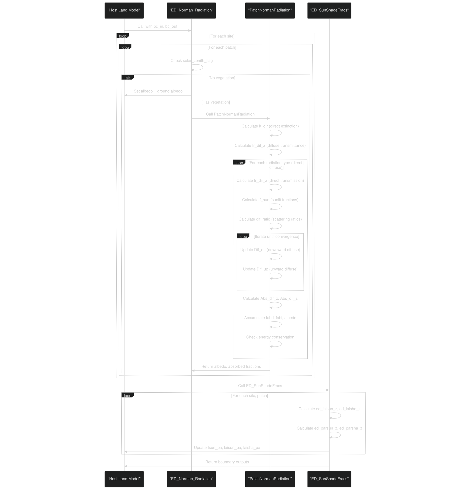

# Radiation Transfer and Albedo

Relevant source files

- [biogeochem/EDCanopyStructureMod.F90](https://github.com/jingtao-lbl/fates/blob/e85d9977/biogeochem/EDCanopyStructureMod.F90)
- [biogeophys/EDBtranMod.F90](https://github.com/jingtao-lbl/fates/blob/e85d9977/biogeophys/EDBtranMod.F90)
- [biogeophys/EDSurfaceAlbedoMod.F90](https://github.com/jingtao-lbl/fates/blob/e85d9977/biogeophys/EDSurfaceAlbedoMod.F90)

## Purpose and Scope

This page documents the radiation transfer and albedo calculations in FATES, which compute how solar radiation is absorbed, transmitted, and reflected through the multi-layered canopy. The model uses a Norman two-stream radiative transfer scheme to calculate sunlit and shaded leaf fractions, absorbed photosynthetically active radiation (PAR), and surface albedo for direct and diffuse radiation streams across multiple wavebands.

For information about the canopy structure and layering system that provides the spatial framework for these calculations, see [Canopy Structure and Competition](canopy-structure/index.md) . For details on how the computed radiation values are used in photosynthesis, see [Photosynthesis and Respiration](biophysics/photosynthesis.md) . For transpiration and water stress effects on photosynthesis, see [Transpiration and Soil Moisture Stress](biophysics/transpiration.md) .

## Overview

The FATES radiation transfer model operates on a hierarchical canopy structure with multiple canopy layers (e.g., canopy and understory), plant functional types (PFTs) within each layer, and vertical leaf layers within each PFT. The model:

- **direct beam****diffuse**Separates and radiation streams
- **wavebands**Handles multiple (visible and near-infrared)
- **sunlit and shaded leaf fractions**Computes for each layer
- **absorbed radiation**Calculates for leaves and soil
- **albedo**Computes for return to the host land model
- **energy conservation**Enforces with iterative solvers and error correction

The primary module is `EDSurfaceRadiationMod` , which contains the Norman radiation transfer implementation.

Sources: [biogeophys/EDSurfaceAlbedoMod.F90 1-66](https://github.com/jingtao-lbl/fates/blob/e85d9977/biogeophys/EDSurfaceAlbedoMod.F90#L1-L66)

## Main Code Architecture

### Module Structure

Diagram: Radiation Transfer Module Architecture

Sources: [biogeophys/EDSurfaceAlbedoMod.F90 1-66](https://github.com/jingtao-lbl/fates/blob/e85d9977/biogeophys/EDSurfaceAlbedoMod.F90#L1-L66)  [biogeophys/EDSurfaceAlbedoMod.F90 68-173](https://github.com/jingtao-lbl/fates/blob/e85d9977/biogeophys/EDSurfaceAlbedoMod.F90#L68-L173)  [biogeophys/EDSurfaceAlbedoMod.F90 178-1104](https://github.com/jingtao-lbl/fates/blob/e85d9977/biogeophys/EDSurfaceAlbedoMod.F90#L178-L1104)

### Key Functions

| Function | Location | Purpose | 
| --- | --- | --- |
| ED_Norman_Radiation | biogeophys/EDSurfaceAlbedoMod.F9068-173 | Main entry point; loops over sites and patches, calls per-patch calculations | 
| PatchNormanRadiation | biogeophys/EDSurfaceAlbedoMod.F90178-1104 | Implements Norman two-stream model for a single patch | 
| ED_SunShadeFracs | biogeophys/EDSurfaceAlbedoMod.F901108-1291 | Calculates sunlit/shaded LAI and absorbed PAR profiles | 

Sources: [biogeophys/EDSurfaceAlbedoMod.F90 44-46](https://github.com/jingtao-lbl/fates/blob/e85d9977/biogeophys/EDSurfaceAlbedoMod.F90#L44-L46)

## Radiation Streams and Wavebands

The radiation model distinguishes between radiation stream types and wavebands :

### Radiation Stream Types

| Stream Type | Index Constant | Description | 
| --- | --- | --- |
| Direct | idirect | Direct beam radiation from the sun | 
| Diffuse | idiffuse | Diffuse (scattered) radiation from the sky | 

Sources: [biogeophys/EDSurfaceAlbedoMod.F90 27-29](https://github.com/jingtao-lbl/fates/blob/e85d9977/biogeophys/EDSurfaceAlbedoMod.F90#L27-L29)

### Wavebands

| Waveband | Index Constant | Wavelength Range | Use | 
| --- | --- | --- | --- |
| Visible (PAR) | ivis or ipar | 400-700 nm | Photosynthesis | 
| Near-Infrared | inir | 700-2500 nm | Energy balance | 

The model processes all combinations: direct-visible, direct-NIR, diffuse-visible, diffuse-NIR.

Sources: [biogeophys/EDSurfaceAlbedoMod.F90 30-32](https://github.com/jingtao-lbl/fates/blob/e85d9977/biogeophys/EDSurfaceAlbedoMod.F90#L30-L32)  [biogeophys/EDSurfaceAlbedoMod.F90 262-263](https://github.com/jingtao-lbl/fates/blob/e85d9977/biogeophys/EDSurfaceAlbedoMod.F90#L262-L263)

## Norman Two-Stream Radiation Transfer

### Conceptual Model

The Norman model treats radiation transfer through a layered canopy as a one-dimensional problem with upward and downward radiation streams. For each layer, the model computes:

Diagram: Norman Two-Stream Radiation Flow Through Canopy Layers

Sources: [biogeophys/EDSurfaceAlbedoMod.F90 178-1104](https://github.com/jingtao-lbl/fates/blob/e85d9977/biogeophys/EDSurfaceAlbedoMod.F90#L178-L1104)

### Direct Beam Extinction Coefficient

The direct beam extinction coefficient `k_dir` determines how rapidly direct sunlight is attenuated by foliage:

Where:

- `G(θ)`**projection of unit leaf area**`xl`is the in the direction of the sun, computed from the leaf angle distribution parameter
- `clumping_index`accounts for non-random spatial distribution of foliage

The calculation uses the Ross-Goudriaan model:

Sources: [biogeophys/EDSurfaceAlbedoMod.F90 353-361](https://github.com/jingtao-lbl/fates/blob/e85d9977/biogeophys/EDSurfaceAlbedoMod.F90#L353-L361)

### Diffuse Transmittance

Diffuse transmittance `tr_dif_z` is computed by integrating direct beam extinction over 9 sky angles from 5° to 85° in 10° increments, weighted by `sin(angle)·cos(angle)` :

This approximates the hemispherical integration of sky radiance.

Sources: [biogeophys/EDSurfaceAlbedoMod.F90 404-421](https://github.com/jingtao-lbl/fates/blob/e85d9977/biogeophys/EDSurfaceAlbedoMod.F90#L404-L421)

### Sunlit and Shaded Leaf Fractions

The sunlit leaf fraction `f_sun(L,ft,iv)` for canopy layer `L` , PFT `ft` , vertical layer `iv` is computed as:

Where:

- `LAI_cumulative``iv`is the cumulative leaf area index from the top of the canopy to the center of layer
- `ftweight`is the canopy area profile weight for the layer

The shaded fraction is simply `1 - f_sun` .

Sources: [biogeophys/EDSurfaceAlbedoMod.F90 485-528](https://github.com/jingtao-lbl/fates/blob/e85d9977/biogeophys/EDSurfaceAlbedoMod.F90#L485-L528)

### Iterative Diffuse Flux Solution

Diffuse radiation fluxes are solved iteratively because upward and downward fluxes are coupled through multiple scattering. The iteration proceeds as follows:

Initialization Phase (lines 603-697):

Iteration Phase (lines 698-820):

Sources: [biogeophys/EDSurfaceAlbedoMod.F90 603-820](https://github.com/jingtao-lbl/fates/blob/e85d9977/biogeophys/EDSurfaceAlbedoMod.F90#L603-L820)

## Key Data Structures

### Patch-Level Radiation State Variables

The `fates_patch_type` structure maintains radiation state for each patch:

| Variable | Dimensions | Description | 
| --- | --- | --- |
| f_sun | (nclmax, maxpft, nlevleaf) | Sunlit leaf fraction by layer, PFT, vertical level | 
| fabd_sun_z | (nclmax, maxpft, nlevleaf) | Absorbed direct radiation, sunlit leaves | 
| fabd_sha_z | (nclmax, maxpft, nlevleaf) | Absorbed direct radiation, shaded leaves | 
| fabi_sun_z | (nclmax, maxpft, nlevleaf) | Absorbed diffuse radiation, sunlit leaves | 
| fabi_sha_z | (nclmax, maxpft, nlevleaf) | Absorbed diffuse radiation, shaded leaves | 
| fabd | (maxSWb) | Total absorbed direct radiation by waveband | 
| fabi | (maxSWb) | Total absorbed diffuse radiation by waveband | 
| solar_zenith_angle | scalar | Cosine of solar zenith angle | 
| solar_zenith_flag | logical | True if sun is above horizon | 
| gnd_alb_dir | (hlm_numSWb) | Ground albedo for direct radiation | 
| gnd_alb_dif | (hlm_numSWb) | Ground albedo for diffuse radiation | 
| fcansno | scalar | Fraction of canopy covered by snow | 

Sources: [biogeophys/EDSurfaceAlbedoMod.F90 106-125](https://github.com/jingtao-lbl/fates/blob/e85d9977/biogeophys/EDSurfaceAlbedoMod.F90#L106-L125)

### Optical Properties (PFT Parameters)

Leaf and stem optical properties are PFT-specific parameters:

| Parameter | Dimensions | Description | Typical Range | 
| --- | --- | --- | --- |
| rhol(ft,ib) | (numpft, maxSWb) | Leaf reflectance | 0.07-0.35 (vis), 0.35-0.58 (NIR) | 
| taul(ft,ib) | (numpft, maxSWb) | Leaf transmittance | 0.05-0.10 (vis), 0.10-0.25 (NIR) | 
| rhos(ft,ib) | (numpft, maxSWb) | Stem reflectance | 0.16-0.39 (vis), 0.39-0.58 (NIR) | 
| taus(ft,ib) | (numpft, maxSWb) | Stem transmittance | 0.001 (both bands) | 
| xl(ft) | (numpft) | Leaf angle distribution | -0.4 to 0.6 | 
| clumping_index(ft) | (numpft) | Foliage clumping factor | 0.75-0.85 | 

The absorption coefficient for a layer is computed as:

Sources: [biogeophys/EDSurfaceAlbedoMod.F90 268-273](https://github.com/jingtao-lbl/fates/blob/e85d9977/biogeophys/EDSurfaceAlbedoMod.F90#L268-L273)  [biogeophys/EDSurfaceAlbedoMod.F90 315-343](https://github.com/jingtao-lbl/fates/blob/e85d9977/biogeophys/EDSurfaceAlbedoMod.F90#L315-L343)

### Canopy Structure Inputs

The radiation model requires canopy structure information computed by `EDCanopyStructureMod` :

| Variable | Source Module | Description | 
| --- | --- | --- |
| elai_profile(L,ft,iv) | EDCanopyStructureMod | Exposed leaf area index profile | 
| esai_profile(L,ft,iv) | EDCanopyStructureMod | Exposed stem area index profile | 
| canopy_area_profile(L,ft,iv) | EDCanopyStructureMod | Crown area profile (for weighting) | 
| NCL_p | EDCanopyStructureMod | Number of canopy layers in patch | 
| nrad(L,ft) | EDCanopyStructureMod | Number of vertical radiation layers per canopy layer and PFT | 

Sources: [biogeophys/EDCanopyStructureMod.F90 53-60](https://github.com/jingtao-lbl/fates/blob/e85d9977/biogeophys/EDCanopyStructureMod.F90#L53-L60)  [biogeophys/EDSurfaceAlbedoMod.F90 311-379](https://github.com/jingtao-lbl/fates/blob/e85d9977/biogeophys/EDSurfaceAlbedoMod.F90#L311-L379)

## Calculation Sequence

Diagram: Radiation Transfer Calculation Sequence

Sources: [biogeophys/EDSurfaceAlbedoMod.F90 68-173](https://github.com/jingtao-lbl/fates/blob/e85d9977/biogeophys/EDSurfaceAlbedoMod.F90#L68-L173)  [biogeophys/EDSurfaceAlbedoMod.F90 178-1104](https://github.com/jingtao-lbl/fates/blob/e85d9977/biogeophys/EDSurfaceAlbedoMod.F90#L178-L1104)  [biogeophys/EDSurfaceAlbedoMod.F90 1108-1291](https://github.com/jingtao-lbl/fates/blob/e85d9977/biogeophys/EDSurfaceAlbedoMod.F90#L1108-L1291)

### Detailed Steps in PatchNormanRadiation

Sources: [biogeophys/EDSurfaceAlbedoMod.F90 178-1104](https://github.com/jingtao-lbl/fates/blob/e85d9977/biogeophys/EDSurfaceAlbedoMod.F90#L178-L1104)

## Boundary Outputs to Host Land Model

The radiation transfer module returns the following arrays to the host land model via `bc_out` :

| Variable | Dimensions | Description | 
| --- | --- | --- |
| albd_parb(ifp,ib) | (numpatch, numband) | Direct beam albedo by patch and waveband | 
| albi_parb(ifp,ib) | (numpatch, numband) | Diffuse albedo by patch and waveband | 
| fabd_parb(ifp,ib) | (numpatch, numband) | Fraction of direct radiation absorbed by vegetation | 
| fabi_parb(ifp,ib) | (numpatch, numband) | Fraction of diffuse radiation absorbed by vegetation | 
| ftdd_parb(ifp,ib) | (numpatch, numband) | Direct beam transmission to soil (direct→direct) | 
| ftid_parb(ifp,ib) | (numpatch, numband) | Direct beam→diffuse transmission to soil | 
| ftii_parb(ifp,ib) | (numpatch, numband) | Diffuse→diffuse transmission to soil | 
| fsun_pa(ifp) | (numpatch) | Canopy-integrated sunlit leaf fraction | 
| laisun_pa(ifp) | (numpatch) | Sunlit leaf area index | 
| laisha_pa(ifp) | (numpatch) | Shaded leaf area index | 

Sources: [biogeophys/EDSurfaceAlbedoMod.F90 128-134](https://github.com/jingtao-lbl/fates/blob/e85d9977/biogeophys/EDSurfaceAlbedoMod.F90#L128-L134)  [biogeophys/EDSurfaceAlbedoMod.F90 1151-1212](https://github.com/jingtao-lbl/fates/blob/e85d9977/biogeophys/EDSurfaceAlbedoMod.F90#L1151-L1212)

## Special Cases and Edge Conditions

### Canopy Snow

When snow accumulates on the canopy ( `fcansno > 0` ), the optical properties of leaves and stems are modified:

Where `rho_snow` and `tau_snow` are the reflectance and transmittance of snow (both ~0.8 for visible, ~0.55 for NIR).

Sources: [biogeophys/EDSurfaceAlbedoMod.F90 60-65](https://github.com/jingtao-lbl/fates/blob/e85d9977/biogeophys/EDSurfaceAlbedoMod.F90#L60-L65)  [biogeophys/EDSurfaceAlbedoMod.F90 330-334](https://github.com/jingtao-lbl/fates/blob/e85d9977/biogeophys/EDSurfaceAlbedoMod.F90#L330-L334)

### Gaps in Lower Canopy Layers

When the understory layer is incomplete (i.e., `sum(ftweight(L,:,1)) < 1` ), radiation can pass through the gaps directly to lower layers or the soil. The model accounts for this by:

Sources: [biogeophys/EDSurfaceAlbedoMod.F90 647-651](https://github.com/jingtao-lbl/fates/blob/e85d9977/biogeophys/EDSurfaceAlbedoMod.F90#L647-L651)  [biogeophys/EDSurfaceAlbedoMod.F90 687-695](https://github.com/jingtao-lbl/fates/blob/e85d9977/biogeophys/EDSurfaceAlbedoMod.F90#L687-L695)  [biogeophys/EDSurfaceAlbedoMod.F90 812-818](https://github.com/jingtao-lbl/fates/blob/e85d9977/biogeophys/EDSurfaceAlbedoMod.F90#L812-L818)

### Bare Ground or No Vegetation

If a patch has no leaf layers ( `maxval(nrad(1,:)) == 0` ), the radiation code skips the Norman calculations and sets:

- Absorbed radiation = 0
- Albedo = ground albedo
- Transmittance = 1.0

Sources: [biogeophys/EDSurfaceAlbedoMod.F90 136-150](https://github.com/jingtao-lbl/fates/blob/e85d9977/biogeophys/EDSurfaceAlbedoMod.F90#L136-L150)

### Nighttime or Low Sun Angle

When `solar_zenith_flag` is false (sun below horizon or at very low angle), the radiation calculations are skipped entirely. This is determined by the host land model and passed via `bc_in(s)%filter_vegzen_pa(ifp)` .

Sources: [biogeophys/EDSurfaceAlbedoMod.F90 120-126](https://github.com/jingtao-lbl/fates/blob/e85d9977/biogeophys/EDSurfaceAlbedoMod.F90#L120-L126)

## Energy Conservation

### Conservation Check

After calculating absorbed radiation, albedo, and transmittance, the model verifies energy conservation:

For direct radiation:

For diffuse radiation:

Sources: [biogeophys/EDSurfaceAlbedoMod.F90 1002-1008](https://github.com/jingtao-lbl/fates/blob/e85d9977/biogeophys/EDSurfaceAlbedoMod.F90#L1002-L1008)

### Error Tolerance and Correction

The model uses a multi-tiered approach to handle conservation errors:

The normalized radiation error (fraction of total radiation) is also tracked in `currentPatch%radiation_error` for diagnostic purposes.

Sources: [biogeophys/EDSurfaceAlbedoMod.F90 1032-1096](https://github.com/jingtao-lbl/fates/blob/e85d9977/biogeophys/EDSurfaceAlbedoMod.F90#L1032-L1096)  [biogeophys/EDSurfaceAlbedoMod.F90 1010-1016](https://github.com/jingtao-lbl/fates/blob/e85d9977/biogeophys/EDSurfaceAlbedoMod.F90#L1010-L1016)

### Iteration Convergence

The iterative solution for diffuse fluxes uses a tolerance of `1.e-9` (defined at line 247) and a maximum of 50 iterations (line 707). The iteration exits when:

for all layers.

Sources: [biogeophys/EDSurfaceAlbedoMod.F90 247](https://github.com/jingtao-lbl/fates/blob/e85d9977/biogeophys/EDSurfaceAlbedoMod.F90#L247-L247)  [biogeophys/EDSurfaceAlbedoMod.F90 703-820](https://github.com/jingtao-lbl/fates/blob/e85d9977/biogeophys/EDSurfaceAlbedoMod.F90#L703-L820)

## Relationship to Photosynthesis

The radiation transfer calculations provide critical inputs for photosynthesis:

Diagram: Radiation Transfer Outputs Used by Photosynthesis

The absorbed PAR values are calculated from the absorbed radiation fractions and incoming radiation:

Where:

- `solad_parb(ifp,ipar)``bc_in`is incoming direct PAR from
- `solai_parb(ifp,ipar)``bc_in`is incoming diffuse PAR from

Sources: [biogeophys/EDSurfaceAlbedoMod.F90 1235-1243](https://github.com/jingtao-lbl/fates/blob/e85d9977/biogeophys/EDSurfaceAlbedoMod.F90#L1235-L1243)

## Performance Considerations

### Computational Bottlenecks

The most computationally intensive parts of the radiation transfer calculation are:

### Numerical Stability

The model includes several numerical safeguards:

- **Minimum cosine of zenith angle**`cosz = max(0.001, solar_zenith_angle)`: prevents division by zero (line 353)
- **Scale factor calculations**for probabilistic demotion prevent cohort area from exceeding available area (lines 496-600 in canopy structure)
- **Conservation error correction**prevents energy balance drift (lines 1032-1096)

Sources: [biogeophys/EDSurfaceAlbedoMod.F90 353](https://github.com/jingtao-lbl/fates/blob/e85d9977/biogeophys/EDSurfaceAlbedoMod.F90#L353-L353)  [biogeophys/EDSurfaceAlbedoMod.F90 703-820](https://github.com/jingtao-lbl/fates/blob/e85d9977/biogeophys/EDSurfaceAlbedoMod.F90#L703-L820)

## Key Parameters and Tuning

### Optical Properties

Leaf reflectance and transmittance are the most sensitive parameters for radiation transfer. Typical values for different PFTs:

- **Broadleaf trees**`rhol_vis = 0.10``taul_vis = 0.05``rhol_nir = 0.45``taul_nir = 0.25`: , , ,
- **Needleleaf trees**`rhol_vis = 0.07``taul_vis = 0.05``rhol_nir = 0.35``taul_nir = 0.10`: , , ,
- **Grasses**`rhol_vis = 0.11``taul_vis = 0.05``rhol_nir = 0.58``taul_nir = 0.25`: , , ,

These are defined in the FATES parameter file and loaded via `EDPftvarcon_inst` .

Sources: [biogeophys/EDSurfaceAlbedoMod.F90 268-271](https://github.com/jingtao-lbl/fates/blob/e85d9977/biogeophys/EDSurfaceAlbedoMod.F90#L268-L271)

### Leaf Angle Distribution

The `xl` parameter controls the leaf angle distribution:

- `xl = 0`: Spherical leaf angle distribution
- `xl = 1`: Horizontal leaves
- `xl = -1`: Vertical leaves

Typical values range from -0.4 to 0.6, with most PFTs near 0 (spherical distribution).

Sources: [biogeophys/EDSurfaceAlbedoMod.F90 272](https://github.com/jingtao-lbl/fates/blob/e85d9977/biogeophys/EDSurfaceAlbedoMod.F90#L272-L272)  [biogeophys/EDSurfaceAlbedoMod.F90 355-358](https://github.com/jingtao-lbl/fates/blob/e85d9977/biogeophys/EDSurfaceAlbedoMod.F90#L355-L358)

### Clumping Index

The `clumping_index` parameter accounts for non-random foliage distribution. Values less than 1.0 indicate clumping:

- `clumping_index = 1.0`: Random (Poisson) distribution
- `clumping_index = 0.75-0.85`: Typical for trees with clustered foliage

Lower values reduce light extinction rates.

Sources: [biogeophys/EDSurfaceAlbedoMod.F90 273](https://github.com/jingtao-lbl/fates/blob/e85d9977/biogeophys/EDSurfaceAlbedoMod.F90#L273-L273)  [biogeophys/EDSurfaceAlbedoMod.F90 360](https://github.com/jingtao-lbl/fates/blob/e85d9977/biogeophys/EDSurfaceAlbedoMod.F90#L360-L360)