# 6.4 Transpiration and Soil Moisture Stress

Relevant source files

- [biogeophys/EDBtranMod.F90](https://github.com/jingtao-lbl/fates/blob/e85d9977/biogeophys/EDBtranMod.F90)
- [biogeophys/EDSurfaceAlbedoMod.F90](https://github.com/jingtao-lbl/fates/blob/e85d9977/biogeophys/EDSurfaceAlbedoMod.F90)
- [biogeophys/FatesHydroWTFMod.F90](https://github.com/jingtao-lbl/fates/blob/e85d9977/biogeophys/FatesHydroWTFMod.F90)
- [biogeophys/FatesPlantHydraulicsMod.F90](https://github.com/jingtao-lbl/fates/blob/e85d9977/biogeophys/FatesPlantHydraulicsMod.F90)
- [functional_unit_testing/hydro/HydroUTestDriver.py](https://github.com/jingtao-lbl/fates/blob/e85d9977/functional_unit_testing/hydro/HydroUTestDriver.py)
- [main/FatesHydraulicsMemMod.F90](https://github.com/jingtao-lbl/fates/blob/e85d9977/main/FatesHydraulicsMemMod.F90)

## Purpose and Scope

This page documents how FATES calculates soil moisture stress on transpiration and distributes root water uptake across soil layers. When plant hydraulics is disabled, FATES uses a simple empirical stress function (BTRAN) to limit photosynthesis based on soil water potential. When plant hydraulics is enabled (see [6.3 Plant Hydraulics](biophysics/hydraulics/index.md) ), a mechanistic water transport model replaces the empirical approach, though BTRAN is still calculated for diagnostic purposes.

This page focuses on:

- The BTRAN calculation algorithm and parameters
- Root uptake distribution across soil layers
- [6.2 Photosynthesis and Respiration](biophysics/photosynthesis.md)Integration with photosynthesis (covered in )
- The interface between simple and hydraulic stress calculations

For the detailed plant hydraulic architecture and water transport equations, see [6.3 Plant Hydraulics](biophysics/hydraulics/index.md) .

## BTRAN Stress Function Overview

The transpiration wetness factor (BTRAN) is a dimensionless scalar [0-1] that reduces stomatal conductance and photosynthesis when soil water becomes limiting. The calculation integrates soil water stress across all soil layers, weighted by the vertical distribution of fine roots.

Sources:  [biogeophys/EDBtranMod.F90 88-262](https://github.com/jingtao-lbl/fates/blob/e85d9977/biogeophys/EDBtranMod.F90#L88-L262)

## Implementation: EDBtranMod

The primary implementation is in module `EDBtranMod` , which provides three key functions:

| Function | Purpose | Returns | 
| --- | --- | --- |
| btran_ed | Main driver for BTRAN calculation | Updates bc_out%btran_pa, bc_out%rootr_pasl | 
| check_layer_water | Determines if soil layer has available liquid water | Logical (true if water available) | 
| get_active_suction_layers | Identifies which layers can provide water uptake | Updates bc_out%active_suction_sl | 

### Root Resistance Calculation

For each PFT and soil layer, root resistance is calculated as:

Where:

- `smp_node``smpsc`= soil matric potential in the layer [MPa], bounded by
- `smpsc`= matric potential at onset of stomatal closure (PFT parameter) [MPa]
- `smpso`= matric potential at complete stomatal closure (PFT parameter) [MPa]
- `eff_porosity`= unfrozen porosity in the layer [-]
- `watsat`= total porosity at saturation [-]

The `(eff_porosity / watsat)` term accounts for ice content reducing available water.

Sources:  [biogeophys/EDBtranMod.F90 160-174](https://github.com/jingtao-lbl/fates/blob/e85d9977/biogeophys/EDBtranMod.F90#L160-L174)

### Weighted Integration Across Layers

The PFT-level BTRAN is the sum of root resistances across all layers:

Root uptake distribution is then normalized:

This ensures `Σ rootr(j) = 1.0` and distributes total transpiration across layers based on both root density and water availability.

Sources:  [biogeophys/EDBtranMod.F90 165-185](https://github.com/jingtao-lbl/fates/blob/e85d9977/biogeophys/EDBtranMod.F90#L165-L185)

## Data Flow and Structure Integration

Sources:  [biogeophys/EDBtranMod.F90 88-262](https://github.com/jingtao-lbl/fates/blob/e85d9977/biogeophys/EDBtranMod.F90#L88-L262)  [main/EDTypesMod.F90](https://github.com/jingtao-lbl/fates/blob/e85d9977/main/EDTypesMod.F90#LNaN-LNaN)  [biogeophys/FatesInterfaceTypesMod.F90](https://github.com/jingtao-lbl/fates/blob/e85d9977/biogeophys/FatesInterfaceTypesMod.F90#LNaN-LNaN)

## Root Vertical Distribution

Root fraction profiles are calculated using the two-parameter exponential model from Zeng (2001):

Where `β = depth_scale_factor(roota, rootb, max_rooting_depth)` .

The parameters `roota` and `rootb` are PFT-specific and control the vertical distribution shape. This calculation is performed by `set_root_fraction` from `FatesAllometryMod` .

Sources:  [biogeophys/EDBtranMod.F90 149-150](https://github.com/jingtao-lbl/fates/blob/e85d9977/biogeophys/EDBtranMod.F90#L149-L150)  [biogeochem/FatesAllometryMod.F90](https://github.com/jingtao-lbl/fates/blob/e85d9977/biogeochem/FatesAllometryMod.F90#LNaN-LNaN)

## Integration with Plant Hydraulics

When plant hydraulics is enabled ( `hlm_use_planthydro == itrue` ), the mechanistic hydraulic model calculates water stress directly from xylem water potentials. However, BTRAN is still computed for diagnostic output to the host model:

The cohort-level hydraulic stress ( `ccohort%co_hydr%btran` ) is calculated from the leaf water potential in the hydraulics solver and represents the fractional loss of conductivity at the stomata. See [6.3 Plant Hydraulics](biophysics/hydraulics/index.md) for details on this calculation.

Sources:  [biogeophys/EDBtranMod.F90 224-258](https://github.com/jingtao-lbl/fates/blob/e85d9977/biogeophys/EDBtranMod.F90#L224-L258)  [biogeophys/FatesPlantHydraulicsMod.F90](https://github.com/jingtao-lbl/fates/blob/e85d9977/biogeophys/FatesPlantHydraulicsMod.F90#LNaN-LNaN)

## PFT Weighting for Patch-Level Output

The patch-level BTRAN output to the host model is computed as a weighted average across PFTs, where weights are the LAI-weighted stomatal conductances:

Similarly, the root uptake distribution `rootr_pasl(patch, layer)` is averaged across PFTs weighted by their conductances. This ensures that the spatial distribution of transpiration reflects both root architecture and canopy conductance.

Sources:  [biogeophys/EDBtranMod.F90 189-248](https://github.com/jingtao-lbl/fates/blob/e85d9977/biogeophys/EDBtranMod.F90#L189-L248)

## Layer Water Availability Check

The function `check_layer_water` determines if a soil layer can supply water:

This checks for:

Layers failing this check are excluded from root uptake calculations, with their `root_resis` set to zero.

Sources:  [biogeophys/EDBtranMod.F90 41-56](https://github.com/jingtao-lbl/fates/blob/e85d9977/biogeophys/EDBtranMod.F90#L41-L56)

## Key Parameters

The stress response curve is controlled by two PFT-specific parameters in `EDPftvarcon` :

| Parameter | Description | Typical Range | Units | 
| --- | --- | --- | --- |
| smpsc | Soil matric potential at which stomatal closure begins | -1.5 to -0.5 | MPa | 
| smpso | Soil matric potential at complete stomatal closure | -5.0 to -2.0 | MPa | 

The difference `(smpso - smpsc)` determines the steepness of the stress response. A larger difference creates a more gradual stress response, while a smaller difference creates an abrupt cutoff.

These parameters are read from the parameter file and stored in the `EDPftvarcon_inst` object.

Sources:  [biogeophys/EDBtranMod.F90 128-131](https://github.com/jingtao-lbl/fates/blob/e85d9977/biogeophys/EDBtranMod.F90#L128-L131)  [main/EDPftvarcon.F90](https://github.com/jingtao-lbl/fates/blob/e85d9977/main/EDPftvarcon.F90#LNaN-LNaN)

## Stress Response Curve

The relationship between soil matric potential and root resistance follows a piecewise linear function:

- `smp > smpsc``rresis = 1.0`For : no stress,
- `smpso < smp < smpsc``rresis = (smp - smpsc) / (smpso - smpsc)`For : linear decline,
- `smp < smpso``rresis = 0.0`For : complete stress,

The actual BTRAN value is the root-fraction-weighted sum of `rresis` values across all layers, so partial stress in deep layers with low root density has less impact than stress in shallow layers with high root density.

Sources:  [biogeophys/EDBtranMod.F90 160-174](https://github.com/jingtao-lbl/fates/blob/e85d9977/biogeophys/EDBtranMod.F90#L160-L174)

## Connection to Photosynthesis

The BTRAN value computed here is used in the photosynthesis calculations to limit stomatal conductance. In `FatesPlantRespPhotosynthMod` , the stomatal conductance is multiplied by BTRAN (when hydraulics is off) or by the hydraulic stress factor (when hydraulics is on). This reduces the diffusion of CO₂ into the leaf and therefore limits photosynthesis under water stress.

See [6.2 Photosynthesis and Respiration](biophysics/photosynthesis.md) for details on how BTRAN modulates stomatal conductance in the photosynthesis solver.

Sources:  [biogeophys/EDBtranMod.F90 88-262](https://github.com/jingtao-lbl/fates/blob/e85d9977/biogeophys/EDBtranMod.F90#L88-L262)  [biogeophys/FatesPlantRespPhotosynthMod.F90](https://github.com/jingtao-lbl/fates/blob/e85d9977/biogeophys/FatesPlantRespPhotosynthMod.F90#LNaN-LNaN)

## Diagnostic Output

The module outputs three key arrays through the `bc_out` boundary condition structure:

These outputs are used by the host land model (CLM/ELM) to:

- Diagnose water stress for output
- Distribute the total transpiration flux across soil layers for the soil hydrology calculations
- Identify frozen layers for diagnostics

Sources:  [biogeophys/EDBtranMod.F90 88-262](https://github.com/jingtao-lbl/fates/blob/e85d9977/biogeophys/EDBtranMod.F90#L88-L262)  [main/FatesInterfaceTypesMod.F90](https://github.com/jingtao-lbl/fates/blob/e85d9977/main/FatesInterfaceTypesMod.F90#LNaN-LNaN)

## Testing and Validation

Unit tests for the water transfer functions used in plant hydraulics are available in `functional_unit_testing/hydro/` . The driver `HydroUTestDriver.py` tests the water retention and conductivity functions that underpin both the simple BTRAN approach (through the `smpsc` / `smpso` parameterization) and the full hydraulic model.

Sources:  [functional_unit_testing/hydro/HydroUTestDriver.py 1-389](https://github.com/jingtao-lbl/fates/blob/e85d9977/functional_unit_testing/hydro/HydroUTestDriver.py#L1-L389)