# Canopy Structure and Competition

Relevant source files

- [biogeochem/EDCanopyStructureMod.F90](https://github.com/jingtao-lbl/fates/blob/e85d9977/biogeochem/EDCanopyStructureMod.F90)
- [biogeochem/EDCohortDynamicsMod.F90](https://github.com/jingtao-lbl/fates/blob/e85d9977/biogeochem/EDCohortDynamicsMod.F90)
- [biogeochem/EDPhysiologyMod.F90](https://github.com/jingtao-lbl/fates/blob/e85d9977/biogeochem/EDPhysiologyMod.F90)
- [biogeochem/FatesAllometryMod.F90](https://github.com/jingtao-lbl/fates/blob/e85d9977/biogeochem/FatesAllometryMod.F90)

## Purpose and Scope

This page describes how FATES organizes vegetation cohorts vertically into discrete canopy layers and manages competition for light among cohorts. The core mechanism is the Perfect Plasticity Approximation (PPA) , which assumes that plants can plastically arrange their crowns to fill available canopy space. This system determines which cohorts occupy the upper canopy (full light) versus the understory (reduced light), fundamentally shaping carbon gain, growth, and mortality patterns.

For information about the photosynthesis and radiation transfer calculations that use this canopy structure, see [Radiation Transfer and Albedo](biophysics/radiation.md) . For details on how canopy position affects carbon allocation and growth, see [PARTEH: Plant Allocation System](plant-physiology/parteh/index.md) .

## Overview of Canopy Layer System

FATES uses a discrete layer system where cohorts are assigned to one of several vertical canopy layers based on their height and the available canopy area:

- **Layer 1**: Upper canopy (overstorey) - receives direct sunlight
- **Layer 2**: Understorey - receives reduced light through the upper canopy
- **Layers 3+**`nclmax`: Deeper understorey layers (limited to parameter)

The key insight from the PPA is that when canopy area exceeds the patch area, some cohorts must be "demoted" to lower layers. Similarly, when upper layers have unfilled space (e.g., after disturbance), cohorts can be "promoted" from below.

Sources: [biogeochem/EDCanopyStructureMod.F90 90-115](https://github.com/jingtao-lbl/fates/blob/e85d9977/biogeochem/EDCanopyStructureMod.F90#L90-L115)

### Canopy Structure Workflow

Diagram: Canopy structure algorithm flow showing iterative balancing of canopy layers

Sources: [biogeochem/EDCanopyStructureMod.F90 90-332](https://github.com/jingtao-lbl/fates/blob/e85d9977/biogeochem/EDCanopyStructureMod.F90#L90-L332)

## Perfect Plasticity Approximation (PPA)

The PPA concept, originally from Purves et al. (2009) and extended in Fisher et al. (2010), assumes that plants have sufficient plasticity in canopy position, size, shape, and depth to perfectly fill available horizontal space. When total crown area exceeds patch area, the excess must exist in a lower layer.

### Key Concepts

| Concept | Description | Code Symbol | 
| --- | --- | --- |
| Z* | Height threshold separating canopy from understorey | currentPatch%zstar | 
| Competitive Exclusion | Controls whether demotion is stochastic or deterministic | ED_val_comp_excln | 
| Crown Area | Horizontal space occupied by a cohort's crown | currentCohort%c_area | 
| Site Spread | Crowdedness factor affecting crown expansion | currentSite%spread | 

The competitive exclusion parameter ( `ED_val_comp_excln` ) determines the mode of competition:

- **Negative values**: Strict PPA - deterministic rank-ordering by height
- **Zero or positive values**: Stochastic PPA - all cohorts have some probability of demotion, weighted by height

Sources: [biogeochem/EDCanopyStructureMod.F90 101-115](https://github.com/jingtao-lbl/fates/blob/e85d9977/biogeochem/EDCanopyStructureMod.F90#L101-L115)  [biogeochem/EDCanopyStructureMod.F90 313-326](https://github.com/jingtao-lbl/fates/blob/e85d9977/biogeochem/EDCanopyStructureMod.F90#L313-L326)

## Cohort Demotion

When a canopy layer contains more crown area than the patch area allows, excess cohorts must be moved to the layer below. The `DemoteFromLayer` subroutine handles this process.

### Demotion Algorithm

Diagram: Cohort demotion algorithm showing how excess canopy area is moved to lower layers

### Demotion Weight Calculation

The demotion weight determines how much of a cohort's crown area should be demoted. Two modes exist:

Stochastic Mode ( `ED_val_comp_excln >= 0` ):

This gives shorter cohorts higher probability of demotion, but even tall cohorts have some chance.

Deterministic Mode ( `ED_val_comp_excln < 0` ):

This demotes cohorts in strict height order, shortest first.

Sources: [biogeochem/EDCanopyStructureMod.F90 338-783](https://github.com/jingtao-lbl/fates/blob/e85d9977/biogeochem/EDCanopyStructureMod.F90#L338-L783)  [biogeochem/EDCanopyStructureMod.F90 400-485](https://github.com/jingtao-lbl/fates/blob/e85d9977/biogeochem/EDCanopyStructureMod.F90#L400-L485)

### Partial Cohort Demotion

When only part of a cohort's crown area needs to be demoted, FATES splits the cohort:

| Property | Original Cohort | Copy Cohort | 
| --- | --- | --- |
| Layer | i_lyr + 1 (demoted) | i_lyr (remains in upper) | 
| Number Density | n * (c_area - cc_loss) / c_area | n * cc_loss / c_area | 
| Crown Area | Reduced by cc_loss | cc_loss | 
| Other Properties | Copied from original | Copied from original | 

The splitting conserves total plant number and biomass while allowing partial demotion.

Sources: [biogeochem/EDCanopyStructureMod.F90 656-718](https://github.com/jingtao-lbl/fates/blob/e85d9977/biogeochem/EDCanopyStructureMod.F90#L656-L718)

## Cohort Promotion

When upper canopy layers have unfilled space (e.g., after fire, logging, or mortality), cohorts from lower layers can be promoted upward. The `PromoteIntoLayer` subroutine handles this process.

### Promotion Algorithm

The promotion algorithm mirrors demotion but operates in reverse:

The promotion weight calculation inverts the demotion logic - taller cohorts get higher promotion probability.

Sources: [biogeochem/EDCanopyStructureMod.F90 787-1236](https://github.com/jingtao-lbl/fates/blob/e85d9977/biogeochem/EDCanopyStructureMod.F90#L787-L1236)  [biogeochem/EDCanopyStructureMod.F90 888-967](https://github.com/jingtao-lbl/fates/blob/e85d9977/biogeochem/EDCanopyStructureMod.F90#L888-L967)

### Promotion vs Demotion Symmetry

Diagram: Symmetry between demotion and promotion probability calculations

Sources: [biogeochem/EDCanopyStructureMod.F90 894-895](https://github.com/jingtao-lbl/fates/blob/e85d9977/biogeochem/EDCanopyStructureMod.F90#L894-L895)  [biogeochem/EDCanopyStructureMod.F90 410-411](https://github.com/jingtao-lbl/fates/blob/e85d9977/biogeochem/EDCanopyStructureMod.F90#L410-L411)

## Crown Area Allometry

Crown area is the horizontal space occupied by a cohort's canopy and is fundamental to the PPA. It's calculated using allometric relationships with diameter.

### Crown Area Calculation

The `carea_allom` subroutine calculates crown area based on:

Where `carea_per_individual` comes from the `carea_2pwr` function:

Parameters:

- `d2ca_coeff`: Crown area coefficient (varies between min and max based on spread)
- `d2bl_p2`: Leaf biomass allometry exponent (reused for crown area)
- `d2bl_ediff`: Difference between crown area and leaf biomass exponents
- `site_spread`: Site-level crowdedness factor
- `dbh`: Diameter at breast height [cm]

The spread factor modulates crown expansion:

- `spread = 1.0`: Crowns fill space perfectly
- `spread < 1.0`: Crowns are more compact (crowded conditions)
- `spread > 1.0`: Crowns expand more (open conditions)

Sources: [biogeochem/FatesAllometryMod.F90 476-550](https://github.com/jingtao-lbl/fates/blob/e85d9977/biogeochem/FatesAllometryMod.F90#L476-L550)

### Crown Area and Damage

Crown damage (from fire, wind, etc.) reduces effective crown area through the `crown_reduction` factor:

This affects a cohort's ability to occupy canopy space and influences demotion/promotion dynamics.

Sources: [biogeochem/EDCanopyStructureMod.F90 336-339](https://github.com/jingtao-lbl/fates/blob/e85d9977/biogeochem/EDCanopyStructureMod.F90#L336-L339)

## LAI and SAI Profiles

Leaf Area Index (LAI) and Stem Area Index (SAI) quantify the amount of leaf and stem material per unit ground area. FATES calculates these at both the cohort level (tree-level) and aggregates them to patch/site levels.

### Tree-Level LAI Calculation

The `tree_lai` function computes LAI for an individual cohort:

Diagram: Tree-level LAI calculation showing exponential SLA profile and linear extension

Sources: [biogeochem/FatesAllometryMod.F90 636-761](https://github.com/jingtao-lbl/fates/blob/e85d9977/biogeochem/FatesAllometryMod.F90#L636-L761)

### SLA Profile with Depth

Specific Leaf Area (SLA) decreases exponentially with cumulative LAI from the top of the canopy:

Where:

- `slatop`: SLA at canopy top [m²/kgC]
- `kn``vcmax25top`: Nitrogen decay coefficient (function of )
- `cumulative_lai`: LAI from canopy top to current depth

However, SLA is constrained to not exceed `slamax` :

When SLA hits `sla_max` , the LAI calculation switches from exponential to linear:

| Phase | Condition | LAI Calculation | 
| --- | --- | --- |
| Exponential | leafc < leafc_slamax | Integrate exponential SLA profile | 
| Linear | leafc > leafc_slamax | Add (leafc - leafc_slamax) * sla_max | 

Sources: [biogeochem/FatesAllometryMod.F90 689-755](https://github.com/jingtao-lbl/fates/blob/e85d9977/biogeochem/FatesAllometryMod.F90#L689-L755)

### Tree-Level SAI Calculation

The `tree_sai` function calculates Stem Area Index as a scaled fraction of target LAI:

Where:

- `elongf_stem`: Stem elongation factor (phenology) [0-1]
- `allom_sai_scaler`: PFT-specific SAI:LAI ratio parameter
- `target_lai`: LAI assuming fully flushed leaves

Note that SAI uses target LAI (with `elongf_leaf = 1.0` ), making SAI independent of leaf phenology but responsive to stem phenology (typically for grasses).

Sources: [biogeochem/FatesAllometryMod.F90 765-827](https://github.com/jingtao-lbl/fates/blob/e85d9977/biogeochem/FatesAllometryMod.F90#L765-L827)  [biogeochem/FatesAllometryMod.F90 791-797](https://github.com/jingtao-lbl/fates/blob/e85d9977/biogeochem/FatesAllometryMod.F90#L791-L797)

## Canopy Layer Area Calculation

The `CanopyLayerArea` function sums crown area of all cohorts in a specific layer:

This area is compared against `patch%area` to determine if demotion or promotion is needed.

Sources: Implementation not shown in provided excerpts but called throughout [biogeochem/EDCanopyStructureMod.F90 258](https://github.com/jingtao-lbl/fates/blob/e85d9977/biogeochem/EDCanopyStructureMod.F90#L258-L258)  [biogeochem/EDCanopyStructureMod.F90 373](https://github.com/jingtao-lbl/fates/blob/e85d9977/biogeochem/EDCanopyStructureMod.F90#L373-L373)

## Data Flow: Cohort to Patch Aggregation

Diagram: Data flow from cohort-level properties through allometry to patch-level aggregated canopy metrics

Sources: [biogeochem/EDCanopyStructureMod.F90 258-263](https://github.com/jingtao-lbl/fates/blob/e85d9977/biogeochem/EDCanopyStructureMod.F90#L258-L263)

## Key Data Structures

### Cohort-Level Canopy Properties

| Property | Type | Units | Description | 
| --- | --- | --- | --- |
| canopy_layer | integer | - | Current canopy layer [1=canopy, 2+=understory] | 
| canopy_layer_yesterday | real(r8) | - | Previous day's canopy layer (weighted) | 
| c_area | real(r8) | m² | Crown area of entire cohort | 
| treelai | real(r8) | m²/m² | Cohort LAI per unit ground area | 
| treesai | real(r8) | m²/m² | Cohort SAI per unit ground area | 
| height | real(r8) | m | Plant height | 
| crowndamage | integer | - | Crown damage class [1=undamaged] | 
| excl_weight | real(r8) | m² | Calculated demotion weight | 
| prom_weight | real(r8) | m² | Calculated promotion weight | 

Sources: Defined in [main/FatesCohortMod.F90](https://github.com/jingtao-lbl/fates/blob/e85d9977/main/FatesCohortMod.F90) (not shown but referenced)

### Patch-Level Canopy Properties

| Property | Type | Units | Description | 
| --- | --- | --- | --- |
| NCL_p | integer | - | Number of occupied canopy layers | 
| canopy_layer_tlai | real(r8)(nclmax) | m²/m² | Total LAI in each canopy layer | 
| zstar | real(r8) | m | Height of shortest cohort in layer 1 (strict PPA) | 
| area | real(r8) | m² | Total patch area | 

Sources: Defined in [main/FatesPatchMod.F90](https://github.com/jingtao-lbl/fates/blob/e85d9977/main/FatesPatchMod.F90) (not shown but referenced)

### Site-Level Tracking

| Property | Type | Units | Description | 
| --- | --- | --- | --- |
| spread | real(r8) | - | Crown spread factor (crowdedness) | 
| demotion_rate | real(r8)(nlevsclass) | plants/day | Plants demoted by size class | 
| promotion_rate | real(r8)(nlevsclass) | plants/day | Plants promoted by size class | 
| demotion_carbonflux | real(r8) | kgC/day | Carbon flux from demotion | 
| promotion_carbonflux | real(r8) | kgC/day | Carbon flux from promotion | 

Sources: [biogeochem/EDCanopyStructureMod.F90 161-165](https://github.com/jingtao-lbl/fates/blob/e85d9977/biogeochem/EDCanopyStructureMod.F90#L161-L165) Defined in [main/EDTypesMod.F90](https://github.com/jingtao-lbl/fates/blob/e85d9977/main/EDTypesMod.F90)

## Area Conservation and Numerical Precision

The canopy structure algorithm includes multiple checks to ensure area conservation:

Diagram: Area conservation checks throughout the canopy structure algorithm

Tolerances:

- `area_target_precision = 1.0E-11`: Target for area balancing
- `area_check_precision = 1.0E-7`: Absolute tolerance for checks
- `area_check_rel_precision = 1.0E-4`: Relative tolerance for checks
- `max_patch_iterations = 10`: Maximum balancing iterations

Sources: [biogeochem/EDCanopyStructureMod.F90 70-77](https://github.com/jingtao-lbl/fates/blob/e85d9977/biogeochem/EDCanopyStructureMod.F90#L70-L77)  [biogeochem/EDCanopyStructureMod.F90 255-298](https://github.com/jingtao-lbl/fates/blob/e85d9977/biogeochem/EDCanopyStructureMod.F90#L255-L298)

## Integration with Other Systems

### Photosynthesis and Radiation

Canopy layer assignment directly affects light availability:

- **Layer 1 cohorts**: Receive full sunlight (direct + diffuse)
- **Layer 2+ cohorts**: Receive only transmitted light through upper layers

The Norman radiation transfer model uses `canopy_layer_tlai` to calculate light transmission.

See [Radiation Transfer and Albedo](biophysics/radiation.md) for details.

### Growth and Allocation

Canopy position affects carbon gain and drives allocation decisions:

- **Upper canopy**: High GPP → promotes diameter and height growth
- **Understory**: Low GPP → may trigger carbon starvation mortality

PARTEH allocation (see [PARTEH: Plant Allocation System](plant-physiology/parteh/index.md) ) responds to the net carbon balance which is strongly influenced by canopy layer.

### Mortality and Recruitment

Canopy structure influences:

- **Light-limitation mortality**: Understory cohorts with prolonged negative carbon balance
- **Recruitment success**: New recruits enter lower layers and must grow to reach canopy

See [Mortality Processes](plant-physiology/mortality.md) for mortality mechanisms.

Sources: Context from overall system understanding

## Parameter Controls

| Parameter | Module | Description | Typical Value | 
| --- | --- | --- | --- |
| ED_val_comp_excln | EDParamsMod | Competitive exclusion exponent | 0.0 to 1.0 | 
| nclmax | EDParamsMod | Maximum number of canopy layers | 2 | 
| allom_d2ca_coefficient_min | prt_params | Minimum crown area coefficient | PFT-specific | 
| allom_d2ca_coefficient_max | prt_params | Maximum crown area coefficient | PFT-specific | 
| allom_blca_expnt_diff | prt_params | Crown area exponent difference | PFT-specific | 
| allom_sai_scaler | prt_params | SAI to LAI ratio | PFT-specific | 
| slatop | prt_params | SLA at canopy top [m²/gC] | PFT-specific | 
| slamax | prt_params | Maximum SLA [m²/gC] | PFT-specific | 

Sources: [biogeochem/EDCanopyStructureMod.F90 130](https://github.com/jingtao-lbl/fates/blob/e85d9977/biogeochem/EDCanopyStructureMod.F90#L130-L130)  [biogeochem/FatesAllometryMod.F90](https://github.com/jingtao-lbl/fates/blob/e85d9977/biogeochem/FatesAllometryMod.F90)

## Computational Considerations

### Performance

The canopy structure routine is called once per day per site and involves:

- Nested loops over patches and cohorts
- Iterative balancing (typically 1-3 iterations)
- Potential cohort splitting (allocation/deallocation)

The algorithm complexity is O(n_cohorts² × n_iterations) in worst case.

### Numerical Stability

Several mechanisms ensure stability:

Sources: [biogeochem/EDCanopyStructureMod.F90 191-301](https://github.com/jingtao-lbl/fates/blob/e85d9977/biogeochem/EDCanopyStructureMod.F90#L191-L301)