# LAI and SAI Profiles

Relevant source files

- [biogeochem/EDCanopyStructureMod.F90](https://github.com/jingtao-lbl/fates/blob/e85d9977/biogeochem/EDCanopyStructureMod.F90)
- [biogeophys/EDBtranMod.F90](https://github.com/jingtao-lbl/fates/blob/e85d9977/biogeophys/EDBtranMod.F90)
- [biogeophys/EDSurfaceAlbedoMod.F90](https://github.com/jingtao-lbl/fates/blob/e85d9977/biogeophys/EDSurfaceAlbedoMod.F90)

## Purpose and Scope

LAI (Leaf Area Index) and SAI (Stem Area Index) profiles describe the vertical distribution of leaf and stem area within the canopy. These profiles are fundamental to FATES canopy structure representation, providing the spatial organization needed for accurate radiation transfer, photosynthesis, and water transport calculations. This page documents how FATES organizes, calculates, and uses these vertical profiles.

For information about how cohorts are assigned to canopy layers and the Perfect Plasticity Approximation, see [Canopy Layering and Perfect Plasticity](canopy-structure/ppa.md) . For details on radiation transfer through these profiles, see [Radiation Transfer and Albedo](biophysics/radiation.md) .

## Profile Data Structure

LAI and SAI profiles are stored as three-dimensional arrays indexed by canopy layer, plant functional type (PFT), and vertical position within the layer:

### Array Dimensions

| Dimension | Parameter | Description | 
| --- | --- | --- |
| Canopy Layer | nclmax | Maximum number of canopy layers (typically 2: canopy and understory) | 
| PFT | numpft | Number of plant functional types in the simulation | 
| Vertical Layer | nlevleaf | Number of vertical leaf layers within each canopy layer | 

### Key Profile Variables

The following profile arrays are stored in the `fates_patch_type` :

- **`elai_profile(L,ft,iv)`**- Effective leaf area index profile [m² leaf / m² ground]
- **`esai_profile(L,ft,iv)`**- Effective stem area index profile [m² stem / m² ground]
- **`canopy_area_profile(L,ft,iv)`**- Fraction of ground area occupied by this profile element [0-1]

Sources:  [biogeochem/EDCanopyStructureMod.F90 1-100](https://github.com/jingtao-lbl/fates/blob/e85d9977/biogeochem/EDCanopyStructureMod.F90#L1-L100)  [biogeophys/EDSurfaceAlbedoMod.F90 315-343](https://github.com/jingtao-lbl/fates/blob/e85d9977/biogeophys/EDSurfaceAlbedoMod.F90#L315-L343)

## Profile Organization Diagram

Sources:  [biogeophys/EDSurfaceAlbedoMod.F90 308-347](https://github.com/jingtao-lbl/fates/blob/e85d9977/biogeophys/EDSurfaceAlbedoMod.F90#L308-L347)  [biogeochem/EDCanopyStructureMod.F90 26](https://github.com/jingtao-lbl/fates/blob/e85d9977/biogeochem/EDCanopyStructureMod.F90#L26-L26)

## Profile Calculation and Update

LAI and SAI profiles are calculated from cohort-level properties and updated through several pathways:

### Calculation Functions

- **`UpdateCohortLAI`**- Updates individual cohort LAI from biomass using allometric relationships
- **`UpdatePatchLAI`**- Aggregates cohort LAI values into patch-level vertical profiles
- **`calc_areaindex`**- Integrates profiles to compute total patch LAI or SAI

### Cohort to Profile Workflow

Sources:  [biogeochem/EDCanopyStructureMod.F90 55-60](https://github.com/jingtao-lbl/fates/blob/e85d9977/biogeochem/EDCanopyStructureMod.F90#L55-L60)  [biogeophys/EDSurfaceAlbedoMod.F90 1209](https://github.com/jingtao-lbl/fates/blob/e85d9977/biogeophys/EDSurfaceAlbedoMod.F90#L1209-L1209)

## Vertical Discretization

Within each canopy layer and PFT column, the leaf and stem area is distributed across `nlevleaf` vertical layers. This discretization enables:

### Layer Properties

Each vertical layer `iv` contains:

| Property | Variable | Description | 
| --- | --- | --- |
| Leaf Area | elai_profile(L,ft,iv) | LAI in this layer [m²/m²] | 
| Stem Area | esai_profile(L,ft,iv) | SAI in this layer [m²/m²] | 
| Crown Coverage | canopy_area_profile(L,ft,iv) | Fraction of ground covered [0-1] | 

The vertical layers are numbered from top (iv=1) to bottom (iv=nlevleaf) within each canopy layer.

Sources:  [biogeophys/EDSurfaceAlbedoMod.F90 308-347](https://github.com/jingtao-lbl/fates/blob/e85d9977/biogeophys/EDSurfaceAlbedoMod.F90#L308-L347)  [biogeochem/EDCanopyStructureMod.F90 26](https://github.com/jingtao-lbl/fates/blob/e85d9977/biogeochem/EDCanopyStructureMod.F90#L26-L26)

## Leaf and Stem Area Fractions

When both leaves and stems are present in a layer, their relative contributions are calculated:

[biogeophys/EDSurfaceAlbedoMod.F90 315-323](https://github.com/jingtao-lbl/fates/blob/e85d9977/biogeophys/EDSurfaceAlbedoMod.F90#L315-L323)

These fractions weight the optical properties (reflectance, transmittance) for radiation calculations:

[biogeophys/EDSurfaceAlbedoMod.F90 327-328](https://github.com/jingtao-lbl/fates/blob/e85d9977/biogeophys/EDSurfaceAlbedoMod.F90#L327-L328)

Sources:  [biogeophys/EDSurfaceAlbedoMod.F90 315-342](https://github.com/jingtao-lbl/fates/blob/e85d9977/biogeophys/EDSurfaceAlbedoMod.F90#L315-L342)

## Snow Occlusion Effects

Snow on the canopy modifies the optical properties of LAI and SAI profiles. The fraction of canopy covered by snow ( `fcansno` ) blends vegetation optical properties with snow properties:

[biogeophys/EDSurfaceAlbedoMod.F90 331-334](https://github.com/jingtao-lbl/fates/blob/e85d9977/biogeophys/EDSurfaceAlbedoMod.F90#L331-L334)

Where:

- `rho_snow(ib)`- Snow reflectance by waveband (typically 0.80 for visible, 0.55 for NIR)
- `tau_snow(ib)`- Snow transmittance by waveband (typically 0.01 for both bands)
- `fcansno`- Fraction of canopy area covered by snow [0-1]

Sources:  [biogeophys/EDSurfaceAlbedoMod.F90 60-65](https://github.com/jingtao-lbl/fates/blob/e85d9977/biogeophys/EDSurfaceAlbedoMod.F90#L60-L65)  [biogeophys/EDSurfaceAlbedoMod.F90 331-334](https://github.com/jingtao-lbl/fates/blob/e85d9977/biogeophys/EDSurfaceAlbedoMod.F90#L331-L334)

## Sunlit and Shaded LAI Partitioning

LAI profiles are partitioned into sunlit and shaded fractions for photosynthesis calculations. This partitioning accounts for the fact that sunlit leaves receive both direct and diffuse radiation, while shaded leaves receive only diffuse radiation.

### Calculation

The sunlit fraction of each layer is determined by direct beam penetration:

[biogeophys/EDSurfaceAlbedoMod.F90 501-506](https://github.com/jingtao-lbl/fates/blob/e85d9977/biogeophys/EDSurfaceAlbedoMod.F90#L501-L506)

Where:

- `k_dir(ft)`- Direct beam extinction coefficient (function of leaf angle and solar zenith angle)
- `laisum`- Cumulative LAI from top of canopy to middle of current layer
- `f_sun(L,ft,iv)`- Fraction of LAI that is sunlit [0-1]

### Profile Storage

Sunlit and shaded LAI profiles are stored separately:

[biogeophys/EDSurfaceAlbedoMod.F90 1178-1185](https://github.com/jingtao-lbl/fates/blob/e85d9977/biogeophys/EDSurfaceAlbedoMod.F90#L1178-L1185)

Sources:  [biogeophys/EDSurfaceAlbedoMod.F90 485-527](https://github.com/jingtao-lbl/fates/blob/e85d9977/biogeophys/EDSurfaceAlbedoMod.F90#L485-L527)  [biogeophys/EDSurfaceAlbedoMod.F90 1178-1185](https://github.com/jingtao-lbl/fates/blob/e85d9977/biogeophys/EDSurfaceAlbedoMod.F90#L1178-L1185)

## Profile Usage in Model Processes

### Radiation Transfer

LAI and SAI profiles are the foundation for the Norman two-stream radiation model. Each vertical layer acts as a scattering element:

The radiation code iterates through each layer, calculating transmission, reflection, and absorption using the profile values [biogeophys/EDSurfaceAlbedoMod.F90 836-843](https://github.com/jingtao-lbl/fates/blob/e85d9977/biogeophys/EDSurfaceAlbedoMod.F90#L836-L843)

Sources:  [biogeophys/EDSurfaceAlbedoMod.F90 178-1104](https://github.com/jingtao-lbl/fates/blob/e85d9977/biogeophys/EDSurfaceAlbedoMod.F90#L178-L1104)  [biogeophys/EDSurfaceAlbedoMod.F90 308-347](https://github.com/jingtao-lbl/fates/blob/e85d9977/biogeophys/EDSurfaceAlbedoMod.F90#L308-L347)

### Transpiration and Water Uptake

While transpiration calculations do not directly use the vertical LAI profiles, they use the integrated patch-level LAI calculated from the profiles:

[biogeophys/EDSurfaceAlbedoMod.F90 1209](https://github.com/jingtao-lbl/fates/blob/e85d9977/biogeophys/EDSurfaceAlbedoMod.F90#L1209-L1209)

This total LAI is used with sunlit/shaded fractions to determine transpiration demand:

[biogeophys/EDSurfaceAlbedoMod.F90 1211-1212](https://github.com/jingtao-lbl/fates/blob/e85d9977/biogeophys/EDSurfaceAlbedoMod.F90#L1211-L1212)

Sources:  [biogeophys/EDSurfaceAlbedoMod.F90 1209-1213](https://github.com/jingtao-lbl/fates/blob/e85d9977/biogeophys/EDSurfaceAlbedoMod.F90#L1209-L1213)  [biogeophys/EDBtranMod.F90 88-262](https://github.com/jingtao-lbl/fates/blob/e85d9977/biogeophys/EDBtranMod.F90#L88-L262)

### Canopy Structure Diagnostics

LAI and SAI profiles provide diagnostic output variables:

| Variable | Description | Usage | 
| --- | --- | --- |
| elai_pa | Total effective LAI per patch | Host model boundary condition | 
| tlai_pa | Total LAI per patch | Host model boundary condition | 
| esai_pa | Total effective SAI per patch | Host model boundary condition | 
| tsai_pa | Total SAI per patch | Host model boundary condition | 
| laisun_pa | Sunlit LAI per patch | Photosynthesis, diagnostics | 
| laisha_pa | Shaded LAI per patch | Photosynthesis, diagnostics | 

These integrated values are calculated by summing over all profile elements, weighted by their canopy area coverage.

Sources:  [biogeophys/EDSurfaceAlbedoMod.F90 1196-1213](https://github.com/jingtao-lbl/fates/blob/e85d9977/biogeophys/EDSurfaceAlbedoMod.F90#L1196-L1213)  [biogeochem/EDCanopyStructureMod.F90 55](https://github.com/jingtao-lbl/fates/blob/e85d9977/biogeochem/EDCanopyStructureMod.F90#L55-L55)

## Profile Update Timing

LAI and SAI profiles are updated at different frequencies depending on the process:

The profiles must be recalculated whenever cohort properties change or cohorts are promoted/demoted between canopy layers.

Sources:  [biogeochem/EDCanopyStructureMod.F90 90-332](https://github.com/jingtao-lbl/fates/blob/e85d9977/biogeochem/EDCanopyStructureMod.F90#L90-L332)  [biogeophys/EDSurfaceAlbedoMod.F90 68-173](https://github.com/jingtao-lbl/fates/blob/e85d9977/biogeophys/EDSurfaceAlbedoMod.F90#L68-L173)