# Canopy Layering and Perfect Plasticity

Relevant source files

- [biogeochem/EDCanopyStructureMod.F90](https://github.com/jingtao-lbl/fates/blob/e85d9977/biogeochem/EDCanopyStructureMod.F90)
- [biogeochem/EDPatchDynamicsMod.F90](https://github.com/jingtao-lbl/fates/blob/e85d9977/biogeochem/EDPatchDynamicsMod.F90)
- [main/EDTypesMod.F90](https://github.com/jingtao-lbl/fates/blob/e85d9977/main/EDTypesMod.F90)

## Purpose and Scope

This page documents how FATES organizes individual plant cohorts into discrete canopy layers based on the Perfect Plasticity Approximation (PPA). The canopy layering system determines which cohorts compete for light in the upper canopy versus the understory, and dynamically adjusts layer membership through demotion and promotion algorithms. This system is central to how FATES represents vertical canopy structure and light competition.

For information about how leaf area is distributed within these canopy layers, see [LAI and SAI Profiles](canopy-structure/lai_sai.md) . For the actual radiation transfer calculations that use these layers, see [Radiation Transfer and Albedo](biophysics/radiation.md) .

## Perfect Plasticity Approximation

The Perfect Plasticity Approximation, originally from Purves et al. (2009), assumes that plants can perfectly adjust their canopy position, size, shape, and depth to fill available horizontal space. This leads to a key principle: the canopy fills completely in the horizontal direction before plants are relegated to lower layers .

In mathematical terms, if the total crown area of cohorts assigned to canopy layer $i$ exceeds the patch area, some cohorts must be demoted to layer $i+1$. The crown area calculation for each cohort determines how much horizontal space it occupies:

$$\text{Crown Area} = f(\text{DBH}, n, \text{spread}, \text{PFT}, \text{damage})$$

FATES extends the original PPA concept by introducing:

- **Stochastic competition**`ED_val_comp_excln`: Even tall cohorts have some probability of being forced to the understory (controlled by )
- **Dynamic crown spread**`spread`: Trees can adjust their crown allometry in response to canopy closure (the parameter)
- **Multiple canopy layers**`nclmax`: Support for up to layers (typically 2: canopy and understory)

Sources: [biogeochem/EDCanopyStructureMod.F90 1-115](https://github.com/jingtao-lbl/fates/blob/e85d9977/biogeochem/EDCanopyStructureMod.F90#L1-L115)

## Canopy Structure Algorithm Overview

The algorithm iterates until all canopy layers have areas that match the patch area within numerical tolerance. Multiple iterations may be needed because cohort fusion can slightly alter crown areas.

Key tolerance parameters:

- `area_target_precision = 1.0E-11`- Target precision for area balancing
- `area_check_precision = 1.0E-7`- Absolute tolerance for area checks
- `area_check_rel_precision = 1.0E-4`- Relative tolerance for area checks
- `max_patch_iterations = 10`- Maximum balancing iterations before error

Sources: [biogeochem/EDCanopyStructureMod.F90 90-332](https://github.com/jingtao-lbl/fates/blob/e85d9977/biogeochem/EDCanopyStructureMod.F90#L90-L332)

## Crown Area and Canopy Spread

Each cohort's crown area is calculated by the `carea_allom` function, which depends on:

- `dbh`Diameter at breast height ( )
- `n`Number density ( )
- `pft`Plant functional type ( )
- `crowndamage`Crown damage class ( )
- **Site-level spread parameter**`site%spread`( )

The spread parameter is a dynamic variable (range 0-1) that scales crown area between PFT-specific minimum and maximum allometric coefficients:

$$\text{spread} = \alpha \times \text{d2ca_coefficient_min} + (1-\alpha) \times \text{d2ca_coefficient_max}$$

where $\alpha$ is inversely related to canopy closure.

### Spread Dynamics

The `canopy_spread` subroutine adjusts the site-level spread parameter daily based on canopy closure:

Parameters:

- `ED_val_canopy_closure_thresh`- Threshold for canopy closure (default typically 0.8-0.9)
- `inc = 0.05`Daily increment:
- `AREA = 10000.0 m²`- Notional patch area

When canopy closure is approached, trees reduce their horizontal spread and become more columnar (lower spread value). When canopy is open, trees expand horizontally (higher spread value).

Sources: [biogeochem/EDCanopyStructureMod.F90 1233-1287](https://github.com/jingtao-lbl/fates/blob/e85d9977/biogeochem/EDCanopyStructureMod.F90#L1233-L1287)  [main/EDTypesMod.F90 422](https://github.com/jingtao-lbl/fates/blob/e85d9977/main/EDTypesMod.F90#L422-L422)

## Demotion Mechanism

When a canopy layer's total crown area exceeds the patch area, the `DemoteFromLayer` routine determines which cohorts (or portions of cohorts) are demoted to the layer below.

### Demotion Modes
Stochastic Demotion (`ED_val_comp_excln ≥ 0`)
Cohorts are assigned exclusion weights inversely proportional to their height:

$$w_i = \frac{1}{h_i^{\beta}}$$

where $h_i$ is cohort height and $\beta$ is `ED_val_comp_excln` . Higher $\beta$ values make height differences matter more.

The area demoted from each cohort is:

$$\text{demote_area}_i = c_area_i \times \frac{w_i}{\sum w_j} \times \text{total_excess_area}$$
Deterministic Demotion (`ED_val_comp_excln < 0`)
Cohorts are demoted in strict rank order from shortest to tallest. The shortest cohorts are fully demoted first until the excess area is eliminated. Cohorts of identical height are treated as a tied group and demoted proportionally.

### Demotion Process

Key cohort state changes during demotion:

- `currentCohort%canopy_layer`- Incremented by 1
- `currentCohort%n`- Reduced (if partial demotion)
- `copyc%n`- Created with demoted fraction (if split)
- `currentCohort%c_area`- Recalculated after density change

Site-level diagnostics updated:

- `site%demotion_rate(size_class)`- Number of individuals demoted
- `site%demotion_carbonflux`- Biomass of demoted cohorts

Sources: [biogeochem/EDCanopyStructureMod.F90 338-783](https://github.com/jingtao-lbl/fates/blob/e85d9977/biogeochem/EDCanopyStructureMod.F90#L338-L783)

## Promotion Mechanism

When a canopy layer's total crown area is less than the patch area (creating gaps), the `PromoteIntoLayer` routine promotes cohorts from the layer below to fill the space.

### Promotion Weighting

The promotion weights are the inverse of demotion weights:

Stochastic mode: $$w_i = h_i^{\beta}$$

Deterministic mode: Tallest cohorts in the lower layer are promoted first, with tied heights handled proportionally.

### Promotion Process

Key differences from demotion:

- `i_lyr+1``i_lyr`Cohorts from layer are selected for promotion into layer
- Taller cohorts have higher promotion probability (inverse of demotion)
- Promoted cohorts can access more light and resources

Sources: [biogeochem/EDCanopyStructureMod.F90 787-1229](https://github.com/jingtao-lbl/fates/blob/e85d9977/biogeochem/EDCanopyStructureMod.F90#L787-L1229)

## Layer Area Calculation

The `CanopyLayerArea` function computes the total crown area for a specific canopy layer by summing individual cohort crown areas:

This function is called repeatedly during demotion/promotion to verify that layer areas converge to the patch area within tolerance.

Sources: [biogeochem/EDCanopyStructureMod.F90 2090-2118](https://github.com/jingtao-lbl/fates/blob/e85d9977/biogeochem/EDCanopyStructureMod.F90#L2090-L2118)

## Cohort Splitting and Linked List Management

When partial demotion or promotion occurs, cohorts must be split. One portion remains in the original layer, and a copy is created for the destination layer.

### Cohort Split Procedure

| Step | Original Cohort | New Copy (copyc) | 
| --- | --- | --- |
| 1. Allocate | Existing | allocate(copyc) | 
| 2. Initialize PARTEH | Existing PRT object | InitPRTObject(copyc%prt) | 
| 3. Initialize hydraulics | Existing hydro | InitHydrCohort(site, copyc) | 
| 4. Copy properties | Source | currentCohort%Copy(copyc) | 
| 5. Split density | n *= (1 - fraction) | n *= fraction | 
| 6. Set layer | Demoted: i_lyr + 1 | Demoted: i_lyr | 
|  | Promoted: i_lyr + 1 | Promoted: i_lyr | 
| 7. Recalc area | carea_allom(...) | carea_allom(...) | 
| 8. Link insertion | Existing position | Inserted adjacent in height order | 

The linked list maintains height-ordered sorting: tallest → shortest. After splitting, the copy is inserted adjacent to the original cohort in the list.

### Linked List Update Pattern

Pointer updates for demotion:

Sources: [biogeochem/EDCanopyStructureMod.F90 665-717](https://github.com/jingtao-lbl/fates/blob/e85d9977/biogeochem/EDCanopyStructureMod.F90#L665-L717)  [biogeochem/EDCanopyStructureMod.F90 1136-1198](https://github.com/jingtao-lbl/fates/blob/e85d9977/biogeochem/EDCanopyStructureMod.F90#L1136-L1198)

## Key Data Structures

### Cohort-Level Variables

| Variable | Type | Purpose | 
| --- | --- | --- |
| canopy_layer | integer | Current layer assignment (1=canopy, 2=understory, etc.) | 
| canopy_layer_yesterday | real(r8) | Previous layer for tracking transitions | 
| c_area | real(r8) | Crown area footprint [m²] | 
| excl_weight | real(r8) | Temporary weight for demotion calculations | 
| prom_weight | real(r8) | Temporary weight for promotion calculations | 
| n | real(r8) | Number density [individuals/patch] | 
| dbh | real(r8) | Diameter at breast height [cm] | 
| height | real(r8) | Total tree height [m] | 
| pft | integer | Plant functional type index | 
| crowndamage | integer | Crown damage class | 

### Patch-Level Variables

| Variable | Type | Purpose | 
| --- | --- | --- |
| NCL_p | integer | Number of canopy layers currently occupied | 
| total_canopy_area | real(r8) | Sum of crown areas in canopy layer 1 [m²] | 
| total_tree_area | real(r8) | Sum of woody plant crown areas in layer 1 [m²] | 
| area | real(r8) | Total patch area [m²] (typically 10000 m²) | 
| zstar | real(r8) | Height of shortest cohort in canopy (strict PPA) | 
| canopy_layer_tlai(:) | real(r8) | Total LAI per canopy layer | 

### Site-Level Variables

| Variable | Type | Purpose | 
| --- | --- | --- |
| spread | real(r8) | Dynamic crown spread parameter [0-1] | 
| demotion_rate(:) | real(r8) | Number of individuals demoted per size class | 
| promotion_rate(:) | real(r8) | Number of individuals promoted per size class | 
| demotion_carbonflux | real(r8) | Total biomass of demoted cohorts [kgC/ha/day] | 
| promotion_carbonflux | real(r8) | Total biomass of promoted cohorts [kgC/ha/day] | 

Sources: [main/EDTypesMod.F90 1-507](https://github.com/jingtao-lbl/fates/blob/e85d9977/main/EDTypesMod.F90#L1-L507)  [biogeochem/FatesCohortMod.F90](https://github.com/jingtao-lbl/fates/blob/e85d9977/biogeochem/FatesCohortMod.F90)  [biogeochem/FatesPatchMod.F90](https://github.com/jingtao-lbl/fates/blob/e85d9977/biogeochem/FatesPatchMod.F90)

## Key Parameters

### Canopy Structure Parameters

| Parameter | Default | Description | 
| --- | --- | --- |
| nclmax | 2 | Maximum number of canopy layers allowed | 
| ED_val_comp_excln | Variable | Competition exclusion exponent (≥0: stochastic, <0: deterministic) | 
| ED_val_canopy_closure_thresh | 0.8 | Canopy closure threshold for spread adjustment | 

### Allometric Parameters (PFT-specific)

| Parameter | Description | 
| --- | --- |
| allom_d2ca_coefficient_min | Minimum diameter-to-crown-area coefficient | 
| allom_d2ca_coefficient_max | Maximum diameter-to-crown-area coefficient | 
| crown_depth_frac | Fraction of tree height occupied by crown | 

### Area Precision Parameters

| Parameter | Value | Description | 
| --- | --- | --- |
| area_target_precision | 1.0E-11 | Target precision for iterative area balancing | 
| area_check_precision | 1.0E-7 | Absolute tolerance for area conservation checks | 
| area_check_rel_precision | 1.0E-4 | Relative tolerance for area conservation | 
| similar_height_tol | 1.0E-3 | Height difference [m] for treating cohorts as tied | 

Sources: [main/EDParamsMod.F90](https://github.com/jingtao-lbl/fates/blob/e85d9977/main/EDParamsMod.F90)  [biogeochem/EDCanopyStructureMod.F90 70-81](https://github.com/jingtao-lbl/fates/blob/e85d9977/biogeochem/EDCanopyStructureMod.F90#L70-L81)

## Integration with Other Modules

Call sequence during daily dynamics:

Sources: [biogeochem/EDMainMod.F90](https://github.com/jingtao-lbl/fates/blob/e85d9977/biogeochem/EDMainMod.F90)  [biogeochem/EDCanopyStructureMod.F90 1-2265](https://github.com/jingtao-lbl/fates/blob/e85d9977/biogeochem/EDCanopyStructureMod.F90#L1-L2265)

## Special Cases and Edge Conditions

### No-Competition Mode

When `hlm_use_nocomp = .true.` , each patch represents a single PFT and the demotion/promotion logic is bypassed. Crown areas are still calculated but layering is predetermined.

### Satellite Phenology Mode

When `hlm_use_sp = .true.` , cohort crown areas are prescribed rather than dynamically calculated, and the canopy structure algorithm is simplified.

### Cohort Termination

Cohorts demoted below `nclmax` (maximum canopy layers) are terminated:

- `terminate_cohort()`Biomass transferred to litter pools via
- Cohort deallocated and removed from linked list
- Prevents excessive understory layer accumulation

### Tied Cohorts

When multiple cohorts have identical heights (within `similar_height_tol = 1mm` ), they are treated as a group for demotion/promotion to prevent arbitrary preferential treatment. Their combined crown area is used to calculate proportional splits.

### Area Conservation Checks

After each demotion/promotion phase, the algorithm verifies:

If checks fail after `max_patch_iterations` , the model terminates with detailed diagnostics.

Sources: [biogeochem/EDCanopyStructureMod.F90 194-301](https://github.com/jingtao-lbl/fates/blob/e85d9977/biogeochem/EDCanopyStructureMod.F90#L194-L301)  [biogeochem/EDCanopyStructureMod.F90 428-484](https://github.com/jingtao-lbl/fates/blob/e85d9977/biogeochem/EDCanopyStructureMod.F90#L428-L484)