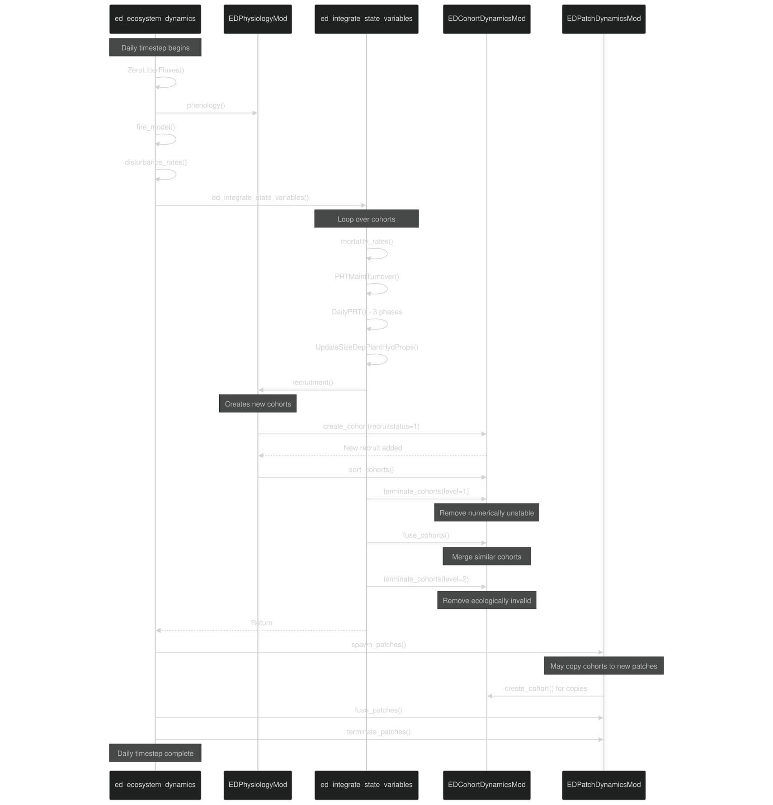

# Cohort Lifecycle Management

Relevant source files

- [biogeochem/EDCohortDynamicsMod.F90](https://github.com/jingtao-lbl/fates/blob/e85d9977/biogeochem/EDCohortDynamicsMod.F90)
- [biogeochem/EDPatchDynamicsMod.F90](https://github.com/jingtao-lbl/fates/blob/e85d9977/biogeochem/EDPatchDynamicsMod.F90)
- [biogeochem/EDPhysiologyMod.F90](https://github.com/jingtao-lbl/fates/blob/e85d9977/biogeochem/EDPhysiologyMod.F90)
- [biogeochem/FatesAllometryMod.F90](https://github.com/jingtao-lbl/fates/blob/e85d9977/biogeochem/FatesAllometryMod.F90)
- [main/EDTypesMod.F90](https://github.com/jingtao-lbl/fates/blob/e85d9977/main/EDTypesMod.F90)

## Purpose and Scope

This page documents the cohort lifecycle management system in FATES, covering how cohorts are created, recruited, fused, terminated, and organized within patches. Cohorts are the fundamental unit of vegetation organization in FATES, representing groups of similar-sized plants of the same PFT within a patch.

For information about patch-level dynamics and disturbances that create and destroy patches, see [Patch Dynamics and Disturbances](core-dynamics/patch_dynamics.md) . For details on the hierarchical data structures containing cohorts, see [Data Structures: Sites, Patches, and Cohorts](core-dynamics/data_structures.md) . For allocation and growth processes that change cohort biomass, see [PARTEH: Plant Allocation System](plant-physiology/parteh/index.md) .

## Cohort Lifecycle Overview

Cohorts undergo a complete lifecycle from creation through growth, potential fusion with similar cohorts, and eventual termination. The lifecycle involves several key processes orchestrated during the daily dynamics loop.

Diagram: Cohort Lifecycle State Machine

Sources: [biogeochem/EDCohortDynamicsMod.F90 160-289](https://github.com/jingtao-lbl/fates/blob/e85d9977/biogeochem/EDCohortDynamicsMod.F90#L160-L289)  [biogeochem/EDCohortDynamicsMod.F90 347-461](https://github.com/jingtao-lbl/fates/blob/e85d9977/biogeochem/EDCohortDynamicsMod.F90#L347-L461)  [biogeochem/EDCohortDynamicsMod.F90 694-1047](https://github.com/jingtao-lbl/fates/blob/e85d9977/biogeochem/EDCohortDynamicsMod.F90#L694-L1047)

## Cohort Data Structure and Organization

Cohorts are organized within patches using doubly-linked lists sorted by height. Each cohort points to its taller and shorter neighbors.

Diagram: Cohort Linked List Structure and Key Fields

Sources: [main/FatesCohortMod.F90 1-500](https://github.com/jingtao-lbl/fates/blob/e85d9977/main/FatesCohortMod.F90#L1-L500)  [main/FatesPatchMod.F90 1-500](https://github.com/jingtao-lbl/fates/blob/e85d9977/main/FatesPatchMod.F90#L1-L500)  [main/EDTypesMod.F90 1-100](https://github.com/jingtao-lbl/fates/blob/e85d9977/main/EDTypesMod.F90#L1-L100)

## Cohort Creation Mechanisms

Cohorts are created through four distinct pathways, each with different initialization requirements.

Table: Cohort Creation Pathways

| Pathway | Function | When Used | Initial Conditions | 
| --- | --- | --- | --- |
| Near-bare-ground | create_cohort() | Cold start simulation | Minimal seedlings, PFT parameters | 
| Inventory | create_cohort() | Inventory file read | Observed size, biomass from file | 
| Recruitment | create_cohort() via recruitment() | Daily dynamics | Minimum size, seed germination | 
| Restart | create_cohort() | Restart file read | Full state restoration | 

Sources: [biogeochem/EDCohortDynamicsMod.F90 160-175](https://github.com/jingtao-lbl/fates/blob/e85d9977/biogeochem/EDCohortDynamicsMod.F90#L160-L175)

Diagram: create_cohort() Process Flow

Sources: [biogeochem/EDCohortDynamicsMod.F90 160-289](https://github.com/jingtao-lbl/fates/blob/e85d9977/biogeochem/EDCohortDynamicsMod.F90#L160-L289)

## Recruitment Process

Recruitment creates new cohorts from germinated seeds. It is called during `ed_integrate_state_variables` in the daily dynamics loop.

Diagram: recruitment() Function Workflow

Sources: [biogeochem/EDPhysiologyMod.F90 1424-1778](https://github.com/jingtao-lbl/fates/blob/e85d9977/biogeochem/EDPhysiologyMod.F90#L1424-L1778)

### Recruitment Size and Biomass Initialization

New recruits start at minimum height and follow strict allometric relationships. The biomass pools are initialized according to the PARTEH mode.

Table: Recruit Initialization Parameters

| Property | Initialization Method | Key Functions | 
| --- | --- | --- |
| height | prt_params%hmode_min(ipft) | Direct from parameter | 
| dbh | Inverted from height | h2d_allom(h_min, ipft, dbh) | 
| bleaf | Allometry from dbh | bleaf(dbh, ipft, ...) | 
| bfineroot | Proportional to leaf | bfineroot(dbh, ipft, l2fr, ...) | 
| bsapwood | Allometry from dbh | bsap_allom(dbh, ipft, ...) | 
| bstore | Cushion fraction | bstore_allom(dbh, ipft, ...) | 
| n | From seed germination | Density dependence, hydraulics constraints | 

Sources: [biogeochem/EDPhysiologyMod.F90 1567-1690](https://github.com/jingtao-lbl/fates/blob/e85d9977/biogeochem/EDPhysiologyMod.F90#L1567-L1690)

## Cohort Fusion

Cohort fusion reduces the number of cohorts by merging similar individuals. This is necessary to keep computational costs manageable while maintaining ecological realism.

Diagram: fuse_cohorts() Decision Logic

Sources: [biogeochem/EDCohortDynamicsMod.F90 694-1074](https://github.com/jingtao-lbl/fates/blob/e85d9977/biogeochem/EDCohortDynamicsMod.F90#L694-L1074)

### Fusion Conservation Methods

FATES offers two methods for conserving properties during fusion. The choice affects how allometric consistency is maintained.

Table: Cohort Fusion Conservation Methods

| Method | Conserved Quantities | Adjusted Quantities | Use Case | 
| --- | --- | --- | --- |
| conserve_crownarea_and_number_not_dbh (1) | Total crown area, plant number | Recalculated dbh from crown area allometry | Default; maintains spatial coverage | 
| conserve_dbh_and_number_not_crownarea (2) | Average dbh, plant number | Recalculated crown area from dbh | Maintains size structure more strictly | 

Sources: [biogeochem/EDCohortDynamicsMod.F90 149-152](https://github.com/jingtao-lbl/fates/blob/e85d9977/biogeochem/EDCohortDynamicsMod.F90#L149-L152)  [biogeochem/EDCohortDynamicsMod.F90 888-990](https://github.com/jingtao-lbl/fates/blob/e85d9977/biogeochem/EDCohortDynamicsMod.F90#L888-L990)

### Fusion Tolerance Parameters

Fusion occurs when:

Sources: [biogeochem/EDCohortDynamicsMod.F90 701-705](https://github.com/jingtao-lbl/fates/blob/e85d9977/biogeochem/EDCohortDynamicsMod.F90#L701-L705)  [biogeochem/EDCohortDynamicsMod.F90 788-805](https://github.com/jingtao-lbl/fates/blob/e85d9977/biogeochem/EDCohortDynamicsMod.F90#L788-L805)

## Cohort Termination

Cohorts are terminated when they become too small or violate ecological constraints. Termination occurs in two levels to handle numerical stability issues and ecological constraints separately.

Table: Cohort Termination Criteria

| Level | Criterion | Threshold | Check Location | Reason | 
| --- | --- | --- | --- | --- |
| 1 | Number density (FPE prevention) | n < min_n_safemath (1.0E-12) | Before fusion | Prevent floating point errors | 
| 2 | Number density per m² | n/area <= min_npm2 (1.0E-7) | After fusion | Too sparse | 
| 2 | Absolute number | n <= min_nppatch (min_npm2 × min_patch_area) | After fusion | Too few individuals | 
| 2 | DBH with negative storage | dbh < 0.00001 AND store_c < 0 | After fusion | Unviable plant | 
| 2 | Canopy layer | canopy_layer > nclmax | After fusion | Too deep in canopy | 
| 2 | Live biomass depleted | sapw_c + leaf_c + fnrt_c < 1e-10 | After fusion | No live tissue | 
| 2 | Storage depleted | store_c < 1e-10 | After fusion | No reserves | 
| 2 | Total negative biomass | total_biomass < 0 | After fusion | Mass balance violation | 

Sources: [biogeochem/EDCohortDynamicsMod.F90 347-461](https://github.com/jingtao-lbl/fates/blob/e85d9977/biogeochem/EDCohortDynamicsMod.F90#L347-L461)

Diagram: terminate_cohorts() and terminate_cohort() Flow

Sources: [biogeochem/EDCohortDynamicsMod.F90 347-461](https://github.com/jingtao-lbl/fates/blob/e85d9977/biogeochem/EDCohortDynamicsMod.F90#L347-L461)  [biogeochem/EDCohortDynamicsMod.F90 464-556](https://github.com/jingtao-lbl/fates/blob/e85d9977/biogeochem/EDCohortDynamicsMod.F90#L464-L556)

### SendCohortToLitter Process

When a cohort terminates, all its biomass is transferred to patch-level litter pools. The distribution depends on PFT properties and root profiles.

Sources: [biogeochem/EDCohortDynamicsMod.F90 560-688](https://github.com/jingtao-lbl/fates/blob/e85d9977/biogeochem/EDCohortDynamicsMod.F90#L560-L688)

## Cohort Sorting and Organization

Cohorts must remain sorted by height to maintain the linked list invariant. Sorting occurs after recruitment and after changes that affect height ordering.

Diagram: sort_cohorts() Algorithm

Sources: [biogeochem/EDCohortDynamicsMod.F90 1280-1390](https://github.com/jingtao-lbl/fates/blob/e85d9977/biogeochem/EDCohortDynamicsMod.F90#L1280-L1390)

The sorting uses a general-purpose index sort (likely quicksort or similar) provided by `indexx()` . The algorithm preserves cohort objects while reordering the linked list pointers.

## Integration with Daily Dynamics

Cohort lifecycle functions are called at specific points in the daily dynamics loop to maintain consistency.

Diagram: Cohort Lifecycle in Daily Dynamics Context

Sources: [main/EDMainMod.F90 200-500](https://github.com/jingtao-lbl/fates/blob/e85d9977/main/EDMainMod.F90#L200-L500)  [biogeochem/EDPhysiologyMod.F90 1424-1778](https://github.com/jingtao-lbl/fates/blob/e85d9977/biogeochem/EDPhysiologyMod.F90#L1424-L1778)

### Call Sequence for Cohort Management

The order of operations is critical for maintaining mass balance and numerical stability:

This sequence ensures:

- New recruits are properly integrated before fusion
- Fusion occurs before patch dynamics (which may fragment cohorts)
- Termination at level 1 prevents numerical issues in fusion
- Termination at level 2 cleans up post-fusion artifacts

Sources: [main/EDMainMod.F90 200-800](https://github.com/jingtao-lbl/fates/blob/e85d9977/main/EDMainMod.F90#L200-L800)

## Key Module Functions Reference

Table: Primary Cohort Lifecycle Functions

| Function | Module | Purpose | Key Operations | 
| --- | --- | --- | --- |
| create_cohort() | EDCohortDynamicsMod | Allocate and initialize new cohort | Allocate memory, InitPRTObject, insert_cohort | 
| recruitment() | EDPhysiologyMod | Create new cohorts from seeds | Calculate n from germination, initialize biomass, create_cohort | 
| fuse_cohorts() | EDCohortDynamicsMod | Merge similar cohorts | Compare dbh/age, WeightedFusePRTVartypes, update dbh/c_area | 
| terminate_cohorts() | EDCohortDynamicsMod | Remove invalid cohorts | Check criteria, terminate_cohort for each | 
| terminate_cohort() | EDCohortDynamicsMod | Remove single cohort | Update diagnostics, SendCohortToLitter, unlink | 
| SendCohortToLitter() | EDCohortDynamicsMod | Transfer biomass to litter | Partition to litter pools by element/organ | 
| sort_cohorts() | EDCohortDynamicsMod | Reorder cohorts by height | Index sort, rebuild linked list | 
| insert_cohort() | EDCohortDynamicsMod | Insert cohort in sorted list | Find position, update pointers | 
| InitPRTObject() | EDCohortDynamicsMod | Allocate PARTEH object | Allocate by hypothesis type, InitPRTVartype | 

Sources: [biogeochem/EDCohortDynamicsMod.F90 1-1500](https://github.com/jingtao-lbl/fates/blob/e85d9977/biogeochem/EDCohortDynamicsMod.F90#L1-L1500)  [biogeochem/EDPhysiologyMod.F90 1-2000](https://github.com/jingtao-lbl/fates/blob/e85d9977/biogeochem/EDPhysiologyMod.F90#L1-L2000)