# Daily Dynamics Loop

Relevant source files

- [biogeochem/EDCohortDynamicsMod.F90](https://github.com/jingtao-lbl/fates/blob/e85d9977/biogeochem/EDCohortDynamicsMod.F90)
- [biogeochem/EDLoggingMortalityMod.F90](https://github.com/jingtao-lbl/fates/blob/e85d9977/biogeochem/EDLoggingMortalityMod.F90)
- [biogeochem/EDMortalityFunctionsMod.F90](https://github.com/jingtao-lbl/fates/blob/e85d9977/biogeochem/EDMortalityFunctionsMod.F90)
- [biogeochem/EDPhysiologyMod.F90](https://github.com/jingtao-lbl/fates/blob/e85d9977/biogeochem/EDPhysiologyMod.F90)
- [biogeochem/FatesAllometryMod.F90](https://github.com/jingtao-lbl/fates/blob/e85d9977/biogeochem/FatesAllometryMod.F90)
- [main/EDMainMod.F90](https://github.com/jingtao-lbl/fates/blob/e85d9977/main/EDMainMod.F90)

This page describes the daily timestep orchestration in FATES, including the main sequence of operations executed each day, mass balance verification, and the coordination between different physiological and ecological processes.

For information about individual processes called during this loop (e.g., phenology, recruitment, mortality), see their respective pages: [Phenology and Leaf Dynamics](plant-physiology/phenology.md) , [Recruitment](core-dynamics/cohort_lifecycle.md) , [Mortality Processes](plant-physiology/mortality.md) , [PARTEH Allocation](plant-physiology/parteh/index.md) , [Patch Dynamics](core-dynamics/patch_dynamics.md) . For the data structures traversed during the loop, see [Data Structures](core-dynamics/data_structures.md) .

## Overview and Entry Point

The daily dynamics loop is executed through the `ed_ecosystem_dynamics` subroutine in [main/EDMainMod.F90 141-317](https://github.com/jingtao-lbl/fates/blob/e85d9977/main/EDMainMod.F90#L141-L317) This routine is called once per day from the host land model and coordinates all vegetation dynamics processes, including growth, mortality, disturbance, and biogeochemistry.

The routine operates on a single site ( `ed_site_type` ) and exchanges information with the host model through boundary condition types ( `bc_in_type` for inputs, `bc_out_type` for outputs).

### Key Design Principles

## Main Dynamics Sequence

The following diagram shows the high-level sequence of operations within `ed_ecosystem_dynamics` :

Sources:  [main/EDMainMod.F90 141-317](https://github.com/jingtao-lbl/fates/blob/e85d9977/main/EDMainMod.F90#L141-L317)

## State Integration: The Core Growth Loop

The `ed_integrate_state_variables` subroutine [main/EDMainMod.F90 320-715](https://github.com/jingtao-lbl/fates/blob/e85d9977/main/EDMainMod.F90#L320-L715) contains the innermost loop where cohort-level state variables are updated. This is where plant growth, allocation, and mortality calculations occur.

### Patch and Cohort Loop Structure

Sources:  [main/EDMainMod.F90 320-715](https://github.com/jingtao-lbl/fates/blob/e85d9977/main/EDMainMod.F90#L320-L715)

### Cohort State Update Sequence

Within each cohort iteration, the following state updates occur:

| Step | Function/Operation | Purpose | Code Reference | 
| --- | --- | --- | --- |
| 1 | Mortality_Derivative() | Calculate mortality rates (background, hydraulic, carbon starvation, logging) | biogeochem/EDMortalityFunctionsMod.F90234-323 | 
| 2 | Store NPP/GPP/Resp | Save accumulated photosynthesis values for diagnostics and zero accumulators after | main/EDMainMod.F90517-526 | 
| 3 | PRTMaintTurnover() | Apply maintenance turnover to all organs | main/EDMainMod.F90535 | 
| 4 | AgeLeaves() | Advance leaf age classes | main/EDMainMod.F90543 | 
| 5 | EvaluateAndCorrectDBH() | Ensure DBH is consistent with structural biomass | main/EDMainMod.F90560 | 
| 6 | DailyPRT(phase=1) | Prioritized allocation (replacement, storage replenishment) | main/EDMainMod.F90582 | 
| 7 | DailyPRT(phase=2) | Non-stature allocation (updated targets after damage recovery) | main/EDMainMod.F90585 | 
| 8 | DamageRecovery() | Create recovered cohort if applicable | main/EDMainMod.F90595 | 
| 9 | DailyPRT(phase=3) | Stature growth using remaining carbon | main/EDMainMod.F90601 | 
| 10 | EffluxIntoLitterPools() | Transfer nutrient efflux to litter | main/EDMainMod.F90608 | 
| 11 | UpdateCohortBioPhysRates() | Recalculate vcmax, jmax based on leaf age distribution | main/EDMainMod.F90641 | 
| 12 | h_allom() | Update height from new DBH | main/EDMainMod.F90647 | 
| 13 | Calculate growth rates | Compute dhdt and ddbhdt | main/EDMainMod.F90649-650 | 
| 14 | UpdateSizeDepPlantHydProps() | Update hydraulic geometry (if enabled) | main/EDMainMod.F90663 | 
| 15 | Update cohort age | Increment coage and recalculate age class (if tracking) | main/EDMainMod.F90669-678 | 

Sources:  [main/EDMainMod.F90 458-682](https://github.com/jingtao-lbl/fates/blob/e85d9977/main/EDMainMod.F90#L458-L682)

## Mass Balance Verification

The `TotalBalanceCheck` subroutine is called at strategic points to verify carbon conservation. Each checkpoint has a numeric identifier:

### Balance Check Components

The mass balance verification tracks the following carbon pools and fluxes at the site level:

- **Standing stocks**: Vegetation (leaf, root, sapwood, structure, storage, reproductive), litter pools (CWD, fine litter), seed bank
- **Input fluxes**: GPP, external seed rain
- **Output fluxes**: Autotrophic respiration, fragmentation to soil, seed decay/germination
- **Lateral fluxes**: Root uptake (for CNP mode, includes N and P tracking)

Sources:  [main/EDMainMod.F90 196-315](https://github.com/jingtao-lbl/fates/blob/e85d9977/main/EDMainMod.F90#L196-L315) ChecksBalancesMod (referenced but not in provided files)

## Bypass Mode for Non-Dynamic Simulations

When operating in ST3 (static stand structure) mode, a simplified path is taken through `bypass_dynamics` that:

This allows FATES to be used for biophysical calculations only (radiation transfer, photosynthesis, hydrology) without vegetation dynamics.

Sources:  [main/EDMainMod.F90 210-237](https://github.com/jingtao-lbl/fates/blob/e85d9977/main/EDMainMod.F90#L210-L237)

## PARTEH Three-Phase Allocation

The daily allocation within `ed_integrate_state_variables` uses a three-phase approach to prioritize different allocation targets:

### Phase 1: Prioritized Allocation

- **Purpose**: Essential maintenance and deficit correction
- **Operations**: Replacement of turnover losses, replenishment of depleted storage
- **Executed**: Once per day for non-recovered cohorts only
- **Code**`prt%DailyPRT(phase=1)`[main/EDMainMod.F90582](https://github.com/jingtao-lbl/fates/blob/e85d9977/main/EDMainMod.F90#L582-L582):

### Phase 2: Non-Stature Allocation

- **Purpose**: Update allocation targets without growing
- **Operations**: Adjust leaf/root targets after damage recovery, maintain allometric ratios
- **Executed**: For all cohorts including newly recovered
- **Code**`prt%DailyPRT(phase=2)`[main/EDMainMod.F90585](https://github.com/jingtao-lbl/fates/blob/e85d9977/main/EDMainMod.F90#L585-L585):

### Phase 3: Stature Growth

- **Purpose**: Diameter and height growth using surplus carbon
- **Operations**: Integrate DBH forward, grow structural tissues
- **Executed**: After all non-growth allocation is complete
- **Code**`prt%DailyPRT(phase=3)`[main/EDMainMod.F90601](https://github.com/jingtao-lbl/fates/blob/e85d9977/main/EDMainMod.F90#L601-L601):

This phased approach ensures that:

For details on the allocation hypotheses themselves, see [PARTEH: Plant Allocation System](plant-physiology/parteh/index.md) .

Sources:  [main/EDMainMod.F90 566-601](https://github.com/jingtao-lbl/fates/blob/e85d9977/main/EDMainMod.F90#L566-L601)

## Litter Flux Coordination

Litter fluxes are generated from multiple sources during the daily loop and must be carefully coordinated:

### Pre-Disturbance Litter Fluxes

Before disturbance-inducing mortality is processed, non-disturbance litter fluxes are calculated:

### Disturbance-Related Litter Fluxes

Disturbance generates patch-to-patch litter transfers, handled separately:

Sources:  [biogeochem/EDPhysiologyMod.F90 202-591](https://github.com/jingtao-lbl/fates/blob/e85d9977/biogeochem/EDPhysiologyMod.F90#L202-L591)  [main/EDMainMod.F90 190-194](https://github.com/jingtao-lbl/fates/blob/e85d9977/main/EDMainMod.F90#L190-L194)

## Configuration Flags Affecting Dynamics

Several compile-time and runtime flags modify the daily dynamics sequence:

| Flag | Effect on Daily Loop | Default | Reference | 
| --- | --- | --- | --- |
| hlm_use_ed_st3 | Skip phenology, fire, disturbance; use bypass_dynamics | ifalse | main/EDMainMod.F90201-237 | 
| hlm_use_sp | Use satellite phenology instead of prognostic; skip fire and disturbance | ifalse | main/EDMainMod.F90202-207 | 
| hlm_use_ed_prescribed_phys | Use prescribed NPP instead of calculated; skip fire | ifalse | main/EDMainMod.F90489-503 | 
| hlm_use_planthydro | Enable hydraulic state updates | varies | main/EDMainMod.F90662-665 | 
| hlm_use_cohort_age_tracking | Track cohort age for age-dependent processes | varies | main/EDMainMod.F90668-678 | 
| hlm_use_tree_damage | Enable crown damage and recovery dynamics | varies | main/EDMainMod.F90587-599 | 

Sources:  [main/EDMainMod.F90 201-678](https://github.com/jingtao-lbl/fates/blob/e85d9977/main/EDMainMod.F90#L201-L678)

## Key Data Flow Summary

The daily dynamics loop orchestrates data flow through the model hierarchy:

This flow ensures that:

Sources:  [main/EDMainMod.F90 141-715](https://github.com/jingtao-lbl/fates/blob/e85d9977/main/EDMainMod.F90#L141-L715)