# Data Structures: Sites, Patches, and Cohorts

Relevant source files

- [biogeochem/EDPatchDynamicsMod.F90](https://github.com/jingtao-lbl/fates/blob/e85d9977/biogeochem/EDPatchDynamicsMod.F90)
- [main/EDInitMod.F90](https://github.com/jingtao-lbl/fates/blob/e85d9977/main/EDInitMod.F90)
- [main/EDTypesMod.F90](https://github.com/jingtao-lbl/fates/blob/e85d9977/main/EDTypesMod.F90)
- [main/FatesInventoryInitMod.F90](https://github.com/jingtao-lbl/fates/blob/e85d9977/main/FatesInventoryInitMod.F90)
- [main/FatesRestartInterfaceMod.F90](https://github.com/jingtao-lbl/fates/blob/e85d9977/main/FatesRestartInterfaceMod.F90)

## Purpose and Scope

This page documents the core data structures that represent vegetation in FATES: sites, patches, and cohorts. These structures form a three-level hierarchy that enables FATES to simulate forest dynamics across spatial and size scales. Sites represent gridcells or land units, patches represent disturbance-age cohorts within a site, and cohorts represent groups of individual plants with similar size and functional type within a patch.

For information about how these structures are populated during initialization, see [Initialization Modes](getting-started/initialization.md) . For details on PARTEH plant allocation objects stored within cohorts, see [PARTEH: Plant Allocation System](plant-physiology/parteh/index.md) . For information on how cohorts are created, fused, and terminated during the simulation, see [Cohort Lifecycle Management](core-dynamics/cohort_lifecycle.md) and [Patch Dynamics and Disturbances](core-dynamics/patch_dynamics.md) .

## Hierarchical Organization

The FATES vegetation data structures are organized in a strict three-level hierarchy with linked-list organization at the patch and cohort levels:

Sources:  [main/EDTypesMod.F90 231-435](https://github.com/jingtao-lbl/fates/blob/e85d9977/main/EDTypesMod.F90#L231-L435)  [main/FatesPatchMod.F90](https://github.com/jingtao-lbl/fates/blob/e85d9977/main/FatesPatchMod.F90)  [main/FatesCohortMod.F90](https://github.com/jingtao-lbl/fates/blob/e85d9977/main/FatesCohortMod.F90)

## Site Data Structure

The `ed_site_type` is the top-level container representing a gridcell or land unit. Each site maintains pointers to its patch linked list and stores site-level state variables, diagnostics, and environmental drivers.

### Core Site Components

| Component | Type | Description | 
| --- | --- | --- |
| oldest_patch | pointer | Head of patch linked list (oldest patch) | 
| youngest_patch | pointer | Tail of patch linked list (youngest patch) | 
| lat, lon | real(r8) | Geographic coordinates (degrees) | 
| spread | real(r8) | Dynamic canopy crown area spread factor [0-1] | 
| nlevsoil | integer | Number of soil layers | 
| zi_soil, dz_soil, z_soil | real(r8) arrays | Soil layer depths and thicknesses [m] | 

### Site-Level Diagnostics

The site structure contains extensive diagnostic arrays for tracking vegetation dynamics:

### Phenology State Variables

The site stores phenology status for cold and drought deciduous dynamics:

| Variable | Type | Description | 
| --- | --- | --- |
| cstatus | integer | Cold deciduous status (0=never cold, 1=cold, 2=warm) | 
| dstatus(maxpft) | integer array | Drought deciduous status per PFT | 
| grow_deg_days | real(r8) | Accumulated growing degree days | 
| vegtemp_memory(num_vegtemp_mem) | real(r8) array | 10-day temperature memory for senescence | 
| cleafondate, cleafoffdate | integer | Model dates of cold-deciduous leaf on/off | 
| dleafondate(maxpft), dleafoffdate(maxpft) | integer arrays | Drought-deciduous leaf dates per PFT | 
| elong_factor(maxpft) | real(r8) array | Leaf elongation factor [0-1] for partial leaf flush | 

Sources:  [main/EDTypesMod.F90 231-435](https://github.com/jingtao-lbl/fates/blob/e85d9977/main/EDTypesMod.F90#L231-L435)  [main/EDInitMod.F90 117-219](https://github.com/jingtao-lbl/fates/blob/e85d9977/main/EDInitMod.F90#L117-L219)  [main/EDInitMod.F90 222-351](https://github.com/jingtao-lbl/fates/blob/e85d9977/main/EDInitMod.F90#L222-L351)

## Patch Data Structure and Linked List

Patches represent landscape elements of similar disturbance age. They are organized as a doubly-linked list ordered by age (youngest to oldest). Each patch occupies a fraction of the site area.

### Patch Linked List Structure

### Key Patch Fields

| Field | Type | Description | 
| --- | --- | --- |
| patchno | integer | Patch index number | 
| age | real(r8) | Time since disturbance created this patch [years] | 
| age_class | integer | Age class index for binning | 
| area | real(r8) | Patch area [m²] | 
| younger, older | pointers | Links in age-ordered doubly-linked list | 
| tallest, shortest | pointers | Head and tail of cohort linked list | 
| anthro_disturbance_label | integer | Primary vs secondary forest label | 
| age_since_anthro_disturbance | real(r8) | Time since last logging/harvest [years] | 
| nocomp_pft_label | integer | PFT label in no-competition mode | 

### Patch Disturbance and Fire State

| Field | Type | Description | 
| --- | --- | --- |
| disturbance_rates(N_DIST_TYPES) | real(r8) array | Daily disturbance rates [fraction/day] for treefall, logging, fire | 
| frac_burnt | real(r8) | Fraction of patch burned by fire this timestep | 
| burnt_frac_litter(num_elements) | real(r8) array | Fraction of litter consumed by fire per element | 
| scorch_ht(numpft) | real(r8) array | Scorch height per PFT [m] | 

### Patch Litter Pools

Each patch contains litter pools for each element tracked by the model (carbon, nitrogen, phosphorus):

Each `litter_type` contains pools for:

- Above-ground coarse woody debris (CWD) in size classes
- Below-ground CWD
- Leaf litter (fine litter)
- Fine root litter
- Seed pools (non-germinated and germinated)

### Patch Canopy Structure

| Field | Type | Description | 
| --- | --- | --- |
| NCL_p | integer | Number of canopy layers in patch | 
| canopy_layer_tlai(nclmax) | real(r8) array | Total LAI per canopy layer [m²/m²] | 
| total_canopy_area | real(r8) | Sum of crown areas of canopy trees [m²] | 
| tlai_profile(nclmax,nlevcan_ed) | real(r8) 2D array | Vertical LAI profile [m²/m²] | 

Sources:  [main/FatesPatchMod.F90](https://github.com/jingtao-lbl/fates/blob/e85d9977/main/FatesPatchMod.F90)  [biogeochem/EDPatchDynamicsMod.F90 116-157](https://github.com/jingtao-lbl/fates/blob/e85d9977/biogeochem/EDPatchDynamicsMod.F90#L116-L157)  [biogeochem/FatesLitterMod.F90](https://github.com/jingtao-lbl/fates/blob/e85d9977/biogeochem/FatesLitterMod.F90)

## Cohort Data Structure and Linked List

Cohorts represent groups of individual plants with similar size, PFT, and age within a patch. They are organized in a height-ordered doubly-linked list (tallest to shortest).

### Cohort Linked List Structure

### Core Cohort State Variables

| Field | Type | Description | 
| --- | --- | --- |
| pft | integer | Plant functional type index | 
| n | real(r8) | Number of individuals per patch area [plants/m²] | 
| dbh | real(r8) | Diameter at breast height [cm] | 
| height | real(r8) | Plant height [m] | 
| coage | real(r8) | Cohort age [days since recruitment] | 
| canopy_layer | integer | Canopy position (1=top canopy, 2+=understory) | 
| canopy_layer_yesterday | real(r8) | Previous timestep canopy layer (for demotion/promotion) | 
| crowndamage | integer | Crown damage class (1=undamaged, 2+=damaged) | 
| canopy_trim | real(r8) | Fraction of maximum leaf biomass [0-1] | 
| c_area | real(r8) | Crown area per individual [m²] | 

### Cohort Biomass via PARTEH

Each cohort contains a pointer to a PARTEH (Plant Allocation and Reactive Transport Extensible Hypotheses) object that tracks biomass pools:

The PARTEH object manages:

- **Leaf biomass**`leaf_organ`( )
- **Fine root biomass**`fnrt_organ`( )
- **Sapwood biomass**`sapw_organ`( )
- **Structural biomass**`struct_organ`( )
- **Storage biomass**`store_organ`( )
- **Reproductive tissue biomass**`repro_organ`( )

For each element tracked (C, N, P), PARTEH stores mass in each organ. See [PARTEH: Plant Allocation System](plant-physiology/parteh/index.md) for details.

### Cohort Physiology and Fluxes

| Field | Type | Description | 
| --- | --- | --- |
| gpp_acc | real(r8) | Accumulated gross primary production [kgC/plant/day] | 
| npp_acc | real(r8) | Accumulated net primary production [kgC/plant/day] | 
| resp_acc | real(r8) | Accumulated respiration [kgC/plant/day] | 
| treelai | real(r8) | Leaf area index per plant [m²/plant] | 
| treesai | real(r8) | Stem area index per plant [m²/plant] | 

### Cohort Mortality Rates

Each cohort tracks multiple mortality rate components calculated daily:

| Field | Type | Description | 
| --- | --- | --- |
| dmort | real(r8) | Total mortality rate [/year] | 
| cmort | real(r8) | Carbon starvation mortality [/year] | 
| bmort | real(r8) | Background mortality [/year] | 
| hmort | real(r8) | Hydraulic failure mortality [/year] | 
| frmort | real(r8) | Freezing mortality [/year] | 
| smort | real(r8) | Size/age senescence mortality [/year] | 
| asmort | real(r8) | Age senescence mortality [/year] | 
| dgmort | real(r8) | Damage mortality [/year] | 
| lmort_direct | real(r8) | Direct logging mortality [fraction/event] | 
| lmort_collateral | real(r8) | Collateral logging mortality [fraction/event] | 
| lmort_infra | real(r8) | Infrastructure logging mortality [fraction/event] | 
| fire_mort | real(r8) | Fire mortality rate [/year] | 

### Cohort Phenology

| Field | Type | Description | 
| --- | --- | --- |
| status_coh | integer | Phenology status (leaves on/off) | 
| efleaf_coh | real(r8) | Leaf elongation factor [0-1] | 
| effnrt_coh | real(r8) | Fine root elongation factor [0-1] | 
| efstem_coh | real(r8) | Stem elongation factor [0-1] | 

### Cohort Hydraulics

If plant hydraulics is enabled ( `hlm_use_planthydro = itrue` ), each cohort has an associated hydraulics object:

This tracks water content, water potential, and hydraulic conductances across multiple plant compartments (leaf, stem, root).

Sources:  [main/FatesCohortMod.F90](https://github.com/jingtao-lbl/fates/blob/e85d9977/main/FatesCohortMod.F90)  [main/EDTypesMod.F90 1-20](https://github.com/jingtao-lbl/fates/blob/e85d9977/main/EDTypesMod.F90#L1-L20)  [biogeochem/EDCohortDynamicsMod.F90](https://github.com/jingtao-lbl/fates/blob/e85d9977/biogeochem/EDCohortDynamicsMod.F90)

## Memory Layout and Allocation

### Site Allocation

Sites are allocated as a fixed-size array by the host land model. Each site then allocates its own internal arrays during initialization:

Sources:  [main/EDInitMod.F90 117-219](https://github.com/jingtao-lbl/fates/blob/e85d9977/main/EDInitMod.F90#L117-L219)  [main/EDInitMod.F90 222-351](https://github.com/jingtao-lbl/fates/blob/e85d9977/main/EDInitMod.F90#L222-L351)

### Patch Allocation and Linking

Patches are dynamically allocated and inserted into the age-ordered linked list:

The insertion algorithm maintains the age-ordering invariant:

- Traverse the list from youngest to oldest
- `current_patch%age <= newpatch%age < older_patch%age`Find the position where
- `newpatch``current_patch``older_patch`Update four pointers to insert between and

Sources:  [main/EDInitMod.F90 534-803](https://github.com/jingtao-lbl/fates/blob/e85d9977/main/EDInitMod.F90#L534-L803)  [biogeochem/EDPatchDynamicsMod.F90 398-663](https://github.com/jingtao-lbl/fates/blob/e85d9977/biogeochem/EDPatchDynamicsMod.F90#L398-L663)

### Cohort Allocation and Linking

Cohorts are allocated and inserted into the height-ordered linked list within their patch:

The insertion maintains height-ordering:

- Traverse from tallest to shortest
- `taller_cohort%height >= nc%height > shorter_cohort%height`Insert where
- Update pointers in both directions

Sources:  [biogeochem/EDCohortDynamicsMod.F90 2191-2303](https://github.com/jingtao-lbl/fates/blob/e85d9977/biogeochem/EDCohortDynamicsMod.F90#L2191-L2303)  [main/EDInitMod.F90 807-1082](https://github.com/jingtao-lbl/fates/blob/e85d9977/main/EDInitMod.F90#L807-L1082)

## Initialization Pathways

FATES supports three initialization modes, each populating the data structures differently:

### Near-Bare-Ground Initialization

In near-bare-ground mode:

Sources:  [main/EDInitMod.F90 534-803](https://github.com/jingtao-lbl/fates/blob/e85d9977/main/EDInitMod.F90#L534-L803)  [main/EDInitMod.F90 807-1082](https://github.com/jingtao-lbl/fates/blob/e85d9977/main/EDInitMod.F90#L807-L1082)

### Inventory Initialization

Inventory initialization reads PSS (Patch State) and CSS (Cohort State) files in ED2-compatible format:

- PSS contains one line per patch: time, patch_name, land_use_type, age, area, soil_carbon_pools
- CSS contains one line per cohort: time, patch_name, cohort_index, dbh, height, pft, n, bdead, balive
- `patch_name`Cohorts are matched to patches via the string identifier
- After reading, cohorts and patches are fused to reduce memory footprint

Sources:  [main/FatesInventoryInitMod.F90 113-562](https://github.com/jingtao-lbl/fates/blob/e85d9977/main/FatesInventoryInitMod.F90#L113-L562)  [main/FatesInventoryInitMod.F90 732-841](https://github.com/jingtao-lbl/fates/blob/e85d9977/main/FatesInventoryInitMod.F90#L732-L841)  [main/FatesInventoryInitMod.F90 846-1137](https://github.com/jingtao-lbl/fates/blob/e85d9977/main/FatesInventoryInitMod.F90#L846-L1137)

### Restart Initialization

Restart initialization reads the complete model state from a restart file. The restart system uses flat arrays in the HLM's I/O format and reconstructs the linked lists:

Key aspects of restart I/O:

- Patches are stored in age order in restart arrays
- Cohorts within each patch are stored in height order
- `fates_PatchesPerSite``fates_CohortsPerPatch`The and variables indicate array slicing
- PARTEH biomass pools are restored from separate arrays per organ and element
- Linked list pointers are reconstructed during restart reading

Sources:  [main/FatesRestartInterfaceMod.F90 2390-2909](https://github.com/jingtao-lbl/fates/blob/e85d9977/main/FatesRestartInterfaceMod.F90#L2390-L2909)  [main/FatesRestartInterfaceMod.F90 2911-3348](https://github.com/jingtao-lbl/fates/blob/e85d9977/main/FatesRestartInterfaceMod.F90#L2911-L3348)

## Linked List Traversal Patterns

### Forward Traversal of Patches (Youngest to Oldest)

This traversal starts at the youngest patch and follows the `older` pointers until reaching `null` . Used for operations that process patches in chronological order.

### Reverse Traversal of Patches (Oldest to Youngest)

This traversal starts at the oldest patch and follows the `younger` pointers. Used when oldest patches should be processed first.

### Forward Traversal of Cohorts (Tallest to Shortest)

This is the most common cohort traversal, processing from canopy dominants down to understory. Used for light competition, canopy structure, and most ecological processes.

### Reverse Traversal of Cohorts (Shortest to Tallest)

Used in cohort fusion and termination operations where smallest cohorts are processed first.

### Nested Site-Patch-Cohort Traversal

This triple-nested pattern is ubiquitous in FATES for site-level operations that must touch all vegetation. Note the choice of traversal direction (youngest-to-oldest patches, shortest-to-tallest cohorts) depends on the algorithm.

Sources:  [biogeochem/EDPatchDynamicsMod.F90 222-393](https://github.com/jingtao-lbl/fates/blob/e85d9977/biogeochem/EDPatchDynamicsMod.F90#L222-L393)  [main/EDMainMod.F90](https://github.com/jingtao-lbl/fates/blob/e85d9977/main/EDMainMod.F90)  [biogeochem/EDCohortDynamicsMod.F90](https://github.com/jingtao-lbl/fates/blob/e85d9977/biogeochem/EDCohortDynamicsMod.F90)

## Memory Management Considerations

### Dynamic Allocation

- **Sites**: Allocated once at initialization, fixed for simulation duration
- **Patches**`spawn_patches()``terminate_patches()`: Dynamically created via and destroyed via
- **Cohorts**`recruitment()``terminate_cohorts()`: Dynamically created via and destroyed via

### Pointer Safety

All linked list traversals use `associated()` checks before dereferencing:

This prevents segmentation faults when reaching list ends where pointers are `null()` .

### Cohort and Patch Fusion

To limit memory usage, FATES fuses similar cohorts and patches:

- **Cohort fusion**`fuse_cohorts()`: Merges cohorts with similar PFT, size, and canopy position via
- **Patch fusion**`fuse_patches()`: Merges patches with similar age and species composition via

Fusion criteria use binned profiles (size × PFT) to assess similarity. See [Cohort Lifecycle Management](core-dynamics/cohort_lifecycle.md) and [Patch Dynamics and Disturbances](core-dynamics/patch_dynamics.md) for fusion algorithms.

### Termination Thresholds

Small cohorts and patches are removed to prevent numerical instability:

- **Minimum cohort density**`min_npm2 = 1.0E-7`: [plants/m²]
- **Minimum patch area**`min_patch_area = 0.01`: [m²]
- **Minimum patch area (forced)**`min_patch_area_forced = 0.0001`: [m²]

These constants are defined in [main/EDTypesMod.F90 115-121](https://github.com/jingtao-lbl/fates/blob/e85d9977/main/EDTypesMod.F90#L115-L121)

Sources:  [main/EDTypesMod.F90 105-128](https://github.com/jingtao-lbl/fates/blob/e85d9977/main/EDTypesMod.F90#L105-L128)  [biogeochem/EDCohortDynamicsMod.F90 959-1195](https://github.com/jingtao-lbl/fates/blob/e85d9977/biogeochem/EDCohortDynamicsMod.F90#L959-L1195)  [biogeochem/EDPatchDynamicsMod.F90 1451-1845](https://github.com/jingtao-lbl/fates/blob/e85d9977/biogeochem/EDPatchDynamicsMod.F90#L1451-L1845)