# Core Ecosystem Dynamics

Relevant source files

- [biogeochem/EDCohortDynamicsMod.F90](https://github.com/jingtao-lbl/fates/blob/e85d9977/biogeochem/EDCohortDynamicsMod.F90)
- [biogeochem/EDLoggingMortalityMod.F90](https://github.com/jingtao-lbl/fates/blob/e85d9977/biogeochem/EDLoggingMortalityMod.F90)
- [biogeochem/EDMortalityFunctionsMod.F90](https://github.com/jingtao-lbl/fates/blob/e85d9977/biogeochem/EDMortalityFunctionsMod.F90)
- [biogeochem/EDPatchDynamicsMod.F90](https://github.com/jingtao-lbl/fates/blob/e85d9977/biogeochem/EDPatchDynamicsMod.F90)
- [biogeochem/EDPhysiologyMod.F90](https://github.com/jingtao-lbl/fates/blob/e85d9977/biogeochem/EDPhysiologyMod.F90)
- [biogeochem/FatesAllometryMod.F90](https://github.com/jingtao-lbl/fates/blob/e85d9977/biogeochem/FatesAllometryMod.F90)
- [main/EDMainMod.F90](https://github.com/jingtao-lbl/fates/blob/e85d9977/main/EDMainMod.F90)
- [main/EDTypesMod.F90](https://github.com/jingtao-lbl/fates/blob/e85d9977/main/EDTypesMod.F90)

## Purpose and Scope

This document describes the core ecosystem dynamics system in FATES, which orchestrates all vegetation processes on a daily timestep. The system manages the simulation of plant growth, mortality, disturbance, and succession through a coordinated sequence of operations that update cohort, patch, and site-level state variables while maintaining mass balance.

For detailed information about specific subsystems:

- [Daily Dynamics Loop](core-dynamics/daily_loop.md)Daily timestep operations: see
- [Patch Dynamics and Disturbances](core-dynamics/patch_dynamics.md)Patch creation and fusion: see
- [Cohort Lifecycle Management](core-dynamics/cohort_lifecycle.md)Cohort creation and termination: see
- [Data Structures: Sites, Patches, and Cohorts](core-dynamics/data_structures.md)Memory organization: see

## System Overview

The core dynamics system is centered around the `ed_ecosystem_dynamics` subroutine in `EDMainMod` , which serves as the main orchestrator for all daily ecosystem processes. This routine coordinates interactions between:

- **Physiological processes**: phenology, photosynthesis, allocation, respiration
- **Demographic processes**: recruitment, mortality, growth
- **Disturbance processes**: fire, logging, treefall mortality
- **Structural processes**: cohort fusion/termination, patch spawning/fusion

The system operates on a hierarchical data structure ( `ed_site_type` → `fates_patch_type` → `fates_cohort_type` ) and maintains strict mass balance through multiple checkpoints during the daily cycle.

Sources: [main/EDMainMod.F90 1-140](https://github.com/jingtao-lbl/fates/blob/e85d9977/main/EDMainMod.F90#L1-L140)

## Main Orchestration Entry Point

### ed_ecosystem_dynamics Subroutine

The `ed_ecosystem_dynamics` subroutine in `EDMainMod` is called once per day from the host land model and executes the following high-level sequence:

The function signature shows the key inputs and outputs:

Sources: [main/EDMainMod.F90 141-317](https://github.com/jingtao-lbl/fates/blob/e85d9977/main/EDMainMod.F90#L141-L317)

## Core Dynamics Sequence

### High-Level Process Flow

Sources: [main/EDMainMod.F90 141-317](https://github.com/jingtao-lbl/fates/blob/e85d9977/main/EDMainMod.F90#L141-L317)

### Detailed Call Sequence

The following table summarizes the key subroutines called during the daily dynamics cycle:

| Phase | Subroutine | Module | Purpose | 
| --- | --- | --- | --- |
| Initialization | ZeroAllocationRates | EDPhysiologyMod | Zero out growth and turnover rates | 
|  | ZeroLitterFluxes | EDPhysiologyMod | Zero out litter input/output fluxes | 
|  | TotalBalanceCheck(0) | EDMainMod | Record initial mass stocks | 
| Phenology | phenology or satellite_phenology | EDPhysiologyMod | Update leaf status (flush/abscise) | 
| Disturbance | fire_model | SFMainMod | Calculate fire spread and effects | 
|  | disturbance_rates | EDPatchDynamicsMod | Calculate mortality and disturbance rates | 
| Growth | ed_integrate_state_variables | EDMainMod | Daily growth, allocation, mortality | 
| Demographics | recruitment | EDPhysiologyMod | Add new recruits to patches | 
|  | sort_cohorts | EDCohortDynamicsMod | Sort cohorts by height | 
|  | terminate_cohorts(level=1) | EDCohortDynamicsMod | Remove numerically unstable cohorts | 
|  | fuse_cohorts | EDCohortDynamicsMod | Merge similar cohorts | 
|  | terminate_cohorts(level=2) | EDCohortDynamicsMod | Remove small/depleted cohorts | 
| Balance Check | TotalBalanceCheck(1-2) | EDMainMod | Verify cohort mass conservation | 
| Patch Dynamics | spawn_patches | EDPatchDynamicsMod | Create new patches from disturbance | 
|  | fuse_patches | EDPatchDynamicsMod | Merge similar-aged patches | 
|  | terminate_patches | EDPatchDynamicsMod | Remove small patches | 
| Final Check | TotalBalanceCheck(3-5) | EDMainMod | Verify final mass conservation | 

Sources: [main/EDMainMod.F90 141-317](https://github.com/jingtao-lbl/fates/blob/e85d9977/main/EDMainMod.F90#L141-L317)  [biogeochem/EDPhysiologyMod.F90 1-200](https://github.com/jingtao-lbl/fates/blob/e85d9977/biogeochem/EDPhysiologyMod.F90#L1-L200)  [biogeochem/EDPatchDynamicsMod.F90 1-157](https://github.com/jingtao-lbl/fates/blob/e85d9977/biogeochem/EDPatchDynamicsMod.F90#L1-L157)

## State Integration: ed_integrate_state_variables

The `ed_integrate_state_variables` subroutine performs the daily update of all cohort-level state variables. This is where plant growth, allocation, and turnover actually occur.

### Integration Loop Structure

Sources: [main/EDMainMod.F90 320-780](https://github.com/jingtao-lbl/fates/blob/e85d9977/main/EDMainMod.F90#L320-L780)

### Key State Updates

Within the cohort loop, the following state variables are updated:

| Variable | Update Mechanism | Purpose | 
| --- | --- | --- |
| cohort%n | cohort%dndt integration | Number density (trees/ha) | 
| cohort%dbh | Growth from PARTEH allocation | Diameter at breast height | 
| cohort%height | Allometry from DBH | Plant height | 
| cohort%prt | DailyPRT() | All biomass pools (leaf, root, sapwood, etc.) | 
| cohort%co_hydr | UpdateSizeDepPlantHydProps() | Hydraulic compartment properties | 
| cohort%npp_acc | Accumulation during growth | Net primary production | 
| cohort%gpp_acc | Accumulation during photosynthesis | Gross primary production | 
| cohort%resp_acc | Accumulation during respiration | Total respiration | 

Sources: [main/EDMainMod.F90 458-780](https://github.com/jingtao-lbl/fates/blob/e85d9977/main/EDMainMod.F90#L458-L780)

## Module Coordination

### Key Module Interactions

Sources: [main/EDMainMod.F90 1-138](https://github.com/jingtao-lbl/fates/blob/e85d9977/main/EDMainMod.F90#L1-L138)  [biogeochem/EDPhysiologyMod.F90 1-100](https://github.com/jingtao-lbl/fates/blob/e85d9977/biogeochem/EDPhysiologyMod.F90#L1-L100)  [biogeochem/EDPatchDynamicsMod.F90 1-157](https://github.com/jingtao-lbl/fates/blob/e85d9977/biogeochem/EDPatchDynamicsMod.F90#L1-L157)

### Function Call Hierarchy

The following diagram shows the detailed call hierarchy for the main dynamics functions:

Sources: [main/EDMainMod.F90 141-317](https://github.com/jingtao-lbl/fates/blob/e85d9977/main/EDMainMod.F90#L141-L317)  [main/EDMainMod.F90 320-780](https://github.com/jingtao-lbl/fates/blob/e85d9977/main/EDMainMod.F90#L320-L780)

## Mass Balance and Quality Control

### TotalBalanceCheck System

The `TotalBalanceCheck` subroutine is called at multiple checkpoints during the daily cycle to verify mass conservation. Each checkpoint has a specific purpose:

| Checkpoint | Call Location | Purpose | 
| --- | --- | --- |
| 0 | Before dynamics | Record initial stocks; zero flux accumulators | 
| 1 | After recruitment | Verify recruitment mass conservation | 
| 2 | After cohort fusion | Verify cohort management conserved mass | 
| 3 | After patch spawning | Verify disturbance transfers | 
| 4 | After patch fusion | Verify patch fusion conserved mass | 
| 5 | End of dynamics | Final verification of total mass conservation | 

The balance check compares:

Where:

- **Inputs**: GPP, seed rain, root uptake, prescribed inputs
- **Outputs**: Respiration, wood products, fragmentation, fire emissions
- **Stock changes**: Biomass in plants and litter pools

Sources: [main/EDMainMod.F90 1004-1200](https://github.com/jingtao-lbl/fates/blob/e85d9977/main/EDMainMod.F90#L1004-L1200)

### Error Handling

If mass balance errors exceed tolerance ( `calloc_abs_error` ), the model:

Sources: [main/EDMainMod.F90 1004-1200](https://github.com/jingtao-lbl/fates/blob/e85d9977/main/EDMainMod.F90#L1004-L1200)

## Bypass Modes

### Special Simulation Modes

FATES supports special modes that bypass or modify standard dynamics:

| Mode Flag | Description | Impact on Dynamics | 
| --- | --- | --- |
| hlm_use_ed_st3 | Ecosystem state (ST3) mode | Bypasses phenology, disturbance, patch dynamics | 
| hlm_use_sp | Satellite phenology mode | Uses prescribed LAI/SAI instead of prognostic phenology | 
| hlm_use_ed_prescribed_phys | Prescribed physiology | Uses prescribed NPP instead of prognostic GPP | 
| hlm_use_nocomp | No competition mode | Single-PFT patches, simplified dynamics | 

The `bypass_dynamics` subroutine is called when ST3 mode is active to ensure proper initialization of cohort flags without executing full dynamics.

Sources: [main/EDMainMod.F90 210-238](https://github.com/jingtao-lbl/fates/blob/e85d9977/main/EDMainMod.F90#L210-L238)  [main/EDMainMod.F90 1263-1300](https://github.com/jingtao-lbl/fates/blob/e85d9977/main/EDMainMod.F90#L1263-L1300)

## Summary of Key Functions

### Primary Orchestration Functions

| Function | Module | File | Purpose | 
| --- | --- | --- | --- |
| ed_ecosystem_dynamics | EDMainMod | EDMainMod.F90:141-317 | Main daily orchestrator | 
| ed_integrate_state_variables | EDMainMod | EDMainMod.F90:320-780 | Daily growth integration | 
| TotalBalanceCheck | EDMainMod | EDMainMod.F90:1004-1200 | Mass balance verification | 

### Supporting Process Functions

| Function | Module | File | Purpose | 
| --- | --- | --- | --- |
| phenology | EDPhysiologyMod | EDPhysiologyMod.F90:~1000 | Leaf phenology | 
| recruitment | EDPhysiologyMod | EDPhysiologyMod.F90:~1400 | Add new cohorts | 
| disturbance_rates | EDPatchDynamicsMod | EDPatchDynamicsMod.F90:160-394 | Calculate disturbance | 
| spawn_patches | EDPatchDynamicsMod | EDPatchDynamicsMod.F90:398-1200 | Create new patches | 
| fuse_cohorts | EDCohortDynamicsMod | EDCohortDynamicsMod.F90:~700-1100 | Merge cohorts | 
| Mortality_Derivative | EDMortalityFunctionsMod | EDMortalityFunctionsMod.F90:234-323 | Calculate mortality | 

Sources: [main/EDMainMod.F90 1-317](https://github.com/jingtao-lbl/fates/blob/e85d9977/main/EDMainMod.F90#L1-L317)  [biogeochem/EDPhysiologyMod.F90 1-200](https://github.com/jingtao-lbl/fates/blob/e85d9977/biogeochem/EDPhysiologyMod.F90#L1-L200)  [biogeochem/EDPatchDynamicsMod.F90 1-394](https://github.com/jingtao-lbl/fates/blob/e85d9977/biogeochem/EDPatchDynamicsMod.F90#L1-L394)  [biogeochem/EDCohortDynamicsMod.F90 1-160](https://github.com/jingtao-lbl/fates/blob/e85d9977/biogeochem/EDCohortDynamicsMod.F90#L1-L160)

## Design Principles

The core dynamics system follows several key design principles:

This architecture enables FATES to simulate complex ecosystem dynamics while maintaining computational tractability and scientific rigor.

Sources: [main/EDMainMod.F90 1-317](https://github.com/jingtao-lbl/fates/blob/e85d9977/main/EDMainMod.F90#L1-L317)