# Patch Dynamics and Disturbances

Relevant source files

- [biogeochem/EDLoggingMortalityMod.F90](https://github.com/jingtao-lbl/fates/blob/e85d9977/biogeochem/EDLoggingMortalityMod.F90)
- [biogeochem/EDMortalityFunctionsMod.F90](https://github.com/jingtao-lbl/fates/blob/e85d9977/biogeochem/EDMortalityFunctionsMod.F90)
- [biogeochem/EDPatchDynamicsMod.F90](https://github.com/jingtao-lbl/fates/blob/e85d9977/biogeochem/EDPatchDynamicsMod.F90)
- [main/EDMainMod.F90](https://github.com/jingtao-lbl/fates/blob/e85d9977/main/EDMainMod.F90)
- [main/EDTypesMod.F90](https://github.com/jingtao-lbl/fates/blob/e85d9977/main/EDTypesMod.F90)

## Purpose and Scope

This page documents the patch dynamics system in FATES, which simulates disturbance-driven vegetation succession. Patches represent areas of land with a common disturbance history and age, organized within a site. This module controls:

For information about the data structures (sites, patches, cohorts), see [Data Structures: Sites, Patches, and Cohorts](core-dynamics/data_structures.md) . For fire-specific processes, see [Fire Dynamics: SPITFIRE](fire/index.md) . For logging details, see [Logging and Land Use](logging/index.md) . For the daily dynamics orchestration that calls these routines, see [Daily Dynamics Loop](core-dynamics/daily_loop.md) .

Sources:  [biogeochem/EDPatchDynamicsMod.F90 1-10](https://github.com/jingtao-lbl/fates/blob/e85d9977/biogeochem/EDPatchDynamicsMod.F90#L1-L10)

## Disturbance Types

FATES simulates three types of disturbances, each represented by a distinct disturbance type index:

| Disturbance Type | Constant Name | Source | Description | 
| --- | --- | --- | --- |
| Treefall | dtype_ifall | Background mortality | Natural tree mortality in canopy layer creates gaps | 
| Logging | dtype_ilog | Harvest events | Anthropogenic logging operations remove trees | 
| Fire | dtype_ifire | SPITFIRE model | Fire burns vegetation and creates new patches | 

Each patch tracks disturbance rates for all three types via `currentPatch%disturbance_rates(1:N_DIST_TYPES)` . These rates represent the fraction of patch area disturbed per day.

Sources:  [biogeochem/EDPatchDynamicsMod.F90 35-37](https://github.com/jingtao-lbl/fates/blob/e85d9977/biogeochem/EDPatchDynamicsMod.F90#L35-L37)  [main/EDTypesMod.F90 32](https://github.com/jingtao-lbl/fates/blob/e85d9977/main/EDTypesMod.F90#L32-L32)

## Disturbance Rate Calculation

### Overview

The `disturbance_rates` subroutine calculates how much of each patch's area will be disturbed by each disturbance type during the current day. This calculation occurs after mortality rates have been computed but before patches are spawned.

Diagram: Disturbance Rate Calculation Flow

Sources:  [biogeochem/EDPatchDynamicsMod.F90 160-394](https://github.com/jingtao-lbl/fates/blob/e85d9977/biogeochem/EDPatchDynamicsMod.F90#L160-L394)

### Treefall Disturbance

Treefall disturbance is calculated based on the mortality rate ( `dmort` ) of canopy-layer cohorts:

Only woody plants in the canopy layer contribute to treefall disturbance, determined by `ExemptTreefallDist()` . The parameter `fates_mortality_disturbance_fraction` (typically < 1.0) represents the fraction of mortality that generates new patches versus non-disturbance mortality.

Sources:  [biogeochem/EDPatchDynamicsMod.F90 305-309](https://github.com/jingtao-lbl/fates/blob/e85d9977/biogeochem/EDPatchDynamicsMod.F90#L305-L309)  [biogeochem/EDMortalityFunctionsMod.F90 327-351](https://github.com/jingtao-lbl/fates/blob/e85d9977/biogeochem/EDMortalityFunctionsMod.F90#L327-L351)

### Logging Disturbance

Logging disturbance combines multiple mortality components:

Each cohort's logging mortality is calculated by `LoggingMortality_frac()` based on:

- `logging_dbhmin``logging_dbhmax`DBH thresholds ( , )
- Harvest rates from the host land model or FATES parameters
- Canopy layer position
- Patch anthro_disturbance_label (primary vs secondary forest)

For non-closed canopy patches, additional area is added to account for interstitial ground area.

Sources:  [biogeochem/EDPatchDynamicsMod.F90 311-353](https://github.com/jingtao-lbl/fates/blob/e85d9977/biogeochem/EDPatchDynamicsMod.F90#L311-L353)  [biogeochem/EDLoggingMortalityMod.F90 198-346](https://github.com/jingtao-lbl/fates/blob/e85d9977/biogeochem/EDLoggingMortalityMod.F90#L198-L346)

### Fire Disturbance

Fire disturbance is calculated by the SPITFIRE model and stored in `currentPatch%frac_burnt` :

The SPITFIRE module determines burned area based on fire danger, fuel characteristics, and fire spread calculations. See [Fire Dynamics: SPITFIRE](fire/index.md) for details.

Sources:  [biogeochem/EDPatchDynamicsMod.F90 367-368](https://github.com/jingtao-lbl/fates/blob/e85d9977/biogeochem/EDPatchDynamicsMod.F90#L367-L368)

### Disturbance Rate Normalization

If the sum of all disturbance rates exceeds 1.0 (i.e., more area would be disturbed than exists), all rates are proportionally reduced:

This ensures mass balance and prevents mathematical inconsistencies.

Sources:  [biogeochem/EDPatchDynamicsMod.F90 383-388](https://github.com/jingtao-lbl/fates/blob/e85d9977/biogeochem/EDPatchDynamicsMod.F90#L383-L388)

## Patch Lifecycle

### Overview

Patches progress through a lifecycle of creation, aging, fusion, and termination. The age-ordered doubly-linked list structure allows FATES to efficiently track patches from youngest to oldest.

Diagram: Patch Lifecycle State Machine

Sources:  [biogeochem/EDPatchDynamicsMod.F90 1-157](https://github.com/jingtao-lbl/fates/blob/e85d9977/biogeochem/EDPatchDynamicsMod.F90#L1-L157)

### Patch Creation: spawn_patches

The `spawn_patches()` subroutine creates new patches from disturbed area. It is called once per day for each disturbance type in sequence.

Diagram: spawn_patches Code Flow

Sources:  [biogeochem/EDPatchDynamicsMod.F90 398-856](https://github.com/jingtao-lbl/fates/blob/e85d9977/biogeochem/EDPatchDynamicsMod.F90#L398-L856)
Primary vs Secondary Forest Designation
When a new patch is created, its `anthro_disturbance_label` is determined by:

Secondary patches track `age_since_anthro_disturbance` which resets when logging occurs but continues to accumulate for natural disturbances.

Sources:  [biogeochem/EDPatchDynamicsMod.F90 507-532](https://github.com/jingtao-lbl/fates/blob/e85d9977/biogeochem/EDPatchDynamicsMod.F90#L507-L532)
Litter Localization
When patches spawn, existing litter and litter from newly dead plants must be distributed between the new patch and the remaining donor patch. FATES uses "localization" parameters to control this:

| Source | Parameter | Value | Meaning | 
| --- | --- | --- | --- |
| Pre-existing litter | existing_litt_localization | 1.0 | All stays with new patch | 
| Treefall mortality | treefall_localization | 0.0 | Distributed by area | 
| Fire mortality | burn_localization | 0.0 | Distributed by area | 
| Logging mortality | harvest_litter_localization | 0.0 | Distributed by area | 

A localization of 1.0 means all litter goes to the new patch. A localization of 0.0 means litter is distributed proportionally by the areas of the new and remaining donor patch.

Sources:  [biogeochem/EDPatchDynamicsMod.F90 131-149](https://github.com/jingtao-lbl/fates/blob/e85d9977/biogeochem/EDPatchDynamicsMod.F90#L131-L149)  [biogeochem/EDLoggingMortalityMod.F90 79-89](https://github.com/jingtao-lbl/fates/blob/e85d9977/biogeochem/EDLoggingMortalityMod.F90#L79-L89)
Cohort Survivorship
During patch spawning, cohorts from the donor patch are copied to the new patch with modified number densities based on the disturbance type:

Treefall:

- `nc%n = 0`Canopy layer cohorts: (all die, created the disturbance)
- `n`Understory cohorts: unchanged (survive into new patch)

Logging:

- `lmort_direct``lmort_collateral``lmort_infra``n`Apply , , to reduce
- `logging_coll_under_frac`Understory experiences if woody

Fire:

- `fire_mort`Apply calculated from cambial and crown scorch damage
- Both canopy and understory affected

Sources:  [biogeochem/EDPatchDynamicsMod.F90 726-848](https://github.com/jingtao-lbl/fates/blob/e85d9977/biogeochem/EDPatchDynamicsMod.F90#L726-L848)

### Patch Fusion: fuse_patches

The `fuse_patches()` subroutine merges patches that have become similar in age and size structure. This prevents the proliferation of many small patches and improves computational efficiency.

Diagram: Patch Fusion Logic

Sources:  [biogeochem/EDPatchDynamicsMod.F90 858-1244](https://github.com/jingtao-lbl/fates/blob/e85d9977/biogeochem/EDPatchDynamicsMod.F90#L858-L1244)
Fusion Criteria
Two patches can fuse if:

The similarity metric is calculated by comparing the distribution of biomass across PFT × size class bins between the two patches.

Sources:  [biogeochem/EDPatchDynamicsMod.F90 1246-1381](https://github.com/jingtao-lbl/fates/blob/e85d9977/biogeochem/EDPatchDynamicsMod.F90#L1246-L1381)
Forced Fusion
Fusion is forced (tolerance set to 0) when:

Sources:  [biogeochem/EDPatchDynamicsMod.F90 919-945](https://github.com/jingtao-lbl/fates/blob/e85d9977/biogeochem/EDPatchDynamicsMod.F90#L919-L945)  [main/EDTypesMod.F90 105-107](https://github.com/jingtao-lbl/fates/blob/e85d9977/main/EDTypesMod.F90#L105-L107)
Fusion Mechanics
When two patches fuse via `fuse_2_patches()` :

Sources:  [biogeochem/EDPatchDynamicsMod.F90 1383-1723](https://github.com/jingtao-lbl/fates/blob/e85d9977/biogeochem/EDPatchDynamicsMod.F90#L1383-L1723)

### Patch Termination: terminate_patches

The `terminate_patches()` subroutine removes patches whose area has become too small to meaningfully track. This prevents numerical issues and computational waste.

Diagram: Patch Termination Process

Sources:  [biogeochem/EDPatchDynamicsMod.F90 1725-1945](https://github.com/jingtao-lbl/fates/blob/e85d9977/biogeochem/EDPatchDynamicsMod.F90#L1725-L1945)
Termination Criteria
A patch is terminated when:

The youngest patch receives special protection to ensure at least some representation of recent disturbances, unless its area is extremely small.

Sources:  [biogeochem/EDPatchDynamicsMod.F90 1747-1759](https://github.com/jingtao-lbl/fates/blob/e85d9977/biogeochem/EDPatchDynamicsMod.F90#L1747-L1759)  [main/EDTypesMod.F90 116-121](https://github.com/jingtao-lbl/fates/blob/e85d9977/main/EDTypesMod.F90#L116-L121)
Transfer of Mass and Cohorts
When a patch is terminated:

Sources:  [biogeochem/EDPatchDynamicsMod.F90 1795-1888](https://github.com/jingtao-lbl/fates/blob/e85d9977/biogeochem/EDPatchDynamicsMod.F90#L1795-L1888)

## Integration with Daily Dynamics

Patch dynamics are integrated into the daily timestep in `ed_ecosystem_dynamics()` :

Diagram: Patch Dynamics in Daily Loop

Sources:  [main/EDMainMod.F90 141-317](https://github.com/jingtao-lbl/fates/blob/e85d9977/main/EDMainMod.F90#L141-L317)

### Patch Dynamics Control Flag

The `do_patch_dynamics` flag controls whether patch spawning, fusion, and termination occur:

Patch dynamics are disabled in:

- **ST3 mode**`hlm_use_ed_st3 == itrue`( ): Ecosystem structure prescribed from inventory
- **SP mode**`hlm_use_sp == itrue`( ): Satellite phenology mode with prescribed vegetation

Sources:  [main/EDMainMod.F90 283-288](https://github.com/jingtao-lbl/fates/blob/e85d9977/main/EDMainMod.F90#L283-L288)

## No-Competition Mode Considerations

When operating in no-competition mode ( `hlm_use_nocomp == itrue` ), each patch has a PFT identity ( `nocomp_pft_label` ). In this mode:

This allows FATES to simulate multiple PFTs at the same location without competition, similar to separate big-leaf models.

Sources:  [biogeochem/EDPatchDynamicsMod.F90 461-478](https://github.com/jingtao-lbl/fates/blob/e85d9977/biogeochem/EDPatchDynamicsMod.F90#L461-L478)  [biogeochem/EDPatchDynamicsMod.F90 490-536](https://github.com/jingtao-lbl/fates/blob/e85d9977/biogeochem/EDPatchDynamicsMod.F90#L490-L536)

## Diagnostic Outputs

Patch dynamics produce several site-level diagnostic outputs tracked for history files:

| Variable | Description | Units | 
| --- | --- | --- |
| disturbance_rates_primary_to_primary | Natural disturbance creating new primary forest | m²/m²/day | 
| disturbance_rates_primary_to_secondary | Logging or disturbance from primary to secondary | m²/m²/day | 
| disturbance_rates_secondary_to_secondary | Disturbance within secondary forest | m²/m²/day | 
| potential_disturbance_rates | Pre-normalized disturbance rates by type | m²/m²/day | 
| area_by_age | Total patch area by age class | m² | 

These diagnostics are populated during `disturbance_rates()` and `spawn_patches()` .

Sources:  [biogeochem/EDPatchDynamicsMod.F90 470-530](https://github.com/jingtao-lbl/fates/blob/e85d9977/biogeochem/EDPatchDynamicsMod.F90#L470-L530)  [main/EDTypesMod.F90 429-433](https://github.com/jingtao-lbl/fates/blob/e85d9977/main/EDTypesMod.F90#L429-L433)

## Key Module Functions and Entry Points

| Function | File | Description | 
| --- | --- | --- |
| disturbance_rates() | EDPatchDynamicsMod.F90:160 | Calculate disturbance rates for all patches | 
| spawn_patches() | EDPatchDynamicsMod.F90:398 | Create new patches from disturbed area | 
| fuse_patches() | EDPatchDynamicsMod.F90:858 | Merge similar patches | 
| terminate_patches() | EDPatchDynamicsMod.F90:1725 | Remove patches with negligible area | 
| fuse_2_patches() | EDPatchDynamicsMod.F90:1383 | Merge two specific patches | 
| patch_pft_size_profile() | EDPatchDynamicsMod.F90:1246 | Calculate patch similarity metric | 
| TransLitterNewPatch() | EDPatchDynamicsMod.F90:1947 | Transfer existing litter during spawn | 
| mortality_litter_fluxes() | EDPatchDynamicsMod.F90:2114 | Add litter from treefall mortality | 
| fire_litter_fluxes() | EDPatchDynamicsMod.F90:2403 | Add litter from fire mortality | 
| logging_litter_fluxes() | EDLoggingMortalityMod.F90:684 | Add litter from logging mortality | 

Sources:  [biogeochem/EDPatchDynamicsMod.F90 116-124](https://github.com/jingtao-lbl/fates/blob/e85d9977/biogeochem/EDPatchDynamicsMod.F90#L116-L124)