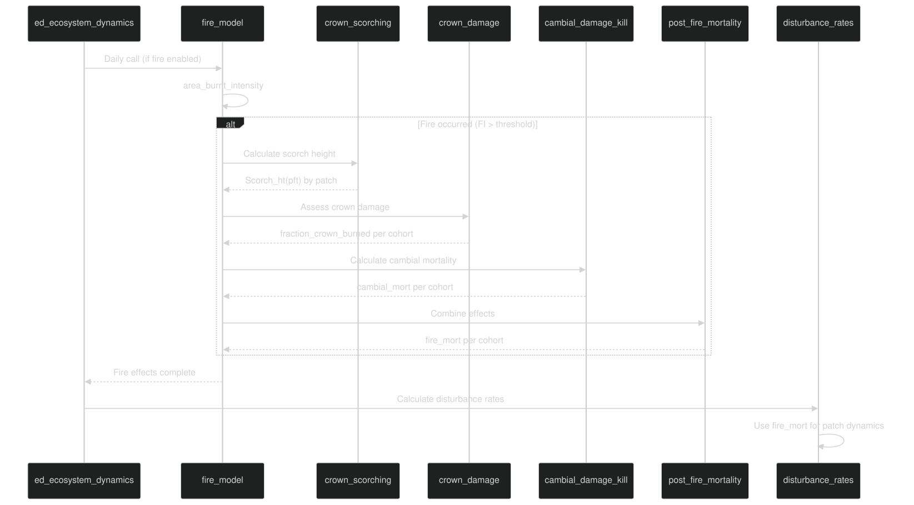

# Fire Effects on Vegetation

Relevant source files

- [biogeochem/EDLoggingMortalityMod.F90](https://github.com/jingtao-lbl/fates/blob/e85d9977/biogeochem/EDLoggingMortalityMod.F90)
- [biogeochem/EDMortalityFunctionsMod.F90](https://github.com/jingtao-lbl/fates/blob/e85d9977/biogeochem/EDMortalityFunctionsMod.F90)
- [fire/SFMainMod.F90](https://github.com/jingtao-lbl/fates/blob/e85d9977/fire/SFMainMod.F90)
- [main/EDMainMod.F90](https://github.com/jingtao-lbl/fates/blob/e85d9977/main/EDMainMod.F90)

## Purpose and Scope

This page documents how the SPITFIRE fire model calculates the impacts of fire on individual plant cohorts in FATES. It covers three sequential processes that translate fire behavior into vegetation mortality: (1) crown scorching - calculation of flame scorch height based on fire intensity, (2) crown damage - determination of the fraction of a cohort's crown consumed by flames, and (3) cambial damage - assessment of bark heating that kills the cambium and leads to mortality. These effects are computed for each cohort following fire spread calculations and ultimately determine the `fire_mort` mortality rate applied during patch dynamics.

For information about fire danger, ignition, and spread processes that precede vegetation effects, see [Fire Danger and Ignition](fire/ignition.md) and [Fire Spread and Intensity](fire/spread.md) . For information about how fire mortality contributes to disturbance rates and patch creation, see [Patch Dynamics and Disturbances](core-dynamics/patch_dynamics.md) .

## Fire Effects Calculation Sequence

The fire effects on vegetation are calculated as part of the daily `fire_model` subroutine in [fire/SFMainMod.F90 80-115](https://github.com/jingtao-lbl/fates/blob/e85d9977/fire/SFMainMod.F90#L80-L115) This sequence occurs after fire spread and intensity calculations are complete. The effects are computed in a specific order because each step depends on results from the previous step:

Diagram: Fire Effects Calculation Pipeline

Sources: [fire/SFMainMod.F90 80-115](https://github.com/jingtao-lbl/fates/blob/e85d9977/fire/SFMainMod.F90#L80-L115)

Each patch in the site is evaluated independently. If a patch has `currentPatch%fire == 1` (indicating sufficient fire intensity was reached), the vegetation effect calculations proceed. Otherwise, all fire mortality values remain at zero.

## Crown Scorching

Crown scorching calculates the height to which flames rise above the ground surface, potentially damaging plant canopies. This is based on Byram's (1959) relationship between fire intensity and flame length.

### Scorch Height Calculation

The `crown_scorching` subroutine [fire/SFMainMod.F90 890-951](https://github.com/jingtao-lbl/fates/blob/e85d9977/fire/SFMainMod.F90#L890-L951) implements Van Wagner's (1973) crown scorch model:

Scorch Height Formula:

Where:

- `Scorch_ht(pft)`= scorch height for each PFT (meters)
- `α_SH``fire_alpha_SH`= PFT-specific scorch height parameter ( in parameter file)
- `FI`= fire intensity from Rothermel model (kW/m)

The scorch height is calculated once per patch per PFT if there is tree biomass present and fire occurred. It represents the maximum height reached by convective heat from the fire.

Diagram: Crown Scorch Height Inputs and Outputs

Sources: [fire/SFMainMod.F90 890-951](https://github.com/jingtao-lbl/fates/blob/e85d9977/fire/SFMainMod.F90#L890-L951)

### Implementation Details

The code structure for crown scorching:

Diagram: Crown Scorching Algorithm Flow

The algorithm only calculates scorch height for woody PFTs when tree biomass exists on the patch [fire/SFMainMod.F90 932-936](https://github.com/jingtao-lbl/fates/blob/e85d9977/fire/SFMainMod.F90#L932-L936)

Sources: [fire/SFMainMod.F90 890-951](https://github.com/jingtao-lbl/fates/blob/e85d9977/fire/SFMainMod.F90#L890-L951)

## Crown Damage Assessment

Crown damage determines what fraction of each cohort's crown is consumed by flames based on the relationship between scorch height and cohort structure.

### Fraction Crown Burned Calculation

The `crown_damage` subroutine [fire/SFMainMod.F90 954-1018](https://github.com/jingtao-lbl/fates/blob/e85d9977/fire/SFMainMod.F90#L954-L1018) implements Equation 17 from Thonicke et al. (2010):

Diagram: Crown Damage Decision Tree

### Crown Depth Determination

Crown depth is calculated using the `CrownDepth` allometry function, which determines the vertical extent of the crown based on height and PFT-specific parameters. The canopy bottom is `cohort%height - crown_depth` .

Three Damage Scenarios:

| Scenario | Condition | fraction_crown_burned | 
| --- | --- | --- |
| No damage | Scorch_ht < (height - crown_depth) | 0.0 | 
| Partial damage | (height - crown_depth) ≤ Scorch_ht < height | (Scorch_ht - (height - crown_depth)) / crown_depth | 
| Total damage | Scorch_ht ≥ height | 1.0 | 

The calculation is only performed for woody cohorts ( `prt_params%woody(pft) == itrue` ) [fire/SFMainMod.F90 977](https://github.com/jingtao-lbl/fates/blob/e85d9977/fire/SFMainMod.F90#L977-L977)

Sources: [fire/SFMainMod.F90 954-1018](https://github.com/jingtao-lbl/fates/blob/e85d9977/fire/SFMainMod.F90#L954-L1018)  [biogeophys/FatesAllometryMod.F90](https://github.com/jingtao-lbl/fates/blob/e85d9977/biogeophys/FatesAllometryMod.F90)

## Cambial Damage and Mortality

Cambial damage assesses whether heat from the fire penetrates through the bark to kill the cambium layer. This is a critical determinant of post-fire tree survival.

### Bark Protection and Critical Heating Time

The `cambial_damage_kill` subroutine [fire/SFMainMod.F90 1021-1053](https://github.com/jingtao-lbl/fates/blob/e85d9977/fire/SFMainMod.F90#L1021-L1053) implements the Peterson and Ryan (1986) cambial damage model:

Critical Time Calculation:

Where:

- `τ_c`= critical time to kill cambium (minutes)
- `bt``bark_scaler × dbh`= bark thickness (cm) =

Cambial Mortality Probability:

Where:

- `τ_l``ground_fuel_consumption`= fire residence time (minutes), calculated in
- `τ_l / τ_c ≥ 2.0`When , cambial mortality = 1.0

Diagram: Cambial Damage Calculation

### PFT-Specific Bark Characteristics

Different PFTs have different bark protection levels specified by the `bark_scaler` parameter [fire/SFMainMod.F90 1046](https://github.com/jingtao-lbl/fates/blob/e85d9977/fire/SFMainMod.F90#L1046-L1046) Thicker-barked species are more fire-resistant. The calculation only applies to woody cohorts.

Sources: [fire/SFMainMod.F90 1021-1053](https://github.com/jingtao-lbl/fates/blob/e85d9977/fire/SFMainMod.F90#L1021-L1053)  [fire/SFParamsMod.F90](https://github.com/jingtao-lbl/fates/blob/e85d9977/fire/SFParamsMod.F90)

## Post-Fire Mortality Rate

The `post_fire_mortality` subroutine [fire/SFMainMod.F90 1054-1136](https://github.com/jingtao-lbl/fates/blob/e85d9977/fire/SFMainMod.F90#L1054-L1136) combines crown damage and cambial damage to calculate the overall fire mortality rate for each cohort.

### Combined Mortality Calculation

Total Fire Mortality:

Where:

- `fire_mort`= fraction of cohort killed per day
- `cambial_mort`= probability of cambial kill (0-1)
- `fraction_crown_burned`= fraction of crown consumed (0-1)
- `r_PM`= PFT-specific crown damage mortality parameter

This formulation means that:

- `cambial_mort = 1.0`Complete cambial kill ( ) results in complete mortality regardless of crown damage
- Trees can survive crown damage if cambium is not killed
- `r_PM`The parameter scales the crown damage effect

Diagram: Post-Fire Mortality Calculation

### Mortality Rate Scaling

The calculated `fire_mort` represents the fraction of individuals in a cohort that die per day. This is stored in `currentCohort%fire_mort` and used in subsequent disturbance calculations [fire/SFMainMod.F90 1125-1128](https://github.com/jingtao-lbl/fates/blob/e85d9977/fire/SFMainMod.F90#L1125-L1128)

For non-woody plants (grasses), fire mortality is calculated differently because they don't experience cambial damage in the same way. Their mortality depends primarily on the fraction of aboveground biomass consumed.

Sources: [fire/SFMainMod.F90 1054-1136](https://github.com/jingtao-lbl/fates/blob/e85d9977/fire/SFMainMod.F90#L1054-L1136)

## Integration with Disturbance Dynamics

Fire mortality rates calculated for cohorts feed into the broader disturbance framework in FATES. The `fire_mort` values are used to compute patch-level disturbance rates.

### Cohort-to-Patch Aggregation

Diagram: Fire Effects to Patch Dynamics Connection

The fire mortality is combined with other mortality sources in the disturbance rate calculation [main/EDPatchDynamicsMod.F90](https://github.com/jingtao-lbl/fates/blob/e85d9977/main/EDPatchDynamicsMod.F90) Specifically:

- `dtype_ifire`Fire mortality contributes to disturbance type
- Weighted by crown area to represent area disturbed
- Only canopy layer cohorts contribute to disturbance-generating mortality
- `spawn_patches()`[main/EDMainMod.F90292](https://github.com/jingtao-lbl/fates/blob/e85d9977/main/EDMainMod.F90#L292-L292)Fire creates new patches via

Sources: [main/EDMainMod.F90 218-223](https://github.com/jingtao-lbl/fates/blob/e85d9977/main/EDMainMod.F90#L218-L223)  [main/EDPatchDynamicsMod.F90](https://github.com/jingtao-lbl/fates/blob/e85d9977/main/EDPatchDynamicsMod.F90)

## Key Data Structures

The fire effects calculations interact with several cohort and patch-level data structures:

### Cohort-Level Fire Variables

| Variable | Type | Description | Set In | 
| --- | --- | --- | --- |
| fire_mort | real(r8) | Fire mortality rate (fraction/day) | post_fire_mortality | 
| fraction_crown_burned | real(r8) | Fraction of crown consumed (0-1) | crown_damage | 
| cambial_mort | real(r8) | Cambial kill probability (0-1) | cambial_damage_kill | 
| lmort_direct | real(r8) | Direct logging mortality | LoggingMortality_frac | 

### Patch-Level Fire Variables

| Variable | Type | Description | Set In | 
| --- | --- | --- | --- |
| Scorch_ht(pft) | real(r8) | Scorch height per PFT (m) | crown_scorching | 
| FI | real(r8) | Fire intensity (kW/m) | area_burnt_intensity | 
| tau_l | real(r8) | Fire residence time (min) | ground_fuel_consumption | 
| fire | integer | Fire occurrence flag (0/1) | area_burnt_intensity | 
| frac_burnt | real(r8) | Fraction of patch burned | area_burnt_intensity | 

Sources: [biogeochem/FatesCohortMod.F90](https://github.com/jingtao-lbl/fates/blob/e85d9977/biogeochem/FatesCohortMod.F90)  [biogeochem/FatesPatchMod.F90](https://github.com/jingtao-lbl/fates/blob/e85d9977/biogeochem/FatesPatchMod.F90)

## PFT Parameters Controlling Fire Effects

Several PFT-specific parameters control vegetation vulnerability to fire:

| Parameter | Symbol | Description | Units | Used In | 
| --- | --- | --- | --- | --- |
| fire_alpha_SH | α_SH | Scorch height coefficient | - | crown_scorching | 
| bark_scaler | - | Bark thickness allometry | cm/cm | cambial_damage_kill | 
| crown_damage_mort | r_PM | Crown damage mortality rate | - | post_fire_mortality | 

These parameters are loaded from the FATES parameter file and stored in `EDPftvarcon_inst`  [biogeochem/EDPftvarcon.F90](https://github.com/jingtao-lbl/fates/blob/e85d9977/biogeochem/EDPftvarcon.F90)

Sources: [fire/SFMainMod.F90 935-1128](https://github.com/jingtao-lbl/fates/blob/e85d9977/fire/SFMainMod.F90#L935-L1128)  [biogeochem/EDPftvarcon.F90](https://github.com/jingtao-lbl/fates/blob/e85d9977/biogeochem/EDPftvarcon.F90)

## Execution Context and Frequency

Fire effects are calculated daily within the `ed_ecosystem_dynamics` routine when fire occurs:

Diagram: Fire Effects in Daily Dynamics Sequence

The fire model is called after phenology but before disturbance rate calculations [main/EDMainMod.F90 218](https://github.com/jingtao-lbl/fates/blob/e85d9977/main/EDMainMod.F90#L218-L218) ensuring that fire mortality is available for patch creation in the same timestep.

Sources: [main/EDMainMod.F90 141-317](https://github.com/jingtao-lbl/fates/blob/e85d9977/main/EDMainMod.F90#L141-L317)

## Mathematical Summary

The complete chain of fire effects calculations:

This mortality rate is then used in disturbance calculations to determine the area and composition of newly created burned patches.

Sources: [fire/SFMainMod.F90 890-1136](https://github.com/jingtao-lbl/fates/blob/e85d9977/fire/SFMainMod.F90#L890-L1136)