# Fire Danger and Ignition

Relevant source files

- [biogeophys/FatesPlantRespPhotosynthMod.F90](https://github.com/jingtao-lbl/fates/blob/e85d9977/biogeophys/FatesPlantRespPhotosynthMod.F90)
- [fire/SFMainMod.F90](https://github.com/jingtao-lbl/fates/blob/e85d9977/fire/SFMainMod.F90)
- [main/EDParamsMod.F90](https://github.com/jingtao-lbl/fates/blob/e85d9977/main/EDParamsMod.F90)
- [main/EDPftvarcon.F90](https://github.com/jingtao-lbl/fates/blob/e85d9977/main/EDPftvarcon.F90)
- [parameter_files/fates_params_default.cdl](https://github.com/jingtao-lbl/fates/blob/e85d9977/parameter_files/fates_params_default.cdl)

## Purpose and Scope

This page describes how FATES calculates fire danger and processes ignition sources using the SPITFIRE fire model. Fire danger quantifies the probability that environmental conditions will support fire spread, while ignition sources determine where fires can potentially start. Together, these determine whether and where fires occur in a simulation.

For information about fire spread and intensity after ignition, see [Fire Spread and Intensity](fire/spread.md) . For information about how fire affects vegetation, see [Fire Effects on Vegetation](fire/effects.md) .

## Overview

Fire danger and ignition calculations operate at the site level and occur daily as part of the fire model workflow. The system uses the Nesterov Index (a meteorologically-based fire danger metric) to calculate a Fire Danger Index (FDI) representing ignition probability. This FDI is then combined with ignition sources (lightning and optionally anthropogenic) to determine the number of successful fire starts.

Fire Model Execution Flow

Sources: [fire/SFMainMod.F90 80-115](https://github.com/jingtao-lbl/fates/blob/e85d9977/fire/SFMainMod.F90#L80-L115)

## Nesterov Index Calculation

The Nesterov Index (NI) is a cumulative fire danger metric based on daily temperature and humidity. It increases during dry, warm periods and resets when substantial rainfall occurs.

### Daily Calculation Procedure

The `fire_danger_index` subroutine [fire/SFMainMod.F90 118-173](https://github.com/jingtao-lbl/fates/blob/e85d9977/fire/SFMainMod.F90#L118-L173) executes the following steps:

Nesterov Index Data Flow

Sources: [fire/SFMainMod.F90 118-173](https://github.com/jingtao-lbl/fates/blob/e85d9977/fire/SFMainMod.F90#L118-L173)  [fire/SFParamsMod.F90](https://github.com/jingtao-lbl/fates/blob/e85d9977/fire/SFParamsMod.F90)

### Site-Level Calculation

The Nesterov Index is calculated once per site, using meteorological data from the oldest vegetated patch. In no-competition mode, if the oldest patch is bare ground, the next younger (vegetated) patch is used instead [fire/SFMainMod.F90 146-152](https://github.com/jingtao-lbl/fates/blob/e85d9977/fire/SFMainMod.F90#L146-L152)

The accumulated value ( `currentSite%acc_NI` ) persists across days and is used throughout the fire model, including:

- Fire Danger Index calculation
- [Fire Spread and Intensity](fire/spread.md)Fuel moisture calculations (see )

## Fire Danger Index (FDI)

The Fire Danger Index converts the accumulated Nesterov Index into a probability that an ignition will successfully start a spreading fire. This calculation occurs in the `area_burnt_intensity` subroutine [fire/SFMainMod.F90 729-738](https://github.com/jingtao-lbl/fates/blob/e85d9977/fire/SFMainMod.F90#L729-L738)

### FDI Calculation Modes

The calculation depends on the SPITFIRE mode ( `hlm_spitfire_mode` ):

| Mode | Value | FDI Calculation | Cloud-to-Ground Fraction | 
| --- | --- | --- | --- |
| hlm_sf_successful_ignitions_def | Reading successful ignition data | FDI = 1.0 | cg_strikes = 1.0 | 
| Other modes | Using lightning data | FDI = 1 - exp(-SF_val_fdi_alpha * acc_NI) | cg_strikes parameter | 

For typical simulations using lightning data:

where `SF_val_fdi_alpha = 0.000337`  [fire/SFParamsMod.F90](https://github.com/jingtao-lbl/fates/blob/e85d9977/fire/SFParamsMod.F90) is a calibration parameter from Venevsky et al. (2002).

The FDI ranges from 0 (no fire danger) to 1 (extreme fire danger):

- FDI ≈ 0.1: Low fire danger
- FDI ≈ 0.3: Moderate fire danger
- FDI ≈ 0.75: High fire danger
- FDI ≈ 1.0: Extreme fire danger

Sources: [fire/SFMainMod.F90 729-738](https://github.com/jingtao-lbl/fates/blob/e85d9977/fire/SFMainMod.F90#L729-L738)  [fire/SFParamsMod.F90](https://github.com/jingtao-lbl/fates/blob/e85d9977/fire/SFParamsMod.F90)

## Ignition Sources

FATES processes multiple ignition sources that determine the number of potential fire starts per day per km².

### Lightning Ignitions

Lightning strikes are the primary natural ignition source. The number of lightning ignitions is calculated based on the SPITFIRE mode [fire/SFMainMod.F90 748-754](https://github.com/jingtao-lbl/fates/blob/e85d9977/fire/SFMainMod.F90#L748-L754) :

Scalar Lightning Mode ( `hlm_sf_scalar_lightning_def` ):

where:

- `ED_val_nignitions`: Annual lightning strikes per km² (parameter)
- `years_per_day`: Converts annual rate to daily rate
- `cg_strikes`: Fraction of cloud-to-ground strikes (parameter)

External Lightning Data Mode (default):

where `bc_in%lightning24(iofp)` provides observed daily lightning strike data from the host land model.

### Anthropogenic Ignitions

When `hlm_spitfire_mode == hlm_sf_anthro_ignitions_def` , anthropogenic ignitions are added following Li et al. (2012) [fire/SFMainMod.F90 761-767](https://github.com/jingtao-lbl/fates/blob/e85d9977/fire/SFMainMod.F90#L761-L767) :

where:

- `pot_hmn_ign_counts_alpha = 0.0035`: Potential human ignitions per person per month
- `pop_density``bc_in%pop_density`: Population density from boundary conditions ( )
- Division by 30: Approximate conversion from monthly to daily rate

Ignition Source Processing

Sources: [fire/SFMainMod.F90 748-768](https://github.com/jingtao-lbl/fates/blob/e85d9977/fire/SFMainMod.F90#L748-L768)

## Successful Fire Calculation

The number of successful fires ( `currentSite%NF_successful` ) is calculated at the patch level after determining fire intensity [fire/SFMainMod.F90 869-870](https://github.com/jingtao-lbl/fates/blob/e85d9977/fire/SFMainMod.F90#L869-L870) :

This represents the expected number of fires that:

Only fires with intensity ( `currentPatch%FI` ) exceeding `SF_val_fire_threshold` are counted as successful [fire/SFMainMod.F90 866-876](https://github.com/jingtao-lbl/fates/blob/e85d9977/fire/SFMainMod.F90#L866-L876)

## Key Data Structures and Variables

Site-Level Fire Danger Variables

| Variable | Type | Units | Description | Location | 
| --- | --- | --- | --- | --- |
| currentSite%acc_NI | real(r8) | C² | Accumulated Nesterov Index | EDTypesMod.F90 | 
| currentSite%FDI | real(r8) | fraction | Fire Danger Index (0-1) | EDTypesMod.F90 | 
| currentSite%NF | real(r8) | count/km²/day | Number of ignitions | EDTypesMod.F90 | 
| currentSite%NF_successful | real(r8) | count | Successful fires | EDTypesMod.F90 | 

Key Parameters

| Parameter | Default Value | Units | Description | File Reference | 
| --- | --- | --- | --- | --- |
| SF_val_fdi_alpha | 0.000337 | 1/C² | FDI calibration coefficient | fire/SFParamsMod.F90 | 
| SF_val_fdi_a | 17.27 | — | Magnus-Tetens constant | fire/SFParamsMod.F90 | 
| SF_val_fdi_b | 237.3 | — | Magnus-Tetens constant | fire/SFParamsMod.F90 | 
| ED_val_nignitions | — | count/km²/yr | Annual lightning ignitions | main/EDParamsMod.F9057 | 
| cg_strikes | — | fraction | Cloud-to-ground fraction | main/EDParamsMod.F9083-84 | 
| SF_val_fire_threshold | 50.0 | kW/m | Minimum fire intensity threshold | fire/SFParamsMod.F90 | 

Sources: [fire/SFMainMod.F90](https://github.com/jingtao-lbl/fates/blob/e85d9977/fire/SFMainMod.F90)  [fire/SFParamsMod.F90](https://github.com/jingtao-lbl/fates/blob/e85d9977/fire/SFParamsMod.F90)  [main/EDParamsMod.F90 57-84](https://github.com/jingtao-lbl/fates/blob/e85d9977/main/EDParamsMod.F90#L57-L84)

## Integration with Fire Model Workflow

Fire danger and ignition calculations are called early in the daily fire model sequence [fire/SFMainMod.F90 80-115](https://github.com/jingtao-lbl/fates/blob/e85d9977/fire/SFMainMod.F90#L80-L115) :

The calculated `acc_NI` persists across days and is used in:

- **Fire Danger Index**: Determines ignition success probability
- **Fuel Moisture**[fire/SFMainMod.F90268](https://github.com/jingtao-lbl/fates/blob/e85d9977/fire/SFMainMod.F90#L268-L268): Exponential decay of fuel moisture with NI
- **Fire Spread**: Indirectly affects rate of spread through fuel moisture

Sources: [fire/SFMainMod.F90 80-115](https://github.com/jingtao-lbl/fates/blob/e85d9977/fire/SFMainMod.F90#L80-L115)

## SPITFIRE Modes

FATES supports multiple SPITFIRE operational modes controlled by the `hlm_spitfire_mode` parameter:

| Mode Constant | Value | Description | 
| --- | --- | --- |
| hlm_sf_nofire_def | 0 | Fire disabled | 
| hlm_sf_scalar_lightning_def | 1 | Use scalar lightning parameter | 
| hlm_sf_successful_ignitions_def | 2 | Read successful ignition data | 
| hlm_sf_anthro_ignitions_def | 3 | Include anthropogenic ignitions | 

These constants are defined in [FatesInterfaceTypesMod.F90](https://github.com/jingtao-lbl/fates/blob/e85d9977/FatesInterfaceTypesMod.F90) and control the execution path through the fire danger and ignition calculations.

Sources: [fire/SFMainMod.F90 16-19](https://github.com/jingtao-lbl/fates/blob/e85d9977/fire/SFMainMod.F90#L16-L19)  [FatesInterfaceTypesMod.F90](https://github.com/jingtao-lbl/fates/blob/e85d9977/FatesInterfaceTypesMod.F90)