# Fire Dynamics: SPITFIRE

Relevant source files

- [biogeochem/EDLoggingMortalityMod.F90](https://github.com/jingtao-lbl/fates/blob/e85d9977/biogeochem/EDLoggingMortalityMod.F90)
- [biogeochem/EDMortalityFunctionsMod.F90](https://github.com/jingtao-lbl/fates/blob/e85d9977/biogeochem/EDMortalityFunctionsMod.F90)
- [fire/SFMainMod.F90](https://github.com/jingtao-lbl/fates/blob/e85d9977/fire/SFMainMod.F90)
- [main/EDMainMod.F90](https://github.com/jingtao-lbl/fates/blob/e85d9977/main/EDMainMod.F90)

## Purpose and Scope

This document describes the SPITFIRE (SPread and InTensity of FIRE) fire model implementation in FATES. SPITFIRE simulates wildfire occurrence, spread, intensity, fuel consumption, and effects on vegetation. The model calculates fire danger based on environmental conditions, determines ignition probability from lightning and anthropogenic sources, simulates fire spread using the Rothermel equation, and computes fire-induced mortality through crown scorching and cambial damage.

For information about other disturbance types, see Patch Dynamics and Disturbances ( [#3.2](core-dynamics/patch_dynamics.md) ) and Logging and Land Use ( [#8](logging/index.md) ). For mortality processes unrelated to fire, see Mortality Processes ( [#4.4](plant-physiology/mortality.md) ).

## Model Integration and Execution

SPITFIRE executes once per day as part of the ecosystem dynamics loop. Fire is enabled when `hlm_spitfire_mode` is greater than `hlm_sf_nofire_def` and is bypassed for bare-ground patches in no-competition mode.

Sources:  [main/EDMainMod.F90 210-219](https://github.com/jingtao-lbl/fates/blob/e85d9977/main/EDMainMod.F90#L210-L219)  [fire/SFMainMod.F90 80-115](https://github.com/jingtao-lbl/fates/blob/e85d9977/fire/SFMainMod.F90#L80-L115)

### Fire Model Modes

SPITFIRE supports multiple operational modes controlled by `hlm_spitfire_mode` :

| Mode | Description | Ignition Source | 
| --- | --- | --- |
| hlm_sf_nofire_def | Fire disabled | N/A | 
| hlm_sf_scalar_lightning_def | Lightning from parameter | ED_val_nignitions parameter | 
| hlm_sf_successful_ignitions_def | Observed ignitions | External data, forced FDI=1 | 
| hlm_sf_anthro_ignitions_def | Lightning + anthropogenic | Lightning data + population density | 

Sources:  [fire/SFMainMod.F90 15-19](https://github.com/jingtao-lbl/fates/blob/e85d9977/fire/SFMainMod.F90#L15-L19)  [fire/SFMainMod.F90 730-768](https://github.com/jingtao-lbl/fates/blob/e85d9977/fire/SFMainMod.F90#L730-L768)

## Fire Execution Pipeline

The fire model executes a sequence of subroutines that build upon each other to determine fire occurrence and effects. Each subroutine updates site or patch-level state variables that subsequent routines consume.

Sources:  [fire/SFMainMod.F90 102-114](https://github.com/jingtao-lbl/fates/blob/e85d9977/fire/SFMainMod.F90#L102-L114)

## Fire Danger and Ignition

### Nesterov Fire Danger Index

The Nesterov Index (NI) accumulates daily to represent fire danger based on temperature and moisture conditions. The index resets when precipitation exceeds 3 mm/day.

Daily NI Change:

- `rainfall > 3.0 mm/day``acc_NI = 0`If :
- `d_NI = (T - T_dewpoint) * T`Else: , where T is in Celsius

The Fire Danger Index (FDI) translates accumulated NI into ignition probability:

where α ( `SF_val_fdi_alpha` ) scales the sensitivity.

Sources:  [fire/SFMainMod.F90 118-173](https://github.com/jingtao-lbl/fates/blob/e85d9977/fire/SFMainMod.F90#L118-L173)

Sources:  [fire/SFMainMod.F90 156-172](https://github.com/jingtao-lbl/fates/blob/e85d9977/fire/SFMainMod.F90#L156-L172)

### Ignition Sources

SPITFIRE combines natural (lightning) and anthropogenic ignition sources:

Lightning Ignitions:

- `NF = ED_val_nignitions * years_per_day * cg_strikes`Scalar mode:
- `NF = bc_in%lightning24 * cg_strikes`Data mode:
- `cg_strikes``cg_strikes`is the fraction of cloud-to-ground strikes (parameter )

Anthropogenic Ignitions (when enabled):

Based on Li et al. (2012) parameterization of human ignitions.

Total ignition rate:  `site%NF = lightning + anthropogenic` (counts per km² per day)

Sources:  [fire/SFMainMod.F90 748-768](https://github.com/jingtao-lbl/fates/blob/e85d9977/fire/SFMainMod.F90#L748-L768)

## Fuel Characterization

### Fuel Classes

SPITFIRE represents six fuel size classes ( `NFSC=6` ), four of which are coarse woody debris (CWD):

| Index | Name | Description | Use in ROS | 
| --- | --- | --- | --- |
| TW_SF (1) | Twigs | 1-hour fuels | Yes | 
| 2 | Small branches | 10-hour fuels | Yes | 
| LB_SF (3) | Large branches | 100-hour fuels | Yes | 
| TR_SF (4) | Trunks | 1000-hour fuels | No (consumption only) | 
| DL_SF (5) | Dead leaves | Fine litter | Yes | 
| LG_SF (6) | Live grass | Herbaceous biomass | Yes | 

Sources:  [fire/SFMainMod.F90 30-36](https://github.com/jingtao-lbl/fates/blob/e85d9977/fire/SFMainMod.F90#L30-L36)  [fire/SFMainMod.F90 218-250](https://github.com/jingtao-lbl/fates/blob/e85d9977/fire/SFMainMod.F90#L218-L250)

### Fuel Moisture

Fuel moisture for each class depends on the Nesterov Index and surface-area-to-volume ratio (SAV):

Live grass retains more moisture than dead fuels:

Effective Moisture: Averaged over fuel classes (excluding trunks), weighted by fuel fraction:

Sources:  [fire/SFMainMod.F90 266-281](https://github.com/jingtao-lbl/fates/blob/e85d9977/fire/SFMainMod.F90#L266-L281)  [fire/SFMainMod.F90 286-301](https://github.com/jingtao-lbl/fates/blob/e85d9977/fire/SFMainMod.F90#L286-L301)

### Fuel Properties

Key bulk fuel properties averaged across classes (excluding trunks):

- **Bulk Density**`patch%fuel_bulkd``SF_val_FBD`( ): Mass per volume (kg/m³) from
- **Surface-Area-to-Volume**`patch%fuel_sav``SF_val_SAV`( ): Fire spread parameter (cm⁻¹) from
- **Moisture of Extinction**`patch%fuel_mef`( ): Maximum moisture for combustion

Sources:  [fire/SFMainMod.F90 282-301](https://github.com/jingtao-lbl/fates/blob/e85d9977/fire/SFMainMod.F90#L282-L301)

## Fire Spread Dynamics

### Rothermel Rate of Spread

SPITFIRE uses the Rothermel (1972) fire spread model adapted from Thonicke et al. (2010). The forward rate of spread (ROS) depends on fuel properties, moisture, and wind.

Sources:  [fire/SFMainMod.F90 449-592](https://github.com/jingtao-lbl/fates/blob/e85d9977/fire/SFMainMod.F90#L449-L592)

### Key Equations

Packing Ratio:

Heat of Pre-ignition (kJ/kg):

Wind Effect (dimensionless):

Rate of Spread (m/min):

Sources:  [fire/SFMainMod.F90 493-586](https://github.com/jingtao-lbl/fates/blob/e85d9977/fire/SFMainMod.F90#L493-L586)

### Wind Speed Adjustment

Wind speed is modified by vegetation structure. Trees reduce wind more than grass:

Tree and grass fractions are computed from cohort crown areas, with grass capped to avoid double-counting when under tree canopy.

Sources:  [fire/SFMainMod.F90 348-446](https://github.com/jingtao-lbl/fates/blob/e85d9977/fire/SFMainMod.F90#L348-L446)

## Fuel Consumption

### Ground Fuel Burning

Fuel consumption depends on moisture relative to extinction values. Three moisture regimes determine burn fraction:

Very Dry (moisture ≤ min_moisture):

Low-Medium Moisture (min < moisture ≤ mid):

Medium-High Moisture (mid < moisture < 1.0):

Very Wet (moisture ≥ 1.0):

Live grass has a maximum burn fraction of 0.8 to prevent complete removal.

Sources:  [fire/SFMainMod.F90 595-683](https://github.com/jingtao-lbl/fates/blob/e85d9977/fire/SFMainMod.F90#L595-L683)  [fire/SFMainMod.F90 619-647](https://github.com/jingtao-lbl/fates/blob/e85d9977/fire/SFMainMod.F90#L619-L647)

### Fire Residence Time

The duration of lethal heating ( `patch%tau_l` ) determines cambial damage:

Based on Peterson & Ryan (1986) for cambial heating.

Sources:  [fire/SFMainMod.F90 666-672](https://github.com/jingtao-lbl/fates/blob/e85d9977/fire/SFMainMod.F90#L666-L672)

### Total Fuel Consumed

Only fuels affecting rate of spread ( `TFC_ROS` ) are summed (excludes trunks):

Where `FC_ground(c) = burnt_frac_litter(c) * fuel_mass(c)` for each class.

Sources:  [fire/SFMainMod.F90 655-676](https://github.com/jingtao-lbl/fates/blob/e85d9977/fire/SFMainMod.F90#L655-L676)

## Fire Area and Intensity

### Burned Area Calculation

Fire spreads as an ellipse with length-to-breadth ratio ( `lb` ) determined by wind speed and vegetation type:

Forest Fuels (tree_fraction > 0.55):

Grassland Fuels (tree_fraction ≤ 0.55):

Ellipse Dimensions:

Daily Burned Area:

Sources:  [fire/SFMainMod.F90 687-885](https://github.com/jingtao-lbl/fates/blob/e85d9977/fire/SFMainMod.F90#L687-L885)  [fire/SFMainMod.F90 803-844](https://github.com/jingtao-lbl/fates/blob/e85d9977/fire/SFMainMod.F90#L803-L844)

### Fire Intensity

Fire intensity (kW/m) determines vegetation damage:

Fires only proceed if `FI > SF_val_fire_threshold` (default 50 kW/m).

Sources:  [fire/SFMainMod.F90 854-876](https://github.com/jingtao-lbl/fates/blob/e85d9977/fire/SFMainMod.F90#L854-L876)

### Fire Duration

Fire duration scales with fire danger:

Default parameters: `max_duration = 240 min` , `duration_slope = -10` .

Sources:  [fire/SFMainMod.F90 784-791](https://github.com/jingtao-lbl/fates/blob/e85d9977/fire/SFMainMod.F90#L784-L791)

## Fire Effects on Vegetation

### Crown Scorching

Scorch height is calculated from fire intensity using a power-law relationship:

This follows Van Wagner (1973) and Byram (1959). The parameter `fire_alpha_SH` is PFT-specific and controls scorch sensitivity.

Sources:  [fire/SFMainMod.F90 890-951](https://github.com/jingtao-lbl/fates/blob/e85d9977/fire/SFMainMod.F90#L890-L951)  [fire/SFMainMod.F90 935](https://github.com/jingtao-lbl/fates/blob/e85d9977/fire/SFMainMod.F90#L935-L935)

### Crown Damage Fraction

The fraction of crown burned depends on scorch height relative to crown position:

Sources:  [fire/SFMainMod.F90 954-1018](https://github.com/jingtao-lbl/fates/blob/e85d9977/fire/SFMainMod.F90#L954-L1018)  [fire/SFMainMod.F90 981-1000](https://github.com/jingtao-lbl/fates/blob/e85d9977/fire/SFMainMod.F90#L981-L1000)

### Cambial Damage Mortality

Bark protects cambium from heat damage. Cambial mortality depends on bark thickness and heating duration:

Critical Time to Kill Cambium:

Mortality Probability:

Based on Peterson and Ryan (1986).

Sources:  [fire/SFMainMod.F90 1021-1069](https://github.com/jingtao-lbl/fates/blob/e85d9977/fire/SFMainMod.F90#L1021-L1069)  [fire/SFMainMod.F90 1045-1056](https://github.com/jingtao-lbl/fates/blob/e85d9977/fire/SFMainMod.F90#L1045-L1056)

### Post-Fire Mortality

Total fire mortality combines crown and cambial damage, with additional impact mortality:

For trees without crown ( `canopy_layer ≤ 1` ), crown fraction is set to zero.

Additional impact mortality occurs in lower canopy layers due to falling trees and burnout from above.

Sources:  [fire/SFMainMod.F90 1071-1156](https://github.com/jingtao-lbl/fates/blob/e85d9977/fire/SFMainMod.F90#L1071-L1156)  [fire/SFMainMod.F90 1128-1130](https://github.com/jingtao-lbl/fates/blob/e85d9977/fire/SFMainMod.F90#L1128-L1130)

## Key Data Structures

### Site-Level Fire State

Sources:  [biogeochem/EDTypesMod.F90](https://github.com/jingtao-lbl/fates/blob/e85d9977/biogeochem/EDTypesMod.F90)

### Patch-Level Fire Properties

Sources:  [biogeochem/EDTypesMod.F90](https://github.com/jingtao-lbl/fates/blob/e85d9977/biogeochem/EDTypesMod.F90)

### Cohort-Level Fire Effects

Sources:  [biogeochem/FatesCohortMod.F90](https://github.com/jingtao-lbl/fates/blob/e85d9977/biogeochem/FatesCohortMod.F90)

## Parameter Configuration

### Global Fire Parameters

Fire parameters are defined in `SFParamsMod` and the parameter file:

Fire Spread:

- `SF_val_fdi_alpha`: Nesterov Index sensitivity (0.000337)
- `SF_val_fire_threshold`: Minimum fire intensity (50 kW/m)
- `SF_val_max_durat`: Maximum fire duration (240 min)
- `SF_val_durat_slope`: Duration sensitivity (-10)

Fuel Properties:

- `SF_val_SAV(NFSC)`: Surface-area-to-volume by fuel class
- `SF_val_FBD(NFSC)`: Fuel bulk density by class
- `SF_val_CWD_frac(ncwd)`: Partitioning to CWD pools
- `SF_val_miner_total`: Mineral content fraction (0.055)
- `SF_val_fuel_energy`: Heat content (18000 kJ/kg)

Ignition:

- `cg_strikes`: Cloud-to-ground lightning fraction (parameter)
- `ED_val_nignitions`: Scalar lightning rate (parameter)

Sources:  [fire/SFParamsMod.F90](https://github.com/jingtao-lbl/fates/blob/e85d9977/fire/SFParamsMod.F90)  [parameter_files/fates_params_default.cdl](https://github.com/jingtao-lbl/fates/blob/e85d9977/parameter_files/fates_params_default.cdl)

### PFT-Specific Fire Parameters

Fire sensitivity varies by plant functional type:

These parameters control vulnerability to crown scorching and cambial damage.

Sources:  [main/EDPftvarcon.F90](https://github.com/jingtao-lbl/fates/blob/e85d9977/main/EDPftvarcon.F90)

### Moisture-Dependent Burning

Fuel consumption thresholds by class defined in `SFParamsMod` :

- `SF_val_min_moisture(NFSC)`: Lower moisture threshold
- `SF_val_mid_moisture(NFSC)`: Upper moisture threshold
- `SF_val_low_moisture_Coeff(NFSC)`: Linear coefficient (low range)
- `SF_val_low_moisture_Slope(NFSC)`: Linear slope (low range)
- `SF_val_mid_moisture_Coeff(NFSC)`: Linear coefficient (mid range)
- `SF_val_mid_moisture_Slope(NFSC)`: Linear slope (mid range)

Sources:  [fire/SFParamsMod.F90](https://github.com/jingtao-lbl/fates/blob/e85d9977/fire/SFParamsMod.F90)  [fire/SFMainMod.F90 599-601](https://github.com/jingtao-lbl/fates/blob/e85d9977/fire/SFMainMod.F90#L599-L601)

## Integration with Disturbance Framework

Fire-generated disturbance creates new patches through the standard disturbance mechanism. Fire mortality contributes to disturbance rates in `EDPatchDynamicsMod` :

The fire-killed biomass enters litter pools through standard mortality pathways, with spatial distribution controlled by disturbance localization parameters.

Sources:  [main/EDMainMod.F90 218-223](https://github.com/jingtao-lbl/fates/blob/e85d9977/main/EDMainMod.F90#L218-L223)  [biogeochem/EDPatchDynamicsMod.F90](https://github.com/jingtao-lbl/fates/blob/e85d9977/biogeochem/EDPatchDynamicsMod.F90)